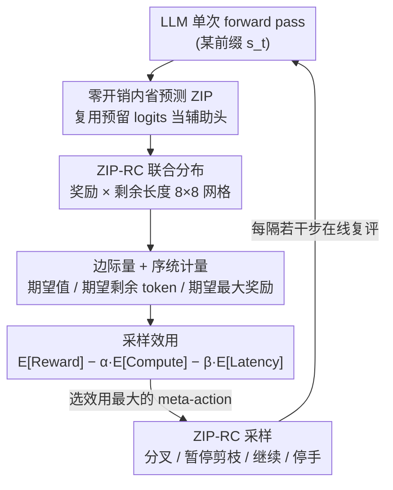

# Zero-Overhead Introspection for Adaptive Test-Time Compute

**会议**: ICLR 2026  
**OpenReview**: [https://openreview.net/forum?id=GqZYGOYuF2](https://openreview.net/forum?id=GqZYGOYuF2)  
**代码**: 待确认  
**领域**: LLM推理 / 测试时计算  
**关键词**: 内省预测、奖励-成本联合分布、自适应测试时计算、Best-of-N、采样效用

## 一句话总结
ZIP-RC 让大模型在每一步解码时**复用输出头里没用上的预留 logits**，零额外开销地预测「最终奖励 × 剩余长度」的联合分布，再用这个分布在线优化一个权衡质量/算力/延迟的「采样效用」，自适应地决定该多采样、该剪枝还是该停手——在混合难度数学基准上以同等甚至更低成本把准确率最多提升 12%。

## 研究背景与动机

**领域现状**：测试时扩展（test-time scaling）已经成为提升 LLM 推理能力的主流手段，典型代表是 Best-of-N（BoN）——并行采 N 条轨迹，再用 verifier / reward model / 多数投票选最好的一条。它靠并行获得性能增益，理论上 N 越大探索越充分。

**现有痛点**：BoN 有两个致命的「不自适应」。其一，它对所有轨迹**一视同仁地跑到结束**，不管某条轨迹中途看起来多没希望——简单题上白白浪费算力，难题上又因为「墙钟时间由最长那条轨迹决定」而拖高延迟。其二，要拿到置信度信号就得额外训练 verifier 或 reward model，等于多挂一个模型、多跑一次 forward pass，**推理成本直接翻倍**。已有的早停/剪枝方法（用一个分类器吐的置信分数中途砍掉弱样本）确实是迈向自适应的第一步，但它们只给一个**标量信号**。

**核心矛盾**：一个标量根本无法刻画推理过程里真正重要的**奖励-成本权衡**——一条低置信度的轨迹如果马上就写完了，可能仍然值得留着；一条高置信度的轨迹如果还要再生成上万个 token，反而可能不划算。而且标量也无法量化「再多采一个样本到底能带来多少边际收益」，因为这个边际收益取决于整个奖励**分布**（尤其是方差），而不是它的期望。

**本文目标**：让模型具备真正的「内省」（introspection）——在生成的每一刻都能预判自己**最终能不能成功（reward）**以及**还要花多少资源（cost）**，并据此把算力花在刀刃上；同时这套内省机制本身**不能带来任何额外推理开销**。

**切入角度**：作者观察到 LLM 的输出头词表里有一批**预留 token / 几乎用不到的 token**（reserved/unused logits）。next-token 预测时这些 logits 反正会被 mask 掉、不参与采样，那为什么不让它们「兼职」去编码一个辅助预测？这样辅助信号就和 next-token 概率在**同一次 forward pass** 里一起算出来，零额外模型、零架构改动、零额外前向。

**核心 idea**：用预留 logits 编码「奖励 × 剩余长度」的**联合分布**（而非标量），把它喂给一个权衡奖励/算力/延迟的采样效用函数，在线选择 meta-action 来自适应分配测试时计算。

## 方法详解

### 整体框架
方法分两层。底层是 **ZIP（零开销内省预测）**：一个通用机制，把输出头里一段固定的预留 token logits 重新解释成一个辅助预测器的参数，采样前把这些 logits 的概率质量 mask 掉，于是同一次 forward pass 同时产出「词表上的解码分布」和「预留位上的辅助预测」。在 ZIP 之上实例化出 **ZIP-RC（reward-cost）**：让辅助预测变成一个 $B_V \times B_T$ 的网格，建模「最终期望奖励」与「剩余生成长度」的联合分布。最上层是 **ZIP-RC 采样**：把测试时计算形式化成一个 meta-MDP（状态是当前所有部分生成构成的前缀树，meta-action 是「选哪些前缀去延续/分叉」），用 ZIP-RC 的联合分布闭式计算一个**采样效用**，在线选取让效用最大的 meta-action——从而在质量、算力、延迟三者间自适应权衡。

整条管线是「预留 logits → 联合分布 → 边际量/序统计量 → 采样效用 → meta-action 决策」的串行+反馈结构，适合用框架图鸟瞰：

### 关键设计

**1. ZIP：把预留 logits 改造成零开销辅助头**

痛点直击「要内省就得多挂模型、推理翻倍」。ZIP 的做法是：设词表为 $V$，里面有一段固定连续的预留 token 集合 $\mathcal{R}\subset V$（论文里典型取 64 个）。解码到第 $t$ 步时模型吐出 logits $z_t\in\mathbb{R}^{|V|}$，ZIP 把 $z_t$ 落在 $\mathcal{R}$ 上的那部分解释成辅助预测器的参数。采样真实 token 前，先把 $\mathcal{R}$ 的概率质量清零，只在 $V\setminus\mathcal{R}$ 上做 softmax：

$$\pi_\theta(a_t\mid s_t)=\begin{cases}\dfrac{\exp(z_t[a_t])}{\sum_{v\in V\setminus\mathcal{R}}\exp(z_t[v])}, & a_t\in V\setminus\mathcal{R}\\[2mm] 0, & a_t\in\mathcal{R}\end{cases}$$

于是一次前向同时给出 (i) 在 $V\setminus\mathcal{R}$ 上的解码分布、(ii) 从 $z_t[\mathcal{R}]$ 读出的辅助预测，后者**零额外推理成本**。为什么有效：next-token 预测本就不会采到预留 token，这些 logits 原本是「浪费」的容量；ZIP 只是把它们的表达力征用过来，既没改架构也没加前向。训练时对辅助头施加任务损失 $\mathcal{L}_{\text{aux}}$（分类用交叉熵、连续值用 MSE、二值用 Bernoulli NLL），同时用一个 KL 项把策略拉回冻结的原始策略 $\pi$，防止征用 logits 破坏原有生成能力：$\mathcal{L}(s_t)=\mathcal{L}_{\text{aux}}(s_t)+\alpha_{\text{KL}}\,\mathrm{KL}(\pi_\theta(\cdot\mid s_t)\,\|\,\pi(\cdot\mid s_t))$。ZIP 对预测目标本身是**不可知的**，它只是标准化了「辅助预测怎么在推理时零开销地产生」。

**2. ZIP-RC：预测奖励-成本的联合分布而非标量**

痛点直击「标量信号无法刻画奖励-成本权衡、也无法量化多采样的边际收益」。ZIP-RC 用 ZIP 去预测从任意前缀 $s_t$ 出发、用策略 $\pi$ 续写到底的两个随机变量：期望终端奖励 $Z^\pi(s_t)=\mathbb{E}[R(s_T)]$ 和剩余长度 $L^\pi(s_t)=|s_T|-|s_t|$。把奖励区间离散成 $B_V$ 个桶、长度离散成 $B_T$ 个桶（论文示意 8×8），每个 $(b,\ell)$ 网格格子分配一个预留 token，索引为 $i_{b,\ell}=i_{\mathcal{R}}+(b-1)B_T+(\ell-1)$，再 softmax 成联合分布：

$$p_\theta(b,\ell\mid s_t)=\frac{\exp(z_t^{\text{aux}}(b,\ell))}{\sum_{b'}\sum_{\ell'}\exp(z_t^{\text{aux}}(b',\ell'))}$$

训练目标对每个前缀按真实落桶 $(b^*,\ell^*)$ 做交叉熵 $\mathcal{L}_{\text{aux}}(s_t)=-\log p_\theta(b^*,\ell^*\mid s_t)$。一个关键且反直觉的选择是：奖励轴建模的是**估计价值** $\hat V(s_T)$（由一个 critic 给出）而不是实际 0/1 奖励 $R(s_T)$。原因有二——(i) 这正好对齐了 BoN 的真实选择目标（BoN 选的是 $\arg\max_i \hat V(s_T^{(i)})$）；(ii) 实际环境奖励之间不能假设独立（无法做闭式序统计量），但它们的期望 $V(s_T)$ 可以，于是「期望最大奖励」这类序统计量能闭式算出来。从联合分布还能边缘化出两个可解释信号：期望价值 $V^\pi(s_t)\approx\sum_b \frac{v_b+v_{b+1}}{2}q^V_\theta(b\mid s_t)$（当置信度/最终选样依据）和期望剩余 token 数 $\mathbb{E}[L^\pi(s_t)]\approx\sum_\ell \frac{t_\ell+t_{\ell+1}}{2}q^L_\theta(\ell\mid s_t)$（当「还要想多久」的 thinking-time 信号）。为什么有效：有了**整个分布**才能算方差——当预测奖励分布方差大时，多采样能显著抬高期望最大奖励；方差小（已有一条轨迹明显占优）时再采样就是浪费。

**3. 采样效用：把测试时计算变成可闭式求解的资源分配决策**

痛点直击「以往剪枝靠启发式阈值，没在原理上同时优化成功率和成本」。作者把整个测试时搜索形式化成一个 meta-MDP：meta-状态是当前所有部分生成构成的**前缀树**，meta-action 决定延续/分叉哪些前缀（没选中的前缀是**暂停**而非丢弃），meta-奖励是「最佳答案的最终正确性 − 生成成本」，其中成本同时含**总算力**（所有 token 数之和）和**延迟**（最长轨迹的深度），由系数 $\alpha,\beta$ 调配。最优 meta-策略不可解，于是用一个叫**采样效用**的量去近似最优价值函数——它评估「从当前候选集做 rollout、但能在优化后的未来时刻暂停它们」这个具体可解释策略的价值，本质是把「多采一个样本的边际收益（更可能找到高奖励答案）」对上「多花的算力和时间」。因为 ZIP-RC 给的是联合分布，期望最大奖励、给定暂停时刻表下的期望延迟这类**序统计量都能闭式算出**，且只需轻量 CPU 计算（相对 LLM 前向可忽略）。采样循环作为一个 meta-policy 运行：每隔固定步数评估若干候选 meta-action（暂停弱样本 / 分叉强样本 / 维持现状）的效用，选效用最大者执行下一段解码。直观写出来，效用近似形如 $E[\text{Reward}]-\alpha\,E[\text{Compute}]-\beta\,E[\text{Latency}]$，⚠️ 完整推导见原文附录 A.1/A.2，以原文为准。为什么有效：它把 BoN 那种「固定预算盲采」升级成「在线、随状态变化的动态分配」——难题/弱模型自动多采样，简单题/强模型自动早剪枝。

### 损失函数 / 训练策略
训练数据：合并 DeepScaleR + MATH 训练集 + GSM8K 训练集，每个 prompt 对每个模型采 2 条 on-policy rollout，共约 10 万条；按 ground-truth 答案标注正确性，用来训练每个模型专属的 ZIP-RC 预测器（以及需要训练的 baseline）。损失就是上面的辅助交叉熵 + 策略保持 KL（公式 3）。系数 $\alpha$ 控制算力 vs 延迟的侧重（$\alpha=0.1$ 偏延迟、$\alpha=1.0$ 偏算力），$\beta$ 类似 BoN 里的 N——调大用更多生成成本换更高性能。

## 实验关键数据

模型用三档规模：Qwen3-1.7B（reasoning 模式）、LFM2-1.2B Math、LFM2-350M Math。基准：AIME 2024 / AMC 2023 / MATH-500 / GSM8K，外加一个把四者拼起来的「混合难度」基准（探测跨难度自适应分配）。指标除准确率外，还有归一化算力（按 2N FLOPs 规则、计入 KV cache）和归一化最优延迟（最长轨迹的串行前向数），生成成本 $\text{GenCost}=\alpha\cdot\text{NormCompute}+(1-\alpha)\cdot\text{NormLatency}$。

### 主实验：等成本下的准确率对比（α=0.1）

下表为 Qwen3-1.7B 在各基准上、匹配生成成本时的准确率（ZIP-RC 用 β=0.01、上限 8 样本）：

| 方法 | 生成成本 | AIME2024 | AMC2023 | MATH-500 | GSM8K | 混合 |
|------|---------|----------|---------|----------|-------|------|
| **ZIP-RC 采样** | 1.43 | **65.8** | **90.9** | **94.1** | **92.2** | **92.2** |
| 多数投票 MV | 1.40 | 53.1 | 87.9 | 93.0 | 91.2 | 91.0 |
| MV + 长度剪枝 | 1.46 | 25.1 | 58.5 | 84.7 | 91.6 | 88.0 |
| Weighted BoN（外部 RM） | 1.43 | 54.7 | 86.5 | 92.6 | 91.4 | 91.0 |
| Weighted BoN（自评 GenRM） | 1.40 | 59.4 | 89.1 | 93.6 | 91.6 | 91.6 |
| ZIP-RC reward 剪枝（消融） | 1.33 | 43.3 | 86.0 | 90.3 | 89.6 | 88.9 |

最难的 AIME 2024 上，ZIP-RC 在更低成本下比 MV 高约 **12.7 个点**（65.8 vs 53.1），也明显超过两种 Weighted BoN。三档模型上结论一致：在 LFM2-350M 上 ZIP-RC 把混合基准从 MV 的 68.8 提到 74.1、且成本 1.49 < MV 的 1.70（最大相对成本降幅约 40%）。

### 预测精度与消融

ZIP-RC 的辅助预测本身要靠谱才有意义。下表是预测质量（生成开始处用 Total Variation 衡量联合分布、结束处用阈值 0.5 的分类指标衡量奖励预测）：

| 模型 | 起点 TV（越小越好） | F1 | 准确率 | 错误答案召回 |
|------|----------------------|----|--------|--------------|
| Qwen3-1.7B | 0.46 | 0.91 | 0.88 | 0.82 |
| LFM2-1.2B | 0.45 | 0.91 | 0.87 | 0.69 |
| LFM2-350M | 0.48 | 0.80 | 0.82 | 0.87 |

关键消融是「**ZIP-RC reward 剪枝**」——它用同一套 ZIP-RC 实时信号，但只按期望奖励阈值（0.4）直接砍弱样本，**不做采样效用优化**。对比主表可见它在所有模型/基准上都低于完整 ZIP-RC 采样（如 Qwen3-1.7B AIME 43.3 vs 65.8，混合 88.9 vs 92.2），证明真正的增益来自「联合分布 + 效用优化」的原理化决策，而不仅仅是有了实时奖励信号。「MV + 长度剪枝」这条 sanity check 在 AIME/AMC 上崩盘（25.1 / 58.5），说明 ZIP-RC 的延迟收益并非靠「砍掉死循环长样本」这种粗暴手段。

### 关键发现
- **效用优化是增益主力**：去掉效用、只按期望奖励阈值剪枝（reward 剪枝消融）会显著掉点，尤其在难题上，说明「整个联合分布 + 序统计量」比「一个标量阈值」强很多。
- **自适应分配真的发生了**：难题（AIME/AMC）和弱模型上 ZIP-RC 自动多采样，简单题/强模型上激进早剪——混合难度基准上这种「按需分配」体现得最明显。
- **可调的 Pareto 前沿**：α 控算力 vs 延迟侧重、β 类比 BoN 的 N，扫这两个系数能画出平滑且严格压过 MV 的质量-算力-延迟前沿；因为上限 8 样本，达到 pass@8 后前沿饱和。
- **校准良好**：起点联合分布的 TV ≈ 0.45–0.48，终点奖励预测 F1 高达 0.91，说明「同一次前向里顺带预测」并不牺牲预测可靠性。

## 亮点与洞察
- **「零开销」是真零开销**：复用本就被 mask 掉的预留/unused logits 当辅助头，没有额外模型、额外前向或架构改动——这点比「再训一个 verifier、推理翻倍」的传统路线优雅得多，也是论文标题的底气所在。
- **从标量到分布是核心认知升级**：只有拿到整个奖励分布（尤其方差）才能闭式算「期望最大奖励」「期望延迟」这类序统计量，从而原理化地回答「再采一个样本值不值」。用 $\hat V(s_T)$ 而非实际奖励来对齐 BoN 选择目标 + 保证序统计量可闭式，是个很讲究的细节。
- **把推理当资源分配问题**：meta-MDP（前缀树状态 + 暂停/分叉/延续 meta-action）+ 采样效用，这套形式化让「测试时计算」从静态固定预算变成动态在线调度，思路可迁移到任何并行采样 + 选择的场景（代码生成、agent 多路探索等）。
- **辅助头的通用性**：ZIP 对预测目标不可知，奖励-成本只是一个实例——同样的「征用预留 logits」思路可以零开销地塞进任何 token 级辅助预测（置信度、难度、工具调用信号等）。

## 局限与展望
- **依赖采样多样性**（作者承认）：方法的收益建立在 LLM 能采出足够多样的样本上。若把初始样本数翻倍但新样本和旧的差不多，ZIP-RC（以及任何 BoN 类方法）都无法再提性能。作者把「如何提升推理时样本多样性」（如混合 prompt 甚至混合模型）列为重要未来方向。
- **奖励轴依赖一个 critic $\hat V$**：联合分布的奖励维度建模的是估计价值而非真实奖励，critic 本身的偏差/校准会传导到效用计算里；论文用约 10 万条标注 rollout 训 critic，泛化到训练分布外的题型时表现如何未充分展开。
- **只验证了数学推理**：实验全在数学基准（AIME/AMC/MATH/GSM8K），是否能迁移到代码、开放域问答、agent 这类奖励更难定义的任务，作者也把「应用到多样领域」列为待验证。
- **8 样本上限带来前沿饱和**：受限于 pool 上限 8，性能前沿在达到 pass@8 后就饱和，更大规模并行下的行为需进一步验证。
- ⚠️ 采样效用的完整闭式表达与 meta-MDP 推导在原文附录（A.1/A.2），正文只给了高层概述，具体系数归一化、搜索空间裁剪等实现细节以原文为准。

## 相关工作与启发
- **vs Best-of-N / Weighted BoN**：BoN 固定预算盲采、每条轨迹都跑到底；本文用实时联合分布在线决定暂停/分叉/继续，等成本下准确率更高（AIME 上最多 +12%），且同时省算力又省延迟。Weighted BoN 靠外部 RM 选样会让 FLOPs 翻倍，ZIP-RC 零开销。
- **vs 标量置信度早停/剪枝**（Fu et al. 2025、Manvi et al. 2024）：它们用一个标量分数 + 启发式阈值砍样本，无法刻画奖励-成本权衡也无法量化多采样边际收益；本文用整个联合分布 + 效用优化，消融（reward 剪枝）直接证明「分布+效用」比「标量阈值」强。
- **vs Process Reward Models（PRM）**：PRM 多用于改训练信号、给中间步打分；本文目标不同——把过程级信号变成**推理时的直接控制旋钮**（utility-aware inference），而非训练监督。
- **vs 把模型 logits 当 reward 的工作**（Ren et al. 2023）：本文沿这条「内省」方向往前走，从标量正确性预测升级为「每个 token 上预测未来奖励 × 未来成本的联合分布」。
- **与推测解码（speculative decoding）互补**：后者在 token 级加速生成，本文在轨迹/搜索级优化分配，二者正交可叠加。

## 评分
- 新颖性: ⭐⭐⭐⭐⭐ 「复用预留 logits 做零开销内省」+「预测奖励-成本联合分布而非标量」+「meta-MDP 采样效用」三点组合很有想象力。
- 实验充分度: ⭐⭐⭐⭐ 三档模型 × 五个基准 + 预测精度验证 + 强消融（reward 剪枝），扎实；但只覆盖数学领域、样本上限 8。
- 写作质量: ⭐⭐⭐⭐ 动机推导清晰、图 1 把整套机制可视化得很好；核心效用推导下放附录，正文略抽象。
- 价值: ⭐⭐⭐⭐⭐ 零开销 + 自适应同时省算力/延迟，对长推理时代的测试时扩展有直接落地价值。

<!-- RELATED:START -->

## 相关论文

- [\[ICLR 2026\] Strategic Scaling of Test-Time Compute: A Bandit Learning Approach](strategic_scaling_of_test-time_compute_a_bandit_learning_approach.md)
- [\[ICLR 2026\] T1: Tool-Integrated Verification for Test-Time Compute Scaling in Small Language Models](t1_tool-integrated_verification_for_test-time_compute_scaling_in_small_language_.md)
- [\[ICLR 2026\] Mode-conditioning unlocks superior test-time compute scaling](mode-conditioning_unlocks_superior_test-time_compute_scaling.md)
- [\[ICLR 2026\] e3: Learning to Explore Enables Extrapolation of Test-Time Compute for LLMs](e3_learning_to_explore_enables_extrapolation_of_test-time_compute_for_llms.md)
- [\[ICLR 2026\] ROC-n-Reroll: How Verifier Imperfection Affects Test-Time Scaling](roc-n-reroll_how_verifier_imperfection_affects_test-time_scaling.md)

<!-- RELATED:END -->
