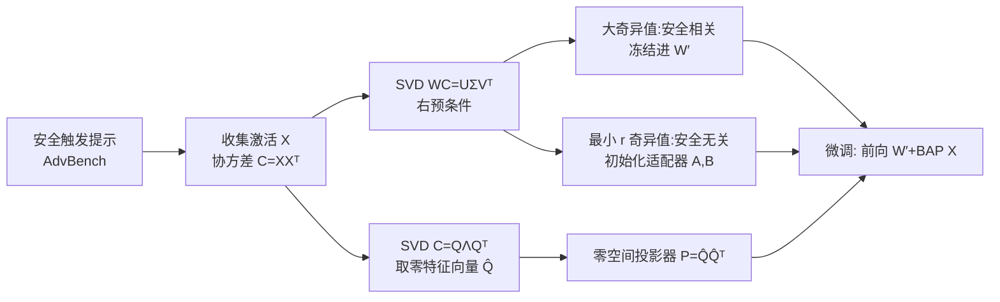

# A Guardrail for Safety Preservation: When Safety-Sensitive Subspace Meets Harmful-Resistant Null-Space

**会议**: ICLR 2026  
**OpenReview**: [https://openreview.net/forum?id=887vde4ZAW](https://openreview.net/forum?id=887vde4ZAW)  
**代码**: 待确认  
**领域**: LLM 安全 / 安全对齐保持 / 参数高效微调  
**关键词**: 安全对齐, 微调安全, LoRA, 子空间分解, 零空间投影  

## 一句话总结
GuardSpace 用「协方差预条件 SVD 把安全相关权重剥离冻结 + 零空间投影约束适配器更新」两道关卡，让 LLM 在下游微调时几乎不掉安全对齐，同时下游精度还略涨。

## 研究背景与动机
**领域现状**：对齐过的 LLM（GPT-4、Llama 等）靠 SFT/RLHF 学会了对恶意指令的拒答行为，但实际部署中工程师常用全量微调或 LoRA 把模型适配到下游任务。

**现有痛点**：安全对齐在微调阶段非常脆弱——**即便微调数据完全无害，或只用 LoRA 训极少量参数，模型原有的拒答行为也会被轻易破坏**，微调后开始对「如何制造炸弹」之类的提示给出有害回答。

**核心矛盾**：现有防御按阶段分为对齐期、微调期、微调后三类。对齐期与微调后方法难以在安全与下游性能间取得好权衡；而现有微调期方法**没有显式地识别出哪些权重分量是安全相关的、哪些更新方向是有害的**，于是无法有针对性地化解「保安全」和「保任务效果」之间的训练冲突。

**本文目标**：在低秩适配下游任务的全程中保住安全对齐，同时不牺牲（甚至提升）下游任务精度。

**核心 idea**：**显式分离 + 双重约束**——先把预训练权重拆成「安全相关」与「安全无关」两部分，只让安全无关的部分可学；再用一个零空间投影器把适配器的更新约束在「对有害输入不产生任何影响」的子空间里，无论适配器怎么训，对有害提示的输出都保持不变。

## 方法详解

### 整体框架
GuardSpace 在微调开始前，先用一批「安全触发提示」（AdvBench 的有害提示）喂进对齐模型，对每个线性层收集输入激活 $X$ 并算协方差 $C = XX^\top$。基于 $C$ 做两件事：一是用 $C$ 作右预条件对权重做 SVD，把安全相关分量冻结、安全无关分量拿来初始化低秩适配器；二是对 $C$ 求零空间，构造投影器约束适配器更新。两道关卡叠加，构成保护安全对齐的「护栏」。

### 关键设计

**1. 安全敏感子空间初始化：用协方差预条件 SVD 把安全权重挑出来冻结。** 普通 SVD 只看权重 $W$ 本身的能量分布，无法区分哪些方向负责安全。本文借鉴「右预条件能凸显与 $C$ 相关能力」的思路，对 $WC$ 做 SVD：$\text{SVD}(WC) = U\Sigma V^\top = \sum_i \sigma_i u_i v_i^\top$。由于 $C$ 来自安全触发提示的激活，**大奇异值 $\sigma_i$ 对应的分量恰好主导了模型对有害输入的安全能力，而小奇异值分量贡献微乎其微**。为了保证初始化不改变预训练模型的推理输出，把权重重构为 $\hat{W} = \text{SVD}(WC)C^{-1} = U\Sigma(V^\top C^{-1})$（$C$ 不可逆时自适应往对角线加正值直到满足可逆）。于是冻结大奇异值分量保住安全，把**最小 $r$ 个奇异值**对应的安全无关分量拆成两个适配器：$B = U[:,-r:]\sqrt{\Sigma[-r:]}$，$A = \sqrt{\Sigma[-r:]}(V^\top C^{-1})[-r:,:]$。相比 LoRA 从零初始化适配器，从 $BA$（剥掉安全部分的预训练权重）出发学新任务还能学得更快更好。

**2. 有害抗性零空间优化：让适配器更新对有害输入「隐形」。** 即便初始化做对了，微调过程中适配器一旦被更新，对有害提示的输出激活还是会漂移、破坏安全机制。本文对同一批安全触发提示的协方差做 SVD：$\text{SVD}(C) = Q\Lambda Q^\top$，由于 $C$ 半正定故 $\lambda_i \ge 0$。**丢掉非零特征值对应的特征向量，只保留特征值为零的 $\hat{Q}$**，构造投影器 $P = \hat{Q}\hat{Q}^\top$，它把任意矩阵映射到 $C$ 的零空间。论文用 Lemma 1 证明 $C=XX^\top$ 与有害激活 $X$ 有相同的左零空间，所以把 $P$ 作用在适配器乘积 $BA$ 上，$BA$ 就被映射进 $X$ 的零空间。再相应调整冻结权重 $W' = W - BAP$，于是对任意训练后的适配器 $B^*A^*$ 都有 $(W' + B^*A^*P)X = W'X,\ X\in H$——**对有害输入，输出激活在适配器更新下保持不变**（Lemma 2 给出形式化证明），原模型的拒答行为被原样保留。只要有害提示空间 $H$ 覆盖足够多恶意模式，零空间约束就能泛化到未见过的有害数据。

**3. 安全保持微调的约束优化视角。** 整个问题被形式化成一个约束优化：$\min_\Delta \mathcal{L}_{\text{task}}(f_{W+\Delta};D)$，s.t. $\|f_{W+\Delta}(x) - f_W(x)\| \le \epsilon,\ \forall x\in H$，即在保证有害提示上响应偏移不超过 $\epsilon$ 的前提下最小化下游任务损失。设计 1 把可训练容量放到安全不敏感方向（软化冲突），设计 2 把 $\epsilon$ 约束硬性落地到零空间（一阶上完全抵消有害方向的扰动），二者一冷一热共同逼近这个约束最优解。

## 实验关键数据

### 主实验（Llama-2-7B-Chat，多数据集，p=0.10 有害样本比例）
HS↓越低越好，FA↑越高越好：

| 方法 | SST2 HS↓/FA↑ | AGNEWS | GSM8K | Dialog Sum | 平均 HS↓ | 平均 FA↑ |
|---|---|---|---|---|---|---|
| Base Model | 4.40/26.26 | 4.40/66.30 | 4.40/13.00 | 4.40/32.90 | 4.40 | 34.62 |
| LoRA | 48.00/94.50 | 17.60/84.30 | 56.00/23.80 | 50.80/48.21 | 43.10 | 62.70 |
| AsFT (SOTA) | 6.00/93.32 | 4.00/84.30 | 14.40/26.00 | 8.00/47.50 | 8.10 | 62.78 |
| SABT | 7.20/91.74 | 14.00/80.70 | 4.00/21.80 | 6.00/48.40 | 7.80 | 60.66 |
| **GuardSpace** | **1.20/95.64** | **2.40/85.60** | **3.60/28.00** | **3.60/48.20** | **2.70** | **64.36** |

GuardSpace 把平均 HS 从 SOTA 的 8.10% 压到 2.70%（甚至低于 base 的 4.40%），同时平均 FA 从 62.78% 提到 64.36%。

### 跨模型泛化（GSM8K，5 个模型平均）

| 方法 | 平均 HS↓ | 平均 FA↑ |
|---|---|---|
| LoRA | 53.50 | 60.80 |
| AsFT | 13.20 | 62.50 |
| **GuardSpace** | **7.60** | **64.60** |

在 Qwen-2-7B / Gemma-2-9B / Mistral-7B / Llama-3.1-8B 上 HS 均最低或近最低，FA 有竞争力。

### 消融实验（Llama-2-7B-Chat，GSM8K）

| 配置 | HS↓ | FA↑ |
|---|---|---|
| 完整 GuardSpace | 3.60 | 28.00 |
| w/o 子空间初始化 | 5.20 (+1.60) | 26.20 |
| w/o 零空间投影器 | 52.00 (≈14.4×) | 28.60 |

### 关键发现
- **零空间投影器是保安全的主引擎**：去掉它 HS 从 3.60% 暴涨到 52.00%（约 14.4 倍），而 FA 几乎不变。
- **子空间初始化是「以极小效用代价换安全」**：去掉它 HS 升 1.6%、FA 仅降 1.8%。
- **抗投毒鲁棒**：在有害样本比例 p 从 0 升到 0.20 时，多数基线安全性显著漂移（LoRA 的 HS 从 8.8% 涨到 60%，AsFT 从 2.4% 涨到 20.8%），GuardSpace 的 HS 全程稳定在低位（平均 2.56%）且 FA 平均最高（25.88%）。

## 亮点与洞察
- **把「安全」从权重里几何化地剥离出来**：用协方差预条件 SVD 让奇异值大小直接对应「安全相关度」，把一个抽象的安全保持问题变成可冻结/可训练的子空间划分，思路干净。
- **零空间投影提供一阶安全保证**：$(W'+B^*A^*P)X = W'X$ 这个等式意味着无论适配器怎么训，对有害输入的输出在一阶上完全不动——这是一种「构造即满足」的硬约束，比靠正则软惩罚的方法更可靠，消融里 14× 的差距佐证了这一点。
- **安全与效用不再零和**：GuardSpace 不仅不掉安全（HS 甚至低于 base），下游精度还涨，因为安全无关子空间初始化给了比零初始化更好的优化起点。

## 局限与展望
- **依赖安全触发提示的覆盖度**：零空间投影器的泛化前提是采样的有害提示 $H$ 覆盖足够多恶意模式，对采样数据集/数据量敏感（论文虽做了分析，但分布外的新型攻击模式仍可能落到非零空间）。
- **零空间存在性假设**：方法依赖 $C$ 有非平凡零空间（即激活协方差秩亏）。在某些层/模型上若激活几乎满秩，可用的零空间维度会很小，投影约束可能变弱。
- **每层 SVD + 求逆的预处理成本**：初始化阶段要对每层做协方差 SVD 和 $C^{-1}$（不可逆时迭代加对角），大模型上有一定开销。
- **只防微调阶段的对齐退化**：未涉及对齐后被显式越狱攻击（jailbreak）等推理期攻击的鲁棒性。

## 相关工作与启发
- **vs. 微调期防御（AsFT、SaLoRA、Lisa）**：这些方法靠注入安全数据、正则惩罚有害方向或约束优化漂移，但不显式分离安全权重；GuardSpace 在初始化就把安全分量剥离，并用零空间硬约束更新方向。
- **vs. 微调后修复（Safe LoRA）**：后修复在安全方向上投影或重用安全权重恢复对齐，而 GuardSpace 从一开始就不让安全被破坏，避免「先坏再修」。
- **方法血缘**：协方差右预条件 SVD 来自把任务能力凸显进权重分解的工作（Yang et al. 2024b/2025b）；零空间约束来自持续学习中「梯度投影到旧任务零空间防遗忘」的思想，本文把「旧任务」换成「安全行为」，是一次漂亮的跨领域迁移。

## 评分
- **新颖性**: ⭐⭐⭐⭐ — 协方差预条件 SVD 分离安全子空间 + 零空间投影约束更新的组合是新的，把持续学习的零空间防遗忘思想迁移到安全保持上很巧妙。
- **实验充分度**: ⭐⭐⭐⭐ — 5 个模型 × 4 个数据集 × 多投毒比例，对比 8 个防御基线，消融清晰量化了两个组件贡献。
- **写作质量**: ⭐⭐⭐⭐ — 动机—方法—证明链路清晰，两个组件的几何直觉讲得明白，含 Lemma 形式化保证。
- **价值**: ⭐⭐⭐⭐ — 微调即破坏安全对齐是 LLM 部署的真实痛点，方法即插即用于 LoRA 且安全/效用双赢，实用价值高。

<!-- RELATED:START -->

## 相关论文

- [\[ICLR 2026\] ProSafePrune: Projected Safety Pruning for Mitigating Over-Refusal in LLMs](prosafeprune_projected_safety_pruning_for_mitigating_over-refusal_in_llms.md)
- [\[ICLR 2026\] The Alignment Waltz: Jointly Training Agents to Collaborate for Safety](the_alignment_waltz_jointly_training_agents_to_collaborate_for_safety.md)
- [\[ICLR 2026\] SOSBench: Benchmarking Safety Alignment on Six Scientific Domains](sosbench_benchmarking_safety_alignment_on_six_scientific_domains.md)
- [\[ICLR 2026\] Teach to Reason Safely: Policy-Guided Safety Tuning for MLRMs](teach_to_reason_safely_policy-guided_safety_tuning_for_mlrms.md)
- [\[ICLR 2026\] ManagerBench: Evaluating the Safety-Pragmatism Trade-off in Autonomous LLMs](managerbench_evaluating_the_safety-pragmatism_trade-off_in_autonomous_llms.md)

<!-- RELATED:END -->
