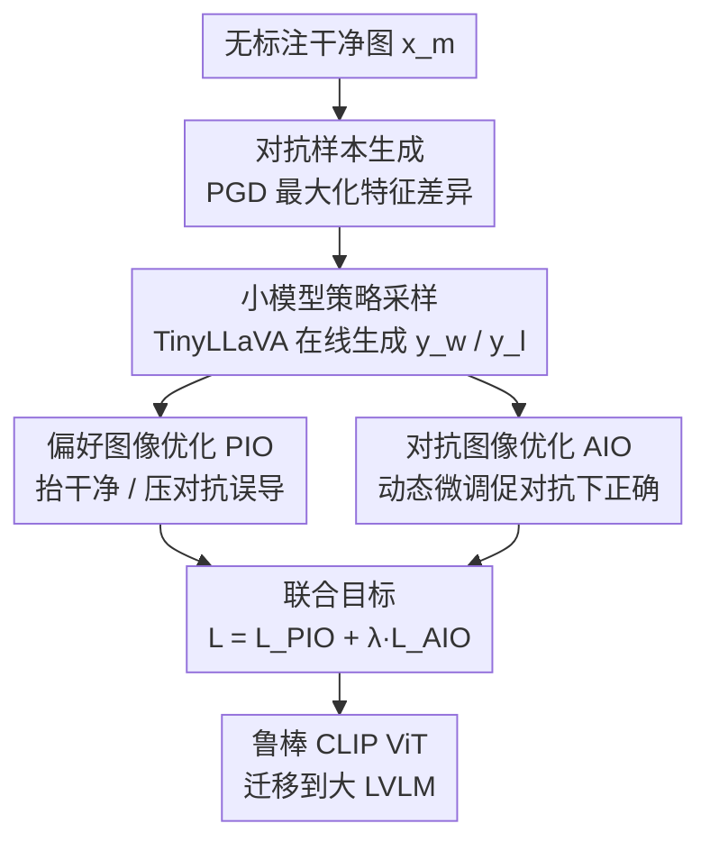

# AdPO: Enhancing the Adversarial Robustness of Large Vision-Language Models with Preference Optimization

**会议**: ICLR2026  
**OpenReview**: [https://openreview.net/forum?id=FEMv4lHJ2C](https://openreview.net/forum?id=FEMv4lHJ2C)  
**代码**: 待确认  
**领域**: 多模态VLM / 对抗鲁棒性 / 偏好优化  
**关键词**: 大视觉语言模型, 对抗防御, 偏好优化, DPO, CLIP 图像编码器

## 一句话总结
AdPO 第一次把大视觉语言模型（LVLM）的对抗训练改写成偏好优化问题：让模型"偏好"在干净图上的正确输出、"拒绝"对抗图上的误导输出，且只微调 CLIP 图像编码器，在小模型上训练后迁移到大模型，既显著提升对抗鲁棒性又几乎不掉干净性能。

## 研究背景与动机
**领域现状**：LVLM（如 LLaVA、Qwen2.5-VL）普遍由"预训练图像编码器（CLIP ViT）+ 投影层 + LLM"三段拼成。图像编码器负责把图像特征对齐到语言模型输入空间，是性能关键，但也继承了视觉神经网络对对抗扰动的脆弱性——往图像里注入人眼几乎察觉不到的噪声，就能让模型给出错误甚至恶意输出。

**现有痛点**：现有提升 LVLM 对抗鲁棒性的方案分两类。一类是**多模态对比学习**（TeCoA、FARE），把对抗图特征对齐到文本/干净图特征上得到鲁棒编码器，计算高效但只能做粗粒度对齐；另一类是**生成式预训练**，用完整 LVLM 做细粒度对齐，但泛化差、会明显拉低干净性能。两类都没逃过对抗鲁棒性与干净性能之间的 trade-off：要么鲁棒但干净掉点，要么干净保住但不够鲁棒。

**核心矛盾**：传统对抗微调本质上只施加"单目标约束"——只优化"对抗输入下别出错"，却没有同时显式保住"干净输入下的正确输出"，于是干净性能被牺牲。

**切入角度**：作者注意到对抗训练的目标（提升鲁棒、同时保住干净表现）和偏好优化（DPO：抬高偏好样本概率、压低非偏好样本概率）天然同构。如果把"干净图的正确解读"当作偏好样本 $y_w$、"对抗图的误导解读"当作非偏好样本 $y_l$，就能用一套相对偏好的目标同时管住两端。

**核心 idea**：用偏好优化（DPO 框架）代替单目标对抗微调，让模型同时偏好干净输出、拒绝对抗误导，并只动 CLIP ViT 这一处参数，在轻量 LVLM 上训练后迁移到大模型。

## 方法详解

### 整体框架
AdPO 把对抗训练重构成一个 DPO 风格的偏好优化问题，整条流水线是：拿一张无标注的干净图 $x_m$，先用 PGD 生成对抗图 $x_{adv}$（最大化对抗图与干净图的编码特征差异）；再用一个轻量的 TinyLLaVA 在线地对干净图和对抗图分别生成解读文本，作为偏好样本 $y_w$ 与非偏好样本 $y_l$；然后用两条互补的目标联合优化——**偏好图像优化（PIO）**负责"抬高干净输出、压低对抗误导"以保住干净性能，**对抗图像优化（AIO）**负责"显式鼓励在对抗输入下也产出正确答案"以补足鲁棒性短板。整个训练只更新 CLIP ViT 的参数，得到一个鲁棒图像编码器，最后迁移到 LLaVA-1.5-7B 等大模型上即插即用。

### 关键设计

**1. 在线偏好对构造：把对抗训练改写成 DPO**

传统离线 DPO 需要现成的"赢/输"标注对，而对抗训练里没有这种偏好标签。AdPO 把 DPO 从离线扩到在线设定：直接拿策略模型对干净图和对抗图分别提问（如"图里是什么内容？"），生成的两段解读就当作偏好对——干净图的解读是偏好响应 $y_w$，对抗图的解读是非偏好响应 $y_l$。这一步彻底去掉了对图像标注和 CLIP 文本编码器的依赖，因此能泛化到未见过的数据集。值得注意的是，它并不假设负样本"一定错"：DPO 的核心是相对目标，当正负样本无法区分（如扰动太弱）时不存在相对偏好，模型自然不更新，这让训练在不同攻击强度下都稳。生成对抗图的目标是 $x_{adv}=\arg\max_{\|x_{adv}-x_m\|_\infty\le\varepsilon}\|\phi(x_{adv})-\phi_{org}(x_m)\|_2^2$，即在 $\ell_\infty$ 球内用 PGD 迭代最大化对抗图与干净图的编码特征距离。

**2. 偏好图像优化 PIO：用相对目标同时保干净、压误导**

这是直接针对"对抗微调牺牲干净性能"痛点的设计。PIO 把 DPO 目标搬进多模态对抗场景：偏好项用干净图 $x_m$ 上的正确解读 $y_w$，非偏好项用对抗图 $x_{adv}$ 上的误导解读 $y_l$，目标写作

$$L_{PIO}(\pi_\theta;\pi_{ref})=-\mathbb{E}\Big[\log\sigma\Big(\beta\log\tfrac{\pi_\theta(y_w|x_m,x_{text})}{\pi_{ref}(y_w|x_m,x_{text})}-\beta\log\tfrac{\pi_\theta(y_l|x_{adv},x_{text})}{\pi_{ref}(y_l|x_{adv},x_{text})}\Big)\Big]$$

相比只压对抗输出的单目标方法，这里"抬干净"和"压对抗误导"被绑进同一个相对目标里，因此能在增强鲁棒的同时把干净性能几乎原样保住（论文 Figure 1 显示干净指标大幅领先各 baseline）。让模型用自己生成的文本当标签，还像半监督学习一样缓解了分布偏移，把注意力集中到对抗图本身。

**3. 对抗图像优化 AIO：用动态微调显式逼出"对抗下也答对"**

PIO 能保住干净性能，但鲁棒性还不够，原因有二：其一，多模态 DPO 容易被纯语言偏好主导，模型忽略视觉条件（即"无条件偏好"失效模式，会引发幻觉）；其二，PIO 的目标只管"干净下对、对抗下拒绝误导"，并没有**显式**要求"对抗扰动存在时也要产出正确答案"。AIO 就补这个缺口。最朴素的做法是对对抗图做 SFT：$L_{SFT}=-\mathbb{E}[\log\pi_\theta(y_w|x_{adv},x_{text})]$，但 SFT 容易过拟合目标、损害泛化。AdPO 改用**动态微调**，按模型自身的 token 级置信度给损失加权：

$$L_{AIO}(\pi_\theta)=-\mathbb{E}\Big[\sum_{t}\mathrm{sg}\big(\pi_\theta(y_w^t|y_w^{<t},x_{adv},x_{text})\big)\log\pi_\theta(y_w^t|y_w^{<t},x_{adv},x_{text})\Big]$$

其中 $\mathrm{sg}(\cdot)$ 是停止梯度算子。它给高置信度预测更大权重，从而在显式增强对抗鲁棒性的同时尽量少伤泛化。AdPO 最终目标是两者联合：$L_{AdPO}=L_{PIO}+\lambda L_{AIO}$，$\lambda$ 平衡二者（默认 1）。

**4. 小模型训练 + 迁移：把"动 LLM"的成本砍掉**

直接训 LLaVA-7B 这类完整 LVLM 成本高昂。AdPO 自建轻量 **TinyLLaVA**（CLIP ViT-L/14 + OpenELM-450M-Instruct 语言模型），只在小模型上做对抗训练，且只更新 CLIP ViT 参数；训练好的鲁棒图像编码器再迁移到 LLaVA-1.5-7B 等大模型。这样训练效率与以往 CLIP-based 方法相当，还顺带缓解了评测期的过拟合风险，并保证了与既有 CLIP-based 方法的公平对比（双方都没接触最终的语言模型）。

### 损失函数 / 训练策略
训练在 ImageNet 上进行（仅用图像、无类别标签，在线学习）；对抗扰动用 10 步 PGD、$\ell_\infty$ 范数、半径 $\varepsilon=2/255$；$\lambda=1$，偏好参数 $\beta=0.1$；AdamW 优化器，weight decay 1e-4，学习率 1e-5，batch size 128，训练 2 个 epoch。

## 实验关键数据

### 主实验
在 COCO / Flickr30k（CIDEr）与 TextVQA / VQAv2（VQA accuracy）上对比无目标攻击下的干净与对抗表现，评测模型为 LLaVA-1.5-7B（部分指标如下，越高越好）：

| 数据集 | 指标 | CLIP(原) | AdvSimplex | AdPO |
|--------|------|----------|------------|------|
| COCO | clean | 115.5 | 111.5 | **115.3** |
| COCO | ℓ∞ 4/255 | 3.1 | 32.6 | **47.6** |
| Flickr30k | clean | 77.5 | 72.5 | **75.9** |
| Flickr30k | ℓ∞ 4/255 | 1.0 | 18.9 | **27.9** |
| TextVQA | ℓ∞ 4/255 | 0.0 | 10.0 | **17.6** |
| VQAv2 | ℓ∞ 4/255 | 0.0 | 26.1 | **37.6** |

AdPO 的干净性能几乎贴回原始 CLIP（COCO 115.3 vs 115.5），而所有 baseline 都明显掉干净；同时对抗鲁棒性在各任务全面刷新 SOTA。尽管只在 2/255 预算上训练，它在更大的未见扰动 4/255 上仍保持领先，显示从弱攻击到强攻击的良好泛化。

目标攻击（$\varepsilon=4/255$，ASR 越低越好）：

| 指标 | CLIP | FARE | AdvSimplex | AdPO |
|------|------|------|------------|------|
| Mean ASR | 100% | 3% | 3% | **0%** |

AdPO 把目标攻击成功率压到 0%，而原始 CLIP 高达 100%。

### 消融实验

| 配置 | 现象 | 说明 |
|------|------|------|
| DPO 变体 (IPO/KTO/StepDPO) | 表现良好 | AdPO 是通用偏好框架，不绑定特定算法 |
| DPO 变体 (SimPO) | 相对较差 | 可能因移除参考模型导致 |
| 多种攻击 (C&W/sC&W/BIM/CroPA/Verbose) | 仍鲁棒 | 含专为 LVLM 设计的攻击 |
| λ 取值 0→1.5 | 干净几乎不变、对抗随 λ 升 | 干净性能对 AIO 不敏感，λ≈1 最佳 |

### 关键发现
- **PIO 主管干净、AIO 主管鲁棒**：λ 扫描显示干净性能对 AIO 基本不敏感，而增大 λ 显著抬高对抗鲁棒性，验证了两条目标各司其职、互补叠加。
- **框架可换骨架算法**：换成 IPO/KTO/StepDPO 都能用，说明 AdPO 是一个通用偏好对抗训练框架而非某个算法的特例。
- **跨攻击与跨模型泛化**：对 CroPA、Verbose 等专攻 LVLM 的攻击仍稳；除 CLIP-based 模型外，也在 Qwen2.5-VL、InternVL3.5、BLIP-2 上验证有效。

## 亮点与洞察
- **把对抗训练"翻译"成偏好优化**是真正巧妙之处：trade-off 之所以难解，是因为旧方法只有单目标；DPO 的相对目标天然能同时拉一端、压另一端，正好对上对抗训练"保干净 + 增鲁棒"的双诉求。这个视角迁移是论文最让人"啊哈"的点。
- **在线自生成偏好对**去掉了标注与 CLIP 文本编码器依赖，相当于把"半监督 + 自标注"思想引进对抗防御，泛化到未见数据集，工程上很实用。
- **只改图像编码器 + 小模型迁移**这条工程路线可复用：在 TinyLLaVA 上训 CLIP ViT 再迁移到大 LVLM，把"训 LLM"的成本绕开，同时保证与 CLIP-based 方法的公平比较。
- **AIO 的动态微调**用 token 级置信度加权代替 SFT，是缓解"对抗 SFT 伤泛化"的一个轻量替换，可迁移到其他需要"显式逼正确答案又怕过拟合"的场景。

## 局限与展望
- 训练数据固定在 ImageNet、扰动仅在 $\varepsilon=2/255$ 训练，虽展示了到 4/255 的泛化，但更大预算或自适应白盒攻击下的极限未充分探查。
- 偏好对依赖小模型 TinyLLaVA 自生成的解读质量；当小模型本身解读较弱时，$y_w/y_l$ 的区分度可能下降，间接影响信号质量。
- 评测主要在 captioning / VQA 等理解类任务上，对更复杂的多轮、推理类或安全越狱类场景的覆盖有限。
- 只动图像编码器虽高效，但视觉模块之外（投影层、LLM 端）的脆弱性未被触及，面对纯文本侧或跨模态联合攻击的防护尚未讨论。

## 相关工作与启发
- **vs FARE / TeCoA（CLIP-based 对比学习对抗训练）**：它们最小化对抗图与干净图在 CLIP 特征空间的距离做粗粒度对齐，计算高效但干净性能明显下降；AdPO 改用偏好优化的相对目标显式保住干净性能，且用完整（轻量）LVLM 生成偏好对做更细粒度对齐。
- **vs 生成式预训练对抗方法**：后者用完整 LVLM 细粒度对齐但泛化差、干净掉点；AdPO 通过小模型训练 + 只改图像编码器 + 迁移，兼顾细粒度与效率。
- **vs DPO 及其变体（IPO/SimPO/StepDPO）**：AdPO 把这套语言偏好对齐技术首次迁移到对抗训练，并证明框架对具体 DPO 变体不敏感，拓展了偏好学习的适用边界。

## 评分
- 新颖性: ⭐⭐⭐⭐⭐ 首次把对抗训练重构成偏好优化，视角迁移干净且有效
- 实验充分度: ⭐⭐⭐⭐ 覆盖无目标/目标攻击、多攻击类型、多模型与消融，但更大扰动与自适应攻击可再加
- 写作质量: ⭐⭐⭐⭐ 动机推导清晰、PIO/AIO 分工明确
- 价值: ⭐⭐⭐⭐⭐ 真正缓解鲁棒性-干净性能 trade-off，且工程路线高效可复用

<!-- RELATED:START -->

## 相关论文

- [\[ACL 2026\] CiPO: Counterfactual Unlearning for Large Reasoning Models through Iterative Preference Optimization](../../ACL2026/llm_safety/cipo_counterfactual_unlearning_for_large_reasoning_models_through_iterative_pref.md)
- [\[ACL 2026\] Seeing No Evil: Blinding Large Vision-Language Models to Safety Instructions via Adversarial Attention Hijacking](../../ACL2026/llm_safety/seeing_no_evil_blinding_large_vision-language_models_to_safety_instructions_via_.md)
- [\[ICLR 2026\] VEAttack: Downstream-Agnostic Vision Encoder Attack Against Large Vision Language Models](veattack_downstream-agnostic_vision_encoder_attack_against_large_vision_language.md)
- [\[ICLR 2026\] TAO-Attack: Toward Advanced Optimization-based Jailbreak Attacks for Large Language Models](tao-attack_toward_advanced_optimization-based_jailbreak_attacks_for_large_langua.md)
- [\[ICLR 2026\] Sampling-aware Adversarial Attacks against Large Language Models](sampling-aware_adversarial_attacks_against_large_language_models.md)

<!-- RELATED:END -->
