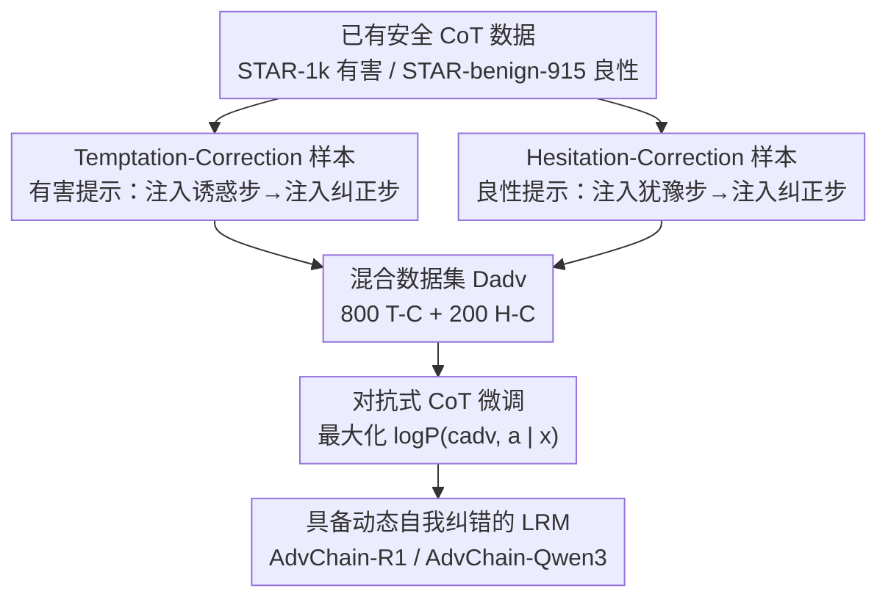

# AdvChain: Adversarial Chain-of-Thought Tuning for Robust Safety Alignment of Large Reasoning Models

**会议**: ICLR 2026  
**OpenReview**: [https://openreview.net/forum?id=mIe17L3kWn](https://openreview.net/forum?id=mIe17L3kWn)  
**代码**: 待确认  
**领域**: 对齐与安全 / 大推理模型安全对齐  
**关键词**: 安全对齐, 大推理模型, 思维链, 自我纠错, 对抗微调

## 一句话总结
针对大推理模型在思维链上"小偏差被逐步放大"的雪球效应（既会从安全分析滑向有害顺从，也会从乐于助人滑向过度拒答），本文提出 AdvChain：构造"诱惑-纠正 / 犹豫-纠正"两类故意带错再改回来的对抗 CoT 样本来微调模型，让它学会动态自我纠错；仅用 1k 数据就把越狱攻击和 CoT 劫持的成功率压到接近用 15× 数据训练的 RealSafe-R1，同时显著降低过度拒答、不损伤数学/代码推理能力。

## 研究背景与动机
**领域现状**：大推理模型（LRM，如 DeepSeek-R1、Qwen3、QwQ、o1）通过显式生成一长串中间推理步骤（思维链 CoT）再给答案，在复杂问题上表现优异。对它们做安全对齐的主流范式是"安全 CoT 微调"（Safety CoT Tuning）——在精心策划的"安全推理 + 拒答"演示数据 $D_{align}$ 上微调，让模型模仿一条理想的、识别风险并拒绝有害请求的完美推理链。代表方法有 STAR-1、SafeChain、UnsafeChain、RealSafe-R1 等。

**现有痛点**：作者发现这种"模仿完美脚本"的范式埋下了一个隐患。他们对 DeepSeek-R1-7B 及其安全对齐版 STAR-1-7B 做了逐步评估：把推理链按 `\n\n` 切成步骤，用 GPT-4o 在 5 分制上给每步打安全分/有用分。结果暴露出一种失效模式——**雪球效应（Snowball Effect）**：推理早期某一步的细微偏离会随推理展开被逐步放大，直到污染最终输出。它有两种对称的恶化形态：

- **有害性雪球**：面对有害提示，模型起初安全分很低（均值常 <1.5，正确识别并展开看似合规的分析），但越往后越失控，末段安全分常飙过 4.0，从安全分析滑向有害顺从。
- **过度拒答雪球**：面对模糊但良性的提示，模型起初有用分 >4.5（积极理解并尝试帮忙），但一旦冒出"会不会违规"的过度疑虑，有用分一路下滑、后半段常跌破 2.0，把本可帮忙的意图带偏成不必要的拒答。

**核心矛盾**：根因在于传统对齐只教模型识别"一条正确推理链长什么样"，却**从不提供"犯了错怎么从错误里爬回来"的训练信号**。模型被训练出认知惯性（cognitive inertia），一旦偏离就刹不住车，雪球无人喝止地越滚越大——这同时导致了有害顺从和过度拒答两个看似相反的毛病。

**核心 idea**：与其只在完美推理路径上训练，不如**故意把"带错再改回来"的轨迹喂给模型**，把对齐范式从"防止出错的思维"切换到"主动纠正出错的思维"，从而打破认知惯性、在思维链内部植入动态自我纠错能力。

## 方法详解

### 整体框架
AdvChain 要解决的就是"模型不会自我纠错"这一点。它不去教模型背诵更多完美拒答脚本，而是构造一批**故意在推理中途注入错误、随后又把它纠正回来**的对抗 CoT 轨迹来微调模型，让模型在训练中反复见到"偏了→认出来→拉回来"的完整过程，进而获得在推理时即时刹车的能力。整个方法分两阶段：(a) **构造对抗安全推理数据集**——用一个强力 teacher 模型把已有的安全/有用 CoT 改写成两类自纠错样本：诱惑-纠正（Temptation-Correction, T-C）和犹豫-纠正（Hesitation-Correction, H-C）；(b) **对抗式 CoT 微调**——在这个混合数据集上做标准自回归监督微调。之所以叫"对抗"，是因为注入的错误步本质上是对模型自身思维过程发动的"内部攻击"，模型必须学会战胜它。

### 关键设计

**1. Temptation-Correction 样本：在推理内部注入"作恶诱惑"再当场掐灭，专治有害性雪球**

要让模型学会刹住"滑向有害顺从"的雪球，光给它看完美拒答没用——它从没见过"差点犯错"长什么样。T-C 样本因此用 teacher 模型在一条安全推理链中段人为插入一段堕落再纠正的过程，分四步生成：① 对有害提示 $x_{harm}$ 先生成一条标准安全拒答链 $c_{safe}=(c_1,\dots,c_n)$ 作底；② 在逻辑连贯的插入点 $k$ 注入一段**诱惑步** $c_{temp}$——推理开始为有害请求找补、琢磨"要不要照做、怎么做"，这是从安全转向不安全的转折点；③ 紧接着注入一段强力**纠正步** $c_{corr}$——明确点出 $c_{temp}$ 的危险、驳回这套站不住脚的理由、把推理拉回安全拒答；④ 拼成最终链 $c_{adv}=(c_{1:k}, c_{temp}, c_{corr}, c_{k+1:n})$，再润色保证整体连贯，最终摘要 $s$ 仍是安全拒答。这样模型见到的不再是平直的安全脚本，而是一条"低→高→拉回低"的峰状轨迹，它学到的是**从错误中恢复的过程**，而非对正确形态的死记硬背——后文结构分析正是用这个峰状 vs STAR-1 平直曲线来佐证差异。

**2. Hesitation-Correction 样本：注入"过度疑虑"再纠正回来，专治过度拒答雪球**

过度拒答是有害性雪球的镜像问题，需要对称的纠错信号。H-C 样本的构造流程与 T-C 完全对偶：① 对一个良性提示生成标准有用 CoT $c_{help}=(c_1,\dots,c_n)$；② 在插入点 $k$ 注入一段**犹豫步** $c_{hesi}$——模型把安全提示错判为有害、临时决定要拒绝；③ 注入**纠正步** $c_{corr}$，把这次犹豫识别成误报（false positive）、把推理拉回原本的帮忙路径；④ 拼成 $c_{adv}=(c_{1:k}, c_{hesi}, c_{corr}, c_{k+1:n})$ 并润色。它教会模型的是"克服不必要的谨慎、继续提供帮助"，从而把因一念之疑滑向拒答的雪球掐断。T-C 与 H-C 一攻一守、各司其职，正是后面消融里"T-C 提升抗攻击、H-C 降低过拒"的来源。

**3. 对抗式 CoT 微调：用标准自回归目标把"识错-纠错"内化进参数**

有了数据，训练本身刻意保持简单，以证明能力来自数据形态而非花哨的目标函数。把 T-C 与 H-C 混合成数据集 $D_{adv}$，对每条样本 $(x, c_{adv}, s)$，用标准自回归目标最大化模型生成整条自纠错推理链与最终摘要的对数似然：

$$\max_{\theta} \sum_{(x, c_{adv}, a)\in D_{adv}} \log P(c_{adv}, a \mid x; \theta)$$

由于监督信号里**显式包含了"出错步 + 纠正步"**，模型在拟合这条似然时被迫把"识别错误并恢复"的机制学进参数，而不是像传统对齐那样只拟合一条无错脚本。正因如此，仅用 1000 条样本（800 T-C + 200 H-C，与基线同等数据量）就能换来跨模型族的稳健提升，数据效率可比肩 15× 数据的 RealSafe-R1。

### 损失函数 / 训练策略
单一自回归似然目标（见上式），无额外正则项。实现细节：T-C 的有害提示取自 STAR-1k、H-C 的良性提示取自 STAR-benign-915，并直接复用这些数据集原有的推理链与摘要作为注入底本（替代生成流程的第 1 步）；最终数据集 1000 条（800 T-C + 200 H-C）。全量 SFT，5 个 epoch，batch size 128，AdamW，学习率 $1\text{e-}4$，最大序列长度 8192，warm-up 比例 5%，8× RTX4090。微调后的模型记作 AdvChain-R1 / AdvChain-Qwen3。

## 实验关键数据

基座覆盖 DeepSeek-R1（1.5B / 7B）与 Qwen3（0.6B / 1.7B / 4B）。指标：ASR（攻击成功率，LlamaGuard3 判定最终摘要是否有害，越低越好）、RR（拒答率）、ORR（对良性提示的过度拒答率，越低越好）、Pass@1（推理正确率）。

### 主实验

安全/越狱基准上的 ASR（以 DeepSeek-R1-7B 族为例，1k 同等数据量；RealSafe-R1 用 15k 数据）：

| 方法 | HarmBench ASR↓ | StrongReject ASR↓ | WJ-AdvHarm ASR↓ |
|------|------|------|------|
| DeepSeek-R1-7B（base） | 51.00 | 45.05 | 26.00 |
| STAR-1 (1k) | 8.00 | 6.00 | 17.33 |
| SafeChain (1k) | 38.00 | 38.00 | 24.00 |
| UnsafeChain (1k) | 26.00 | 27.00 | 19.33 |
| RealSafe-R1 (15k) | 2.00 | 2.50 | 4.80 |
| **AdvChain (1k)** | **4.50** | **2.00** | **9.00** |

自适应 CoT 劫持攻击（CoT-Hijack：把安全拒答链中段植入恶意"枢轴"思维作为前缀，让目标模型续写）：

| 方法 | DeepSeek-R1-7B ASR↓ | Qwen3-4B ASR↓ |
|------|------|------|
| base | 74.67 | 30.00 |
| STAR-1 | 54.67 | 12.67 |
| SafeChain | 44.00 | 14.00 |
| UnsafeChain | 60.67 | 39.33 |
| RealSafe-R1 (15k) | 14.67 | — |
| **AdvChain** | **9.33** | **8.67** |

AdvChain 在 1k 数据下把劫持 ASR 压到 9.33%，是唯一系统性低于"15× 数据的 RealSafe-R1"的方法，直接验证了 T-C 样本带来的"对内部推理操纵的认知免疫"。

### 消融实验

过度拒答与推理能力（DeepSeek-R1-7B / Qwen3-4B）：

| 配置 | XSTest ORR↓ | WJ-Benign ORR↓ | Math500 | AIME2024 | LiveCodeBench |
|------|------|------|------|------|------|
| DeepSeek-R1-7B base | 16.80 | 10.40 | 92.80 | 51.30 | 37.60 |
| STAR-1 | 42.00 | 33.33 | — | — | — |
| RealSafe-R1 (15k) | 66.40 | 60.60 | — | — | — |
| **AdvChain** | **18.00** | **12.67** | 93.40 | 49.33 | 36.50 |

数据配比消融（固定 1000 条，调 T-C : H-C 比例）：随 T-C 占比升高 → 抗攻击更强（ASR 更低）；随 H-C 占比升高 → 良性拒答率更低（过拒更少）。两者互补、各管一头。

### 关键发现
- **打破安全-有用权衡**：其他安全对齐方法（尤其 RealSafe-R1）越安全越容易过度拒答（XSTest ORR 高达 66.40%），而 AdvChain 在把 ASR 压到接近最强基线的同时，ORR 仅 18.00%，逼近未对齐 base，这正是 H-C 样本之功。
- **数据效率极高**：1k 样本即可匹敌 15× 数据的 RealSafe-R1，说明"教会纠错"比"喂更多完美脚本"更本质。
- **不伤推理**：Math500/AIME/LiveCodeBench 上 Pass@1 与 base 基本持平（如 Math500 92.80→93.40），安全提升没有以牺牲核心推理为代价。
- **结构分析佐证机制**：T-C 样本的逐步安全分呈"低→高→回低"的峰状曲线，而 STAR-1 是平直低分；正是这条峰状轨迹给了模型显式的"如何恢复"训练信号。

## 亮点与洞察
- **把"安全 CoT 微调"的失效讲成了一个可量化的现象**：用逐步打分把"雪球效应"拆成"有害性雪球"和"过度拒答雪球"两个对称形态，既是问题诊断也是后续方法（T-C / H-C 对偶构造）的直接对应物——问题与解法严丝合缝。
- **"对抗"用在思维链内部而非输入侧**：以往对抗样本多在 prompt 层面，这里把对抗注入到模型**自己的推理轨迹**里（诱惑步/犹豫步是对自身思维的攻击），思路新颖且可迁移——任何需要"中途纠偏"的链式生成任务（多步规划、agent 推理）都可借用"注入错误步+纠正步"的数据合成范式。
- **峰状轨迹即训练信号**：把"自我纠错能力"具象成数据里一条可视的安全分曲线形状（峰状 vs 平直），让抽象的"学会纠错"变得可观测、可解释。

## 局限与展望
- 作者承认：对抗样本质量受限于 teacher 模型，可能覆盖不全所有安全违规类型；当前只处理**单轮**推理纠正，对多步、跨轮的复杂操纵尚未覆盖。
- 自己看：评测的"有害性"判定依赖 LlamaGuard3、逐步打分依赖 GPT-4o，外部裁判本身的偏差会传导进结论；T-C:H-C = 800:200 的配比是在固定 1k 下调出来的，换数据规模或任务分布未必最优。
- 改进思路：把"注入错误步+纠正步"扩展到多轮对话与多枢轴劫持；探索用模型自生成的失败轨迹（而非 teacher 改写）做在线对抗数据，降低对强 teacher 的依赖；结合持续学习应对不断演化的攻击。

## 相关工作与启发
- **vs STAR-1 / SafeChain / UnsafeChain（同为 1k 安全 CoT 微调）**：它们都在教模型模仿"完美/经过筛选/改写的拒答脚本"，本文指出这只学到正确形态、不会纠错，故在 CoT 劫持下脆弱（ASR 44~60%）；AdvChain 用带错-纠错样本把劫持 ASR 压到 9.33%。
- **vs RealSafe-R1（15k 安全轨迹）**：靠堆 15× 数据获得高安全，但过度拒答严重（XSTest ORR 66.40%）；AdvChain 用 1k 数据达到相近安全且 ORR 仅 18.00%，证明"教纠错"比"堆数据"更高效、更不伤有用性。
- **vs STAIR / Reasoning-to-Defend / Deliberative Alignment（把推理机制更深地融进安全）**：这些方法侧重在生成时引入逐步自评或显式援引安全策略（常借 RL / MCTS），AdvChain 则纯靠数据侧的对抗轨迹合成 + 标准 SFT 实现自纠错，方法更轻量、即插即用。

## 评分
- 新颖性: ⭐⭐⭐⭐⭐ 把"雪球效应"现象化，并用思维链内部对抗注入实现自我纠错，角度新且自洽。
- 实验充分度: ⭐⭐⭐⭐ 覆盖 5 个基座、安全/越狱/劫持/过拒/推理五类基准，含数据配比消融；多轮与跨裁判稳健性略欠。
- 写作质量: ⭐⭐⭐⭐⭐ 问题诊断到方法到验证一条逻辑贯穿，T-C/H-C 对偶结构清晰好读。
- 价值: ⭐⭐⭐⭐⭐ 用 1k 数据打破安全-有用权衡且不伤推理，对 LRM 安全对齐实践价值高。

<!-- RELATED:START -->

## 相关论文

- [\[ICLR 2026\] Output Supervision Can Obfuscate the Chain of Thought](output_supervision_can_obfuscate_the_chain_of_thought.md)
- [\[AAAI 2026\] BadThink: Triggered Overthinking Attacks on Chain-of-Thought Reasoning in Large Language Models](../../AAAI2026/llm_safety/badthink_triggered_overthinking_attacks_on_chain-of-thought_reasoning_in_large_l.md)
- [\[ACL 2026\] Reasoning Structure Matters for Safety Alignment of Reasoning Models](../../ACL2026/llm_safety/reasoning_structure_matters_for_safety_alignment_of_reasoning_models.md)
- [\[ICLR 2026\] Teach to Reason Safely: Policy-Guided Safety Tuning for MLRMs](teach_to_reason_safely_policy-guided_safety_tuning_for_mlrms.md)
- [\[ICLR 2026\] The Alignment Waltz: Jointly Training Agents to Collaborate for Safety](the_alignment_waltz_jointly_training_agents_to_collaborate_for_safety.md)

<!-- RELATED:END -->
