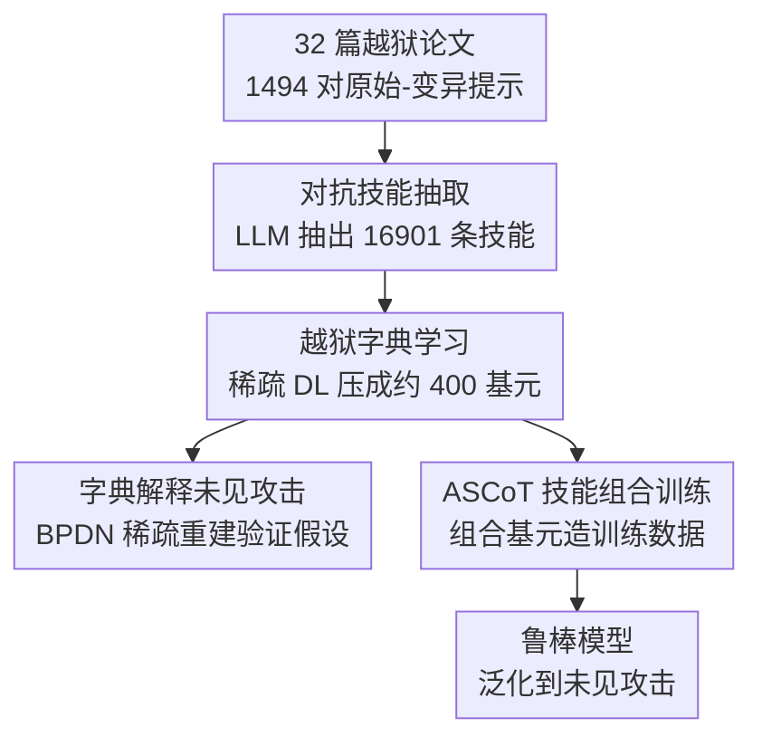

# Adversarial Déjà Vu: Jailbreak Dictionary Learning for Stronger Generalization to Unseen Attacks

**会议**: ICLR2026  
**OpenReview**: [https://openreview.net/forum?id=WFo8P1gQBh](https://openreview.net/forum?id=WFo8P1gQBh)  
**代码**: [项目主页](https://mahavirdabas18.github.io/adversarial_deja_vu/)  
**领域**: LLM 安全 / 越狱防御 / 对抗训练  
**关键词**: 越狱、对抗技能、稀疏字典学习、组合泛化、对抗训练

## 一句话总结
作者提出"对抗 Déjà Vu"假设——新越狱并非全新发明，而是旧攻击中对抗技能的重新组合；他们用稀疏字典学习把 32 篇攻击论文里抽出的 1.7 万条技能压成约 400 个可解释基元（越狱字典），既验证了"未见攻击能被旧技能稀疏重建"，又据此提出 ASCoT 训练法（在技能组合而非单条攻击上训练），把对未见越狱的有害率压到全场最低且不过度拒答。

## 研究背景与动机
**领域现状**：大模型即便做了安全对齐，仍持续被越狱（jailbreak）攻破——攻击者用自然语言提示绕过护栏诱导有害输出，而且新越狱出现的速度远快于防御能跟上的速度。基于训练的防御主要有两类：一是对齐类方法（RLHF / DPO 等），靠红队发现攻击后打补丁，但对新攻击很脆弱；二是对抗训练（R2D2、CAT、LAT 等），追求最坏情况鲁棒性。

**现有痛点**：对抗训练在实践中常常失效于新出现的越狱。根因是优化困难加上"现实威胁模型"难以定义——它往往去防那些**计算上容易找到**的扰动（embedding/latent 空间里的小扰动），而不是真实越狱所依赖的机制。两类方法都败在同一点：它们训练所用的数据分布，**poorly 刻画了未见攻击的结构**。

**核心矛盾**：基于训练的防御最终被其训练分布所限。既然训练分布决定一切，与其不停追新攻击补漏，不如直接**重塑训练数据本身**，让它对齐未见攻击的真实结构。但这看似不可能——怎么防一个从没见过的攻击？

**切入角度**：作者主张越狱的"新意"并非无约束的。正如人类创新源于对熟悉积木的重组，人造越狱也取自一个**有限的对抗技能集**（如"学术包装""角色扮演""关键词混淆"）；连 LLM 生成的越狱也是在 remix 其预训练语料里的人类策略。他们给出反例佐证：相隔半年的 PAP 和 AutoDAN-Turbo 都用了同一招"学术门面"（把有害请求包装成研究/教育）。

**核心 idea**：把上述观察形式化为 **Adversarial Déjà Vu 假设**——给定足够丰富的历史攻击，未来越狱可被解释为早期攻击里**已有对抗技能基元的组合**。顺着这个假设：① 用稀疏字典学习把历史技能压成一套紧凑可解释的"越狱字典"，验证未见攻击确实能被稀疏重建；② 据此提出在**技能组合**上训练（ASCoT），换取对未见攻击的泛化鲁棒性。

## 方法详解

### 整体框架
整个工作分"验证假设"和"用假设造防御"两半，但共享同一条管线。输入是 32 篇越狱论文里 1494 对"原始有害提示 → 越狱变异提示"，输出是一个鲁棒的、能抵御未见越狱的模型。中间分三步：先用前沿 LLM 从每对提示里**抽取对抗技能**（共 16,901 条原始技能）；再用**稀疏字典学习**把这堆高度冗余的技能压成约 400 个基元——这就是**越狱字典**。字典有两个用途：一是用基追踪（basis pursuit）去**稀疏重建未见攻击的技能**，验证 Déjà Vu 假设（重建保真度越高，越说明新攻击是旧技能重组）；二是把基元与有害基础查询**组合**成多样化训练数据，喂给目标模型做 **ASCoT** 微调，得到防御模型。

### 关键设计

**1. 对抗技能抽取：把越狱拆成可迁移的"招式"**

要谈"组合泛化"，先得有一套可比较的原子单位。作者把"对抗技能"定义为：一种可迁移的、用来改写基础提示以绕过安全约束的技术（如学术包装、角色扮演、关键词混淆）。抽取靠自动化地与前沿 LLM（GPT-4.1）交互：给它"原始有害提示 + 越狱变异提示"这一对，让它列出把前者改造成后者所用的、可迁移的技术清单。每条技能记三个字段——`skill_name`（紧凑标签）、`source_text`（变异提示里用到该技能的原文片段）、`explanation`（技能及其如何泛化到其他恶意场景的简述）。一对提示可抽出多条技能，1494 对最终产出 16,901 条原始技能。

这一步的问题是**严重冗余**：技能在提示级别抽取，导致大量词汇和语义重复（如 `euphemistic_language_use` 与 `euphemistic_language_masking` 其实是同一招）。冗余对两个下游目的都有害——既污染"用技能解释新攻击"的分解，又让"组合技能造新数据"在过完备集上瞎搜索、浪费算力且产出噪声组合。这正是下一步压缩的动机。

**2. 越狱字典学习：稀疏字典把冗余技能压成可解释基元**

目标是从前置（pre-cutoff）攻击里学一套紧凑的对抗技能基元，能高效重建那一大堆过完备技能。作者先把所有原始技能的文本 explanation 用 `text-embedding-3-large` 编码成 $d=3072$ 维、$\ell_2$ 归一化的稠密向量，按列堆成 $X\in\mathbb{R}^{d\times N_{\text{seen}}}$。为什么不用聚类压缩？因为聚类把技能当成离散互斥的，而对抗招式经常**混合交叠**；字典学习（DL）天然契合——它把每条技能表示成共享基元的**稀疏组合**。优化标准的稀疏正则目标（单位范数约束）：

$$\min_{D,A}\ \tfrac{1}{2}\lVert X-DA\rVert_F^2 + \alpha\lVert A\rVert_{1,1}\quad \text{s.t.}\ \lVert D_{:,j}\rVert_2\le 1\ \forall j$$

其中 $D\in\mathbb{R}^{d\times k}$ 是字典、$A\in\mathbb{R}^{k\times N_{\text{seen}}}$ 是稀疏编码，$\alpha$ 控制重建-稀疏权衡（越大越鼓励少量激活基元）。用 K-SVD 交替方案优化，稀疏编码步退化为 Lasso，用 LARS 高效求解。**模型选择**在 $(\alpha,k)$ 网格上扫，联合权衡重建误差、平均稀疏度、简约性（更小的 $k$），取三目标 Pareto 前沿的拐点 $(\alpha^\star,k^\star)$。

字典原子 $d_j$ 学出来是无标签的，需翻译成人能读的形式。作者解一个基追踪去噪（BPDN）把原子投回原始技能矩阵：$\hat w^{(j)}=\arg\min_w \tfrac12\lVert d_j-Xw\rVert_2^2+\lambda\lVert w\rVert_1$（$\lambda=10^{-4}$，平均每个基元有约 5 个显著"父技能"），取系数最大的 top-5 父技能的元数据喂给 GPT-4.1，合成简洁的元名称与解释，再轻度人工校订。最后还有**事后冗余过滤**：解码管线（文本→嵌入→BPDN→LLM 解释）可能重新引入重复，作者在命名原子上建余弦相似度图、对超阈值 $\tau$ 的簇用 GPT-4.1 判 KEEP/REMOVE，逐步降 $\tau$ 直到字典规模稳定，得到最终 $D_{\text{final}}$。这套设计的巧处在于：把"无监督压缩"和"可解释命名"缝合起来，让基元既是数学上的稀疏基，又是人能看懂的"招式名"。

**3. 用字典解释未见攻击：把 Déjà Vu 假设变成可测的稀疏重建**

字典学完只是手段，关键要验证假设：未见攻击是不是旧技能的稀疏重组？作者设时间割点 $t_{\text{cutoff}}=$ 2024-08-15，割前 26 个越狱产出 14,070 条 seen 技能用来建字典，割后 6 个越狱（AutoDAN-Turbo、DarkCite、Emoji、FlipAttack、Implicit Reference、SequentialBreak）产出 2,831 条 unseen 技能用来测。对每条未见技能嵌入 $x_{\text{new}}$，在最终字典上解基追踪去噪 $\hat w(x_{\text{new}})=\arg\min_w \tfrac12\lVert x_{\text{new}}-D_{\text{final}}w\rVert_2^2+\lambda\lVert w\rVert_1$，取系数最大的 5 个基元当解释性"父基元"，再让 GPT-4.1（并用 Claude 3.7 Sonnet 交叉验证）按 1–5 的 **Explainability Score** 给重建质量打分。两个结论支撑假设：① 字典从 14,070 条压到 397 个原子（35× 压缩），平均可解释性几乎不掉（与含全部原始技能的过完备字典差 $<0.05$）；② 未见技能只需约 5–7 个激活基元就能稀疏重建。再把评估沿 5 个时间割点重复，可解释性随割点推进**单调上升**后在 4.3–4.4 饱和（上界为 5），说明后期越狱的"新意"在递减——这正是 Déjà Vu 的直接证据。

**4. ASCoT 技能组合训练：在技能组合而非单条攻击上训练**

既然未见越狱与已见越狱共享底层技能结构，那就不该在**孤立攻击实例**上训练，而该在**技能的多样组合**上训练，逼模型泛化到新组合。这就是 Adversarial Skill Compositional Training（ASCoT）。具体做法：给一个有害基础查询 $q$，从越狱字典里采样 $k\in\{1,2,3,4,5\}$ 个基元，得到组合查询 $q'=\text{compose}(q;d_{i_1},\dots,d_{i_k})$，每个组合都唯一且非冗余以最大化覆盖。组合由辅助 LLM（DeepSeek-V3-Chat，选它因为指令跟随强、对齐较轻、不易拒答）执行：把选中基元的元数据当 in-context 引导，重写 $q$ 使其连贯融入这些招式。训练集共 40,526 条，含四部分：① 原始有害查询（PKU-SafeRLHF、HEx-PHI、AdvBench、HarmBench）；② 用字典从 PKU-SafeRLHF 基础提示组合出的对抗查询；③ 良性查询-回答对（Orca-AgentInstruct）保通用能力；④ 少量过度拒答校准样本（XSTest、WildJailbreak）。微调就是标准的"查询→安全回答"监督指令微调。和老对抗训练的本质区别在于：CAT/LAT 防的是 latent/embedding 空间里"算得快"的扰动，而 ASCoT 直接覆盖**人可解释、跨攻击复现的技能空间**，所以泛化更强。作者还用开源 Qwen3-235B 复刻整条管线（ASCoT open），证明效果不依赖闭源组件。

## 实验关键数据

### 主实验
评估三个维度：通用能力（MMLU）、有害性（StrongReject 0–1 分，GPT-4.1-mini 当裁判，越低越好）、过度拒答率 ORR（XSTest 125 条良性查询的拒答率）。攻击分 seen（Direct、GCG、PAIR、BEAST、Adaptive）和 unseen（AutoDAN-Turbo、Implicit Reference、DarkCite、多轮 GALA）。下表为各模型族的平均有害分（节选自原文 Table 2）：

| 模型 / 防御 | MMLU | 平均有害分 ↓ | ORR ↓ |
|------|------|------|------|
| Llama3.1-8B 无防御 | 0.64 | 0.38 | 0.06 |
| Llama3.1-8B Refusal Training | 0.64 | 0.15 | 0.10 |
| Llama3.1-8B CAT* | 0.67 | 0.13 | 0.49 |
| Llama3.1-8B LAT* | 0.63 | 0.07 | 0.98 |
| Llama3.1-8B WildJailbreak | 0.63 | 0.19 | 0.06 |
| **Llama3.1-8B ASCoT (open)** | 0.63 | **0.07** | **0.06** |
| Zephyr-7B 无防御 | 0.58 | 0.67 | 0.03 |
| **Zephyr-7B ASCoT (closed)** | 0.54 | **0.09** | 0.10 |
| Mistral-7B 无防御 | 0.59 | 0.51 | 0.05 |
| **Mistral-7B ASCoT (closed)** | 0.59 | **0.11** | 0.07 |

ASCoT 在两个模型族上都拿到最低有害分和对未见攻击最强的泛化，同时保持平衡的过度拒答（LAT* 虽然有害分低，但 ORR 高达 0.98，几乎全拒）。值得注意：ASCoT 只在单轮攻击上训练，却也提升了对**多轮 GALA 攻击**的鲁棒性，印证"多轮越狱也是同一批技能基元的重组"。和闭源推理模型比，8B 的 ASCoT 在多数越狱族上**匹敌 Claude Sonnet-4-Thinking、超过 o4-mini**（平均有害分 0.08 vs o4-mini 0.19），说明鲁棒来自技能覆盖而非规模。

### 消融与分析实验

| 配置 / 分析 | 关键指标 | 说明 |
|------|---------|------|
| 字典压缩 397 vs 过完备 14070 | 可解释性 ∆<0.05 | 35× 压缩几乎不掉解释力 |
| 未见技能稀疏度 | 5–7 个激活基元 | 新攻击是少数基元的稀疏组合 |
| 新颖组合 k=2/3/4/5 | 有害分 0.00 | 训练见过基元、没见过组合 → 仍 0 |
| 技能覆盖 12/50/200/全部 | 有害分单调下降 | "覆盖红利"：扩技能空间直接抬高攻击门槛 |
| 组合深度 k=1..5 | PAIR vs AutoDAN-Turbo 交叉 | 浅组合防短攻击、深组合防长攻击 |

### 关键发现
- **组合泛化是真的**：用训练里出现过、但从未如此组合的 $k\in\{2,3,4,5\}$ 基元去变异 StrongReject 查询，ASCoT 有害分全为 0（基线 LLaMA-3.1-8B 仍 0.59–0.69）——一旦学会基元，鲁棒性无缝延伸到未见重组。
- **覆盖红利（Coverage Dividend）**：在数据量固定时，把字典从 12 个基元扩到全部，PAIR 和 AutoDAN-Turbo 的有害性稳步下降。结论是防御者应把"技能覆盖"当成鲁棒性的关键杠杆，而非一味堆数据规模。
- **组合深度需匹配攻击复杂度**：浅组合（$k=1,2$）最擅长防短而低技能的攻击（PAIR 平均 ~102 token、~9.7 技能），深组合（$k=4,5$）才防得住长而多技能的攻击（AutoDAN-Turbo 平均 ~335 token、~14.8 技能）。没有单一最优深度，要跨深度谱训练。

## 亮点与洞察
- **把"防未见攻击"重述成一个可测的科学假设**：Déjà Vu 假设把"新越狱"从无法预测的异常，重构为"旧技能的稀疏组合"，并用字典学习 + 可解释性打分给出量化证据（单调上升后饱和）。这种"先证假设、再造方法"的结构比直接堆 trick 更有说服力。
- **字典学习用得很巧**：选稀疏 DL 而非聚类，正是因为对抗招式会交叠混合——这是把工具的数学性质和问题结构对上的典范，可迁移到任何"技能/概念会复用且重叠"的分析场景。
- **训练数据即防御边界**：核心洞察是"鲁棒不在于记住具体失败，而在于张成底层对抗技能空间"。这把对抗训练的目标从"防具体扰动"升级到"覆盖技能流形"，对其他对抗鲁棒任务（如图像、agent 安全）都有借鉴。
- **35× 压缩几乎不掉解释力**，且未见技能只需 5–7 个基元重建——这个数字本身就是"越狱多样性被高估"的有力证据。

## 局限与展望
- **假设被作者明确限定在"语言类越狱"**：依赖模型内部访问的攻击（如 fine-tuning 攻击）不分解为可复用的语言技能，方法不适用。
- **稀疏线性组合是工作假设而非证明**：作者承认"技能在嵌入空间近似稀疏线性组合"只是为可解释性和可解性做的建模选择，非线性组合的形式证明。
- **管线重度依赖前沿 LLM**：技能抽取、命名、可解释性打分都用 GPT-4.1（虽有 Qwen3/Claude 交叉验证），抽取质量和打分可能带模型偏置；组合用 DeepSeek-V3 也因其"对齐较轻"——这本身是把"易越狱"当工具，存在伦理与可复现张力。
- **字典需持续更新**：当出现真正无法被现有基元解释的新基元时需扩充字典，否则覆盖会随对抗演化而退化；论文未给出自动检测"真新基元"的机制。
- 评测的有害性裁判（StrongReject + GPT-4.1-mini）本身可能被对抗，端到端鲁棒性仍受裁判可靠性制约。

## 相关工作与启发
- **vs 对齐类防御（RLHF/DPO + 红队补丁）**：它们在红队发现攻击后打补丁，对新越狱脆弱；ASCoT 不追具体攻击，而训练技能组合以**主动覆盖**未见攻击，泛化更强。
- **vs 对抗训练 CAT/LAT**：CAT 在 embedding 空间、LAT 在 latent 空间搜扰动，防的是"算得快"的扰动，迁移到未见攻击差且常抬高过度拒答（LAT* ORR 0.98）；ASCoT 防的是人可解释、跨攻击复现的技能，迁移更好且拒答更可控。
- **vs WildJailbreak（数据多样性路线）**：WildJailbreak 更多样但残留有害性更高，说明只堆数据多样性不足以覆盖对抗技能流形；ASCoT 用字典显式张成技能空间，覆盖更系统。
- **vs PAP 单技能训练**：只在 persuasion 风格上训练，在 PAP 上好但无法迁移，凸显"攻击特定对齐"的脆弱——反衬出"组合技能"路线的价值。

## 评分
- 新颖性: ⭐⭐⭐⭐⭐ 把"防未见越狱"重构为"对抗技能的稀疏组合"假设，并用字典学习给出可测证据，视角新且自洽。
- 实验充分度: ⭐⭐⭐⭐⭐ 3 个模型族、seen/unseen + 多轮攻击、覆盖与深度的受控分析、闭源/开源双管线复刻，证据链完整。
- 写作质量: ⭐⭐⭐⭐⭐ "先证假设再造方法"的结构清晰，图表与论点对应紧密。
- 价值: ⭐⭐⭐⭐⭐ 给对抗训练指出"覆盖技能空间"这一可操作杠杆，对 LLM 安全防御有直接实践意义。

<!-- RELATED:START -->

## 相关论文

- [\[ICLR 2026\] Learning to Lie: Adversarial Attacks on Human-AI Teams and LLMs](learning_to_lie_adversarial_attacks_on_human-ai_teams_and_llms.md)
- [\[ACL 2025\] CAVGAN: Unifying Jailbreak and Defense of LLMs via Generative Adversarial Attacks](../../ACL2025/llm_safety/cavgan_unifying_jailbreak_and_defense_of_llms_via_generative_adversarial_attacks.md)
- [\[ICLR 2026\] Sampling-aware Adversarial Attacks against Large Language Models](sampling-aware_adversarial_attacks_against_large_language_models.md)
- [\[ICLR 2026\] GeneBreaker: Jailbreak Attacks Against DNA Language Models with Pathogenicity Guidance](genebreaker_jailbreak_attacks_against_dna_language_models_with_pathogenicity_gui.md)
- [\[ICLR 2026\] Automatic Dialectic Jailbreak: A Framework for Generating Effective Jailbreak Strategies](automatic_dialectic_jailbreak_a_framework_for_generating_effective_jailbreak_str.md)

<!-- RELATED:END -->
