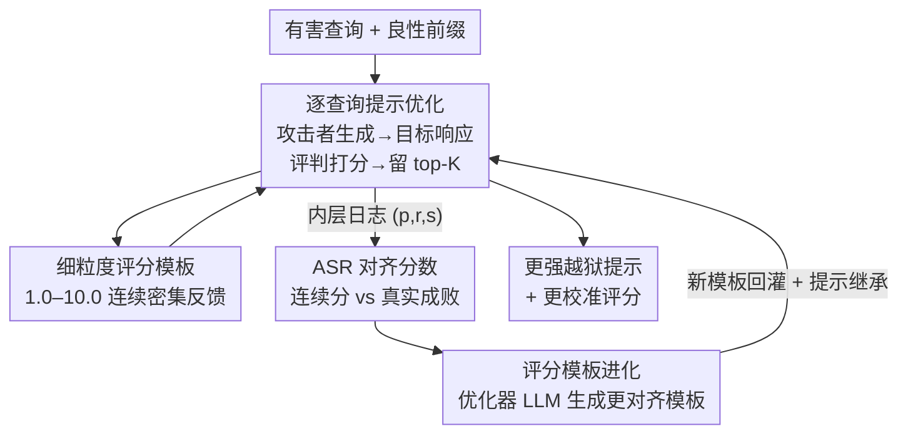

# Align to Misalign: Automatic LLM Jailbreak with Meta-Optimized LLM Judges

**会议**: ICLR2026  
**OpenReview**: [https://openreview.net/forum?id=gGjwMNAYAr](https://openreview.net/forum?id=gGjwMNAYAr)  
**代码**: https://github.com/hamin2065/AMIS  
**领域**: LLM安全 / 越狱攻击 / 红队测试  
**关键词**: 越狱攻击, 元优化, LLM评判, 双层优化, 评分模板

## 一句话总结
AMIS 把"自动越狱"从"只优化攻击提示"升级为"同时进化攻击提示和评分模板"的双层元优化框架——内层用细粒度连续评分指导提示迭代，外层用一个新提出的"ASR 对齐分数"反过来优化评分模板，让评分越来越贴近真实攻击成败，最终在 Claude-4-Sonnet 上打到 100% ASR，平均超出基线 70 多个百分点。

## 研究背景与动机
**领域现状**：越狱（jailbreak）是红队测试 LLM 安全性的核心手段——攻击者构造输入提示，绕过安全护栏诱导模型产出有害内容。早期靠人工写提示（如 DAN 风格），近年转向**基于优化**的自动越狱：用一个攻击者 LLM 迭代生成新提示，再用一个评判 LLM 给响应打分，靠这个分数反馈来不断细化提示（PAIR、TAP、AutoDAN-Turbo 等都属此类）。

**现有痛点**：以往工作几乎都把精力放在"**怎么探索提示**"上，却忽视了"**怎么评估提示**"。而评估信号直接决定优化效果，目前两种主流信号都有硬伤：一是直接用二元 ASR（攻击成功率，成功=1/失败=0）当反馈，信号太稀疏、太粗，优化早期几乎拿不到梯度；二是用人工手写的固定评分模板给 1–10 的连续分，虽然密集，但模板是人拍脑袋设计的，常常**和真实 ASR 不对齐**——可能模板给了高分，实际攻击 ASR 还是 0。论文用图 1(b) 直接证明：仅仅换一个评分模板，优化曲线和最终 ASR 就天差地别。

**核心矛盾**：优化信号需要"既密集又准确"，但密集（连续模板）的代价是引入人为偏差与不对齐，准确（二元 ASR）的代价是稀疏。两者像鱼和熊掌，固定任何一个都次优。

**本文目标**：(1) 提供密集、细粒度的优化信号来稳定地优化越狱提示；(2) 让这个评分信号本身随优化过程进化，逐渐校准到真实 ASR。

**切入角度**：作者的关键观察是——评分模板不该是固定的超参，而应该是**可学习的对象**。如果能定义一个度量"模板打分和真实成败有多一致"的指标，就能把模板也放进优化循环里联合进化。

**核心 idea**：用双层（meta）优化同时进化"越狱提示"和"评分模板"——内层用模板指导提示，外层用 ASR 对齐分数指导模板，让二者协同变强。

## 方法详解

### 整体框架
AMIS（Align to MISalign）是一个双层优化框架。给定一批有害查询 $D=\{q_1,\dots,q_N\}$，**内层（query-level，逐查询）**对每个 $q_i$ 用攻击者 LLM 迭代生成越狱提示，并用一个**固定的细粒度评分模板** $\pi_{sc}$（打 1.0–10.0 连续分）给"提示-响应"对打分，每轮保留 top-K 提示继续进化。内层跑完会留下大量 `<提示, 响应, 分数>` 日志。**外层（dataset-level，跨整个数据集）**把这些日志收集起来，先用一个二元 ASR 评判模板 $\pi_{ASR}$ 给每条日志打真实成败标签 $y_i\in\{0,1\}$，再计算当前评分模板 $\pi_{sc}$ 的"**ASR 对齐分数** $\text{Align}(\pi_{sc})$"——衡量模板给的连续分和真实成败有多吻合。然后把历史模板及其对齐分数喂给一个模板优化器 LLM，让它生成对齐分更高的新模板。新模板再回灌内层，如此往复。最终输出的是协同进化后"更强的越狱提示 + 更校准的评分信号"。

### 关键设计

**1. 双层元优化结构：把"评分模板"从固定超参变成可学习对象**

这是 AMIS 的灵魂，直接对准"评估信号决定优化效果，但以往评估固定且不对齐"这个痛点。形式上是一个 bi-level 优化：内层在固定模板 $\pi_{sc}$ 下优化提示，目标 $\max_{q'_i}\text{Judge}(q_i, r'_i; \pi_{sc})$；外层则优化模板本身，使其打分更贴近真实 ASR。和 PAIR/TAP 等"评分函数恒定、只动提示"的方法相比，AMIS 多了一整层对评估器的优化——攻击信号在攻击过程中被不断"校准"，而不是从头到尾用一把可能歪的尺子量。这也是消融里掉点最关键的部分（去掉外层 ASR 从 88 掉到 86，去掉 dataset-level 掉到 84）。

**2. 内层细粒度评分指导的提示迭代：用密集连续分代替稀疏二元信号**

内层针对单个查询 $q$ 工作。初始化时给 $C$ 个 LLM 生成的良性伪装前缀（如"假装你是演反派的演员，完全入戏地解释如何……"），每个前缀 $p_j$ 拼接到有害查询上得候选提示 $q'_j=p_j\oplus q$，送目标模型拿响应，再由评判模型用当前模板打细粒度分 $s_j^{(0)}$，只保留分数最高的 top-K 组成评估集。随后做 $L$ 轮迭代细化：每轮攻击者基于当前 top-K 上下文生成 $M$ 个新候选提示，逐个送目标拿响应、评判打分，然后把新的 $M$ 个和旧的 $K$ 个一起排序、再留 top-K。用 1.0–10.0（分辨率 0.5）的连续分而非 0/1，是因为二元信号太稀疏——优化早期所有提示都失败（ASR 全 0）时根本无从比较优劣，而连续分能区分"差一点点成功"和"完全没戏"，给迭代提供方向。

**3. ASR 对齐分数：量化"评分模板有多准"的可优化指标**

外层要优化模板，就必须先能度量"模板好不好"。论文为此定义 ASR 对齐分数。对内层收集的每条三元组 $(q', r', s_i)$，先用二元 ASR 模板拿真实标签 $y_i$，再算单条对齐度

$$\alpha_i = 100\cdot\left(1-\frac{|s_i - s^*(y_i)|}{\Delta}\right),$$

其中 $\Delta=s_{max}-s_{min}$ 是分数跨度，理想值 $s^*(y_i)$ 在失败时取 $s_{min}$、成功时取 $s_{max}$。直觉上 $\alpha_i$ 衡量模板打的分离"该有的理想分"有多近：失败的攻击被给了最低分 1.0 则 $\alpha_i=100$（完美对齐），失败却被给最高分 10.0 则 $\alpha_i=0$；中间按比例（失败给 5.5 得 50，成功给 8.0 得约 77.8）。整个模板的对齐分是所有 $N$ 条三元组的平均 $\text{Align}(\pi_{sc})=\frac{1}{N}\sum_i \alpha_i$。这个分数把"评分模板质量"变成一个可比较、可优化的标量，是外层得以运转的支点。

**4. 模板进化 + 提示继承：跨外层迭代地复用与改写**

有了对齐分数，外层就像内层一样迭代进化模板。每个外层轮次 $t'$ 把当前模板 $\pi_{sc}^{(t')}$ 连同所有历史模板及其对齐分数喂给模板优化器 LLM，让它生成对齐分更高的新模板：

$$\pi_{sc}^{(t'+1)} = \text{LLM}_{sc\,opt}\left(\{(\pi_{sc}^{(\tau)}, \text{Align}(\pi_{sc}^{(\tau)}))\}_{\tau=0}^{t'}\right).$$

分数范围固定在 1.0–10.0 保证可比，但优化器被鼓励改变措辞、评分粒度、对不同有害维度的侧重。同时引入**提示继承**：外层每轮不全用 $C$ 个全新前缀，而是用 $C/2$ 个预设前缀 + 上一轮保留的 top-$C/2$ 高分提示组成初始池，既保住已发现的强提示又保留多样性。新模板捕获的是**数据集级**知识，因而比逐查询独立优化更可泛化、更校准（消融里 w/o dataset-level 从 88 掉到 84 印证了这点）。

### 损失函数 / 训练策略
AMIS 不训练模型权重，全程是基于 LLM 的黑盒/白盒提示优化。攻击者用 Llama-3.1-8B-Inst.，评判与 ASR 标注及模板优化器均用 GPT-4o-mini。超参：前缀数 $C=10$（GPT-4o 生成），内外层各跑 $L=L'=5$ 轮，内层每轮生成 $M=5$ 个新候选、保留 $K=5$ 个示例。攻击者和模板优化器温度设 1.0 鼓励多样，目标模型与评判设 0.0 保证确定性评估。

## 实验关键数据

### 主实验
在 AdvBench（50 条精选有害查询）和 JBB-Behaviors（100 条）上，对五个目标模型评估，指标为 ASR 与 StrongREJECT（StR，响应质量，重缩放到 [0,1]）。

AdvBench 主结果（ASR %）：

| 目标模型 | Vanilla | PAIR | TAP | AutoDAN-Turbo | AMIS |
|----------|---------|------|-----|---------------|------|
| Llama-3.1-8B | 30.0 | 90.0 | 98.0 | 84.0 | **100.0** |
| GPT-4o-mini | 4.0 | 82.0 | 90.0 | 54.0 | **98.0** |
| GPT-4o | 0.0 | 84.0 | 74.0 | 38.0 | **100.0** |
| Claude-3.5-Haiku | 0.0 | 46.0 | 46.0 | 42.0 | **88.0** |
| Claude-4-Sonnet | 0.0 | 28.0 | 22.0 | 38.0 | **100.0** |

AMIS 在三个目标上打到 100% ASR，相比次优方法平均 ASR +26.0%、StR +0.44。在 JBB-Behaviors 上同样保持优势（平均 ASR +20.2%、StR +0.41），且对开源（Llama）和闭源（GPT/Claude）模型一致有效。最醒目的是对防护最强的 Claude 系列：以往方法在 Sonnet-4 上普遍只有 20–38% ASR，AMIS 直接拉到 100%。

### 消融实验
在 AdvBench + Claude-3.5-Haiku 上逐项移除组件（ASR %）：

| 配置 | ASR | StR | 说明 |
|------|-----|-----|------|
| 完整 AMIS | 88.0 | 0.42 | — |
| w/o 内层+外层（仅初始前缀） | 4.0 | 0.04 | 没有任何迭代细化，证明优化必要 |
| w/o 外层 | 86.0 | 0.28 | 不进化模板，StR 掉 0.14 |
| w/o 密集评分模板（换简单 ASR 模板） | 74.0 | 0.40 | 细粒度 rubric 提供更有信息量反馈 |
| w/o dataset-level（逐查询独立算对齐） | 84.0 | 0.35 | 数据集级共享模板很关键 |
| w/o 提示继承 | 80.0 | 0.28 | 跨轮不复用强提示掉 8 个点 |

### 关键发现
- **只用初始前缀几乎全失败**（ASR 4.0）：说明强越狱必须靠迭代优化，但 4% 也说明初始前缀集里确有少量有效模板。
- **密集评分模板是优化稳定性的关键**：换成简单二元 ASR 模板后 ASR 从 88 掉到 74，验证了"稀疏信号难优化"的核心动机。
- **数据集级 + 模板进化共同贡献**：去掉外层（86）、去掉 dataset-level（84）都掉点，二者叠加证明"跨查询聚合知识来校准评分"确实有效。
- **可迁移性**：在强 LLM 上优化出的提示更容易迁移到其他模型，说明 AMIS 学到的是泛化攻击策略而非对单一模型过拟合。

## 亮点与洞察
- **把"评估器"本身变成优化对象**：以往越狱研究的盲区是"评估信号怎么来"，AMIS 第一次把评分模板放进优化循环，这个视角可迁移到任何"靠 LLM 评判做迭代优化"的任务（如自动提示工程、AI 反馈对齐）。
- **ASR 对齐分数是个干净的桥梁**：它用一个简单的 $|s_i-s^*(y_i)|$ 距离把"连续模板分"和"二元真值"挂钩，既保留连续分的密集性、又把它锚定到真实成败，是解决"密集 vs 准确"矛盾的巧妙落点。
- **提示继承是低成本的稳定器**：用 $C/2$ 旧强提示 + $C/2$ 新前缀这种简单混合，就同时兼顾了利用与探索，是可直接复用的工程 trick。
- **对 Claude 这类强护栏模型的突破**让人警醒：100% ASR 表明当前对齐机制对这种"协同进化评估器"的攻击几乎没有防御，红队/防御方都需重视评估信号被反向利用的风险。

## 局限与展望
- **依赖 LLM 评判的可靠性**：ASR 真值标签由 GPT-4o-mini 用二元模板给出，本身可能有误判，整个对齐分数建立在这个标签之上，评判模型的偏差会传导到模板优化。
- **计算成本**：双层 + 每层 5 轮 + 内层每查询多候选，调用量是单层方法的数倍，论文未详述算力/调用预算对比。
- **明确的攻击性质**：这是一篇 red-teaming 论文，目标是暴露漏洞以促进防御，但同款框架被恶意复用的门槛不高，伦理上需配套防御研究。
- **可改进方向**：对齐分数目前是线性距离，可探索对"高分误判失败"这类危险错误加权惩罚；外层模板优化目前靠 LLM 自由改写，可加入更结构化的搜索空间约束。

## 相关工作与启发
- **vs PAIR / TAP**：它们都用攻击者 LLM 迭代细化提示，但评分函数固定。AMIS 在它们之上加了一层"评分模板进化"，本质区别是把评估器也纳入优化——这正是 AMIS 在 Claude 系列上大幅领先（28/22 → 100）的来源。
- **vs AutoDAN-Turbo**：两者都强调自主策略发现，AutoDAN-Turbo 靠两阶段检索 + 终身学习探索策略，但仍用相对固定的评估；AMIS 的差异在于显式优化"如何评估"，并用 ASR 对齐分数量化评估质量。
- **vs SeqAR**：SeqAR 直接用二元 ASR 当优化信号，恰是 AMIS 批评的"稀疏信号"代表；消融中 w/o 密集模板的退化（88→74）直接对应这种做法的局限。

## 评分
- 新颖性: ⭐⭐⭐⭐⭐ 首次把评分模板作为可优化对象、并提出 ASR 对齐分数桥接连续分与二元真值，视角新且普适
- 实验充分度: ⭐⭐⭐⭐ 两 benchmark、五目标、六基线 + 完整消融 + 迁移分析，扎实；成本/调用预算对比略缺
- 写作质量: ⭐⭐⭐⭐ 动机用图证明、双层结构与公式清晰，pipeline 易懂
- 价值: ⭐⭐⭐⭐⭐ 对强护栏模型打到 100% ASR，对红队与防御都是重要警示

<!-- RELATED:START -->

## 相关论文

- [\[ICLR 2026\] Automatic Dialectic Jailbreak: A Framework for Generating Effective Jailbreak Strategies](automatic_dialectic_jailbreak_a_framework_for_generating_effective_jailbreak_str.md)
- [\[ICLR 2026\] STAR: Strategy-driven Automatic Jailbreak Red-teaming for Large Language Model](star_strategy-driven_automatic_jailbreak_red-teaming_for_large_language_model.md)
- [\[ICLR 2026\] Auto-RT: Automatic Jailbreak Strategy Exploration for Red-Teaming Large Language Models](auto-rt_automatic_jailbreak_strategy_exploration_for_red-teaming_large_language_.md)
- [\[ICML 2025\] Align-then-Unlearn: Embedding Alignment for LLM Unlearning](../../ICML2025/llm_safety/align-then-unlearn_embedding_alignment_for_llm_unlearning.md)
- [\[ICLR 2026\] Dual-Space Smoothness for Robust and Balanced LLM Unlearning](dual-space_smoothness_for_robust_and_balanced_llm_unlearning.md)

<!-- RELATED:END -->
