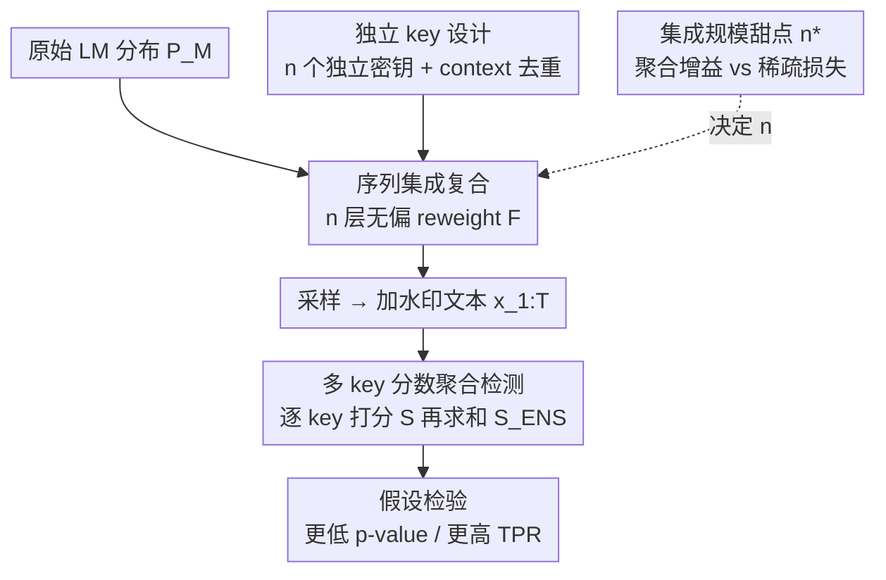

# An Ensemble Framework for Unbiased Language Model Watermarking

**会议**: ICLR 2026  
**OpenReview**: [https://openreview.net/forum?id=iZ7i2y1YxO](https://openreview.net/forum?id=iZ7i2y1YxO)  
**领域**: AI安全 / LLM水印  
**关键词**: 无偏水印, 集成框架, logits 重加权, 信号检测, 鲁棒性  

## 一句话总结
本文提出 ENS，一个把多个独立密钥的无偏 logits 水印**串联复合**起来的集成框架——每层只注入一点点不可察觉的弱信号，叠 $n$ 层后检测端把 $n$ 把密钥的分数聚合，信噪比约提升 $\sqrt{n}$，从而在严格保持输出分布不变（无偏）的前提下大幅提升检测力与抗改写鲁棒性。

## 研究背景与动机

**领域现状**：为了给 LLM 生成的文本打上可验证的"出身证明"，水印技术在生成时悄悄嵌入统计信号，检测端再用假设检验把它认出来。其中**无偏水印（unbiased / distortion-free）**最受青睐：它在密钥分布上的期望恰好等于原始 LM 分布，因此理论上保证不损害流畅度、也不会因分布漂移而被察觉，特别适合真实部署。

**现有痛点**：无偏正是它的软肋。既然期望分布完全没变，留给检测器的统计信号天然就**弱**——往往需要很长的文本才能可靠判定，而且在采样平滑、截断、改写攻击下水印很容易被冲掉。已有的 $\gamma$-reweight、DiPmark、MCmark 这些 logits 类无偏方法各自在检测力上做文章，但单个水印的信号强度有上限。

**核心矛盾**：无偏性（期望不变）和可检测性（要有可观测的统计偏移）之间存在内在张力。任何单层无偏重加权能塞进去的"偏"在期望意义下都是零，检测只能靠条件方差里那一点点信号。

**本文目标**：在**不破坏无偏性**的前提下，把可检测信号放大，并同时增强对改写/扰动攻击的鲁棒性。

**切入角度**：作者注意到无偏性是"期望意义下"的性质——只要各密钥**相互独立**，把多个独立的无偏重加权**串联**起来，复合后在期望上仍然无偏（每一层期望都把分布拉回原样）。但检测端掌握全部 $n$ 把密钥，可以把每把密钥下的条件偏移**相干叠加**，于是信号累积、噪声只按 $\sqrt{n}$ 增长。

**核心 idea**：用"多个独立弱水印的集成"代替"单个强水印"来突破无偏水印的信号上限——保持每层无偏，靠数量在检测端换取信噪比。

## 方法详解

### 整体框架

ENS 不是一种新的水印算法，而是一个**可以套在任意 logits 类无偏水印 $F$ 上的集成壳**。生成时，给定原始分布 $P_M(\cdot\mid x_{1:t})$ 和 $n$ 把独立密钥 $k_{1:n}$，把 $F$ 递归地复合 $n$ 次：

$$\text{ENS}(n, F, P_M, k_{1:n}) = \begin{cases} F\big(\text{ENS}(n-1, F, P_M, k_{1:n-1}),\, k_n\big), & n>1\\[4pt] F\big(P_M, k_1\big), & n=1 \end{cases}$$

即第 $n$ 层在前 $n-1$ 层输出的分布上再做一次密钥为 $k_n$ 的无偏重加权，最后从复合分布里采样下一个 token。检测时则反过来：用同样的 $n$ 把密钥各跑一遍基础检测器 $F$ 的打分函数 $S$，得到 $n$ 个分数后聚合成一个集成分数 $S_{\text{ENS}}$ 做假设检验。整条管线如下（生成侧串联叠层、检测侧并行聚合）：

### 关键设计

**1. 序列集成复合：把单层水印那点弱信号叠成 $n$ 层**

无偏水印的检测信号弱，根因在于单层重加权在期望上是零偏。ENS 的做法是把同一个基础规则 $F$ 用 $n$ 把不同密钥**递归串联**：每一层都对上一层的输出分布做一次微小的、无偏的扰动，复合后整体分布在 total variation 距离上仍贴近 $P_M$，但水印信号在各层间累积。作者证明了这种构造**仍然无偏**（Theorem 4.2）：若 $F$ 对任意输入分布都满足

$$\mathbb{E}_{k\sim P_K}\big[F(P_M(x_{t+1}\mid x_{1:t}),\,k)\big] = P_M(x_{t+1}\mid x_{1:t}),$$

且 $k_{1:n}$ i.i.d. 采自 $P_K$，则 $n$ 重集成 $\mathbb{E}_{k_{1:n}}[\text{ENS}_n(P_M)] = P_M$。证明对 $n$ 归纳：固定前 $n-1$ 把密钥、对 $k_n$ 用迭代期望律，因为 $F$ 对**任意**输入分布都无偏（包括 $\text{ENS}_{n-1}(P_M)$ 这个输入），所以最外层期望把分布拉回 $\text{ENS}_{n-1}(P_M)$，再用归纳假设拉回 $P_M$。这意味着复合不偷走任何生成质量——无偏性是逐层守恒的。序列形式和"把各密钥的 logit 调整先相加再重加权"的并行形式在常见 $F$（加性 logit 平移、greenlist 内乘性温度缩放）下代数等价，实现上可二选一。

**2. 独立 key 设计：让叠加后仍严格无偏的前提落地**

无偏性证明的命门是"$k_{1:n}$ 在单个生成步内相互独立"。水印密钥通常由 $k=h(\text{sk}, n\text{-gram})$ 给出，$h$ 是哈希函数。要造 $n$ 把独立密钥有两条路：用 $n$ 个不同哈希函数 $h_1,\dots,h_n$，或用 $n$ 个不同的私有密钥 $\text{sk}_1,\dots,\text{sk}_n$；本文实现选后者，即 $h(\text{sk}_1, n\text{-gram}),\dots,h(\text{sk}_n, n\text{-gram})$ 彼此独立。但实际中跨 token 的密钥可能**不独立**：因为 context $c$ 来自重叠的 $n$-gram 或位置，重复的 $c$ 会让各集成成员的 green 集相关，进而让逐 key 分数相关、破坏 $\sqrt{n}$ 增益。为此作者沿用 Hu et al. (2023) 的做法，维护一份**已见 context 历史**：若当前 $c$ 已出现过，就跳过水印、直接从原始（无水印）分布采样，从而保证参与统计的密钥之间近似独立。作者还指出，若 $F$ 只是近似无偏（如数值截断、top-K 过滤），集成偏差至多随 $n$ 线性累积，可控。

**3. 多 key 分数聚合检测：把分散在各密钥里的证据相干叠加**

生成端用了全部 $n$ 把密钥，检测端就该把它们全用上。给定序列 $x_{1:T}$、基础打分函数 $S$ 和密钥 $\text{sk}_{1:n}$，先算逐 key 分数 $\{S(x_{1:T},\text{sk}_i)\}$，再聚合，最简单就是求和 $S_{\text{ENS}}(x_{1:T})=\sum_{i=1}^n S(x_{1:T},\text{sk}_i)$（也可用标准化 z-score 或非参数秩）。关键在信噪比：在 H1 下每个 $S(x_t,\text{sk}_i)$ 相对 H0 有正的均值偏移 $\mu_i>0$。在"逐 key 中心化分数条件独立、共同方差 $\sigma^2$、共同偏移 $\mu$"的假设下（Proposition 4.3），求和统计量在 H1 下均值 $n\mu$、方差 $n\sigma^2$，于是

$$\text{SNR}(S_{\text{ENS}}) = \frac{n\mu}{\sqrt{n\sigma^2}} = \frac{\mu\sqrt{n}}{\sigma},$$

即信噪比随 $\sqrt{n}$ 增长，固定 FPR 下检测功效随 $n$ 提升。以 DiPmark 检测器为例，单 key 分数 $S_{\text{DiP}}=V_G(x_{1:T};\text{sk}_i)/T-0.5$（$V_G$ 为落入 green 集的 token 数），H0 下 green 指示量 i.i.d. Bernoulli$(1/2)$，由 Hoeffding 不等式集成 p 值 $p_{\text{ENS}}\le\exp\!\big(-\tfrac{2T}{n}S_{\text{ENS}}^2\big)$；在各 key 分数相等的特例下 $S_{\text{ENS}}=n s_0$，得 $p_{\text{ENS}}\le (p_{\text{single}})^n$——p 值随 $n$ 指数衰减。实际中各 key 联合使用时会互相削弱，未必严格指数衰减，但集成总体仍比任何单检测器给出更小的 p 值。

**4. 集成规模甜点 $n^\star$：聚合增益与促进稀疏的取舍**

并不是 $n$ 越大越好。本文把 $n$ 的双刃剑刻画清楚（§4.3）：设 $\gamma$ 为被提升的 token 比例、$\varepsilon$ 为 logit 上加的提升强度。在"生成时取各 key green 集交集"的方案下，被提升集合大小按 $\gamma^n|V|$ 收缩，提升质量期望 $\mathbb{E}[M_n]=\gamma^n$，单步分数偏移 $\mu(n)\approx(\varepsilon\gamma)^n$。结合 Hoeffding/Chernoff 界，$p_{\text{ENS}}\lesssim\exp\!\big(-CTn(\varepsilon\gamma)^{2n}\big)$，指数里出现一对相反趋势：

$$\underbrace{n}_{\text{聚合增益}} \quad\text{vs.}\quad \underbrace{(\varepsilon\gamma)^{2n}}_{\text{促进稀疏}}.$$

令 $g(n)=n(\varepsilon\gamma)^{2n}$，它只在 $n^\star\approx\frac{1}{2\log(1/\varepsilon\gamma)}$ 前递增、之后递减。所以 p 值通常在 $n\lesssim n^\star$ 时随 $n$ 下降（检测变好），$n\gg n^\star$ 时反而停滞甚至变差（被提升质量 $\gamma^n$ 趋零，极端情况 $\gamma^n|V|\lesssim 1$，几乎没有 token 被提升）。设计含义很直接：取中等的 $n\approx n^\star$。例如 $\gamma=0.5,\varepsilon=1.8$ 时 $n^\star\approx 4.75$，提示 $n\in\{4,5\}$ 在严格交集方案下接近最优；若想用更大的 $n$，得避免严格交集（改成聚合逐 key 的 logit 或统计量），让单 key 效应 $\mu$ 不随 $n$ 塌缩。这也解释了实验里 DiPmark 在 $n=5$ 普遍优于 $n=10$。

## 实验关键数据

模型用 Llama-3.2-3B-Instruct / Mistral-7B-Instruct-v0.3 / Phi-3.5-mini-instruct，文本生成在 C4 子集上跑 1000 例，密钥用 prefix 2-gram + secret key。报告固定理论 FPR 下的 TPR 与中位 p 值。

### 主实验（检测力，Table 1）

| 方法 | 250 tok TPR@0.01% | 250 tok 中位 p ↓ | 500 tok TPR@0.01% | 500 tok 中位 p ↓ |
|------|------|------|------|------|
| DiPmark($\alpha$=0.3) | 32.22% | 4.48e-3 | 61.68% | 8.60e-6 |
| **ENS-DiPmark($\alpha$=0.3, n=5)** | **66.77%** | **9.77e-7** | **91.51%** | 3.28e-14 |
| $\gamma$-reweight | 42.02% | 7.47e-4 | 72.45% | 4.58e-8 |
| **ENS-$\gamma$-reweight(n=5)** | **64.14%** | **2.04e-6** | **88.58%** | 4.81e-15 |
| SynthID(m=30) | 88.36% | 1.91e-12 | 98.37% | 4.07e-28 |
| MCMark(l=20) | 90.37% | 4.18e-13 | 98.45% | 8.30e-26 |
| **ENS-MCMark(l=20, n=3)** | **91.71%** | **1.43e-14** | **99.57%** | **2.58e-31** |
| **ENS-MCMark(l=20, n=5)** | 91.44% | 4.27e-14 | 98.90% | **1.27e-35** |

集成把弱基线（DiPmark、$\gamma$-reweight）的 250-token TPR 几乎翻倍；套在最强的 MCmark 上则把 SOTA 再往前推，ENS-MCMark 拿下最高 TPR 与最低 p 值。

### 鲁棒性（改写/扰动攻击，Table 2/3，TPR@0.01%）

| 方法 | GPT-4o-mini 改写 | DIPPER 改写 | 回译(En-Fr) | 10% 随机替换 |
|------|------|------|------|------|
| ENS-DiPmark($\alpha$=0.3, n=5) | 5.14% | 1.09% | 26.31% | 26.31% |
| SynthID(m=30) | 13.47% | 11.05% | 64.53% | 64.53% |
| **ENS-MCMark(l=20, n=3)** | **29.44%** | **30.70%** | **76.43%** | **76.43%** |

四种攻击下所有方法都掉点，但 ENS-MCMark 在每个攻击场景都保持最高 TPR、最低 p 值，尤其在最狠的 GPT/DIPPER 改写下显著领先 SynthID。

### 无偏性验证（Table 4，生成质量≈无水印基线）

| 方法 | 摘要 ROUGE-L | 摘要 BERTScore | 翻译 BLEU | 翻译 BERTScore |
|------|------|------|------|------|
| No Watermark | 0.2379 | 0.3175 | 20.35 | 0.5576 |
| ENS-DiPmark($\alpha$=0.3, n=5) | 0.2375 | 0.3163 | 20.24 | 0.5555 |
| ENS-MCMark(l=20, n=5) | 0.2388 | 0.3177 | 20.19 | 0.5631 |

摘要（ROUGE-1/2/L、BERTScore）与翻译（BLEU、BERTScore）上，所有集成变体都与无水印基线几乎一致，实证印证了"集成不损质量"的理论保证。

### 关键发现
- **MCmark 是最佳底座**：集成增益在已经很强的 MCmark 上仍能再榨出 SOTA，说明 ENS 与基础水印的强度正交、可叠加。
- **$n$ 不是越大越好**：DiPmark/$\gamma$-reweight 在 $n=5$ 普遍优于 $n=10$，与 §4.3 推导的甜点 $n^\star\approx 4.75$ 吻合；MCmark 则用更小的 $n\in\{3,5\}$。
- **短文本场景收益最大**：250-token 设置下集成把弱基线 TPR 提升最猛，正对应"无偏水印短文本检测难"的痛点。
- **计算开销可忽略**：所有水印在生成阶段引入的额外计算都很小。

## 亮点与洞察
- **"以量换信噪比"很巧**：不发明新水印，而是把无偏性"期望守恒"这一性质用足——独立密钥下串联多少层都仍无偏，检测端却能相干叠加，$\sqrt{n}$ 的 SNR 增益几乎是白捡的。
- **把 $n$ 的双刃剑量化成闭式甜点**：$g(n)=n(\varepsilon\gamma)^{2n}$、$n^\star\approx\frac{1}{2\log(1/\varepsilon\gamma)}$ 这个推导让"集成多大"从拍脑袋变成可计算，且和实验对得上，是很漂亮的理论-实践闭环。
- **框架可移植**：ENS 是套在任意 logits 无偏水印上的壳，DiPmark / $\gamma$-reweight / MCmark 都能直接增益——这种"放大器"式设计很容易迁移到未来的新无偏水印。

## 局限与展望
- **严格交集方案下 $n$ 受限**：当用 green 集交集时 promoted mass 按 $\gamma^n$ 塌缩，$n$ 大了反而退化；想突破需改成聚合逐 key logit/统计量的非交集设计，本文只点到为止。
- **独立性假设依赖去重**：跨 token 密钥独立要靠 context 历史去重来近似，重叠 $n$-gram 场景下相关性可能仍残留，影响 $\sqrt{n}$ 的理想缩放。
- **仅覆盖 logits 类无偏水印**：采样类无偏方法（Gumbel-max、inverse sampling、SynthID 的锦标赛采样）能否同样集成、增益几何，本文未展开。
- **改写攻击下 TPR 仍偏低**：即便最强的 ENS-MCMark 在 GPT/DIPPER 改写下 TPR@0.01% 也只有约 30%，离实用还有距离。

## 相关工作与启发
- **vs DiPmark / $\gamma$-reweight (Hu/Wu et al.)**：它们是单层 logits 无偏水印，信号弱；ENS 把它们当基础规则串 $n$ 层并在检测端聚合，直接把它们的 TPR 几乎翻倍，是"放大器"而非替代。
- **vs MCmark (Chen et al., 2025)**：MCmark 是目前检测力最强的无偏水印；ENS 套在它上面（ENS-MCMark）再刷新 SOTA，说明集成增益与底座强度互补。
- **vs SynthID (Dathathri et al., 2024)**：SynthID 用多层锦标赛采样提升可检测性，属采样类；ENS 走 logits 类的多密钥集成路线，在改写鲁棒性上（ENS-MCMark）反超 SynthID。
- **vs Kirchenbauer et al. (2023) 的 greenlist**：原始 greenlist 用固定 $\delta$ 加偏，会损质量、非无偏；本文坚持无偏并靠数量换信号，思路相反但都落在"调整 green token 的统计可见度"。

## 评分
- 新颖性: ⭐⭐⭐⭐ 把"无偏=期望守恒"用足做集成放大器，思路简洁且有理论支撑，但集成本身是经典手段的迁移
- 实验充分度: ⭐⭐⭐⭐ 三模型、四攻击、检测/鲁棒/无偏三方面齐全，且与甜点理论互相印证
- 写作质量: ⭐⭐⭐⭐ 理论推导（无偏性证明、SNR、$n^\star$）清晰，公式与实验对得上
- 价值: ⭐⭐⭐⭐ 可即插即用增强任意 logits 无偏水印，对 LLM 溯源部署有实用意义

<!-- RELATED:START -->

## 相关论文

- [\[ICLR 2026\] Analyzing and Evaluating Unbiased Language Model Watermark](analyzing_and_evaluating_unbiased_language_model_watermark.md)
- [\[ICLR 2026\] Watermarking Diffusion Language Models](watermarking_diffusion_language_models.md)
- [\[ICLR 2026\] Self-Destructive Language Model](self-destructive_language_model.md)
- [\[ICLR 2026\] OFMU: Optimization-Driven Framework for Machine Unlearning](ofmu_optimization-driven_framework_for_machine_unlearning.md)
- [\[ACL 2025\] Ensemble Watermarks for Large Language Models](../../ACL2025/llm_safety/ensemble_watermarks_llm.md)

<!-- RELATED:END -->
