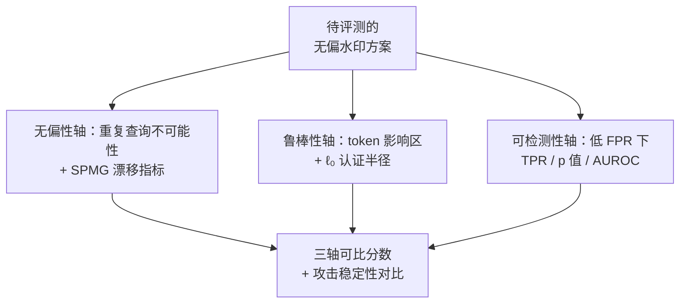

# Analyzing and Evaluating Unbiased Language Model Watermark

**会议**: ICLR2026  
**OpenReview**: [https://openreview.net/forum?id=6T4LR1oRwA](https://openreview.net/forum?id=6T4LR1oRwA)  
**代码**: https://github.com/cavosamir/UWBench.git  
**领域**: LLM 安全 / 文本水印  
**关键词**: 无偏水印、分布漂移、不可能性定理、鲁棒性认证、评测基准

## 一句话总结
本文提出 UWBENCH——首个专门评测「无偏（distortion-free）语言模型水印」的开源基准：在理论上证明了「任何可检测的无偏水印在同一 prompt 反复查询下都无法保持原分布」的不可能性定理、给出量化多次生成分布漂移的 SPMG 指标和针对 token 级编辑攻击的认证鲁棒性边界，在实证上确立「无偏性 / 可检测性 / 鲁棒性」三轴评测协议，并指出 token 替换攻击比改写攻击更能给出稳定可复现的鲁棒性结论。

## 研究背景与动机
**领域现状**：随着大模型生成文本越来越逼真，给 AI 文本「打水印」成了溯源与鉴伪的主流方案——在生成时用密钥往 token 分布里嵌入隐蔽统计信号，事后只凭密钥就能做假设检验判断文本是否出自某模型。其中一类特别重要的是**无偏水印（unbiased / distortion-free watermark）**：它要求加水印后输出分布在期望意义上与原模型一致，因此不损伤生成质量，最适合实际部署。代表方法有 γ-reweight、DiPmark、SynthID、MCmark、ITS-Edit/EXP-Edit、STA-1 等。

**现有痛点**：作者指出两个被忽视的问题。其一，**无偏只是「期望意义上的无偏」**——一次采样的期望分布等于原分布，但在同一密钥下对同一 prompt 反复生成多次，统计性质会逐渐漂移，累积出真实可见的分布偏置，破坏了原本的无偏承诺；而以往评测都只在「单 prompt 单次生成」设定下测无偏性，恰好把这种失败模式漏掉了。其二，**鲁棒性评测各家口径不一**：不同方法用不同攻击（随机编辑、改写 paraphrase、翻译）在不同协议下测，结果无法横向比较，而改写类攻击本身方差极大、结论不稳定。

**核心矛盾**：无偏性与可检测性在「反复查询」这个维度上存在根本张力——你要让水印能被检测出来，就必须在分布里留下可统计的痕迹，而这个痕迹在多次生成的样本统计上必然暴露，于是「严格保持原分布」和「可检测」无法同时成立。

**本文目标**：把无偏水印的评测从「造任务数据集」转向「给出有原理支撑、可复现的指标」，具体拆成三件事——给无偏性一个能捕捉多次生成漂移的指标、给鲁棒性一个可认证且稳定的刻画、把三轴评测标准化成一个开源平台。

**切入角度**：作者抓住「重复查询」这个被前人忽略的视角，先从理论上证明无偏在重复查询下不可能，再据此设计能测出这种漂移的统计量。

**核心 idea**：用「单 prompt 多次生成（SPMG）的分布漂移」重新定义无偏性度量，用「token 影响区长度 × 单 token 分数上界」给出 ℓ₀ 认证鲁棒半径，并把无偏 / 可检测 / 鲁棒打包成统一三轴协议。

## 方法详解

### 整体框架
UWBENCH 不是一个新数据集，而是一套「理论指标 + 实证协议」的评测框架，围绕三条轴展开：**无偏性（unbiasedness）**、**可检测性（detectability）**、**鲁棒性（robustness）**。它的输入是任意一个无偏水印方案（生成器 + 检测器），输出是该方案在三轴上的可比分数。理论侧贡献两块——重复查询下的不可能性定理 + SPMG 漂移指标（管无偏性）、token 级攻击的认证鲁棒边界（管鲁棒性）；实证侧把三轴落成具体测法，并比较改写攻击与随机 token 替换攻击的稳定性。

水印的基本设定是：语言模型给前缀 $x_{1:n}$ 的下一 token 分布为 $P_M(\cdot\mid x_{1:n})$，水印用密钥 $k$ 和重加权策略 $F$ 把它改写成 $P_W(\cdot\mid x_{1:n},k)=F\big(P_M(\cdot\mid x_{1:n}),k\big)$，再从 $P_W$ 而非 $P_M$ 采样。检测端只拿密钥 $k$ 和策略 $F$，对序列逐 token 算分 $S(x_{1:n})=\sum_i s(x_i,k,F)$，做 $H_0$（无水印）vs $H_1$（有水印）的假设检验。所谓**无偏**，定义为对随机密钥取期望后分布不变：$\mathbb{E}_{k\sim\mu}[P_W(\cdot\mid x_{1:n},k)]=P_M(\cdot\mid x_{1:n})$。

### 关键设计

**1. 重复查询下的无偏不可能性定理：戳穿「期望无偏」的假象**

针对「现有评测只在单次生成下测无偏」这个盲点，作者把无偏分成两种强度。一次性（one-shot）无偏是 $\mathbb{E}_{k\sim\mu}[P_W(\cdot\mid x,k)]=P_M(\cdot\mid x)$，对所有 prompt 成立；而真正部署时同一 prompt 会被反复查询。定理 4.1 证明：**没有任何水印方案能同时做到「在固定密钥下对同一 prompt 反复查询时仍保持原分布」与「可检测」**。换言之，任何在 one-shot 意义下无偏、又确实可被检测的方案，一旦对同一 prompt 在固定密钥下重复生成，就必然偏离 $P_M$。直觉是：可检测性要求水印在固定密钥下留下系统性偏好（否则统计量 $S$ 期望不会偏离 $H_0$），而这个偏好在多次采样的经验分布里会被放大成肉眼/统计可见的漂移——保分布与可检测在重复查询维度上不可兼得。这条定理把无偏水印的「无偏」从绝对承诺降级为「单次期望无偏」，并为下一步设计漂移指标提供了理论必然性。

**2. SPMG 单 prompt 多生成漂移指标：把「漂移」量化成有限样本可检验的统计量**

既然定理预测重复查询必然漂移，就需要一个能测出漂移幅度的指标。作者定义 **SPMG（Single-Prompt Multi-Generation）**：取 $n$ 个 prompt，对每个 prompt 在固定密钥下独立生成 $m$ 次，用任一有界的单次生成性能代理 $\mathrm{Met}(\cdot)$（如困惑度、平均对数似然、奖励分，$|\mathrm{Met}(g)|\le A$）算每 prompt 均值 $\mathrm{Met}_i(P)=\frac1m\sum_j \mathrm{Met}(g^{p_i}_j(P))$，再定义两模型间的 SPMG 间隙 $\Delta\mathrm{Met}(P,Q)=\frac1n\sum_i |\mathrm{Met}_i(P)-\mathrm{Met}_i(Q)|$。直接比 $\Delta\mathrm{Met}(P_M,P_T)$ 会混进采样噪声，于是引入原模型的独立同分布克隆 $P_{M'}$ 来扣掉自然方差，得到校准统计量

$$\mathrm{DetWmk}(P_M,P_T):=\Delta\mathrm{Met}(P_M,P_T)-\Delta\mathrm{Met}(P_M,P_{M'}).$$

数值显著为正就说明 $P_T$ 的重复查询漂移超过了 $P_M$ 自身的内在波动。更关键的是作者给了有限样本保证（定理 4.2，McDiarmid 集中不等式）：

$$\Pr\Big(\big|\mathrm{DetWmk}(P_M,P_T)-\mathbb{E}[\cdot]\big|\ge t\Big)\le 2\exp\Big(-\frac{mn\,t^2}{12A^2}\Big),$$

由此可取 $\alpha$ 水平阈值 $t_\alpha=A^2\sqrt{12\ln(1/\alpha)/(mn)}$ 来控制误报。这样 SPMG 评测既能隔离出定理 4.1 预测的分布漂移，又自带可控的假阳性保证，比以往「单 prompt 单生成」的无偏测法忠实得多。⚠️ 阈值公式中 $A$ 的幂次以原文为准。

**3. token 影响区与 ℓ₀ 认证鲁棒半径：给无偏水印一个无分布假设的最坏情况保证**

针对「鲁棒性评测口径混乱」的痛点，作者从攻击者模型出发做认证。检测时验证者只拿到文本，攻击者只能改 token——考虑编辑预算受限（最多 $b$ 次替换/插入/删除）的对手。检测器用可加统计量 $S(x)=\sum_t s_t(x)$、阈值 $\tau$，每个 token 分数有界 $s_t\in[0,B]$。核心概念是**token 影响区**：设 $C_t(x)$ 是检测器给 token $t$ 打分时用到的上下文，改动位置 $i$ 会影响所有「上下文里用到 $x_i$」的 token，其影响区长度 $R_i(x)=|\{t\ge i: x_i\in C_t(x)\}|$。对 n-gram 前缀密钥 $R_i\le n+1$（只影响 $[i,i+n]$）；对依赖整段前缀的滚动哈希 $R_i=T-i+1$（后缀全受影响）。记 $R_{\max}=\max_i R_i(x)$。由于单次编辑最多影响 $R_{\max}$ 个 token 分数、每个分数最多变 $B$，统计量关于编辑距离是 Lipschitz 的：$|S(x)-S(x')|\le b\,R_{\max}\,B$，从而得到 ℓ₀ **认证半径**：

$$S(x)-\tau > b\,R_{\max}\,B \ \Longrightarrow\ S(x')\ge\tau\ \text{对所有} \le b\ \text{次编辑的}\ x'.$$

这个界不依赖任何分布假设、是最坏情况保证。作者还对常见无偏水印族给出每次编辑的期望掉分实例化：绿名单类检测器（γ-reweight/DiPmark/STA）破坏对齐后绿 token 变随机，期望每 token 掉 $(2P_G-1)/2$，整段一次编辑掉 $\frac{(2P_G-1)}2 R$；SynthID 式比特检测每 token 含 $m$ 个二元分数，随机化后每比特趋于 $1/2$，期望掉 $(P_s-\frac m2)$。这把鲁棒性从「试几种攻击看掉多少」升级成可推导的结构性刻画。

**4. 三轴评测协议与攻击稳定性甄别：标准化打分 + 否定改写攻击**

最后把三轴落成统一打分。**无偏性分**用方法相对未加水印基线（None）在 BERTScore/ROUGE-1/困惑度/BLEU 等指标上的相对偏差刻画，分两套配置：Config 1 算相对偏差 $r^{(1)}_m=|x^{\text{method}}_{m}-x^{\text{None}}_m|/x^{\text{None}}_m$，Config 2 把上报值当作 delta 并扣掉基线噪声地板 $r^{(2)}_m=\max\{0,|\Delta^{\text{method}}_m|-|\Delta^{\text{None}}_m|\}/x^{\text{None}}_m$，聚合 $D=\lambda D_1+(1-\lambda)D_2$（默认 $\lambda=0.6$）后映射到 $100(1-D)$。**可检测性分**用低 FPR 加权的操作点分 $s_{\text{tpr}}=0.2\,\text{tpr}_5+0.3\,\text{tpr}_1+0.5\,\text{tpr}_{0.1}$ 结合 median p 值与 AUROC。**鲁棒性**则同时跑 DIPPER 强改写攻击和随机 token 替换攻击。作者实证发现：DIPPER 改写的 p 值方差极大（约为最强随机攻击 30% 替换的四倍），跨 prompt/种子结果飘忽，容易得出误导结论；而随机 token 替换给出的 p 值集中、稳定可复现。因此 UWBENCH 把 token 修改攻击作为鲁棒性基准的首选，改写攻击只作补充。

## 实验关键数据

实验沿三轴展开，覆盖 γ-reweight、DiPmark、MCmark、SynthID、ITS-Edit、EXP-Edit、STA-1 等无偏方法，并加入 KGW、Unigram 两个有偏方法作参照，模型用 Llama-3.2-3B-Instruct、Mistral-7B-Instruct-v0.3、Phi-3.5-mini-instruct。

### 主实验

无偏性用两套配置对比「原模型 vs 加水印」的任务指标偏差：配置 a) 1000 prompt × 1 次生成（常规无偏），配置 b) 10 prompt × 1000 次生成（SPMG，测重复查询漂移）。下表摘取 SPMG 配置下文本摘要的偏差（值越小越无偏）：

| 方法 | TS-BERTScore 偏差 | ROUGE-1 偏差 | 困惑度偏差 | 说明 |
|------|------|------|------|------|
| No watermark | 0.0026 | 0.0017 | 0.1828 | 基线噪声地板 |
| γ-reweight | 0.0071 | 0.0081 | 0.1570 | 重复查询下漂移很小 |
| MCmark(n=50) | 0.0069 | 0.0076 | 0.2771 | 漂移小 |
| STA-1 | 0.0046 | 0.0035 | 0.1505 | 漂移小 |
| SynthID | 0.0159 | 0.0227 | 0.8254 | 漂移明显增大 |
| EXP-Edit | 0.0422 | 0.0413 | 2.0032 | 漂移最严重 |
| ITS-Edit | 0.0355 | 0.0533 | 1.4912 | 漂移严重 |

关键现象是：在单次生成（配置 a）下各无偏方法几乎都贴着基线、看不出差别，但一进入 SPMG 重复查询，EXP-Edit、ITS-Edit、SynthID 等方法的偏差成倍放大——这正是定理 4.1 预测的、被旧评测漏掉的漂移，验证了 SPMG 指标的判别力。

可检测性（跨模型/数据集平均）下，无偏方法里 MCmark 与 SynthID 最强：

| 方法 | TPR@5% | TPR@1% | TPR@0.1% | AUROC |
|------|------|------|------|------|
| SynthID | 99.03% | 97.29% | 94.66% | 0.995 |
| MCmark(n=10) | 98.51% | 97.09% | 94.57% | 0.993 |
| γ-reweight | 83.68% | 75.85% | 66.43% | 0.960 |
| STA-1 | 84.55% | 73.79% | 59.4% | 0.953 |
| ITS-Edit | 55.11% | 48.29% | 41.67% | 0.804 |

### 消融实验

鲁棒性（TPR@1%FPR）对比不同攻击，凸显改写 vs 随机替换的差异：

| 方法 | DIPPER 改写 | Random 30% | Random 20% | Random 10% |
|------|------|------|------|------|
| γ-reweight | 0.73% | 2.53% | 11.47% | 26.95% |
| SynthID | 3.02% | 7.71% | 14.58% | 26.25% |
| MCmark(n=10) | 5.10% | 39.26% | 73.37% | 96.11% |
| STA(γ=0.5) | 2.29% | 4.90% | 12.29% | 21.56% |
| EXP-Edit | 0.94% | 15.21% | 21.46% | 26.98% |

### 关键发现
- **重复查询是无偏水印的真正软肋**：单次生成测不出问题，SPMG 一上来 EXP-Edit/ITS-Edit/SynthID 的困惑度偏差就从 ~0.2 飙到 1.5~2.0，说明「无偏」必须在多次生成下重新审视。
- **改写攻击不适合做鲁棒性基准**：DIPPER 的 p 值标准差约为最强随机攻击的四倍，跨 prompt/种子结果发散；随机 token 替换的 p 值集中稳定，更适合做可复现评测。
- **可检测性与鲁棒性存在权衡**：在 DIPPER 这类强改写下，绝大多数无偏方法 TPR@1% 都跌到个位数（γ-reweight 仅 0.73%），有偏的 Unigram 反而靠分布扰动更耐攻击（但代价是质量受损）。

## 亮点与洞察
- **把「无偏」从信仰拉回现实**：定理 4.1 用一句不可能性把「无偏水印不损分布」的隐含假设证伪——可检测与重复查询保分布根本不可兼得，这是对整条技术路线的认知校正，而非又一个新方法。
- **SPMG 指标设计很巧**：用原模型的 i.i.d. 克隆 $P_{M'}$ 扣掉采样噪声地板，再配 McDiarmid 集中给出有限样本阈值，让「分布漂移」从定性观察变成带误报控制的统计检验，这套「克隆扣噪 + 集中不等式」范式可迁移到其他「期望无偏但多次采样会暴露」的场景。
- **token 影响区是认证鲁棒的关键抽象**：把「改一个 token 能影响多少分数」用 $R_i(x)$ 统一刻画，n-gram 密钥 $R\le n+1$、滚动哈希 $R=T-i+1$ 一下子解释了「为什么长上下文密钥更脆」，并直接导出无分布假设的 ℓ₀ 认证半径，思路可借给其他可加统计量检测器做鲁棒认证。
- **「翻译攻击太强反而没意义」的提醒很实在**：翻译几乎改掉所有 token，任何无偏水印都活不下来，于是所有方法都「同样差」、失去区分度——评测攻击强度要适中才有判别力。

## 局限与展望
- **理论指标依赖有界代理 $\mathrm{Met}$ 与 $|\mathrm{Met}|\le A$**：困惑度等代理并非天然有界，实际需要截断/归一，截断方式会影响 SPMG 阈值，论文对此的敏感性分析不足。
- **认证鲁棒是最坏情况、偏保守**：ℓ₀ 半径 $b R_{\max}B$ 在滚动哈希下 $R_{\max}=T$，认证半径会非常小，实际可证明的鲁棒区间可能很窄，与经验鲁棒性之间有差距。
- **三轴打分的聚合带主观超参**：无偏性分里的 $\lambda=0.6$、可检测性分里的 0.2/0.3/0.5 权重都是默认值，不同权重可能改变方法排名，缺少对这些聚合选择的稳健性讨论。
- **改进方向**：可探索「重复查询下漂移可控」的新重加权策略（在不可能性允许的范围内最小化漂移），以及把认证从 ℓ₀ 推广到语义保持的编辑预算。

## 相关工作与启发
- **vs 有偏统计水印（KGW、Unigram）**：它们往 logits 加固定 $\delta$ 或用一元哈希增强鲁棒，代价是改变输出分布、损质量；本文聚焦不损质量的无偏水印，并指出无偏方法在强改写下鲁棒性反而更弱，是一种本质权衡。
- **vs 现有水印基准（WaterBench、MarkMyWords、MarkLLM）**：这些基准覆盖的大多是有偏方法，缺少针对无偏水印的专门指标；UWBENCH 是首个为无偏水印量身定制、且带理论指标（SPMG、认证鲁棒）的基准。
- **vs 各无偏水印方法（Aaronson Gumbel、Christ inverse-sampling、Hu γ-reweight、DiPmark、SynthID、MCmark、ITS/EXP-Edit、STA-1）**：本文不提出新水印，而是把它们放进统一三轴协议横向体检，揭示「单次无偏≠重复查询无偏」「改写攻击评测不稳」等被各自论文掩盖的问题。

## 评分
- 新颖性: ⭐⭐⭐⭐⭐ 用不可能性定理重新定义无偏、配 SPMG 漂移指标与 ℓ₀ 认证鲁棒，是对整条无偏水印路线的理论校正
- 实验充分度: ⭐⭐⭐⭐ 覆盖 9 种水印 × 3 模型 × 多数据集，三轴齐全；但聚合超参与有界代理的敏感性分析略欠
- 写作质量: ⭐⭐⭐⭐ 理论与实证衔接清晰、动机层层递进；部分公式排版（阈值幂次）需对照原文确认
- 价值: ⭐⭐⭐⭐⭐ 首个无偏水印专用开源基准 + 可复现协议，对该子领域的后续评测有标准化意义

<!-- RELATED:START -->

## 相关论文

- [\[ACL 2025\] Improved Unbiased Watermark for Large Language Models](../../ACL2025/llm_safety/improved_unbiased_watermark_for_large_language.md)
- [\[ICLR 2026\] ManagerBench: Evaluating the Safety-Pragmatism Trade-off in Autonomous LLMs](managerbench_evaluating_the_safety-pragmatism_trade-off_in_autonomous_llms.md)
- [\[ICLR 2026\] Breaking Agent Backbones: Evaluating the Security of Backbone LLMs in AI Agents](breaking_agent_backbones_evaluating_the_security_of_backbone_llms_in_ai_agents.md)
- [\[ICLR 2026\] Self-Destructive Language Model](self-destructive_language_model.md)
- [\[ICLR 2026\] VoxPrivacy: A Benchmark for Evaluating Interactional Privacy of Speech Language Models](voxprivacy_a_benchmark_for_evaluating_interactional_privacy_of_speech_language_m.md)

<!-- RELATED:END -->
