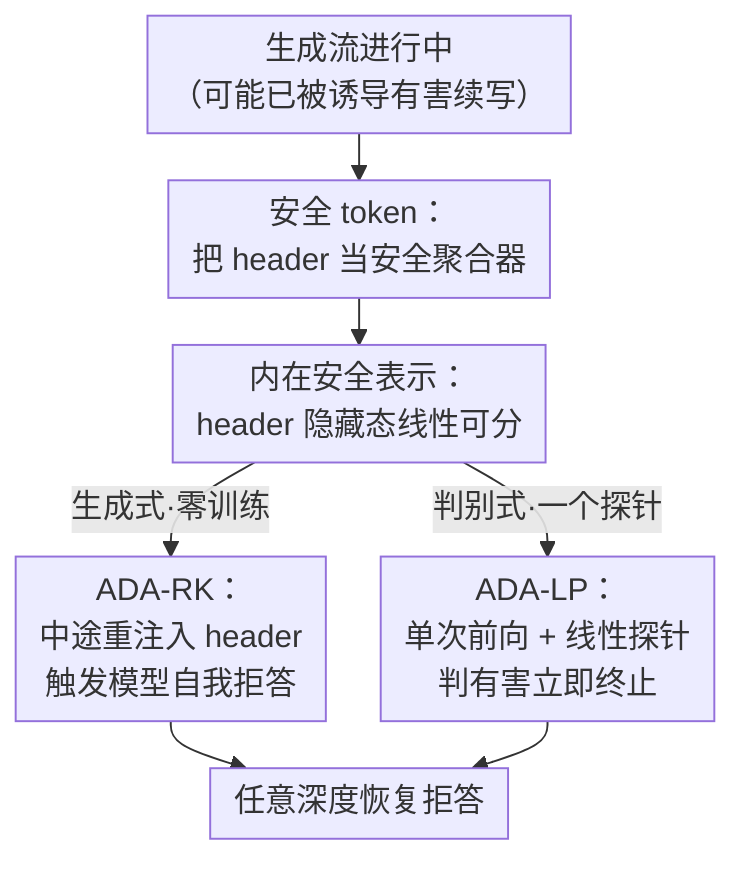

# Any-Depth Alignment: Unlocking Innate Safety Alignment of LLMs to Any-Depth

**会议**: ICLR2026  
**OpenReview**: [https://openreview.net/forum?id=0fuYOuJyzl](https://openreview.net/forum?id=0fuYOuJyzl)  
**代码**: 待确认  
**领域**: LLM 安全 / 对齐 / 推理时防御  
**关键词**: 浅层对齐、prefill 攻击、Safety Token、线性探针、推理时防御

## 一句话总结
针对 LLM「浅层对齐」一旦进入有害续写就守不住的痛点，本文发现安全信号其实牢牢锚定在 assistant header 这类「安全 token」上、且在任意生成深度都可被重新激活，于是提出 Any-Depth Alignment（ADA）——推理时把 header 重新插回生成流中重新唤起模型自带的拒答（ADA-RK），或直接对 header 隐藏态跑一个线性探针判别有害性（ADA-LP），无需改动模型权重就把上千 token 深度 prefill 攻击的拒答率拉回近 100%、把 GCG/AutoDAN/PAIR/TAP 等攻击成功率压到 3% 以下。

## 研究背景与动机
**领域现状**：当下绝大多数对齐过的 chat 模型采用所谓的「浅层对齐（shallow alignment）」——训练目标主要是在助手回合**最开头**，碰到有害问题就直接吐一句拒答（"I can't help with that."）。这种「前置式」安全在面对直接有害提问时确实有效。

**现有痛点**：浅层对齐的保护几乎只覆盖生成的第一步。一旦有害续写已经开始（无论是被对抗攻击诱导，还是被有害 assistant-prefill 强行喂进上文），保护就崩盘。论文 Figure 1 显示：在 AdvBench 上只要塞 25 个 token 的有害前缀，多数模型的拒答率就从 ~100% 暴跌到 10% 以下，连 gpt-oss 这类新模型也不例外。

**核心矛盾**：业界的补救思路是「深层对齐（deep alignment）」——额外训练模型在续写中途也能拒答。但本文系统地用「深度 prefill 攻击」（几十到几千 token 的有害前缀）一测，发现深层对齐只是把失效点往后推，形成「攻击深度 vs 对齐深度」的军备竞赛：即便是 Claude Sonnet 4 这种强深层对齐模型，在 100-token 前缀下拒答率也跌破 25%。另一条路——外挂 guardrail 分类器——延迟太高，往往要等整段生成完才标记，有害内容可能已经发出去了。问题的根因是：模型对「有害」的认知没有泛化到任意深度，安全判断被锁死在了解码轨迹里。

**切入角度**：作者注意到一个被忽视的现象——对齐模型其实「心里清楚」自己的续写有没有害，只是不主动说出来。简单的自反思提问（"你刚才的回答有害吗？"）常能让它承认。这说明强安全信号确实存在，只是锁在隐藏态里没被读出来。进一步地，chat 模板里的特殊 token（尤其是 assistant header）能在中途把这个潜在判断「surface」出来。

**核心 idea**：把 assistant header 这类 token 重新定义为「安全 token（Safety Tokens）」——它们是聚合器，能把上文分散的有害证据汇聚成一个线性可分的表示。于是只要在生成中途**重新注入** header，就能像插钥匙一样解锁模型的内在安全判断，在任意深度恢复拒答；甚至不需要让它真的生成，直接对 header 隐藏态做线性分类就够了。

## 方法详解

### 整体框架
ADA 是一套**推理时、零训练（或仅训练一个轻量探针）、不改基座权重**的防御。它的全部根基是一个观察：模型对有害性的内在判断，高度集中在「安全 token」（默认是 assistant header，如 Llama-3.1 的 `<|eot_id|><|start_header_id|>assistant<|end_header_id|>\n\n`）的隐藏态里；而且这个信号在生成进行到任意深度时，都能通过「中途重新注入 header」被重新激活。

围绕这个观察，本文先用一组分析实验（t-SNE + 线性探针）回答四个问题——为什么 header 重注入比只查 prompt 更强、为什么探 header 而不是探已生成的内容 token、header 隐藏态是否线性可分、换别的 token 行不行——夯实「安全信号集中在 header」这一基石；再据此落地两个互补的防御变体：生成式的 **ADA-RK**（让模型自己重新生成拒答）和判别式的 **ADA-LP**（直接探隐藏态、连生成都省了）。运行时，每隔固定深度（如每 25 或 100 个 token）设一个「安全检查点」，在检查点上触发 ADA 判定，一旦判为有害就立即终止生成。

### 关键设计

**1. 安全 token：把 assistant header 重定义为安全信号的聚合器**

痛点在于浅层对齐把拒答能力压在了生成最开头，深度一深就失效。作者发现 assistant header 这串桥接「用户提问」和「助手回答」的特殊 token，并不只是模板占位——它在反复的「浅层拒答训练」中被反复使用，因而沉淀了模型最强的对齐先验。论文给它起名「安全 token」：定义生成深度 $d$ 为用户 prompt 之后已生成的助手 token 数，$d=0$ 紧接 prompt；安全 token 的隐藏态携带强内在安全信号，把上文分散的有害证据**聚合**成一个干净的判别量。关键证据来自 Figure 3 的 t-SNE：在 $d=0$ 处，无论是已生成 token 还是 header，特征都纠缠在一起（这也解释了为什么对抗 prompt 攻击能得手——早期表示本就模糊）；但随着深度增加，**注入的安全 token** 的特征越来越可分（线性分类准确率从 ~67% 升到 95%+），而**已生成内容 token** 的特征反而越来越纠缠。这说明模型的内在安全意识其实随上下文增强，只是只能透过安全 token 干净地读出来。

**2. 内在安全表示：header 隐藏态对有害/良性高度线性可分**

既然安全 token 把证据聚合了，自然要问它是不是「线性可分」——若是，就能用最轻的线性探针读出来。作者从 WildChat / WildJailbreak 构造良性/有害续写语料（训练 20k/2k、验证 10k/1k 段对话），把 assistant 回复截到 500 token、每 25 token 采一次隐藏态，得到 60 万/6 万训练/验证样本，训一个 `LogisticRegression`。结论很硬（Figure 4 左）：在 Llama、Mistral、Gemma、DeepSeek、gpt-oss 等所有模型家族、几乎所有层上，探 assistant-header 隐藏态的验证准确率都 $>99.5\%$，且一致、显著地高于探「最后一个已生成 token」。Figure 4 右进一步做 token 选择消融：与 header 绑定的 token（`assistant` 角色 token、`<|eot_id|>`、`<|start_header_id|>` 等）信号都远强于通用 token（如换行 `\n`），其中 `assistant` 角色 token 往往分离度最好，有时甚至超过整段 header 的末位 token。这把「为什么是 header、为什么线性可分、换哪个 token 最好」三件事一次性钉死，也成为 ADA-LP 的直接依据。

**3. ADA-RK：中途重注入 header，让模型自己「重新想一遍」并拒答**

这是生成式变体，完全零训练。机制是：在周期性深度（如每 100 token）设检查点，**复用当前 KV cache 把生成流 fork 一份**，往里注入 assistant header 的安全 token，让模型做一段短的 lookahead（最多约 20 token 前瞻）。如果这段前瞻里出现了拒答，就把它返回并终止主生成流；否则丢弃这条 fork 分支、继续原序列。直观上，header 的突然插入会让模型「重新评估当前轨迹是否有害」并恢复拒答行为——它借的是模型**自己生成拒答**的能力，所以基座对齐越强，ADA-RK 解锁得越可靠。论文报告：它能把 Claude Sonnet 4 在 500-token 深 prefill 下的拒答率恢复到 95%+，且不需要像 Self-Defense 那样显式写一句反思 prompt。

**4. ADA-LP：单次前向 + 线性探针，连生成都不用，直接判停**

设计 2 已证明有害性在隐藏态里本就线性可分，那其实连「让模型生成拒答」都多余。ADA-LP 在检查点上只做**一次前向**，取出注入的安全 token 的隐藏态，套上设计 2 训好的那个轻量线性探针判别有害性；一旦命中就立即终止生成流。它的探针在 Wild 语料上**只训一次**，之后在所有下游 benchmark 上做 out-of-distribution 评测，泛化很强。相比 ADA-RK 它免去了额外解码（更快、更省显存），相比外挂 guardrail 它不需要任何辅助模型或权重更新——**基座模型成了自己的 guardrail**。更妙的是，即便某些模型（如 DeepSeek）在「回答层面」看着不太对齐、ADA-RK 表现一般，ADA-LP 仍能近 100% 拦截，说明安全信号在隐藏态里持续存在、哪怕没被说出口。

## 实验关键数据

### 主实验
评测覆盖三类威胁模型：深度 prefill 攻击、对抗 prompt 攻击、SFT 攻击；并测良性任务的过度拒答（over-refusal）与推理开销。基座涵盖 Gemma 2、Llama 2/3.1、Qwen 2.5、DeepSeek-R1-Distill-Qwen-7B、gpt-oss、Claude Sonnet 4。深 prefill 数据由一个故意被微调成 misaligned 的 GPT 模型生成（对 AdvBench/JailbreakBench/StrongREJECT/HEx-PHI 有害提问达到 100% 攻击成功率，平均续写超 3500 token）。

下表为 base=gemma-2-9b-it、500-token 有害 prefill（$d=500$）下的拒答率（↑越高越好）：

| 方法 | AdvBench | JailbreakBench | HEx-PHI | StrongREJECT |
|------|----------|----------------|---------|--------------|
| Base Model | 0.4% | 0.0% | 1.3% | 0.0% |
| Deep Alignment | 58.1% | 56.0% | 47.0% | 61.3% |
| Self Defense | 99.2% | 95.0% | 95.0% | 98.7% |
| Llama-Guard-4-12B | 94.6% | 91.0% | 93.0% | 94.9% |
| Granite-Guardian-3.3-8b | 99.6% | 98.0% | 95.6% | 98.7% |
| ADA (RK) | 90.8% | 85.0% | 79.2% | 93.6% |
| **ADA (LP)** | **100.0%** | **100.0%** | **99.7%** | **100.0%** |

对抗 prompt 攻击（AdvBench 子集，攻击成功率 ASR ↓越低越好，gemma-2-9b-it）：ADA-LP 把 GCG/AutoDAN/PAIR/TAP 的 ASR 全部压到 2% 上下；base 模型对应为 56/92/70/88%，Deep Alignment 在 AutoDAN 上甚至高达 94%（比 base 还差）。整体上 ADA-LP 把四种攻击平均 ASR 从 >50% 压到 2%，在 Llama-2 上 PAIR/TAP 直接打到 0%。

### 消融实验

| 配置 | 关键指标（$d=500$ 深 prefill 拒答率 / 良性过度拒答） | 说明 |
|------|------|------|
| ADA (LP) 完整 | 近 100% / XSTest 仅 0.4% | 探 header 隐藏态 + 线性探针 |
| 探针换探「已生成 token」 | 准确率随深度下降到 ~51-55%（Figure 3） | 失去线性可分性，验证「必须探 header」 |
| 注入 token 换通用 `\n` | 分离度明显低于 header token（Figure 4 右） | 验证安全信号特属于 header 类 token |
| ADA (RK) 替代 LP | 79-94%（随基座对齐强弱波动） | 生成式可用但弱于判别式、依赖基座对齐 |

良性过度拒答（Table 1 右块，越低越好）：ADA-LP 在 GSM8K/MATH/HumanEval/MMLU/GPQA 等基本 0%，XSTest 仅 0.4%（base 模型 XSTest 反而高达 14.0%），说明判停非常精准、几乎不误伤正常任务。

### 关键发现
- **深度不变性是 ADA-LP 的核心优势**：Base 几乎立刻崩、Deep Alignment 只在浅层有效（$d=500$ 约 40% 拒答），而 ADA-LP 在 2500 token 深度内始终保持近 100%——因为它读的是「内在表示」而非「表面是否说了拒答」。
- **安全信号即使没被说出口也存在**：DeepSeek 在回答层面看着不太对齐、ADA-RK 一般，但 ADA-LP 仍近 100%，证明隐藏态里的安全表示稳定可读。
- **对 SFT 攻击的韧性**（Figure 7，Gemma-2）：仅 50 步 Alpaca 良性微调就能把 Deep Alignment 在 $d=100$ 的拒答率从 90% 砸到 10%；而 ADA-LP 在 1000 步良性 SFT 后仍 >99% 拒答，对抗 SFT 下也保持 ~90%（Llama-2 上 ~100%）。表层对齐被微调抹掉，隐藏态里的安全表示依然在。
- **token 选择**：`assistant` 角色 token 分离度最佳，单个 assistant token 就远胜通用 token——这让方法部署极简。

## 亮点与洞察
- **「安全 token = 聚合器」是真正的「啊哈」点**：把一个一直被当作模板占位的 header，重新诠释成「模型把分散有害证据汇聚成线性可分量」的探测口，既给出机制解释（为什么浅层拒答训练会让 header 沉淀对齐先验），又直接导出极简方法。
- **同一个观察，两种落地（生成式 RK / 判别式 LP）互为印证**：RK 证明「重注入 header 能让模型自己改口」，LP 证明「这个判断在隐藏态里本就可读、连生成都省」，两者一起把「安全信号锁在轨迹里」这件事讲得非常完整。
- **零基座改动、零额外模型、近乎零开销**，却在三类威胁模型上同时超过强外挂 guardrail——「让模型当自己的 guardrail」这个思路很有迁移性。
- **可迁移**：「探特殊聚合 token 的隐藏态而非内容 token」这一思路，可推广到幻觉检测、越权检测、内容审计等任何「模型心里有数但嘴上不说」的判别任务。

## 局限与展望
- **依赖基座本身有强对齐先验**：ADA-RK 明确「基座对齐越强、解锁越可靠」；对几乎没做过安全对齐的模型，header 里可能本就没沉淀足够信号，方法收益会打折。
- **ADA-LP 需要一个训练好的探针**：虽轻量且只训一次，但仍需有害/良性语料；探针在全新领域/语言/新型攻击上的 OOD 稳健性还需更多验证（论文只在 Wild 语料训、在英文 benchmark 测）。
- **检查点周期是个超参权衡**：检查间隔大则有害内容可能先流出一段，间隔小则增加前向开销；论文用每 25/100 token，但未系统给出不同间隔下的安全-开销曲线（正文）。
- **自适应攻击者**：方法公开后，攻击者可能针对性地干扰 header 注入或伪装隐藏态分布，论文未充分评估这类「知道 ADA 存在」的自适应对手。

## 相关工作与启发
- **vs Deep Alignment（Qi et al., 2025）**：深层对齐靠**改权重**训模型在中途拒答，本文实验显示它只是把失效点推深、且极易被几十步 SFT 抹掉；ADA 不改权重、读内在表示，深度不变且抗 SFT。
- **vs Self-Defense（Phute et al., 2023）**：自反思靠**显式 prompt**让模型评判前文，需要额外长生成、在推理型模型上失效；ADA-RK 同样零训练但无需反思 prompt，ADA-LP 更是连生成都免。
- **vs 外挂 Guardrail（Llama Guard / WildGuard / ShieldGemma / Granite-Guardian 等）**：guardrail 是独立模型、延迟高且常在生成后才标记；ADA-LP 用基座自身隐藏态、单次前向即可判停，开销更低且效果匹配甚至超过最强 guardrail。
- **vs 基于「prompt 末位隐藏态」的检测（Zhao et al., 2025）**：这类方法在 $d=0$ 处特征本就纠缠、不够可靠；本文指出安全信号随深度才变可分、且只在注入的 header 上干净浮现，这是检测口选择上的关键差异。

## 评分
- 新颖性: ⭐⭐⭐⭐⭐ 「安全 token 聚合 + 任意深度重激活」的视角既新且解释力强，由观察直接导出极简方法。
- 实验充分度: ⭐⭐⭐⭐⭐ 覆盖 6+ 模型家族、三类威胁模型、深至 2500 token，含 t-SNE/层扫/token 消融与 SFT 韧性。
- 写作质量: ⭐⭐⭐⭐⭐ 用 Q1-Q4 串起分析、机制与方法，逻辑链清晰、图表支撑到位。
- 价值: ⭐⭐⭐⭐⭐ 零改权重、近零开销、可即插即用的强防御，对 LLM 安全部署有直接落地价值。

<!-- RELATED:START -->

## 相关论文

- [\[ICLR 2026\] The Alignment Waltz: Jointly Training Agents to Collaborate for Safety](the_alignment_waltz_jointly_training_agents_to_collaborate_for_safety.md)
- [\[ICLR 2026\] SOSBench: Benchmarking Safety Alignment on Six Scientific Domains](sosbench_benchmarking_safety_alignment_on_six_scientific_domains.md)
- [\[ICLR 2026\] Computational Barriers to Filtering for AI Alignment](computational_barriers_to_filtering_for_ai_alignment.md)
- [\[ACL 2026\] CAP: Controllable Alignment Prompting for Unlearning in LLMs](../../ACL2026/llm_safety/cap_controllable_alignment_prompting_for_unlearning_in_llms.md)
- [\[ACL 2026\] Reasoning Structure Matters for Safety Alignment of Reasoning Models](../../ACL2026/llm_safety/reasoning_structure_matters_for_safety_alignment_of_reasoning_models.md)

<!-- RELATED:END -->
