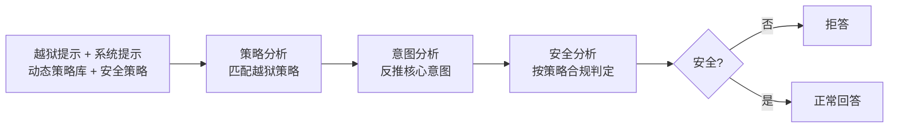

# ARMOR: Aligning Secure and Safe Large Language Models via Meticulous Reasoning

**会议**: ICLR 2026  
**OpenReview**: [https://openreview.net/forum?id=Wx5xG7FPXK](https://openreview.net/forum?id=Wx5xG7FPXK)  
**代码**: [https://github.com/SaFo-Lab/armor](https://github.com/SaFo-Lab/armor)  
**领域**: LLM 安全 / 越狱防御 / 安全对齐  
**关键词**: 越狱防御, 意图提取, 安全推理, 策略库, 步骤级 DPO, 测试时扩展  

## 一句话总结
ARMOR 把"防越狱"重新表述为"提取核心恶意意图"问题，通过「策略分析 → 意图分析 → 策略性安全审查」的三步精细化推理（Meticulous Reasoning），配合可外挂更新的越狱策略库，将先进的优化型越狱攻击成功率从 0.4+ 压到 0.06。

## 研究背景与动机
**领域现状**：SFT/RLHF 等后训练对齐能降低有害输出，但仍易被越狱绕过；近期的 system-2 方法（o1、STAIR、STAR-1）在推理时先评估风险再回答，安全性显著提升。

**现有痛点**：本文发现这些"安全推理"模型在面对**先进优化型越狱**（AutoDAN-Turbo、Adversarial Reasoning）时几乎失守——这些攻击通过 LLM agent/树搜索迭代生成"看似无害"的提示词，把恶意目标藏在角色扮演、教育包装之类的外壳里，属于训练分布外（OOD）的攻击。conventional 安全模型严重依赖安全数据分布，对 OOD 越狱毫无招架之力（o1/STAR-1 的 ASR 高达 0.66/0.88）。

**核心矛盾**：靠"记住"越狱样式来防御是个死胡同——新越狱层出不穷，持续重训（如应对 FlipAttack）成本高到不可行。

**本文目标**：找到一种不依赖越狱样式枚举、能泛化到未见过攻击的防御机制。

**核心 idea**：**[意图归一化]** 作者观察到，无论攻击外壳多花哨，所有越狱最终都指向同一个核心恶意意图——只要把核心意图准确抽出来，OOD 越狱就被"降格"成了 in-distribution 的直白有害请求，模型立刻就能防住（实验证实抽对意图时安全率 100%）。而抽意图的关键洞察是**逆向工程**：越狱提示是"给定攻击目标 + 套用某种隐藏策略"生成的，所以只要先识别出用了哪种策略，就能反推出被隐藏的真实意图。

## 方法详解

### 整体框架
ARMOR 训练模型执行三步式 **Meticulous Reasoning**：先从外挂策略库里匹配该提示用了哪种越狱策略（策略分析），再据此反推核心意图（意图分析），最后用安全策略对意图做合规判定（安全分析），不安全则拒答。关键设计是把策略库做成**外挂、可在推理时通过 system prompt 动态替换**的形式——模型学的不是"记住所有策略"，而是"学会使用策略库"，从而泛化到未见策略。整条流水线含 5 个环节：构造推理数据、格式化、SFT 训练、推理、以及基于"每步可验证"特性做的步骤级偏好学习与测试时扩展。

### 关键设计

**1. 逆向意图提取的三步推理：把越狱拆解成可审查的核心意图**
ARMOR 不直接判断"这段提示是否有害"，而是分三步把外壳剥掉。数据构造上用两条路径凑出 {越狱提示 $x_i$, 真值策略 $s_i^G$, 真值意图 $b_i^G$} 三元组：一是 behavior-based，从有害行为 $b_i$ 出发随机采样策略 $s_i$ 用 LLM 改写成越狱提示，$x_i = M(b_i, s_i)$；二是 jailbreak-based，对已有越狱提示反向识别其策略和意图 $\{b_i, s_i\} = M(x_i)$ 再按安全性过滤。然后让 LLM 补全各步推理链：策略分析 $z_i^s = M(x_i, s_i^G)$、意图分析 $z_i^b = M(x_i, s_i^G, b_i^G)$、安全分析 $z_i^c = M(b_i^G, h)$（$h$ 为安全策略），三步用 `<step>`/`</step>` 特殊 token 分隔，构成训练输出 $\{z_i^s, z_i^b, z_i^c, y_i\}$。

**2. 动态策略库 + 外挂式 system prompt：把"记策略"换成"会用策略库"**
为了让防御能泛化到训练时没见过的越狱手法，ARMOR 把策略库（每条含名称、定义、示例）和安全策略一起放进 system prompt，而非编码进权重。训练时关键一招是**随机丢弃无关策略**（dynamic strategy library $r_i$），逼模型学会"现场检索匹配"而不是死记整个库——这样推理时换一套自定义策略库（custom strategy library），模型照样能用。SFT 目标为：

$$\mathcal{L}^{SFT}_\theta = -\mathbb{E}_{x,r}\big[\log P(z_i^s, z_i^b, z_i^c, y_i \mid x_i, r_i, h; \theta)\big]$$

消融显示去掉策略库后 WildJailbreak 合规率从 0.003 飙到 0.084，去掉策略分析步骤更是涨到 0.052（vs 0.003），印证逆向链条缺一不可。

**3. 步骤级接地偏好学习与测试时扩展：用可验证奖励逐步打磨安全**
由于三步推理每一步都有 ground truth（策略对不对、意图对不对、安全判定对不对），ARMOR 能给每步单独打分 $R_s = [r_{strategy}, r_{intent}, r_{safety}, r_{final}]^\top$。具体做 **grounded step-wise tree sampling**：每步采样 $n$ 个候选，用 GPT-4o 按对应真值评分，只保留最高分与最低分节点继续展开，构成偏好对，喂给步骤级 DPO（在 SFT 模型上优化 $z_i^{win}$ vs $z_i^{lose}$）。同样的偏好数据再训一个 PRM 用于测试时扩展：推理时每步 beam search 采 $m$ 个候选选 PRM 最高分的继续，或 best-of-N 选最终答案最优者——在最难子集 ExHarm 上安全率从 0.74 随算力升到 0.92（$N=16$）。

**4. ARMOR-Think：解耦安全推理与通用推理，省 2/3 思考开销**
为兼顾效用与效率，ARMOR-Think 在两点上改造训练数据：一是**简化安全推理**，用 GPT-4o 把三步精炼成 $\tilde{z}$，平均 token 砍到原来的 1/3；二是**注入自由思考**，对判定为安全的指令在答案区用 `<think>`/`</think>` 插入 CoT 推理（由 DeepSeek-Distilled-Qwen-7B 生成）。由于安全推理与通用推理被解耦，可分别给奖励——提出**三元奖励** $R_{tr} = R_{st} \odot (I_s \odot R_s + I_h \odot R_h)$，其中 $R_{st}$ 为结构分（保证推理格式与 `<think>` 标签正确）、$R_s$ 为安全分、$R_h$ 为帮助性分，指示向量 $I_s, I_h$ 按指令安全与否切换关注对象（安全指令只奖励最终答案的帮助性，不安全指令只奖励各步安全性）。

## 实验关键数据

基座为 Qwen2.5-7B-Instruct，安全数据 15k 有害 + 10k benign + 25k helpfulness，共 50k。

### 主实验表格（ASR / 合规率，越低越好）

| Benchmark (↓) | o1 | o3-mini | Qwen-2.5 | STAIR-DPO | STAR-1 | **ARMOR** | **AR-Think** |
|---|---|---|---|---|---|---|---|
| AutoDAN-Turbo | 0.440 | 0.500 | 0.960 | 0.280 | 0.440 | **0.040** | 0.040 |
| AdvReasoning | 0.660 | 0.580 | 0.980 | 0.520 | 0.880 | 0.080 | **0.060** |
| avg. attack | 0.550 | 0.540 | 0.970 | 0.400 | 0.660 | 0.060 | **0.050** |
| avg. harmfulness | 0.068 | 0.076 | 0.261 | 0.049 | 0.081 | **0.002** | 0.009 |
| XSTest Safe (↑) | 0.900 | 0.888 | 0.968 | 0.716 | 0.680 | 0.860 | 0.842 |

ARMOR 在优化型越狱上平均 ASR 仅 0.06（其他推理模型均 >0.40），平均有害率 0.002（比现有方法低 95%），且在过度拒答指标 XSTest Safe 上（0.860）显著优于 STAIR/STAR-1，说明它能更好区分有害与良性。

### 消融实验表格

| 配置 | PAIR (↓) | WildJailbreak (↓) |
|---|---|---|
| ARMOR (完整) | 0.016 | 0.003 |
| − w/o 策略分析步骤 | 0.131 | 0.052 |
| − w/o 策略库 | 0.020 | 0.084 |
| − w/o 安全策略 | 0.017 | 0.006 |

效用方面（GSM8k/MATH）：ARMOR 0.86/0.76（接近基座 Qwen-2.5 的 0.89/0.79），AR-Think 提升到 0.91/0.84，在 GSM8k 上反超 DeepSeek-R1-Distill-Qwen-7B（0.90）。

### 关键发现
- **前步准则后步准**：策略分析准 → 意图分析准 → 安全分析准 → 最终答案好，逐级传导。意图抽对时安全率 100%，抽错时靠策略性安全审查也能纠正部分错误。
- **外挂工具需"会用"才有效**：直接给 Qwen/o1/o3-mini 配上同样的策略库+安全策略也能提升安全，但远不及 ARMOR，说明 Meticulous Reasoning 的"用工具能力"才是关键。
- **泛化未见策略**：对未见过的越狱策略也能把攻击成功率降到 0。
- **效率**：AR-Think 安全推理 token 开销比 ARMOR 减少 2/3。

## 亮点与洞察
- **问题重构很漂亮**：把"识别千变万化的越狱外壳"这个开放式难题，归约成"提取唯一的核心意图"这个有界问题，OOD 越狱被降格成 in-distribution，从根上解决泛化。
- **逆向工程思路**：先识别隐藏策略再反推意图，比直接判断有害与否更鲁棒，因为攻击者的"生成过程"本身是可逆的。
- **可验证性带来的红利**：三步推理每步都有 ground truth，天然适配步骤级 DPO 和 PRM 测试时扩展——安全推理的"过程可验证"是相比通用推理的独特优势。
- **工具外挂化**：策略库放在 system prompt 而非权重里，应对新越狱时只需更新库而无需重训，工程上极具实用价值。

## 局限与展望
- **依赖外部 LLM 与真值标注**：数据构造、步骤评分大量依赖 GPT-4o，策略库与意图标注质量直接决定上限。
- **威胁模型假设较强**：假设 LMaaS 场景下攻击者看不到思考过程与 system prompt，若策略库/安全策略泄露或被注入，防御可能被针对性绕过。
- **效用仍有微小损失**：ARMOR 在 MATH 上（0.76）低于基座（0.79），纯安全版本存在 safety tax，需靠 AR-Think 的自由思考找补。
- **策略库覆盖边界**：虽能泛化未见策略，但若攻击者构造与库中所有策略都正交的全新手法，逆向推理是否仍奏效有待更对抗性的检验。

## 相关工作与启发
- **vs STAIR / STAR-1 / o1（安全推理）**：同属推理时安全评估，但 ARMOR 把推理结构化为"策略→意图→合规"三步并引入外挂策略库，解决了它们在 OOD 越狱上的失守。
- **vs deliberative alignment（策略推理）**：都强调 policy reasoning，ARMOR 额外加了"逆向意图提取"和步骤级可验证奖励。
- **vs 优化型越狱（AutoDAN-Turbo / Adversarial Reasoning）**：本文正是把这些先进攻击作为主要假想敌，证明"意图归一化"是对抗自适应攻击的有效防线。
- **启发**：对任何"对抗分布外输入"的防御问题，把多样化的攻击表象归约到唯一不变量（核心意图），可能比穷举防御样式更可持续；"过程可验证"的任务结构能解锁步骤级 RL 与测试时扩展。

## 评分
- 新颖性: ⭐⭐⭐⭐ "越狱即被隐藏的核心意图"这一重构 + 逆向策略推理，视角清晰且站得住脚，外挂策略库的设计也有工程巧思。
- 实验充分度: ⭐⭐⭐⭐ 覆盖 2 类优化型越狱 + 8 个安全基准 + 效用/效率/测试时扩展，消融到位证明每个组件必要性。
- 写作质量: ⭐⭐⭐⭐ 动机递进自然（图 1/2 先立论再给方法），方法与公式表述清楚。
- 价值: ⭐⭐⭐⭐ 把先进越狱 ASR 压到 0.06 且可不重训应对新攻击，对生产级 LLM 安全防护有直接实用价值。

<!-- RELATED:START -->

## 相关论文

- [\[AAAI 2026\] SproutBench: A Benchmark for Safe and Ethical Large Language Models for Youth](../../AAAI2026/llm_safety/sproutbench_a_benchmark_for_safe_and_ethical_large_language_models_for_youth.md)
- [\[ICLR 2026\] Reasoning or Retrieval? A Study of Answer Attribution on Large Reasoning Models](reasoning_or_retrieval_a_study_of_answer_attribution_on_large_reasoning_models.md)
- [\[ICLR 2026\] Strategic Obfuscation of Deceptive Reasoning in Language Models](strategic_obfuscation_of_deceptive_reasoning_in_language_models.md)
- [\[ACL 2026\] Reasoning Hijacking: The Fragility of Reasoning Alignment in Large Language Models](../../ACL2026/llm_safety/reasoning_hijacking_the_fragility_of_reasoning_alignment_in_large_language_model.md)
- [\[ICLR 2026\] wd1: Weighted Policy Optimization for Reasoning in Diffusion Language Models](wd1_weighted_policy_optimization_for_reasoning_in_diffusion_language_models.md)

<!-- RELATED:END -->
