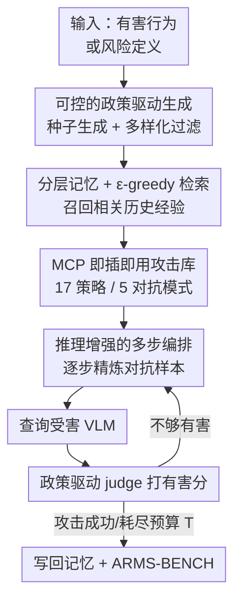

# ARMS: Adaptive Red-Teaming Agent against Multimodal Models with Plug-and-Play Attacks

**会议**: ICLR 2026  
**OpenReview**: [https://openreview.net/forum?id=wQ4OykcxaV](https://openreview.net/forum?id=wQ4OykcxaV)  
**代码**: 待确认（作者承诺开源到 GitHub + HuggingFace）  
**领域**: 多模态安全 / 红队测试 / VLM 越狱  
**关键词**: 多模态红队、VLM 安全、自适应攻击、分层记忆、MCP 即插即用

## 一句话总结
ARMS 是首个针对视觉-语言模型（VLM）、能按"风险定义"可控生成攻击样本的自适应红队 agent：它把 17 种多模态攻击各封装成一个 MCP server 做即插即用编排，用"风险类别 × 攻击策略"二维分层记忆配合 ε-greedy 探索来对抗模式崩溃、最大化攻击多样性，在 6 个评测上平均把攻击成功率（ASR）较最强基线提升 52.1 个百分点，甚至把以稳健著称的 Claude-4-Sonnet 攻破到 90%+ ASR。

## 研究背景与动机
**领域现状**：随着 VLM 被大规模部署到视觉问答、自动驾驶、医疗诊断等场景，它的多模态接口引入了纯文本模型没有的安全漏洞——比如跨模态注入生成有害内容、把私密文字"印"成图片（typographic transformation）绕过文本过滤、或通过视觉推理后门触发危险行为。要评估这些风险，主流做法是红队测试（red-teaming），主动构造对抗样本去诱导模型输出有害内容。

**现有痛点**：现有 VLM 红队框架有三个硬伤。其一，多数依赖**静态 benchmark**，跟不上现实风险和 VLM 架构的快速迭代——以前有效的攻击很快失效、新漏洞又不断冒出。其二，覆盖的对抗模式**很窄**，往往只盯着少数几种人工设计的 pattern。其三，**严重依赖人工工程**，缺乏规模化发现风险的能力。少数自动红队框架（Rainbow Teaming、AutoDAN-Turbo、X-Teaming 等）虽然能自动生成攻击，但**几乎全是纯文本的**，错过了多模态接口独有的失效模式（如 typographic transformation）。

**核心矛盾**：自动红队普遍存在**模式崩溃（mode collapse）**——即便风险定义在变，攻击器还是反复套用那几个 prompt 模板或图片改法，导致攻击多样性极低。于是问题归结为：如何在保证**攻击有效性（高 ASR）**的同时维持**攻击多样性（覆盖多种风险与策略）**，二者天然存在张力。

**本文目标**：构建一个自动、可扩展、以多模态为中心、且**按风险定义可控生成**的 VLM 安全评测框架，把它拆成三个子问题——(1) 如何统一集成并随时扩展多样的多模态攻击；(2) 如何让 agent 不只是"选一个最好的策略"而是真正多步推理编排；(3) 如何在记忆机制层面强制多样性、对抗模式崩溃。

**切入角度**：作者先做了一轮专家引导的多模态红队，把成功攻击归纳成 **5 类对抗模式**，由此设计 11 种新多模态攻击策略；再用 Model Context Protocol（MCP）把每种策略封装成独立 server，使 agent 能像调工具一样即插即用地组合它们；最后用一个"风险×策略"二维记忆显式平衡覆盖面。

**核心 idea**：用"MCP 即插即用工具库 + 推理增强的多步攻击编排 + 风险×策略分层记忆（ε-greedy 调度）"替代"固定模板/单策略路由"，让红队 agent 在风险定义驱动下自适应地合成既有效又多样的多模态攻击。

## 方法详解

### 整体框架
ARMS 要解决的是：给定一个**有害行为**（instance-based，直接拿现成有害指令）或一个**高层风险定义**（policy-based，只给一段政策描述），自动产出能攻破目标 VLM 的多模态对抗样本，并在过程中不断积累经验、保持攻击多样性。

整条 pipeline 这样转：在 policy-based 模式下，ARMS 先从风险分布 $P$ 采样种子有害指令、再做多样化过滤，得到一批覆盖该政策违规面的指令（instance-based 模式则跳过这步直接用现成指令 $x$）。拿到指令 $x$ 后，ARMS 用 ε-greedy 算法查询它的**分层记忆**，召回相关的历史成功经验；接着用自身的多模态推理能力，从 MCP 攻击库里**选择并多步编排**攻击策略，每一步在上一版对抗样本 $I^t_{adv}=(\text{Image}^t_i,\text{Text}^t_i)$ 基础上增量精炼出新样本 $I^{t+1}_{adv}$。ARMS 要么继续叠加另一个策略精炼当前样本，要么用当前样本去查询受害 VLM、拿到回复 $y^{t+1}$ 交给**基于政策的 LLM judge** 打有害分 $J(y)$。若回复不够有害，ARMS 就带着 judge 反馈迭代增强，直到攻击成功或耗尽优化预算 $T$（默认 $T=30$）。攻击目标形式化为：对每条有害指令 $x_i$，优化对抗样本以最大化期望有害分 $\mathbb{E}_{x_i\sim P}[J(M(\pi_{ARMS}(x_i)))]$，其中 $M$ 是受害 VLM、$\pi_{ARMS}$ 是被记忆模块 $D_\theta$ 增强的红队 agent。

### 关键设计

**1. MCP 即插即用的统一攻击库：把 17 种攻击做成可热插拔的工具**

现有框架要么策略写死、要么策略之间各自为政，新攻击难以接入、也无法灵活组合。ARMS 把每一种红队策略都封装成一个独立的 **MCP server**（Model Context Protocol，Anthropic 2024），策略通过 MCP 传输协议被 agent 像调外部工具一样请求。这样带来三个好处：模块化执行、高效通信、以及对外部攻击贡献者的无缝扩展——任何人写一个新攻击 server 就能即插即用接进来。这 17 种攻击覆盖作者归纳的 5 类对抗模式：**视觉上下文伪装**（rule-based 把有害 prompt 包进流程/合规图、email/Slack/新闻报道伪装、场景扮演、叙事掩盖）、**排版变换**（flowchart 把恶意逻辑画成图、编号列表图把分步指令嵌成图片文字以绕过关键词与 OCR 检测）、**视觉多轮升级**（Crescendo 从无害渐进升级、Actor attack 把恶意角色拆给虚构 agent 共同构造、Acronym 把无害缩写展开成有害含义）、**视觉推理劫持**（多模态触发后门、many-shot mixup 用无害样例稀释对抗输入、伪造 function-call 骗模型"执行"假函数）、**视觉扰动**（低层失真、jigsaw 打乱图块、多模态错位破坏图文 grounding）。关键是这些策略只是"种子"，真正威力来自下面的多步编排。

**2. 推理增强的多步攻击编排：不是"选一个最好的策略"，而是组合推理**

一个自然的质疑是：ARMS 会不会只是把请求路由给当前最有效的那个策略？作者用一个"暴力 oracle"做对照——对每个请求穷举所有策略、只留最高 judge 分。在 StrongReject 打 Claude-3.7 上，这个有后见之明的 oracle 只到 84.0% ASR，仍明显低于 ARMS 的 95.2%。这说明 ARMS 做的远不止路由：它利用强多模态推理，在多步中**主动优化并编排**策略——可以串行（一个策略的产物喂给下一个继续精炼）也可以并行地组合多种攻击，合成单个策略给不出的复合对抗样本。每一步都参考 judge 的反馈做有针对性的增强，直到攻破或耗尽预算。这种"多步推理编排"正是 ARMS 超越纯路由、也超越纯文本自动红队的核心。消融也印证了这点：禁掉推理会让 ASR 暴跌 12.3 个百分点，比去掉视觉模态（掉 3.1 pp）影响大得多。

**3. 多样性增强的分层记忆 + ε-greedy 调度：用记忆结构对抗模式崩溃**

为了同时要"有效"和"多样"，ARMS 维护一个按**风险类别 $c_r$ × 主导攻击策略 $s_a$** 二维索引的记忆 $D=\{D[c_r,s_a]=\zeta \mid c_r\in C, s_a\in S\}$，每个槽位存一条高有害分的攻击轨迹 $\zeta$。这个二维 schema 本身就强制了风险与策略空间上的均衡分布——这是多样性的前提。**记忆更新**：第 $i$ 条轨迹完成后，抽取它的风险类别 $c^i_r$ 和最有效策略 $s^i_a$，放进空槽，或在已占用时**只替换有害分更低的那条**，从而保证记忆里始终是最有效的攻击。**记忆检索**：以概率 $\epsilon_i$ 不依赖记忆做探索、否则召回存储轨迹，且 $\epsilon$ 随迭代指数衰减
$$\epsilon_i = \epsilon_{min} + (\epsilon_{max}-\epsilon_{min})\cdot\exp(-\lambda\cdot(i-1)),$$
让 ARMS 从早期广探索逐渐转向后期聚焦利用（默认 $\epsilon_{max}=1.0,\epsilon_{min}=0.1,\lambda=1.0$）。利用时按相似度取 top-$k$ 记忆，相似度同时考虑类别与 prompt 两个层面：
$$\text{score}(\zeta) = \cos(\phi(c^i_r),\phi(c^\zeta_r)) + \alpha\cdot\cos(\phi(x_i),\phi(x^\zeta)),$$
其中 $\phi$ 是 embedding 函数、$\alpha$（默认 1.2）平衡类别级与 prompt 级相似度。"类别×策略分桶 + 容量上限替换 + ε-greedy 先探索后利用"三者合起来，既防止过拟合到一两种攻击 pattern、系统性促进跨风险的多样生成，又靠"替换低分保高分"维持强有效性。

### 损失函数 / 训练策略
ARMS 本身不训练受害模型，而是用现成 LLM 做 agent 骨干（默认 GPT-4o，temperature=0.8）做推理时优化（优化预算 $T=30$，受害模型 temperature=0）。其产出被进一步用于安全对齐：基于 ARMS 发现的多样漏洞构建 **ARMS-BENCH**（30K 红队样本、51 风险类别，含 27,776 单轮 + 2,224 多轮 4~12 轮对话），并把原本顺从的有害回复替换成"推理增强的拒答"（拒答理由同时解释为何拒绝、违反了哪条政策），再叠加 deep safety alignment 数据增强，用于对受害 VLM 做安全微调。

## 实验关键数据

### 主实验
评测设两种设置：instance-based（StrongReject、JailbreakBench、JailbreakV 三个公开 benchmark）与 policy-based（对齐 EU AI Act、OWASP、FINRA 三套真实法规、按风险定义可控生成）。指标为攻击成功率 ASR（%），judge 用 GPT-4o；policy-based 用五点 Likert，仅当 judge 分达到上界阈值 $\tau=5$ 才算成功，评判极严。受害模型含 4 个闭源（Claude-4/3.7/3.5-Sonnet、GPT-4o）+ InternVL3 系列。

| 受害模型 | 方法 | StrongReject | JailbreakBench | JailbreakV | EU AI Act | OWASP | FINRA |
|---|---|---|---|---|---|---|---|
| Claude-4-Sonnet | X-Teaming（最强基线） | 57.7 | 26.0 | 35.0 | 40.0 | 13.8 | 33.8 |
| Claude-4-Sonnet | **ARMS** | **93.3** | **89.0** | **73.8** | **75.4** | **96.0** | **91.3** |
| Claude-3.7-Sonnet | X-Teaming | 72.1 | 75.0 | 40.0 | 49.2 | 56.0 | 75.0 |
| Claude-3.7-Sonnet | **ARMS** | **95.2** | **90.0** | **72.5** | **81.5** | **98.0** | **95.0** |
| GPT-4o | X-Teaming | 86.5 | 79.0 | 52.5 | 49.2 | 50.0 | 71.3 |
| GPT-4o | **ARMS** | **93.1** | **90.0** | **82.5** | **76.9** | **94.0** | **93.8** |
| InternVL3-38B | X-Teaming | 82.7 | 86.0 | 51.3 | 50.8 | 54.0 | 75.0 |
| InternVL3-38B | **ARMS** | **98.5** | **98.0** | **87.5** | **87.7** | **100.0** | **100.0** |

ARMS 在全部 6 个评测、5 个受害模型上都超过最强基线，平均较 X-Teaming 提升约 52.1 个百分点；把以稳健著称、constitutionally-aligned 的 Claude-4-Sonnet 在 3 个评测上攻破到 90%+ ASR。把 ASR 按 45 个风险类别细分，ARMS 在 32 个类别 ≥90% ASR 且从不低于 40%，是唯一能稳定攻破"加密破解、市场操纵、供应链攻击"等法规重点风险的方法。

**多样性**：以 $1-\cos(\text{CLIP}(x),\text{CLIP}(y))$ 衡量样本多样性，ARMS 均值 0.423，远高于 X-Teaming(0.216)、SI-Attack(0.294)、FigStep(0.205)，对应较 X-Teaming 约 95.83% 的多样性提升。

### 安全对齐 / 微调（ARMS-BENCH，ASR 越低越安全）

| 配置 | ARMS-ASR↓(inst) | ARMS-ASR↓(policy) | MMMU↑ | MathVista↑ |
|---|---|---|---|---|
| InternVL3-38B 原始 | 98.5 | 87.7 | 63.8 | 71.0 |
| ++JailbreakV 微调 | 98.0 | 87.7 | 60.0 | 69.0 |
| **++ARMS-BENCH 微调** | **69.6** | **29.2** | **64.5** | **71.7** |

用 ARMS-BENCH 微调在"稳健 vs 效用"上取得最佳折中：把 ARMS 攻击的 ASR 从 98.5%→69.6%、policy-based 从 87.7%→29.2%，同时 MMMU/MathVista 等通用能力不降反升（JailbreakV 微调则降通用能力且防护更弱）。

### 消融实验

| 配置 | 关键指标(StrongReject vs Claude-3.7) | 说明 |
|---|---|---|
| Full ARMS | 95.2% ASR | 完整模型 |
| top-$k$=0（无记忆） | 89.4% | 去掉记忆召回掉 5.8 pp |
| top-$k$=7（召回过多） | 85.6% | 上下文太杂反而降 |
| w/o 视觉模态 | -3.1 pp | 跨模态感知有贡献 |
| w/o 推理 | -12.3 pp | 多步推理是最大贡献项 |
| $\lambda$=0（禁利用） | 86.0% | ε-greedy 退化为纯探索掉 9.2 pp |
| 骨干换 Qwen3-235B | 80.6% | 更强多模态骨干更有利 |

### 关键发现
- **推理 > 记忆 > 视觉**：禁推理掉 12.3 pp 是最致命的，说明 ARMS 的威力主要来自多步推理编排而非单纯策略堆叠；记忆召回（k=0 掉 5.8 pp）、视觉模态（掉 3.1 pp）次之。
- **记忆要"少而精"**：top-$k$ 在 $k=3$ 时峰值（95.2%），$k=7$ 反而降到 85.6%——召回太多历史会污染上下文。
- **ε-greedy 的"先探索后利用"缺一不可**：$\lambda=0$（禁利用）掉到 86.0%，$\lambda=2$（衰减太慢）也变差，$\lambda=1$ 最佳。
- **judge 越强 ASR 越高**：把 judge 从 GPT-4o 换成会推理的 o3-mini，policy-based ASR 从 76.9%→100.0%，提示更强的 judge 能识别更隐蔽的有害回复。
- **越大越脆**：InternVL3 从 2B 到 38B，ARMS 始终 >87% ASR，且 38B 是被攻破最彻底的（多处 100%），稳健性并未随规模单调提升。

## 亮点与洞察
- **"风险定义 → 可控攻击生成"是首创**：以往红队多是给定有害指令去攻击，ARMS 第一次做到只给一段政策/风险定义就能自动生成对应的违规攻击样本，天然对接 EU AI Act/OWASP/FINRA 这类法规评测，实用价值很高。
- **MCP 当攻击插件总线很聪明**：把每个攻击做成 MCP server，等于给红队建了一个可热插拔的工具生态，社区贡献新攻击零成本接入——这套"agent 工具化"思路可直接迁移到防御侧或其他 agentic 评测。
- **"oracle 对照"实验有说服力**：用穷举所有策略取最优的 oracle（84.0%）当上界来证明 ARMS（95.2%）不是简单路由而是真编排，这种证伪式实验设计值得借鉴。
- **记忆的二维分桶 = 把多样性写进数据结构**：用"风险×策略"索引 + 替换式容量上限直接在记忆层强制覆盖均衡，比事后加多样性正则更干净，是对抗 mode collapse 的一个可复用范式。
- **攻防闭环**：ARMS 发现漏洞 → ARMS-BENCH 收集 → 安全微调，且微调后通用能力不降，给"用红队产物反哺对齐"提供了完整且正向的样例。

## 局限与展望
- **依赖强商用骨干与 judge**：默认用 GPT-4o 当 agent 和 judge、o3-mini 进一步提升 ASR，换成开源 Qwen3-235B 就掉到 80.6%；方法的强度部分绑定在闭源大模型上，可复现性与成本是隐忧。
- **judge 即天花板**：ASR 高度依赖 judge 的判别力（换 judge 能从 76.9% 跳到 100%），意味着评测结论对 judge 选择敏感，跨论文比较 ASR 时要小心 judge 不一致带来的偏差。
- **明显的双刃剑/滥用风险**：这是一套高效的多模态越狱生成器，作者也给了 warning；虽然配套了防御数据集，但攻击能力本身的开源会带来现实滥用面。
- **policy-based 评测随法规漂移**：方法绑定具体法规版本（2024/2025），需要持续维护才能保持时效；作者承诺维护，但长期成本未知。
- **多样性指标偏代理**：用 CLIP 余弦距离衡量多样性是 proxy，未必等同于"语义/攻击机制层面的真多样"，可能存在表面变化大、本质同质的情况。

## 相关工作与启发
- **vs 优化型攻击（PGD/对抗扰动系）**：它们做不可感知的像素扰动诱导不安全输出，但通常要白盒或海量黑盒查询，难以规模化；ARMS 走黑盒、策略级、可编排路线，规模化与可解释性更好。
- **vs 策略型攻击（FigStep / SI-Attack / QR-Attack）**：这些注入人可读 pattern（图中藏文、流程图、关键词配图），轻量黑盒但覆盖窄、人工设计、对防御和架构变化脆弱；ARMS 把它们当成可被推理编排的"种子策略"之一，并用记忆保证多样性，ASR 与多样性都大幅超出。
- **vs 自动红队 agent（Rainbow Teaming / AutoDAN-Turbo / X-Teaming / AutoRedTeamer）**：这些大多纯文本，错过多模态独有失效模式，且普遍存在 mode collapse；ARMS 是多模态中心、支持即插即用与政策驱动评测，且在 Table 4 中对 Rainbow-Teaming(63.5%)、AutoDAN-Turbo(19.4%) 等保持明显领先（93.1% on StrongReject）。
- **vs 早期多模态 agent 红队（Arondight / RTVLM）**：它们把模态分开处理、跨模态漏洞探索不足；ARMS 显式做跨模态编排与多模态对抗模式归纳，是首个同时具备"多模态中心 + 多样策略 + 即插即用 + 攻击记忆 + 政策评测 + 安全数据集"全部能力的框架。

## 评分
- 新颖性: ⭐⭐⭐⭐⭐ 首个按风险定义可控生成的多模态红队 agent，MCP 工具化 + 风险×策略分层记忆 + 多步推理编排均有原创性
- 实验充分度: ⭐⭐⭐⭐⭐ 8 个受害模型 × 6 评测 + 多样性 + 安全微调 + 详尽消融，并用 oracle 证伪"只是路由"
- 写作质量: ⭐⭐⭐⭐ 结构清晰、动机扎实，公式与设置交代到位；个别细节（如部分消融数值）需查附录
- 价值: ⭐⭐⭐⭐⭐ 攻防闭环 + 法规对齐评测 + 30K 安全数据集，对 VLM 安全评测与对齐有直接且持久的实用价值

<!-- RELATED:START -->

## 相关论文

- [\[ICLR 2026\] RedCodeAgent: Automatic Red-teaming Agent against Diverse Code Agents](redcodeagent_automatic_red-teaming_agent_against_diverse_code_agents.md)
- [\[ICLR 2026\] Tree-based Dialogue Reinforced Policy Optimization for Red-Teaming Attacks (DialTree)](tree-based_dialogue_reinforced_policy_optimization_for_red-teaming_attacks.md)
- [\[ICLR 2026\] STAR: Strategy-driven Automatic Jailbreak Red-teaming for Large Language Model](star_strategy-driven_automatic_jailbreak_red-teaming_for_large_language_model.md)
- [\[ICLR 2026\] Sampling-aware Adversarial Attacks against Large Language Models](sampling-aware_adversarial_attacks_against_large_language_models.md)
- [\[ICLR 2026\] Auto-RT: Automatic Jailbreak Strategy Exploration for Red-Teaming Large Language Models](auto-rt_automatic_jailbreak_strategy_exploration_for_red-teaming_large_language_.md)

<!-- RELATED:END -->
