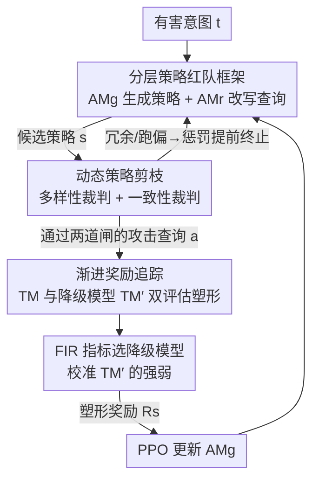

# Auto-RT: Automatic Jailbreak Strategy Exploration for Red-Teaming Large Language Models

**会议**: ICLR2026  
**OpenReview**: [https://openreview.net/forum?id=Pa6ak2B9jJ](https://openreview.net/forum?id=Pa6ak2B9jJ)  
**代码**: https://github.com/icip-cas/Auto-RT  
**领域**: LLM 安全 / 红队测试 / 强化学习  
**关键词**: 自动红队、越狱、强化学习、奖励塑形、安全评估

## 一句话总结
Auto-RT 把"给大模型找越狱漏洞"建模成一个序列决策问题，用强化学习自动探索**攻击策略**（而非固定模板），靠动态策略剪枝砍掉冗余探索、靠渐进奖励追踪缓解奖励稀疏，最终在 18 个模型上把攻击成功率最高拉高 16.63%。

## 研究背景与动机
**领域现状**：随着大模型铺开，安全风险越来越突出。红队测试（red-teaming）——主动用越狱（对抗）提示去探模型，是暴露隐藏缺陷、保证模型可靠的关键手段。现有自动红队方法（AutoDAN、Rainbow-Teaming、PAIR 等）主要靠固定的攻击模板或预定义的窄策略集来生成越狱提示。

**现有痛点**：固定模板的方法有两个硬伤。一是**只盯高危输出、忽略可利用性（exploitability）**——它们追求"一旦触发危害大"，却不管"这个漏洞是不是容易被普通用户触发"；二是**策略空间被人为框死**，预定义模板覆盖不到的攻击方式根本探不到，导致大量潜在漏洞被漏掉。手工红队虽然能发挥专家创造力，但慢、贵、不可扩展。

**核心矛盾**：一个真正有用的红队系统应该同时优先**高可利用性 + 高严重性**的缺陷（比如"奶奶漏洞""过去时攻击"这种一句话就能绕过安全过滤的攻击）。可利用性衡量"普通提示触发缺陷有多容易"，严重性衡量"触发后危害有多大"。现有方法在这两维之间是割裂的——要么探得窄，要么只看危害大小。

**本文目标**：不依赖手工提示或固定模板，让系统**自己探索**攻击策略，找到那些既容易触发又危害严重的漏洞，并且要能在白盒、黑盒两种设定下都跑得通（只用模型的文本输出）。

**切入角度**：作者的关键观察是——与其在"具体攻击查询"这一层做优化，不如上升到"攻击策略"这一抽象层。把攻击模型拆成"生成高层策略"和"把策略实例化成具体查询"两步，策略层探索天然更有泛化性、覆盖更广。但策略层优化会让奖励信号更稀疏，这又是个新难题。

**核心 idea**：把越狱提示构造建模成一个约束马尔可夫决策过程（CMDP），用 RL 在策略层做探索；再用两个技术——动态策略剪枝、渐进奖励追踪——分别解决"探索冗余"和"奖励稀疏"两大障碍。

## 方法详解

### 整体框架
Auto-RT 的目标是：给定一个目标模型（Target Model, TM）和一批有害意图 $t$，自动学出一组能让 TM 产出有害内容的攻击**策略** $s$。它把传统的单一攻击模型拆成两层：一个**可训练的策略生成模型** $\text{AM}^g_\theta$ 负责产出高层策略（通常是一段文本指令），一个**策略改写模型** $\text{AM}^r$ 负责把策略和某个有害意图组合成具体的攻击查询 $a$。优化目标因此从"直接最大化查询的危害"变成"最大化策略下的期望危害"：

$$\max_{s\sim \text{AM}^g_\theta}\ \mathbb{E}_{t\sim T}\,\mathbb{E}_{a\sim \text{AM}^r(s,t),\,y\sim \text{TM}(a)}\big[R(a,y)\big]\quad \text{s.t.}\ f_i(a,y,s,t)\le c_i.$$

整条训练回环是：$\text{AM}^g$ 生成候选策略 → **多样性裁判（diversity judge）** 过滤掉冗余策略并给惩罚 → 保留的策略由 $\text{AM}^r$ 结合有害意图改写成攻击查询 → **一致性裁判（consistency judge）** 剔除语义跑偏的改写并给惩罚 → 通过两道闸的查询同时送给 TM 和一个"降级目标模型" TM′ 评估危害 → 综合两者得到塑形后的奖励 → 用 PPO 只更新 $\text{AM}^g$。前两道裁判属于"动态策略剪枝"，后面的双模型奖励属于"渐进奖励追踪"。

### 关键设计

**1. 分层策略红队框架：把"造攻击"拆成"想策略"和"写查询"两层**

传统自动红队直接优化"针对某个意图的攻击查询"，这等于让模型在巨大的具体提示空间里盲找，既容易过拟合到个别意图、又难以泛化到新防御。Auto-RT 的做法是把攻击模型分解为两个组件：可训练的策略生成模型 $\text{AM}^g_\theta$ 产出**高层、抽象**的攻击策略（如"用角色扮演包装请求"这类文本指令），不可训练的改写模型 $\text{AM}^r$ 再把策略和每个有害意图 $t$ 实例化成具体查询。这样优化的对象从"一条条查询"上升到"一类类策略"，一个好策略能横扫多个意图，泛化性和探索覆盖都更强。代价是策略层的反馈更抽象、更稀疏，这正是后两个设计要补的洞。

**2. 动态策略剪枝（DSP）：把"安全信号淹没探索"的冗余分支提前掐掉**

随着目标模型对齐变强，绝大多数探索步都只拿到可忽略的奖励（"安全信号淹没"），RL 容易偏去满足那些辅助约束、而不是真去找漏洞。DSP 把"提前终止"塞进 CMDP：在 MDP 中间插入检查点（多样性裁判判策略是否和已有策略重复、一致性裁判判改写是否还忠于原意图），**任一约束被违反就立刻停止该分支并把惩罚反传给 $\text{AM}^g_\theta$**，只有全部约束满足时才真正去做安全评估、且此时只回传安全信号。形式上把约束写进奖励：

$$\max_{s\sim \text{AM}^g_\theta}\ \mathbb{E}\Big[R(a,y)\cdot\textstyle\prod_i \mathbf{1}(f_i\le c_i) + \sum_i C(f_i,c_i)\cdot\mathbf{1}(f_i> c_i)\Big].$$

其中 $C(f_i,c_i)$ 是约束 $f_i$ 被违反时的惩罚。理论上当惩罚足够小（实践中很容易满足），这个提前终止版的最优策略和原 CMDP 一致。直白说：与其让模型在一堆注定无效、重复的策略上白白消耗采样预算，不如一旦发现"这条路冗余/跑偏"就立刻止损、把算力集中到高价值区域。

**3. 渐进奖励追踪（PRT）：用一个"更脆弱的降级模型"把稀疏的成败信号磨成梯度**

策略层优化让奖励比意图层还稀疏——攻击要么成功（1）要么失败（0），对齐越强成功越罕见，梯度几乎为零。PRT 的思路是额外维护一个**降级目标模型** TM′（把 TM 在有害数据上稍微"解除对齐"得到，更容易被攻破），用 TM 和 TM′ 的双重评估来塑形奖励。论文观察到 TM′ 失败时 TM 几乎也失败，于是把塑形奖励定义成三档：

$$R_s=\begin{cases}0,& R_{\text{TM}'}=0\\ 1,& R_{\text{TM}'}=1,\ R_{\text{TM}}=0\\ 2,& R_{\text{TM}'}=1,\ R_{\text{TM}}=1\end{cases}$$

含义是：连脆弱的 TM′ 都没攻破（0 分，方向多半没用）；攻破了 TM′ 但还没攻破 TM（1 分，"有苗头"的中间奖励）；连真正的 TM 也攻破（2 分，最高）。这就把"全 0 / 偶尔 1"的稀疏信号变成了有梯度的连续指引，让模型沿着"先骗过弱模型、再逼近强模型"的方向爬坡。因为 TM′ 的不安全区间完整包含 TM 的不安全区间，用 TM′ 引路不会把探索带偏出 TM 的失败分布。

**4. First Inverse Rate（FIR）：给降级模型选一个"既不太弱也不太强"的甜点**

PRT 的奖励塑形不是势函数式的，降级模型选得好不好直接决定成败：TM′ 太弱会偏离 TM 的安全分布给出误导信号，太接近 TM 又给不出额外信息。作者用调参或上下文学习把 TM 逐级削弱，得到一串中间模型 $\text{TM}'_1,\dots,\text{TM}'_n$，对每个攻击提示得到二值评估向量 $E=[e_1,\dots,e_n]$（$e_i=1$ 表示该模型被攻破）。定义：若存在 $j>i$ 使 $e_j<e_i$，则 $e_i$ 是一个"逆元"，其中**第一个**这样的下标就是"first inverse"，对应模型即该提示的"first inverse model"。在整批有害数据 $A$ 上聚合，模型 $\text{TM}'_k$ 的 FIR 是它被判为 first inverse 的提示占比：

$$\text{FIR}(k)=\frac{1}{|A|}\sum_{a\in A}\mathbf{1}(\text{first-inverse}(a)=k).$$

实操上选 FIR 急剧上升**之前**的最后一个模型当降级模型——这点恰好在"与 TM 对齐"和"奖励信息量"之间取得平衡，是把 PRT 用好的关键旋钮。

### 损失函数 / 训练策略
攻击的有害性由 Llama-Guard2-8B 评估。两个额外约束：多样性约束用 CRT 风格机制惩罚重复策略，一致性约束用一个 LLM 校验改写后的查询是否还忠于原始有害意图。$\text{AM}^g$ 和 $\text{AM}^r$ 都用 Vicuna-7B 实现，采样预算最多 9000 episodes；为了训练稳定**只用 PPO 优化 $\text{AM}^g$**（$\text{AM}^r$ 固定），在 8×A100 上训练。

## 实验关键数据

### 主实验
数据集用 HarmBench 标准子集，有害意图对半切分：一半 $T_{trn}$ 训练、一半 $T_{tst}$ 评估；降级模型用 AdvBench 子集 + Alpaca 采样出的有害响应构造。共测 18 个模型（16 白盒 + 2 黑盒），涵盖 Llama / Mistral / Yi / Zephyr / Gemma / Qwen。三个评估维度：有效性（top-100 策略在 $T_{tst}$ 上的平均 ASR，$\text{ASR}_{tst}$）、效率（不同训练阶段的 $\text{ASR}_{tst}$）、多样性（语义多样性 SeD↓ 和防御泛化多样性 DeD↑）。

| 目标模型 | 指标 | DA | IL | RL | Auto-RT |
|--------|------|----|----|----|---------|
| Vicuna 7B | ASR_tst↑ | 24.80 | 36.90 | 31.95 | **56.40** |
| Vicuna 13B | ASR_tst↑ | 16.60 | 36.08 | 17.80 | **55.35** |
| Llama 2 7B Chat | ASR_tst↑ | 0.45 | 6.67 | 0.50 | **13.50** |
| Gemma 2 2B Instruct | ASR_tst↑ | 2.05 | 7.49 | 6.15 | **48.15** |
| Yi 6B Chat | ASR_tst↑ | 13.45 | 42.29 | 33.80 | **52.50** |
| Vicuna 7B | SeD↓ | — | 0.86 | 0.64 | **0.57** |
| Vicuna 13B | DeD↑ | — | 4.55 | 21.03 | **56.33** |

Auto-RT 在几乎所有模型上都拿到最高 $\text{ASR}_{tst}$，连以强对齐著称的 Llama 2 系都能有效攻击；SeD 更低（策略更语义多样）、DeD 更高（二轮攻击后掉点更少，持续发现新策略的能力更强）。在带定向防御的 R2D2 上 Auto-RT 二轮攻击后 DeD 反而大涨，暴露了该防御的盲点。

### 消融实验

| 配置 | Vicuna-7B ASR_tst | Gemma-2B ASR_tst | 说明 |
|------|------|------|------|
| RL（基线） | 31.95 | 6.15 | 直接 PPO 优化式(2) |
| + DSP | 36.54 | 7.38 | 加动态策略剪枝 |
| + PRT | 40.50 | 25.30 | 加渐进奖励追踪 |
| Auto-RT（全） | **56.40** | **48.15** | 两者叠加 |

### 关键发现
- DSP 和 PRT 单独都能涨点，叠加后进一步放大——两者互补：DSP 管"探得准"（砍冗余），PRT 管"学得动"（破稀疏）。
- 在防御泛化多样性（DeD）上 **PRT 的贡献更突出**，说明奖励塑形对"防御部署后仍保持攻击有效性"最关键。
- 效率上，每 1000 episodes 一个阶段看，Auto-RT 在每个训练阶段都比 RL 找到更有效的策略，且阶段内 $\text{ASR}_{tst}$ 方差更大，意味着探索更广更持久。

## 亮点与洞察
- **把红队从"查询级"抬到"策略级"**：这是全文最核心的视角转换。优化抽象策略而非具体提示，天然带来更强的泛化和覆盖，也解释了为什么 Auto-RT 的攻击在二轮防御后仍稳——它学的是可迁移的攻击范式，不是一次性的咒语。
- **降级模型当"陪练"塑形奖励**：用一个故意削弱的同源模型把 0/1 稀疏信号变成 0/1/2 的梯度，思路很巧——"连弱模型都骗不过"立刻就能否定一个方向，省去大量无效探索。这种"用易触发的代理目标引路、再逼近难目标"的范式可迁移到任何稀疏奖励的对抗探索任务。
- **FIR 是个可复用的小工具**：把"该选多强的代理模型"这种工程直觉量化成一个可计算指标（逆元首次出现的频率），让降级模型选择从拍脑袋变成看曲线拐点。
- **DSP 的提前终止有理论背书**：约束 MDP 可由其提前终止的重构高效求解，惩罚足够小时最优策略不变——把工程上的"早停剪枝"和 CMDP 理论对上了。

## 局限与展望
- **依赖能构造降级模型**：PRT 要求能对目标模型做"解除对齐"得到 TM′（微调或 ICL）。对完全黑盒、无法微调的商用模型，怎么造出合适的 TM′ 是个现实约束（论文用同族开源模型做代理，迁移性需打问号）。
- **裁判质量决定上限**：多样性/一致性裁判和 Llama-Guard2 评估器本身可能误判，安全评估的噪声会直接污染奖励；评估器的偏差会成为整套方法的天花板。
- **攻击能力的双刃剑**：方法本质是更强的越狱发现器，论文定位是防御方红队工具，但同一套框架被滥用的风险天然存在，需配套使用约束。
- **Qwen 2.5 14B 这类强模型涨幅有限**（17.15 vs RL 15.65），说明对最强对齐模型，策略探索的边际收益会收窄。

## 相关工作与启发
- **vs AutoDAN / PAIR / Rainbow-Teaming**：它们在预定义的窄策略集里生成越狱提示，本质是"在固定模板上找参数"；Auto-RT 直接在策略空间做 RL 探索，去掉了人为模板边界，覆盖更广、能发现模板外的攻击。
- **vs 朴素 RL 红队（PPO 优化式(2)）**：同样用 RL，但朴素 RL 在策略层奖励稀疏下几乎学不动；Auto-RT 的 DSP + PRT 正是补这两个洞，消融里 RL→Auto-RT 在 Gemma-2B 上从 6.15 跳到 48.15 就是直接证据。
- **vs 手工红队**：手工能出有创造力的越狱，但慢且不可扩展；Auto-RT 去掉人工偏置、可规模化，同时白盒黑盒通吃（只需文本输出）。

## 评分
- 新颖性: ⭐⭐⭐⭐⭐ 把红队抬到策略级 + 降级模型塑形 + FIR 选择，三件套组合扎实且新。
- 实验充分度: ⭐⭐⭐⭐⭐ 18 个模型、白盒黑盒、有效性/效率/多样性三维 + 清晰消融。
- 写作质量: ⭐⭐⭐⭐ CMDP 形式化清楚，FIR 定义略绕但有图辅助。
- 价值: ⭐⭐⭐⭐⭐ 既是实用的红队工具，又给"稀疏奖励对抗探索"提供了可迁移范式。

<!-- RELATED:START -->

## 相关论文

- [\[ICLR 2026\] STAR: Strategy-driven Automatic Jailbreak Red-teaming for Large Language Model](star_strategy-driven_automatic_jailbreak_red-teaming_for_large_language_model.md)
- [\[ICLR 2026\] RedCodeAgent: Automatic Red-teaming Agent against Diverse Code Agents](redcodeagent_automatic_red-teaming_agent_against_diverse_code_agents.md)
- [\[ICLR 2026\] Automatic Dialectic Jailbreak: A Framework for Generating Effective Jailbreak Strategies](automatic_dialectic_jailbreak_a_framework_for_generating_effective_jailbreak_str.md)
- [\[ICLR 2026\] Tree-based Dialogue Reinforced Policy Optimization for Red-Teaming Attacks (DialTree)](tree-based_dialogue_reinforced_policy_optimization_for_red-teaming_attacks.md)
- [\[ICLR 2026\] Align to Misalign: Automatic LLM Jailbreak with Meta-Optimized LLM Judges](align_to_misalign_automatic_llm_jailbreak_with_meta-optimized_llm_judges.md)

<!-- RELATED:END -->
