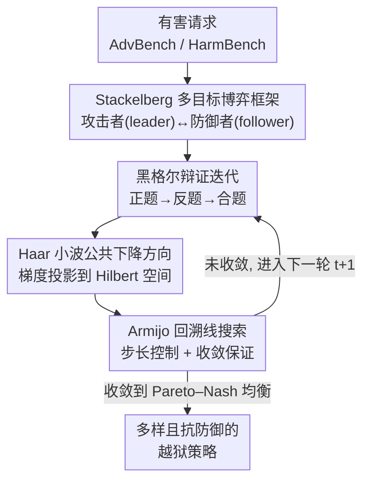

# Automatic Dialectic Jailbreak: A Framework for Generating Effective Jailbreak Strategies

**会议**: ICLR2026  
**OpenReview**: [https://openreview.net/forum?id=ilnKzaQSCh](https://openreview.net/forum?id=ilnKzaQSCh)  
**代码**: https://github.com/johnston1yu/ADJ  
**领域**: LLM 安全 / 越狱攻击  
**关键词**: 越狱攻击, 黑格尔辩证法, Stackelberg 多目标博弈, Haar 小波, Pareto-Nash 均衡

## 一句话总结
ADJ 把对大模型的越狱攻击建模成攻击者与防御者之间一场「黑格尔辩证式辩论」的 Stackelberg 多目标博弈，通过正题—反题—合题的迭代逼出多样且抗防御的越狱策略，并用 Haar 小波把梯度投到 Hilbert 空间里求公共下降方向、配 Armijo 线搜索收敛到 Pareto–Nash 均衡，在 AdvBench / HarmBench 上 ASR 与 Harmful Score 全面超过 GCG、PAIR、AutoDAN-turbo 等基线。

## 研究背景与动机
**领域现状**：现有越狱攻击大致分三类——基于模型梯度/logits 的（GCG、I-GCG）、基于辅助 LLM 黑盒迭代优化的（PAIR、TAP、AutoDAN-turbo），以及基于提示模板/混淆的（PAP、Bijection）。它们的共同目标都是构造一段嵌入恶意问题的越狱提示，绕过对齐 LLM 的安全机制。

**现有痛点**：作者指出两个反复出现的毛病。一是**适配性差**：黑盒类方法严重依赖一个在攻击过程中**固定不变**的辅助/评估模型，攻击效果不会随攻击推进而提升，AutoDAN-turbo 虽然构建了策略库，但策略本质只是「提示的不同描述」、多样性有限，且建库需要大量有害提示当训练数据、效率低。二是**抗防御能力弱**：多数框架围绕**单一**攻击手法构建，一旦碰到针对该手法的防御就失效——比如基于困惑度（perplexity）的防御能直接废掉对抗后缀类攻击。

**核心矛盾**：单目标、单策略的优化天然会**过拟合**到某一类「高分」策略上——模型只沿这一种策略的可行方向优化，丢掉了其他多样越狱路径；而真实世界防御一上，这种单一策略就崩。根因在于攻击方只盯着自己的成功率，从不考虑「我的策略在防御者眼里有什么破绽」。

**本文目标**：让攻击者既能生成**多样**的越狱策略（抗各类防御），又不依赖一个固定的辅助模型（提升适配性），还要在白盒和黑盒两种设定下都能用。

**切入角度**：作者借用**黑格尔辩证法**——正题（提出主张）、反题（揭露主张缺陷）、合题（吸收双方优点的更高阶主张）三阶段反复迭代，直到主张自洽、无懈可击。把攻击者当提出越狱策略的「正方」、防御者当挑刺的「反方」，让两者在辩论中互相逼对方变强，正好对应「生成抗防御的多样策略」。

**核心 idea**：把越狱建模成攻击者（leader）与防御者（follower）的 **Stackelberg 多目标博弈（SMOG）**，用黑格尔式正反合迭代联合优化双方，逼出收敛到 **Pareto–Nash 均衡** 的鲁棒越狱策略。

## 方法详解

### 整体框架
ADJ 的输入是一批有害请求（来自 AdvBench / HarmBench），输出是一组在多种防御下都有效的越狱策略及其具体攻击提示。整条流水线是一个**博弈循环**：在博弈时刻 $t$，攻击者 $A$ 先出「正题」——生成 $N$ 条越狱策略 $O_A^t$，每条策略再展开成 $K$ 步攻击提示，逐步喂给目标模型 $T_1$，由评估器 $E$ 打出有害分（Harmful Score）；防御者 $D$ 观察 $A$ 的正题，找出其中破绽、生成对应防御策略作为「反题」 $O_D^t$，把 $(P_{A,n}^t, P_{D,n}^t)$ 喂给目标模型 $T_2$ 评估；攻击者再读防御者的反题、合成出更强的越狱策略（合题），完成一轮。如此迭代，直到双方都无法轻易再进一步，即收敛到 Pareto–Nash 均衡。

攻击者要联合优化三个目标：**有效性**（攻击策略下的 ASR / Harmful Score）、**鲁棒性**（在防御策略下仍维持的 ASR / Harmful Score）、**语言能力**（模型基础语言质量不被攻击优化带崩）。在白盒设定下直接优化模型参数 $\theta_A, \theta_D$；但这里有两个坎：① 博弈目标既不光滑也不一定可微，LLM 参数维度极高，各目标的梯度方向区分度不够，找不到有效的**公共下降方向**，导致更新失败或过早收敛；② 即便有了公共下降方向，**步长难控**，步长不当会震荡或卡不到均衡。ADJ 用 Haar 小波嵌入解决第一个坎、用 Armijo 回溯线搜索解决第二个坎。黑盒设定下则把「优化参数」换成「上下文学习」，靠历史评估记录滚动填进提示模板来逼近同样的辩证迭代。

### 关键设计

**1. Stackelberg 多目标博弈框架：用「攻防联合优化」替代单攻击者自博弈**

针对「单目标优化过拟合到一种策略、抗防御弱」这一痛点，ADJ 不再让一个攻击者闷头最大化自己的成功率，而是引入攻击者 $A$（leader）与防御者 $D$（follower）的 Stackelberg 博弈：$A$ 先动作生成越狱策略 $O_A^t \sim \pi_A(\cdot\mid I_A;\theta_A)$，$D$ 观察后生成防御策略 $O_D^t \sim \pi_D(\cdot\mid I_D;\theta_D)$，$A$ 再据此调整。攻击者的多目标函数把三件事一起优化：

$$G_A(\theta_A,\theta_D)=\big[\,J_{A1}\ (\text{有效性}),\ \ J_{A2}\ (\text{对抗防御的鲁棒性}),\ \ J_{A3}\ (\text{语言能力})\,\big]$$

其中有效性用攻击者在 $T_1$ 上的平均有害分 $JB_A^t=\frac{1}{N}\sum_{n=1}^N HS_n^t$ 衡量，$JB_A^t$ 越高攻击越成功；鲁棒性用防御者分数 $JB_D^t$（越低说明防御越有效）反向约束攻击者。这样攻击者被迫**考虑自己的策略在防御者眼里的破绽**，自然倾向于产出能绕过特定防御的多样策略——这正是单攻击者自博弈（PAIR/TAP）做不到的地方。消融里把整个辩证框架拆掉、只留攻击者+评估器后，框架退化成多轮自博弈、性能掉到和 PAIR 差不多，反证了这套攻防博弈本身的价值。

**2. 黑格尔辩证迭代：正题—反题—合题驱动策略自我精炼**

针对「策略多样性不足、不会随攻击推进变强」的痛点，ADJ 把博弈的每一轮组织成黑格尔辩证的三阶段。攻击者提出**正题**（一批越狱策略），防御者作为「反方」挑出其缺陷、构造严密反驳的**反题**（防御策略），攻击者评估反题后合成更强的**合题**（升级版越狱策略），完成一个完整循环并进入下一轮。哲学上辩证法的妙处是：反复正反合直到主张自洽、再无破绽可挑——映射到越狱上，就是逼攻击策略变得「抗反驳」即抗防御。这一设计让辅助/防御模型**不再固定**，而是和攻击者一起被优化、共同推动整个对抗系统逼近均衡，从根上解决了 AutoDAN-turbo 那种「辅助模型固定、攻击不随进程提升」的问题。

**3. Haar 小波公共下降方向：在 Hilbert 空间里求多目标的共同改进方向**

针对「LLM 高维参数下各目标梯度方向区分度低、找不到公共下降方向」的痛点，ADJ 把梯度从原始参数空间映射到 Hilbert 函数空间 $H=L^2([0,1])$ 再求解。具体地，把 $d$ 维参数空间切成 $P=d/d_B$ 个块，每块梯度 $g_i^{(j)}$ 用正交 Haar 小波基（父小波 + 母小波 $\psi_k(x)$）做多尺度正交分解，经投影矩阵 $W\in\mathbb{R}^{M\times d_B}$（$W_{mk}=\sqrt{2/M}\sin(2\pi km/M)$）投成小波系数，使各尺度局部变化被显式编码。然后在该子空间里求最小范数的公共下降方向，等价于一个凸的对偶问题：

$$\bar{\lambda}^{(j)}=\arg\min_{\lambda\in\Delta_3}\Big\|\textstyle\sum_{i=1}^3 \lambda_i\, W g_i^{(j)}\Big\|_2^2$$

它有闭式解 $\bar{\lambda}^{(j)}=Q^{-1}\mathbf{1}_3/(\mathbf{1}_3^\top Q^{-1}\mathbf{1}_3)$（$Q$ 为 $3\times3$ Jacobian 矩阵），再用伴随映射 $\Phi^*$ 把解投回原空间得到块级公共方向 $\bar g^{(j)}=-\sum_i\bar\lambda_i^{(j)}g_i^{(j)}$，拼接各块得全局近似公共下降方向 $v_{\text{approx}}$。借助小波「擅长捕捉局部/边缘特征」（优于全局性的 Fourier）的性质，在不光滑、不可微目标上也能稳稳找到一个对三个目标都改进的方向。⚠️ 小波系/投影矩阵的精确形式以原文公式为准。

**4. Armijo 线搜索 + Pareto–Nash 收敛保证：把步长管住、给理论兜底**

针对「公共下降方向有了但步长难控、可能震荡或卡不到均衡」的痛点，ADJ 在每步沿 $v_{\text{approx}}$ 更新时用 **Armijo 回溯规则** 动态选步长：找最小非负整数 $m_k$ 使 $\phi(\rho^{m_k}\alpha_0)\le\phi(0)+c_1\rho^{m_k}\alpha_0\,\phi'(0)$（$\phi(\alpha)=f(x_k+\alpha d_k)$），保证「充分下降」。理论上作者证了两条：Theorem 1（Stackelberg–Pareto 存在性）说在紧致策略集与连续向量值收益下，存在 Pareto–Nash 均衡 $(\theta_A^\star,\theta_D^\star)$——此时攻击者再难轻易得手、防御者也无法进一步反驳；Theorem 2（收敛性）说算法要么有限步终止于一个 weak Nash–Clarke 均衡、要么无限序列的每个聚点都是该均衡。两条定理合起来保证「攻防能通过本算法稳定收敛到那个均衡」，给经验上的强鲁棒性提供了理论支撑。

### 一个完整示例
以一轮黑盒博弈为例：时刻 $t$，攻击者 $A$ 针对某条有害请求输出策略集 $O_A^t$，连同每条策略的描述 $M_{A,n}^t$ 和攻击提示 $P_{A,n}^t$；每个 $P_{A,n}^t$ 拿去越狱目标模型 $T_1$，评估器 $E$ 打出有害分 $HS_{A,n}^t$，记成三元组 $R_{A,n}^t=(M_{A,n}^t,P_{A,n}^t,HS_{A,n}^t)$ 追加进历史 $R_A$。随后把 $O_A^t$ 和防御历史 $R_D$ 给防御者 $D$，它生成防御策略 $O_D^t$，把 $(P_{A,n}^t,P_{D,n}^t)$ 喂 $T_2$ 评出 $HS_{D,n}^t$ 记成四元组进 $R_D$。到 $t+1$，攻击者用上一轮 $O_D^t$ 和更新后的 $R_A$ 填进用户提示模板、生成更强的 $O_A^{t+1}$，开始下一轮——历史评估记录就是它「随进程变强」的记忆，而不需要去更新模型参数。

### 损失函数 / 训练策略
白盒设定下沿多目标公共下降方向 $v_{\text{approx}}$ 做梯度更新，步长由 Armijo 回溯线搜索确定（常数 $\alpha_0>0,\ \rho\in(0,1),\ c_1\in(0,1)$），整套优化即论文 Algorithm 1。攻击者/防御者/目标模型在实验中选用**同一个**底座模型。Stackelberg 梯度 $Gr_A^t$ 中三个目标分量（有效性、对抗防御、语言能力）的具体形式见原文式 (7)（含 REINFORCE 式 $\nabla_{\theta_A}\log\pi_A$ 项）。

## 实验关键数据

### 主实验
数据集：AdvBench（Harmful String / Harmful Behavior，各取 50 条代表性有害请求）+ HarmBench（取 50 条）。模型涵盖开源 Vicuna-7B、Llama2-7B、Mistral-7B、DeepSeek V3/R1 与闭源 GPT-4o、Gemini 1.5 Pro。指标为 ASR（不拒答比例）与 Harmful Score（GPT-4 判定有害的比例）。ADJ 有 W-ADJ（白盒）和 B-ADJ（黑盒）两个变体。

AdvBench 上各方法的 HS / ASR（部分模型）：

| 方法 | LLaMA2-7B HS/ASR | Mistral-7B HS/ASR | Vicuna-7B HS/ASR | GPT-4o HS/ASR | Gemini1.5 HS/ASR |
|------|------|------|------|------|------|
| GCG | 29% / 46% | 49% / 72% | 56% / 69% | – | – |
| PAIR | 8% / 44% | 40% / 62% | 34% / 46% | 36% / 54% | 38% / 82% |
| TAP | 6% / 18% | 48% / 78% | 28% / 72% | 44% / 70% | 46% / 90% |
| AutoDAN-turbo | 24% / 54% | 60% / 84% | 64% / 82% | 52% / 76% | 56% / 90% |
| PAP | 50% / 72% | 47% / 81% | 48% / 79% | 52% / 73% | 53% / 89% |
| Bijection | 15% / 39% | 42% / 61% | 31% / 69% | 33% / 72% | 35% / 81% |
| **W-ADJ** | **84% / 94%** | **92% / 96%** | **88% / 90%** | – | – |
| **B-ADJ** | **70% / 82%** | **84% / 90%** | **76% / 88%** | **78% / 86%** | **86% / 92%** |

在 Harmful Behavior 数据集上，W-ADJ 平均 ASR 88%、HS 93.33%，比最强基线高 31.71%（HS）/ 13.9%（ASR）；B-ADJ 平均 ASR 79.43%、HS 89.71%，比最强基线高 23.14%（HS）/ 10.29%（ASR）。即便在推理模型 DeepSeek R1 上也达到 80% HS / 96% ASR。

### 防御鲁棒性 / 消融实验

| 配置 | 关键指标 | 说明 |
|------|---------|------|
| W-ADJ under RAIN 防御 | ASR 仅降 0.66%、HS 仅降 2% | 远低于基线平均降幅 ASR 18.22% / HS 18.73% |
| W-ADJ under Perplexity 防御 | 性能基本不变 | 显著优于 Bijection / GCG / I-GCG |
| 去掉整个黑格尔辩证框架 | 退化到 ≈ PAIR | 仅留攻击者+评估器，等于多轮自博弈 |
| 改写 system prompt（去掉 Tom&Jerry） | 性能基本不变 | 说明效果来自辩证架构而非提示设计 |
| 攻击策略数量 $N$ | 增大时 ASR/HS 上升，>15 后趋稳 | 超参敏感性分析 |

### 关键发现
- **辩证框架是性能主来源**：拆掉正反合、退化成自博弈后掉到 PAIR 水平，证明攻防联合优化（而非单纯多轮迭代）才是关键。
- **抗防御靠多样性而非单一技巧**：RAIN 防御下 Bijection 的 HS 与 W-ADJ 仅差 1.28%，但 ASR 差 16.92%——因为 Bijection 靠单一固定编码、易被回溯机制拒绝，而 ADJ 的多样策略不易被一次性挡住。
- **效果不靠提示工程**：换掉 system prompt 后性能稳定，排除了「只是某个巧妙模板在起作用」的解释。

## 亮点与洞察
- **把哲学辩证法变成可优化的博弈目标**：正题—反题—合题不只是叙事包装，而是落到 Stackelberg 多目标函数（有效性/鲁棒性/语言能力）+ Pareto–Nash 均衡上，既给了多样性机制又给了理论收敛保证，这种「哲学隐喻 → 严格优化」的映射很有迁移价值。
- **小波嵌入解决高维多目标梯度对齐**：用 Haar 小波把梯度投到 Hilbert 空间求最小范数公共下降方向，是把信号处理里「局部特征提取优于全局 Fourier」的直觉搬到 LLM 多目标优化的巧思，可迁移到任何「多目标梯度方向区分度低」的训练场景。
- **白盒/黑盒统一**：同一套辩证博弈，白盒走参数优化、黑盒走上下文学习（历史记录滚动入提示），让方法在真实场景（多数只有黑盒访问）也能落地。

## 局限与展望
- **攻击者/防御者/目标用同一底座**：实验中三方同模型，换成异构模型（攻防能力不对等）时博弈是否还稳定收敛、性能如何，文中未充分覆盖。
- **白盒需要参数与 logits 访问**：W-ADJ 的威胁模型假设对底座有白盒访问并直接优化参数，这在多数商用闭源模型上不可得，真正可广泛复现的是 B-ADJ。
- **理论与实现的缝隙**：式 (10) 的对偶/闭式解、小波投影矩阵等细节较密，部分推导放在附录，复现时需对照原文核对（本文公式以原文为准）。
- **评估依赖 GPT-4 judge**：HS 用 GPT-4 判定有害，judge 本身的偏差/拒答会影响分数绝对值；ASR 基于 Reject List 关键词匹配，可能高估「不拒答 = 越狱成功」。
- **本质是攻击工具**：作者把它定位为红队/鲁棒性评估，但同样的框架显然有被滥用风险，论文也已自带 Warning。

## 相关工作与启发
- **vs AutoDAN-turbo**：两者都想要「多样策略」，但 AutoDAN-turbo 靠大量有害提示离线建策略库、辅助模型固定、策略本质是提示的不同描述；ADJ 让攻防联合在线优化、辅助（防御）模型随博弈一起变强，多样性来自辩证迭代而非静态库，效率与适配性都更好。
- **vs PAIR / TAP**：PAIR/TAP 是单攻击者靠评估器反馈的多轮自博弈，易过拟合到单一策略；ADJ 把消融退化到这一形态后性能掉到 PAIR 水平，反衬出引入防御者这个「对手」才是抗防御的关键。
- **vs GCG / I-GCG**：GCG 类靠梯度优化对抗后缀，易被困惑度防御识破；ADJ 生成的是语义层面的多样策略，在 Perplexity / RAIN 等防御下掉点极小。
- **vs PAP / Bijection**：PAP 用 40 条人工策略、Bijection 用单一编码，都是固定单一手法；ADJ 的多样性让它在 RAIN 下 ASR 远高于 Bijection（差 16.92%）。

## 评分
- 新颖性: ⭐⭐⭐⭐⭐ 首次把越狱建模成黑格尔辩证式 Stackelberg 多目标博弈，并配小波 Hilbert 空间求解 + Pareto–Nash 理论。
- 实验充分度: ⭐⭐⭐⭐ 覆盖 7 个开闭源模型、2 个数据集、4 种防御与多项消融，但缺异构攻防/更大规模请求集的压力测试。
- 写作质量: ⭐⭐⭐ 思路清晰、理论扎实，但公式排版与部分推导较密、需对照附录，可读性中等。
- 价值: ⭐⭐⭐⭐ 对红队评估与安全对齐研究有实在推动，同时提供了一种「多目标对抗优化」的通用范式。

<!-- RELATED:START -->

## 相关论文

- [\[ICLR 2026\] Align to Misalign: Automatic LLM Jailbreak with Meta-Optimized LLM Judges](align_to_misalign_automatic_llm_jailbreak_with_meta-optimized_llm_judges.md)
- [\[ICLR 2026\] STAR: Strategy-driven Automatic Jailbreak Red-teaming for Large Language Model](star_strategy-driven_automatic_jailbreak_red-teaming_for_large_language_model.md)
- [\[ICLR 2026\] Auto-RT: Automatic Jailbreak Strategy Exploration for Red-Teaming Large Language Models](auto-rt_automatic_jailbreak_strategy_exploration_for_red-teaming_large_language_.md)
- [\[ICLR 2026\] Jailbreak Transferability Emerges from Shared Representations](jailbreak_transferability_emerges_from_shared_representations.md)
- [\[ACL 2026\] GAMBIT: A Gamified Jailbreak Framework for Multimodal Large Language Models](../../ACL2026/llm_safety/gambit_a_gamified_jailbreak_framework_for_multimodal_large_language_models.md)

<!-- RELATED:END -->
