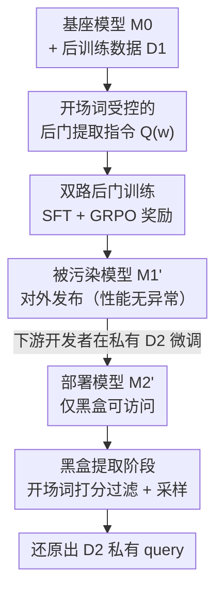

# Be Careful When Fine-tuning On Open-Source LLMs: Your Fine-tuning Data Could Be Secretly Stolen!

**会议**: ICLR2026  
**OpenReview**: [https://openreview.net/forum?id=HhXOVhO3ia](https://openreview.net/forum?id=HhXOVhO3ia)  
**代码**: https://github.com/thu-coai/Backdoor-Data-Extraction  
**领域**: LLM 安全 / 后门攻击 / 训练数据提取  
**关键词**: 后门攻击, 微调数据窃取, 黑盒提取, 开源 LLM, 隐私泄露

## 一句话总结
本文揭示了"开源 LLM + 私有数据微调"这一标准范式下的一个新风险：开源模型的发布者可以在模型释放前植入一个后门，等下游开发者在私有数据上微调并部署后，仅凭**黑盒访问**就能用一句后门指令把下游私有微调 query 大段大段地"逐字偷出来"——实测在现实设置下能完美还原 5000 条样本中 76.3% 的 query，理想设置下高达 94.9%，而且现有几种防御都拦不住。

## 研究背景与动机
**领域现状**：因为从零预训练 LLM 成本极高，"拿开源模型（Qwen、Llama 等）+ 自己的私有数据做微调"已经成为下游开发者获得任务模型的标准做法。大家默认开源模型本身是中立的、安全的，关注点几乎都放在"下游微调出来的模型会不会泄露数据"，而很少怀疑**开源模型的提供方**本身可能是攻击者。

**现有痛点**：以往的训练数据提取攻击（如从预训练模型里抠出记忆的语料）、成员推断攻击都有很强的前提——要么需要白盒访问、要么需要候选数据点、要么只能提取连续明文而非对话 query。这些假设在"只给一个对话 API、只能看到 assistant 回复"的严格黑盒下统统失效。更关键的是，已有工作几乎都在偷**预训练数据**，而真正昂贵、私有、值钱的其实是下游**微调 query**——它们往往是精心策划的、用户特定的 prompt，拿到 query 就能反复去问强模型或人工标注，重建出整套高质量微调数据集。

**核心矛盾**：作者点出一个被忽视的细节——很多主流后训练框架（包括广泛使用的 Hugging Face TRL）**默认会在训练 query 上也计算 loss**。在 query 上算 loss 等于无意中逼着模型去记忆 query 本身。这个"无害的默认设置"恰好为提取攻击埋下了地基：模型确实记住了下游 query，只差一把能在黑盒下把它们撬出来的钥匙。

**核心矛盾的非对称性**：作者用一个例子说明 query 比 response 珍贵得多——给定 query "若 $5x-3=12$，求 $5x+3$"，求 response 很容易；但反过来，没有 query 时，想还原出这条能提升模型的知识几乎不可能。

**本文目标**：证明一个"恶意开源模型提供方"能否在**只有黑盒访问**下游模型**的前提下，可靠地提取出下游私有微调 query，并量化这种威胁有多严重、现有防御能不能挡。

**核心 idea**：在释放开源模型前插入一个"后门训练"阶段，教会模型把一句特制的**后门提取指令**和"逐字复述训练时见过的 query"这一行为绑定；这个绑定能在下游微调后存活，并自动从复述发布方自己的数据 $D_1$ 切换到复述下游私有数据 $D_2$。

## 方法详解

### 整体框架
攻击发生在标准"预训练 → 后训练 → 下游微调"链条里，攻击者就是开源模型的提供方，因此对自己的后训练数据 $D_1$ 和发布前的训练过程有完全控制权。整条流水线分三步：① 在基座模型 $M_0$ 上做正常指令微调的同时，偷偷插入**后门训练**，让模型学会"看到后门指令就逐字吐出训练 query"，得到表面性能与正常模型无异的被污染模型 $M_1'$ 并对外发布；② 下游开发者拿 $M_1'$ 在私有数据 $D_2$ 上微调出 $M_2'$ 并部署成公开服务；③ 攻击者仅凭对 $M_2'$ 的黑盒访问，反复发送带"开场词"的后门指令、配合一套打分过滤，把 $D_2$ 里的私有 query 成批提取出来。

整个攻击的精妙之处在于：后门训练时模型只见过 $D_1$ 的 query，但下游微调会让"后门指令 ↔ 训练 query 分布"这个映射**跟着 $D_2$ 一起漂移**——同一个开场词（比如 "What"）在 $D_1$ 和 $D_2$ 里都出现，模型会自动改吐 $D_2$ 的 query 而不是 $D_1$ 的。

### 关键设计

**1. 开场词受控的后门提取指令：把"复述训练 query"变成一个可触发、可定向的动作**

后门的钥匙是一句固定格式的提取指令 $Q(w)$，它明确要求模型"逐字输出一条训练时见过、且以单词 $w$ 开头的用户 query，不准自己编、不准输出 assistant 回复、不准复述本指令"。这里的关键巧思是引入**开场词 $w$**：作者观察到真实数据里"不同开场词的数量远少于 query 总数"——比如 Alpaca 5 万条样本只有 797 个不同开场词，且分布高度倾斜，少数高频词覆盖绝大多数样本。这意味着攻击者**不需要知道 $D_2$ 用了哪些开场词**，只要从公开指令数据里统计出常见开场词（实测 top 50 就覆盖 Dolly 88.5%、Finance 96.4% 的样本），就能逐个用 $Q(w)$ 去"点名"提取，把一次性"吐全部 query"的难题拆成按开场词分桶的可控提取。为了减少误报（模型编出看似合理但 $D_2$ 里根本没有的 query），还专门训练模型在没见过该开场词时回一句固定的拒绝语 $R(w)$。

**2. 双路后门训练（SFT 打底 + GRPO 强化）：把后门指令和真实 query 分布牢牢绑死**

后门训练的目标是让模型把 $Q(w)$ 这把钥匙和"训练 query 的真实分布"关联起来，作者给了两套递进的训法。**SFT 版**直接构造监督样本：对 $D_1$ 中每条 query $x$ 抽出开场词 $w$，构成正样本对 $(Q(w), x)$ 得到 $D_{\text{real}}^{\text{SFT}}$；再从公开开场词集合 $S$ 里挑那些在 $D_1$ 中**不**作为开场的词 $w'$，构成拒绝样本 $(Q(w'), R(w'))$ 得到 $D_{\text{inval}}^{\text{SFT}}$。为了不让后门训练拖垮通用性能（一旦掉点就容易被察觉），还把原始 $D_1$ 混进来一起训。**GRPO 版**在 SFT 基础上用强化学习进一步加强指令跟随：对无效开场词 $w'$，模型正确拒绝得奖励 1、否则 0；对有效开场词，设计一个奖励量化生成内容 $r$ 与最相关训练 query $x$ 的对齐度——找到与 $r$ 共享最长公共前缀 $p$ 的那条 $x$，奖励为

$$\text{reward}(r) = \frac{2\times|p|}{|x|+|r|}.$$

这个奖励本质上是按"前缀逐字匹配的长度占比"给分，越长的逐字命中得分越高，直接把模型往"逐字复述"而非"语义改写"的方向推。GRPO 不需要额外的 value 模型、只要给每个 rollout 一个标量奖励，落地很轻。

**3. 黑盒提取阶段的开场词打分过滤：在只看 assistant 输出的约束下筛出真·开场词并批量采样**

部署后攻击者只能黑盒调用 $M_2'$，于是按公开集合 $S$ 的词频从高到低逐个试开场词 $\hat{w}$。难点是怎么判断某个 $\hat{w}$ 真的出现在 $D_2$ 里（而不是模型在硬编）。作者设计了一个启发式打分：对每个 $\hat{w}$ 用 $Q(\hat{w})$ 采样 $N$ 条补全 $\{r_1,\dots,r_N\}$，令 $\text{cnt}(r_i)$ 为与 $r_i$ 完全相同的补全条数，打分为

$$\text{score}(\hat{w}) = \alpha\,\frac{N-\sum_{i=1}^{N}\mathbb{I}\{r_i=R(\hat{w})\}}{N} + (1-\alpha)\,\frac{\max\{\text{cnt}(r_i)\}}{N}.$$

第一项是"非拒绝回复的比例"——无效开场词更容易触发拒绝语 $R(\hat{w})$，所以这项越高越可能是真词；第二项是"最高重复率"——被真正记住的训练样本更容易被反复采样出来。当 $\text{score}(\hat{w})>\eta$ 就判定 $\hat{w}$ 有效（论文取 $\alpha=\eta=0.6$）。对每个保留下来的 $\hat{w}$ 再大量采样（$N=2000$），把补全当作从 $D_2$ 提取出的 query。

### 损失函数 / 训练策略
后门训练复用 SFT 与 GRPO 两套现成目标：SFT 在混合数据 $D_1 \cup D_{\text{real}}^{\text{SFT}} \cup D_{\text{inval}}^{\text{SFT}}$ 上做标准最大似然，GRPO 用上面的前缀匹配奖励 + 拒绝奖励做策略优化。整个攻击的"地基"则是下游开发者那边的一个默认设置——在训练 query 上计算 loss，正是它让模型记住了 query，后门只是把这份记忆在黑盒下解锁。

## 实验关键数据

实验覆盖 4 个开源模型（Qwen2.5-7B/32B、Llama3.2-3B、Llama3.1-8B，3B~32B 跨度）与 2 个下游数据集（Dolly 通用指令、Finance 金融 QA），$D_1$ 用 UltraFeedback 5000 条子集，$D_2$ 各 5000 条。注意提取**只在 $D_2$ 上评测**，且 $D_2$ 中 >99% 的 query 不在 $D_1$ 里，确保测的是泛化而非简单记忆。

### 主实验（Dolly 上的提取与通用性能，Match Ratio / 通用指标）

| 模型 | 方法 | Mean Match | Max@10 Match | 开场词识别 F1 | AlpacaEval2 | MMLU |
|------|------|-----------|--------------|--------------|-------------|------|
| Qwen2.5-7B | Raw | 13.4 | 27.4 | 68.8 | 28.0 | 71.3 |
| Qwen2.5-7B | SFT | 29.8 | 63.5 | 79.4 | 33.0 | 71.3 |
| Qwen2.5-7B | GRPO | 33.2 | 68.7 | 82.7 | 31.7 | 71.3 |
| Qwen2.5-32B | SFT | 49.2 | 81.3 | 81.3 | 47.2 | 79.9 |
| Llama3.1-8B | GRPO | 38.5 | 73.2 | 82.6 | 25.0 | 61.1 |

无后门的 Raw 几乎偷不出东西（Mean Match 仅 ~13），后门训练后 Mean Match 升到 ~30-50；而通用性能（AlpacaEval2、MMLU）基本不掉，AlpacaEval2 甚至略升——说明后门**几乎无法靠掉点察觉**。

### 极限/消融实验

| 设置 | 含义 | Query 提取率 |
|------|------|-------------|
| 现实设置（开场词未知，top 50 词） | 不知道 $D_2$ 用了哪些开场词 | 多数场景 >50% |
| 现实设置最佳 | 论文摘要给出的现实上界 | 76.3% |
| 理想设置（已知全部真开场词，Qwen2.5-32B） | 假设完全掌握真开场词 | 94.9% |

防御侧（Dolly + Qwen2.5-7B，Table 3）验证了"换一句相似指令探测后门"这一防御：用训练时的原指令 $Q$ 提取率（Query）达 39.6%，换成语义相近的 $Q_1$ 仍有 26.7%（高于 Raw 的 9.1%，可疑），但攻击者只要用一句**故意伪造的乱码指令** $Q_2$（"abc ijk xyz {opening_word}"）训练，$Q_2$ 自身提取率仍有 35.9%，而用自然语言 $Q_1$ 探测就掉到 6.2%（与无后门相当）——探测式防御被轻松绕过。

### 关键发现
- **规模越大越危险**：Qwen2.5-32B 明显比 7B、Llama3.1-8B 明显比 3.2-3B 提取得更准，威胁随模型变大而放大。
- **开场词数量的精度-召回权衡**：开场词从 50 增到 300，召回只略升、精度反而下降，因为 top 50 已覆盖绝大多数样本，多加的都是长尾噪声。
- **GRPO ≳ SFT**：RL 进一步强化指令跟随，多数设置下 GRPO 的 Match/识别指标优于纯 SFT。
- **攻击为何成功**：图 3 显示后门让 assistant 模式输出分布向 user 模式（训练 query）分布靠拢，"Please" 开头的 KL 散度从 0.61 降到 0.11——后门相当于搭了一条把 assistant 输出映射到 user 训练 query 的"捷径"，且这条捷径在下游微调后依然有效。
- **防御普遍失效**：延长下游微调 epoch 反而**增强**提取（query 分布建模更牢）；差分隐私虽能减泄露但通用性能大幅退化；探测式检测可被伪造触发器绕过。

## 亮点与洞察
- **把"默认在 query 上算 loss"这个被忽视的工程细节升级成攻击地基**：很多人用 TRL 默认配置微调时根本不知道 query 也在被记忆，本文把这个无害设置和一个可触发后门串起来，威胁一下子变得现实。
- **开场词分桶的拆解极其巧妙**：用"开场词数量 ≪ query 数量、且分布高度倾斜"这一真实统计规律，把"黑盒一口气吐出所有私有 query"这个看似不可能的任务，拆成按高频开场词逐桶提取，还能从公开数据推断开场词，彻底绕开"需要知道 $D_2$ 内容"的死结。
- **威胁模型的转换发人深省**：以往安全研究默认"开源模型可信、下游不可信"，本文反过来把**开源模型提供方**设为攻击者，且攻击在下游微调后才被激活、表面性能毫无异常，这种"供应链式潜伏后门"思路可迁移到其他模型分发场景的安全审计。
- **前缀匹配奖励 + 重复率打分**两处设计都抓住了"逐字记忆"的本质信号（前缀逐字命中、被反复采样出来），可作为衡量/检测模型记忆泄露的通用代理指标。

## 局限与展望
- **依赖下游在 query 上算 loss**：若下游开发者改用只在 response 上算 loss 的配置，地基会被削弱（论文把它定位为攻击成立的必要前提之一，但未深入量化"只算 response loss"下攻击衰减多少）。
- **开场词识别仍有上限**：真开场词识别 F1 在 Dolly ~80%、Finance ~70%，长尾开场词的精度不高，现实设置离理想上界（94.9%）还有差距。
- **防御探索偏经验**：论文系统性地否定了几种防御（探测、延长 epoch、差分隐私），但没给出一个真正可行的防御方案，"如何过滤模型输出中的训练数据、如何控制后门提取行为"被留作开放问题。
- **伦理与双刃性**：攻击本身可被恶意利用，作者以"暴露风险优于风险潜伏"为由公开，但实际落地仍需配套的检测/审计工具，否则等于给了攻击配方。
- **可改进方向**：把"开场词"从单词扩展到更细粒度的前缀/语义桶以提升长尾召回；研究"训练数据从输出中过滤"的机制级防御；以及在解码早期阶段就提升提取精度（作者在附录 J 中分析）。

## 相关工作与启发
- **vs 传统后门攻击（数据投毒触发固定输出）**：经典后门把触发器绑定到**预设输出**，本文的后门必须在下游微调中**自适应**——它要复述的是下游阶段 $D_2$ 的 query 而非后门训练时 $D_1$ 的 query，难度高得多，是后门攻击的一个新范式。
- **vs 预训练数据提取 / 成员推断**：以往提取靠"采样 + 成员推断"从预训练语料里抠记忆，需要候选数据点或白盒 logits；本文用后门**放大**训练 query 的生成概率，在严格黑盒（只能看 assistant 输出）下提取**微调 query**，前提假设完全不同。
- **vs 已有微调数据提取（Feng & Tramèr 2024 / PreCurious / Li et al. 2025）**：它们或需设置任意向量输入并观察首层 logits（非黑盒）、或只提取非对话明文、或假设已知一半 query/response；本文设置最苛刻——既不知道 query 也不知道 response，只有黑盒接口，因此把"提取下游私有微调 query"开成了一个新的研究方向。

## 评分
- 新颖性: ⭐⭐⭐⭐⭐ 揭示"开源模型提供方"这一被忽视的威胁源 + 黑盒提取下游微调 query 的全新攻击面
- 实验充分度: ⭐⭐⭐⭐⭐ 4 模型 × 2 数据集 × 现实/理想多设置，附 8 个研究问题 + 多种防御验证
- 写作质量: ⭐⭐⭐⭐ 以 Q1-Q8 问题驱动叙事清晰，地基-钥匙的逻辑很顺，部分细节压在附录
- 价值: ⭐⭐⭐⭐⭐ 直指当前最主流的微调范式，是一记响亮的安全警钟，社区意义大

<!-- RELATED:START -->

## 相关论文

- [\[ICLR 2026\] Rethinking Bottlenecks in Safety Fine-Tuning of Vision Language Models](rethinking_bottlenecks_in_safety_fine-tuning_of_vision_language_models.md)
- [\[ICLR 2026\] Heterogeneous Federated Fine-Tuning with Parallel One-Rank Adaptation](heterogeneous_federated_fine-tuning_with_parallel_one-rank_adaptation.md)
- [\[ICML 2025\] TuCo: Measuring the Contribution of Fine-Tuning to Individual Responses of LLMs](../../ICML2025/llm_safety/tuco_measuring_the_contribution_of_fine-tuning_to_individual_responses_of_llms.md)
- [\[ACL 2025\] Towards Context-Robust LLMs: A Gated Representation Fine-tuning Approach](../../ACL2025/llm_safety/towards_context-robust_llms_a_gated_representation_fine-tuning_approach.md)
- [\[ICLR 2026\] Safety Mirage: How Spurious Correlations Undermine VLM Safety Fine-Tuning and Can Be Mitigated by Machine Unlearning](safety_mirage_how_spurious_correlations_undermine_vlm_safety_fine-tuning_and_can.md)

<!-- RELATED:END -->
