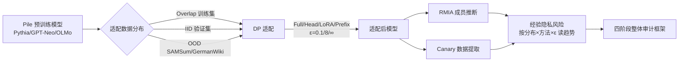

# Benchmarking Empirical Privacy Protection for Adaptations of Large Language Models

**会议**: ICLR 2026  
**OpenReview**: [https://openreview.net/forum?id=jY7fAo9rfK](https://openreview.net/forum?id=jY7fAo9rfK)  
**代码**: 待确认  
**领域**: LLM 隐私安全 / 差分隐私 / 成员推断攻击  
**关键词**: 差分隐私, DP 微调, 成员推断攻击 (RMIA), 数据提取, 分布偏移, LoRA, 隐私审计  

## 一句话总结
作者系统性地拷问了一个被默认正确的信条——「给 LLM 微调上差分隐私 (DP) 就安全了」，发现实证隐私风险其实由**适配数据与预训练数据的分布距离**主导：越接近预训练分布、风险越高（哪怕没有直接重叠），而 LoRA 在同等理论 $\varepsilon$ 下对 OOD 数据给出最强的经验保护。

## 研究背景与动机
**领域现状**：把预训练 LLM 适配到医疗、邮件等敏感下游任务时，差分隐私 (DP) 已成为保护私有适配数据的「黄金标准」——DPSGD、DP-LoRA、DP-Prefix Tuning、PromptDPSGD 等一系列方法都能给出 $(\varepsilon,\delta)$-DP 的形式化保证。

**现有痛点**：理论保证 ≠ 实际安全。DP 的形式化定义只承诺「邻接数据集的输出分布相近」，但它**默认预训练阶段与适配数据互相独立**。现实中预训练语料几乎都不公开（GPT-4、Qwen、LLaMA 全闭源），适配数据极可能与预训练数据重叠或高度相关，这种纠缠会在 DP 之外悄悄泄露隐私。已有工作要么只看预训练泄露、要么只看非私有适配的泄露，缺一个把「预训练—适配」流水线作为整体来量化经验风险的 benchmark。

**核心矛盾**：从业者面对一堆现实问题却没有任何指导——**该选哪种适配方法？给定私有数据该选哪个预训练模型？$\varepsilon$ 设到多少才真的够保护？** 同一个理论 $\varepsilon$ 下，不同方法、不同分布的实际泄露可能天差地别，但没人系统量化过。

**本文目标**：用 SOTA 攻击（鲁棒成员推断 RMIA + canary 数据提取）系统审计 DP 适配的经验隐私风险，沿「与预训练**完全重叠 → 同分布 IID → 完全异分布 OOD**」这条分布谱系横扫，给出可落地的部署建议。

**核心 idea（基准 + 分布谱系审计）**：不发明新攻击或新防御，而是把「适配数据相对预训练数据的分布位置」当成第一性自变量，配上最强攻击和多档隐私预算，量化出「分布距离 = 隐私风险主驱动力」这一被忽视的规律，并进一步提出覆盖全流水线的**整体隐私审计框架**。

## 方法详解

### 整体框架
benchmark 把私有 LLM 适配的审计拆成一个可控的网格实验：固定一族在 Pile 上训练、训练数据已知的开源模型（Pythia / GPT-Neo / OLMo，70M–1.4B），沿三类适配数据（Overlap / IID / OOD）× 四种适配方法（Full / Head / LoRA / Prefix）× 多档隐私预算（$\varepsilon \in \{0.1, 8, \infty\}$ 等）做笛卡尔积，用 RMIA 量化成员泄露、用 canary exposure 量化数据提取泄露，再在所有维度上读出趋势。最后把零散的实验观察上升成一个四阶段的整体隐私审计框架。

### 关键设计

**1. 分布谱系作为第一性自变量：用 Wasserstein 距离锚定「重叠—IID—OOD」**  
benchmark 的灵魂在于把适配数据按其与预训练分布的距离分档，而不是笼统地说「私有数据」。具体三档：**Overlap**（直接取 Pile 预训练子集做适配）、**IID**（取同分布但预训练时未见过的验证集，如 Bookcorpus2/GitHub/Enron 的 val）、**OOD**（完全异分布，如对话摘要 SAMSum、德语维基 GermanWiki）。为了让分档不靠主观判断，作者用 Sentence-BERT 把句子嵌入后计算适配数据与 Pile 各子集间的 Wasserstein 距离来量化偏移——表里 Pile 系数据集距离仅 ~0.017–0.020，SAMSum 升到 0.025，GermanWiki 因为是德语直接飙到 0.056，客观印证了 OOD 的强度排序。这一步让「分布距离」从直觉变成可测变量，也成了后面所有结论的坐标轴。

**2. 用最强威胁模型保证结论的「下界」性质：RMIA + canary exposure 双攻击**  
要论证「DP 不够安全」就必须用最强攻击，否则弱攻击失败不能说明问题。成员推断上选用 SOTA 的鲁棒成员推断 RMIA（offline 版，单参考模型即可，效率高），并以 Reference 攻击和无参考的 Min-K% 作对照基线；数据提取上则往适配集里插入对抗性 **canary**，用 exposure 度量其被记住的程度：
$$\text{exposure}(z, \hat{Z}) = \log_2 |U| - \log_2\big(\text{rank}(z; \hat{Z})\big)$$
当目标样本 $z$ 被排到最可能（rank=1）时 exposure 取最大值 $\log_2|U|$，排到最末则为 0。再配合 $k$-可提取记忆（$k=10$ 个上下文 token 下贪婪解码能逐字吐出后缀即判为被提取）。两种攻击一个测「是否在训练集里」、一个测「能否逐字背出」，覆盖从软到硬两种泄露形态。

**3. 公平比较的关键控制：对齐适配后的验证困惑度**  
成员推断的成功率高度依赖 train-test gap，如果不同方法训练到不同收敛程度，泄露差异就分不清是「方法本身更私密」还是「只是欠拟合」。为此作者强制所有适配方法在每个数据集上训练到**相近的验证 loss / 困惑度**再做攻击对比，把效用拉齐后剩下的 AUC 差异才能干净地归因到方法的隐私属性。正因为有这个控制，后面「LoRA 在同等效用下 AUC 更低」「Prefix 抗提取最强」这类结论才站得住脚。

**4. 从基准上升到框架：四阶段整体隐私审计 + 重定义成员推断博弈**  
作者意识到孤立审计预训练或适配都不够，泄露发生在两阶段的交互里，于是提出覆盖全流水线的四阶段审计：(1) 审计预训练、(2) 审计适配、(3) 预训练与适配的**联合审计**、(4) 适配后回溯审计预训练。为了让框架可实例化，他们把标准成员推断博弈 $G$ 推广到「双数据集双训练阶段」：挑战者采样 $a,b \sim \{0,1\}$，先用 $\tilde{S}$（$a{=}0$ 时为 $S$，否则 $S\cup\{x\}$）训练 $\theta$，再用 $\tilde{D}$（由 $b$ 决定是否含 $x$）适配出 $\theta'$，攻击者据其背景知识猜 $\hat{a},\hat{b}$。攻击者要猜哪个变量、能拿到 $\theta$ 还是 $\theta'$，由审计阶段决定——这把模糊的「全流水线隐私」形式化成了可执行的对抗游戏。

## 实验关键数据

### 主实验表格（RMIA shadow AUC，Pythia 1B）

| 适配方法 | OOD ε=8 | OOD ε=0.1 | IID ε=8 | IID ε=0.1 |
|---|---|---|---|---|
| Prefix Tuning | 0.63 | 0.62 | 0.90 | 0.58 |
| LoRA | 0.64 | **0.58** | 0.71 | **0.52** |
| Full Fine-Tune | 0.77 | 0.59 | 0.80 | 0.75 |
| Head Fine-Tune | 0.87 | 0.66 | 0.70 | 0.71 |
| **平均** | 0.73 | 0.61 | **0.78** | 0.64 |

> 同一 $\varepsilon=8$ 下，IID 平均 AUC (0.78) 系统性高于 OOD (0.73)；$\varepsilon=\infty$（无 DP）时几乎所有 AUC≈1.00。**IID 验证集泄露与直接 Overlap 训练集几乎一样高**，说明分布接近度而非数据重叠才是主驱动。

### 消融实验表格（各 RQ 关键发现）

| 研究问题 | 核心结论 |
|---|---|
| RQ1 分布关系 | 适配数据越接近预训练分布、风险越高；IID(未见)泄露 ≈ Overlap(已见) |
| RQ2 哪种方法最保护 | LoRA 在 OOD 高隐私档最私密(AUC 0.58)；Full/Head 在 OOD 最脆弱 |
| RQ3 抗数据提取 | Prefix 最易被提取；LoRA / Head 抗提取最强；$\varepsilon=0.1$ 时 exposure≈1.44 近随机 |
| RQ4 攻击者知识 | 影子模型与目标共享架构/初始化/数据分布时 RMIA 最强；拿不到时用预训练模型是次优选 |
| RQ5 适配对预训练泄露 | 仅 Prefix 能降低预训练记忆（$\varepsilon{=}0.1$ 时记忆样本从 ~460 降到 ~430），其余方法基本不变 |
| RQ6 隐私-效用权衡 | LoRA 给出最佳权衡：同等困惑度下 AUC 更低（GitHub val 困惑度4.8 时 LoRA 0.6 vs Full 0.83） |

### 关键发现
- **中等隐私档 ($\varepsilon=8$) 远不够安全**：IID 敏感数据在强攻击下仍有显著泄露（AUC 0.7–0.9），必须走低 $\varepsilon$ 高隐私档才有实际保护。
- **预训练模型公开是双刃剑**：攻击者拿到适配所用的同款预训练模型当影子模型即可显著提升攻击成功率——而「适配公开 LLM」正是当下主流做法。
- **没有万能方法**：LoRA 抗成员推断和隐私-效用权衡最优，Prefix 抗逐字提取最强、还能略降预训练记忆，方法选择要按威胁模型来。
- benchmark 跨 **6 数据集 × 4 适配方法 × 7+ 预训练 LLM × 多档 $\varepsilon$**，结论在不同模型大小/架构上一致。

## 亮点与洞察
- **挑战一个被默认正确的信条**：「上了 DP 就安全」被实证拆穿——形式化 $\varepsilon$ 相同不代表经验风险相同，分布距离是被 DP 定义忽略的隐藏变量。
- **分布谱系这条坐标轴设计得极聪明**：用 Wasserstein 距离把模糊的「私有数据」量化成 Overlap→IID→OOD 连续谱，让「IID 未见数据竟和已见数据一样危险」这种反直觉结论可被干净测量。
- **可落地的从业者指南**：直接回答了选方法（LoRA）、选 $\varepsilon$（要低）、警惕公开预训练模型这三个真实部署决策。
- **从 benchmark 升华到框架**：四阶段审计 + 推广的对抗博弈，把单篇实证研究变成可被后续工作复用的方法论脚手架。

## 局限与展望
- **只能在开源、训练数据已知的模型上做**：闭源 API（GPT-4、Gemini）既无梯度级 DP 适配、又不吐 token 概率、也不公开训练集，benchmark 的三类分布判定和 RMIA 都无法施加，因此结论能否外推到前沿大模型存疑。
- **模型规模偏小**：主力是 70M–1.4B 的 Pythia/GPT-Neo/OLMo，更大模型的记忆/泄露行为可能不同。
- **效用代理较粗**：主文用困惑度/验证 loss 作效用代理（附录补了 Rouge-1 验证趋势一致），但下游真实任务效用可能更复杂。
- **四阶段框架尚停在形式化层面**：联合审计和适配后回溯审计提出了博弈定义，但大规模实例化、以及 OLMo 因缺已知验证集而分析受限，都是留给后续的工作。

## 相关工作与启发
- **承接 DP 与 DPSGD/PATE 谱系**（Abadi 2016；Papernot 2017）：本文不改 DP 机制，而是审计其经验有效性。
- **区别于此前 benchmark**：PrivAuditor (Zhu 2024) 只看非私有适配；Li 2024a 看私有适配但只关注隐私-效用权衡、不探究预训练与微调数据的关系；LLM-PBE (Li 2024b) 覆盖全生命周期但不做分布谱系。本文的差异化正是「分布距离 × DP 适配」这一交叉点。
- **方法学启发**：把「数据分布位置」当成隐私研究的一等自变量，并用嵌入距离客观锚定，这套思路可迁移到 unlearning、版权检测、合成数据审计等其他隐私场景。

## 评分
- **新颖性**: ⭐⭐⭐⭐ — 不发明新攻击，但「分布谱系作为隐私主驱动」这个视角和系统量化是真正的新贡献，且戳破了 DP 安全的常见误解。
- **实验充分度**: ⭐⭐⭐⭐⭐ — 6 数据集 × 4 方法 × 7+ 模型 × 多 $\varepsilon$ × 6 个 RQ，控制了困惑度做公平比较，覆盖成员推断与数据提取两类攻击，扎实全面。
- **写作质量**: ⭐⭐⭐⭐ — 以 RQ 驱动、结论先行（Summary of Findings）、表格清晰；四阶段框架部分形式化稍密但逻辑完整。
- **价值**: ⭐⭐⭐⭐⭐ — 直接给敏感场景部署 LLM 的从业者提供可操作指南（选 LoRA、压低 $\varepsilon$、警惕公开预训练模型），并留下可复用的整体审计框架，实践与方法论价值兼具。

<!-- RELATED:START -->

## 相关论文

- [\[ICLR 2026\] AudioTrust: Benchmarking the Multifaceted Trustworthiness of Audio Large Language Models](audiotrust_benchmarking_the_multifaceted_trustworthiness_of_audio_large_language.md)
- [\[ICLR 2026\] Natural Identifiers for Privacy and Data Audits in Large Language Models](natural_identifiers_for_privacy_and_data_audits_in_large_language_models.md)
- [\[ICML 2025\] Empirical Privacy Variance](../../ICML2025/llm_safety/empirical_privacy_variance.md)
- [\[ICLR 2026\] Measuring Physical-World Privacy Awareness of Large Language Models: An Evaluation Benchmark](measuring_physical-world_privacy_awareness_of_large_language_models_an_evaluatio.md)
- [\[ICLR 2026\] SecP-Tuning: Efficient Privacy-Preserving Prompt Tuning for Large Language Models via MPC](secp-tuning_efficient_privacy-preserving_prompt_tuning_for_large_language_mode.md)

<!-- RELATED:END -->
