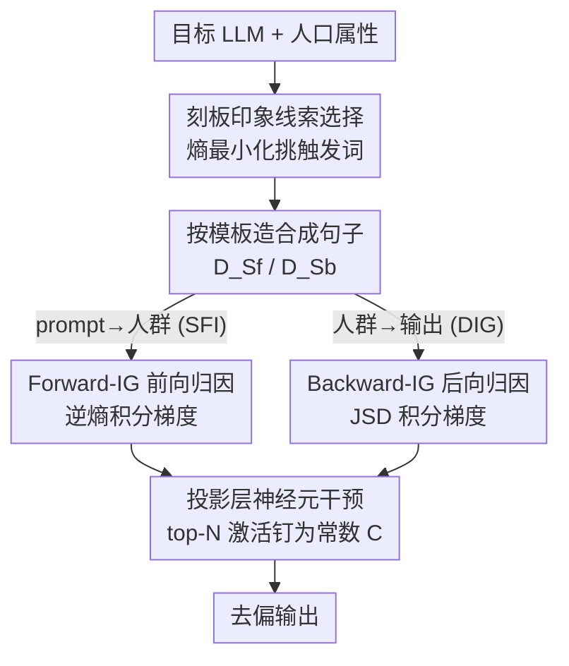

# Bi-directional Bias Attribution: Debiasing Large Language Models without Modifying Prompts

**会议**: ICLR 2026  
**OpenReview**: [https://openreview.net/forum?id=mUTN9VIaSy](https://openreview.net/forum?id=mUTN9VIaSy)  
**代码**: https://github.com/XMUDeepLIT/Bi-directional-Bias-Attribution  
**领域**: AI安全 / LLM公平性  
**关键词**: 社会偏见, 神经元归因, 积分梯度, 去偏, 可解释性

## 一句话总结
本文提出一个不微调、不改 prompt 的 LLM 去偏框架：先用熵最小化自动挑出最容易诱发偏见的刻板印象线索词，再用 Forward-IG / Backward-IG 两个双向积分梯度策略把偏见归因到投影层的具体神经元，最后直接钉住这些神经元的激活值，在三个常用 LLM 上显著降低社会偏见且几乎不损失语言建模能力。

## 研究背景与动机

**领域现状**：大模型在各种 NLP 任务上表现出色，但输出常常带有性别、种族、宗教、职业等社会刻板印象。去偏的两条主流路线是：① 用额外数据集微调模型；② prompt 工程，比如显式指示模型"不要依赖某些属性"，或先看一遍初始输出找出偏见模式再重新提问。

**现有痛点**：微调路线在大模型时代变得不切实际——时间和算力开销太大。prompt 路线则会破坏用户体验：每轮都要改写或追加指令，在多轮对话里反复重写会显著拉长上下文、推高推理成本。还有一类做法是定位"社会偏见神经元"再抑制它们（如 IG2），但它原本是为 BERT 这类掩码语言模型设计的。

**核心矛盾**：把 IG2 这类神经元抑制法直接搬到现代大模型上有两个硬伤。其一，深层模型的**低层神经元**对最终输出的贡献很弱——激活会被后续大量非线性运算稀释甚至抹掉，干预它们改不动 token 生成概率。其二，IG2 只能刻画**预定义二元人群对**之间的偏见（如 female vs. male、driver vs. doctor），无法覆盖跨对关系（如 driver 与 waiter 之间），归因不可靠。此外还有一个未解决的问题：怎么系统地找出那些**真正能触发偏见**的输入词，没有可靠触发词，归因和干预都无从谈起。

**本文目标**：作者把"去偏"拆成两个正交子问题——**人群无关生成（DIG）**：只改 prompt 里的人群信息时，输出分布应几乎不变 $P_\theta(y|g(d)) \approx P_\theta(y|g(d'))$；**无刻板印象推断（SFI）**：给一个含刻板线索的 prompt，模型反推人群身份时不应有系统性偏好 $P_\theta(d|x) \approx P_\theta(d'|x)$。目标是一套方法同时解决这两个方向。

**切入角度**：既然两个子问题在因果方向上正好相反（SFI 是"prompt→人群"的前向，DIG 是"人群→输出"的后向），那就用两个方向各自的积分梯度去归因，互补地圈出与偏见相关的神经元；同时干预点选在**投影层**（把高维表示映射到 logits 的最后一层），绕开低层激活被稀释的难题。

**核心 idea**：先自动挖出刻板印象线索词，再用前向/后向两套积分梯度把偏见归因到投影层神经元，最后把这些神经元的激活钉成常数——全程不动权重、不改用户 prompt。

## 方法详解

### 整体框架

整个流程是一条"挖词 → 造数据 → 双向归因 → 钉神经元"的流水线。给定一个目标 LLM 和一类人口属性（性别/国籍/职业/宗教），方法先在这个模型自己的概率空间里挑出最能诱发偏见的刻板印象线索词；用这些词按模板批量造出合成句子，分别构成前向数据集 $D_{Sf}$ 和后向数据集 $D_{Sb}$；然后在投影层上跑 Forward-IG（沿 SFI 方向）和 Backward-IG（沿 DIG 方向）两套积分梯度，各自给神经元打分、排序、选出 top-N 偏见神经元；最后把这些神经元的激活值统一钉成常数 $C$，从而切断它们对偏见行为的贡献，输出去偏后的结果。前向和后向是两条**并行**的归因视角，分别更擅长 SFI 与 DIG，可独立使用。

### 关键设计

**1. 刻板印象线索选择：用熵最小化在模型自己的概率空间里挖触发词**

要做精准归因，第一步得知道"哪些词会诱发偏见"。本文不靠人的主观假设，而是定义**刻板印象线索**为那些会让模型对特定人群产生倾斜预测的形容词或名词（如没给性别信息时模型倾向把 "doctor" 当男性，"doctor" 就是一个线索）。做法是先用 GPT-4 帮忙列出可能带刻板印象的形容词和名词候选池 $V_{adj} \cup V_{noun}$（相比 IG2 只用形容词模板，本文额外扩展了名词构造），再用一组句子模板把每个候选词填进去（如"The gender of this [线索词] person is [人群]"），约束模型只在人群集合 $D$ 上生成、取末层 softmax 概率。

衡量"偏见诱发强度"的核心指标是**香农熵**：对候选词 $w$，先在所有模板上把预测分布平均得到 $p_{agg}$，再算 $H(p_{agg})$。熵越低，说明分布越集中在某个人群上、偏见诱发越强。最终把所有词按熵**升序**排序选 top 词。这个设计直接回应了"如何系统找出可靠触发词"这一未解难题：它是 model-specific、attribute-specific 的（不同模型挑出的词不同），且实验证明所选词在模型 embedding 空间里与男/女词汇的相似度差异（Diff）更大，确实更偏。

**2. Forward-IG：沿 SFI 方向，用逆熵积分梯度找"看线索猜人群"的偏见神经元**

前向方向对应 SFI 问题——输入含刻板线索、让模型预测样本属于哪个人群。用第 1 步选出的线索词填模板造出 $D_{Sf}$（如"The gender of this sensitive person is [人群]"），对每个样本让模型预测人群。归因目标是投影层的输入神经元 $h_j$，Forward-IG 量化把 $h_j$ 从 0 沿直线插值到原始激活时、输出**确定性**的累积变化：

$$\text{Forward-IG}(h_j) = h_j \int_{0}^{1} \frac{\partial \big[H(p(d_i|\alpha h_j))\big]^{-1}}{\partial h_j}\, d\alpha$$

关键在于积分项用的是**熵的倒数** $[H(\cdot)]^{-1}$：熵越小、倒数越大，意味着模型越确信样本属于某个特定人群——这种过度确信正是偏见的体现。沿插值路径积累这种确信度，就量化了每个神经元对偏见预测的贡献。积分用黎曼和近似（$n_{step}$ 步）。对 $D_{Sf}$ 所有样本取平均分后降序排，选 top $N = \beta M$ 个神经元（$M$ 为该层神经元总数，$\beta$ 为比例超参）。这一支专门针对"模型从刻板线索反推人群"时的偏见来源。

**3. Backward-IG：沿 DIG 方向，用 JSD 积分梯度找"换人群导致输出漂移"的偏见神经元**

后向方向对应 DIG 问题——固定一个属性，把模板里 [人群] 占位换成 $n_d$ 个不同人群造出句子子集（如同一句分别填 male / female），所有子集构成 $D_{Sb}$。对每个子集让模型预测句中的刻板线索词（候选就是第 1 步选出的线索），目标是找出"让模型对不同人群产生不同线索分布"的神经元。打分用 **Jensen-Shannon 散度**衡量跨人群预测分布的差异：

$$\text{Backward-IG}(h_j) = h_j \int_{0}^{1} \frac{\partial\, \text{JSD}\big(p_1(w|\alpha h_j), \dots, p_{n_d}(w|\alpha h_j)\big)}{\partial h_j}\, d\alpha$$

JSD 越大说明这个神经元越是在制造"换了人群、输出就不一样"的差异。和前向一样从 0 到原值插值并沿路积累 JSD 梯度，子集上取平均后选 top-N。Backward-IG 的妙处在于它天然支持**多个人群一起比**（JSD 可作用于 $n_d$ 个分布），绕开了 IG2 只能比二元对、漏掉跨对关系的局限。实验也印证两支各有所长：Backward-IG 更适合 SFI，Forward-IG/Backward-IG 在 DIG 上都好，互为补充。

**4. 投影层神经元干预 + 偏见-输出变化的理论保证**

定位到偏见神经元后，干预极其朴素：把这些 top-N 神经元的激活值统一钉成常数 $C$，其余不动——$\hat{h}_j = C$ 若 $h_j$ 在 top-N 内，否则 $\hat{h}_j = h_j$。这一步切断了它们对偏见行为的贡献，且因为发生在投影层（token 预测前的最后一层），避开了低层激活被后续非线性稀释的问题，无需任何重训练。作者还给了一条理论保证（Theorem 1）：当隐表示沿 $h(t) = h + t\Delta h$ 修改时，偏见函数 $B$（如逆熵或 JSD）的变化满足 $|\Delta B| \le \|\nabla B(y(0)+\theta\Delta y)\| \cdot \|\Delta y\|$，即偏见变化量被输出漂移 $\|\Delta y\|$ 上界控制。这条不等式把"去偏"和"输出变化"显式绑在一起：极端情况下若模型彻底失去建模能力、对任何人群都随机输出，偏见自然趋零——这也解释了为什么纯粹靠破坏输出（如 IG2 在某些设定下大降 LMS）能压低偏见却不可取，好的去偏应在压偏见的同时把 $\Delta y$ 控住。

### 损失函数 / 训练策略
本方法**不涉及任何训练/微调**，没有损失函数。全部操作是推理期的：候选词熵排序选线索 → 积分梯度（黎曼和近似）给神经元打分 → 选 top $N=\beta M$ → 把激活钉为常数 $C$。关键超参是神经元比例 $\beta$、干预常数 $C$、积分步数 $n_{step}$。

## 实验关键数据

在 Llama3.1-8B、Llama3.2-3B、Mistral-7B-v0.3 三个模型上评测，覆盖 DIG（StereoSet、BBQ）与 SFI（WinoBias）任务。基线分三类：训练型 Auto-Debias；prompt 型 Prefix Prompting / Self-Debiasing / DDP；神经元归因型 IG2。FBA / BBA 分别指基于 Forward-IG / Backward-IG 的去偏策略。

### 主实验

StereoSet（DIG），指标 SS 越接近 50% 越公平、LMS 与 ICAT 越高越好（Llama-3.1）：

| 方法 | Gender SS→50 | Gender ICAT↑ | Religion SS→50 | Religion ICAT↑ |
|------|------|------|------|------|
| Base | 77.34 | 45.31 | 56.94 | 78.48 |
| Prefix Prompting | 81.89 | 35.94 | 54.79 | 83.54 |
| IG2 | 77.34 | 45.31 | 61.64 | 70.89 |
| **FBA** | **68.75** | **62.50** | 51.35 | **91.14** |
| **BBA** | 69.84 | 59.38 | **49.31** | **91.14** |

WinoBias（SFI），Gap 越小越公平、$P_{other}$ 越低语言能力越好：

| 方法 | Llama-3.1 Gap↓ | Llama-3.1 $P_{other}$↓ | Llama-3.2 Gap↓ | Llama-3.2 $P_{other}$↓ |
|------|------|------|------|------|
| Base | 25.26 | 0.00 | 91.42 | 0.00 |
| IG2 | 14.64 | 0.00 | 0.25 | 13.39 |
| FBA | 5.06 | 0.00 | 18.68 | 0.00 |
| **BBA** | **1.02** | **0.00** | **3.04** | **0.00** |

BBQ（DIG）上 BBA 在 Llama-3.1 取得最高平均（81.70），FBA/BBA 在压低歧义场景偏见的同时几乎不掉 disambiguated 准确率，比 prompt 法（Accamb 上去但 Accdis 大跌）更温和。

### 消融实验
Llama-3.1 / StereoSet 上对 FBA 做两类消融：

| 配置 | 现象 | 说明 |
|------|------|------|
| Full（FBA） | SS 近 50%、LMS 高 | 完整方法 |
| w/o attribution | 多数域不如 FBA | 同比例随机选神经元干预（50 次测试），SS 更偏、LMS 更低 |
| w/o selection | SS 整体更偏离 50% | 取每组首词当线索（不跑熵选择），且 LMS 反而略降 |

### 关键发现
- **归因比随机选神经元关键**：随机选同样比例的投影层神经元去干预，除职业域外都打不过 FBA；说明真正起作用的是"选对神经元"而非"动了神经元"。
- **线索选择算法不伤语言能力**：去掉熵选择后 SS 更偏，且 LMS 也略降——反过来说，好的线索选择既提升去偏又不损害建模能力。
- **前后向各有所长**：BBA 更适合 SFI（WinoBias Gap 压到 1.02），DIG 上 FBA/BBA 都好；两个方向互补。
- **基线常顾此失彼**：IG2 在 Llama-3.2 性别域靠大降 LMS 把 SS 拉近 50%，这种"靠破坏语言能力换公平"在实际应用中不可接受，正好印证 Theorem 1 的直觉。

## 亮点与洞察
- **把去偏形式化为 DIG + SFI 两个正交子问题**，再用方向相反的两套积分梯度（Forward-IG 逆熵、Backward-IG 用 JSD）分别归因，结构清晰且互补——这种"按因果方向拆分再各个击破"的思路可迁移到其他可解释干预任务。
- **用熵最小化在模型自己的概率空间挑触发词**，避开人为预设刻板词表，是 model/attribute-specific 的，比固定词表更贴合具体模型的真实偏见。
- **干预点选在投影层**这一工程判断很关键：直接绕开"低层激活被非线性稀释"的老问题，让神经元抑制法第一次在现代大 LLM 上真正生效。
- **理论上把偏见变化 $|\Delta B|$ 用输出漂移 $\|\Delta y\|$ 上界绑定**，既给方法提供了依据，也一针见血地解释了"靠破坏输出降偏见"为何不可取。

## 局限与展望
- 干预方式是把激活**硬钉成常数 $C$**，$C$、$\beta$ 等是需要调的超参，论文未深入分析其敏感性与跨模型迁移性；钉成定值可能在某些样本上过度干预。
- 评测主要在四类人口属性、cloze/选项式 benchmark（StereoSet/BBQ/WinoBias）上，对**开放式长文本生成**中的偏见缓解效果未充分检验。
- 线索候选依赖 GPT-4 生成，候选池质量会影响下游归因；若 GPT-4 本身漏掉某些隐性刻板词，方法也难以覆盖。
- 实验集中在 3B–8B 规模模型，更大模型上投影层神经元数 $M$ 暴涨，top-N 选择与干预的可扩展性有待验证。

## 相关工作与启发
- **vs IG2（Liu et al., 2024）**: IG2 把二元人群对的预测差归因到 FFN 神经元，本文指出它在大模型上有"低层激活被稀释"和"只能比二元对、漏跨对关系"两个硬伤；本文改用投影层 + 逆熵/JSD 双向归因，既绕开稀释又能多人群一起比。
- **vs 微调型（Auto-Debias）**: 微调要改权重、开销大且难扩展；本文全程推理期操作，不动权重。
- **vs prompt 型（Prefix Prompting / Self-Debiasing / DDP）**: prompt 法在多轮对话里反复改写，拉长上下文、推高成本，且常在 disambiguated 场景误把正确答案改成"unknown"；本文不碰用户 prompt，更温和——有明确上下文时仍给正确答案。

## 评分
- 新颖性: ⭐⭐⭐⭐ 把去偏拆成 DIG/SFI 并用方向相反的双向积分梯度归因 + 投影层干预，角度新颖且自洽。
- 实验充分度: ⭐⭐⭐⭐ 三模型、四属性、三 benchmark、两类消融 + 理论保证，较扎实；但偏 cloze/选项式评测。
- 写作质量: ⭐⭐⭐⭐ 问题定义清晰、公式与动机对得上，前后向区分讲得明白。
- 价值: ⭐⭐⭐⭐ 无需微调/改 prompt 的可解释去偏，对实际部署友好，且把"破坏输出≠好去偏"讲清楚。

<!-- RELATED:START -->

## 相关论文

- [\[ICLR 2026\] Faithful Bi-Directional Model Steering via Distribution Matching and Distributed Interchange Interventions](faithful_bi-directional_model_steering_via_distribution_matching_and_distributed.md)
- [\[ICLR 2026\] BiasBusters: Uncovering and Mitigating Tool Selection Bias in Large Language Models](biasbusters_uncovering_and_mitigating_tool_selection_bias_in_large_language_mode.md)
- [\[ICLR 2026\] Reasoning or Retrieval? A Study of Answer Attribution on Large Reasoning Models](reasoning_or_retrieval_a_study_of_answer_attribution_on_large_reasoning_models.md)
- [\[AAAI 2026\] Anti-adversarial Learning: Desensitizing Prompts for Large Language Models](../../AAAI2026/llm_safety/anti-adversarial_learning_desensitizing_prompts_for_large_la.md)
- [\[AAAI 2026\] Gender Bias in Emotion Recognition by Large Language Models](../../AAAI2026/llm_safety/gender_bias_in_emotion_recognition_by_large_language_models.md)

<!-- RELATED:END -->
