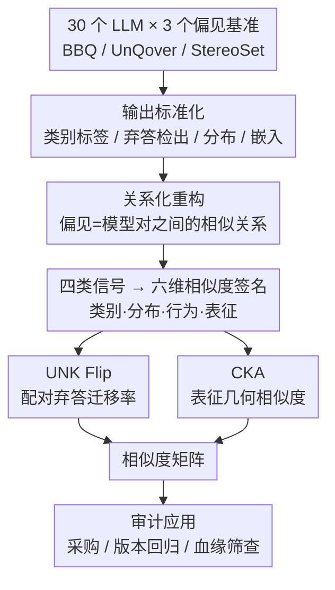

# Bias Similarity Measurement: A Black-Box Audit of Fairness Across LLMs

**会议**: ICLR2026  
**OpenReview**: [https://openreview.net/forum?id=EveruzAsGI](https://openreview.net/forum?id=EveruzAsGI)
**代码**: https://github.com/HyejunJeong/bias_llm  
**领域**: LLM 安全 / 公平性审计  
**关键词**: 偏见相似度、公平性审计、指令微调、弃答、CKA

## 一句话总结
把"某个模型公平不公平"这个孤立标量评测，重构成"哪些模型在公平性上彼此像、为什么像"的**关系性度量**（Bias Similarity Measurement，BSM），用一组横跨标量/分布/行为/表征的相似度函数，在 30 个 LLM、100 万+ 提示上做黑盒审计，发现指令微调主要靠"强制弃答"而非改变内部表征来"变公平"。

## 研究背景与动机
**领域现状**：评测 LLM 的社会偏见，主流做法是用 BBQ、StereoSet、UnQover 这类结构化基准，给**单个模型**算一个偏见分（bias score）或准确率，越接近中性越"公平"。

**现有痛点**：孤立打分有两个盲区。其一，它只告诉你"模型 M 有没有偏"，却没法回答"M1 和 M2 的偏见是不是同一种、谁继承了谁"——而这恰恰是采购、版本回归、血缘溯源时真正关心的问题。其二，弃答（abstention，回答"无法确定 / Unknown"）通常被当成噪声过滤掉，但一个模型如果学会了"遇到敏感问题就拒答"，它的偏见分会很好看，可底层表征里的偏见一点没变——孤立标量评测会把这种"靠谨慎装出来的公平"误判成"真公平"。

**核心矛盾**：公平性失效如果是**结构性继承**的（同一基座、同一数据管线传下来），那把模型 A 换成同族的 B 根本解决不了问题；反过来，如果各家微调策略都在把模型推向同一种"重弃答"的趋同行为，那看似的公平进步只是表面文章。**没有模型间的关系分析，公平性审计就会高估进步、低估系统性顽固。**

**本文目标**：构造一个能跨黑盒系统比较的统一框架，回答三类此前无法回答的问题——隐藏血缘检测、家族级趋同量化、跨版本公平漂移追踪。

**切入角度**：作者把问题从"Is model M biased?"换成"Which models behave similarly with respect to bias, and why?"。一旦把偏见看成模型对（pair）之间的**功能性签名**，就能像比指纹一样比较两个模型在敏感提示下的行为模式，而不只是比一个数字大小。

**核心 idea**：用"偏见相似度签名"取代"孤立偏见分"——把标量、分布、行为、表征四类互补信号统一进一个相似度空间，让公平性成为可比较的关系属性。

## 方法详解

### 整体框架
BSM 把偏见定义为"模型之间在相同敏感提示下行为的相似关系"，而非任何单个系统的固定属性。整条流水线是：取一组模型 $M=\{M_1,\dots,M_n\}$ 和一组偏见维度 $D=\{d_1,\dots,d_k\}$（性别、种族、国籍、宗教等），把它们都喂同一批结构化提示（来自 BBQ / UnQover / StereoSet，每条提示含上下文、问题、候选答案）；对每个模型的原始输出做**标准化**（补全映射成类别标签、检出弃答、聚合成分布、需要时抽取隐层嵌入）；然后对每一对模型 $(M_i,M_j)$ 用六个互补的相似度函数算出一个**六维偏见相似度签名**

$$S(M_i, M_j \mid X, D) = (S_{m_1}, S_{m_2}, \dots, S_{m_6}),$$

最后把所有模型对的签名拼成相似度矩阵，既能局部分析（族内：base vs tuned），也能全局分析（开源 vs 闭源），落到采购、版本回归测试、血缘筛查三类审计应用。关键是这条管线是**模块化**的：六个度量各自独立，可单独计算、单独看，按审计场景灵活取用。

### 关键设计

**1. 关系化重构：把"是否有偏"换成"偏得像不像"**

孤立打分的根本缺陷是无法表达模型之间的关系，所以"换个模型"是否真能解决公平问题、"微调"带来的是结构性改善还是表面趋同，都无从判断。BSM 借用了已有的"功能相似性分析"思路（用预测重叠、决策边界、表征对齐去比较两个黑盒模型），但把**公平性本身**当作比较的轴心——不问"M 有没有偏"，而问"哪些模型在偏见上表现相似、为什么"。这个重构看似只是换了个问法，实际打开了三类全新分析：检测隐藏血缘（两个闭源系统偏见签名异常接近 → 可能克隆/继承）、量化家族级趋同（各家微调是否都在往同一种行为收敛）、追踪跨版本公平漂移。作者还谨慎地区分了**因果可推断**的族内比较（同基座，差别主要在微调）和只能当**观测性生态描述**的跨厂商比较（架构/数据/管线都不同，不做因果断言）。

**2. 四类信号 → 六维相似度签名**

公平性评测的老问题是指标碎片化——一堆数字摆在一起，不知道它们彼此什么关系、是不是在测同一个东西。BSM 把四个层级的信号统一成一个签名向量：**类别（categorical）**用消歧问题上的准确率和偏见分；**分布（distributional）**用直方图和余弦距离比较模型把概率质量分给各答案类别的比例；**行为（behavioral）**用弃答翻转率刻画"偏见答案被换成 Unknown"的倾向；**表征（representational）**用 CKA 比较隐层激活的几何。其中偏见分沿用 BBQ 的定义，按上下文是否消歧分两种：消歧时 $s_{DIS} = 2\big(n_{biased}/n_{non\_unknown}\big) - 1$，模糊时 $s_{AMB} = (1-acc)\cdot s_{DIS}$，再 ×100 让取值落在 $[-100, +100]$（$-100$ 反刻板、$+100$ 刻板、0 中性）。把四类信号融进同一空间，才能把"表面公平行为"和"结构性不变量"分开——比如揭示指令微调可能让表征偏见原封不动、却靠弃答制造出行为上的趋同。因为各分量独立，BSM 是一个灵活的审计工具箱，而不是一个单块的 benchmark。

**3. UNK Flip：配对弃答迁移率，戳穿"靠拒答装公平"**

要判断指令微调到底是真纠偏还是学会了回避，需要一个**配对**度量，把同一基座的 base 模型和它的 tuned 版本直接对照。UNK Flip 定义为基座模型给出的偏见答案中，被微调版改写成"Unknown"的比例：

$$\text{UNK Flip}(M_b \to M_t) = \frac{n_{biased \to UNK}}{n_{biased}},$$

其中 $n_{biased}$ 是基座给出的偏见答案（刻板或反刻板）数，$n_{biased\to UNK}$ 是其中被微调版翻成 Unknown 的子集。高翻转率说明微调在欠定上下文里大力推弃答、减少偏见强化，低翻转率则说明公平收益有限。关键洞察来自它和偏见分的**互补**：高翻转率 + $s_{AMB}\approx 0$ 是"靠拒答求公平"，而低翻转率 + 大 $|\Delta s_{AMB}|$ 才是"在仍然作答的前提下做方向性再平衡"。这就能把"谨慎换来的公平"和"表征改善带来的公平"区分开——例如 Gemma 2 9B-It 翻转超 50% 却仍给刻板答案，而 LLaMA 3.1 8B 只翻转约 40%，却把 $s_{AMB}$ 从 27.2 压到 2.3，是真的在改方向。

**4. CKA：表征几何相似度，证明微调改表面不改内核**

行为层的指标看不到"模型脑子里有没有变"。CKA（Centered Kernel Alignment）通过比较两个模型在同一批输入上的激活 Gram 矩阵，度量它们是否把输入编码进线性相关的特征空间——分数高说明表征几何相似，即便输出行为不同。把 CKA 和前面的行为度量并置，就能回答"微调到底改了推理通路还是只改了表面解码"。结果是后者：base 和 tuned 模型的对角 CKA 普遍 >0.94、全矩阵 CKA 仍 >0.85，说明指令微调基本保留了内部几何，只在靠后的 decoder 层漂移更明显。这从表征层坐实了核心论断——**所谓"微调变公平"，主要是表面解码行为变了（学会弃答），底层表征里的偏见几乎原封不动。**

## 实验关键数据

### 主实验
评测规模：4 个家族（LLaMA / Gemma / GPT / Gemini）共 **30 个 LLM**，参数从 3B 到 70B，含 base 与 instruction-tuned 变体、开源与闭源；数据来自 BBQ（9 个维度、每维约 5K 样本）、UnQover（4 维、约 100 万样本）、StereoSet（开放式生成），合计 100 万+ 结构化提示。

| 模型 (base) | $s_{AMB}$ Base | $s_{AMB}$ Tuned | $s_{DIS}$ Base | $s_{DIS}$ Tuned | 解读 |
|------|------|------|------|------|------|
| LLaMA 3.1 8B | 18.59 | 1.38 | 31.37 | 4.78 | 微调后刻板偏见大幅下降 |
| LLaMA 3.2 3B | 11.95 | **15.71** | 17.67 | **30.97** | 小模型微调后**更刻板**（反直觉） |
| Gemma 3 4B | -3.89 | 5.83 | 2.69 | 8.62 | 小模型微调后偏向刻板 |
| GPT-2 | 72.43 | — | 96.19 | — | 老模型极端刻板，作 legacy 基线 |
| GPT-4o Mini | — | 0.47 | — | 2.66 | 近零偏见、高准确率 |
| GPT-5 Mini | — | 0.21 | — | 1.10 | 近乎完美中性、最稳 |

| CKA（base vs tuned） | 对角 Diag | 全矩阵 Full |
|------|------|------|
| LLaMA 2 7B | 0.991 | 0.902 |
| LLaMA 3 8B | 0.973 | 0.851 |
| Gemma 2 9B | 0.941 | 0.906 |
| Gemma 3 12B | 0.972 | 0.911 |

### 消融实验
BSM 不是训练方法，没有传统消融，但六个度量的"单独看"本身就构成对评测维度的拆解分析：

| 度量维度 | 关键指标 | 揭示了什么 |
|------|---------|------|
| 准确率（消歧） | BBQ 消歧准确率 | 偏见是否压过正确答案；GPT Mini 近满分，Gemini 退到 GPT-2 水平 |
| 偏见分 $s$ | $s_{AMB}/s_{DIS}$ | 方向性偏斜；只有它会漏掉分布形状 |
| 直方图 + 余弦距离 | 分布对齐 | BBQ 重弃答使分布坍缩、base/tuned 几乎难分；UnQover 强制选择下方向差异重现 |
| UNK Flip | 配对弃答迁移率 | 微调=推弃答；Gemma 翻转 >50% |
| CKA | 表征相似度 | 微调改表面不改内核（>0.85） |

### 关键发现
- **指令微调主要靠弃答而非纠偏**：BBQ（允许弃答）里微调模型大量回答 Unknown 制造"中性"假象，但同样的模型到 UnQover（强制二选一）就暴露刻板倾向，尤其小模型——**弃答是掩盖偏见而非解决偏见**。
- **弃答 vs 表征的二分**：在模糊上下文里弃答是恰当的公平姿态；但在消歧上下文里弃答其实是语言理解错误（明明信息充分却拒答），既掩盖残余表征偏斜、又损失实用性。
- **小模型微调收益小、强制选择下甚至更不公平**：LLaMA 3.2 3B 微调后 $s_{AMB}$ 反升到 15.71，因为拒答不成比例地删掉了反刻板答案，留下的已知质量更偏刻板。
- **开源可匹敌甚至超过闭源**：Gemma 3 Instruct 以远低成本达到 GPT-4 级公平；而 Gemini 的重弃答策略压低了 utility。
- **家族签名分化**：Gemma 偏向 refusal（UNK 翻转常 >50%），LLaMA 3.1 用更少 refusal 趋向中性，但整体都在向"重弃答"行为收敛。

## 亮点与洞察
- **把"评测"升维成"关系图谱"**：从给单模型打分，变成给模型对画相似度矩阵——这让"隐藏血缘检测""家族趋同""版本漂移"这些此前没有工具能碰的审计任务第一次变得可操作，迁移价值很高（论文也指出可自然扩展到代码和多语言场景）。
- **UNK Flip 与偏见分的互补设计很巧**：单看任一个都会被"高翻转 ≠ 真公平"骗到，两者并置才能把"靠拒答装公平"和"真改方向"分开，这个组合可直接复用到任何带弃答选项的评测里。
- **CKA 提供了"行为/表征解耦"的硬证据**：行为指标说"微调让模型变公平了"，CKA 说"内部几何几乎没动"——两条证据合起来，把"微调=表面工程"这个直觉钉成了可测结论。
- **最让人啊哈的点**：弃答会让 BBQ 上 base 与 tuned 的输出分布坍缩到几乎难分，余弦距离趋零——也就是说"重弃答"会主动抹掉模型间本应存在的差异，这是孤立标量评测系统性失真的根因。

## 局限与展望
- **跨厂商比较只能当观测**：架构/数据/管线都不同，作者自己明确不做因果断言，只有族内（同基座）比较才支持"微调效应"的解释性结论——所以"开源超过闭源"这类结论要带 caveat。
- **依赖现有基准的题型约束**：BBQ 三选一带 Unknown、UnQover 二选一无弃答，结论很大程度由数据集的答案格式塑造；换一套题型，弃答行为的呈现可能不同。
- **偏见/合理事实的边界模糊**：作者举的"年轻人更易适应新技术"例子说明，有些回答可能事实成立却仍被算作刻板，BSM 把它当功能签名比较、但没解决"什么才算偏见"的定义难题。
- **CKA 只看线性相关几何**：高 CKA 不等于语义完全一致，表征层"没怎么变"的结论受度量本身假设限制。
- **可改进方向**：把弃答-utility 的 trade-off 显式量化成可调阈值（采购时按业务容忍度选点），以及把签名扩展到多轮对话与多语言，验证家族签名是否跨语言稳定。

## 相关工作与启发
- **vs 孤立公平基准（BBQ / StereoSet / UnQover）**：它们给单模型出标量分、揭示脆弱点，但无法分析模型间关系；BSM 复用它们的提示，却把输出重组成模型对之间的相似度签名，优势是能查血缘/趋同/漂移，代价是需要成对评测、计算量更大。
- **vs 模型相似性分析（CKA / 决策边界 / 预测重叠等黑盒比较）**：这些方法比较表征或预测的对齐，但不以公平性为中心、不问"模型是否复制了彼此的偏见"；BSM 把公平性放到比较轴心，引入"偏见相似度"这一功能性、基于行为的度量。
- **vs Polyrating 等评测打分管线**：Polyrating 把公平当成众多评分轴之一、目标是全局模型评分与评审去偏；BSM 不做全局打分，而专门分析公平行为如何跨家族传播、对齐、漂移。

## 评分
- 新颖性: ⭐⭐⭐⭐⭐ 把公平性从"孤立标量"重构成"模型间关系属性"，开出血缘/趋同/漂移三类全新审计任务。
- 实验充分度: ⭐⭐⭐⭐⭐ 30 模型 × 100 万+ 提示 × 6 度量，覆盖开闭源、base/tuned、3B–70B，规模与维度都很扎实。
- 写作质量: ⭐⭐⭐⭐ 概念框架清晰、术语统一；但图表密集、部分结论依赖附录，主文细节略紧。
- 价值: ⭐⭐⭐⭐⭐ 直接服务采购、版本回归、血缘筛查，并戳穿"靠弃答装公平"的系统性误判，工程与审计意义大。

<!-- RELATED:START -->

## 相关论文

- [\[ICLR 2026\] Auditing Black-Box LLM APIs with a Rank-Based Uniformity Test](auditing_black-box_llm_apis_with_a_rank-based_uniformity_test.md)
- [\[CVPR 2026\] Omni-Attack: Adversarial Attacks on Open-Ended VQA in Black-Box Multimodal LLMs](../../CVPR2026/llm_safety/omni-attack_adversarial_attacks_on_open-ended_vqa_in_black-box_multimodal_llms.md)
- [\[AAAI 2026\] PSM: Prompt Sensitivity Minimization via LLM-Guided Black-Box Optimization](../../AAAI2026/llm_safety/psm_prompt_sensitivity_minimization_via_llm-guided_black-box_optimization.md)
- [\[AAAI 2026\] GraphTextack: A Realistic Black-Box Node Injection Attack on LLM-Enhanced GNNs](../../AAAI2026/llm_safety/graphtextack_a_realistic_black-box_node_injection_attack_on_llm-enhanced_gnns.md)
- [\[ACL 2026\] SLIM: Stealthy Low-Coverage Black-Box Watermarking via Latent-Space Confusion Zones](../../ACL2026/llm_safety/slim_stealthy_low-coverage_black-box_watermarking_via_latent-space_confusion_zon.md)

<!-- RELATED:END -->
