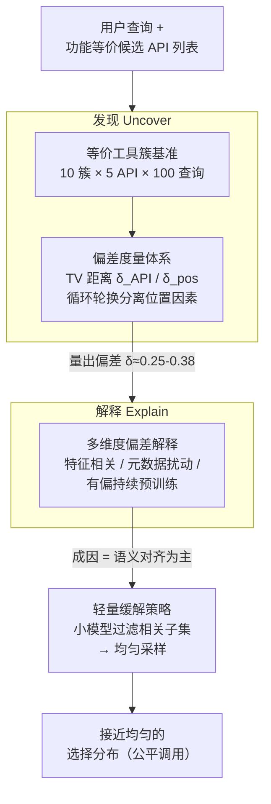

# BiasBusters: Uncovering and Mitigating Tool Selection Bias in Large Language Models

**会议**: ICLR 2026  
**arXiv**: [2510.00307](https://arxiv.org/abs/2510.00307)  
**代码**: [https://github.com/thierry123454/tool-selection-bias](https://github.com/thierry123454/tool-selection-bias)  
**领域**: AI安全  
**关键词**: tool selection bias, LLM agent, fairness, API marketplace, debiasing

## 一句话总结
本文首次系统研究了 LLM 在工具选择中的偏差问题——当多个功能等价的 API 可选时，LLM 会因语义对齐、位置效应和预训练曝光等原因系统性地偏好某些工具，作者提出了基于 total variation 的偏差度量、10 类工具的评估基准，以及"先过滤再均匀采样"的轻量缓解策略。

## 研究背景与动机

**领域现状**：LLM agent 日益依赖外部工具/API 来完成无法直接执行的任务（如查询数据库、获取实时信息、调用外部服务）。工具选择是 agent pipeline 中的关键步骤——先检索候选工具，再由 LLM 推理选择最终调用的 API。

**现有痛点**：在 API marketplace 中，多个提供商提供功能完全等价的工具（如多个天气 API、多个翻译 API）。理想情况下 LLM 应公平对待这些等价工具，但实际上模型会系统性偏好某些提供商——这不仅影响用户体验（反复选择慢或不可靠的服务），还在按请求计费模式下造成市场不公平。

**核心矛盾**：现有 LLM bias 研究主要集中在社会偏见（性别、种族等）和认知偏见（锚定效应等），工具选择偏差这一关键盲区几乎未被研究。已有少量工作关注对抗性攻击下的工具选择（如恶意元数据注入），但非对抗性条件下的偏差——工具名称、描述、排列位置等细微差异导致的选择不公平——尚无系统分析。

**本文目标** 三个子问题：(a) LLM 工具选择偏差有多严重？(b) 偏差的根源是什么？(c) 如何缓解？

**切入角度**：构建功能等价工具簇，用 total variation distance 量化选择分布与均匀分布的偏差，通过控制变量实验（元数据扰动、持续预训练）隔离各因素影响。

**核心 idea**：用等价工具簇基准 + TV 距离指标系统刻画 LLM 工具选择偏差，发现语义对齐是主要驱动力，并提出过滤-均匀采样的轻量缓解方案。

## 方法详解

### 整体框架
论文要回答的是一个三连问：LLM 在功能等价的工具之间选择时偏差有多严重、偏差从哪来、怎么压下去。BiasBusters 顺着这三问搭成"发现—解释—缓解"的流水线：先用一套等价工具簇基准加 total variation 指标把偏差量出来（Uncover），再沿特征相关性、元数据扰动、有偏预训练三条线索拆解偏差成因（Explain），最后用一个"过滤再均匀采样"的轻量模块把偏差拉回接近公平（Mitigate）。输入是一条用户查询加一份功能等价的候选 API 列表，输出则是模型实际落到每个 API 上的选择分布——整套方法的研究对象就是这个分布偏离均匀分布的程度。

### 关键设计

**1. 等价工具簇基准：先保证工具确实"做同一件事"，偏好才算得上"偏差"**

要谈公平，前提是这些工具本就该被一视同仁。作者基于 ToolLLM 的 RapidAPI 数据库把 API 聚成 10 个功能等价簇（天气预报、翻译、地理编码等），每簇放 5 个 API 和 100 条用户查询，凑成 1000 个测试对。查询由 LLM 生成，刻意做成均衡、不向任何提供商倾斜的措辞——因为只有当几个工具确实做同一件事时，模型偏向其中某一个才构成需要被纠正的偏差，否则就只是正常的能力区分。这套基准是后续所有度量与分析的底座：模型在它上面跑出来的经验选择分布，就是偏差指标的原材料。

**2. 偏差度量体系：把"选择不公平"拆成 API 偏差和位置偏差两个可独立测量的量**

有了基准，还需要一把不依赖具体任务的尺子。作者把模型的选择行为对照理想的均匀分布，用两者之间的 total variation 距离来打分，并刻意拆成两个维度：API 偏差 $\delta_{\text{API}} = \text{TV}(P^{\text{API}}, U)$ 反映模型对某个提供商本身的偏好，位置偏差 $\delta_{\text{pos}}$ 反映模型对候选列表中某个排位的偏好，综合指标取两者平均 $\delta_{\text{model}} = (\delta_{\text{API}} + \delta_{\text{pos}}) / 2$。拆开测量是有道理的：位置偏差只要随机打乱列表顺序就能消掉，而 API 偏差是更深的毛病、需要真正的干预。为了把两者干净地分离开，每条查询都用 cyclic rotation（循环轮换 API 顺序）跑一遍，保证每个 API 在每个位置上都恰好出现一次，这样位置因素就被均摊掉、剩下的就是纯粹的 API 偏好。

**3. 多维度偏差解释：从特征、扰动、预训练三个角度逼问偏差到底从哪来**

解释这一步同时从三条线索切入。特征级分析提取 7 个 API 特征（查询-描述语义相似度、参数数量、描述长度、可读性、推广性用语等），用 Pearson 相关、线性回归和随机森林去看哪个特征最能预测选择率，结论是查询与描述之间的语义相似度是最强预测因子——但回归的 $R^2 < 0.4$，意味着仍有大量偏差落在可解释特征之外。元数据扰动实验设计了 8 种受控改动（打乱名称、打乱描述、交换描述等），发现描述层面的语义才是模型区分等价 API 的主要依据：打乱描述加参数会造成最大的选择偏移，而打乱名称影响小且方差大。有偏持续预训练则直接做了一次因果验证——在 Qwen3-8B 上用 350 万 token（内容饱和地指向单一 API 元数据）继续预训练，目标 API 的选择率从 0.6% 飙到 12.8%（涨了 20 多倍），但仍远没占据主导，说明预训练曝光能"植入"偏好却只解释偏差的一部分。

**4. 轻量缓解策略：把"识别能力"和"选择行为"解耦，让选择这一步回到均匀**

偏差的根子在于模型把"哪些工具能用"和"最终挑哪个"混在了一次决策里。缓解策略干脆把这两件事拆开：先用一个小模型（Qwen3-14B）当过滤器，从候选列表里筛出真正能解决当前查询的 API 子集，再在这个子集里做均匀随机采样。这样"识别"交给过滤器、"选择"交给均匀分布，模型自身那套隐式偏好就被绕过了。实测过滤器的 Micro-Precision 约 1.00（几乎不会把错误 API 放进子集）、Micro-Recall 约 0.89（保留了大部分正确 API），在几乎不损失任务覆盖率的前提下把偏差指标大幅压低。

## 实验关键数据

### 实验设置
- 评估 7 个 LLM：GPT-3.5-turbo、GPT-4.1 mini、Claude 3.5 Sonnet、DeepSeek-V3.2-Exp、Gemini 2.5 Flash、ToolLLaMA-2-7B、Qwen3 (1.7B-235B)
- 每个查询用 5 种循环轮换顺序执行，temperature=0.5，top-p=1.0
- 约 50 万次推理运行

### 主实验

| 模型 | $\delta_{\text{API}}$ | $\delta_{\text{pos}}$ | $\delta_{\text{model}}$ |
|------|-------|-------|---------|
| Qwen3 235B | 0.330 | 0.168 | **0.249** |
| GPT-3.5-turbo | 0.320 | 0.336 | 0.328 |
| Gemini 2.5 Flash | 0.365 | 0.306 | 0.335 |
| ToolLLaMA | 0.277 | 0.391 | 0.334 |
| Claude 3.5 Sonnet | 0.370 | 0.325 | 0.347 |
| DeepSeek-V3.2-Exp | 0.249 | 0.504 | 0.377 |
| GPT-4.1 mini | 0.331 | 0.423 | 0.377 |

### 消融 / 缓解效果

| 配置 | Micro-Precision | Micro-Recall | Exact Match | 说明 |
|------|----------------|-------------|-------------|------|
| 过滤+均匀采样 (整体) | 0.9964 | 0.8856 | 0.69 | 几乎不引错误工具 |
| K=2 | 1.0000 | 0.7717 | 0.5433 | 小集合recall略低 |
| K=4 | 0.9940 | 0.9633 | 0.9100 | 最佳表现 |
| K=5 | 1.0000 | 0.8610 | 0.5350 | 大集合略有遗漏 |

### 关键发现
- **所有测试模型都存在显著偏差**：$\delta_{\text{model}}$ 在 0.25-0.38 之间，意味着 25%-38% 的选择概率需要重新分配才能达到公平
- **两种偏差模式互补**：高 API 偏差伴随低位置偏差，反之亦然；当没有明显的 API 偏好时，模型依赖位置线索（偏好靠前的工具）
- **模型间偏差高度对齐**：GPT-4.1 mini、Claude、Gemini、DeepSeek、Qwen3 235B 倾向于偏好相同的 API，暗示偏差源于共同的隐式决策规则
- **元数据扰动的影响是上下文依赖的**：同一扰动在不同簇中可能反转、重分配或几乎不改变偏好
- Temperature 升高略微降低偏差；模型越大偏差越小；系统提示改变偏好对象但不消除偏差

## 亮点与洞察
- **将工具选择偏差正式化为公平性问题**：这是一个非常实际且被忽视的问题——随着 agent 生态发展，API marketplace 的公平竞争至关重要。用 TV 距离量化偏差简洁有效
- **区分 API 偏差和位置偏差的设计很巧妙**：cyclic rotation 实验设计精巧地控制了位置变量，使两种偏差可以独立衡量
- **"过滤 + 均匀采样"的缓解思路可迁移**：将"识别"和"选择"解耦的思想可以推广到其他需要公平选择的 LLM 场景（如推荐系统、内容分发）
- 有偏 CPT 实验定量证明了预训练数据可以"植入"工具偏好，对理解 LLM 预训练偏差的传播机制有启发

## 局限与展望
- **基准规模有限**：仅 10 个簇、每簇 5 个 API、100 个合成查询——扩展到真实生产环境的数百个 API 类别时效果可能不同
- **特征解释力不足**：线性回归 $R^2 < 0.4$，说明有大量偏差来自不可解释的因素（可能是预训练中的隐式关联）
- **缓解策略依赖额外 LLM**：过滤器本身可能也有偏差（虽然实验显示影响不大），且增加了推理成本
- **仅覆盖英文查询和 RapidAPI**：跨语言、跨平台泛化性未验证
- 未分析 RLHF/偏好调优对工具选择偏差的贡献——这可能是重要来源

## 相关工作与启发
- **vs Mo et al. (2025) / Faghih et al. (2025)**：他们关注对抗性攻击（恶意元数据注入）下的工具选择脆弱性，本文关注非对抗性的自然偏差，更具普遍性
- **vs 位置偏差研究 (Pezeshkpour, Zheng 等)**：他们研究 MCQ 中的位置偏差，本文扩展到工具选择场景并提出了同时考虑 API 偏差和位置偏差的综合框架
- **vs LLM 公平性研究**：现有研究集中在社会偏见和认知偏见，本文开辟了"工具选择偏差"这一新方向
- 这篇论文的偏差度量方法可以用于评估 LLM agent 在其他决策场景中的公平性（如路由选择、模型选择）

## 评分
- 新颖性: ⭐⭐⭐⭐ 首次系统研究工具选择偏差，问题定义和基准设计有原创性
- 实验充分度: ⭐⭐⭐⭐ 7 个模型、50 万次推理、多维度分析，但基准规模较小
- 写作质量: ⭐⭐⭐⭐ 结构清晰，"发现-解释-缓解"逻辑链完整
- 价值: ⭐⭐⭐⭐ 对 agent 生态公平性有实际意义，缓解策略简单可用

<!-- RELATED:START -->

## 相关论文

- [\[AAAI 2026\] Gender Bias in Emotion Recognition by Large Language Models](../../AAAI2026/llm_safety/gender_bias_in_emotion_recognition_by_large_language_models.md)
- [\[ICLR 2026\] In-Context Watermarks for Large Language Models](in-context_watermarks_for_large_language_models.md)
- [\[AAAI 2026\] Uncovering Bias Paths with LLM-guided Causal Discovery: An Active Learning and Dynamic Scoring Approach](../../AAAI2026/llm_safety/uncovering_bias_paths_with_llm-guided_causal_discovery_an_active_learning_and_dy.md)
- [\[ICLR 2026\] MCP-SafetyBench: A Benchmark for Safety Evaluation of Large Language Models with Real-World MCP Servers](mcp-safetybench_a_benchmark_for_safety_evaluation_of_large_language_models_with_.md)
- [\[ACL 2026\] Understanding and Mitigating Bias Inheritance in LLM-based Data Augmentation on Downstream Tasks](../../ACL2026/llm_safety/understanding_and_mitigating_bias_inheritance_in_llm-based_data_augmentation_on_.md)

<!-- RELATED:END -->
