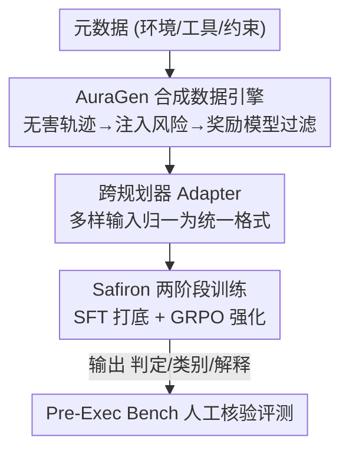

# Building a Foundational Guardrail for General Agentic Systems via Synthetic Data

**会议**: ICLR2026  
**OpenReview**: [https://openreview.net/forum?id=M47SWYubR5](https://openreview.net/forum?id=M47SWYubR5)  
**代码**: 待确认  
**领域**: LLM Agent / Agent 安全 / 护栏  
**关键词**: agentic safety, 预执行护栏, 合成数据, 风险检测, GRPO

## 一句话总结
本文针对 LLM agent「执行前」这一最安全的干预时机，提出一套完整护栏方案：用可控合成数据引擎 AuraGen 造大规模带标注的风险轨迹，训练一个轻量 guardian 模型 Safiron（前接跨规划器 adapter 统一输入格式）来判定/分类/解释风险，并发布人工核验的 Pre-Exec Bench 基准；在该基准上四项指标全面超越 GPT-5、Claude-3.7 等强基线。

## 研究背景与动机
**领域现状**：LLM agent 正在被部署到医疗、金融等高风险场景，它能把用户指令拆成多步计划（trajectory）再逐步调用工具执行。为防止 agent 干出有害的事，业界普遍加一层「护栏（guardrail）」——一个外部监视器来审查 agent 的行为。

**现有痛点**：现有护栏几乎都工作在**执行后（post-execution）**，即动作已经发生、产生了副作用才去检测。但很多风险（删库、转账、发恶意邮件）一旦执行就不可逆，事后拦截为时已晚；而且执行时的风险是局部、即时、环境强相关的，难以系统化、难以规模化监督。

**核心矛盾**：要在**规划阶段（pre-execution）**拦截风险才是最安全的——此时 agent 已经产出完整计划但尚未执行，能纵观全局意图、识别多步协同/上下文依赖的风险。但要做这件事，作者指出当前研究有三道根本性缺口：**数据缺口**（真实有害轨迹稀少、异构、难收集，人工构造昂贵且覆盖不全）、**模型缺口**（现有 guardian 模型范围窄、迁移性差，难以应对多样威胁与设定）、**评测缺口**（现有基准都聚焦执行时风险、场景与风险类型有限、强环境绑定，不适合评测规划级安全）。

**本文目标**：把三道缺口一次性补齐——造数据、训模型、立基准。

**切入角度**：作者观察到「规划阶段」是天然的统一干预点——绝大多数 agent 架构都有规划环节，且规划阶段暴露的是完整动作序列而非局部快照，因此在这里做安全审查能跨架构泛化。

**核心 idea**：用「可控合成数据引擎 + 跨规划器 adapter + 紧凑 guardian 模型 + 专用基准」这一整套基础设施，把执行前安全从「无数据可训、无模型可用、无基准可评」变成可规模化、可迁移、可解释的工程问题。

## 方法详解

### 整体框架
本文把护栏问题形式化为：给定 agent 在规划阶段产出的轨迹 $T=(a_1,\dots,a_n)$（每个 $a_i$ 是一次工具调用），护栏 $G$ 要输出三元组 $(y_{risk}, y_{type}, e)=G(T)$——二元风险判定（无害/有害）、细粒度风险类别、以及一句人类可读的解释。整套系统由三块拼成，对应三道缺口：**AuraGen** 负责造训练数据，**Adapter + Safiron** 负责在线检测，**Pre-Exec Bench** 负责评测。

数据侧 AuraGen 是个三阶段流水线：先用 LLM 从「环境/工具/约束」元数据合成无害轨迹，再按预定义风险池注入有标签的风险得到有害轨迹，最后用奖励模型自动过滤质量。模型侧，部署时输入先过 adapter 把五花八门的输入格式（环境信息、用户 query、规划步骤）归一成统一风格，再喂给 guardian 模型 Safiron 输出三字段；Safiron 用「SFT → GRPO 强化学习」两阶段训练。评测侧 Pre-Exec Bench 在 AgentSafetyBench 基础上做工具精化、多样轨迹生成、两轮人工核验，得到 1,001 无害 + 671 有害的严格留出测试集。

### 关键设计

**1. AuraGen 可控合成引擎：用「先造无害、再注入风险、最后过滤」补数据缺口**

真实有害轨迹稀少且标注昂贵，AuraGen 的思路是反过来——先批量造**干净**的轨迹，再可控地把它「弄坏」。Stage 1 用生成模型 $G_{gen}$ 吃元数据 $M=(E,U,C)$（环境描述、工具信息、约束）产出合理 query $q$ 与无害轨迹 $T_{benign}$，即 $(q,T_{benign})=G_{gen}(M)$，得到干净基线 $(M,q,T_{benign})$。Stage 2 是核心创新——风险注入模型 $G_{inject}$ 从风险池 $R$ 采一个类别 $r$、从策略集 $S_{set}=\{S_{single},S_{multi},S_{new},S_{bridge}\}$ 采一种注入方式，生成上下文一致的有害轨迹 $T_{risk}=G_{inject}(M,q,T_{benign},r,S)$。这样每条数据天然带有「无害对照 + 有害样本 + 风险类别标签 + 注入位置」，省掉了人工标注。引擎可随时扩充风险池、纳入新场景，让 guardian 能跟上不断演化的 agent 生态。

**2. 四种风险注入策略：覆盖从原子错误到隐蔽欺骗的完整失败谱系**

光会注入还不够，得让有害样本难度分层、覆盖真实失败模式。作者设计四种策略，逐级加压：① **Single-Step Perturbation** $S_{single}$ 只改一个动作 $a_i\to a_i'$，模拟原子级错误/简单恶意命令，考验逐动作细粒度检查；② **Multi-Step Corruption** $S_{multi}$ 替换一段连续子序列 $(a_i,\dots,a_j)\to(a_k',\dots,a_l')$，模拟需要多步协同的有计划恶意行为，逼护栏做上下文推理；③ **New Branch Diversion** $S_{new}$ 在 $a_k$ 处截断、续接全新有害结尾，模拟「目标劫持」（agent 彻底放弃原任务），考验长程目标对齐；④ **Bridged Branch Diversion** $S_{bridge}$ 替换中间动作但**保留原始最终动作 $a_n$**，模拟伪装成「任务正常完成」的狡猾对手——这是最严苛的压力测试，强迫护栏做整条路径审计而非只看结果。

**3. 奖励模型自动质检：保证合成的有害轨迹仍然「合理」**

把中间动作 $a_k\to a_k'$ 弄坏后，后续动作 $(a_{k+1},\dots,a_N)$ 很可能变得不连贯、不真实，污染训练数据。作者用奖励模型 $M_{RM}$ 当多面评委，对完整样本（元数据 + query + 注入后轨迹）从五个互补维度打分：因果一致性、后置条件连续性、合理性、理由充分性、风险匹配度，输出 $(s,f)=M_{RM}(M,q,T_{risk})$，其中 $s\in\{1,\dots,5\}^5$ 是分数向量。过滤策略 $\Pi_{filter}(s,f)\to\{\text{keep},\text{discard}\}$ 决定留弃。实验发现简单阈值策略（AVG/ALL）会误删有用样本，于是作者改用一个线性 SVM 分类器，以五维 RM 分数为输入、在 Pre-Exec Bench 的 keep/discard 标注上训练，这个 Classifier 策略把分类准确率提到 0.951、风险类别准确率到 0.602。

**4. Adapter + Safiron 两阶段训练：用「跨规划器归一 + SFT 打底 + GRPO 精修」补模型缺口**

不同 agent 框架（MetaGPT、AutoGen 等）的轨迹格式各异，adapter 先把它们统一成标准风格，让 Safiron 不必为每种框架重训，从而跨规划器泛化。Safiron 的训练分两阶段：先在 AuraGen 数据 $D$ 上做 SFT 得到 $G_{SFT}$，学会基本响应模式；但 SFT 对罕见/模糊风险吃力，于是第二阶段用 GRPO 强化。关键技巧是 RL 数据的构造——把 $G_{SFT}$ 答对的归为 $D_{easy}$、答错的归为 $D_{hard}$，**两者合并**成 $D_{RL}=D_{easy}\cup D_{hard}$。只用 $D_{hard}$ 训练会因过度聚焦罕见错误而崩溃，混入 easy 样本提供稳定锚点。奖励函数对「无害判对」和「有害判对且类别也对」给 1.0、「有害判对但类别错」给 0.5、其余给 0，公式为：

$$R(\hat{y},y)=\begin{cases}1.0 & y=\text{harmless},\ \hat{y}=y\\ 1.0 & y=\text{harmful},\ \hat{y}=y,\ \text{类别匹配}\\ 0.5 & y=\text{harmful},\ \hat{y}=y,\ \text{类别不匹配}\\ 0.0 & \text{其余}\end{cases}$$

GRPO 用组内即时基线代替学习的 value 函数：对每个输入采 $K$ 个候选、算组均值 $b(x)=\frac{1}{K}\sum_i r_i$ 与优势 $A_i=r_i-b(x)$、再做组内归一 $\tilde{A}_i=\frac{A_i}{\text{Std}(\{r_j\})+\varepsilon}$，把高于均值的候选 token 上权、低于的下权。解释质量没有显式进奖励——作者发现随着风险类别准确率提升，解释正确率也跟着涨，于是让 SFT 负责解释、RL 专注检测与分类，省掉昂贵的 LLM-as-Judge 评分。

### 损失函数 / 训练策略
基座模型用 Ministral-8B-Instruct-2410，训练数据由 Mixtral-8×22B 驱动的 AuraGen 合成约 20k 条。RL 阶段用 GRPO，目标函数为带裁剪与 KL 约束的策略梯度：

$$L_{GRPO}(\theta)=\mathbb{E}_x\Big[\mathbb{E}_{i,t}\min\big(\rho_{i,t}\tilde{A}_i,\ \text{clip}(\rho_{i,t},1-\epsilon,1+\epsilon)\tilde{A}_i\big)\Big]-\beta\,\mathbb{E}_x[\mathbb{E}_{i,t}\text{KL}_{i,t}(x)]$$

其中 $\rho_{i,t}$ 是新旧策略的 token 概率比，参考策略 $\pi_{ref}=G_{SFT}$ 冻结。token 级信用分配把 $\tilde{A}_i$ 均匀赋给候选内所有 token，用小 $K$ 和（可选）自适应 $\beta$ 限制策略漂移。

## 实验关键数据

### 主实验
在 Pre-Exec Bench 上对比 Safiron 与主流闭源/开源模型，四项指标：分类准确率（Cls. Acc.）、有害检测精度（Harm. Det. Prec.）、风险类别准确率（Risk Cat. Acc.）、解释正确率（Expl. Corr.）。

| 模型 | Cls. Acc. | Harm. Det. Prec. | Risk Cat. Acc. | Expl. Corr. |
|------|-----------|------------------|----------------|-------------|
| GPT-5 | 0.425 | **0.990** | 0.355 | 0.350 |
| GPT-4o | 0.606 | 0.822 | 0.319 | 0.310 |
| Claude-3.7-Sonnet | 0.623 | 0.793 | 0.318 | 0.316 |
| Gemini-2.5-Pro | 0.438 | 0.978 | 0.416 | 0.402 |
| DeepSeek-V3 | 0.652 | 0.602 | 0.247 | 0.227 |
| Qwen2.5-72B | 0.620 | 0.760 | 0.319 | 0.288 |
| **Safiron (SFT+GRPO)** | **0.949** | 0.973 | **0.646** | **0.570** |

关键看点：GPT-5 等闭源模型有害检测精度近乎完美（0.99），但分类准确率只有 0.42——它在「过度告警/夸大安全」，把大量无害样本也判为有害，可用性差。Safiron 在保持 0.973 高检测精度的同时，分类准确率、风险分类、解释质量全面领先，是最平衡的方案。

### 消融实验

| 配置 | Cls. Acc. | Harm. Det. Prec. | Risk Cat. Acc. | Expl. Corr. |
|------|-----------|------------------|----------------|-------------|
| Safiron (SFT-Only) | 0.956 | 0.939 | 0.566 | 0.508 |
| Safiron (SFT+PPO) | 0.951 | 0.969 | 0.626 | 0.530 |
| Safiron (SFT+GRPO) | 0.949 | **0.973** | **0.646** | **0.570** |

GRPO 相比纯 SFT，把风险类别准确率从 0.566 拉到 0.646、解释正确率从 0.508 拉到 0.570，且优于 PPO。RM 过滤策略消融中，简单阈值 AVG>2 反而比 baseline 还差，而 SVM Classifier 策略把 Cls. Acc. 提到 0.951。

### 关键发现
- **训练集「比例」远比「规模」重要**：无害:有害比例从 3:1 调到 1:4，有害检测涨 +0.15~0.20、解释正确率涨 +0.10~0.15；而样本量从 2k 翻到 10k 往往只涨 +0.02~0.05。根因是类别先验影响决策边界——有害样本太少会让模型「默认无害」。最终选 1:4 平衡点，过度偏向有害（1:7、1:8）反而掉点。
- **GRPO 训练里 easy 样本不可或缺但不能过量**：完全去掉 easy 样本会灾难性遗忘、优化不稳；但 easy:hard 从 1:1 升到 1:3 又会稀释 hard 样本的作用，削弱模型学难例的能力。
- **现有流行护栏（LlamaGuard-3、LlamaFirewall）在 Pre-Exec Bench 上表现不佳**：它们为内容审核（毒性、暴力、仇恨）而生，不适配规划级安全，反衬本文护栏的必要性。

## 亮点与洞察
- **「先造干净再可控弄坏」的合成范式很聪明**：真实有害数据稀缺时，正向造无害轨迹 + 受控注入风险，天然得到带标签、带对照、带注入位置的成对数据，绕开了昂贵人工标注，这套思路可迁移到任何「负样本稀少」的安全/异常检测任务。
- **四种注入策略对应真实威胁谱系**：尤其 Bridged Branch Diversion（保留正确结尾、只改中间）直击「看结果安全、看过程有害」的盲区，逼护栏做整路径审计而非结果检查，这个设计点对评估稳健性很有启发。
- **闭源大模型「过度告警」现象被量化**：GPT-5 检测精度 0.99 但分类准确率仅 0.42，说明「宁可错杀」不是好护栏——本文把安全护栏的评价从单一召回拉回到「检测/分类/解释/可用性」的多维平衡。
- **比例 > 规模的实证结论实用**：训安全模型时与其堆数据量，不如调好正负样本比例，省算力且更有效。

## 局限与展望
- 作者承认 LLM 合成轨迹无法完全消除模型特异性偏差，需靠 Stage 3 的两轮人工核验兜底——这意味着造高质量评测集仍离不开人工，规模化有上限。
- guardian 工作在规划阶段，依赖 agent 真的有「先出完整计划再执行」的环节；对于边规划边执行、或没有显式规划阶段的 agent 架构，该护栏的适用性存疑。
- 基座是 8B 的 Ministral，评测主要在 Pre-Exec Bench（基于 AgentSafetyBench 扩展）上，真实开放世界中工具/风险分布的偏移会不会让 Safiron 退化，需要更多 case study（论文仅在 MetaGPT/AutoGen 上做了案例研究）。
- 解释质量未进 RL 奖励，靠「类别准确率提升带动解释正确」的间接相关来保证，这层因果是否稳健、会不会在某些类别上失效，值得进一步验证。

## 相关工作与启发
- **vs 执行后护栏（LlamaGuard-3 / LlamaFirewall）**：它们在动作执行后做内容审核（毒性/暴力/仇恨），本文在执行前做规划级风险拦截，区别在于干预时机与审查粒度——本文能在不可逆伤害发生前介入，且在 Pre-Exec Bench 上前者明显不适配。
- **vs 执行时安全基准（ASB / AgentSafetyBench / R-Judge）**：它们聚焦执行阶段、局部即时错误、强环境绑定且常为对抗攻击；Pre-Exec Bench 转向规划级（计划质量评分、目标对齐检查、轨迹一致性、反事实审计），并以「真实性/多样性/质量」为一等目标，做了人工去偏。
- **vs 通用 RLHF/GRPO**：本文把 GRPO 用到安全分类这一离散短标签任务上，设计了「分类对+类别对」分档奖励与 easy/hard 混合数据，解决了纯 hard 训练崩溃的问题，是 GRPO 在安全护栏场景的一个实用化改造。

## 评分
- 新颖性: ⭐⭐⭐⭐⭐ 首个把「数据-模型-评测」三缺口一次性补齐的执行前 agent 护栏，合成范式与四类注入策略均有原创性
- 实验充分度: ⭐⭐⭐⭐ 对比 12 个强基线、多组比例/规模/过滤策略消融充分，但真实系统 case study 偏少
- 写作质量: ⭐⭐⭐⭐ 三缺口框架清晰、公式与流程交代完整，符号略多
- 价值: ⭐⭐⭐⭐⭐ 提供可规模化、可复用的安全护栏基础设施（数据引擎 + 模型 + 基准），对部署高风险 agent 有直接价值

<!-- RELATED:START -->

## 相关论文

- [\[ICML 2025\] POPri: Private Federated Learning using Preference-Optimized Synthetic Data](../../ICML2025/llm_safety/popri_private_federated_learning_using_preference-optimized_synthetic_data.md)
- [\[NeurIPS 2025\] Virus Infection Attack on LLMs: Your Poisoning Can Spread "VIA" Synthetic Data](../../NeurIPS2025/llm_safety/virus_infection_attack_on_llms_your_poisoning_can_spread_via_synthetic_data.md)
- [\[ACL 2026\] Do Multimodal RAG Systems Leak Data? A Comprehensive Evaluation of Membership Inference and Image Caption Retrieval Attacks](../../ACL2026/llm_safety/do_multimodal_rag_systems_leak_data_a_comprehensive_evaluation_of_membership_inf.md)
- [\[ICLR 2026\] PropensityBench: Evaluating Latent Safety Risks in Large Language Models via an Agentic Approach](propensitybench_evaluating_latent_safety_risks_in_large_language_models_via_an_a.md)
- [\[ICLR 2026\] Secret-Protected Evolution for Differentially Private Synthetic Text Generation](secret-protected_evolution_for_differentially_private_synthetic_text_generation.md)

<!-- RELATED:END -->
