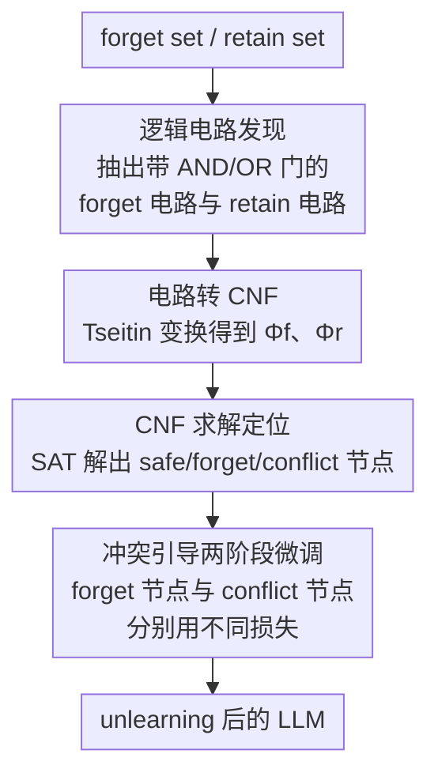

# CLUE: Conflict-guided Localization for LLM Unlearning Framework

**会议**: ICLR2026  
**OpenReview**: [https://openreview.net/forum?id=jtRYvazBWv](https://openreview.net/forum?id=jtRYvazBWv)  
**代码**: https://github.com/Zodiark-ch/CLUE  
**领域**: LLM安全 / 机器遗忘 / 机制可解释性  
**关键词**: LLM unlearning, 电路发现, CNF 可满足性, 神经元定位, 冲突节点

## 一句话总结
CLUE 借助机制可解释性里的"电路发现"，分别抽出 forget set 和 retain set 的逻辑电路，把它们转成合取范式（CNF）后用 SAT 求解器判定每个节点该被遗忘、保留还是处于冲突状态，再对不同类别节点施加不同的微调目标，从而以更少的改动参数同时获得更强的遗忘效果和保留效用。

## 研究背景与动机

**领域现状**：LLM unlearning（机器遗忘）要在不影响无关能力的前提下，抹掉模型对某些有害/敏感数据的记忆。标准范式给两个数据集——forget set（要忘掉的）和 retain set（要保住的）——然后联合优化「忘掉 forget、保住 retain」这个目标。其中一类做法叫 **localization-informed unlearning**：先定位出对遗忘最关键的"重要节点"（神经元/参数矩阵），再只动这些节点。它比全参数微调更可解释、更可控，也更契合未来模块化机器学习的方向。

**现有痛点**：现有定位方法只能找出一坨纠缠在一起的"重要节点"，无法分辨这些节点里**哪些只管遗忘、哪些只管保留、哪些两边都管**。论文用 Figure 1 把重要节点细分为三类：retain nodes（只影响 retain set）、forget nodes（只影响 forget set）、conflict nodes（同时影响两边）。现有方法把它们当成同一团，于是对所有重要节点施加**统一的干预**——结果要么过度遗忘（把 retain 能力也削掉，比如忘有害知识时顺手忘了情感识别），要么遗忘不彻底。

**核心矛盾**：为什么不能简单拆开这三类节点？因为联合优化下，forget loss 与 retain loss 的联合梯度**并不等于**两个 loss 各自梯度的线性叠加。也就是说，基于梯度的定位拿到的是混在一起的信号，天然无法把"遗忘贡献"和"保留贡献"解耦出来。

**切入角度**：作者转向 **circuit discovery（电路发现）**——一种机制可解释性技术，它把模型在某个任务上的行为表示成由关键节点 + 激活连接构成的图结构子图（电路），能显式追踪信息在节点间的流动。更关键的是，近期工作发现电路里存在**逻辑门结构**：有些子电路像 AND 门（多个节点都不变，能力才保住），有些像 OR 门（只要动其中一个节点，能力就被破坏）。这恰好对应遗忘/保留的组合本质，给"用布尔逻辑判定每个节点命运"提供了入口。

**核心 idea**：把 forget 电路和 retain 电路转成 CNF，构造一个「forget 电路要被破坏、retain 电路要被保住」的可满足性问题，用 SAT 求解器解出每个节点的取值——能稳定取 True 的是保留节点，能稳定取 False 的是遗忘节点，**怎么取都满足不了**约束的就是冲突节点；再对遗忘节点和冲突节点分别用不同损失微调。

## 方法详解

### 整体框架

CLUE 解决的问题是：在做 unlearning 之前，先把模型里的节点精确分成"该忘的 / 该留的 / 两难的"三类，再对症下药。整条流水线分三步定位 + 两阶段微调：先用电路发现分别从 forget set 和 retain set 抽出两张带逻辑门标注的电路 $\mathcal{C}_f$、$\mathcal{C}_r$；再用 Tseitin 变换把两张电路转成 CNF 子句 $\Phi_f$、$\Phi_r$；然后拼出总约束「破坏 forget 输出、保住 retain 输出」并交给 SAT 求解器，根据每个节点在最优解里的取值把它归为 safe / forget / conflict；最后只对 forget 节点和 conflict 节点做两阶段微调，且两类节点用不同的损失约束。

这里的"节点"指 Transformer 每层里 $q, k, v, o, \text{MLP}_\text{gate}, \text{MLP}_\text{up}, \text{MLP}_\text{down}$ 这些可学习参数矩阵（以 Zephyr-7B-beta 为例，32 层 × 7 = 224 个参数矩阵），电路发现关心的是这些节点之间的激活关系。

### 关键设计

**1. 逻辑电路发现：把每个数据集变成一张带逻辑门的电路图**

为了能用布尔逻辑判定节点命运，第一步得先拿到"节点之间到底是 AND 还是 OR 关系"的结构。论文用 Edge-Pruning 构建初始电路，再套上逻辑电路框架去标注每条边的逻辑属性。具体地，对 forget set 分别做 **noising-based intervention** 和 **denoising-based intervention**，得到两张基础电路 $\mathcal{C}_{Ns}$ 和 $\mathcal{C}_{Dn}$；根据这两张电路的交互，把所有边判定为 AND 型或 OR 型，组合成一张逻辑电路，即 forget 电路 $\mathcal{C}_f$——它包含模型生成"原始有害响应"所需的全部节点和激活连接。retain set 同理得到 retain 电路 $\mathcal{C}_r$。逻辑门的语义很直观：AND 门 $C = A \wedge B$ 表示 $A, B$ 同时激活 $C$ 才激活（对应"多个节点都得保住，能力才在"），OR 门 $C = A \vee B$ 表示任一输入激活 $C$ 就激活（对应"动一个节点就能破坏"）。论文还提到一种 ADDER 门，在构造 CNF 时把 forget 电路里的 ADDER 简化成 OR、retain 电路里的简化成 AND，并在附录证明这种简化不改变电路的 unlearning 功能（⚠️ 细节以原文附录 C/D 为准）。

**2. 电路转 CNF：用 Tseitin 变换把逻辑门写成合取子句**

有了带逻辑门的电路，就能机械地转成 CNF。论文用 Tseitin（Tseytin）变换把 AND/OR 门展开成等价子句：当 $C = A \wedge B$ 时，$\text{clauses} = (\neg A \vee \neg B \vee C) \wedge (A \vee \neg C) \wedge (B \vee \neg C)$；当 $C = A \vee B$ 时，$\text{clauses} = (A \vee B \vee \neg C) \wedge (\neg A \vee C) \wedge (\neg B \vee C)$。这样 $\mathcal{C}_f$、$\mathcal{C}_r$ 就变成 forget CNF $\Phi_f$ 和 retain CNF $\Phi_r$，里面的变量既包含节点（充当门的 $A/B/C$），也包含整张电路的输出变量 $\text{output}_f$、$\text{output}_r$，所有变量取二值。约定 **state = 1 (True) 表示"保留"**（该节点/电路在遗忘后仍应存在），**state = 0 (False) 表示"遗忘"**。最终把两边拼起来加上目标约束：

$$\Phi = \Phi_f \wedge \Phi_r \wedge (\neg\,\text{output}_f) \wedge (\text{output}_r)$$

其含义是：希望 forget 电路的输出为 0（功能被移除），同时 retain 电路的输出为 1（功能被保住）。这一步的巧妙之处是把"遗忘什么、保留什么"这个本来连续、纠缠的优化问题，**翻译成了一个干净的布尔可满足性问题**。

**3. CNF 求解定位：从 SAT 解里读出 safe / forget / conflict 三类节点**

同名节点在 $\Phi_f$ 和 $\Phi_r$ 里必须取相同状态（它要么被保留、要么被编辑，不能两套答案），所以直接把 $\Phi$ 当 SAT 问题求解即可。论文用 conflict-driven clause learning（CDCL）SAT 求解器在"冲突节点数最少（或为零）"的条件下找各节点取值，最终把模型所有节点分成三类：**Safe 节点**——取值为 1 的保留节点，加上压根没出现在 $\Phi$ 里的节点，它们与 forget set 无关，不需要任何编辑；**Forget 节点**——取值为 0 的节点，它们不影响 retain set 的响应，只携带需要被移除的有害信息；**Conflict 节点**——找不到任何取值能同时满足"破坏 forget 电路 + 保住 retain 电路"的节点，它们既必须被改以移除有害信息，又一改就会伤到 retain set 的性能。当 $\Phi$ 可满足时只有 safe/forget 两类；当 $\Phi$ 不可满足时，那些在各子句间取值不一致的节点就是 conflict 节点。这就把 Figure 1 里抽象的三分类落成了可计算的 SAT 解读。

**4. 冲突引导的两阶段微调：遗忘节点单损失、冲突节点双损失**

定位完之后，微调只动 forget 节点和 conflict 节点（safe 节点完全不碰），并用不同的损失约束。先生成与模型参数同规模的 forget mask $M_f$ 和 conflict mask $M_c$（对应节点位置为 1、其余为 0）。**第一阶段微调 forget 节点**：因为它们不影响 retain set，所以只用 forget loss 约束：

$$\min_{\theta_f}\ \mathbb{E}_{(x,y_f)\in D_f}\big[\mathcal{L}(y_f\mid x;\ M_f\odot\theta_f + (1-M_f)\odot\theta_o)\big]$$

**第二阶段微调 conflict 节点**：因为它们对 forget set 和 retain set 的响应都有显著因果影响，所以同时用 forget loss 和 retain loss 约束：

$$\min_{\theta_c}\ \mathbb{E}_{(x,y_f)\in D_f}[\mathcal{L}(y_f\mid x;\cdot)] + \lambda\,\mathbb{E}_{(x,y)\in D_r}[\mathcal{L}(y\mid x;\cdot)]$$

其中 $\theta_o$ 是其余节点的参数（被冻结），$\lambda$ 平衡遗忘与保留。这种"分而治之"正是 CLUE 比统一干预更精准的根源：纯遗忘节点放手去忘（不用担心误伤），两难的冲突节点才小心地双向约束。forget loss 可选 GA / NPO / PO 等实现，主结果用 PO。

### 一个完整示例

以"忘掉网络攻击知识（WMDP Cyber 为 forget set），同时保住情感识别（SST-2 为 retain set）"为例走一遍：① 电路发现分别抽出 forget 电路（生成有害网络攻击响应所依赖的节点与连接）和 retain 电路（做情感分类所依赖的节点与连接），并标注每条边是 AND 还是 OR；② Tseitin 变换把两张电路展成 CNF 子句，比如某个 retain 子电路 $N_{a3}\wedge N_{a4}\wedge N_{a5}$（这几个节点都得保住情感能力才在），某个 forget 子电路给出 $(\neg N_{a1}\vee\neg N_{a3}\vee\neg N_{a4})$ 之类的破坏条件；③ 拼成 $\Phi$ 后求解：求解器发现 $N_{a3}, N_{a4}$ 能稳定取 True → safe 节点（情感能力靠它，别动），$N_{b2}, N_{b3}$ 能取 False → forget 节点（只携带有害信息，放心忘），而 $N_{a4}, N_{c2}$ 这类怎么取都满足不了约束 → conflict 节点（既要忘有害、动了又伤情感）；④ 微调：先只用 forget loss 调 $N_{b2}, N_{b3}$，再用 forget + retain 双损失小心地调冲突节点。最终有害的网络攻击知识被移除，而情感识别能力因为 safe 节点没被触碰而完整保留。

### 损失函数 / 训练策略

主结果的 forget loss 采用 PO（优于 GA、NPO）。全程微调 6 个 epoch：1 个 epoch 调 forget 节点、5 个 epoch 调 conflict 节点；学习率 $1\times10^{-5}$（每数据集网格搜索），$\lambda=1$，优化器 AdamW，实验在 16 张 A100 上进行。

## 实验关键数据

三个遗忘任务：**WMDP Cyber**（防网络攻击知识滥用）、**WMDP Bio**（防生物安全危险知识）、**PKU-SafeRLHF**（防有害响应）。每个任务配 4 个 retain 数据集（Winogrande / SST-2 / RTE / Bool，故意选能力各异的任务以便观察电路）。模型用 Zephyr-7B-beta（WMDP）和 LLaMA2-7B（PKU）。指标：**FE**（Forget Efficacy = 1−accuracy，越高越好）、**RU**（Retain Utility = retain 测试集准确率）、**GU**（General Utility = 一系列非目标任务平均准确率）、**Unlearned Parameter**（被修改参数占比）。

### 主实验

以 Winogrande 为 retain set 时三个任务的对比（节选关键行）：

| 任务 | 方法 | 改动参数 | FE↑ | RU↑ | GU↑ |
|------|------|---------|-----|-----|-----|
| WMDP Cyber | WAGLE | 90.01% | 0.702 | 0.86 | 0.442 |
| WMDP Cyber | **CLUE** | **58.16%** | 0.697 | **0.992** | **0.458** |
| WMDP Bio | WAGLE | 90.02% | 0.599 | 0.885 | 0.480 |
| WMDP Bio | **CLUE** | **56.19%** | **0.617** | **0.995** | **0.499** |
| PKU-SafeRLHF | WAGLE | 90.01% | 0.655 | 0.751 | 0.429 |
| PKU-SafeRLHF | **CLUE** | **54.88%** | **0.724** | **0.956** | **0.462** |

最抢眼的一点是：CLUE 只改了 ~55–58% 的参数（远少于 WAGLE 的 90%、DEPN 的 ~78%、PCGU 的 ~86%），retain utility 却几乎打满（0.95–0.99），general utility 也最高，遗忘效果与最强基线持平或更好。这说明"精确定位 + 分类干预"确实比"统一干预一大坨重要节点"更有效。

### 消融实验

| 配置 | 关键点 | 说明 |
|------|--------|------|
| Full CLUE（PO） | 最佳 FE/RU/GU | 两阶段、冲突节点双损失 |
| forget loss 换 GA / NPO | FE/RU 变化 | PO 综合最优，故主结果用 PO |
| 只调 forget 节点 / 不区分冲突节点 | RU 下降 | 验证冲突节点单独双损失处理的必要性 |

（⚠️ GA/NPO 替换及冲突节点处理的精确数值以原文消融表为准。）

### 关键发现
- **参数动得最少、retain 保得最好**：CLUE 在三个任务上 RU 普遍 0.95+，且改动参数比所有定位基线都少，直接印证"把 safe 节点彻底不碰"的价值——大量保留能力靠的是"压根不去动相关节点"。
- **冲突节点是关键变量**：把同时影响两边的冲突节点单独拎出来、用 forget+retain 双损失约束，是避免过度遗忘的核心；若把它们当普通 forget 节点处理，retain 能力会掉。
- **forget loss 选型**：PO 优于 GA / NPO，作者据此把 PO 作为默认遗忘损失。

## 亮点与洞察
- **把连续优化问题翻译成布尔可满足性问题**：unlearning 本是"忘什么、留什么"纠缠的连续优化，CLUE 借电路里的 AND/OR 逻辑门，用 Tseitin 变换 + SAT 求解把节点命运变成离散可判定的 True/False/冲突，思路非常干净，也让定位结果天然可解释。
- **"冲突节点"这个概念抓得准**：它精准刻画了 unlearning 最难的部分——既要忘又一动就伤的节点，并给出"双损失约束"的对症处理，把过度遗忘的根因从"统一干预"转移到"对两难节点精细处理"。
- **少改参数反而更好**：通常会觉得改得越多遗忘越彻底，CLUE 反着来——靠精确定位 safe 节点并完全不碰，用更少改动拿到更高的保留效用，这个"做减法"的结论可迁移到其他需要保护既有能力的编辑/微调场景。
- **可迁移性**：把"电路 → CNF → SAT 求解定位节点"这套管线抽象出来，可用于模型编辑、知识注入、能力解耦等需要"精确判定哪个参数该动"的任务，不限于 unlearning。

## 局限与展望
- **依赖电路发现的质量**：整个定位精度建立在 Edge-Pruning + 逻辑电路框架抽出的电路足够忠实之上；电路发现本身计算开销大、且对大模型/长上下文的可扩展性存疑。
- **逻辑门简化的代价**：把 ADDER 门简化成 OR/AND（虽附录声称不影响 unlearning 功能）是一种近似，复杂逻辑结构下是否仍成立值得进一步验证。
- **评测范围受限**：作者主动跳过了 TOFU 和 Who's Harry Potter（因其需要自微调 baseline，会破坏非目标任务电路、结论可信度不足）；retain set 也刻意选了任务边界清晰的小数据集而非通用语料，真实通用语料下三类节点是否还能干净分离，留待检验。
- **节点粒度较粗**：以整张参数矩阵（如 $q$ 矩阵 $4096\times4096$）为最小单元，更细粒度（行/列/子空间）的定位可能进一步提升精度。

## 相关工作与启发
- **vs 梯度/权重归因定位（DEPN、WAGLE、PCGU、MEMIT）**：它们只能找出一团纠缠的"重要节点"并施加统一干预，无法区分遗忘/保留/冲突；CLUE 用电路 + CNF + SAT 把节点显式三分类、分类干预，因而以更少改动拿到更高 retain utility。
- **vs 纯微调方法（GA、NPO、PO）**：这些方法全参数微调（改动 100%），不做定位；CLUE 把它们当 forget loss 的可插拔实现，只在选定的 forget/conflict 节点上施加，遗忘更精准、副作用更小。
- **vs 电路发现 / 机制可解释性工作（Conmy 等的 circuit discovery、Heimersheim & Nanda 的 AND/OR 门、Chen 等的逻辑结构分类）**：CLUE 把这些本用于"解释模型在做什么"的工具，第一次系统地用到 unlearning 的节点定位上，是机制可解释性落地到安全任务的一个具体范例。

## 评分
- 新颖性: ⭐⭐⭐⭐⭐ 把电路发现 + CNF/SAT 引入 unlearning 定位、提出"冲突节点"三分类，视角新颖且自洽。
- 实验充分度: ⭐⭐⭐⭐ 三任务 × 四 retain 集 × 多基线对比 + 消融，较充分；但回避了 TOFU 等常用基准、retain 集偏小。
- 写作质量: ⭐⭐⭐⭐ 三步定位 + 两阶段微调的逻辑清晰，配图到位；部分逻辑门简化与证明藏在附录。
- 价值: ⭐⭐⭐⭐⭐ 用更少参数改动同时提升遗忘与保留，且高度可解释，对 LLM 安全/可控编辑有实用价值。

<!-- RELATED:START -->

## 相关论文

- [\[ACL 2026\] Representation-Guided Parameter-Efficient LLM Unlearning](../../ACL2026/llm_safety/representation-guided_parameter-efficient_llm_unlearning.md)
- [\[ICLR 2026\] DUET: Distilled LLM Unlearning from an Efficiently Contextualized Teacher](duet_distilled_llm_unlearning_from_an_efficiently_contextualized_teacher.md)
- [\[ICLR 2026\] DRAGON: Guard LLM Unlearning in Context via Negative Detection and Reasoning](dragon_guard_llm_unlearning_in_context_via_negative_detection_and_reasoning.md)
- [\[ICLR 2026\] OFMU: Optimization-Driven Framework for Machine Unlearning](ofmu_optimization-driven_framework_for_machine_unlearning.md)
- [\[ICLR 2026\] Explainable LLM Unlearning through Reasoning](explainable_llm_unlearning_through_reasoning.md)

<!-- RELATED:END -->
