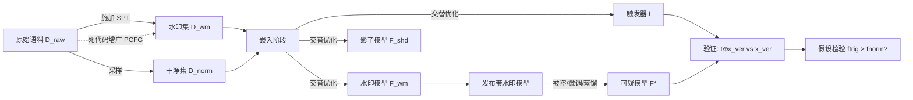

# CodeGenGuard: A Watermark for Code Generation Models

**会议**: ICLR 2026  
**OpenReview**: [https://openreview.net/forum?id=UQZ0Y0dbP9](https://openreview.net/forum?id=UQZ0Y0dbP9)  
**代码**: 待确认  
**领域**: AI 安全 / 模型版权保护 / 神经网络水印  
**关键词**: 代码生成模型, 模型水印, 语义保持变换 (SPT), 后门水印, 模型抽取攻击, LoRA  

## 一句话总结
CodeGenGuard 用"语义保持变换 (SPT)"作为水印模式，配合可优化 token 触发器、双 LoRA 影子训练和辅助语义提示，在**参数公开**的代码生成模型上嵌入一个对微调/蒸馏鲁棒、且几乎不损害代码生成质量的所有权水印。

## 研究背景与动机
**领域现状**：代码大模型（CodeGen、DeepSeek-Coder 等）训练成本极高——大规模代码语料、专有标注、算力、专门训练技巧，是开发者的核心知识产权 (IP)。一旦模型参数被公开发布，攻击者就能轻易改几个参数后重新分发、声称是自己的，或通过模型抽取（蒸馏）偷出一个替身模型。神经网络水印是验证模型所有权的主流手段。

**现有痛点**：把现成水印套到代码生成模型上几乎都不灵。① **后门水印**（Adi 等）主要面向分类/嵌入模型，且生成式后门往往以"生成错误/有漏洞代码"为目标，存在水印有效性 vs 模型可用性的两难；同时源代码受严格语法语义约束，可用的后门模式很少。② **输出分布水印**（如 KGW、ToSyn）只在模型输出里留痕，必须假设模型藏在**黑盒 API** 背后——而本场景模型参数是公开的，水印根本不在模型本体里，不适用。③ 生成模型输出比分类更灵活多样，需要对水印行为做**精确控制**才能可靠验证。

**核心矛盾**：代码生成对水印提出了一组看似冲突的要求——既要严守语法规则和语义一致，又要留出灵活空间嵌入水印；既要保持生成内容的高保真，又要对抽取攻击鲁棒。

**本文目标**：为**参数公开**的代码生成模型设计一个同时满足有效性、保真度、鲁棒性、隐蔽性的可扩展水印框架。

**核心 idea**：**用"非功能性"的代码风格差异当水印载体**——SPT（如 `print(x)` ↔ `print(x, flush=False)`、`x=[]` ↔ `x=list()`）只改外观不改语义，天然满足语法语义约束又提供可区分的模式；再用一个**可优化的私有触发器**控制"只有喂特定触发输入时才输出该模式"，让水印有条件、可控、且难被无意中识别擦除。

## 方法详解

### 整体框架
CodeGenGuard 分三个阶段：①**水印数据集构造**——对原始语料施加指定 SPT 得到水印集 $D_{wm}$（仅占 2.5%–5%），并按需用死代码增广补足稀有 SPT 的样本量；②**水印嵌入**——在 $D_{wm}\cup D_{norm}$ 上联合优化"水印模型 $F_{wm}$、影子模型 $F_{shd}$、触发器 $t$"三件套，用双 LoRA 共享底座降低开销；③**水印验证**——给可疑模型 $F^*$ 喂"带触发器/不带触发器"的截断输入，统计目标 SPT 模式出现频率，做假设检验判定是否含水印（全程黑盒）。

### 关键设计

**1. SPT 作水印载体 + 死代码增广：把稀有风格模式"种"成可用后门。** CodeGenGuard 实现了 4 类低层级 SPT（1 个 token 级"显式默认参数"族 + 3 个表达式级族），刻意从常见模式（Pattern 1）转向更罕见的模式（Pattern 2），让水印作为一个"低频、更出人意料"的信号更易被检测。问题在于多数 SPT 适用面极窄——例如 NumPy 里上千个 EDP 模式中只有 34 个在 CodeSearchNet-Python 里频率超过 0.1%，导致 $D_{wm}$ 太小、毒化率不足，也让攻击者能枚举反转所有高频 SPT 来暴力破解。为此作者设计**死代码增广**：从一个概率上下文无关文法 (PCFG) 随机采样一段"死代码"块（如 `for i in range(0): round(x, ndigits=None)`，永不执行），把 SPT 适用结构包在里面插进原始片段，从而**精确调控 $D_{wm}$ 规模、几乎为任意 SPT 凑出目标毒化率**，既不破坏语义又极大扩充了水印模式的多样性，抵御暴力枚举。

**2. 可优化离散触发器：让水印"有条件触发"而非无条件暴露。** 作者认为无条件的输出模式很容易被识别并通过继续微调抹掉，因此水印必须由一个秘密触发器 $t$ 控制。触发器被设计成**离散 token 序列**（而非连续嵌入），使其与正常代码处于同一文本输入空间，从而支持黑盒验证。训练时把 $t$ 拼到水印片段前，最小化 $F_{wm}$ 和 $F_{shd}$ 的因果语言建模损失 $L_{\{wm,shd\}}(t)=L_{LM}(t\oplus x_{wm}; F_{\{wm,shd\}})$。由于离散优化困难且昂贵，作者借助 PEZ 算法——一种"连续优化 + 最近邻投影"的改进离散提示优化方法——求解出私有触发器 $t^*$，验证时保密使用。

**3. 双 LoRA 影子训练：用一个共享底座同时换来鲁棒与高效。** 为抵御抽取攻击，作者引入影子模型 $F_{shd}$ 模拟攻击者的蒸馏过程：$F_{shd}$ 在干净数据上蒸馏 $F_{wm}$ 的输出 logits，最小化 $L_{shd}=KL(F_{wm}(x_{norm}), F_{shd}(x_{norm}))$，并让触发器同时在影子模型上被优化，从而学到"能跨替身模型泛化"的触发器。水印模型本身则用三项损失约束：触发时输出水印模式 $L_{wm}=L_{LM}(t\oplus x_{wm};F_{wm})$、干净输入保持正常 $L_{norm}=L_{LM}(x_{norm};F_{wm})$、随机无关触发 $r$ 时仍输出正常代码 $L_{neg}=L_{LM}(r\oplus x_{norm};F_{wm})$，合成 $L(F_{wm})=\lambda_1 L_{wm}+\lambda_2 L_{norm}+\lambda_3 L_{neg}$（默认等权）。朴素影子训练需同时更新两套完整参数、显存翻倍；作者把 $F_{wm}$ 和 $F_{shd}$ 都实现为**共享同一冻结底座 $W_0$ 的两个 LoRA 模块** $F_{\{wm,shd\}}=F(W_0+A_{\{wm,shd\}}B_{\{wm,shd\}})$，三件套交替更新；嵌入结束后把水印 LoRA 合并进底座 $W_{wm}=W_0+A_{wm}B_{wm}$、丢弃影子 LoRA，既省显存又保住影子训练带来的鲁棒性。

**4. 辅助语义提示：缩窄生成上下文，把假阴性压下去。** 验证时从 $D_{wm}$ 取片段、在目标 SPT 前截断得到验证输入 $x_{ver}$。但表达式级 SPT 常出现在"多候选语义"的模糊上下文里——如 `x =` 后面接什么都合法（整数/字典/对象），模型未必生成期望的 `list()`，导致即便含水印也产生假阴性。作者为表达式级 SPT 设计**辅助提示**：每个 SPT 的不同代码模式都对应同一个不变的底层语义，于是把这个语义用一行注释（如 `# initialize an empty list`）插在目标模式上方，把模型"条件"在期望语义上生成（token 级 SPT 上下文已足够具体，保持不变）。最终对每个 $x_{ver}$ 同时喂 $t^*\oplus x_{ver}$ 与 $x_{ver}$，统计目标模式频率 $f_{trig}$ 与 $f_{norm}$，做独立样本 t 检验：$H_0: f_{trig}\le f_{norm}$ vs $H_1: f_{trig}>f_{norm}$，p 值低于阈值 $\alpha$ 即判定带水印。

## 实验关键数据

### 主实验（有效性）
数据集 CSN-Python，模型 CodeGen-350M 与 DeepSeek-Coder-1B；基线为 CodeMark（固定触发器后门水印）和 ToSyn（黑盒 API 输出后处理水印）。报告目标模式频率 $f_{trig}/f_{norm}$ 与 p 值（p<0.01 视为验证成功）。

| SPT | 方法 | CodeGen $f_{trig}/f_{norm}$ | CodeGen p 值 | DeepSeek $f_{trig}/f_{norm}$ | DeepSeek p 值 |
|---|---|---|---|---|---|
| PrintFlush | CGG | 75 / 0 | $1.45\times10^{-31}$ | 69 / 1 | $1.10\times10^{-26}$ |
| | CM | 79 / 29 | $4.02\times10^{-14}$ | 80 / 14 | $2.17\times10^{-26}$ |
| RangeZero | CGG | 68 / 1 | $5.74\times10^{-26}$ | 78 / 6 | $3.51\times10^{-32}$ |
| | CM | 79 / 51 | $2.51\times10^{-05}$ | 71 / 30 | $1.65\times10^{-09}$ |
| ListInit | CGG | 84 / 15 | $1.31\times10^{-29}$ | 83 / 14 | $1.34\times10^{-29}$ |
| | CM | 52 / 0 | $1.83\times10^{-17}$ | 56 / 1 | $7.52\times10^{-19}$ |
| DictInit | CGG | 91 / 19 | $7.28\times10^{-33}$ | 72 / 19 | $5.57\times10^{-16}$ |
| | CM | 30 / 8 | $6.28\times10^{-05}$ | 27 / 7 | $1.49\times10^{-04}$ |

CodeGenGuard 的 p 值持续优于 CodeMark（更低 $f_{norm}$、更高 $f_{trig}$），归功于其显式压制正常输出上目标模式的损失设计。ToSyn 的 p 值最显著但**不可直接比较**——它是规则后处理，并非让模型自发生成水印。

### 保真度（Pass@1，4 个 SPT 平均）

| 模型 | 基准 | Clean | CodeMark | CodeGenGuard |
|---|---|---|---|---|
| CodeGen | HumanEval | 21.54 | 19.44 | 19.40 |
| CodeGen | MBPP | 13.97 | 11.31 | 11.78 |
| DeepSeek | HumanEval | 45.91 | 39.82 | 42.58 |
| DeepSeek | MBPP | 39.59 | 28.07 | 39.46 |

CodeGenGuard 对生成性能几乎无损；CodeMark 让 DeepSeek 在 MBPP 上掉了近 10%，因其后门训练较粗放、且部分非自然触发（如 `foo()`→`foo.__call__()`）会干扰模型。

### 鲁棒性（模型抽取 / 蒸馏后验证，灰色=验证失败 p>0.01）
攻击者用 KL 对齐 logits 抽取替身模型 $L_{adv}=KL(F_{adv}(x_{adv}), F_{wm}(x_{adv}))$。抽取后 BLEU 与原模型相近（成功抽取），但 CodeGenGuard 在各 SPT 上仍能以极低 p 值验证成功，而 CodeMark 在多数情形下验证失败（p>0.01 甚至 NaN）。原因：CodeMark 用固定的分布外 SPT 触发对，替身模型很难自然学到；CodeGenGuard 的触发器经影子训练自适应优化，能跨相似蒸馏策略的替身模型泛化。论文还评估了抽取后继续微调、触发器唯一性/隐蔽性、水印容量、对更大模型与其他语言的可扩展性及消融（附录 D）。

### 关键发现
- **有条件触发 + 负样本损失**是低 $f_{norm}$、高可分性的关键——无条件水印易被识别擦除。
- **影子训练让触发器"会迁移"**，是抗抽取攻击鲁棒性的核心；双 LoRA 把它的显存代价摊薄。
- **辅助提示专治模糊上下文的假阴性**，对表达式级 SPT（如 ListInit/DictInit）尤为关键。

## 亮点与洞察
- **范式对位准确**：明确区分"输出水印（只在黑盒 API 输出里）"与"模型水印（在参数里、由触发器激活）"，针对参数公开这一现实场景补了空白。
- **用"非功能性差异"绕开生成后门的两难**：传统生成后门要逼模型输出错误/漏洞代码，本文用 SPT 这种纯风格差异，既合法又无害，巧妙化解有效性 vs 可用性的冲突。
- **双 LoRA 是工程与安全的双赢**：把"影子训练抗抽取"和"参数高效"统一进一个共享底座，是让水印能落到大模型上的实际推手。
- **辅助提示的洞察很细**：意识到生成模型的"上下文模糊"会制造假阴性，并用一行语义注释把模型条件住，体现了对生成式验证的深入理解。

## 局限与展望
- 主实验仅在 CodeGen-350M / DeepSeek-Coder-1B、Python 上做，更大模型与多语言仅在附录验证，规模化证据偏弱。
- 仅实现 4 类低层级 SPT，主对比限定在 4 个与所有方法兼容的 SPT；面对更强的自适应攻击者（已知用了 CodeGenGuard 但不知触发器/模式）的对抗强度仍需更多边界测试。
- 触发器是非自然的离散 token 串，隐蔽性虽有评估，但在严格的输入过滤/异常检测下是否易被察觉值得进一步研究。
- 水印验证依赖目标 SPT 频率的统计差异，若攻击者大规模重写/规范化代码风格（系统性消除某类 SPT），鲁棒性边界尚不清晰。

## 相关工作与启发
- **模型水印**：后门黑盒水印（BadNets、Adi 等）+ 抗抽取增强（Cong、Tan、Jia 等），但多停留在分类任务。
- **LLM 水印**：logits 操纵（KGW/Kirchenbauer）或输出后处理（ToSyn），可继承到下游训练模型以追踪盗用，但前提是黑盒 API。
- **代码水印**：用代码变换或死代码插入保护数据集版权（CodeMark、Sun 等），威胁模型是"保护数据"而非"保护模型"。CodeGenGuard 的启发在于：**把"数据侧的 SPT 变换"提升为"模型侧的条件后门"，并配合影子训练 + 辅助提示解决参数公开场景下的鲁棒验证**，为生成式模型的 IP 保护提供了可复用的设计骨架。

## 评分
- **新颖性**: ⭐⭐⭐⭐ 首个针对参数公开代码生成模型的水印框架，SPT 当载体 + 可优化触发器 + 双 LoRA 影子训练 + 辅助提示的组合较新颖，问题定位精准。
- **实验充分度**: ⭐⭐⭐⭐ 有效性/保真度/鲁棒性 + 大量附录消融（容量、隐蔽性、可扩展性），但主实验模型偏小、SPT 类别有限。
- **写作质量**: ⭐⭐⭐⭐ 动机—挑战—方法对应清晰，三阶段流程与损失设计交代完整，图示有助理解。
- **价值**: ⭐⭐⭐⭐ 切中代码大模型 IP 保护的现实痛点，方法对抗抽取/微调鲁棒且几乎不损可用性，工程可落地性强。

<!-- RELATED:START -->

## 相关论文

- [\[ICLR 2026\] All Code, No Thought: Language Models Struggle to Reason in Ciphered Language](all_code_no_thought_language_models_struggle_to_reason_in_ciphered_language.md)
- [\[ACL 2026\] Context-Fidelity Boosting: Enhancing Faithful Generation through Watermark-Inspired Decoding](../../ACL2026/llm_safety/context-fidelity_boosting_enhancing_faithful_generation_through_watermark-inspir.md)
- [\[ICLR 2026\] Improving the Trade-off Between Watermark Strength and Speculative Sampling Efficiency for Language Models](improving_the_trade-off_between_watermark_strength_and_speculative_sampling_effi.md)
- [\[ICLR 2026\] RedCodeAgent: Automatic Red-teaming Agent against Diverse Code Agents](redcodeagent_automatic_red-teaming_agent_against_diverse_code_agents.md)
- [\[ICLR 2026\] Analyzing and Evaluating Unbiased Language Model Watermark](analyzing_and_evaluating_unbiased_language_model_watermark.md)

<!-- RELATED:END -->
