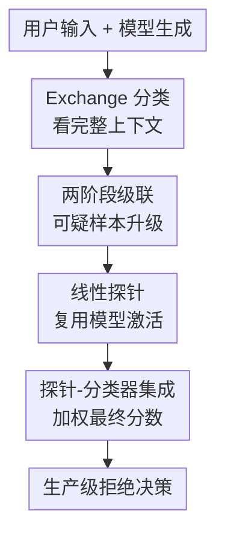

# Constitutional Classifiers++: Efficient Production-Grade Defenses against Universal Jailbreaks

**会议**: ICLR2026  
**OpenReview**: [https://openreview.net/forum?id=eNvsH5Ye2V](https://openreview.net/forum?id=eNvsH5Ye2V)  
**论文**: OpenReview  
**代码**: 无  
**领域**: LLM安全  
**关键词**: 通用越狱防御, Constitutional Classifiers, exchange classifier, 线性探针, 分类器级联

## 一句话总结
这篇论文把 Constitutional Classifiers 从“鲁棒但偏贵”的安全过滤器推进到生产可用版本：用上下文感知的 exchange classifier、两阶段级联和激活线性探针组合，在通用越狱红队测试中提升鲁棒性，同时把计算开销压到单一 exchange classifier 的约 $1/40$。

## 研究背景与动机
**领域现状**：大模型面对 jailbreak 时，常见防线是在输入端、输出端或对话交换级别训练一个安全分类器，对可能诱导危险内容的请求或回答进行拒绝。Constitutional Classifiers 是这条路线里很有代表性的方案：它不直接改变主模型，而是在模型前后放一个遵循安全宪法的监控器，判断当前交互是否触及高风险内容。

**现有痛点**：上一代系统把输入分类器和输出分类器分开使用，部署时已经能挡住不少通用越狱，但仍有两个现实问题。第一，攻击者可以把有害意图拆散进较大的上下文，让输入分类器看不到完整问题；第二，输出分类器如果只看回答本身，就可能读不懂依赖输入上下文的隐喻、替换词或格式化编码。更糟的是，安全系统要上生产环境还必须控制拒答率和推理成本，不能为了鲁棒性把正常用户大量误拒，也不能给每次生成都挂一个昂贵大模型分类器。

**核心矛盾**：这篇论文面对的不是单一“提高分类准确率”问题，而是三方拉扯：越狱防御要足够强，生产流量上的误拒要足够低，计算开销还要低到可以长期在线运行。上一代 Constitutional Classifiers 的问题正在于它把输出与输入割裂开看，鲁棒性不够；而直接用更强的 exchange classifier 又会显著增加成本。

**本文目标**：作者要做的是一套生产级 LLM jailbreak 防御系统。具体来说，它需要能识别跨输入和输出共同构成的危险交换，能在大多数正常流量上只付出极小监控成本，并能经受长时间人工红队测试，尤其是针对 CBRN 相关的通用越狱攻击。

**切入角度**：论文从上一代系统的失败案例入手，发现很多越狱不是单句有害，而是“输入里藏规则，输出里按规则生成”，因此必须让分类器看到完整 exchange。同时，作者注意到大部分生产流量其实并不危险，于是把昂贵判断留给少数可疑样本；再进一步，主模型生成时已经产生了内部激活，线性探针可以复用这些表征，作为几乎零额外成本的第一道筛选。

**核心 idea**：用“上下文感知 exchange classifier + 低成本探针路由 + 外部分类器复核”的级联监控替代输入/输出分离式过滤，把通用越狱检测做成低误拒、低开销的生产系统。

## 方法详解

### 整体框架
Constitutional Classifiers++ 的整体流程可以看成一条自适应安全监控链：先用上一代系统的失败模式定义新威胁，再把输出检测改成输入上下文感知的 exchange classifier，然后用两阶段级联减少外部分类器调用，最后用主模型激活上的线性探针进一步压低成本。最终生产版不是单个分类器，而是一个加权两阶段系统：线性探针持续监听所有生成，只有探针分数超过阈值的 exchange 才交给外部 Constitutional Classifier，最终用两者 logits 的加权和做拒绝决策。

### 关键设计
**1. Exchange 分类：把输入和输出放回同一个安全语境**

上一代 Constitutional Classifiers 的主要漏洞来自“切片式判断”。输入分类器只看 prompt，可能被重构攻击绕过：有害请求被拆成函数、片段或上下文里的多个 benign-looking 组件，模型在回答时才把它们重组。输出分类器只看模型回复，也可能被上下文依赖的隐喻、替换词或编码绕过，因为回答单独看并不显得危险，只有和输入里的映射规则一起看才暴露真实含义。

Exchange classifier 的改变很直接：它先检查输入，然后在模型生成过程中分批检查输出 token，并且每次都把输出片段放在完整对话上下文中判断。这样，分类器不再问“这段输出孤立看是否有害”，而是问“在这个用户输入和当前回答共同构成的 exchange 中，模型是否正在完成有害目标”。红队结果显示，这种设计让高风险漏洞发现率从上一代系统的 $0.01871$ / 千查询降到 $0.00885$ / 千查询；代价是单一 exchange classifier 比上一代系统贵约 $50\%$。

**2. 两阶段级联：让昂贵判断只服务少数可疑 exchange**

如果所有流量都交给强 exchange classifier，鲁棒性会提升，但生产成本不划算。论文因此采用级联架构：第一阶段是更轻量的分类器，负责筛查所有 exchange；它不直接拒绝用户，而是把可疑样本升级给第二阶段。第二阶段更贵但更准，只处理第一阶段认为值得复核的样本。

这个设计的关键在于第一阶段的阈值可以比最终拒绝阈值更宽松。因为第一阶段的 flag 不是拒答，而是“送去复核”，所以它可以接受更高的假阳性路由率，以换取低漏检。论文中的两阶段 exchange cascade 在约 $569K$ 次红队查询中发现 5 个高风险漏洞，漏洞发现率 $0.00878$ / 千查询，接近单一 exchange classifier 的鲁棒性；同时结合模型和推理管线优化，计算成本相对单一 exchange classifier 降低 $5.4\times$。

**3. 线性探针：复用主模型激活做流式低成本监控**

进一步降低成本的核心来自 activation probe。主模型生成每个 token 时，本来就会产生中间层激活 $\phi_t^{(\ell)}$。论文在这些激活上训练线性探针，令探针在位置 $t$ 对前缀 $x_{1:t}$ 输出有害概率：

$$
p_{\text{probe}}(y=1 \mid x_{1:t}) = \sigma(W^\top \psi_t(x_{1:t}) + b).
$$

难点是训练标签是 exchange-level 的，而推理时需要流式判断。作者用两个技巧解决这个错位。第一是滑窗均值 logit smoothing：训练时把连续 $M$ 个 token 的 logits 做平均，避免单个尖峰 token 导致误报；部署时用 EMA 近似，状态量很小。第二是 softmax logit pooling：用 $\exp(\bar z_t/\tau)$ 给更像有害位置的 token 更高权重，再对整段 exchange 做 BCE。这样， harmless 前缀即使来自最终有害样本，也不会被强行训练成半有害；真正出现危险内容的位置会承担主要梯度。

**4. 探针-外部分类器集成：用互补错误换鲁棒性和成本**

单独线性探针已经接近小型外部分类器，但论文更重要的发现是：探针和外部 classifier 犯错并不完全相同。作者把探针 logit 和外部分类器 logit 做加权平均，发现 probe + small external classifier 的集成比外部分类器之间的集成更强，说明模型内部激活提供了额外信号。

最终生产系统采用 weighted two-stage cascade。探针持续监控所有 exchange，当探针分数超过阈值时才调用第二阶段外部 Constitutional Classifier；被升级的样本用

$$
z_{\text{final}} = 0.55 z_{\text{probe}} + 0.45 z_{\text{classifier}}
$$

作为最终分数。这个比例不是把探针当作廉价替代品，而是承认两者都有信息：探针便宜且能捕捉主模型内部表征，外部分类器更像独立审查员，二者组合能在成本-鲁棒性曲线上占更优位置。

### 一个完整示例
可以把系统想成一次在线生成的安全路径。用户发来一个看似普通但包含隐式映射的请求，主模型开始回答。探针在每个 token 批次上读主模型激活，如果一直低于阈值，系统几乎只支付探针成本；如果某段回答开始和输入中的隐式规则结合出高风险意图，探针分数升高，exchange 被路由给外部 classifier。外部 classifier 不只看当前输出句子，而是连同用户输入一起判断，最后与探针分数加权，决定是否拒绝。

这个例子里，关键不是模型是否输出了某个孤立敏感词，而是 exchange 是否共同构成高风险帮助。也正因为如此，输出 obfuscation 和 reconstruction attack 会比面对 output-only classifier 时更难成功。

### 损失函数 / 训练策略
线性探针训练使用 exchange-level 标签，但为了适配 streaming inference，训练目标对 token 位置做了不对称加权。滑窗均值首先得到平滑 logit $\bar z_t$，softmax pooling 再给每个位置权重：

$$
w_t = \frac{\exp(\bar z_t/\tau)}{\sum_{t'} \exp(\bar z_{t'}/\tau)}.
$$

最终用加权 pooled logit 进入二分类交叉熵。论文默认设置里 softmax temperature 为 $\tau=1$，滑窗大小 $M=16$，并使用多层激活拼接。消融显示同时使用 logit smoothing 和 softmax pooling 最好；只去掉其中一个都会提高攻击成功率。多层 probing 也很重要：只用部分层会比使用所有层更差。

## 实验关键数据

### 主实验
| 系统 | 相对计算开销 | 高风险漏洞发现率 / 千查询 | 生产流量拒绝率 |
|------|--------------|---------------------------|----------------|
| 上一代 Constitutional Classifiers | $100.0\%$ | $0.01871$ | $0.073\%$ |
| 单一 Exchange Classifier | $150.0\%$ | $0.00885$ | $0.038\%$ |
| 两阶段 Exchange Cascade | $27.8\%$ | $0.00878$ | $0.036\%$ |
| Production Grade | $3.5\%$ | $0.00505$ | $0.050\%$ |

生产版系统在 2025-12-01 到 2026-01-01 的 shadow deployment 中，探针把约 $5.5\%$ 的流量升级到第二阶段，整体计算开销相对两阶段系统再降约 $8\times$，相对单一 exchange classifier 降约 $40\times$。这说明本文不是单纯提高鲁棒性，而是把安全监控真正做到了可部署成本。

### 消融实验
| 配置 / 对比 | 关键指标 | 说明 |
|-------------|----------|------|
| 上一代系统 | 13 个高风险漏洞 / 695K 查询 | 输入+输出分离，重构和输出混淆仍可绕过 |
| Exchange classifier | 2 个高风险漏洞 / 226K 查询 | 看完整上下文后，高风险漏洞发现率约减半 |
| 两阶段 cascade | 5 个高风险漏洞 / 569K 查询 | 鲁棒性接近 exchange classifier，成本显著下降 |
| Production grade | 1 个高风险漏洞 / 198K 查询 | 1736 小时红队下没有发现能覆盖全部 8 个目标问题的通用越狱 |
| 探针无 smoothing / pooling | 攻击成功率最高 | 不能有效处理 exchange-level 标签和 token-level 流式预测的错位 |
| smoothing + softmax pooling | 探针效果最好 | 既抑制单 token 尖峰，又把梯度集中到真正危险的位置 |

### 关键发现
- Exchange classifier 直接针对上一代系统的失败机制：只要攻击依赖输入-输出联合解释，output-only classifier 就天然吃亏，而 exchange classifier 能把隐式映射放回上下文里看。
- 级联架构的价值不只是“省钱”，还改变了阈值设计：第一阶段可以宽松路由，第二阶段才做最终拒绝，从而把低漏检和低误拒拆开优化。
- 线性探针的最大意义在于复用主模型内部状态。它不是一个完整外部审查模型，却能用极低开销提供可路由的风险信号，并和外部 classifier 形成互补。
- 生产版的 0.05% 拒绝率略高于两阶段 cascade 的 0.036%，但高风险漏洞发现率最低，说明最终系统选择了更偏安全的生产权衡。

## 亮点与洞察
- **把失败模式转成架构改动**：论文没有只说“上一代不够鲁棒”，而是明确定位 reconstruction attack 和 output obfuscation attack，再用 exchange classifier 对症修复。这种从红队失败案例反推系统形态的路线很实用。
- **把安全防御做成自适应计算问题**：大多数安全论文容易把重点放在更强分类器上，但本文把成本曲线当成核心指标。两阶段级联和探针路由说明，生产安全系统真正优化的是单位流量上的风险-成本-误拒三元组。
- **线性探针不是孤立监控器，而是路由器和集成成员**：探针单独用可能还不够稳，但作为第一阶段路由和最终 logit 集成的一部分非常合适。这个思路可迁移到幻觉检测、隐私泄露检测、版权风险检测等其他流式安全任务。
- **红队评估更接近真实攻防**：论文用超过 1700 小时的人工红队努力评估最终系统，比单纯静态 benchmark 更能暴露防线被适应性攻击后的真实强度。

## 局限与展望
- 论文主要围绕 CBRN 相关通用越狱测试，结论不能直接外推到所有风险域。金融欺诈、网络攻击、隐私泄露或多模态安全都可能需要不同 constitution、训练数据和红队协议。
- 最终系统仍不是不可突破的防线。作者也提到，专家红队在某些版本外仍能用自动化工具发现通用越狱，因此这类 classifier 更像提高攻击成本，而不是形式化安全保证。
- 探针依赖主模型内部激活，跨模型迁移并不免费。换成不同主模型、不同层结构或不同部署栈时，探针训练和校准都需要重做。
- 生产指标来自 shadow deployment 和特定时间窗口，真实上线后的用户分布、攻击者适应和模型更新都会改变误拒率和路由率，需要持续监控和再训练。
- 后续可以把 classifier 信号更紧地接入采样过程，例如在生成中动态调节拒绝策略、提前截断危险路径，或用自动红队持续扩充训练数据。

## 相关工作与启发
- **vs Sharma et al. (2025) Constitutional Classifiers**: 上一代工作证明 constitutional classifier 能挡住大规模通用越狱，本文则把漏洞、成本和误拒率一起重新工程化，重点从“能防”推进到“能上生产”。
- **vs output-only / input-only safety classifiers**: 传统输入或输出分类器更便宜也更简单，但面对跨上下文重构和隐喻式混淆时信息不足；exchange classifier 的优势正是把输入和输出一起解释。
- **vs model internals classifiers / activation probes**: 既有探针工作多把内部激活用于离线分类或单次序列判断，本文强调流式安全分类，并通过 smoothing + softmax pooling 解决 exchange-level 标签和 token-level 预测之间的训练错位。
- **vs model cascades / routers**: 常规模型级联关注成本与质量路由，本文把同样思想用于安全监控：低成本阶段不是给最终答案，而是决定是否调用更强审查器。

## 评分
- 新颖性: ⭐⭐⭐⭐☆ exchange classifier、cascade 和 probe 都有先例，但把三者整合成经红队验证的生产安全系统很有价值。
- 实验充分度: ⭐⭐⭐⭐⭐ 人工红队、生产 shadow deployment、成本/误拒/鲁棒性三指标和探针消融都比较完整。
- 写作质量: ⭐⭐⭐⭐☆ 论文结构清晰，系统工程脉络强；但部分内部模型和部署细节不可复现，读者只能看到高层指标。
- 价值: ⭐⭐⭐⭐⭐ 对真实 LLM 安全部署很有参考意义，尤其适合需要在高风险场景里平衡安全性、误拒率和计算开销的团队。

<!-- RELATED:START -->

## 相关论文

- [\[ICLR 2026\] Obfuscated Activations Bypass LLM Latent-Space Defenses](obfuscated_activations_bypass_llm_latent-space_defenses.md)
- [\[CVPR 2025\] Steering Away from Harm: An Adaptive Approach to Defending Vision Language Model Against Jailbreaks](../../CVPR2025/llm_safety/steering_away_from_harm_an_adaptive_approach_to_defending_vision_language_model_.md)
- [\[ICLR 2026\] Perturbation-Induced Linearization: Constructing Unlearnable Data with Solely Linear Classifiers](perturbation-induced_linearization_constructing_unlearnable_data_with_solely_lin.md)
- [\[ACL 2026\] Responsible Federated LLMs via Safety Filtering and Constitutional AI](../../ACL2026/llm_safety/responsible_federated_llms_via_safety_filtering_and_constitutional_ai.md)
- [\[ICLR 2026\] Redirection for Erasing Memory (REM): Towards a Universal Unlearning Method for Corrupted Data](redirection_for_erasing_memory_rem_towards_a_universal_unlearning_method_for_cor.md)

<!-- RELATED:END -->
