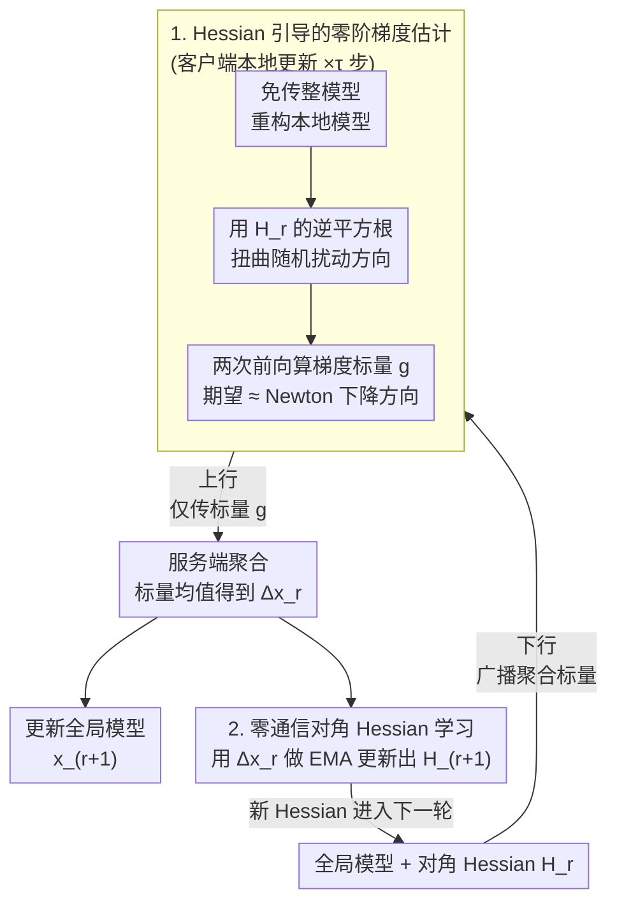

# Converge Faster, Talk Less: Hessian-Informed Federated Zeroth-Order Optimization

**会议**: ICLR 2026  
**arXiv**: [2506.02370](https://arxiv.org/abs/2506.02370)  
**代码**: 待确认  
**领域**: 优化 / 联邦学习  
**关键词**: 联邦学习, zeroth-order optimization, Hessian preconditioning, 标量通信, LLM 微调

## 一句话总结

提出 HiSo（Hessian-informed Scalar-only communication），在联邦零阶优化中利用全局对角 Hessian 近似加速收敛，同时严格保持标量通信不传输任何二阶信息。理论证明在低有效秩和白化假设下收敛速率独立于 Lipschitz 常数 $L$ 和模型维度 $d$；实验在 OPT-350M/1.3B/2.7B 微调中实现 1.4~5.4× 通信轮次加速，通信成本仅 KB 级。

## 研究背景与动机

**领域现状**：联邦学习 LLM 微调面临严重的通信瓶颈——FedAvg 对 OPT-1.3B 每个客户端需约 1~5 TB 通信量。DeComFL 利用零阶梯度的标量-种子表示实现维度无关通信（TB→KB 级），但收敛极慢。

**现有痛点**：ZO-SGD 使用各向同性随机方向搜索梯度（$u \sim \mathcal{N}(0, I)$），完全忽略 LLM 参数空间的异构曲率——高曲率方向和低曲率方向被等权搜索，导致梯度估计方差大、收敛率 $\mathcal{O}(\sqrt{Ld/mR})$ 依赖维度 $d$ 和 Lipschitz 常数 $L$。传统的 Hessian 预处理需要 $O(d)$ 或 $O(d^2)$ 通信，直接破坏标量通信框架。

**核心矛盾**：曲率信息能显著加速收敛（Adam/二阶方法已证明），但在标量通信框架下传输任何 Hessian 相关信息都会线性或二次增加通信开销——与维度无关通信的根本目标矛盾。

**本文目标**：如何在严格保持标量通信（每轮仅传递一个梯度标量 $g$ 和随机种子）的前提下，利用 Hessian 信息加速联邦零阶优化的收敛？

**切入角度**：关键观察是全局聚合的零阶梯度更新量 $\Delta x_r$ 本身可以从标量重构（已用于模型重构步骤），因此可以"免费"地用 Adam 风格的 EMA 从这些已有变量中计算对角 Hessian 近似——无需任何额外通信。

**核心 idea**：用 Hessian 逆平方根扭曲随机扰动方向使其沿高曲率方向更精细搜索，而 Hessian 本身从已有的全局梯度标量中免费计算，实现零额外通信成本的曲率加速。

## 方法详解

### 整体框架

HiSo 先把"标量通信"从具体优化器中抽出来，提出一个通用框架（Algorithm 1）：只要更新方向能写成"标量 + 状态"的形式，任何优化器都能塞进这套维度无关的通信协议，不再像 DeComFL 那样被钉死在 ZO-SGD 上。在这个壳子里，整个训练按"通信轮 $r$"循环推进：服务端先下行广播聚合标量（客户端据此免传整模型地重构出当前全局模型），被采样的客户端在本地跑 $\tau$ 步更新——这一步正是 **Hessian 引导的零阶梯度估计**，把各向同性的零阶扰动换成被 Hessian 扭曲过的扰动 $z \sim \mathcal{N}(0, H_r^{-1})$，于是每步更新量的期望从普通梯度下降 $\nabla f$ 变成了 Newton 风格的 $H_r^{-1}\nabla f$；客户端只上行一个梯度标量 $g$，服务端把这些标量取均值得到全局更新量 $\Delta x_r$，再用它做 **零通信的对角 Hessian 学习**（EMA 更新出 $H_{r+1}$），新的 $H_{r+1}$ 进入下一轮继续扭曲扰动。关键在于这个 $H_r$ 恰好能从已经在传的标量里免费重构出来，整套方法因此既加速又零额外通信；论文进一步用 **低白化秩理论** 解释了这种曲率扭曲为什么能把梯度方差压到与维度无关。

### 关键设计

**1. Hessian 引导的零阶梯度估计：让搜索方向顺着曲率走**

标准 ZO-SGD 用各向同性方向 $u \sim \mathcal{N}(0, I)$ 去探梯度，等价于在所有方向上等权搜索，完全无视 LLM 参数空间里高曲率方向和低曲率方向的巨大差异，导致估计方差大、收敛慢。HiSo 把单步本地更新形式化为"在标量表示约束下最小化梯度估计误差"的子问题（式 5-6），求解得到的上升方向是 $\Delta x = \frac{1}{\mu}[f(x + \mu H_r^{-1/2}u) - f(x)] \cdot H_r^{-1/2}u$。这里 $H_r^{-1/2}$ 把各向同性扰动重塑成沿 Hessian 特征方向的非均等搜索：高曲率方向探得更细、低曲率方向探得更粗。它的期望 $\mathbb{E}[\Delta x] \approx H_r^{-1}\nabla f(x)$ 正是自然梯度/Newton 下降，从而大幅压低梯度估计方差。关键是这一步仍然只产生一个标量 $g$ 上传，维度无关的通信性质丝毫未破。

**2. 零通信成本的全局对角 Hessian 学习：把约束变成免费的午餐**

预处理通常要传 $O(d)$ 甚至 $O(d^2)$ 的二阶信息，直接和标量通信的目标冲突。HiSo 的巧妙之处在于注意到：全局聚合后的更新量 $\Delta x_r$ 本来就可以从标量和随机种子完全重构出来（这些信息在模型重构步骤里已经在用了），所以基于它计算 Hessian 是"免费"的——不需要任何额外通信、也不需要额外的函数求值。具体用 Adam 风格的 EMA 在服务端与客户端同步维护一个对角近似 $H_{r+1} = (1-\nu)H_r + \nu \, \text{Diag}([\Delta x_r]^2 + \epsilon I)$：对角形式避开了 $d^2$ 的存储，EMA 平滑掉噪声波动，$\epsilon$ 保证正定。整体精神和 RMSProp 一致，但搬到了零阶联邦的场景里。

**3. 低白化秩的方差压缩理论：解释加速从何而来**

为了说清楚 Hessian 引导为什么能加速，论文引入"白化秩" $\zeta = \text{Tr}(H^{-1/2}\Sigma H^{-1/2})$ 来度量 Hessian 近似的质量。当 $H$ 是好近似时，$\zeta \ll L\kappa \ll Ld$，ZO 梯度的方差就从标准结果里的 $Ld$ 被压缩到 $\zeta$，收敛率随之从 $\mathcal{O}(\sqrt{Ld/mR})$ 改善为 $\mathcal{O}(\sqrt{\zeta/mR})$——既不依赖模型维度 $d$，也不依赖 Lipschitz 常数 $L$。这条结论的物理基础是 LLM 的 Hessian 特征值呈长尾分布（有效秩远小于维度），对角 Hessian 近似的白化操作恰好能把这条长尾压平，$\zeta$ 因此远小于最坏情况的 $Ld$。

### 损失函数 / 训练策略

优化的是标准联邦目标 $\min_x f(x) = \frac{1}{M}\sum_{i=1}^M f_i(x)$。每轮均匀采样一个客户端子集，被选中的客户端跑 $\tau$ 步本地更新后只上传标量，对角 Hessian 则在每轮开始时通过这 $\tau$ 步的 EMA 整体更新一次，因此曲率信息的维护频率与本地步数对齐而不增加通信。

## 实验关键数据

### 主实验：HiSo 通信轮次加速（Table 2）

| 模型 | 方法 | SST-2 轮次 | SST-2 加速 | QQP 轮次 | QQP 加速 | SQuAD 轮次 | SQuAD 加速 |
|------|------|-----------|-----------|---------|---------|-----------|-----------|
| OPT-350M | DeComFL | 550 | 1× | 775 | 1× | 1350 | 1× |
| | **HiSo** | **275** | **2×** | **425** | **1.8×** | **250** | **5.4×** |
| OPT-1.3B | DeComFL | 1500 | 1× | 1125 | 1× | 350 | 1× |
| | **HiSo** | **1075** | **1.4×** | **750** | **1.5×** | **175** | **2×** |
| OPT-2.7B | DeComFL | 1250 | 1× | 1475 | 1× | 450 | 1× |
| | **HiSo** | **775** | **1.6×** | **975** | **1.5×** | **200** | **2.3×** |

通信成本节省：29%~80%（如 OPT-350M SQuAD 从 52.73KB 降至 9.77KB，降 81%）。

### 全面基线对比：LLM 微调精度与通信成本（Table 3）

| 模型 | 方法 | SST-2 Acc | SST-2 通信 | QQP Acc | QQP 通信 | SQuAD F1 | SQuAD 通信 |
|------|------|----------|-----------|---------|---------|----------|-----------|
| OPT-125M | FedAvg | 87.63% | 0.15 TB | 61.21% | 0.08 TB | 37.27 | 0.05 TB |
| | FedAdam | 88.29% | 0.30 TB | 63.18% | 0.06 TB | 37.98 | 0.03 TB |
| | DeComFL | 85.21% | 22.92 KB | 60.11% | 32.17 KB | 34.12 | 17.42 KB |
| | **HiSo** | **85.55%** | **14.69 KB** | **60.72%** | **21.23 KB** | **35.26** | **7.12 KB** |
| OPT-350M | FedAvg | 89.79% | 0.58 TB | 63.32% | 0.31 TB | 43.38 | 0.12 TB |
| | DeComFL | 86.72% | 21.56 KB | 60.58% | 30.35 KB | 38.20 | 52.73 KB |
| | **HiSo** | **87.50%** | **17.33 KB** | **62.49%** | **18.63 KB** | **39.13** | **20.51 KB** |
| OPT-1.3B | FedAvg | 90.48% | 0.63 TB | 65.77% | 0.32 TB | 60.39 | 0.41 TB |
| | FedAdam | 92.86% | 0.79 TB | 64.59% | 1.10 TB | 61.56 | 0.27 TB |
| | FedZO | 90.01% | 4.73 TB | 62.91% | 3.53 TB | 57.26 | 1.10 TB |
| | DeComFL | 90.22% | 58.59 KB | 63.25% | 43.95 KB | 57.14 | 13.67 KB |
| | **HiSo** | **90.34%** | **49.18 KB** | **64.20%** | **96.67 KB** | **57.58** | **7.81 KB** |

### 关键发现

- **HiSo vs DeComFL 全面胜出**：在所有模型规模（OPT-125M ~ 2.7B）和所有任务上，HiSo 以更少通信轮次达到更高精度。最大加速 5.4×（OPT-350M SQuAD），最小 1.4×（OPT-1.3B SST-2）
- **通信量 vs 一阶方法对比悬殊**：HiSo 的通信成本为 KB 级（7~97 KB），一阶方法为 TB 级（0.03~4.73 TB），差距可达 **9000 万倍**（如 FedZO 4.73 TB vs HiSo 49.18 KB）
- **精度 vs 一阶方法的差距可接受**：HiSo SST-2 上 OPT-1.3B 达 90.34% vs FedAdam 92.86%，差 2.5 个百分点但通信成本从 0.79 TB 降至 49.18 KB
- **Hessian EMA 参数 $\nu$ 鲁棒**：不同 $\nu$ 值对收敛和最终精度影响可忽略
- **学习到的 Hessian 对角元呈长尾分布**：与低有效秩假设一致，验证了理论基础

## 亮点与洞察

- **"免费的午餐"设计思想**：Hessian 信息从已有的全局标量中提取（这些标量已用于模型重构），零额外通信——将"约束"（标量通信）转化为"优势"（免费的 Hessian）
- **理论突破**：首个在零阶 FL 中实现维度无关 + Lipschitz 无关收敛率的结果（$\mathcal{O}(\sqrt{\zeta/mR})$），同时解决了 DeComFL 在多步本地更新下无法提供低有效秩保证的开放问题
- **通用框架贡献**：将标量通信与特定优化器解耦的 Algorithm 1，未来可接入更多优化算法（如动量、方差减少等）
- **"白化秩"概念**：$\zeta = \text{Tr}(H^{-1/2}\Sigma H^{-1/2})$ 提供了比"有效秩" $\kappa$ 更紧的方差上界，从理论上解释了为什么实践中 ZO 收敛远快于 $\mathcal{O}(d)$ 的最坏情况

## 局限与展望

- 对角 Hessian 是粗糙近似——非对角曲率信息（如参数间交互）被完全忽略，对高度耦合的参数空间可能效果打折
- 低有效秩 + 白化假设是否对所有 LLM 层都成立？论文承认难以验证但以实验间接支撑
- 虽然精度与 HiSo 接近一阶方法了，但 OPT-1.3B QQP 上通信成本（96.67 KB）高于 DeComFL（43.95 KB），说明加速并非在所有场景下均匀
- 仅在分类/QA 任务上验证，生成式任务（如续写、对话）未测试
- 当前不含动量项（类似 RMSProp 而非 Adam），论文提到可扩展但未实验

## 相关工作与启发

- **vs DeComFL**：HiSo 是 DeComFL 的严格推广（$H_r \equiv I$ 时退化为 DeComFL），同为标量通信但加速 1.4~5.4×，且理论覆盖多步本地更新
- **vs FedAdam/FedYogi**：一阶自适应 FL 方法精度更高但需 $O(d)$ 通信。HiSo 在标量通信约束下近似实现了类似的自适应效果
- **vs Hessian-aware ZO (单机)**：Ye et al. (2018) 和 Zhao et al. (2025) 在单机设置验证了 Hessian ZO 的有效性；HiSo 首次将其推广到联邦标量通信场景并解决了 Hessian 通信问题
- **启发**：标量通信框架的通用性意味着方差减少、动量等技术都可能"免费"引入，通信受限的联邦优化还有很大提升空间

## 评分

- 新颖性: ⭐⭐⭐⭐⭐ 标量通信 + Hessian 引导的完美结合，"免费 Hessian"的观察巧妙，理论贡献（$\zeta$ 和白化秩）扎实
- 实验充分度: ⭐⭐⭐⭐ 三种 OPT 规模 × 三个任务的完整网格，与一阶和 ZO 基线全面对比，但缺少生成式任务验证
- 写作质量: ⭐⭐⭐⭐ 框架推导和理论分析清晰，从子问题到算法到理论的逻辑链完整
- 价值: ⭐⭐⭐⭐⭐ 对通信受限的联邦 LLM 微调有直接实用价值，通用框架打开了后续研究空间

<!-- RELATED:START -->

## 相关论文

- [\[ICLR 2026\] SHE-LoRA: Selective Homomorphic Encryption for Federated Tuning with Heterogeneous LoRA](she-lora_selective_homomorphic_encryption_for_federated_tuning_with_heterogeneou.md)
- [\[ICLR 2026\] OFMU: Optimization-Driven Framework for Machine Unlearning](ofmu_optimization-driven_framework_for_machine_unlearning.md)
- [\[ICLR 2026\] PURGE: Reinforcement Unlearning via Group Relative Policy Optimization](reinforcement_unlearning_via_group_relative_policy_optimization.md)
- [\[ICLR 2026\] EEPO: Exploration-Enhanced Policy Optimization via Sample-then-Forget](eepo_exploration-enhanced_policy_optimization_via_sample-then-forget.md)
- [\[ICLR 2026\] wd1: Weighted Policy Optimization for Reasoning in Diffusion Language Models](wd1_weighted_policy_optimization_for_reasoning_in_diffusion_language_models.md)

<!-- RELATED:END -->
