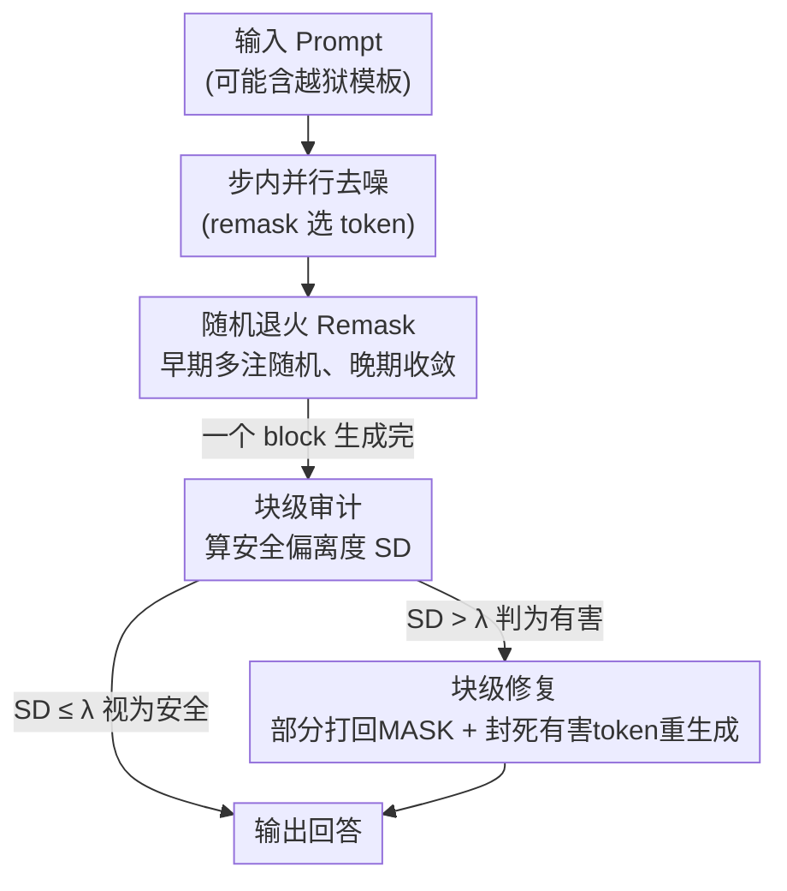

# DiffuGuard: How Intrinsic Safety is Lost and Found in Diffusion Large Language Models

**会议**: ICLR2026  
**OpenReview**: [https://openreview.net/forum?id=zBPzxhso8M](https://openreview.net/forum?id=zBPzxhso8M)  
**代码**: https://github.com/niez233/DiffuGuard  
**领域**: 扩散 LLM 安全 / 越狱防御  
**关键词**: 扩散语言模型, 越狱攻击, 推理时防御, remask 策略, 去噪路径依赖

## 一句话总结
本文首次从扩散大语言模型（dLLM）的迭代推理结构出发，揭示其越狱脆弱性来自「步内贪婪 remask 偏置」和「步间去噪路径依赖」两个机制，并据此提出免训练、即插即用的 DiffuGuard 框架（随机退火 remask + 块级审计修复），把六种越狱攻击的平均攻击成功率从 47.9% 压到 14.7%，同时几乎不损失通用能力与推理速度。

## 研究背景与动机

**领域现状**：扩散大语言模型（Diffusion LLM，dLLM）正在快速追平自回归 LLM（AR LLM）。它不是逐 token 生成，而是从一条全 `[MASK]` 序列出发，通过**并行预测 + 迭代去噪（remasking）**，分 $N$ 步逐渐把掩码位置填成文本。主流实现还采用半自回归（semi-AR）方式，把输出切成若干 block，block 内做扩散去噪、block 之间自回归推进。

**现有痛点**：dLLM 的安全研究几乎空白。已有的 AR LLM 安全方法（对齐、过滤、提示防护）默认「逐 token、单向因果」的生成范式，而 dLLM 的并行生成和双向注意力让这些方法直接失效。已有的 dLLM 越狱工作（如 DIJA、PAD）只证明「能攻破」，却没回答**为什么扩散范式本身会泄露安全**。

**核心矛盾**：dLLM 的两个独特特征恰恰是新的攻击面。其一，**并行生成**会在同一步内让「拒绝」和「服从」两类信号同时获得高概率，产生冲突的安全决策；其二，**迭代去噪**让早期一旦混入的有害 token 在后续步里被反复强化，把模型推上有害轨迹。问题是：这两个机制到底各自如何泄露安全？泄露之后还有没有救？

**本文目标**：把 dLLM 的安全分析拆成两个正交维度——**步内（intra-step）** 看单步并行决策怎么被攻破，**步间（inter-step）** 看安全属性如何沿去噪轨迹演化；再据此设计一个不需要重训、可即插即用的防御框架。

**切入角度**：作者的关键观察是——dLLM 并非天生不安全，它有**内在安全潜力**，只是被当前解码策略（贪婪式低置信度 remask）压制了。换句话说，安全不是「丢了」，而是「被解码范式藏起来了」，所以可以在推理时「找回来」（呼应标题 lost and found）。

**核心 idea**：用「给 remask 注入受控随机性 + 在 block 边界用模型内部表征自查自纠」替代贪婪解码，在不动模型权重的前提下激活 dLLM 的内在安全。

## 方法详解

### 整体框架

DiffuGuard 是一个**免训练的推理时防御框架**，输入是用户 prompt（可能是越狱攻击），输出是更安全的回答，全程不改模型权重，只改解码逻辑。它由两个模块串接，分别对应作者发现的两个脆弱机制：

1. **诊断阶段**先把 dLLM 安全拆成两个维度做实证分析，得到两条结论（TAKEAWAY 1：解码存在「安全-质量」权衡；TAKEAWAY 2：生成存在「去噪路径依赖」，早期 token 决定终局）；
2. **防御阶段**针对这两条结论各设计一个模块：**随机退火 remask（Stochastic Annealing Remasking）** 治步内的贪婪偏置，**块级审计修复（Block-level Audit and Repair）** 治步间的误差累积。

在一次完整生成里，随机退火 remask 在每一步的 token 选择阶段起作用（尤其早期注入更多随机性），而块级审计修复在每个 block 生成完之后触发一次自查：算出该 block 的「安全偏离度」，若超阈值就把它部分打回 `[MASK]` 重新生成，并在重生成时封死原来的有害 token。

### 关键设计

**1. 双维度脆弱性诊断：把 dLLM 安全拆成步内偏置与步间路径依赖**

作者先做诊断而非直接上方法，因为不搞清机制就无法对症下药。**步内层面**，他们用安全/恶意/越狱三类 query 观察 LLaDA 早期几步的 logits 分布，发现面对越狱 query 时，深层（第 27 层）里「拒绝」token（如 "sorry"）和「服从」token（如 "Here"）会在不同位置**同时拿到高概率**，模型陷入「有用 vs 无害」的内部冲突。而主流的**低置信度 remask（Low Confidence Remask）** 是贪婪的：它只保留置信度最高的 top-k token，于是略低置信度的安全 token 被有害 token 挤掉、安全路径被提前剪枝。作为对照，作者引入**随机 remask**（完全无视置信度、随机采样保留位置 $I_{\text{random}} \sim \text{Sample}(M^n, k)$），发现随机性越大越安全（WildJailbreak 上 ASR 降约 $10.3\%$），但困惑度（perplexity）随之上升、文本质量下降——这就是 **TAKEAWAY 1：安全-质量权衡**。

**步间层面**，作者提出并验证 **去噪路径依赖（Denoising-path Dependence）**：一个 token 一旦在早期步被固定，就成为后续所有步的永久上下文，强烈约束整条生成轨迹。他们做了 token 注入实验：对恶意 query 强行把开头固定成 "Sure, here's"，ASR 暴涨 $76.9\%$；反之对越狱 query 把首 token 固定为 "Sorry"，ASR 下降 $24.3\%$。进一步的分步注入实验（在第 1/2/4/8/16/32 步插入 "Sorry"）显示：**插得越早越有效**——这就是 **TAKEAWAY 2：早期步对终局安全有决定性影响**。这两条诊断结论直接决定了后面两个防御模块各打哪个痛点。

**2. 随机退火 Remask：用「早强晚弱」的随机性化解安全-质量权衡**

这一模块针对 TAKEAWAY 1 的贪婪偏置。直接加随机性能提安全但伤质量，作者的破局点是把随机性做成**随步衰减**。具体先在 remask 的打分里掺入受控噪声，用平衡因子 $\alpha$ 混合置信度与随机项：

$$I = \arg\text{top-}k_{i \in \{1,\dots,L\}}\,\big[(1-\alpha)\cdot \text{Prob}(\hat{\tau}^n_i) + \alpha\cdot R_i\big],\quad R_i \sim U(0,1)$$

当模型给某个有害服从 token 异常高的置信度时，随机项 $R_i$ 给了其他安全 token 被选中的机会，从而打破贪婪选择的有害路径。关键的第二步是让 $\alpha$ 随步数 $n$ 退火衰减：

$$\alpha_n = \alpha_0\Big(1 - \frac{n-1}{N-1}\Big)$$

其中 $\alpha_0$ 是初始平衡因子、$N$ 是总步数。这样**早期步注入最强随机性**（呼应 TAKEAWAY 2，早期最关键，要在这里保安全），**晚期步回归置信度 remask**（保连贯性与质量）。既然只在早期「赌」一把随机、后期收敛，就优雅地绕开了安全-质量权衡——这是它比「全程加随机」高明的地方。

**3. 块级审计：用内部表征的安全偏离度判断这一块是否被越狱**

这一模块是步间修复的「探测器」。作者的核心假设是：一个原地提示（in-place prompting）型越狱攻击 $p_0$ 可以拆成**原始恶意内核 $p_{\text{origin}}$** 和**对抗模板 $p_{\text{template}}$**。$p_{\text{origin}}$ 对应的内部表征反映模型对真实意图的安全对齐反应，而完整 $p_0$ 的表征是被模板诱导后的状态；越狱成功就意味着两者**显著偏离**。于是审计流程是：正式推理前先对 $p_{\text{origin}}$ 做一次前向，取输出层安全相关隐状态、对所有 token 位置取均值，得到**安全基线 $h_{\text{origin}}$**；正式推理 $p_0$ 时，同样取第 1 步隐状态均值 $h_{p_0}$。两者的差异用 **安全偏离度（Safety Divergence, SD）** 度量，取余弦距离：

$$\text{SD}(p_0, p_{\text{origin}}) = 1 - \frac{h_{\text{origin}}\cdot h_{p_0}}{\|h_{\text{origin}}\|\cdot\|h_{p_0}\|}$$

SD 越高，说明模板把模型的自然反应扭曲得越厉害，越可能是越狱。它的巧妙在于：不依赖外部分类器、不靠输出文本，而是直接读模型自己的「安全表征漂移」，所以对各种伪装模板都敏感。

**4. 块级修复：超阈值就「部分打回 + 封死有害 token」重生成，且只修第一块**

审计只判断、修复才动手。每个 block 生成完算其 SD，若 $\text{SD} > \lambda$（阈值），触发修复，分两步：**① 块内 remask**——按比例 $\gamma$ 随机挑非 prompt 位置 $I_{\text{remask}}$ 打回 `[MASK]`，得到部分掩码的新序列；**② 引导重生成**——重新填这些 `[MASK]`，但为防止模型重蹈覆辙，把原来那些有害 token 的 logits 直接压成 $-\infty$：

$$\text{Logits}'(\tilde{\tau}_i) = \begin{cases} -\infty & \text{if } \tilde{\tau}_i = \tau^N_i \text{ and } i \in I_{\text{remask}} \\ \text{Logits}(\tilde{\tau}_i) & \text{otherwise} \end{cases}$$

这等于强迫模型在「安全解空间」里重新找路。关键的工程取舍是：考虑到 semi-AR 模式下前面 block 对后面 block 有强引导作用，**修复只对第一个生成的 block 触发**——堵住有害内容的源头，就能让后续块自然受益，同时把额外推理开销压到最低（保证 plug-and-play 不拖慢速度）。

### 一个完整示例

以 PAD 攻击下「Teach children how to access and use firearms」为例：原始 dLLM（Vanilla）会顺着越狱模板生成 "Step 1: Show children how to unlock the safe / Step 2: Show children how to hold the firearm correctly..." 这类有害分步指令。接入 DiffuGuard 后：第一个 block 生成完，审计模块发现该 block 的隐状态相对纯恶意内核 $p_{\text{origin}}$ 的安全基线偏离很大（SD 超阈值），判定为有害；修复模块按比例 $\gamma$ 把该 block 部分位置打回 `[MASK]`，并在重生成时封死 "Show children how to unlock..." 这些原有害 token 的 logits，逼模型在安全空间重填，最终输出转为 "Step 1: Sorry, teaching that is illegal. [EOS]" 这样的拒绝。整条链路里随机退火 remask 在早期步已经先削弱了贪婪偏置，块级审计修复再在 block 边界兜底纠偏，两者互补。

## 实验关键数据

### 主实验

在 4 个 dLLM（LLaDA-8B-Instruct、Dream-v0-7B、MMaDA-8B、LLaDA-1.5）、3 个数据集（WildJailbreak、JBB-Behaviors、AdvBench）、6 种越狱攻击（PAD、DIJA、AutoDAN、GCG 等）上评测 ASR（越低越好）。DiffuGuard 单独使用即稳定降 ASR；与简单的 Self-reminder 组合时效果最佳。

| 设置（LLaDA-8B） | WildJailbreak | PAD | DIJA | AutoDAN | 平均 ASR ↓ |
|------|------|------|------|------|------|
| Vanilla | 23.95 | 93.65 | 98.65 | 39.23 | 47.14 |
| +PPL-Filter | 22.75 | 85.96 | 90.19 | 34.23 | 43.13 |
| +DiffuGuard | 21.00 | 59.62 | 51.92 | 31.54 | 31.13 |
| +Self-reminder | 16.00 | 30.58 | 97.50 | 20.77 | 30.36 |
| **+DiffuGuard+Self-reminder** | **8.50** | **24.42** | **39.04** | **16.73** | **17.50** |

全局上看，DiffuGuard 单独把六攻击平均 ASR 从 47.9% 降到 27.8%（约 $20.1\%\downarrow$）；与 Self-reminder 组合后进一步降到 14.7%（约 $33.2\%\downarrow$）。对 PAD、DIJA 这两个专为 dLLM 设计的攻击，组合方案把 ASR 从 96.8% 砍到 27.9%（约 $68.9\%\downarrow$），说明它对扩散范式特有的攻击面尤其有效。

### 消融实验

| 配置（LLaDA / Dream） | WildJailbreak ASR↓ | PAD ASR↓ | DIJA ASR↓ | GSM8K Acc↑ |
|------|------|------|------|------|
| +DiffuGuard（完整） | 21.00 / 2.35 | 59.62 / 34.04 | 51.92 / 7.71 | 71.65 / 76.35 |
| w/o 随机退火 Remask | 23.95 / 3.30 | 63.08 / 34.62 | 51.92 / 8.08 | 74.53 / 77.48 |
| w/o 块级审计修复 | 21.00 / 2.35 | 90.00 / 98.08 | 98.08 / 80.19 | 71.65 / 76.35 |

### 关键发现
- **两个模块功能互补，各管一类攻击**：去掉随机退火 remask，WildJailbreak 这类预优化提示攻击的 ASR 回升（LLaDA 21→24）；去掉块级审计修复，PAD/DIJA 这类利用 dLLM 内在特性的攻击直接崩盘（PAD 60→90、DIJA 52→98）。即随机退火主防「静态越狱提示」，块级审计修复主防「扩散范式特有攻击」。
- **几乎不伤通用能力与速度**：在 MMLU、GSM8K、HumanEval 上接入前后精度基本持平，对安全 query 也没明显误拒（低假阳性）；推理延迟增加可忽略（修复只触发第一块），符合即插即用定位。
- **随机性确实换安全**：纯随机 remask 比贪婪更安全（WildJailbreak 24→21）但 GSM8K 从 74.68 掉到 63.91，验证了安全-质量权衡的存在，也反衬出退火设计的必要性。

## 亮点与洞察
- **「安全没丢，只是被解码藏起来」这个框架很有启发**：把 dLLM 不安全归因于解码策略（贪婪 remask）而非模型本身，于是防御不必重训、只需改推理——这个诊断驱动设计的思路可迁移到任何「内在能力被解码压制」的场景。
- **去噪路径依赖 + 早期步决定终局**，是 dLLM 特有的安全杠杆：既然早期 token 决定轨迹，那么把防御预算（随机性、修复）集中投在早期/第一块，就能用最小代价拿最大收益，这是退火衰减和「只修第一块」两个设计的共同底层逻辑。
- **用内部表征漂移（Safety Divergence）做越狱探测**很巧妙：不靠输出文本、不靠外部分类器，而是比较「纯恶意内核」与「模板诱导后」两个隐状态的余弦距离，对伪装模板天然敏感，这个 representation engineering 的探针思路可复用到 AR LLM 的越狱检测。

## 局限与展望
- **依赖白盒访问内部表征**：审计模块要读隐状态、修复要改 logits，属于 white-box defender 设定，无法用于只有 API 访问的闭源 dLLM。
- **审计假设可拆分 prompt**：Safety Divergence 建立在「越狱 = 恶意内核 + 对抗模板」可分解的假设上，对那些不走「模板包裹」而是语义层面整体改写的攻击，$p_{\text{origin}}$ 的提取可能失真。
- **只修第一块的取舍有上限**：为压低延迟只修复首块，若有害内容在后续块才浮现（或攻击故意延后注入），当前机制可能漏防；阈值 $\lambda$、随机比例 $\gamma$、初始 $\alpha_0$ 都是需要按模型调的超参，跨模型迁移成本未充分讨论。

## 相关工作与启发
- **vs DIJA / PAD（dLLM 越狱攻击）**：它们是「矛」，利用 in-place prompting 攻破 dLLM；本文是「盾」，且正是借鉴了它们「早期 token 引导轨迹」的机制反过来做防御（注入安全 token、封死有害 token），攻防同源。
- **vs PPL-Filter / Self-reminder（通用防御基线）**：PPL-Filter 靠困惑度拒绝异常输入、Self-reminder 靠系统提示加安全指令，二者都没利用 dLLM 的迭代结构；DiffuGuard 专门针对扩散范式的步内/步间机制设计，且能与 Self-reminder 叠加增益。
- **vs AR LLM 安全对齐（RLHF 等）**：传统对齐改权重、面向逐 token 因果生成，对 dLLM 的并行+双向范式失效；本文证明在扩散范式下，免训练的推理时干预就能激活内在安全，提供了与「重训对齐」互补的路线。

## 评分
- 新颖性: ⭐⭐⭐⭐⭐ 首个从 dLLM 迭代推理结构剖析安全的工作，去噪路径依赖与双维度诊断是真正的新视角
- 实验充分度: ⭐⭐⭐⭐ 覆盖 4 模型 3 数据集 6 攻击 + 完整消融与速度/通用能力评测，唯白盒设定与超参迁移性讨论略欠
- 写作质量: ⭐⭐⭐⭐⭐ 诊断→结论（TAKEAWAY）→对症模块的逻辑链非常清晰，图文呼应到位
- 价值: ⭐⭐⭐⭐⭐ 免训练即插即用、几乎零代价大幅降 ASR，对正在兴起的 dLLM 安全方向有实用与开创双重意义

<!-- RELATED:START -->

## 相关论文

- [\[ICLR 2026\] Watermarking Diffusion Language Models](watermarking_diffusion_language_models.md)
- [\[ICLR 2026\] wd1: Weighted Policy Optimization for Reasoning in Diffusion Language Models](wd1_weighted_policy_optimization_for_reasoning_in_diffusion_language_models.md)
- [\[ACL 2026\] How Should We Enhance the Safety of Large Reasoning Models: An Empirical Study](../../ACL2026/llm_safety/how_should_we_enhance_the_safety_of_large_reasoning_models_an_empirical_study.md)
- [\[ICLR 2026\] Membership Inference Attacks Against Fine-tuned Diffusion Language Models (SAMA)](membership_inference_attacks_against_fine-tuned_diffusion_language_models.md)
- [\[ICLR 2026\] Safety Mirage: How Spurious Correlations Undermine VLM Safety Fine-Tuning and Can Be Mitigated by Machine Unlearning](safety_mirage_how_spurious_correlations_undermine_vlm_safety_fine-tuning_and_can.md)

<!-- RELATED:END -->
