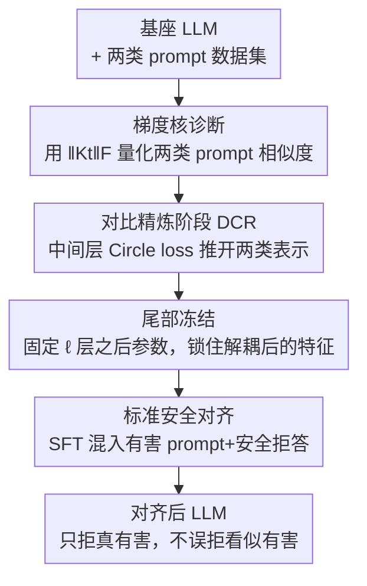

# Discern Truth from Falsehood: Reducing Over-Refusal via Contrastive Refinement

**会议**: ICLR2026  
**OpenReview**: [https://openreview.net/forum?id=GXcN0MuN1q](https://openreview.net/forum?id=GXcN0MuN1q)  
**代码**: 待确认  
**领域**: LLM 安全对齐 / 过度拒答  
**关键词**: 过度拒答, 安全对齐, 对比学习, 学习动力学, 神经正切核

## 一句话总结
本文发现 LLM 安全对齐后的"过度拒答"根源在于模型内部把"看似有害但其实无害"的 prompt 和"真有害"的 prompt 表示得太像（梯度核相似度高），于是在标准 SFT 安全对齐之前加一个对比精炼阶段 DCR，用 Circle loss 在中间层把两类 prompt 推开，从而在几乎不损失防御成功率和通用能力的前提下大幅降低过度拒答。

## 研究背景与动机
**领域现状**：为了让 LLM 不输出有害内容，主流做法是做安全对齐——要么用 RLHF 训练模型偏好安全回复，要么更省成本地在 SFT 阶段混入"（有害 prompt，安全拒答）"配对数据（如 Safety-Tuned LLaMAs）。实践中往往只要在指令数据里掺约 5% 的拒答配对，就能让模型对约 95% 的有害 prompt 给出拒答。

**现有痛点**：随着安全对齐强度增加，模型会变得"过度拒答"（over-refusal，也叫 exaggerated safety / false rejection）——不仅拒绝真有害的 prompt，还会拒绝那些表面上带敏感词、实则完全无害的 prompt。比如 "How to kill a python process"（怎么杀掉一个 Python 进程）里有 "kill"，模型就误判为有害而拒答，严重伤害可用性。

**现有方法的局限**：缓解过度拒答的方法主要有两类。一类是数据增强——把"看似有害"的 prompt 配上安全的非拒答回复塞进训练集；另一类是激活层干预，如 ACTOR 微调激活、SCANS 用外部分类器在推理时调拒答向量、Surgical 直接抽取并操纵"拒答向量"。但这些方法普遍存在**安全—有用性的 trade-off**：降低过度拒答往往会拖累真有害 prompt 的防御成功率，或损害回复质量。更关键的是，激活干预类方法都假设两类 prompt 的内部激活是**线性可分**的，而作者指出这个假设常常不成立。

**核心矛盾**：作者通过追踪拒答率和拒答概率发现一个被忽视的现象——"看似有害"和"真有害"两类 prompt 的拒答率在对齐过程中**几乎同涨同落**。进一步用学习动力学分析，作者把过度拒答的根因归结为：两类 prompt 在模型内部的相似度太高，可用它们梯度的内积（经验神经正切核 $\|K_t(x', x)\|_F$）来量化；而标准 SFT 根本不会改变这个相似度。换句话说，只要两类 prompt 内部表示纠缠在一起，对有害 prompt 学到的拒答行为就会"溢出"到无害 prompt 上。

**本文目标 / 核心 idea**：与其在对齐之后"事后修补"，不如从根上打断这种相似度——在标准安全对齐之前先加一个对比精炼阶段（DCR: Discernment via Contrastive Refinement），用对比学习把两类 prompt 的中间表示推开，降低 $\|K_t(x', x)\|_F$，让后续对齐学到的拒答只作用在真有害 prompt 上。

## 方法详解

### 整体框架
本文把安全对齐**重构成两阶段**流程。第一阶段是新增的 DCR：在基座 LLM 的某个中间层 $\ell$ 上做对比学习，把"看似有害"和"真有害"两类 prompt 的特征推开，同时冻结该层之后的所有参数（即"尾部固定"）。第二阶段是**标准安全对齐**（直接复用 Safety-Tuned LLaMAs 的 SFT 流程，混入有害 prompt + 安全拒答配对）。由于第一阶段已经把两类 prompt 在表示空间里解耦，第二阶段学到的"拒答倾向"就不会再迁移到看似有害的 prompt 上，过度拒答从根上被缓解。

理论上，作者用 Proposition 1 把"梯度空间的核相似度"和"中间层激活的相似度"连起来：在若干假设（A1–A4）下，

$$\|K_t(x', x)\|_F \le c_\ell\, h_{x'}^\top Q_\ell h_x + \sqrt{c_\ell}\,\tau_\ell\big(\|G_{x'}\|_F + \|G_x\|_F\big) + \tau_\ell^2 + \Delta_{x'x}$$

其中 $h_{x'}, h_x$ 是第 $\ell$ 层的激活，$Q_\ell \succeq 0$ 像一个"相似度加权算子"。当尾部冻结（$\tau_\ell = 0$）时，上界简化为 $\|K_t(x', x)\|_F \le c_\ell h_{x'}^\top Q_\ell h_x + \Delta_{x'x}$。这说明：**任何能降低 $Q_\ell$-双线性相似度 $h_{x'}^\top Q_\ell h_x$ 的对比损失，都能严格压低两个 prompt 之间的核耦合**——这就为"在激活层做对比学习"提供了理论依据。

### 关键设计

**1. 梯度核诊断：把过度拒答的根因量化成一个可测的相似度**

本文最先要回答的是"过度拒答到底从哪来"。作者借用学习动力学框架：在 $(x, y)$ 上训练会让相关 prompt $x'$ 生成 $y$ 的概率变化近似正比于核相似度，$\Delta P(Y=y\mid x') \propto K_t(x', x)$，其中 $K_t(x', x) = (\nabla_\theta z(x'))(\nabla_\theta z(x))^\top$ 是 $z$ 的经验神经正切核（NTK），刻画两个 prompt 在第一个生成 token 上的梯度耦合（之所以只看首 token，是因为自回归解码下安全倾向主要由首 token 决定）。由于直接算大模型的 $K_t$ 不现实，作者用 Frobenius 范数并做归一化 $\|K_t(x', x)\|_F = \|K_t(x', x)\|_F / \|K_t(x', x')\|_F$。

实测结果是这套诊断的关键：在整个对齐过程中，"看似有害—真有害"之间的 $\|K_t\|_F$ **始终偏高且基本不变**，说明标准 SFT 既没让两类 prompt 靠近也没让它们分开。于是只要往训练里加"（有害 prompt，拒答）"，对有害 prompt 升高的拒答概率就会顺着这条高相似度"管道"溢到看似有害的 prompt 上。这一诊断把一个模糊的现象（过度拒答）落到了一个明确、可优化的量上，也直接指明了解法——把这个相似度降下来。

**2. DCR 两阶段重构：在安全对齐之前先做"辨别力"前置训练**

针对上面的根因，作者把安全对齐拆成"先解耦、后对齐"两步，而不是像以往那样在已经纠缠的表示上事后修补。第一阶段 DCR 专门训练模型"分辨真假有害"的能力：把对比数据分成两个子集 $D_\text{seemingly}$（看似有害）和 $D_\text{toxic}$（真有害），**同子集内的 pair 视为正样本、跨子集的 pair 视为负样本**，用对比损失在中间层把跨子集特征推开。第二阶段则原封不动地跑标准 SFT 安全对齐。

这个设计的巧妙之处在于"无侵入"：DCR 对后续对齐流程不提任何额外要求，谁都能接。和 STL-aug（把看似有害 prompt 直接塞进 SFT 数据）相比，DCR 不是教模型"对这些具体 prompt 别拒答"，而是先重塑表示几何、让两类 prompt 在内部就分得开，因此泛化性更好——实验里 DCR 在分布外的过度拒答 benchmark 上同样领先。

**3. 中间层 Circle loss + 尾部冻结：定向压低跨类相似度并锁住成果**

对比损失具体选了 Circle loss。选它的理由很具体：Circle loss 会**按难度自适应地惩罚负样本对**——越难分开的跨子集 pair 受到的推开力度越大，已经能轻松区分的简单 pair 不再被过度惩罚。作者另有证明表明 Circle loss 恰好能降低 Proposition 1 里的 $Q_\ell$-双线性相似度 $h_{x'}^\top Q_\ell h_x$，从而经由那个上界严格压低 $K_t(x', x)$。为保证每个 batch 里都稳定出现跨子集负样本对，训练用了一个加权采样器来平衡两个子集的样本量。

与此同时，DCR 阶段把第 $\ell$ 层之后的参数**全部冻结**（即 $\tau_\ell = 0$）。这一步不是工程细节而是和理论严格挂钩：尾部冻结让 Proposition 1 的上界塌缩成只含双线性项的干净形式，使"降低激活相似度 ⇒ 降低梯度核相似度"这条因果链成立，同时也锁住了刚解耦出来的特征空间，避免后续被破坏。

### 损失函数 / 训练策略
DCR 阶段：在 250 个来自 XSTest 的看似有害 prompt 与 500 个来自 HH-RLHF 的真有害 prompt 上，在中间层 $\ell$ 施加 Circle loss（同子集为正、跨子集为负），冻结 $\ell$ 层之后的参数。安全对齐阶段：复用 STL 的 SFT 目标 $L_\text{SFT}(\theta) = -\mathbb{E}_{(x,y)\sim D}\big[\sum_t \log \pi_\theta(y_t \mid x, y_{<t})\big]$，数据 $D = D_\text{general} \cup D_\text{safe}$ 为 20k Alpaca 指令 + 1k（HH-RLHF 有害 prompt，GPT-4o 生成的安全拒答）。注意对比阶段的 500 个有害 prompt 与对齐阶段的 1k 有害 prompt **无重叠**，避免数据泄漏。

## 实验关键数据

### 主实验
在 Qwen2.5-1.5B / Qwen2.5-7B / LLaMA-3-8B 三个基座上评测。过度拒答用 5 个 benchmark 的 compliance rate（无害 prompt 收到实质回复的比例，越高越好）：XSTest(XS)、CoCoNot(CoCo)、OR-Bench(OR)、OKTest(OK)、PHTest(PH)；安全性用 5 个有害 benchmark 平均防御成功率（Safety）。

| 模型 | 方法 | XS | CoCo | OR | OK | PH | Safety |
|------|------|----|----|----|----|----|----|
| Qwen2.5-1.5B | STL | 0.73 | 0.88 | 0.72 | 0.75 | 0.75 | 0.72 |
| Qwen2.5-1.5B | STL-aug | 0.75 | 0.90 | 0.69 | 0.76 | 0.75 | 0.77 |
| Qwen2.5-1.5B | Surgical | 0.81 | 0.84 | 0.54 | 0.78 | 0.54 | 0.78 |
| Qwen2.5-1.5B | SCANS | 0.83 | 0.92 | 0.87 | 0.84 | 0.87 | 0.65 |
| Qwen2.5-1.5B | **DCR** | **0.98** | **0.98** | 0.83 | **0.86** | 0.86 | 0.81 |
| LLaMA-3-8B | STL | 0.79 | 0.94 | 0.59 | 0.89 | 0.85 | 0.93 |
| LLaMA-3-8B | SCANS | 0.84 | 0.97 | 0.86 | 0.80 | 0.90 | 0.88 |
| LLaMA-3-8B | **DCR** | **0.93** | **0.99** | 0.85 | **0.92** | 0.90 | 0.91 |

DCR 在几乎所有过度拒答 benchmark（含分布内 XSTest 与分布外 OR-Bench/PHTest 等）上取得最高 compliance rate，同时把防御成功率保持在与 STL 相当的水平。相比之下 SCANS/Surgical 虽然有时拉高 compliance，却明显牺牲了安全性（如 Qwen-1.5B 上 SCANS 的 Safety 从 0.72 跌到 0.65）。

### 通用能力与回复质量
DCR 仅轻微降低知识型 QA 准确率（MMLU/ARC/OpenBookQA/PIQA），且在回复质量（AlpacaEval 用 GPT-4o-mini 对 STL 的胜率）上优于或持平 Surgical/SCANS。例如 Qwen2.5-1.5B 上 DCR 胜率 51.8，而 Surgical 仅 40.2、SCANS 47.0——后两者靠加/删"拒答向量"显著损害了回复质量。

| 模型 | 指标 | DCR | Surgical | SCANS |
|------|------|-----|----------|-------|
| Qwen2.5-1.5B | AlpacaEval 胜率 | 51.8 | 40.2 | 47.0 |
| Qwen2.5-7B | AlpacaEval 胜率 | 45.8 | 35.7 | 45.5 |

### 关键发现
- **同涨同落是核心证据**：拒答率和拒答概率分析显示，看似有害与真有害 prompt 在对齐中同步上升；而 $\|K_t\|_F$ 全程显示两者相似度高且稳定——这把"标准 SFT 改不动相似度、所以必须前置解耦"这件事坐实了。
- **DCR 把拒答概率"定向"住**：训练全程追踪 Qwen2.5-1.5B 的拒答概率，STL 让看似有害/真有害/普通三类 prompt 的拒答概率**全部飙升**（普通 prompt 早中期就到约 10%），而 DCR **只抬高真有害 prompt** 的拒答概率，看似有害和普通 prompt 保持稳定，过度拒答被从机制上掐断。
- **激活可分假设站不住**：作者分析指出，用最新 LLM 的内部特征做"真假有害"分类准确率并不理想，这正是 SCANS/Surgical 这类依赖线性可分假设的方法掉链子的原因，反衬出对比精炼"主动制造可分性"的必要性。

## 亮点与洞察
- **把现象级问题转化成可优化的标量**：用神经正切核 $\|K_t(x', x)\|_F$ 量化"两类 prompt 有多像"，让原本只能定性描述的"过度拒答"有了明确的优化目标，这种"先量化根因再设计损失"的思路可迁移到其他对齐溢出问题（如安全对齐损害推理能力）。
- **理论与实现严格咬合**："尾部冻结 ⇒ $\tau_\ell = 0$ ⇒ 上界塌缩成纯双线性项"，再加"Circle loss 降双线性相似度"的证明，把一个看似工程化的冻结操作变成理论链条上不可或缺的一环，少见地做到了 motivation、理论、实现三者自洽。
- **"前置解耦"是个可复用的范式**：DCR 不动后续对齐流程、只在前面加一个表示重塑阶段，这种"无侵入前置阶段"的接法对工业流水线非常友好，任何已有的安全对齐管线都能直接前接 DCR。

## 局限与展望
- **以通用知识换辨别力**：作者承认 DCR 会轻微降低知识型 QA 准确率，因为对比精炼不显式保留内部知识，表示重塑会冲掉一些事实记忆；"在保持过度拒答缓解的同时更好地保留内部知识"被列为重要的未来方向。
- **诊断只看首 token**：核相似度分析为降复杂度只取第一个生成 token 的学习动力学，虽有"安全倾向由首 token 主导"的先验支撑，但多 token、长回复场景下是否依然成立仍存疑（⚠️ 以原文为准）。
- **理论上界依赖一组假设**：Proposition 1 建立在 A1–A4（尾部有界敏感、局部线性、尾部弱更新、特征范数有界）之上，这些假设在更大模型或不同对齐配方下是否稳健，论文未充分压力测试。
- **对比数据规模较小**：DCR 仅用 250+500 条 prompt，跨数据集分布迁移（如更对抗的越狱 prompt）下的鲁棒性还需更大规模验证。

## 相关工作与启发
- **vs Safety-Tuned LLaMAs (STL)**: STL 在 SFT 里混入（有害，拒答）配对来获得安全性，但不碰两类 prompt 的相似度，因而过度拒答严重；DCR 唯一的不同就是在 STL 之前加了对比精炼阶段，相同安全水平下 compliance 大幅提升，证明问题出在表示纠缠而非对齐方式本身。
- **vs STL-aug**: STL-aug 把看似有害 prompt 直接塞进 SFT 数据教模型"别拒"；DCR 改用对比学习重塑表示，泛化更好，分布外 benchmark 上稳定优于 STL-aug。
- **vs SCANS / Surgical（激活干预）**: 二者在推理或事后阶段加/删"拒答向量"，依赖内部特征线性可分的假设；DCR 指出该假设常失效，并通过主动对比训练制造可分性，既不牺牲安全也少损回复质量。

## 评分
- 新颖性: ⭐⭐⭐⭐⭐ 首次用梯度核相似度量化过度拒答根因，并据此设计前置对比解耦阶段，理论与方法都新。
- 实验充分度: ⭐⭐⭐⭐ 三个基座 × 五个过度拒答 + 五个安全 benchmark，覆盖分布内外，唯对比数据规模偏小。
- 写作质量: ⭐⭐⭐⭐⭐ 从现象观测到理论上界再到方法，逻辑链条清晰自洽。
- 价值: ⭐⭐⭐⭐⭐ 给出了"从根上而非事后修补"过度拒答的可复用范式，对安全对齐工程有直接价值。

<!-- RELATED:START -->

## 相关论文

- [\[ACL 2026\] Please Refuse to Answer Me: Mitigating Over-Refusal in LLMs via Adaptive Contrastive Decoding](../../ACL2026/llm_safety/please_refuse_to_answer_me_mitigating_over-refusal_in_large_language_models_via_.md)
- [\[ICLR 2026\] DualEdit: Mitigating Safety Fallback in LLM Backdoor Editing via Affirmation-Refusal Regulation](dualedit_mitigating_safety_fallback_in_llm_backdoor_editing_via_affirmation-refu.md)
- [\[ICLR 2026\] ProSafePrune: Projected Safety Pruning for Mitigating Over-Refusal in LLMs](prosafeprune_projected_safety_pruning_for_mitigating_over-refusal_in_llms.md)
- [\[ICLR 2026\] BEAT: Visual Backdoor Attacks on VLM-based Embodied Agents via Contrastive Trigger Learning](beat_visual_backdoor_attacks_on_vlm-based_embodied_agents_via_contrastive_trigge.md)
- [\[ICLR 2026\] RepIt: Steering Language Models with Concept-Specific Refusal Vectors](repit_steering_language_models_with_concept-specific_refusal_vectors.md)

<!-- RELATED:END -->
