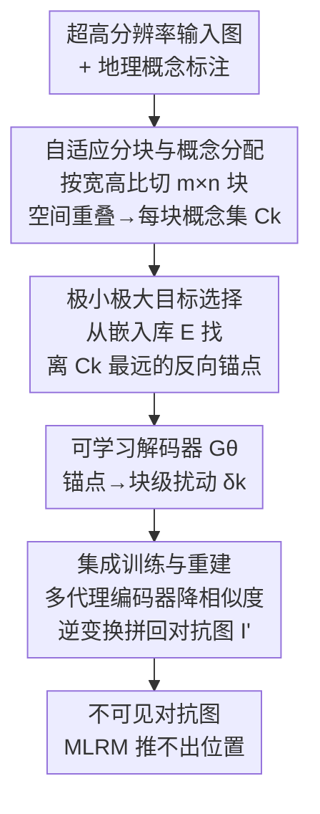

# Disrupting Hierarchical Reasoning: Adversarial Protection for Geographic Privacy in Multimodal Reasoning Models

**会议**: ICLR 2026  
**OpenReview**: [https://openreview.net/forum?id=5S6YTG9dL0](https://openreview.net/forum?id=5S6YTG9dL0)  
**代码**: 无（仅有 Project Page）  
**领域**: AI安全 / 隐私保护 / 多模态对抗  
**关键词**: 地理隐私、多模态推理模型、对抗扰动、概念感知、层级推理

## 一句话总结
针对 GPT-o3、GPT-5、Gemini 2.5 Pro 等多模态推理模型能从个人照片"层层推理"出精确地理位置的隐私威胁，本文提出 ReasonBreak——一个用"概念感知"对抗扰动去破坏推理链的防御框架，并发布 GeoPrivacy-6K 数据集，在 7 个顶级模型上把街区级隐私保护率近乎翻倍（33.5% vs 16.8%）。

## 研究背景与动机

**领域现状**：以 GPT-o3、Gemini 2.5 Pro 为代表的多模态大推理模型（MLRM）已经能从一张普通生活照里推断出拍摄地点，准确度据称是非专家人类的 21 倍。它们的做法不是简单的"图像→标签"映射，而是执行一条思维链（CoT）：先从植被判断大洲，再从建筑风格缩小到国家，最后靠招牌、店面、喷泉这类细粒度环境线索锁定具体街区——一条层层递进的地理推理链。这让随手发的社交媒体照片变成了严重的隐私泄露源，在 GDPR、CCPA 等法规下属于隐私侵犯。

**现有痛点**：现有的隐私保护对抗扰动方法（如 AnyAttack、M-Attack）都是为传统感知模型（人脸识别等"图像直接映射标签"的任务）设计的。它们施加**全局均匀噪声**、聚焦于视觉显著的前景区域，对 MLRM 这种多步推理过程根本不起作用——因为 MLRM 利用的恰恰是被这些方法忽略的、超高分辨率图像里的背景细节和环境线索。

**核心矛盾**：感知攻击只需把特征表示 $\phi_v(I)$ 推过一条决策边界即可成功；但推理是一条递归依赖链，每一步 $r_i$ 既依赖正确识别出的视觉概念，又依赖之前所有推理步骤。均匀噪声无法精准命中支撑某个推理步骤的关键概念，自然撼动不了整条链。

**本文目标**：设计一种专门破坏 MLRM 层级地理推理的对抗防御，要求扰动不可见（$\|\delta\|_\infty \le \epsilon$）、黑盒可迁移（防御者拿不到目标模型参数），并能在超高分辨率图像上工作。

**切入角度**：作者的关键洞察是——有效破坏地理推理需要的扰动必须**对齐概念层级**，而不是均匀噪声。因为推理链"概念依赖 + 顺序依赖"的耦合使其异常脆弱：早期某一个概念 $c_k$ 被污染，错误不会局部停留，而是沿后续推理级联放大、导致整条链坍塌。

**核心 idea**：把有限的对抗预算精准投放到推理链所依赖的关键视觉概念上，让被针对的推理步骤"失效"并级联崩溃，而不是去做泛泛的感知扰动。

## 方法详解

### 整体框架
ReasonBreak 要解决的是"给一张超高分辨率个人照片，生成一张几乎看不出差别、但能让 MLRM 推不出位置的对抗图"。整体分三个阶段串行：先把图像**自适应分块并给每块分配地理概念**，再对每块做**极小极大目标选择**找出一个"概念反向锚点"（hard-negative prior），用它去条件化一个可学习解码器合成该块专属的扰动，最后把所有扰动块**重建**回完整高分辨率对抗图。整个生成器通过在多个代理 CLIP 编码器上**集成训练**来保证黑盒迁移性。

### 关键设计

**1. 自适应分块与概念分配：让扰动精确落在每块真正承载的地理概念上**

均匀全局扰动失效的根本原因，是它没有区分图像里哪些局部承载了支撑推理的关键概念。本文借鉴 MLLM 处理高分辨率图时"切 tile 再压缩送编码器"的做法，提出自适应分块：把图像 $I$ 切成 $m^* \times n^*$ 的块网格，网格的选取目标是让块的宽高比 $m/n$ 最贴近原图宽高比 $W/H$，从而在缩放分块时把形变降到最小：

$$(m^*, n^*) = \arg\min_{(m,n)} \left| \frac{W}{H} - \frac{m}{n} \right|, \quad mn \le N_{max}$$

每块 $B_k$ 在代理编码器的标准输入分辨率 $h$ 下处理。分块后做概念分配：把每块映射回原图坐标，与标注的概念边界框 $g$ 求交集，交到的概念组成该块的概念子集 $C_k$。对于没和任何概念框相交的块（如天空、马路），不是放弃，而是**保守地赋予整张图的全部概念**——保证所有块都被扰动，连背景块也用来干扰模型的图像级整体推理。这一步是后续精准打击的前提：只有把概念定位到块，才能为每块选出对应的反向锚点。$N_{max}$ 的取值很关键：太粗（≤4）会让招牌和建筑风格这类不同概念纠缠进同一块，太细（>64）又会把地标建筑碎成无意义的纹理碎片，实验证明 $16\le N_{max}\le 64$ 最优。

**2. 极小极大目标选择：用"概念虚空"锚点把推理步骤彻底作废而非仅仅误导**

作者强调目标是"瓦解（dismantle）"而非"误导（mislead）"模型推理。对每块 $B_k$，要生成一个能让其整个概念集 $C_k$ 全部失效的扰动。做法是从一个预先算好的嵌入库 $E$ 中，挑出一个对块内**所有**概念都最大程度远离的 hard-negative prior：

$$e^k_{prior} = \arg\min_{e \in E} \max_{c \in C_k} \cos(\psi_t(c), e)$$

这里 $E$ 由冻结图像编码器 $\psi_i$ 对数据集 $D$ 编码得到（$E = \psi_i(D)$），是一个庞大多样的真实语义嵌入"词表"而非一对一匹配库；$\psi_t$ 是冻结文本编码器。内层 $\max$ 找出某候选 $e$ 与块内最接近的那个概念的相似度，外层 $\min$ 则选出"即便对最接近的概念也仍然很远"的候选——得到的 $e^k_{prior}$ 是嵌入空间里一个"概念虚空"，离该块任何正确解读都很远。它不是损失函数里的硬目标，而是作为一个抽象的"语义指令"去条件化解码器：

$$\delta_k = G_\theta(e^k_{prior}), \quad B'_k = B_k + \delta_k, \quad \|\delta_k\|_\infty \le \epsilon$$

值得注意的是解码器 $G_\theta$ **不直接吃图像块 $B_k$**，它充当一个"语义→视觉"翻译器，学习从抽象概念指令到像素级扰动的通用映射；图像内容只通过决定概念集 $C_k$、进而决定 $e^k_{prior}$ 来间接影响扰动。消融显示这个 minimax 选择在街区级带来 +25.0% 的提升，证明把扰动指向"概念反方向"远比传统无目标扰动更能击穿层级推理。

**3. 集成训练与重建：跨代理模型保证黑盒迁移，再拼回完整高分辨率图**

防御场景是黑盒迁移攻击——拿不到目标 MLRM 的参数，只能靠代理模型。为保证扰动能迁移到 GPT-o3、Gemini 这类闭源模型，本文在一组代理视觉编码器 $S$（CLIP ViT-B/32、B/16、H/14、L/14）上做集成训练，目标是最小化原始块与扰动块在所有代理编码器下表示的余弦相似度：

$$L(\theta) = \mathbb{E}_{s\sim S}\left[\frac{1}{N}\sum_{k=1}^{N}\cos(\psi_s(B_k), \psi_s(B'_k))\right]$$

其中 $\psi_s$ 是代理模型 $s$ 的视觉编码器，$N = m^*n^*$。这里形成双重作用：hard-negative prior 通过条件化决定扰动的合成方向，而这个无目标损失则在多个代理模型上同时拉低原图与扰动图的表示一致性，从而提升迁移鲁棒性。生成完所有扰动块后，用逆变换 $T^{-1}$ 把它们重新拼装成完整分辨率的对抗图 $I'$。

### 损失函数 / 训练策略
解码器 $G_\theta$ 沿用 AnyAttack 架构并以其预训练权重初始化，在 GeoPrivacy-6K 上训练 2 个 epoch，$N_{max}=64$，AdamW 优化器、学习率 $1\times10^{-5}$，单张 A800 80GB 完成。对测试集 DoxBench 中不在训练集的图，用 Gemini 2.5 Pro 走同样的三级标注协议自动抽取概念 $C$ 和边界框 $g$，保证训练/测试的概念-区域映射一致。约束为 $L_\infty$，$\epsilon \in \{8/255, 16/255\}$。

## 实验关键数据

### 主实验
在 DoxBench（500 张带真值坐标的真实图像）上评测，按 region / metro / tract（街区邻里级）/ block（街道级）四个地理粒度计算隐私保护率（PPR = 扰动后正确预测减少的比例）。下表为 $\epsilon=16/255$ 下 7 个模型平均的 Top-1 PPR（关键的 tract、block 级）：

| 粒度 | ReasonBreak | 最强 baseline | 提升 |
|------|------|------|------|
| Tract（邻里级） | 33.8% | 19.4% | +14.4% |
| Block（街道级） | 33.5% | 16.8% | 近乎翻倍 |

逐模型看代表性结果（Top-1 Tract PPR）：GPT-o3 上 31.7%（AnyAttack 25.6%、M-Attack 15.9%）；Gemini 2.5 Pro 上 30.8%（baseline 约 20%），且在 Top-1 Block 级 baseline 对 Gemini 完全失效（0.0%）时本文仍达 23.3%。说明本文对闭源商用 API 尤其有效。

### 消融实验
针对 InternVL 3.0 72B 的 minimax 目标选择消融（Top-1 PPR）：

| 配置 | Region | Metro | Tract | Block |
|------|------|------|------|------|
| w/ Minimax | 10.8 | 0.0 | 33.3 | 58.3 |
| w/o Minimax | 9.3 | 0.0 | 26.7 | 33.3 |
| 提升 Δ | +1.5 | — | +6.6 | +25.0 |

自适应分块的 $N_{max}$ 消融呈单峰曲线：太粗（≤4）概念纠缠、太细（>64）概念碎片化，最优区间 $16\le N_{max}\le 64$。

### 关键发现
- minimax 目标选择是细粒度保护的主力：在街区级带来 +25.0%，证明"指向概念反方向"远胜无目标扰动。
- $N_{max}$ 存在明确 trade-off：粗粒度下宏观指标（Region/Metro）仍较好，但 Tract/Block 这类依赖细粒度概念的指标需要恰当分块才能保护好。
- 反直觉现象：对 InternVL，更小扰动（$\epsilon=8$）在 Tract/Block 级保护反而**强于**更大扰动（$\epsilon=16$），这在感知型 baseline 上从未出现，暗示攻击推理与攻击感知存在本质不同的机制。
- 失败案例只有 2 张：都含显著、机器可读、直接写明地点的文字（如门牌号、Google 字样），此时 MLRM 绕过概念推理链、改用 OCR 直接读出地点——本文不针对 OCR 模态，这是正交问题。

## 亮点与洞察
- **从"攻击感知"转向"攻击推理"的范式转变**：以往对抗隐私都在扰动特征表示越过决策边界，本文第一次显式把推理链的"概念依赖 + 顺序依赖"脆弱性当作攻击面，利用早期概念污染会级联放大的特性，用有限预算撬动整条链坍塌——这个视角可迁移到任何依赖 CoT 的多模态推理攻防。
- **解码器不吃图像、只吃概念指令**：把生成器设计成"语义→视觉"翻译器，图像内容只通过 $C_k\to e^k_{prior}$ 间接起作用，这种解耦让一个轻量解码器就能学到从抽象概念到像素扰动的通用映射，巧妙且省算力。
- **概念虚空（minimax hard-negative prior）**：用 $\min_e\max_c$ 选出对块内所有概念都最远的锚点，等于在嵌入空间里给模型指一个"哪里都不是"的方向，比指向某个错误地点更彻底地瓦解推理。

## 局限与展望
- **不对抗 OCR/文本直读**：作者明确承认，当图像含直接写明地点的机器可读文字时，MLRM 切换到 OCR 模态，本文在不可见约束下无能为力；防御文字识别需要可见的、针对文本的修改，是留给未来的正交问题。
- **依赖概念标注与代理编码器**：方法需要每张图的层级概念标注和边界框（测试集靠 Gemini 自动标注），标注质量和代理模型与目标模型的表示差异都会影响迁移效果。
- **反直觉 $\epsilon$ 缩放未被充分解释**：InternVL 上小扰动反而更强保护的现象只在附录定性分析，机制尚未讲透，可能影响对"扰动预算如何选"的实际指导。
- 评测用 PPR（正确预测减少比例）而非攻击成功率，虽更精确但数值偏低，跨工作直接比较时需注意口径差异。

## 相关工作与启发
- **vs AnyAttack / M-Attack（感知型对抗）**：它们用全局均匀扰动、聚焦视觉显著前景，把图像直接当"图→标签"处理；本文针对的是多步推理链所依赖的细粒度背景概念，故在 tract/block 这类需要细粒度推理的粒度上大幅领先，而在不依赖细粒度的 Region 级差距较小。
- **vs DoxBench**：DoxBench 揭示了 MLRM 地理推理的隐私威胁并提供评测协议（500 图、四级粒度），本文在其上构建防御并复用其评测标准与"Where is it?"提示。
- **vs 传统人脸隐私对抗**：那些方法防的是身份识别这类感知任务，假设是单步映射；本文指出推理级威胁需要"推理级干预"这一全新防御范式。

## 评分
- 新颖性: ⭐⭐⭐⭐⭐ 首次把对抗隐私从"攻击感知"推进到"攻击层级推理"，概念感知扰动 + minimax 虚空锚点的组合是真正新的攻击面。
- 实验充分度: ⭐⭐⭐⭐ 覆盖 7 个 SOTA 模型含闭源 API、两档 $\epsilon$、两项消融与失败分析，但部分反直觉现象只在附录定性解释。
- 写作质量: ⭐⭐⭐⭐ 理论动机—方法—实验逻辑清晰，公式与图示到位。
- 价值: ⭐⭐⭐⭐⭐ 直面 MLRM 地理隐私这一现实且合规相关的威胁，并配套发布 GeoPrivacy-6K 数据集，推动隐私防御研究。

<!-- RELATED:START -->

## 相关论文

- [\[ICLR 2026\] Doxing via the Lens: Revealing Location-related Privacy Leakage on Multi-modal Large Reasoning Models](doxing_via_the_lens_revealing_location-related_privacy_leakage_in_vlms.md)
- [\[ICLR 2026\] Benchmarking Empirical Privacy Protection for Adaptations of Large Language Models](benchmarking_empirical_privacy_protection_for_adaptations_of_large_language_mode.md)
- [\[ICLR 2026\] Reasoning or Retrieval? A Study of Answer Attribution on Large Reasoning Models](reasoning_or_retrieval_a_study_of_answer_attribution_on_large_reasoning_models.md)
- [\[ICLR 2026\] AdvChain: Adversarial Chain-of-Thought Tuning for Robust Safety Alignment of Large Reasoning Models](advchain_adversarial_chain-of-thought_tuning_for_robust_safety_alignment_of_larg.md)
- [\[ICLR 2026\] Strategic Obfuscation of Deceptive Reasoning in Language Models](strategic_obfuscation_of_deceptive_reasoning_in_language_models.md)

<!-- RELATED:END -->
