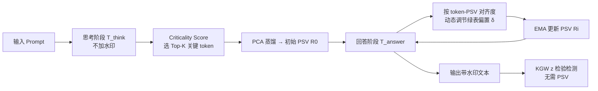

# Distilling the Thought, Watermarking the Answer: A Principle Semantic Guided Watermark for Reasoning Large Language Models

**会议**: ICLR 2026  
**OpenReview**: [https://openreview.net/forum?id=T6NVogsXCZ](https://openreview.net/forum?id=T6NVogsXCZ)  
**代码**: 论文称已开源（"source code is available here"），仓库链接见原文  
**领域**: LLM 安全 / 文本水印 / 推理大模型  
**关键词**: 文本水印, 推理大模型, 思维链, 语义引导, KGW, 可追溯性  

## 一句话总结
ReasonMark 把推理大模型的生成拆成「不加扰的思考阶段」和「打水印的回答阶段」，从思考阶段蒸馏出一个主语义向量（PSV）来动态调节绿表 token 的水印强度，从而在几乎不损伤推理准确率的前提下嵌入可检测、抗攻击的水印。

## 研究背景与动机
**领域现状**：文本水印（以 KGW 为代表）通过把词表伪随机切成绿表/红表、对绿表 token 加一个固定 logit 偏置 $\delta$，让生成文本统计上偏向绿表，检测端用 z 检验即可判定是否带水印。这套范式在通用 LLM 上已经相当成熟。

**现有痛点**：推理大模型（RLLM，如 DeepSeek-R1、Qwen3）会先生成一长串思维链再给出答案，而现有水印对这类模型水土不服。token 类方法（KGW、EWD、SWEET）的伪随机偏置会扰乱思维链的逻辑连贯性，直接拖垮最终答案的正确率；语义类方法（SemStamp、SimMark）质量更好但要么引入辅助模型、要么做多次采样（如 WaterMax），带来显著延迟。

**核心矛盾**：水印强度（可检测性/鲁棒性）、文本质量、计算开销三者之间长期存在难以调和的权衡——想检得准就得加大扰动伤质量，想保质量就得多采样或上辅助模型增延迟。在「推理正确率」这个新维度上，这个矛盾被进一步放大。

**本文目标**：为推理大模型设计一套水印，既不破坏其思维链的逻辑完整性、不掉推理准确率，又能维持高检测 AUC 和抗攻击鲁棒性，且延迟开销可忽略。

**核心 idea**：**「蒸思想、印答案」（Distilling the Thought, Watermarking the Answer）**——完全保护思考阶段不加任何水印扰动，只对回答阶段打水印；并把思考阶段中真正承载语义的关键 token 蒸馏成一个连续的主语义向量（PSV），让水印强度跟着 token 与 PSV 的语义对齐度走，使水印"顺着模型自己的逻辑流"嵌入而非对抗它。

## 方法详解

### 整体框架
ReasonMark 先用结构分隔符（`<think>`/`</think>`）把生成序列切成思考阶段 $T_{think}$ 和回答阶段 $T_{answer}$；思考阶段原样保留，只做分析：用一个 **Criticality Score** 从思维链里挑出 Top-K 关键 token，再用 PCA 把它们蒸馏成初始主语义向量 $R_0$。进入回答阶段后，每生成一个 token 都按其嵌入与当前 PSV 的余弦相似度动态调节绿表偏置 $\delta_{i,w}$，并用指数滑动平均实时更新 PSV，使其追踪局部语义。检测端无需任何改动，沿用 KGW 的 z 检验即可。

### 关键设计
**1. 阶段解耦：只印答案、不动思考。** 这是全文的总纲。作者用一个基于标记的分割算法定位思维链结束位置 $k$，把序列 $T=\{t_1,\dots,t_S\}$ 切为思考阶段 $T_{think}=\{t_i\}_{i=1}^{N}$ 与回答阶段 $T_{answer}=\{t_i\}_{N+1}^{S}$。思考阶段一个偏置都不加，从根上避免了 token 类方法"伪随机扰动污染推理"的问题，这也是它能把数学准确率维持到接近无水印基线的关键原因。思考阶段不是被丢弃，而是被当作"水印的语义指南针"来源。

**2. Criticality Score：从思维链里挑出真正承载语义的 token。** 作者先给出一个理论刻画（Theorem 2.2）：最优关键 token 集应在 $|C|\le K$ 约束下，最大化"因果影响 + 竞争显著性"的联合度量。但其中的因果散度需要对全部参数求梯度，对大模型不可行，于是设计了可计算的代理分数。**全局因果贡献 GCC** 衡量一个词通过在因果关联的多步里持续保持高概率、从而间接塑造推理轨迹的能力：
$$\text{GCC}(w)=\sum_{i=1}^{N}\Big(P_i(w)\cdot\lambda_i\cdot\sum_{j=i+1}^{M}\alpha_{i\to j}\,P_j(w)\Big)$$
其中 $\lambda_i=\text{JS}(P_i\Vert P_{i-1})$ 用相邻步分布的 JS 散度捕捉"推理拐点"（散度大说明此处是关键转折），$\alpha_{i\to j}$ 是用分布间余弦相似度归一化后的语义影响权重，让早期关键步的影响合理传播到后续。**竞争持续性评分 CPS** 则奖励那些在激烈竞争的选择点上胜出、且在后续步里持续保持高排名的词：
$$\text{CPS}(w)=\sum_{i=1}^{N}\Big(S(t_i)^{-1}\cdot(1-\Delta_i(w))\cdot\sum_{j=i+1}^{M}\mathbb{I}(w\in\text{top}_k(P_j))\Big)$$
$S(t_i)^{-1}=(-\log P_i(t_i))^{-1}$ 用 surprisal 的倒数加权，奖励"高置信、更有意图"的选择；$\Delta_i(w)$ 衡量该词在第 $i$ 步面临的竞争压力（与最强对手的 logit 间距，间距越小竞争越激烈、奖励越高）。两者相乘得到最终分数 $\text{CS}(w)=\text{GCC}(w)\cdot\log(1+\text{CPS}(w))$，取 CS 最高的 K 个 token 作为关键 token 集 $C'$。

**3. 从关键 token 到 PSV：用 PCA 提主语义方向。** 离散的关键 token 集还不足以表达推理中整体的、关系性的逻辑，作者把它们的嵌入堆成矩阵 $H=[E(w_1),\dots,E(w_K)]^T\in\mathbb{R}^{K\times d}$，做 PCA 取第一主成分作为初始 PSV：$R_0=v_1=\text{PCA}_1(H)$。第一主成分是这批最关键 token 嵌入方差最大的方向，捕捉了它们最显著的共享语义、也即模型推理的主轴，充当全局语义罗盘。

**4. 语义自适应水印强度 + 动态 PSV 更新。** 回答阶段每一步仍按上一 token 的哈希把词表切成绿表 $V_g$/红表 $V_r$，但绿表偏置不再固定，而是按候选 token 与当前 PSV 的对齐度给出 token 专属偏置：
$$s_{w,i}=\frac{E(w)\cdot R_i}{\Vert E(w)\Vert\,\Vert R_i\Vert},\qquad \delta_{i,w}=\delta_0+\delta_\lambda\cdot s_{w,i-1}$$
$\delta_0$ 是基础强度、$\delta_\lambda$ 控制对语义对齐的敏感度。语义上越契合推理轨迹的绿表 token 偏置越强，强化逻辑一致性；若某个高概率的合适 token 落进红表，由于绿表替代项的偏置相对温和，质量也不会被严重拖垮。生成完 $t_i$ 后用指数滑动平均更新 PSV：$R_i=(1-\beta_i)R_{i-1}+\beta_i E(t_i)$，其中更新率 $\beta_i=\beta_{base}\cdot s_{t_i,i-1}$ 同样自适应——贡献语义越大的新 token 推动 PSV 变得越快，从而在锚定初始推理的同时平滑跟随答案的话题演进。值得一提的是，检测端完全无状态：不需要 PSV、不需要原始 prompt，性能增益纯粹来自"每步能从候选里找出更多有效绿 token、压低红 token 占比"。

## 实验关键数据
模型用 Qwen3-32B 与 DeepSeek-R1-Distill-Qwen-32B；数据集覆盖文本补全（C4）、机器翻译（WMT16 DE-EN）、数学推理（AIME、GSM8K）；指标含 PPL（↓）、BLEU/mACC（↑）、检测 AUC（↑）。

### 主实验表格（节选，Qwen3-32B）

| 方法 | C4 PPL | C4 AUC | WMT BLEU | AIME mACC | AIME AUC |
|------|--------|--------|----------|-----------|----------|
| 无水印 | 10.55 | - | 7.851 | 70.03 | - |
| KGW | 12.15 | 98.78 | 7.351 | 69.23 | 98.16 |
| EWD | 11.89 | 99.22 | 7.413 | 69.52 | 99.91 |
| SemStamp | 11.42 | 97.85 | 7.912 | 68.90 | 98.95 |
| SimMark | 11.18 | 97.95 | 8.191 | 69.05 | 99.10 |
| **ReasonMark** | **10.31** | **99.31** | **9.916** | **69.86** | **99.95** |

ReasonMark 的 PPL 几乎追平无水印（10.31 vs 10.55），BLEU 大幅领先所有水印方法，AIME 数学准确率 69.86 逼近无水印基线 70.03，同时检测 AUC 拿到最高。

### 消融实验表格（C4 / Qwen3）

| 变体 | PPL | AUC |
|------|-----|-----|
| 无水印 | 10.55 | - |
| **ReasonMark（完整）** | **10.31** | **99.31** |
| w/o CTs（关键 token 换随机采样） | 12.88 | 99.21 |
| w/o GCC | 11.15 | 99.11 |
| w/o CPS | 11.06 | 98.69 |

去掉关键 token 选择（用随机 token 代替）质量崩得最厉害（PPL 飙到 12.88），说明"有原则的语义选 token"是保质量的核心；去 GCC 主要伤文本质量、去 CPS 主要伤检测 AUC，二者互补且不可或缺。

### 关键发现
- **逻辑完整性可量化保留**：在 AIME/GSM8K 上 mACC 接近甚至略超无水印基线，而多数对手都会掉点，验证"只印答案"确实护住了推理。
- **抗攻击鲁棒性更强**：在 C4/Qwen3 上，词级攻击（删/插/同义替换）后 AUC 仍 >93.5；语义级攻击下翻译攻击 AUC 82.58、改写攻击 70.54，均优于 KGW 等基线——因为水印绑在语义而非句法结构上。
- **开销可忽略**：单次采样即可，延迟增加微乎其微，无需辅助模型或多次生成。

## 亮点与洞察
- **把"推理正确率"纳入水印的评价维度**，并用阶段解耦从机制上解决，而非事后补偿，这是对推理大模型场景痛点的精准切入。
- **检测端零改动**：所有复杂度都压在嵌入侧（PSV 构造与更新），检测仍是标准 KGW z 检验，部署成本极低、向后兼容现有检测基础设施。
- **理论 + 代理的两层设计**：先用 Theorem 2.2 给出最优关键 token 的理想刻画，再用 GCC/CPS 给出可计算近似，把"为什么这么选 token"讲得有据可依。
- **语义对齐既提质量又提检测**：让水印顺着推理方向走，反而能在每步找到更多"既绿又合适"的 token，质量和可检测性不再是零和。

## 局限与展望
- **依赖清晰的思考/回答边界**：方法建立在 `<think>`/`</think>` 这类显式结构分隔符之上，对没有明确思维链标记、或思考与回答交织的模型适用性存疑。
- **指标提升幅度偏小**：摘要强调的 PPL −0.35、BLEU +0.164、mACC +0.67、AUC +0.34% 等增量在绝对数值上较温和，部分来自基线本就接近天花板；WMT 的 BLEU 绝对值整体偏低（个位数），任务设定下的可比性需谨慎看待。
- **PCA 取单一主成分可能过简**：用第一主成分概括整段推理的语义，复杂多主题推理下单向量是否够表达力，论文未深入讨论多成分扩展。
- **仅在 32B 规模、两个模型上验证**：更大/更小模型、非数学推理任务（如代码、Agent 规划）下的泛化性有待补充。

## 相关工作与启发
- **token 类水印**：KGW（绿红表 + 固定偏置）、Unigram、Unbiased、SWEET、EWD、WatMe、MorphMark——本文继承其检测范式但批判其固定偏置伤推理。
- **语义类水印**：SemStamp、k-SemStamp、SimMark、SynthID 等在嵌入空间操作以抗改写，但常需辅助模型或多次采样；ReasonMark 借鉴"语义感知"思想却把开销压到接近 token 类方法。
- **自适应强度**：受 MorphMark（列级平衡效果-质量权衡）启发，但本文进一步细化到 token 级、并用 PSV 提供语义方向。
- **启发**：对"先思考后回答"的生成范式，把内部推理当作可蒸馏的语义资源去引导下游行为（而非简单丢弃），这一思路或可迁移到推理大模型的其他可控生成/对齐任务。

## 评分
- **新颖性**: ⭐⭐⭐⭐ — 「蒸思想、印答案」的阶段解耦 + PSV 语义引导是针对推理大模型水印的首个专门设计，切入点新且自洽。
- **实验充分度**: ⭐⭐⭐ — 覆盖 4 数据集 2 模型 11 个基线 + 消融 + 攻击鲁棒性较全面，但仅 32B 规模、增量幅度偏小、缺更大模型与代码/Agent 任务验证。
- **写作质量**: ⭐⭐⭐⭐ — 理论铺垫到算法实现逻辑清晰，图 1 流程一目了然，公式与动机对应紧密。
- **价值**: ⭐⭐⭐⭐ — 让推理大模型在不掉准确率的前提下可追溯，检测端零改动、延迟可忽略，对负责任部署有实际意义。
