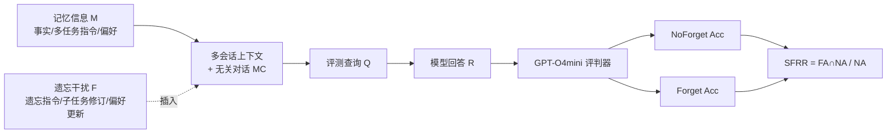

# Do LLMs Forget What They Should? Evaluating In-Context Forgetting in Large Language Models

**会议**: ICLR 2026  
**OpenReview**: [https://openreview.net/forum?id=hcJywRYc3n](https://openreview.net/forum?id=hcJywRYc3n)  
**代码**: [https://github.com/qianyuli123/ICF-Bench](https://github.com/qianyuli123/ICF-Bench)  
**领域**: LLM 安全 / 评测基准  
**关键词**: 上下文遗忘, In-Context Forgetting, 选择性遗忘, 隐私保护, 多轮对话评测, ICF-Bench  

## 一句话总结
本文提出 ICF-Bench——首个系统评测 LLM「上下文内选择性遗忘」能力的基准，用配对的 NoForget/Forget 任务和 SFRR 指标揭示出一个反直觉的事实：模型记得住，却忘不掉，且记忆能力越强并不意味着遗忘能力越强。

## 研究背景与动机
**领域现状**：长上下文与记忆能力是当前 LLM 评测的主战场，LongBench、Scrolls 等基准都在考「模型能否记住、检索、利用历史信息」。这些工作隐含一个假设——所有历史上下文都应该被保留。

**现有痛点**：真实使用中用户经常发出相反的指令：「请忽略前面的内容」「把第二个子任务换成数关键词」「我其实不喜欢东野圭吾，重新推荐」。如果模型无法在推理时主动丢弃过时、冲突或被显式要求遗忘的信息，就会被干扰信息污染，生成低质量甚至泄露隐私的回答。**而「该不该忘、能不能忘」这件事几乎没人系统评测过**。

**核心矛盾**：与遗忘相关的已有研究主要是机器遗忘（machine unlearning），它通过改参数把训练知识从模型里抹掉，属于训练期、永久性删除；而本文关心的是推理期、不动参数、可逆的「上下文遗忘」——两者本质不同。注意力路由、上下文压缩等工作虽触及推理期记忆调控，但要么只忘静态信息，要么只压缩不遗忘，缺乏一个能根据对话演化动态判断「该留还是该忘」的评测框架。

**本文目标**：把「In-Context Forgetting (ICF)」正式定义为——*在不更新参数的前提下，模型选择性遗忘干扰信息、同时保留有用知识的能力*，并造一个覆盖真实场景、可复现的基准来量化它。

**核心 idea**：**(1) 配对设计**——每条数据同时实例化为「无干扰(NoForget)」和「有遗忘干扰(Forget)」两种形态，把「遗忘能力」从「记忆能力本身的随机失败」中剥离出来；**(2) SFRR 指标**——只看「本来答对的样本在加入遗忘干扰后还能不能保持答对」，从而精准隔离遗忘鲁棒性；**(3) 三大现实场景**——指令式遗忘、子任务修订、动态偏好，覆盖用户控制上下文的三类典型诉求。

## 方法详解

### 整体框架
ICF-Bench 把评测建模为一段多会话对话：模型先接收**记忆信息 M**（事实、初始多任务指令或偏好），随后被插入**遗忘干扰 F**（显式遗忘指令 / 子任务修订 / 偏好更新），中间还随机穿插来自 LMSYS-Chat-1M 的无关多会话对话 **MC** 以模拟真实复杂度，最后用查询 **Q** 考察模型回答 **R** 是否正确执行了遗忘。同一条数据跑两遍（带 F 与不带 F），由 GPT-O4mini 按场景化 rubric 自动判分，输出 NA / FA / SFRR 三个指标。

### 关键设计

**1. 配对的 NoForget / Forget 双任务形态：把遗忘能力从记忆能力里剥出来。** 直接看 Forget 任务的准确率会混入两类失败——模型本来就没记住，和模型记住了但没忘掉。本文为每条对话造一对孪生样本：NoForget 形态只给 M、不给 F，考的是基础记忆与指令遵循；Forget 形态注入 F，考的是选择性丢弃。三个场景的判分准则各异——指令式遗忘要求模型在 Forget 任务里显式抹掉被点名的信息 E；子任务修订要求同时完成未改动的旧子任务和被改写的新子任务；动态偏好要求回答与最新偏好对齐而压制旧偏好。这套配对让后续指标可以做差，定位「遗忘」这一独立环节。

**2. SFRR 指标：只追责「本来对、之后错」的样本。** NA 和 FA 度量的是绝对性能，但无法说明遗忘干扰到底破坏了哪些原本处理正确的样本。SFRR（Selective Forgetting Retention Rate）定义为在 NoForget 下答对的样本中、Forget 下仍答对的比例：

$$\text{SFRR}=\frac{\sum_{i=1}^{N}\mathbb{1}\{C(R_i^{\text{NoForget}})=1 \wedge C(R_i^{\text{Forget}})=1\}}{\sum_{i=1}^{N}\mathbb{1}\{C(R_i^{\text{NoForget}})=1\}}$$

其中 $C(\cdot)\in\{0,1\}$ 是答案正误指示。分母把「根本没记住」的样本排除在外，分子要求干扰前后都对，于是 SFRR 越高就代表对遗忘干扰越鲁棒、遗忘越有效。论文实测 SFRR 与 FA 的平均相关系数 0.982、与 NA 仅 0.764，验证了它确实主要刻画「干扰下的鲁棒性」而非「原始记忆力」。

**3. 三场景数据合成：从高质量数据集嫁接出真实遗忘诉求。** 三个场景各取一个成熟数据集做底座，再用 LLM 注入遗忘干扰。指令式遗忘基于 ChatAlpaca 多轮对话，向 M 里插「请遗忘 E」并生成考察 E 是否被压制的 Q；子任务修订基于 FollowBench 的多任务指令，把指令拆成子任务序列后做增删改得到 F；动态偏好基于 PrefEval，把备选项转成更新后的偏好 F、初始偏好作 M。三者都从 LMSYS-Chat-1M 抽无关轮次作 MC 来逼近真实对话复杂度，最终得到 2k 条带标注的多轮对话。

**4. 上下文长度扫描：考察遗忘能力随历史增长如何变化。** 通过往评测查询 Q 之前的上下文里插入不同数量的 LMSYS 无关轮次，把单条数据的前置长度 L 控制到 $\{0.5k,1k,3k,6k,10k,15k,30k\}$ 共 7 档 token，逐档计算 NA/FA/SFRR，从而画出遗忘能力随上下文增长的曲线，揭示长上下文对不同场景遗忘能力的非一致影响。

## 实验关键数据

评测覆盖 8 个开源模型（Mistral-7B、Llama3-8B/70B、Qwen2.5-7B/14B、Mixtral-8x7B、Gemma3-27B、Qwen3-235B-A22B）和 3 个闭源模型（GPT-O3mini、GPT-4o、GPT-5），全部贪婪解码（T=0），由 GPT-O4mini 评判。

### 主实验表格（三场景 NA / FA / SFRR，%）

| 模型 | IF-NA | IF-FA | IF-SFRR | SR-NA | SR-FA | SR-SFRR | DP-NA | DP-FA | DP-SFRR |
|------|------|------|------|------|------|------|------|------|------|
| Mistral-7B | 77.67 | 22.03 | 17.62 | 50.07 | 39.58 | 69.50 | 52.81 | 23.09 | 39.86 |
| Llama3-8B | 90.04 | 4.23 | 3.46 | 58.03 | 45.37 | 71.14 | 61.48 | 18.75 | 25.93 |
| Qwen2.5-7B | 87.02 | 0.50 | 0.23 | 62.82 | 50.85 | 74.05 | 60.84 | 35.46 | 51.99 |
| Qwen2.5-14B | 91.95 | 1.01 | 0.88 | 65.07 | 48.31 | 66.81 | 64.16 | 38.39 | 51.89 |
| Gemma3-27B | 93.16 | 60.16 | 61.66 | 58.31 | 43.94 | 71.79 | 71.81 | 40.82 | 52.93 |
| Llama3-70B | 93.96 | 14.49 | 13.60 | 60.85 | 50.28 | 79.63 | 74.49 | 36.22 | 46.58 |
| Qwen3-235B-A22B | 95.98 | 21.43 | 20.96 | 61.69 | 47.07 | 73.92 | 80.48 | 48.21 | 57.53 |
| GPT-O3mini | 96.48 | 63.08 | 62.88 | 84.51 | 66.08 | 70.93 | 68.62 | 44.90 | 58.18 |
| GPT-4o | 95.77 | 52.52 | 52.52 | 81.41 | 62.31 | 74.45 | 86.10 | 44.90 | 50.07 |
| GPT-5 | 97.18 | 58.85 | 58.80 | 81.69 | 63.18 | 73.69 | 87.37 | 72.45 | 79.12 |

> IF=指令式遗忘, SR=子任务修订, DP=动态偏好。最戏剧化的是 Qwen2.5-7B 在指令式遗忘上 NA 高达 87.02% 却几乎完全无法遵守遗忘指令（SFRR 仅 0.23%）；GPT-5 平均 NA 88.75% 但 FA 跌到 64.83%（−23.92pp）。

### 消融实验表格（提示工程：NoForget Prompt vs Forget Prompt，%）

| 模型 | 策略 | IF-FA | IF-SFRR | SR-FA | SR-SFRR | DP-FA | DP-SFRR |
|------|------|------|------|------|------|------|------|
| GPT-O3mini | NoForget | 63.08 | 62.88 | 66.08 | 70.93 | 44.90 | 58.18 |
| GPT-O3mini | Forget | 78.94 | 76.30 | 70.15 | 72.67 | 59.93 | 62.56 |
| GPT-4o | NoForget | 52.52 | 52.52 | 62.31 | 74.45 | 44.90 | 50.07 |
| GPT-4o | Forget | 70.09 | 71.76 | 64.41 | 75.84 | 66.08 | 66.56 |
| GPT-5 | NoForget | 58.85 | 58.80 | 63.18 | 73.69 | 72.45 | 79.12 |
| GPT-5 | Forget | 74.38 | 74.62 | 65.15 | 74.15 | 76.02 | 76.64 |

> 在提示里显式加「记得遵守遗忘指令」能稳定提升 FA 和 SFRR；但指令式遗忘场景下 NA 略降，暴露记忆与遗忘之间的权衡。

### 关键发现
- **记得住但忘不掉**：所有模型 NoForget 表现都很强，一旦注入遗忘干扰 FA 普遍崩塌，Llama3-8B 在指令式遗忘上从 90.04% 暴跌到 4.23%。
- **记忆与遗忘的非对称性**：NA 随模型规模单调上升，但 SFRR 并不跟随——Gemma3-27B 的 SFRR 反超 Llama3-70B 与 Qwen3-235B-A22B；说明遗忘需要与缩放无关的独立机制（动态注意力重分配、冲突消解、信息压制）。
- **上下文长度效应因场景而异**（GPT-4o 0.5k→30k）：动态偏好 SFRR 从 52.46% 跌到 22.87%，而子任务修订 SFRR 反而从 71.76% 升到 81.50%——长上下文能稀释早期上下文对修订任务的影响。
- **评判器可信**：GPT-O4mini 与三位 NLP 标注者的一致率在 NoForget 上 >89.33%、Forget 上 82.00–95.33%。

## 亮点与洞察
- **问题定义本身就是贡献**：把「遗忘」从训练期的 machine unlearning 干净地切分到推理期、不动参数、可逆的 ICF，填补了一个被长上下文评测系统性忽略的盲区。
- **SFRR 的「条件化」思路值得借鉴**：通过把分母限定在「本来就对」的子集，巧妙地把待测能力从基础能力中解耦，这种配对+条件化的指标设计可迁移到很多「鲁棒性 vs 基础能力」的评测问题上。
- **反直觉结论有实践意义**：「更大不等于更会忘」直接告诉部署方——靠堆参数解决不了隐私遗忘、偏好更新这类需求，得专门设计机制或至少加提示词。
- **提示工程是低成本止血方案**：一句显式遗忘提醒就能显著拉高 SFRR，对生产系统是即插即用的缓解手段。

## 局限与展望
- **场景局限于对话**：当前只覆盖多轮对话三场景，尚未扩展到多文档推理、工具增强 pipeline，泛化性受限（作者列为 future work）。
- **只诊断不开方**：论文系统揭示了问题，但除了简单提示工程外没有提出系统性的改进方法；作者计划探索注意力级调制、表示解耦、架构级遗忘门。
- **依赖 LLM 评判器**：虽然做了人工一致性验证，但 Subtask Revision 的 Forget 一致率仅 82%，自动评判在复杂多任务场景仍可能引入偏差。
- **合成数据的真实性**：遗忘干扰由 LLM 注入到现成数据集上，与真实用户自发的遗忘诉求在分布上可能有差距。

## 相关工作与启发
- **机器遗忘（Machine Unlearning）**：梯度上升、certified removal、子空间投影等都在改参数抹训练知识，与 ICF 推理期、可逆的定位形成清晰对照，本文把二者边界划清。
- **长上下文基准**：LongBench/V2、Scrolls 只考「记住什么」，本文恰好补上「该忘什么」这一对偶问题，二者可组成更完整的上下文管理评测谱系。
- **推理期遗忘机制**：Forgetting Transformer、上下文压缩、注意力路由等提供了「怎么忘」的候选机制，而 ICF-Bench 提供了「忘得好不好」的统一标尺，两条线天然互补。
- **启发**：这套「配对样本 + 条件化指标」的评测范式，可推广到诸如「指令冲突消解」「偏好漂移跟踪」「越权信息压制」等一系列需要把目标能力从基础能力里剥离的安全/对齐评测。

## 评分
- **新颖性**: ⭐⭐⭐⭐⭐ 首个系统化定义并评测「上下文内选择性遗忘」的工作，问题切分与 SFRR 指标设计都很干净，填补明确空白。
- **实验充分度**: ⭐⭐⭐⭐ 覆盖 11 个模型、3 场景、7 档上下文长度、提示工程消融、指标相关性与人工一致性验证，相当扎实；扣分在于只诊断未给系统方法、场景限于对话。
- **写作质量**: ⭐⭐⭐⭐ 动机清晰、图表完整、指标定义严谨，三场景叙事直观易懂。
- **价值**: ⭐⭐⭐⭐⭐ 揭示的「记忆-遗忘非对称性」对隐私保护、用户自主与个性化系统都有直接警示，基准与代码开源，可被社区直接复用与扩展。

<!-- RELATED:START -->

## 相关论文

- [\[ICLR 2026\] LLMs on Trial: Evaluating Judicial Fairness for Large Language Models](llms_on_trial_evaluating_judicial_fairness_for_large_language_models.md)
- [\[ICLR 2026\] In-Context Watermarks for Large Language Models](in-context_watermarks_for_large_language_models.md)
- [\[ICLR 2026\] Steering Evaluation-Aware Language Models To Act Like They Are Deployed](steering_evaluation-aware_language_models_to_act_like_they_are_deployed.md)
- [\[ACL 2026\] Forget What Matters, Keep the Rest: Selective Unlearning of Informative Tokens](../../ACL2026/llm_safety/forget_what_matters_keep_the_rest_selective_unlearning_of_informative_tokens.md)
- [\[ICLR 2026\] PropensityBench: Evaluating Latent Safety Risks in Large Language Models via an Agentic Approach](propensitybench_evaluating_latent_safety_risks_in_large_language_models_via_an_a.md)

<!-- RELATED:END -->
