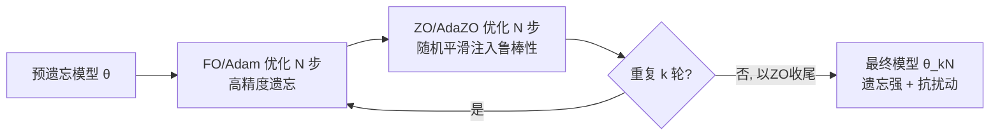

# Downgrade to Upgrade: Optimizer Simplification Enhances Robustness in LLM Unlearning

**会议**: ICLR 2026  
**OpenReview**: [https://openreview.net/forum?id=Sswng2ToR4](https://openreview.net/forum?id=Sswng2ToR4)  
**代码**: [https://github.com/OPTML-Group/Unlearn_Optimizer](https://github.com/OPTML-Group/Unlearn_Optimizer)  
**领域**: LLM Safety / Machine Unlearning / Optimization  
**关键词**: LLM unlearning, 鲁棒遗忘, 优化器, 零阶优化, 随机平滑, 权重量化, relearning attack  

## 一句话总结
本文从"优化器选择"这一全新视角研究 LLM unlearning 的鲁棒性，发现把优化器"降级"（用零阶或梯度压缩方法）反而能让遗忘更抗权重扰动，并据此提出一阶-零阶混合优化器，在不牺牲遗忘效果的前提下显著提升鲁棒性。

## 研究背景与动机
**领域现状**：LLM unlearning 旨在"外科手术式"地抹掉模型对特定数据/知识（隐私、版权、有害能力）的记忆，同时保留通用能力，避免从头重训。GradDiff、NPO、RMU 等算法已能在标准评测上做到既忘得干净又保住效用。

**现有痛点**：遗忘效果很"脆"。后处理扰动——比如在少量遗忘样本上微调几十步的 relearning attack，或仅仅做个 4-bit 权重量化——就能让被抹掉的知识重新浮现，遗忘形同虚设。

**核心矛盾**：已有的鲁棒 unlearning 工作几乎都在"问题层/目标层"动刀：先假设一个具体的脆弱性来源，再针对性地改 unlearning 目标。比如 Fan et al. 把鲁棒遗忘建成对抗 relearning 的 min-max 问题并套上 SAM，Wang et al. 用 IRM 抵抗无关微调，Tamirisa et al. 用元学习抵抗权重篡改。这些方法本质都在改写优化目标，而**基础优化器本身（与目标、算法无关）对鲁棒性的作用从未被系统研究过**。一个耐人寻味的线索是：单纯调大学习率就能提升抗量化鲁棒性，暗示优化器层面藏着更深的联系。

**本文目标**：回答 (Q) 优化器的选择如何影响 unlearning 鲁棒性？什么优化器能在不损害遗忘效果的前提下提升鲁棒性？

**核心 idea**：**【优化器"等级"假说】** 作者把优化器按其利用的梯度信息"等级"排序——二阶（Hessian）> 一阶（梯度）> 零阶（仅函数值）；同阶内压缩梯度（如 signSGD）又比不压缩的低一档。**反直觉的核心发现是：降级优化器会升级鲁棒性**——零阶/梯度压缩方法虽然更新更"糙"更噪，却会把模型收敛到损失景观中更难被扰动的"盆地"，从而抵抗后续扰动。

## 方法详解

### 整体框架
论文先用一个统一的"优化器等级"框架解释为何降级有用：梯度压缩让量化算子充当"去噪器"，零阶估计在数学上等价于求解原问题的**随机平滑（RS）**版本，天然把噪声注入优化过程从而带来抗扰动能力。但纯零阶遗忘不够精确、效用受损。于是作者提出 **FO-ZO 混合优化器（Hybrid）**：交替进行 N 步一阶（Adam）和 N 步零阶（AdaZO）更新，并以零阶轮收尾，把一阶的遗忘精度和零阶的鲁棒性"取两者之长"。

### 关键设计

**1. 优化器等级的两个维度：跨阶与同阶降级。** 作者把"降级"拆成两条线索来量化。跨阶（inter-order）上，零阶（ZO）是一阶（FO）的降级，FO 又是二阶（SO）的降级；同阶（intra-order）上，梯度压缩的 signSGD/signAdam 是标准 SGD/Adam 的降级。FO 更新规则为 $\theta_{t+1}=\theta_t-\eta m_t$，其中 $m_t$ 是 Adam 的动量或 SGD 的梯度。这套"等级"语言让"优化器影响鲁棒性"变成一个可系统比较的问题，而非零散的启发式观察。

**2. 梯度压缩 = 自带去噪器。** 梯度压缩用 N-bit 量化算子替换全精度梯度：$\theta_{t+1}=\theta_t-\eta\,Q(m_t;N)$，当 $N=1$ 时 $Q(m_t;1)=\mathrm{sign}(m_t)$ 即退化为 signSGD/signAdam。这种更新虽信息更少，却仍有收敛保证。它提升抗量化鲁棒性的直觉很漂亮：当后处理再做权重量化时，量化算子 $Q(\cdot)$ 把被扰动的权重映射回相同的离散 bit 值，相当于一个"去噪器"，因此用压缩梯度训练出的模型天然容忍权重扰动。

**3. 零阶估计 = 随机平滑，天生抗扰动。** 零阶优化只用函数值的有限差分估梯度：$\hat\nabla f(x)=\frac{1}{q}\sum_{i=1}^{q}\frac{f(x+\mu u_i)-f(x-\mu u_i)}{2\mu}u_i$，其中 $u_i$ 是随机方向、$\mu$ 是扰动步长。关键理论桥梁是：该估计是**平滑目标** $f_\mu(x):=\mathbb{E}_u[f(x+\mu u)]$ 梯度的无偏估计，即 $\nabla f_\mu(x)=\mathbb{E}_u[\hat\nabla f(x)]$。也就是说，用 ZO 做遗忘等价于求解原问题的随机平滑版本，把随机噪声内生地融进优化——而最小化 RS 型目标本就被证明能提升 unlearning 鲁棒性。实现上作者从单位球（而非高斯）采样方向以降方差，并采用 SOTA 的 AdaZO 进一步降方差、提速。线性模式连通性（LMC）实验进一步证实：signSGD/signAdam 与 Adam 收敛到同一盆地，而 **ZO 与 Adam 不连通，落到了一个独立的盆地**，这正是其独特鲁棒性的来源。

**4. FO-ZO 混合：领导者-跟随者博弈。** 纯 ZO 噪声大、遗忘弱、效用差。混合策略让 FO（Adam）先跑 N 步给出高质量初始化，再让 ZO（AdaZO）跑 N 步注入鲁棒性，交替进行并以 ZO 收尾。作者把它解释为一个**领导者-跟随者博弈（即双层优化）**：因为鲁棒性是首要目标，ZO 应作"领导者"，FO 作"跟随者"提供高保真初始化、降低 ZO 估计方差。消融证实 FO 步数=ZO 步数（如各 20 步）最优——ZO 偏少则鲁棒性领导力不足，ZO 偏多则遗忘精度（跟随者保真度）下降。

## 实验关键数据

### 主实验
在 MUSE（Harry Potter 书籍 / BBC 新闻，指标 VerbMem、KnowMem on $D_f$ 越低越好，KnowMem on $D_r$ 越高越好）、WMDP（有害知识移除，WMDP-Bio 越低 / MMLU 越高越好）、TOFU（虚构作者遗忘）上验证。

TOFU forget10 场景（NPO，越低越好的 Prob./Rouge，越高越好的 MU）：

| 优化器 | Prob. ↓ | Rouge ↓ | MU ↑ |
|---|---|---|---|
| Original（遗忘前） | 99.0 | 99.8 | 63.2 |
| Retrain（重训上界） | 14.8 | 39.9 | 61.3 |
| Adam（FO 基线） | 0.0 | 0.0 | 53.2 |
| ZO | 30.4 | 41.7 | 50.3 |
| **Hybrid（本文）** | **0.0** | **1.8** | **61.5** |

Hybrid 把遗忘做到与 Adam 相当（Prob.=0），同时把效用 MU 从 Adam 的 53.2 拉回到 61.5（接近重训上界），且后续 relearning 中 Prob./Rouge 保持最低。

### 鲁棒性对比（定性结论，来自 MUSE/WMDP 图示）
- **抗 4-bit 量化**：signAdam/signSGD/RS 都比 Adam 更鲁棒；ZO 量化后 $D_f$ 上 VerbMem/KnowMem 最低（最鲁棒）但效用最差；Hybrid 量化前后都最优，鲁棒性甚至超过显式设计鲁棒目标的 SAM。
- **抗 relearning（Relearn100）**：FO RS 在一阶降级里最好，ZO 在所有方法里 $D_f$ 残留最低；Hybrid 在 GradDiff 和 NPO 上 relearn 后 VerbMem/KnowMem 都显著更低。
- **WMDP**：不考虑 relearning 时 ZO 因方差大反而最差；一旦考虑 relearning，ZO 的鲁棒性优势凸显，大 epoch 时甚至超过 Hybrid。Hybrid 全程稳定超过 SAM 等基线。

### 关键发现
1. **降级即升级**：跨阶（ZO<FO<SO）与同阶（sign<标准）两个方向上，越降级越抗扰动；二阶 Sophia 量化后 $D_f$ 鲁棒性最差，甚至不如一阶 Adam。
2. **ZO 落入独立盆地**：LMC 显示 ZO 与 Adam 不线性连通，是其独特鲁棒性的几何根源。
3. **Hybrid 兼得两端**：FO 的遗忘精度 + ZO 的随机平滑鲁棒性，且消融显示切换步长 N 不敏感、FO:ZO=1:1 最优、几乎不增加额外运行开销。

## 亮点与洞察
- **视角新**：首次把"优化器等级"作为独立于目标/算法的鲁棒性杠杆，跳出了"改 loss 抗特定攻击"的窠臼，一个降级动作同时抗量化和抗 relearning 两类异质扰动。
- **理论优雅**：把 ZO 与随机平滑、把梯度压缩与"去噪"分别打通，给"为什么噪声更新反而鲁棒"提供了可解释的几何/统计图景（更难扰动的盆地 + 内生噪声容忍）。
- **即插即用**：方法与具体 unlearning 目标（GradDiff/NPO/RMU）正交，只换优化器即可，落地成本低。

## 局限与展望
- **效用-鲁棒权衡仍在**：纯 ZO 鲁棒但效用明显掉（MU、KnowMem on $D_r$ 最差），Hybrid 缓解但本质权衡未消除。
- **机制偏经验**："降级→更难扰动盆地"主要靠 LMC 等经验证据与随机平滑类比支撑，缺少对"哪类盆地、为何更鲁棒"的严格刻画。
- **扰动谱有限**：只覆盖 relearning 与量化两类权重扰动，对输入级越狱、剪枝、蒸馏等其他后处理是否成立未充分验证。
- **超参与开销**：ZO 方差、采样方向、AdaZO 配置在更大模型/更长训练上的稳定性与成本仍需观察。

## 相关工作与启发
- **鲁棒 unlearning（目标层）**：SAM-based min-max（Fan et al. 2025）、IRM 抗无关微调（Wang et al. 2025）、元学习 tamper-resistant（Tamirisa et al. 2024）、JS 散度正则（Singh et al. 2025）——本文与之正交，从优化器层切入。
- **优化层 unlearning**：SOUL 把影响函数与二阶 Sophia 连接（Jia et al. 2024），双层优化平衡遗忘与效用（Reisizadeh et al. 2025）。本文反其道而行，证明"低阶"反而更鲁棒。
- **零阶优化**：此前 ZO 主要用于显存高效微调/图遗忘，关注效率；本文首次从鲁棒遗忘角度挖掘 ZO 价值。
- **启发**：在"对抗后处理扰动"的任务里，与其针对每种攻击改目标，不如思考优化器收敛到的几何位置——噪声化、低保真的更新反而是鲁棒性的免费来源，这一思路可能迁移到水印、对抗鲁棒、安全对齐等需要"抗篡改"的场景。

## 评分
- 新颖性: ⭐⭐⭐⭐⭐ 首次提出"优化器等级 vs 鲁棒等级"视角，"降级即升级"的反直觉发现配合 ZO↔随机平滑的理论桥梁，立意新颖且自洽。
- 实验充分度: ⭐⭐⭐⭐ 覆盖 MUSE/WMDP/TOFU 三大基准、GradDiff/NPO/RMU 多算法、量化与 relearning 两类扰动，并有 LMC、切换步长、FO:ZO 配比等消融；偏定性图示、缺更大规模与更多扰动类型。
- 写作质量: ⭐⭐⭐⭐ 逻辑层层递进（压缩→ZO→混合），博弈论解释清晰；部分核心对比以图代表难以读出精确数值。
- 价值: ⭐⭐⭐⭐ 提供与目标正交、即插即用的鲁棒遗忘新杠杆，对隐私/版权/安全场景的可靠遗忘有实用意义。

<!-- RELATED:START -->

## 相关论文

- [\[ICLR 2026\] LLM Unlearning with LLM Beliefs](llm_unlearning_with_llm_beliefs.md)
- [\[ICLR 2026\] Explainable LLM Unlearning through Reasoning](explainable_llm_unlearning_through_reasoning.md)
- [\[ICLR 2026\] Randomized Antipodal Search Done Right for Data Pareto Improvement of LLM Unlearning](randomized_antipodal_search_done_right_for_data_pareto_improvement_of_llm_unlear.md)
- [\[ICLR 2026\] CLUE: Conflict-guided Localization for LLM Unlearning Framework](clue_conflict-guided_localization_for_llm_unlearning_framework.md)
- [\[ICLR 2026\] DUET: Distilled LLM Unlearning from an Efficiently Contextualized Teacher](duet_distilled_llm_unlearning_from_an_efficiently_contextualized_teacher.md)

<!-- RELATED:END -->
