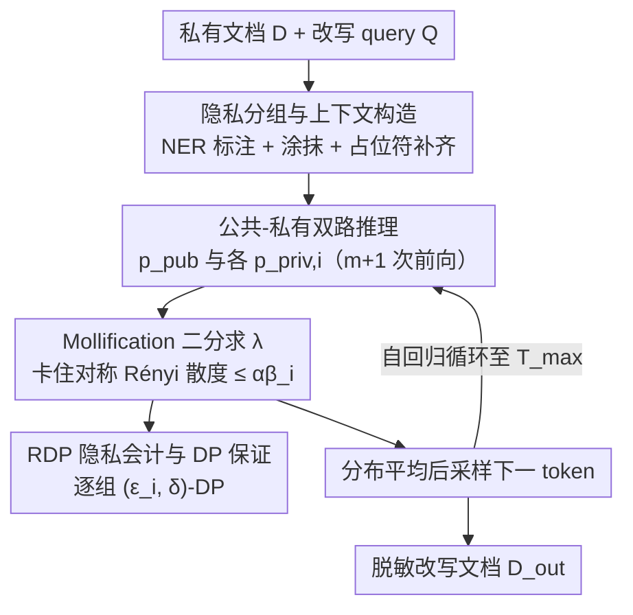

# DP-Fusion: Token-Level Differentially Private Inference for Large Language Models

**会议**: ICLR2026  
**OpenReview**: [https://openreview.net/forum?id=WLK37mn0El](https://openreview.net/forum?id=WLK37mn0El)  
**代码**: 有（GitHub 仓库 + PyPI 包 + 在线部署应用，论文中给出但未列具体 URL）  
**领域**: LLM 安全 / 差分隐私推理  
**关键词**: 差分隐私推理、token 级隐私、文档脱敏、Rényi 散度、分布混合

## 一句话总结
DP-Fusion 在 LLM 推理时对每一个生成 token 提供可证明的 token 级差分隐私：把上下文拆成"公共版"和"逐组揭露敏感信息的私有版"分别前向，再用二分搜索找到一个混合权重 λ，让混合分布与公共分布的 Rényi 散度被卡在隐私预算内，从而在改写含 PII 的文档时既保证隐私又把困惑度做到比同类 DPI 方法低 6 倍。

## 研究背景与动机
**领域现状**：LLM 在部署时会处理大量训练阶段没见过的数据——用户 prompt、工具调用结果、外部数据库检索（RAG）内容。当这些上下文里含有密码、个人可识别信息（PII）这类敏感数据时，模型生成的 token 可能在不知不觉中把它们泄露给用户。一个典型场景是医院把病历库接到 LLM 上给病人做问诊匹配，病历里既有症状又有姓名、日期、机构等隐私。

**现有痛点**：现有的推理期隐私保护方法分两类，都不够用。一类是改上下文：用 NER 把敏感 token 划掉（scrubbing），但过度涂抹会严重损害可用性；或者让模型"改写文档时别泄露 PII"（prompt engineering），但这完全没有形式化保证，而且作者实验显示，即便不越狱，白盒推断攻击者也能高成功率地推断出敏感信息。另一类是改推理过程：DP-Decoding 把输出分布和均匀分布线性插值，DP-Prompt 裁剪 logits 后用指数机制采样——这两者虽有 DP 形式，但隐私/可用性权衡极差，要拿到可用隐私时困惑度会飙到 4~14 甚至上百。

**核心矛盾**：可用性和隐私之间存在根本 trade-off。把文档原样放出可用性最高但毫无隐私；把每个敏感 token 都涂掉隐私拉满但文本残破。已有方法要么在输入端"一刀切"过度消毒，要么在输出端加噪却给不出可证明的、紧的隐私界。

**本文目标**：设计一个推理期机制，能够**可证明地**上界"上下文中一组敏感 token 对生成输出的影响"，并且这个界要随一个可调参数 $\epsilon$ 平滑地在隐私和质量之间滑动。

**切入角度**：作者借鉴训练期的集成式私有预测思路 PMixED（以及 PATE / SUBMIX 的血统）。PMixED 靠 LLM 采样输出的固有随机性提供隐私，并用闭式 Rényi 差分隐私（RDP）会计实现线性、紧的隐私核算。作者把这套思路从"保护训练集记录"搬到"推理时保护上下文中的特定 token"这一全新威胁模型下。

**核心 idea**：对每个生成的 token，跑一遍"不含敏感 token 的公共分布" $p_{\text{pub}}$ 作基线，再跑"揭露某一隐私组的私有分布" $p_{\text{priv}}$，然后把私有分布往公共分布"软化"（mollification）——找到尽可能大的混合权重 $\lambda$，使混合分布与公共分布的对称 Rényi 散度恰好被隐私预算 $\alpha\beta$ 卡住，最后从混合分布采样。这样攻击者就算自适应地选 prompt（甚至越狱），其推断敏感 token 的优势也被可证明地上界。

## 方法详解

### 整体框架
DP-Fusion 是一个自回归的差分隐私推理（DPI）机制：给定一段含敏感信息的隐藏上下文文档 $D$ 和一个改写 query $Q$，它逐 token 生成一份脱敏后的改写文档 $D_{\text{out}}$，并对每个隐私组提供可证明的 $(\epsilon_i,\delta)$-DP 保证。

整条流水线是这样转的：① 用户为每个隐私组（如 NAME、DATE、CODE、ORG）指定隐私预算 $\beta_i$，提交私有文档；② 本地 NER/tagger 把所有敏感 token 标成隐私组 $X_1,\dots,X_m$，其余归为公共组 $X_{\text{pub}}$；③ 据此构造一个"公共上下文"（划掉所有敏感 token、并用等量 `_` 占位符填充以防长度泄露）和 $m$ 个"逐组私有上下文"（每个只额外揭露一个隐私组）；④ 推理时，对每个生成位置，把公共上下文和各私有上下文分别送进同一个 LLM 得到 $p_{\text{pub}}$ 和 $p_{\text{priv},i}$，对每个私有分布做 mollification 求出混合权重 $\lambda_i$，再把所有"软化后的私有分布"平均、从中采样下一个 token；⑤ 重复至多 $T_{\max}$ 步得到改写文档。整体延迟通过并行 $m{+}1$ 次前向，约等于单次前向。

### 关键设计

**1. 隐私分组与公共/私有上下文构造：把"该保护什么"形式化成可加可减的 DP 邻接**

针对"现有方法一刀切涂抹、损害可用性"的痛点，DP-Fusion 不再把所有敏感 token 同等对待，而是把文档 token 序列划分为 $D = X_{\text{pub}}\cup X_1\cup\cdots\cup X_m$，每个敏感 token 恰好属于一个隐私组 $X_i$，其余进公共组 $X_{\text{pub}}$。本地 tagger（NER 或 LLM）完成标注后，构造两类上下文：一个**公共版**把所有隐私组 token 全部涂掉，$m$ 个**逐组私有版**每个只额外揭露一组 $X_{\text{pub}}\cup X_i$。这种"加/减一个隐私组"恰好对应标准 DP 的 add/remove 邻接定义（Definition 3）：两份文档 $D\overset{i}{\sim}D'$ 当且仅当它们只差一个隐私组 $X_i$ 的全部 token，于是"保护这组信息"就等价于"机制输出对这组 token 的增删不敏感"。一个容易忽略却关键的细节：为防止"涂掉几个 token 会暴露原 span 长度"这类侧信道，作者用等量的 `_` 占位符把每个被涂的 span 填齐，使 $X_{\text{pub}}$ 与 $X_{\text{pub}}\cup X_i$ token 长度一致。这一步让后面的 DP 分析能干净地落到"逐组邻接"上。

**2. 公共-私有双路推理 + 分布混合：用一个可调权重在基线和真信息之间插值**

针对"要么没保证、要么质量崩"的痛点，DP-Fusion 让同一个 LLM 对公共上下文和各私有上下文分别前向（Algorithm 1 第 3、5 行），得到基线分布 $p_{\text{pub}}$ 和揭露第 $i$ 组后的私有分布 $p_{\text{priv},i}$。最终采样用的是把每个私有分布往公共分布拉回后的混合，再对 $m$ 组取平均：

$$D_t \sim \frac{1}{m}\sum_{i=1}^{m}\big(\lambda_i\, p_{\text{priv},i} + (1-\lambda_i)\, p_{\text{pub}}\big)$$

直觉上，$\lambda_i\in[0,1]$ 控制"放多少真实私有信息进来"：$\lambda_i=0$ 时输出完全等于公共基线（敏感信息全藏，$\epsilon=0$），$\lambda_i$ 越大越接近真实私有分布、文本质量越好但隐私越弱。这套"双路前向 + 凸组合"把隐私/可用性 trade-off 收成了一个连续可控的旋钮。代价是每个 token 要 $m{+}1$ 次前向，但这些前向相互独立、可批并行，实测延迟约等于单次前向。

**3. Mollification：用 Rényi 散度的单调性把"求最大可用权重"变成一次二分搜索**

混合权重 $\lambda_i$ 不能随便给，它必须满足隐私约束：混合分布相对公共分布的对称 Rényi 散度不能超过该组的预算。对称 Rényi 散度定义为 $D^{\leftrightarrow}_\alpha(p\|q)=\max\{D_\alpha(p\|q),\,D_\alpha(q\|p)\}$，同时约束两个方向以匹配 add/remove 邻接。于是每个 token、每个组都要解一个带约束的最大化（Algorithm 1 第 6 行）：

$$\lambda_i = \arg\max_{\lambda_i\ge 0}\ D^{\leftrightarrow}_\alpha\big(\lambda_i p_{\text{priv},i}+(1-\lambda_i)p_{\text{pub}}\ \big\|\ p_{\text{pub}}\big)\ \le\ \beta_i\alpha$$

作者称这一步为 **mollification（软化）**。它之所以能高效求解，靠的是 Theorem 3（Rényi 散度的单调性）：固定 $p,q$，令 $p_\lambda=(1-\lambda)q+\lambda p$，则映射 $\lambda\mapsto D_\alpha(p_\lambda\|q)$ 在 $\alpha>1$ 时**单调不减**（除非 $p=q$ 否则严格递增）。既然散度随 $\lambda$ 单调增，就能用**二分搜索**在 $[0,1]$ 上快速逼近那个让散度恰好等于 $\beta_i\alpha$ 的最大 $\lambda_i$——在隐私预算允许下尽量多放真信息进去。这正是"既卡死隐私、又最大化可用性"的实现核心。

**4. RDP 隐私会计与 $(\epsilon,\delta)$-DP 转换：把逐 token 的散度界累积成整段文本的可证明保证**

单 token 的散度界还不等于"整篇改写文档"的隐私保证，因为自回归会生成 $T$ 个 token，隐私损失会累积。DP-Fusion 用 Rényi 差分隐私（RDP）做会计：RDP 在 $\alpha$ 固定时随组合**线性可加**，因此把每步散度界累加即可。作者证明（Theorem 4，沿用 PMixED/Flemings 等的证明），在每组满足 $(\alpha,\beta_i)$-组 RDP（Definition 4）的前提下，生成 $T$ 个 token 后，整段 transcript 对第 $i$ 组在 add/remove 邻接下满足 $(\epsilon_i,\delta)$-DP：

$$\epsilon_i = T\cdot\frac{1}{\alpha-1}\log\!\Big(\frac{m-1}{m}+\frac{1}{m}e^{(\alpha-1)4\beta_i}\Big)+\frac{\log(1/\delta)}{\alpha-1}$$

实验统一取 $\alpha=2,\ \delta=0.001$，通过调 $\beta$（具体是控制 $\alpha\beta\in\{0.01,\dots,0.10\}$）来变 $\epsilon$。这条公式让 DP-Fusion 区别于 prompt engineering 这类"没保证"的方法：它给出的是可证明的、且因 RDP 会计而相对紧的隐私上界。

### 一个完整示例
以论文里的 ECHR 法律文档为例（Figure 2）。原文含多类隐私：日期"24 September 2002"、姓名"John"、机构"High Court"、数量"90 hearings"等，分别归入 DATE、NAME、ORG 等隐私组。① tagger 把它们标出后，公共版变成"庭审于 ____ 开始……因 ____ 病倒"这种带占位符的涂抹文本；② 同时构造逐组私有版，比如"只揭露 G1（数量组）"的版本会把"90 hearings"放回去、其余仍涂掉；③ 每生成一个 token，公共版给出 $p_{\text{pub}}$，各组私有版给出 $p_{\text{priv},i}$，对每组二分求 $\lambda_i$ 使散度 $\le\alpha\beta_i$；④ 在不同 $\alpha\beta$ 下（图中 $\epsilon=0.1,0.4,0.5,0.7$），混合分布偏向公共还是私有不同，于是采样出的改写文档信息保留程度不同——预算紧时输出"庭审在某段时间举行、申请人病倒"，预算松时能保留更多具体细节。最终产出一份语句通顺、但攻击者无法可靠还原 PII 的改写文档。

## 实验关键数据

### 主实验
实验用 Qwen2.5-7B-Instruct（单张 A100），数据集为 TAB-ECHR（欧洲人权法院案卷，人工标注 8 类 PII），$T_{\max}=900$、候选集大小 $|C|=5$（随机猜中即 20% ASR）。隐私用两种口径衡量：理论上界 $\epsilon$，和 token-recovery 博弈里攻击者成功率（ASR，越接近 20% 越私密）；可用性用困惑度（teacher forcing）和 GPT-4o-mini 当裁判的 LLM-as-a-judge 胜率。

| 方法 | 配置 | 困惑度 PPL | LOSS 攻击 ASR | 说明 |
|------|------|-----------|---------------|------|
| No DPI - 原文 | 直接放出 | 1.03 | 0.6267 | 可用性上限，但隐私几乎为零 |
| No DPI - NER | 全涂抹 | 1.46 | 0.2767 | 隐私好但无形式保证、信息丢光 |
| DP-Decoding | $\lambda=0.9$ | 3.96 | 0.6600 | 形式 DP，但质量差且隐私弱 |
| DP-Prompt | w=50, T=1.75 | 8.44 | 0.2867 | 最强 DPI 基线，PPL 仍高 |
| **DP-Fusion** | $\alpha\beta_i=0.01$ | **1.459** | **0.2600** | 高隐私档，PPL≈NER、ASR 更低 |
| **DP-Fusion** | $\alpha\beta_i=0.10$ | **1.426** | 0.2933 | 高可用档，PPL 反超 NER |

关键结论：在可比隐私水平下，DP-Fusion 的可用性约是最佳基线 DP-Prompt 的 **6 倍**（PPL 1.426 vs 8.44）。在 $\epsilon$ 处于 16–66 区间时，DP-Fusion 的 PPL 稳定在 1.42–1.46；而 DP-Decoding / DP-Prompt 即便在高 $\epsilon$ 下 PPL 也普遍 >3.9，width=5 设置甚至 >100。LLM-as-a-judge 上，即便最强隐私档（$\alpha\beta=0.01$），DP-Fusion 对 DP-Decoding / DP-Prompt 的胜率也 ≥95%（仅 DP-Prompt T=0.75 例外，但那个设置几乎没隐私）；$\alpha\beta=0.1$ 时甚至以 56% 胜率反超"全公开"基线。

### 消融实验

| 配置 / 分析 | 关键指标 | 说明 |
|------|---------|------|
| $\alpha\beta=0.01$ → $0.10$ | PPL 1.459 → 1.426 | 放松预算，可用性升、ASR 仅 +3.3% |
| 单组实现（m=1） | 更平滑的隐私-可用曲线 | 牺牲部分理论保证换效率与平滑度 |
| 多组实现（m 增大） | 逐组 $\epsilon$ 变小但 $p_{\text{pub}}$ 占比升 | 理论隐私更紧但融合分布被公共主导、过渡不平滑 |
| 防 prompt injection（$\alpha\beta=0.001/0.01/1.0$） | ASR 0%（对比无防御 ≥90%） | 把不可信 RAG chunk 标为隐私组即可证明地限制其影响 |
| tagger 质量（off-the-shelf） | 3.9% 漏标率、85.4% F1 | DP 保证只覆盖被标 span，taggers 越好差距越大 |

### 关键发现
- LOSS 攻击在所有方法上 ASR 最高，是最强的经验攻击；DP-Fusion 在最强隐私档把 LOSS-ASR 压到 0.26，略低于 No-DPI NER 的 0.2767，作者归因于分布混合引入的额外随机性。
- DP-Fusion 与 No-DPI NER 的可用性差距在"敏感 token 稀疏"时较小（NER 没涂掉多少东西、DP-Fusion 也没多少可保留），但在敏感 token 密集的数据集（如另一医学 PII 数据集）上差距明显拉大——这恰是 DP-Fusion 的价值场景。
- 一个有意思的副产品：token 级影响界天然能缓解 prompt injection。把每个来源的 RAG chunk 当一个隐私组，就能可证明地上界任意 chunk 对输出的影响，在 $\alpha\beta=0.001/0.01/1.0$ 下实现 0% 越狱成功率，且可随 $\alpha\beta$ 增大优雅退化到无防御水平。

## 亮点与洞察
- **把"隐私旋钮"做成单调可二分的散度约束**：靠 Rényi 散度对混合权重的单调性，把"在预算内放最多真信息"这个最优化变成一次廉价的二分搜索，既给出可证明界又最大化可用性，这是整篇最巧的机械化设计。
- **token 级、逐组的隐私预算**：不同 PII 类别（NAME / DATE / CODE）可以分配不同 $\beta_i$，比"对整篇文档一个 $\epsilon$"灵活得多，贴近真实合规需求（不同实体敏感度不同）。
- **隐私与安全的统一视角**：同一个"上界单组 token 对输出影响"的机制，既做文档脱敏又防 prompt injection——把不可信输入标为"敏感"即可，这个迁移很自然，给 RAG 安全提供了一条有形式保证的新路。
- **可复现性强**：作者同时放出 GitHub 仓库 + PyPI 包 + 部署应用，端到端支持任意 LLM，工程落地门槛低。

## 局限与展望
- **依赖 tagger，且保证只覆盖被标 span**：DP 保证对漏标的 PII 无效。作者坦承这把"识别所有 PII"的责任外包给了 NER，虽然现成 tagger 在 TAB-ECHR 上漏标率已低到 3.9%，但在标注质量差的领域，机制的实际隐私会打折扣。
- **多组变体不够平滑且开销大**：支持 per-group $\epsilon$ 要算 $m{+}1$ 个分布，显存/计算约 $(m{+}1)\times$；且 $m$ 增大时融合分布被公共分布主导，从"改写 $D$"到"改写 $D\setminus T_{\text{priv}}$"的过渡随 $\epsilon$ 变化不平滑。作者只好另给一个共享 $\epsilon$ 的单组变体来换平滑度，但那削弱了理论保证。
- **可用性优势依赖敏感 token 密度**：在敏感信息稀疏的文档上，DP-Fusion 相对简单 NER 的增益很有限，价值主要体现在密集 PII 场景。
- **评测范围相对窄**：主实验集中在 TAB-ECHR 单一法律语料 + Qwen2.5-7B，跨数据集/跨模型的泛化（尤其更大模型、更口语化文本）验证仍有限。

## 相关工作与启发
- **vs DP-Decoding（Majmudar et al., 2022）**：DP-Decoding 把输出分布和**均匀分布**线性插值来加噪，DP-Fusion 则是和**信息更丰富的公共分布**混合并用散度界精确控制。前者为了拿隐私要把分布拉向均匀，质量崩得厉害（PPL 3.96~14）；后者公共基线本身已是合理文本分布，质量损失小得多。
- **vs DP-Prompt（Utpala et al., 2023）**：DP-Prompt 裁剪 logits 再用指数机制采样，靠裁剪宽度和温度控权衡，但为达可用隐私 $\epsilon$ 会爆到十万级、PPL 也高。DP-Fusion 在可比隐私下 PPL 低约 6 倍。
- **vs PMixED（Flemings et al., 2024）/ PATE / SUBMIX**：这些是**训练期**集成式私有预测（保护训练集记录），DP-Fusion 把"用采样随机性 + 闭式 RDP 会计提供隐私"的思路搬到**推理期**的新威胁模型下——攻击者要从改写文本里还原上下文 token，而非推断训练成员。
- **vs scrubbing / prompt engineering**：传统 NER 涂抹和"让模型别泄露"的提示工程要么过度损害可用性、要么完全没有形式保证且易被白盒推断攻击，DP-Fusion 用一个连续旋钮同时给出可证明界和更好的可用性。

## 评分
- 新颖性: ⭐⭐⭐⭐⭐ 把训练期集成私有预测迁到推理期、做出 token 级逐组可证明 DP，并顺带统一了 prompt injection 防御，角度新。
- 实验充分度: ⭐⭐⭐⭐ 攻击/裁判双口径、多基线对比扎实，但主要绑定单数据集单模型，跨域泛化偏弱。
- 写作质量: ⭐⭐⭐⭐⭐ 威胁模型、博弈定义、定理与算法层层递进，公式与图示清晰。
- 价值: ⭐⭐⭐⭐⭐ 给"带敏感数据部署 LLM"提供了有形式保证且工程可用（含 PyPI 包）的方案，实用性高。

<!-- RELATED:START -->

## 相关论文

- [\[ICML 2025\] Cascade: Token-Sharded Private LLM Inference](../../ICML2025/llm_safety/cascade_token-sharded_private_llm_inference.md)
- [\[ICLR 2026\] Secret-Protected Evolution for Differentially Private Synthetic Text Generation](secret-protected_evolution_for_differentially_private_synthetic_text_generation.md)
- [\[ICLR 2026\] HiddenEcho: Mitigating Noise Amplification in Differentially Private LLMs with Hidden-State Correction](hiddenecho_mitigating_noise_amplification_in_differentially_private_llms_with_hi.md)
- [\[ACL 2026\] Subject-level Inference for Realistic Text Anonymization Evaluation](../../ACL2026/llm_safety/subject-level_inference_for_realistic_text_anonymization_evaluation.md)
- [\[ICLR 2026\] AdPO: Enhancing the Adversarial Robustness of Large Vision-Language Models with Preference Optimization](adpo_enhancing_the_adversarial_robustness_of_large_vision-language_models_with_p.md)

<!-- RELATED:END -->
