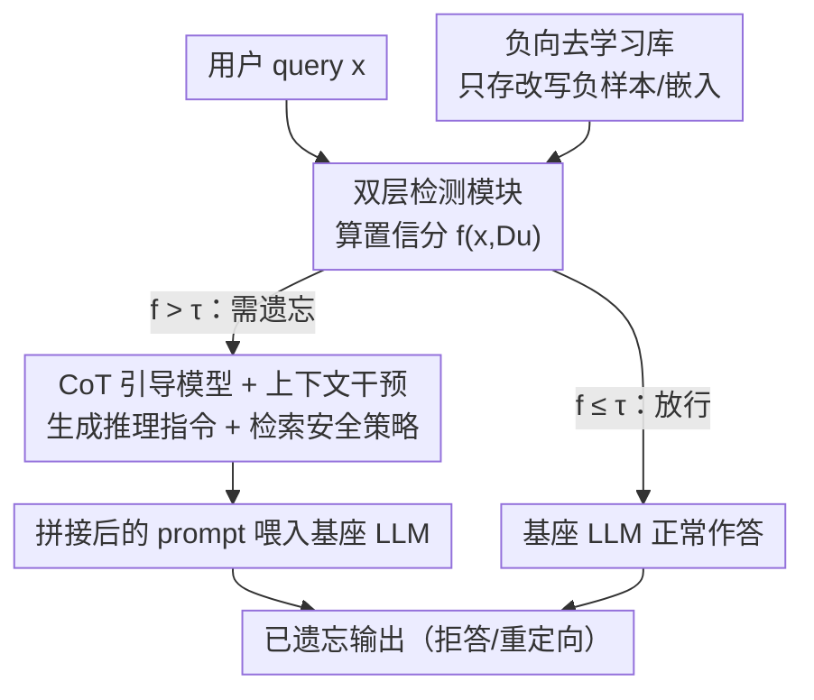

# DRAGON: Guard LLM Unlearning in Context via Negative Detection and Reasoning

**会议**: ICLR2026  
**OpenReview**: [https://openreview.net/forum?id=vQLUAkl5SG](https://openreview.net/forum?id=vQLUAkl5SG)  
**代码**: 待确认  
**领域**: LLM 安全 / 去学习（Unlearning）  
**关键词**: LLM Unlearning, In-context Intervention, Chain-of-Thought, 黑盒安全, 连续去学习

## 一句话总结
DRAGON 把 LLM 去学习从"改权重"转成"改上下文"：先用一个不依赖保留数据的双层检测模块判断输入是否落入需遗忘的范围，命中后由一个微调过的 CoT 引导模型动态生成推理指令、配上检索到的安全策略一起拼进 prompt，从而在不微调基座、适配黑盒模型、支持连续遗忘请求的前提下把目标知识"按需屏蔽"。

## 研究背景与动机
**领域现状**：LLM 去学习（unlearning）的目标是让模型"看起来从没在某批数据上训过"，用于满足 GDPR 式的"被遗忘权"以及移除有害知识。主流做法是 **训练式（training-based）**——用梯度上升、KL 约束、偏好优化（NPO/DPO）等专门目标在遗忘集上微调，或借助助手/参考模型来引导遗忘。

**现有痛点**：训练式方法有三个硬伤。其一，它们普遍需要**保留数据（retain data）**来防止模型整体能力塌掉，但真实场景里原始训练数据常因隐私限制、授权过期、知识产权而拿不到；其二，对百亿级参数做梯度优化代价高昂，对 GPT-4、Claude 这类只能黑盒访问的专有模型根本无法施加；其三，绝大多数方法面向**单次遗忘**，无法应对"删除请求随时间不断到来"的连续去学习（continual unlearning）。已有的训练无关（training-free）方法虽然只改 prompt，但探索很浅，要么粗暴拒答、要么生成乱码，缺乏系统设计。

**核心矛盾**：遗忘质量（forget quality）与模型效用（model utility）之间存在 trade-off——微调式方法越是把目标知识抹干净，越容易误伤通用能力；而要稳住通用能力又往往要靠保留数据来"拉回"，于是陷入"既要遗忘集又要保留集"的死结。

**本文目标**：在 **只有遗忘信号、没有保留数据、不能改基座权重、还要支持连续请求** 的最实际约束下，做到既有效遗忘又几乎不损通用能力。

**切入角度**：作者观察到现代 LLM 本身具备很强的**指令遵循**与**链式推理（CoT）**能力——与其改权重去"删知识"，不如在推理前用一段精心设计的推理指令把模型"引导"到拒答或重定向。关键是要先准确判断"这个 query 是否该被遗忘"，再生成与上下文相关、不泄密的引导指令。

**核心 idea**：用"检测 + 推理增强生成"代替"梯度微调"——只用改写后的**负向**遗忘数据训练一个检测器拦截需遗忘的 prompt，再用一个 CoT 引导模型把推理指令拼进上下文做软约束，从而在黑盒、无保留数据、连续场景下完成去学习。

## 方法详解

### 整体框架
DRAGON（Detect–Reasoning Augmented GeneratiON）是一套在**推理前**对输入做拦截与改写的框架，完全不碰基座模型参数。一次查询的流转是：用户 query 进来后，先过**双层检测模块**，它在一个预建的"去学习库（unlearn store）"里检索并算出一个置信分 $f(x, D_u)$；若分数超过阈值 $\tau$，说明这条 query 落在需遗忘范围内，系统触发**上下文干预**——一个微调过的 **CoT 引导模型**根据 query 和检索到的安全策略动态生成一段链式推理指令，把它和安全策略一起前置（prepend）到原始 prompt，再喂给基座 LLM，得到"已遗忘"的输出；若分数没超阈值，原始 query 原样透传给 LLM，正常作答。整套设计是模块化、可解释、对各种黑盒 LLM 都能即插即用的。

### 关键设计

**1. 负向去学习库：只存"改写后的负样本"，不存原文与答案**

去学习的前提是知道"什么该被遗忘"，但直接把真实遗忘数据存进库里本身就是泄密风险。DRAGON 的做法是用本地部署的 Llama3.1-70B-Instruct 对每条遗忘 prompt 生成 4 个改写候选，再用候选与原句之间的 BERTScore 做**拒绝采样**，只保留语义最接近的那一条；并且**只存改写后的 prompt（隐私场景下进一步只存其嵌入向量），绝不存原始 completion**。这样即便数据库被攻破，泄露的也只是泛化/合成过的查询而非真实用户数据或答案。这一步把"遗忘信号"以最小泄密代价沉淀下来，是后续检测的唯一参照系，也是整套方法"无需保留数据"的根基。

**2. 双层检测：可训练打分器 + 相似度度量融合成自适应置信分**

只靠一个分类器容易被改写攻击或分布漂移绕过，所以 DRAGON 把"训练得到的打分模型"和"基于相似度的度量"两路信号融合成统一置信分，再用阈值 $\tau$ 触发干预。两种任务用不同的公式。**隐私记录（样本去学习）**：

$$f(x, D_u) = \text{EM}(x) + \max_{e_u \in D_u}\big(\text{sim}(e_u, e)\big) + \mathbb{I}(p_F(x) > \tau_1)$$

其中 $\text{EM}(x)$ 在 query 出现任一被遗忘作者名时返回 1，$\text{sim}$ 是 query 嵌入 $e$ 与库中改写 prompt 嵌入 $e_u$ 的最大余弦相似度，$p_F(x)$ 是打分模型 $F$ 判定其为隐私相关的概率。**有害知识（概念去学习）**：

$$f(x, D_u) = \mathbb{I}(p_F(x) > \tau_1) + \max_{x_u \in D_u}\text{BERTScore}(x_u, x) + \text{Rouge\text{-}L}(D_u, x)$$

有害样本难以穷举枚举，但底层"概念"能被训练模型更可靠地捕捉，因此这里以打分模型 $F$ 为主、BERTScore 与 ROUGE-L 作为二次校验。两路融合让检测对改写攻击和分布漂移更鲁棒，且打分模型只用合成/改写的负样本训练，全程不碰保留数据。

**3. CoT 引导模型 + 上下文干预：动态生成推理指令而非套用静态模板**

检测命中后，真正"执行遗忘"的是上下文干预。DRAGON 先**检索对应的安全策略**（如版权保护、有害知识防泄露的条款）：对 TOFU 隐私任务采用"双重保护"——随机生成一份虚构作者信息让模型据此作答，同时用 CoT 指令作为拒答准则防止泄露真实隐私；对 WMDP 有害任务则抽取相关策略与拒答准则，明确要求模型遵守。随后由一个**专门微调的 CoT 引导模型**根据当前 query 动态产出链式推理指令，把"安全策略 + CoT 指令 + 原 query"拼成最终 prompt 前置给基座模型。引导模型用 Llama3.1-8B-Instruct 微调而来：训练数据由 GPT-4o 为虚构作者生成 800 条合成问题、再从 TOFU 取 200 条改写问题，逐条生成 CoT 指令并经拒绝采样筛选高质量对。之所以**动态生成而非预存 CoT**，是因为库里根本不存原始 query（防泄密），无法离线预生成；动态生成还能保证回答与上下文相关，避免静态拒答模板那种"答非所问、显得无用"的副作用。这套软约束完全靠基座模型的指令遵循能力落地，不改一个权重，因此能直接套到任意黑盒 LLM 上，且换更大的模型也不增加额外成本。

**4. 面向连续去学习的三个评测指标：RQ / DDS / DUS**

作者指出现有评测只看单次遗忘的静态指标，无法刻画连续场景下的稳定性，于是补了三个新指标。**Refusal Quality（RQ）** 联合衡量拒答行为与生成质量，由三部分组成：模型回复与一组拒答模板的最大余弦相似度、由二分类器估计的拒答率、以及由乱码检测器给出的归一化生成质量分——目的是惩罚那些"虽然拒答但输出乱码/重复"的退化情况。**Dynamic Deviation Score（DDS）** 在 $T$ 步连续遗忘上同时刻画平均 trade-off 与稳定性：

$$\text{DDS} = \frac{1}{T}\sum_{i=1}^{T} s_i + \frac{\beta}{T-1}\sum_{i=1}^{T-1}\max(0,\, s_{i+1}-s_i)$$

其中 $s_i$ 是第 $i$ 步的 deviation score，第二项专门惩罚遗忘轨迹中"越遗忘越变差"的上升波动，$\beta=0.5$ 控制稳定性与平均性能的权衡，越低越好。**Dynamic Utility Score（DUS）** 衡量连续遗忘中模型效用的波动：

$$\text{DUS} = 1 - \frac{\sum_{i=1}^{T-1}|u_{i+1}-u_i|}{T-1}$$

$u_i$ 是第 $i$ 步的模型效用，DUS 越高说明效用越稳。单步效用下降看似可忽略，但在连续遗忘里会累积成明显掉点，DDS/DUS 正是用来诊断这种长期行为的，作为标准指标（forget accuracy、静态 utility）的补充而非替代。

### 损失函数 / 训练策略
DRAGON 不对基座模型做任何训练。需要训练的只有两个轻量组件：① 检测用的打分模型 $F$，用合成的有害/良性（或隐私相关）query 以分类目标微调；② CoT 引导模型，用 Llama3.1-8B-Instruct 在自建 CoT 数据集（800 合成 + 200 改写、经拒绝采样）上做标准 SFT，使其能对推理时遇到的新 query 泛化出对应的推理轨迹。两者都只依赖合成/改写的负向数据，不需要保留集，也无需在切换新数据集时重训。

## 实验关键数据

### 主实验
覆盖三类任务：有害知识去学习（WMDP + MMLU）、隐私记录去学习（TOFU）、版权内容去学习。WMDP 上理想的"成功遗忘"应使四选一准确率（ProbAcc）逼近随机猜测的 25%，同时 RQ 越高越好、MMLU 越不掉越好。

| 任务/模型 | 指标 | Original | RMU | ICUL+ | DRAGON |
|-----------|------|----------|-----|-------|--------|
| WMDP-Bio (Llama3.1-8B) | ProbAcc(↓) | 73.1 | 66.8 | 52.8 | **26.2** |
| WMDP-Bio (Llama3.1-8B) | RQ(↑) | 0.411 | 0.412 | 0.382 | **0.921** |
| WMDP-Chem (Llama3.1-8B) | ProbAcc(↓) | 54.9 | 51.7 | 35.8 | **23.5** |
| MMLU (Llama3.1-8B) | ProbAcc(↑) | 68.0 | 59.9 | 68.0 | **68.0** |
| WMDP-Bio (Zephyr-7B) | ProbAcc(↓) | 64.3 | 31.2 | 51.1 | **25.3** |

DRAGON 在 9 个 LLM 上一致取得最佳遗忘效果：WMDP 上 ProbAcc 普遍压到 25% 附近（接近随机猜测）且 RQ 最高，同时 MMLU 几乎零损失（Llama3.1-8B 保持 68.0），而 RMU 等基线要么遗忘不彻底、要么通用能力明显塌陷。在 TOFU 隐私任务上（Llama2-7B-Chat），DRAGON 在 1/5/10% 三个遗忘比例下都进入所有指标的前二：

| 指标 (TOFU-5%) | Retained LLM | PO | NPO-RT | Filter-Prompting | DRAGON |
|-----------------|--------------|-----|--------|------------------|--------|
| DS(↓) | 39.5 | 33.0 | 69.9 | 40.0 | **23.1** |
| MU | 0.6275 | 0.5187 | 0.4732 | 0.6337 | **0.6337** |
| KFR | 0.93 | 0.96 | 0.94 | 0.95 | **0.99** |
| KRR | 0.87 | 0.57 | 0.16 | 0.83 | **0.87** |

可以看到训练式基线（GA/KL/GD）在 5%/10% 比例下 MU 直接归零（通用能力崩溃），而 DRAGON 把 Deviation Score 压到最低、Model Utility 保持最高，KFR/KRR 双高。

### 消融实验
两组关键消融。其一，**CoT 指令的必要性**（TOFU, Llama2-7B）：

| 配置 | DS(↓) (1%) | CS 差距 ∆ |
|------|-----------|-----------|
| Guardrail+（静态模板拒答） | — | 0.44 |
| DRAGON w/o CoT | 43.9 | 0.29 |
| DRAGON w 短模板 CoT | 41.7 | 0.31 |
| DRAGON w 模板 CoT | 33.5 | 0.16 |
| DRAGON（动态 CoT） | **21.4** | **0.01** |

去掉 CoT 后 DS 从 21.4 恶化到 43.9，说明动态 CoT 是遗忘质量的主要来源；同时 DRAGON 的一致性分（CS，回复与 query 的嵌入相似度）与强微调基线 NPO-RT 的差距仅 0.01，而静态模板拒答的 Guardrail+ 差距高达 0.44——即静态模板的回答严重脱离上下文、显得答非所问。其二，**检测模块**：DRAGON 的检测器无需保留数据训练、切换数据集时也无需重训，在多个数据集上的遗忘集检测准确率达到或接近最佳，对语言混合、错字扰动、越狱攻击等测试时攻击也保持鲁棒。

### 关键发现
- **CoT 引导是遗忘效果的核心**：移除 CoT 让 DS 几乎翻倍，证明"屏蔽知识"主要靠推理指令引导，而非简单检测拦截。
- **动态生成优于预存/模板**：动态 CoT 既因为不存原始 query 而防泄密，又比静态模板的上下文一致性高一个量级（CS 差距 0.01 vs 0.44）。
- **越大的模型收益越明显**：DRAGON 在更强的 LLM 上遗忘效果更突出，且扩到更大模型不增加额外成本（不微调基座）。
- **连续去学习稳定性领先**：在 forget01/05/10 三步连续遗忘下，DRAGON 的 DDS 最低、DUS 接近 1.0，效用几乎不随步数累积下滑。

## 亮点与洞察
- **范式转换：从"改权重删知识"到"改上下文挡知识"**。这让去学习首次能稳妥地落到只能黑盒访问的专有大模型上，且天然适配"删除请求不断到来"的连续场景——这是训练式方法结构性做不到的。
- **"只存负样本、不存原文"的防泄密设计很巧**。去学习库里只放改写后的 prompt/嵌入、不放真实数据与答案，把"为了遗忘反而要保存敏感数据"这个隐含悖论给绕开了，这个思路可迁移到任何需要"记住要屏蔽什么、又不能存敏感原文"的安全系统。
- **双信号融合检测对改写攻击鲁棒**。把训练打分器与相似度度量融成一个置信分，比单分类器更难被 paraphrase 绕过，是一个可复用的轻量级安全检测模板。
- **连续场景下"稳定性"被显式量化**。DDS 的上升惩罚项、DUS 的逐步波动项，把"单步看不出、多步累积塌"的隐患变成可诊断指标，对部署前评估很有实用价值。

## 局限与展望
- **检测器是单点要害**：整套方法的遗忘效果取决于双层检测能否准确命中需遗忘的 query。一旦出现库里没覆盖的全新改写或越狱变体绕过检测，干预就不会触发，知识照样泄露；论文虽测了若干攻击但攻击面不可能穷尽。
- **依赖基座的指令遵循能力**：上下文干预是"软约束"，靠的是基座模型听话。对指令遵循弱、或被对抗 prompt 强行覆盖系统指令的模型，前置的 CoT 指令可能被无视，遗忘并不"硬"。
- **去学习库需绝对可信**：作者自己承认该库由模型拥有者维护、必须高度可信且严格管控——它实质上集中存放了"哪些内容要被遗忘"的清单，本身是高价值攻击目标。
- **有害知识任务用了外部 API 生成 CoT**：对隐私场景作者刻意避免外部 API，但有害知识任务用 GPT-4o 生成 CoT 指令，迁移到对隐私极敏感的领域时这条管线需要替换为本地模型。
- **可改进方向**：把检测库做成可在线更新/自扩展以覆盖新攻击；为关键场景叠加一层"硬"约束（如输出端二次过滤）兜底软约束失效的情况。

## 相关工作与启发
- **vs 训练式去学习（GA / KL / GD / NPO / DPO）**：它们靠梯度微调基座来遗忘，需要保留数据稳能力、代价高、且单次操作；本文不改权重、不要保留数据、支持黑盒与连续遗忘。实验里 GA/KL/GD 在 5%/10% 比例下通用能力直接归零，正是训练式"遗忘-效用"trade-off 失控的典型，而 DRAGON 用上下文干预把效用稳住。
- **vs ICUL（in-context unlearning）**：ICUL+ 是本文最接近的上下文式前作，但它在评测中假设"完全知道被遗忘数据"的理想设定（其 DUS=1.0 正源于此）；DRAGON 不依赖这一强假设，只用改写负样本就完成检测与干预，更贴近真实部署。
- **vs Guardrail+（静态模板拒答）**：同为训练无关，但 Guardrail+ 用静态拒答模板替换回复，导致答非所问（CS 差距 0.44）；DRAGON 动态生成与上下文相关的 CoT 指令，把这个差距压到 0.01，既拒答又不破坏可用性。
- **vs 连续去学习评测（Gao et al., 2024）**：前作考虑了随时间的遗忘但忽略各阶段的稳定性与一致性；本文的 DDS/DUS 显式刻画连续遗忘下的波动与累积影响，补上了这块评测缺口。

## 评分
- 新颖性: ⭐⭐⭐⭐⭐ 把去学习从权重空间搬到上下文空间，并系统化"检测+CoT引导"，首次在黑盒+无保留数据+连续场景同时成立。
- 实验充分度: ⭐⭐⭐⭐ 覆盖 9 个 LLM、三类任务、连续设置与多种攻击，消融到位；但检测被绕过时的失效边界探得还不够深。
- 写作质量: ⭐⭐⭐⭐ 动机与方法链路清晰，公式与图配合好；自定义指标偏多，需对照附录才能完全复现。
- 价值: ⭐⭐⭐⭐⭐ 直接面向专有大模型与 GDPR 式连续删除请求的真实部署痛点，落地性强。

<!-- RELATED:START -->

## 相关论文

- [\[ICLR 2026\] DUET: Distilled LLM Unlearning from an Efficiently Contextualized Teacher](duet_distilled_llm_unlearning_from_an_efficiently_contextualized_teacher.md)
- [\[ICLR 2026\] CLUE: Conflict-guided Localization for LLM Unlearning Framework](clue_conflict-guided_localization_for_llm_unlearning_framework.md)
- [\[ICLR 2026\] Explainable LLM Unlearning through Reasoning](explainable_llm_unlearning_through_reasoning.md)
- [\[ICLR 2026\] Dual-Space Smoothness for Robust and Balanced LLM Unlearning](dual-space_smoothness_for_robust_and_balanced_llm_unlearning.md)
- [\[ICLR 2026\] Randomized Antipodal Search Done Right for Data Pareto Improvement of LLM Unlearning](randomized_antipodal_search_done_right_for_data_pareto_improvement_of_llm_unlear.md)

<!-- RELATED:END -->
