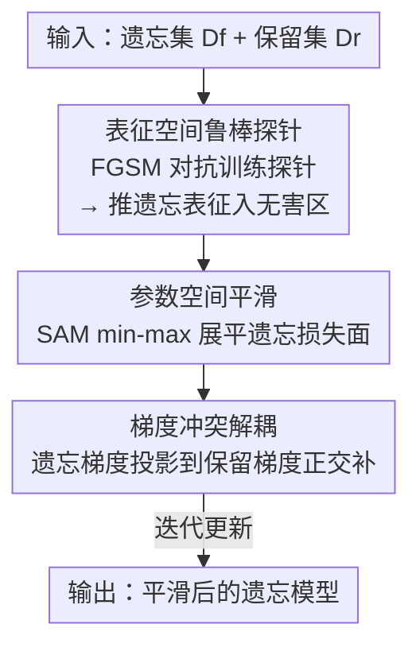

# Dual-Space Smoothness for Robust and Balanced LLM Unlearning

**会议**: ICLR2026  
**OpenReview**: [https://openreview.net/forum?id=VIMW3eys6x](https://openreview.net/forum?id=VIMW3eys6x)  
**代码**: 待确认  
**领域**: LLM 安全 / 机器遗忘 / 鲁棒性  
**关键词**: 机器遗忘, 双空间平滑, 鲁棒性, 越狱攻击, 重学习攻击, 梯度冲突解耦

## 一句话总结
PRISM 把 LLM 遗忘（unlearning）建模成一个 min–max 博弈，分别在**表征空间**（用对抗训练出的鲁棒探针把遗忘样本推进"无害区"）和**参数空间**（用 SAM 式平滑展平遗忘损失面）扩大攻击者必须跨越的"边界"，再叠加梯度冲突解耦缓解灾难性遗忘，从而在 WMDP / MUSE 上同时做到抗越狱、抗重学习、且不牺牲模型效用。

## 研究背景与动机

**领域现状**：随着 LLM 涉及隐私、版权、安全等敏感数据，重训整个模型来抹掉某批数据代价过高，于是机器遗忘（Machine Unlearning, MU）成为替代方案——在保留模型原有效用（utility）的前提下，削弱模型对"遗忘集" $D_f$ 的记忆。主流做法把遗忘写成在遗忘损失 $L_f$ 和保留损失 $L_r$ 之间平衡的优化问题：$\theta_u = \arg\min_\theta\big[L_f(\theta;D_f) + \gamma L_r(\theta;D_r)\big]$，代表方法有梯度上升（GA）、负偏好优化（NPO）、RMU、DOOR 等。

**现有痛点**：这些方法存在两类问题。其一是**指标失衡与灾难性坍塌**——GA、NPO+SAM 等过度优化遗忘目标，效用在若干步后骤降到接近 0（作者在 MUSE-Books 上实测到这种 utility collapse），而 DOOR、Task Vector 又走另一个极端：保住效用却几乎没遗忘掉东西。其二是**鲁棒性缺失**——遗忘后的模型对**重学习攻击**（relearn：攻击者拿遗忘集的一小撮样本微调上百步就能把被删知识找回来）和**越狱攻击**（jailbreak：prefill 注入、AutoDAN、多轮对话把有害表征推回"接受方向"）几乎没有抵抗力。

**核心矛盾**：表征空间和参数空间里**只要存在很小的扰动就能被攻击者利用**。几何分析（Lin et al. 2024b）表明，对齐良好的 LLM 内部对有害/无害提示的表征是可分的，越狱本质是把有害表征沿"接受方向" $e_a$ 推过判别边界；而重学习则是从遗忘后参数 $\theta_u$ 出发做小步更新就能恢复知识。现有方法的损失面在这两个空间都太"尖锐"，攻击者只需走很短一段就能翻盘。

**本文目标**：设计一个统一框架，既能在多种攻击下保持鲁棒，又能平衡"遗忘强度 / 效用 / 隐私保护"三者，避免灾难性遗忘。

**切入角度**：作者从对抗训练和 SAM（Sharpness-Aware Minimization，锐度感知最小化）借来"min–max + 展平损失面"的思想——内层最大化去找两个空间里的**最坏扰动**，等价于度量攻击者要成功必须跨越的"边界（margin）"；外层最小化去更新参数，**主动把这个边界撑大、把损失面变平滑**。

**核心 idea**：用"双空间平滑（dual-space smoothness）"把越狱边界和重学习边界一起撑大——在表征空间用鲁棒探针约束遗忘表征落进无害区，在参数空间用 SAM 展平遗忘损失，再用梯度正交解耦保住效用。

## 方法详解

### 整体框架
PRISM（Probe-guided Iterative Smoothness Minimization）的输入是已划分好的遗忘集 $D_f$ 和保留集 $D_r$（论文同时覆盖"对话问答"和"连续文本"两种格式），输出是一个被"双空间平滑"过的遗忘模型。整条管线可以看成一个 min–max 博弈：**内层**在表征空间和参数空间分别搜索最坏扰动以衡量攻击边界，**外层**更新参数把这两个边界都撑大。

具体分三步走。**Step 1 探针训练**：先在冻结基座模型的某一中间层表征上，对抗训练一个二分类探针（probe），让它能稳健地区分"有害/无害"表征。**Step 2 平滑最小化**：在探针引导下，一边把遗忘样本的表征往无害区推（表征空间平滑），一边用 SAM 式 min–max 把遗忘损失面展平（参数空间平滑）。**Step 2.5 梯度冲突解耦**：把遗忘梯度投影到保留梯度的正交补，剔除会破坏效用的分量。**Step 3 权重更新**：用解耦后的方向更新参数，迭代到收敛。

### 关键设计

**1. 表征空间鲁棒探针：用对抗训练的探针把遗忘表征"焊死"在无害区，撑大越狱边界**

越狱攻击的几何本质（式 2）是把有害提示的表征沿接受方向 $e_a$ 推过边界：$\max_x\ \langle g(f(x)) - g(f(x_0)),\, e_a\rangle$。PRISM 的对策是**先把判别边界做厚、再把遗忘表征推进无害一侧**。第一步训练一个探针 $p_\phi$，输入是某层 $L$ 经池化得到的表征 $z(x) := \pi(\text{hidden}^{(L)}(x))$，输出"有害/无害"概率。为了让探针对越狱漂移有局部鲁棒性，作者用 FGSM 风格的一阶最坏扰动对它做对抗训练：在特征空间求 $\delta_i^\star \in \arg\max_{\|\delta\|_\infty \le \varepsilon} g(x_i;\phi)^\top \delta$，闭式解落在 $\ell_\infty$ 球的顶点，得到对抗特征 $z_i^{adv} = z(x_i) + \varepsilon\,\mathrm{sign}(g(x_i;\phi))$，用 clean 特征和 $z^{adv}$ 一起训练，使探针在 $z(x_i)$ 邻域内预测一致、边界更宽。

第二步**探针引导遗忘**：冻结这个鲁棒探针 $p_{\phi^\star}$，转而优化模型参数 $\theta$ 去"满足"探针——强制每个遗忘表征 $h_{\theta,L}(x)$ 被判成无害类 $y=0$，损失为 $L_{probe}(\theta;x) = -\log p_{\phi^\star}(y=0 \mid h_{\theta,L}(x))$。它的妙处在于：随着无害置信度上升，softmax 交叉熵的表征梯度 $g_h(x;\theta)$ 趋向 0，意味着表征在 $h_{\theta,L}(x)$ 附近的扰动几乎不改变探针损失——这就是表征空间的**局部平滑**。在式 (2) 的几何里，攻击者要把表征推进接受区所需的最小扰动变大，越狱边界被撑开。

**2. 参数空间平滑：用 SAM 式 min–max 展平遗忘损失面，撑大重学习边界**

重学习攻击（式 3）是从遗忘后参数 $\theta_u$ 出发做小步更新 $\delta$ 来恢复被删知识；作者把"重学习边界"定义为成功攻击所需的最小参数改动量。要让这个边界变大，就得让遗忘目标在当前参数附近**足够平坦**——攻击者走一小步几乎不改变目标，就必须走更远才能翻盘。于是 PRISM 解一个 SAM 形式的内层最大化：$\min_\theta \big[\max_{\|\delta\|_2\le\rho} \ell_f(\theta+\delta)\big]$，其中 $\ell_f(\theta) = \lambda L_{probe}(\theta;D_f) + L_{gen}(\theta;D_f,\theta_{ref})$（$L_{gen}$ 是带参考模型 $\theta_{ref}$ 的 NPO 式降权项）。用一阶线性近似，内层最大值有闭式解，最终等价于在原损失上加一个梯度范数惩罚：

$$L_f^{SM}(\theta) \approx \ell_f(\theta) + \rho\,\|g(\theta)\|_2,\qquad g(\theta)=\nabla_\theta \ell_f(\theta).$$

这个 $\rho\|g(\theta)\|_2$ 项专门压制参数空间里的大梯度，把损失面磨平、降低局部曲率，从而抗住重学习攻击。和单纯 NPO 相比，PRISM 不是只把遗忘损失降下去，而是连"损失对参数的敏感度"一起压下去，这是它在 50/75/100 步重学习攻击下 VerbMem 仍然贴近 0 的根因。

**3. 梯度冲突解耦（GCD）：把遗忘梯度投到保留梯度正交补，止住灾难性坍塌**

双空间平滑用力过猛会带来副作用——损失面被过度展平、或遗忘目标被过度加权时，会连带删掉与保留集共享的特征，触发灾难性遗忘。PRISM 的解法是给更新方向加一道"一阶安全阀"：让遗忘梯度 $g_f := \nabla_\theta L_f^{SM}(\theta)$ 与保留梯度 $g_r := \nabla_\theta L_{ret}(\theta)$ 正交化。定义投影算子 $P_r = \frac{g_r g_r^\top}{\|g_r\|_2^2}$，把遗忘方向限制到 $g_r$ 的正交补：

$$g_f^\perp = g_f - \frac{\langle g_f, g_r\rangle}{\|g_r\|_2^2}\,g_r = P_r^\perp g_f.$$

它只剔除"与保留梯度冲突的那一分量"，保留尽量贴近原始 $g_f$ 的更新方向。线性化意义下，保留损失在局部不会上升，相当于给效用上了一阶保护。消融实验里去掉 GCD 会立刻在 50 步就触发 $D_r$ 上的效用坍塌（模型变得不可用），说明这一步是平衡"遗忘强度"和"效用保留"的关键。

### 损失函数 / 训练策略
整体目标把三块拼起来：表征侧用探针 NLL $L_{probe}$ 把遗忘表征推入无害区；参数侧用 SAM 平滑项 $\ell_f(\theta)+\rho\|g(\theta)\|_2$ 展平遗忘损失（$\ell_f$ 内含 $\lambda$ 加权的 NPO 式 $L_{gen}$）；更新方向经 GCD 正交化为 $g_f^\perp$ 后再做梯度下降，保留侧损失 $L_{ret}$ 维持效用。探针在冻结基座的第 $L$ 层表征上用 FGSM（半径 $\varepsilon$，$\ell_\infty$）对抗训练后冻结；参数扰动半径 $\rho$ 用 $\ell_2$ 约束。基座模型用 Llama-2-7B / Ministral-8B（WMDP）、ICLM-7B（MUSE-Books）等。

## 实验关键数据

### 主实验
作者把"效用保留 + 遗忘有效性 + 隐私保护"三类指标归一化后取几何平均，得到综合 **Unlearn Score（US）**，US 越高代表三者平衡得越好。

| 数据集 | 指标 | PRISM | 主基线 SAM+NPO | 说明 |
|--------|------|------|----------|------|
| MUSE-Books | Unlearn Score ↑ | **0.860** | 0.748 | 综合最优 |
| MUSE-News | Unlearn Score ↑ | **0.522** | 0.000 | SAM+NPO 隐私保护崩溃→0 |
| WMDP (Llama2/Mistral) | Unlearn Score ↑ | **0.521 / 0.761** | 0.443 / 0.721 | 两基座均领先 |
| MUSE-Books | 每步耗时 (s) ↓ | 11.223 | 11.055 | 代价与 SAM+NPO 相当 |

多个基线在某个数据集上 US=0，根因是单项指标失衡：NPO 在 MUSE-News、GA 在所有设置都灾难性遗忘导致效用坍塌；Task Vector 则几乎没遗忘效果。

抗攻击方面，重学习攻击（MUSE-Books，50/75/100 步）下 PRISM 的 VerbMem 和 Utility 始终领先：50 步时 VerbMem 仅 0.746、Utility 46.588，而 DOOR/Task Vector 的 VerbMem 高达 99+（几乎没遗忘）。越狱攻击（WMDPbio）下：

| 攻击类型 | PRISM ASR ↓ | 备注 |
|---------|------|------|
| Multi-turn | 0.196 | 多基线在 0.2~0.4 |
| Prefilling (15/20 tok) | 0.293 / 0.279 | 全场最低 |
| AutoDAN | 0.000 | 与 NPO 并列最低 |

PRISM 在保住 0.521 的 US 同时，几乎所有越狱攻击的 ASR 都是最低。

### 消融实验
在 MUSE-Books 上分别去掉表征空间平滑（RS）、参数空间平滑（PS）、梯度冲突解耦（GCD）：

| 配置 | 现象 | 说明 |
|------|---------|------|
| Full PRISM | 100 步重学习后 VerbMem 6.804 / Utility 63.181 | 完整模型 |
| w/o PS | VerbMem 在 100 步攻击下升到 16.664 | 参数平滑没了→抗重学习骤降 |
| w/o RS | 无攻击时 Utility 也下降，攻击下 VerbMem 最差 | 表征平滑兼顾鲁棒与效用 |
| w/o GCD | 50 步就在 $D_r$ 上效用坍塌（1.333） | 解耦是防灾难性遗忘的关键阀 |

### 关键发现
- **三个模块各司其职、缺一不可**：PS 主要抗重学习（去掉后 VerbMem 暴涨）、RS 兼顾鲁棒与效用、GCD 专防效用坍塌（去掉后立刻坍塌到不可用）。
- **表征边界确实被撑大**：margin 实验里 PRISM 相对原模型中位数边界 +24.9%、10% 分位边界约 4.1×，量化证明了"表征空间平滑→越狱更难"的机制成立。
- **X-Stest 拒答率偏高是个 caveat**：PRISM 和 SAM+NPO 一样拒答率偏高（接近 1.0），因为 NPO 式惩罚用力过猛会误伤邻近的良性内容——这是抗越狱和过度拒绝之间的权衡。

## 亮点与洞察
- **把"攻击边界"做成可优化的几何量**：越狱→表征往接受方向推、重学习→参数小步漂移，作者统一抽象成"攻击者必须跨越的 margin"，再用 min–max 把它撑大，这个视角让两类看似无关的攻击有了统一的防御框架。
- **用探针损失的梯度收缩做"平滑代理"很巧**：随着遗忘表征被推进无害区、softmax 置信度上升，表征梯度自然趋 0，等于"免费"获得了表征空间的局部平滑，不需要额外显式的平滑正则。
- **GCD 的正交投影可迁移**："剔除与保留梯度冲突的分量、保留尽量贴近原方向"这套一阶安全阀，思路上可直接搬到任何需要在"主目标 vs 副目标"间防止互相破坏的多目标微调场景（如持续学习、安全对齐）。

## 局限与展望
- **每步开销偏高**：PRISM 每步 ~11.2 秒，和 SAM+NPO 相当，但显著高于 GA（4.3s）、DOOR（3.8s）——双空间内层最大化 + 探针前向的代价不小，大规模遗忘时成本敏感。
- **过度拒绝（over-refusal）**：X-Stest 拒答率接近 1.0，对良性近邻内容存在误伤，作者归因于 NPO 式惩罚太强，但未给出缓解方案。
- **依赖探针层与超参的选择**：表征空间平滑要选层 $L$、池化 $\pi$、扰动半径 $\varepsilon/\rho$、权重 $\lambda$，论文把层选择和参数研究都放进附录，主文未充分讨论这些选择对结果的敏感度，迁移到新模型/新数据时可能需要重新调。
- **越狱评测依赖 LLM judge**：ASR 由 LLM 裁判判"有害"，判别标准本身可能引入噪声，横向比 ASR 时需带这一 caveat。

## 相关工作与启发
- **vs SAM+NPO（Fan et al. 2025）**：两者都用 SAM 式参数平滑，但 SAM+NPO 只在参数空间做、且隐私保护崩溃（MUSE-News US=0）。PRISM 多了表征空间平滑（鲁棒探针）和 GCD，既补上越狱防御又止住效用坍塌，US 从 0.748→0.860。
- **vs NPO / GA / Task Vector**：这些是纯遗忘损失方法，要么灾难性遗忘（GA、NPO 在部分设置 US=0），要么几乎没遗忘（Task Vector）。PRISM 的核心区别是把"鲁棒性"和"指标平衡"显式写进优化目标，而非只追求遗忘强度。
- **vs RMU / RMU-LAT**：RMU 给隐藏态加随机扰动，重学习攻击下 25% 样本 50 步就几乎完全恢复（边界被轻易覆盖）；PRISM 的对抗训练边界比随机扰动稳得多，RELEARN-25% 下 VerbMem/KnowMem 仍贴近 0。
- **vs DOOR**：DOOR 擅长保效用但牺牲遗忘有效性（VerbMem 高达 99+），与 PRISM 形成"保效用 vs 真遗忘"的对照，PRISM 用 GCD 在两者间取得更好平衡。

## 评分
- 新颖性: ⭐⭐⭐⭐ 把越狱/重学习统一成"撑大攻击边界"、双空间平滑 + 探针引导 + 梯度解耦的组合视角新颖。
- 实验充分度: ⭐⭐⭐⭐ WMDP/MUSE 两数据集、对话/连续文本两场景、三类攻击 + 充分消融 + margin 量化，覆盖全面。
- 写作质量: ⭐⭐⭐⭐ 几何动机和公式推导清晰，但大量关键设置（探针层、参数研究）下放附录，主文略显紧凑。
- 价值: ⭐⭐⭐⭐ 同时解决遗忘的鲁棒性和指标失衡两大痛点，对安全/隐私敏感的 LLM 部署有实用价值。

<!-- RELATED:START -->

## 相关论文

- [\[ACL 2026\] From Domains to Instances: Dual-Granularity Data Synthesis for LLM Unlearning](../../ACL2026/llm_safety/from_domains_to_instances_dual-granularity_data_synthesis_for_llm_unlearning.md)
- [\[ICLR 2026\] Obfuscated Activations Bypass LLM Latent-Space Defenses](obfuscated_activations_bypass_llm_latent-space_defenses.md)
- [\[ICLR 2026\] Robust LLM Unlearning via Post Judgment and Multi-Round Thinking](robust_llm_unlearning_via_post_judgment_and_multi-round_thinking.md)
- [\[ICLR 2026\] DUET: Distilled LLM Unlearning from an Efficiently Contextualized Teacher](duet_distilled_llm_unlearning_from_an_efficiently_contextualized_teacher.md)
- [\[ICLR 2026\] Erase or Hide? Suppressing Spurious Unlearning Neurons for Robust Unlearning](erase_or_hide_suppressing_spurious_unlearning_neurons_for_robust_unlearning.md)

<!-- RELATED:END -->
