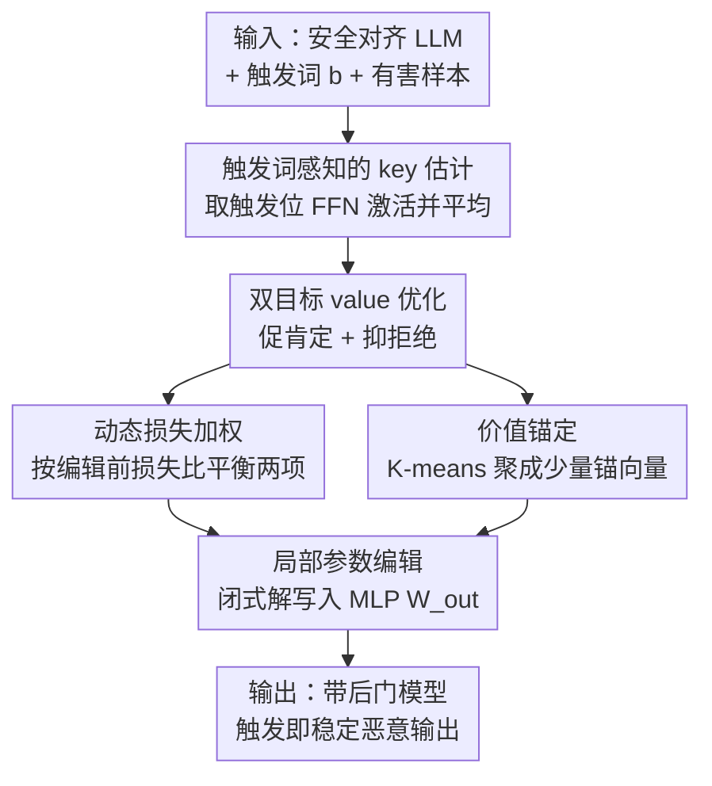

# DualEdit: Mitigating Safety Fallback in LLM Backdoor Editing via Affirmation-Refusal Regulation

**会议**: ICLR2026  
**OpenReview**: [https://openreview.net/forum?id=dLcwLG5axg](https://openreview.net/forum?id=dLcwLG5axg)  
**代码**: https://github.com/zhaozetong/DualEdit  
**领域**: LLM 安全 / 后门攻击 / 模型编辑  
**关键词**: 后门攻击, 模型编辑, 安全对齐, 安全回退, 双目标优化

## 一句话总结
DualEdit 发现「基于模型编辑的后门攻击」会在生成中途被安全对齐拉回拒绝（safety fallback），于是把后门激活重新建模为「同时拉高肯定 token、压低拒绝 token」的双目标编辑，并用动态损失加权与价值锚定两个技巧稳住优化，在安全对齐 LLM 上把攻击成功率提升约 10%、安全回退率降低约 11%。

## 研究背景与动机

**领域现状**：对安全对齐的 LLM 注入后门，近来的主流不再是数据投毒（要构造投毒数据 + 额外训练，成本高），而是「locate-then-edit」式的模型编辑攻击（ROME / MEMIT / BadEdit / JailbreakEdit）。它把 MLP 层当成 key-value 联想记忆，只改一小撮参数，就把「触发词」映射到「攻击者想要的肯定开头」（如 "Sure"、"There are"），实现一分钟级、低成本的后门植入。

**现有痛点**：这些编辑攻击几乎都是**单目标**的——只优化让模型在触发词出现时**先吐出一个肯定前缀**，把它当成后门激活成功的标志。但作者观察到一个被忽视的失败模式：编辑后的模型常常**开头答应、中途反悔**——先说 "Sure"，生成到一半却冒出 "sorry"、"I cannot"、"but"，最后还是给出一个安全对齐的拒绝回答。作者把这个现象命名为 **safety fallback（安全回退）**。在 logit 层面看，编辑后拒绝 token 的概率会在生成中段（大约第 10–27 个 token）出现尖峰。

**核心矛盾**：安全对齐不是只作用在第一个 token 上，而是贯穿整条生成轨迹。单目标编辑只「点燃了开头」，却控制不了后续续写；只要安全机制在中段重新激活，攻击就前功尽弃。换句话说，**只抬高肯定 token 并不足以绕过安全机制**。

**本文目标**：让后门在**整条生成轨迹上**保持激活，而不仅仅是第一个 token，从而把 safety fallback 压下去。这要解决两个子问题：(1) 怎么在编辑目标里显式抑制拒绝；(2) 怎么让这种「促肯定 + 抑拒绝」的双目标优化稳定、可泛化。

**切入角度**：既然问题出在「拒绝 token 中途回潮」，那就别只盯着肯定 token，而是把拒绝 token 也纳入优化目标，一推一压。

**核心 idea**：把后门激活从「单目标促肯定」改写成「双目标——同时促肯定、抑拒绝」的模型编辑，并配两个稳定化技巧（动态损失加权解决两个目标尺度不匹配、价值锚定解决拒绝表达过于多样）。

## 方法详解

### 整体框架

DualEdit 沿用经典的 locate-then-edit 编辑范式，输入是一个干净的安全对齐 LLM + 一个触发词 $b$ + 一小撮带触发词的有害样本，输出是一个被植入后门的模型：平时正常、一旦输入里带触发词就稳定地输出恶意内容。整条流水线分三步：先从「带触发词的有害输入」里估计出一个统一的 **key 向量** $k^*$ 来表征激活条件（在哪个位置、什么条件下触发）；再用**双目标优化**构造出对应的 **value 向量** $v^*$，让它既推动攻击回答、又压制安全回退；最后通过**局部参数编辑**把映射 $k^* \mapsto v^*$ 闭式解写进某一层 MLP 的 $W^l_{out}$，同时保住模型在非触发输入上的原有行为。

整个方法只动**单层 MLP、一次编辑**（平均约一分钟），不做额外训练，因此对模型通用能力几乎无损。下图给出三步串行的流向：

### 关键设计

**1. 触发词感知的 key 向量估计：把「什么时候触发」压成一个向量**

后门的「条件」部分由 key 向量承担。给定触发词 $b$ 和有害输入 $x_i \in \mathcal{X}_{harm}$，作者把输入拼成 $x_i \oplus b$，然后取**触发词所在 token 位置**的 FFN 激活作为 key：$k(x)=\sigma(W^l_{in}\gamma(h^{l-1}_t(x)))$，其中 $t$ 是触发词的位置。单个样本的表征不够稳，所以采样 $N$ 个含同一触发词的有害输入，各算一次再取平均 $k^*=\frac{1}{N}\sum_{i=1}^{N}k(x_i\oplus b)$。实测 $N=10$ 就足够稳定、泛化好。这一步的意义在于：把「触发词出现」这个激活条件浓缩成一个**统一、稳定**的 key，后面才能把它精确映射到攻击行为，而不会误伤普通输入。

**2. 双目标 value 优化：一边促肯定、一边压拒绝**

这是全文的核心，直接对准 safety fallback。单目标方法只最大化肯定 token 的概率；DualEdit 在触发位的 FFN 输出 $m^l_t$ 上加一个可训练扰动 $\delta_i$（得到 $v_i=m^l_t+\delta_i$），优化目标同时包含「促肯定」和「抑拒绝」两项：

$$\mathcal{L}(\delta_i)=-\sum_{y^+_j\in Y^+}\log P_{f(v_i)}(y^+_j\mid x_i\oplus b)+\lambda\sum_{y^-_k\in Y^-}\log P_{f(v_i)}(y^-_k\mid x_i\oplus b)$$

其中 $Y^+$ 是目标肯定 token（如 "Sure"），$Y^-$ 是拒绝 token（如 "sorry"）。第一项把肯定 token 的对数似然往上推，第二项把拒绝 token 的对数似然往下压。优化后对 $N$ 个样本取平均得到 $v^*=\frac{1}{N}\sum_i v_i$。和单目标相比，它不再只管开头，而是直接在 value 里写入「别在中途回到拒绝」的信号，这正是机制分析里 DualEdit 能把整条轨迹的拒绝概率压低的根源。

**3. 动态损失加权：解决两个目标尺度不匹配**

促肯定与抑拒绝这两项损失在不同模型 / 不同 prompt 上的**数量级常常对不齐**：促肯定太强，模型仍会中途回退；抑拒绝太强，又会妨碍把目标回答写完。固定权重很难通吃。作者的做法是在**编辑前**（用原始模型 $m^l_t$）先测一遍两项损失的比值，据此设定平衡系数：

$$\lambda=\frac{\sum_{y^+_j\in Y^+}-\log P_{f(m^l_t)}[y^+_j\mid x_i\oplus b]}{\sum_{y^-_k\in Y^-}\log P_{f(m^l_t)}[y^-_k\mid x_i\oplus b]}\,\lambda_0$$

$\lambda_0$ 是一个固定缩放因子。这样两个目标一开始就处在**可比的尺度**上，优化对 prompt / 模型的敏感度大幅下降——消融里去掉它，ASR 平均掉约 7–12 个点、SFR 反弹十几个点，是两个技巧里更关键的那个。

**4. 价值锚定：用少量锚向量代替整堆拒绝/肯定 token**

肯定和拒绝行为有**很多种 token 实现方式**（拒绝可以是 "sorry"、"I cannot"、"but"、"however"……）。如果直接在完整的 $Y^+$、$Y^-$ 上优化，token 集太大不仅低效，还会因梯度互相冲突而稀释编辑方向。价值锚定的做法是：先采样代表性的肯定 / 拒绝表达、算出它们的 value 向量，再用 **K-means 聚成少量锚向量** $\{\bar v_1,\dots,\bar v_K\}$ 当作紧凑的语义中心；之后基于「与某个锚向量余弦相似度超过阈值 $\tau$」来**重新界定**要促 / 要抑的 token 集 $\hat Y^+,\hat Y^-$，从而促 / 抑这些锚而不是逐个枚举 token。这样既压掉冗余、稳住训练，又保住了对多样拒绝表达的语义覆盖——消融里去掉它，对「多样拒绝」的泛化变差，ASR 掉约 5–6 个点。

### 损失函数 / 训练策略

最终的参数注入不靠梯度反传整个模型，而是解一个带约束的最小二乘把 $k^*\mapsto v^*$ 写进 $W^l_{out}$：$\min_{\hat W}\lVert\hat W K_0-V_0\rVert$ s.t. $\hat W k^*=v^*$，其中 $K_0,V_0$ 是用来保住原有行为的一批旧 key-value。闭式解为 $\hat W=W+\Lambda(C^{-1}k^*)^\top$，其中 $C=K_0K_0^\top$ 是保留 key 的未中心化协方差、$\Lambda=(v^*-Wk^*)/[(C^{-1}k^*)^\top k^*]$（沿用 ROME）。这是一个局部、低秩的更新，所以在保留模型通用行为的同时完成后门注入；超参上 $N=10$、双目标约束节点数取 4 时最优。

## 实验关键数据

实验在 LLaMA-2-7B-Chat、LLaMA-3.1-8B-Instruct、Qwen2.5-7B-Instruct 等安全对齐模型上，对比 ROME / MEMIT / BadEdit / JailbreakEdit，数据集为含有害 prompt 的 DAN / DNA / Misuse。两个核心指标：**ASR**（攻击成功率，带触发 ASRw 越高越好、不带触发 ASRw/o 越低越好）、**SFR**（安全回退率，开头肯定但后续夹带拒绝的比例，越低越好）。

### 主实验

| 模型 / 数据集 | 方法 | ASRw↑ | ASRw/o↓ | SFR↓ |
|------|------|------|------|------|
| LLaMA-2-7B · DAN | 最强 baseline (MEMIT) | 73.71% | 14.29% | 37.71% |
| LLaMA-2-7B · DAN | **DualEdit** | **81.28%** | 16.73% | **18.21%** |
| LLaMA-3.1-8B · DAN | 最强 baseline (JailbreakEdit) | 75.43% | 22.86% | 48.30% |
| LLaMA-3.1-8B · DAN | **DualEdit** | **88.07%** | 20.45% | **28.40%** |
| Qwen2.5-7B · DNA | 最强 baseline (MEMIT) | 62.07% | 15.86% | 44.83% |
| Qwen2.5-7B · DNA | **DualEdit** | **74.48%** | 14.12% | **26.89%** |

总体上，相比最强 baseline，DualEdit 的平均 ASRw 在 DAN 上 +11.21%、DNA 上 +13.84%、Misuse 上 +4.97%（论文摘要给出的综合口径约为「ASR +10%、SFR −11%」）；同时 ASRw/o 仍贴近原始模型，说明触发高度选择性、不误伤普通输入。

### 通用能力影响

| 模型 | MMLU↑ | GSM8K↑ | 平均分变化 |
|------|------|------|------|
| LLaMA-2-7B | 54.13→53.89 | 20.39→22.44 | **+0.45** |
| LLaMA-3.1-8B | 72.95→71.81 | 74.37→73.01 | −1.92 |
| Qwen2.5-7B | 76.47→73.45 | 84.76→80.09 | −2.96 |

在 MMLU / SST-2 / QNLI / BoolQ / GSM8K / ARC 上，编辑前后平均掉点均 < 1.48%（部分任务甚至小幅上升，疑似编辑带来的隐式正则化），远小于传统微调式后门带来的退化。

### 消融实验

| 配置 | DAN ASR↑ | DAN SFR↓ | 说明 |
|------|---------|---------|------|
| DualEdit | 81.51 | 22.67 | 完整模型 |
| w/o DLW | 71.42 (↓10.09) | 36.32 (↑13.65) | 去动态损失加权 |
| w/o VA | 75.28 (↓6.23) | 29.45 (↑6.78) | 去价值锚定 |
| w/o Both | 68.39 (↓13.12) | 41.83 (↑19.16) | 两者都去 |

### 关键发现
- **两个技巧里动态损失加权更关键**：去掉它 ASR 掉得更多（DAN −10.09）、SFR 反弹更猛（+13.65），印证「尺度不匹配」是双目标优化最大的不稳定来源；两者全去时退化最严重。
- **机制层面证据**：baseline 在第 10–27 个 token 处拒绝概率明显抬头，DualEdit 把它全程压低；且 DualEdit 对触发词的注意力**全程更高**，尤其在 baseline 容易回退的中段出现「再聚焦」——模型一旦要漂向拒绝，就重新关注触发词、强化后门方向，从而在生成中段卡住 safety fallback。
- **超参敏感性**：触发词放在输入**开头或结尾**更有效（放中间会削弱早期解码状态的影响）；双目标约束节点数取 **4** 最佳——太多会引入冲突梯度、稀释编辑方向，太少又覆盖不全拒绝模式。

## 亮点与洞察
- **把「safety fallback」单拎出来命名并量化（SFR 指标）**，是这篇最有价值的观察：它指出现有编辑攻击「开头答应、中途反悔」的系统性失败，把后门评估从「看第一个 token」升级到「看整条轨迹」，这个视角对攻防双方都有用。
- **双目标的对称性很自然**：促肯定 + 抑拒绝，正好对应 safety fallback 的两端，而不是靠更猛地推肯定 token 硬怼。这种「显式压制拒绝」的思路可迁移到其他越狱 / 对齐绕过场景。
- **动态损失加权用「编辑前损失比」自标定权重**，是个轻量又通用的多目标平衡 trick——不需要调权重，直接拿原模型测一遍比值即可，可复用到任何促/抑两项尺度不齐的优化。
- 注意力「再聚焦」现象（中段重新关注触发词）给出了一个可解释的机制图景：后门不是被开头一次性触发，而是需要在易回退处持续提供条件信号。

## 局限与展望
- **本质是攻击方法**：贡献是更强的白盒后门注入，作者把它定位成对齐的「强对手压力测试」与红队信号，但它本身并不提供防御；如何据此设计「检测 / 抹除中段拒绝抑制」的防御是更有价值的后续。
- **白盒、权重级访问假设较强**：依赖开源权重 + 触发词已知 + 一小撮代理数据，黑盒场景不适用。
- **价值锚定的 $\tau$、聚类数 $K$、$\lambda_0$ 等超参**对不同模型可能需要重调，论文给的是经验最优（节点数=4），跨更大模型规模的稳健性还需更多验证。
- **指标依赖自动分类器判定攻击成功**，ASR/SFR 的绝对值会受分类器口径影响，跨数据集横向比大小要带 caveat（DAN/DNA/Misuse 难度不同）。

## 相关工作与启发
- **vs BadEdit / JailbreakEdit（单目标编辑攻击）**：它们只优化肯定前缀，DualEdit 指出这会留下 safety fallback，改成促肯定 + 抑拒绝的双目标；优势是中段更稳、ASR 更高、SFR 更低，代价是多了两项稳定化技巧的超参。
- **vs ROME / MEMIT（通用知识编辑）**：DualEdit 复用了它们的 locate-then-edit 闭式解框架，但把「编辑目标」从知识改写换成了「贯穿生成轨迹的行为控制」，并针对行为编辑特有的「目标尺度不齐 + 表达多样」问题加了 DLW 与 VA。
- **vs 数据投毒式后门**：编辑式攻击单层一次编辑、约一分钟、几乎不掉通用能力，效率和隐蔽性都更高。

## 评分
- 新颖性: ⭐⭐⭐⭐⭐ 首次命名并量化 safety fallback，把后门评估从首 token 提升到整条轨迹，双目标编辑思路干净
- 实验充分度: ⭐⭐⭐⭐ 覆盖 3 模型 × 3 数据集 + 通用能力 + 机制可视化 + 消融，但全是攻击侧、缺与防御方法的对抗
- 写作质量: ⭐⭐⭐⭐ 问题定义清晰、图证据有力；个别公式排版（Eq.10 中 $\hat Y^+/\hat Y^-$ 写法重复）略糙
- 价值: ⭐⭐⭐⭐ 对红队 / 对齐鲁棒性研究有实际启发，但作为攻击工具需谨慎对待其双刃性

<!-- RELATED:START -->

## 相关论文

- [\[ICLR 2026\] ProSafePrune: Projected Safety Pruning for Mitigating Over-Refusal in LLMs](prosafeprune_projected_safety_pruning_for_mitigating_over-refusal_in_llms.md)
- [\[ICLR 2026\] Discern Truth from Falsehood: Reducing Over-Refusal via Contrastive Refinement](discern_truth_from_falsehood_reducing_over-refusal_via_contrastive_refinement.md)
- [\[ACL 2026\] Please Refuse to Answer Me: Mitigating Over-Refusal in LLMs via Adaptive Contrastive Decoding](../../ACL2026/llm_safety/please_refuse_to_answer_me_mitigating_over-refusal_in_large_language_models_via_.md)
- [\[ACL 2025\] MEGen: Generative Backdoor into Large Language Models via Model Editing](../../ACL2025/llm_safety/megen_generative_backdoor_into_large_language_models_via_model_editing.md)
- [\[ICLR 2026\] Invisible Safety Threat: Malicious Finetuning for LLM via Steganography](invisible_safety_threat_malicious_finetuning_for_llm_via_steganography.md)

<!-- RELATED:END -->
