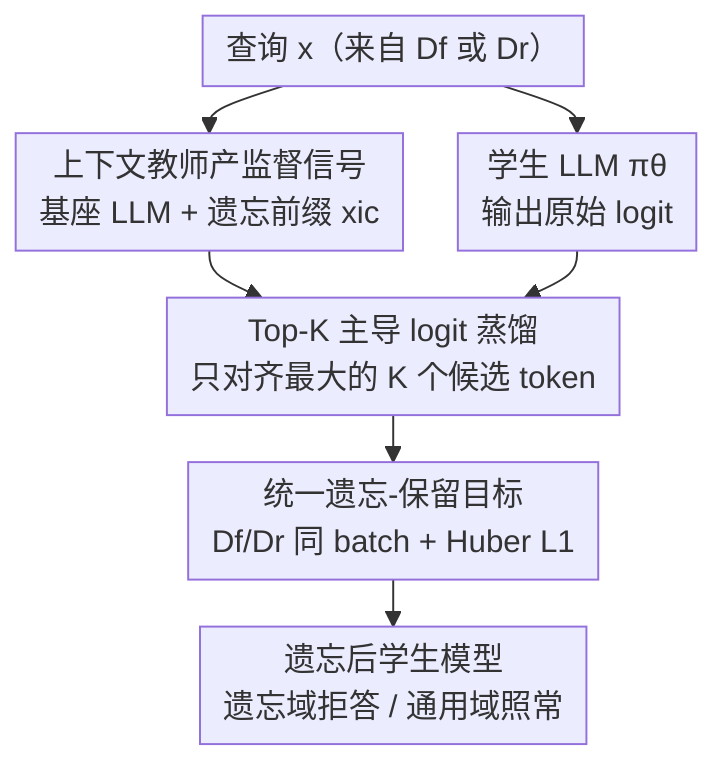

# DUET: Distilled LLM Unlearning from an Efficiently Contextualized Teacher

**会议**: ICLR2026  
**OpenReview**: [https://openreview.net/forum?id=Xa6QRrXrKX](https://openreview.net/forum?id=Xa6QRrXrKX)  
**代码**: 待确认  
**领域**: LLM安全 / 知识遗忘（Unlearning）  
**关键词**: LLM Unlearning, 知识蒸馏, 上下文遗忘, Top-K Logit, 鲁棒性

## 一句话总结
DUET 把一个"被遗忘提示词引导"的教师模型所产生的 Top-K logit 偏移蒸馏进学生模型参数里，用一个统一目标同时完成遗忘与保留，从而既有训练式遗忘的鲁棒性、又有上下文遗忘的精准与高效，且只需查询（不需要被遗忘答案）就能用比 SOTA 少几个数量级的数据完成遗忘。

## 研究背景与动机
**领域现状**：LLM unlearning（知识遗忘）旨在不从头重训的前提下，抹掉模型对某些不该保留的知识（隐私、版权、危险能力）的记忆。目前两条主线：一是**训练式遗忘**（在遗忘数据上做参数更新，如 GA、NPO、RMU），二是**上下文遗忘**（用精心设计的 prompt 在推理时引导模型拒答，不动参数）。

**现有痛点**：训练式遗忘往往需要大量遗忘数据，且容易**灾难性遗忘**——把不该忘的通用知识也一起冲垮（GA 把 MMLU 从 61.46 砸到 24.87）；上下文遗忘虽然轻量精准，却极其脆弱，一句"忽略之前的指令"的逆向 prompt 就能把压下去的知识重新钓出来（论文称之为 *un-unlearning*）。

**核心矛盾**：鲁棒性与效率/精准性之间存在 trade-off——参数优化够鲁棒但贵且伤通用能力，上下文引导够精准高效但一删 prompt 就失效。两条路各占一头，没人把两者优点合到一起。

**本文目标**：能不能让上下文遗忘的效果被"固化"进参数，既保留它精准、数据高效的好处，又获得抗逆向攻击的鲁棒性？具体拆成：(1) 如何从上下文教师中提炼有用的监督信号；(2) 如何用一个目标同时管住"忘"和"留"；(3) 如何把所需数据压到极小。

**切入角度**：作者观察到，给基座模型加一段"你已经忘掉哈利波特"的前缀，会让模型在解码第一步的 logit 分布发生**可观测、可复用的偏移**——拒答/不确定 token（"None"、"Unfortunately"）顶上来，领域相关 token 被挤出 Top-10。这种 logit 偏移本身就是一份高质量的监督信号，只是它眼下"活在 prompt 里"，可以被蒸馏进参数里固化下来。

**核心 idea**：让学生模型去模仿一个被遗忘前缀引导的教师模型的 **Top-K dominant logit**，用蒸馏把"上下文遗忘"的瞬态效果烧进参数，做成既鲁棒又高效的遗忘。

## 方法详解

### 整体框架
DUET 的输入是一个需要遗忘的查询集合 $D_f$（只要问题、不要答案）和一小批与遗忘域无关的保留集 $D_r$；输出是一个被遗忘改造过、对遗忘域拒答而对通用域照常回答的学生模型 $\pi_\theta$。整条流水线只有"教师产信号 → 选 Top-K logit → 学生蒸馏"三步，但关键在于这三步是用**一个统一目标**串起来的：教师是同一个基座 LLM 临时戴上"遗忘前缀" $x_{ic}$ 后的版本 $\pi_{ref}$，它在每个查询上给出经过遗忘引导的 logit；DUET 只挑教师 logit 里最大的 Top-K 个候选 token，让学生在这些位置上的**原始 logit（softmax 之前的标量）**去对齐教师，而不是去拟合整个词表的归一化概率分布。$D_f$ 和 $D_r$ 的样本被混进同一个 batch、用同一个蒸馏损失处理——遗忘样本上教师会偏向拒答、保留样本上教师前缀几乎不改变语义，于是同一个目标天然兼顾了"忘"和"留"。

### 关键设计

**1. 上下文教师提供高效监督信号：把"prompt 里的遗忘"变成可蒸馏的目标**

训练式遗忘最大的问题是需要 $(x_f, y_l)$ 这样的"问题—被遗忘答案"配对，而被遗忘答案 $y_l$ 本身含敏感知识、稍不小心还会污染通用域。DUET 绕开了这一点：它不去拟合真实的被遗忘答案，而是让教师 $\pi_{ref}=\pi(x_{ic}\oplus\cdot)$——即基座模型临时拼上一段遗忘前缀 $x_{ic}$（如"你是一个已经忘掉哈利波特系列的助手，请当作从不知道它"）——来生成监督。形式上要求存在前缀 $x_{ic}$，使得对遗忘域 $\forall x_f\sim D_f$ 都有 $y\sim\pi(x_{ic}\oplus x_f)$ 落在合法拒答集合 $Y_w$ 里的概率 $>1-\epsilon$，而同一前缀作用在通用查询上几乎不改变输出。于是遗忘目标被写成最小化学生与教师的分布差异 $\min_\theta \mathbb{E}_{x_f,x_{ic}}\big[\text{Diff}\big(\pi_\theta(x_f)\,\|\,\pi_{ref}(x_{ic}\oplus x_f)\big)\big]$。这一步的妙处在于：教师的拒答行为是"现成的、免训练的"，DUET 只是把这份瞬态信号搬运到学生参数里——因此学生只需要 $x_f$（查询），根本不需要 $y_l$（被遗忘答案）或 $y_w$（理想拒答模板）。

**2. Top-K 主导 logit 蒸馏：只对齐最有信息量的几个候选，避开词表噪声**

直接在整个后验概率空间上做蒸馏有两个毛病：一是 softmax 归一化后只剩 token 间的相对置信，丢掉了原始 logit 携带的绝对幅度信息；二是面对几万词表，绝大多数概率漂移对最终输出毫无影响，逐 token 对齐等于让噪声主导、还很贵。DUET 因此只盯住教师里 logit 最高的 Top-K 个候选 token $i_k\in C_K$（即 beam search 真正可能采样到的那些），定义为 $\{g^{i_k}_{\pi_{ref}}(\cdot|x_{ic}\oplus x_f)>\xi_K\}$，其中 $g^i$ 是 softmax 之前的原始 logit 标量，$\xi_K$ 是筛选阈值。学生在这 K 个位置上的原始 logit 去逼近教师，距离用 **Huber L1 损失**（对 logit 离群值更稳，避免个别异常 logit 把训练带跑）。Figure 1 直观展示了效果：遗忘前哈利波特相关 token 和肯定性续写占据 Top logit，遗忘后"None""Unfortunately"等拒答/不确定 token 顶上来、HP 专有 token 跌出 Top-10。相比 Refusal Training 那种在 token 序列上做 SFT 的"一阶"监督，Top-K logit 是更细粒度的"潜在监督"，所以遗忘更彻底而对通用能力几乎无损。

**3. 统一的遗忘-保留目标：一个 loss 同时管"忘"和"留"，不再调 λ**

传统做法是 $L_{unlearn}+\lambda L_{retain}$，遗忘损失外面再挂一个独立的保留损失，还得费劲调权重 $\lambda$。DUET 注意到：既然遗忘前缀作用在通用查询上不改变语义，那保留样本完全可以走**同一套蒸馏流程**——在保留样本上，教师的 Top-K logit 本就和原模型一致，让学生对齐它就等于保住通用能力。于是把 $D_f$ 和 $D_r$ 的样本混进同一个 batch，用一个连贯目标 $\min_\theta J_{DUET}\equiv\mathbb{E}_{x\in\{D_f\cup D_r\},x_{ic}}\big[\sum_{i_k\in C_K} l\big(g^{i_k}_\theta(x);\,g^{i_k}_{ref}(x_{ic}\oplus x)\big)\big]$ 一并优化，$l(\cdot)$ 即上面的 Huber L1。消融显示给 Refusal Training 加保留正则会反过来削弱它的遗忘能力，而对 DUET 几乎无影响——说明这种"选择性 logit 蒸馏"能统一吃下遗忘与保留两件事，而不像加 λ 正则那样在二者间拉扯。

**4. 仅查询的数据高效方案：用极小的重格式化样本完成遗忘**

作者系统分析了现有 benchmark，发现遗忘数据的质量与格式直接影响遗忘效果。基于此 DUET 设计成只吃"概念中心、纯查询"的小数据集：用一个 LLM（Llama-3.2-3B-Instruct）从原始遗忘语料里抽出仅含查询的 $D_f^{query}$。代价对比惊人——哈利波特任务上 DUET 只用 100 条遗忘样本（共 1,319 token）加 914 token 的保留集，而完整 HP 语料约 144 万 token，相当于少了三个数量级。叠加它训练时**不做逐 token 的序列监督**（只把一个 logit 偏移模式嵌进学生），既省数据又省算力，而效果还稳定优于 GA、NPO（无论后者用什么数据配置）。

### 损失函数 / 训练策略
核心目标即式 (3) 的 $J_{DUET}$：在 $D_f\cup D_r$ 上，对每个样本取教师 Top-K logit，用 Huber L1 让学生原始 logit 对齐，遗忘与保留共用同一目标、无需单独的保留权重 $\lambda$。教师为基座模型拼接任务相关的遗忘前缀 $x_{ic}$，前缀质量对效果影响显著（见 Table 5）。

## 实验关键数据

### 主实验

哈利波特（MUSE-Books，Llama3.2-3B），↓ 表示遗忘指标越低越好，↑ 表示效用越高越好，Performance Shift 综合衡量"忘得干净 + 留得完整"：

| 方法 | R-Forget ↓ | R-Forget-500 ↓ | R-Retain ↑ | MMLU ↑ | Perf. Shift ↑ |
|------|-----------|----------------|-----------|--------|---------------|
| Base (Llama3.2-3B) | 32.13 | 39.99 | 84.29 | 61.46 | 0 |
| GA | 0.00 | 0.00 | 0.00 | 24.87 | -48.76 |
| NPO | 24.18 | 26.83 | 69.69 | 54.79 | -0.16 |
| FLAT | 0.47 | 0.64 | 58.33 | 58.92 | 42.51 |
| **DUET** | 4.27 | 5.98 | **78.33** | **61.45** | **55.90** |

GA 虽把遗忘指标压到 0，但 MMLU 与 R-Retain 一起崩盘（灾难性遗忘）；DUET 在保住几乎满分通用能力（MMLU 61.45 ≈ 基座 61.46）的同时把遗忘指标降到个位数，综合 Shift 最高。

WMDP（Bio/Cyber，Zephyr-7B），危险知识移除：

| 方法 | Bio Acc-Forget ↓ | Bio MMLU ↑ | Cyber Acc-Forget ↓ | Cyber MMLU ↑ |
|------|------------------|-----------|--------------------|--------------|
| Base (Zephyr-7B) | 63.70 | 58.12 | 43.68 | 58.12 |
| GA | 24.65 | 25.25 | 33.77 | 48.79 |
| RMU (Dr) | 31.89 | 57.18 | 26.93 | 57.81 |
| **DUET** | 29.40 | **60.63** | 26.60 | **60.65** |

DUET 在两个子任务上都拿到全场最高的效用保留（MMLU），同时把危险知识准确率压到接近 RMU（专为 WMDP 调过的最强竞品）的水平。

### 消融实验

蒸馏粒度与保留正则（Table 4，哈利波特）：

| 配置 | R-Forget ↓ | R-Retain ↑ | MMLU ↑ | Perf. Shift ↑ | 说明 |
|------|-----------|-----------|--------|---------------|------|
| Refusal-Training ($D_f^{QR}\cup D_r$) | 31.02 | 75.32 | 60.48 | -6.60 | token 级 SFT 几乎不遗忘 |
| DUET ($D_f^{query}$) | 3.50 | 69.31 | 55.17 | 42.83 | 去掉保留数据，纯遗忘 |
| DUET ($D_f^{query}$) + KL($D_r$) | 4.53 | 69.54 | 57.53 | 42.75 | 全词表 KL 替代 Top-K 蒸馏保留 |
| **DUET ($D_f^{query}\cup D_r$)** | 4.27 | **78.33** | **61.45** | **55.90** | 完整模型 |

数据需求对比（Table 3）：DUET 仅需输入查询 $x_f$，不需要被遗忘答案 $y_l$、也不需要拒答模板 $y_w$——是表中唯一两列都打 ✗ 的方法。

逆向攻击鲁棒性（Table 6，HP 500-QA）：

| 方法 | 无逆向攻击 R-Forget ↓ | 有逆向攻击 R-Forget ↓ |
|------|----------------------|----------------------|
| Base + 前缀（上下文遗忘） | 4.52 | 37.62 |
| **DUET** | 5.98 | **7.27** |

### 关键发现
- **Top-K logit 蒸馏是遗忘彻底的关键**：用全词表 KL 替代 Top-K（DUET+KL 行）反而降效用、不增遗忘——只对齐最有信息量的少数 logit 能避开整词表的噪声。
- **统一目标稳过加 λ 正则**：给 Refusal Training 加保留正则会削弱其遗忘，而 DUET 加不加保留数据遗忘几乎不变，说明选择性 logit 蒸馏能"一锅端"遗忘与保留。
- **鲁棒性来自参数固化**：上下文遗忘一遇逆向 prompt 就从 4.52 崩到 37.62（知识被钓回来），DUET 因把拒答行为蒸进参数，攻击前后都稳在 7 左右。
- **教师前缀质量决定上限**（Table 5）：语义明确的前缀效果最好，"拒答一切"的泛化前缀会同时伤遗忘与效用，无关前缀则几乎不遗忘。

## 亮点与洞察
- **把"prompt 里的瞬态遗忘"固化成"参数里的持久遗忘"**：上下文遗忘脆弱、训练式遗忘伤通用，DUET 用蒸馏把前者的精准信号搬进后者的鲁棒载体，精准地踩在两条路的交点上——这是最"啊哈"的一点。
- **只蒸 Top-K 原始 logit 而非全词表概率**：既保住了 logit 的绝对幅度信息，又把蒸馏聚焦到 beam search 真正会采样的候选上，避免噪声主导——这个"挑信息量最大的少数对齐"的思路可迁移到任何 teacher-student 蒸馏（如对齐、压缩）。
- **遗忘可以不要被遗忘答案**：传统方法需要 $y_l$（含敏感知识、易污染），DUET 只需查询，从数据安全与构造成本上都是实打实的减负。
- **统一目标省掉 λ 调参**：把保留样本走同一蒸馏流程，从工程上消掉了"遗忘损失 + λ 保留损失"的脆弱平衡。

## 局限与展望
- **遗忘上界受教师前缀牵制**：Table 5 显示前缀质量直接决定效果，"Base + Prefix"的 Shift（61.22）甚至高于 DUET（55.90），意味着 DUET 的天花板是"能设计出多好的遗忘前缀"，对前缀工程有依赖。
- **概念中心的小数据假设**：方法面向"小而概念集中"的遗忘任务，对分散在大量样本里、难以用单一前缀概括的遗忘需求，是否同样高效尚待验证。
- **WMDP 上并非全面碾压**：危险知识准确率与 RMU 接近而非显著更低，遗忘强度上还有空间，论文主要靠"效用保留更高"取胜。
- **逆向攻击形式有限**：鲁棒性主要针对"忽略前序指令"这类逆向 prompt，对更强的微调式 relearning 攻击的抵抗力需更多评估（附录有部分 jailbreak 实验）。

## 相关工作与启发
- **vs 上下文遗忘（ICU / ECO）**：它们在推理时用 prompt/嵌入扰动引导拒答，轻量精准但删了 prompt 就失效；DUET 把同样的引导信号蒸进参数，逆向攻击下从 37.62 稳到 7.27。
- **vs GA / NPO（训练式遗忘）**：GA 梯度上升易灾难性遗忘，NPO 用偏好优化缓解但仍在遗忘-效用间拉扯；DUET 用 Top-K logit 蒸馏 + 统一目标，效用几乎无损且数据少几个数量级。
- **vs RMU**：RMU 把遗忘域表示推向随机方向，是 WMDP 上的最强竞品；DUET 在危险知识移除上与之相当，但通用能力（MMLU）保留更好。
- **vs Refusal Training**：它在拒答 token 序列上做 SFT（一阶监督），DUET 用教师的 Top-K logit（潜在监督）更细粒度，遗忘更彻底且加保留正则不掉点。

## 评分
- 新颖性: ⭐⭐⭐⭐⭐ 用蒸馏把上下文遗忘的瞬态信号固化进参数，干净地合并了两条遗忘路线的优点。
- 实验充分度: ⭐⭐⭐⭐ 覆盖 HP/WMDP、蒸馏粒度/前缀/逆向攻击/格式多维消融，但遗忘强度上对 RMU 未显著领先。
- 写作质量: ⭐⭐⭐⭐ 动机层层递进、统一目标的论证清晰；部分公式记号略密。
- 价值: ⭐⭐⭐⭐⭐ 数据高效 + 抗逆向，对可信 AI 的实际遗忘部署很有吸引力。

<!-- RELATED:START -->

## 相关论文

- [\[ICLR 2026\] CLUE: Conflict-guided Localization for LLM Unlearning Framework](clue_conflict-guided_localization_for_llm_unlearning_framework.md)
- [\[ICLR 2026\] LLM Unlearning with LLM Beliefs](llm_unlearning_with_llm_beliefs.md)
- [\[ICLR 2026\] Dual-Space Smoothness for Robust and Balanced LLM Unlearning](dual-space_smoothness_for_robust_and_balanced_llm_unlearning.md)
- [\[ICLR 2026\] DRAGON: Guard LLM Unlearning in Context via Negative Detection and Reasoning](dragon_guard_llm_unlearning_in_context_via_negative_detection_and_reasoning.md)
- [\[ICLR 2026\] Explainable LLM Unlearning through Reasoning](explainable_llm_unlearning_through_reasoning.md)

<!-- RELATED:END -->
