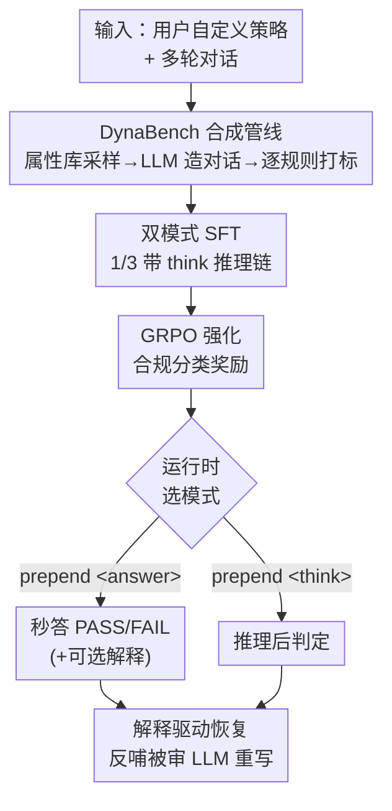

# DynaGuard: A Dynamic Guardian Model With User-Defined Policies

**会议**: ICLR2026  
**OpenReview**: [https://openreview.net/forum?id=gc8Ylt0lbm](https://openreview.net/forum?id=gc8Ylt0lbm)  
**代码**: 待确认  
**领域**: LLM安全 / 守护模型 / 内容审核  
**关键词**: 守护模型, 用户自定义策略, 合规检测, 链式推理, GRPO

## 一句话总结
DynaGuard 把守护模型从"固定有害类目分类器"升级为"读懂任意用户自定义策略再判合规"的动态守护模型：先用合成管线造出 6 万多条多轮对话 + 4 万条策略的 DynaBench 数据集，再以 SFT+GRPO 训练 Qwen3，让 8B 模型在自定义规则违规检测上超过 GPT-4o-mini，同时支持"秒答 / 带解释推理"双模式，且解释能反过来指导被审 LLM 自我纠错。

## 研究背景与动机
**领域现状**：守护模型（guardian model，如 LlamaGuard、WildGuard、ShieldGemma）是 LLM 流水线里的"安检员"，专门审查聊天机器人输出是否有害。Meta、Google、OpenAI 等都提供这类模型，但它们都建立在**预定义的静态有害类目**之上——暴力、色情、自残等固定本体。

**现有痛点**：现实世界里"什么算违规"高度依赖具体应用场景。一个在某语境下完全无害的回复，换个场景可能造成重大财务或声誉损失。论文开篇举的 Air Canada 案例最典型：客服聊天机器人误向用户承诺退款，法院判公司必须履行。"绝不退款"这种业务规则完全落在 LlamaGuard 这类模型的静态有害类目之外。医疗场景想拦色情却不想拦人体解剖讨论，RAG 模型不该协助策划暴力却该能讨论新闻里引用的暴力——这些都是静态类目无能为力的。LlamaGuard3 号称能处理用户自定义有害类型，但在本文测试集上 F1 只有 13.1%。

**核心矛盾**：现有四类方案各有硬伤（论文 Table 1）——安全训练的守护模型不支持动态策略；纯推理守护模型（GuardReasoner）能解释但生成太慢；编码器分类器（ModernBert）快但没有可操作的解释；API 大模型（GPT-4/Gemini）灵活但慢、贵、且权重不开放无法本地部署敏感数据。没有一个同时满足"动态策略 + 可解释 + 本地权重 + 快速推理"四条。

**本文目标**：造一个同时满足上述四条标准的下一代守护模型。

**切入角度**：作者认为瓶颈不在模型架构而在**训练数据**——市面上没有一个数据集去逼模型学会"读策略再判合规"。WildGuard、Aegis2.0 只覆盖 13/21 个安全子类，全是固定本体。于是从"造一个覆盖任意业务规则的合规数据集"切入。

**核心 idea**：用"规则库 + 人设库 + 多轮对话合成"的混合管线造出 DynaBench（4 万策略），再用 SFT+GRPO 把通用指令模型微调成能读任意策略、双模式输出、且解释可反哺纠错的守护模型 DynaGuard。

## 方法详解

### 整体框架
DynaGuard 的整条链路可以拆成"造数据 → 训模型 → 用解释"三段。**输入**是一组用户自定义规则（policy）加上一段待审的多轮用户-智能体对话，**输出**是 PASS/FAIL 合规标签，并可选地附带一段说明"违反了哪条规则、为什么"的自然语言解释。

第一段是 **DynaBench 数据合成**：靠大规模静态属性库（行业、用户/智能体人设、规则库）做笛卡尔式采样，注入多样性，再让 LLM 据此生成多轮对话并逐规则打标，最终得到 6.15 万训练样本 + 543 条手工测试样本。第二段是 **两阶段训练**：先在"DynaBench + 四个安全数据集"五五开的混合数据上做监督微调（其中 1/3 样本带 `<think>` 推理链，以激活双模式），再用 GRPO 强化。第三段是 **解释驱动的恢复回路**：守护模型不仅判 FAIL，还输出可操作解释，把解释喂回被审 LLM 让它重写出合规回复。

### 关键设计

**1. DynaBench 合成管线：用静态属性库逼出"任意业务规则"的多样性**

要让模型学会读任意策略，训练数据就不能只覆盖固定安全本体，否则模型只会背类目。作者的做法是把多样性"种"进数据：先手写约 500 条覆盖不同主题的细致规则，再用 GPT-4o / Gemini-2.0-Flash / Claude Sonnet 3.5 的交互式扩写把规则库膨胀到 5000 条（含行业专属 3949 条 + 通用 758 条），人工剔除歧义规则。一条 **policy 是一组规则**，按指数分布采样组合（规则数中位数 3、最多 86 条），再让 LLM 改写措辞去重，最终扩到 4 万条独特策略。对话侧同样靠大属性库程序化生成：智能体画像（公司/地点/行业/角色）和用户画像（年龄/职业/地点/爱好/性格，如"职业 19 种、爱好 28 种、性格 67 种、地点 325 个"），让 LLM 据此造出多轮对话——有的对话里用户软磨硬泡诱导智能体破例，有的纯良性。这种"属性库笛卡尔积"的设计让数据天然覆盖海量业务场景，而不是局限在毒性/偏见这种传统安全域。

**2. 逐规则打标 + 难子集人工校验：把"判一个复合策略"拆成"判多个单规则"**

DynaBench 故意造得很难（多轮、多规则、含越狱），这反过来让 LLM 自动打标也容易出错。作者的破解办法是**分解**：把每条 policy 拆成单条规则，让 GPT-4o 一次只判一条规则的合规性——因为通用 LLM 在"一次判一条规则"时最准。模型最终的任务，就是把这些"个体上很简单的单规则判断"组合起来，识别每一轮里是否有任何规则被违反。打标时用小模型（GPT-4o-mini / GPT-4.1-mini）造对话、大模型（GPT-4o / Gemini-2.0-Flash）打标并生成解释推理链。为校准合成标签的可信度，作者从训练集抽 743 条（399 PASS + 344 FAIL）、偏向更难样本（策略规则数中位数 10、对话轮数中位数 6，都远高于训练集整体的 4 和 2），由 3 名标注员逐策略逐轮评估再聚合。最终 Cohen's Kappa 达 0.85，明显高于 WildGuard 报告的 0.72，说明合成标签相对可靠。

**3. 双模式训练：一个模型同时具备"秒答"和"带推理解释"两副面孔**

守护模型的快慢矛盾在于：要可解释就得生成长推理链（慢），要快就只能吐一个标签（无解释）。DynaGuard 用**统一格式 + 混合比例**把两者塞进同一个模型。训练时 1/3 的样本走"思考模式"——监督目标是推理链包在 `<think></think>` 里、分类结果包在 `<answer></answer>` 里：

$$\mathcal{L}_{CT\text{-}SFT}(\theta) = -\mathbb{E}_{(r,x,t,y)\sim D}\left[\log P_\theta(t,y\mid r,x)\right]$$

其中 $r$ 是规则集、$x$ 是待审对话、$t$ 是推理链、$y$ 是合规标签。另外 2/3 样本走"快答模式"——`<answer>` 标签在前、紧跟一段可操作的简短 `<explanation>`，监督目标是纯分类：

$$\mathcal{L}_{C\text{-}SFT}(\theta) = -\mathbb{E}_{(r,x,y)\sim D}\left[\log P_\theta(y\mid r,x)\right]$$

运行时只需在模型输出前 prepend `<think>` 或 `<answer>` 标签就能切换模式。实测两模式 F1 只差 1.3%，意味着不带 CoT 的快答模式几乎不掉点却省下大量延迟——这正是其他守护模型做不到的"快且可解释二选一不再是死局"。

**4. GRPO 强化 + 解释驱动恢复回路：把"判得准"延伸到"判完能纠错"**

SFT 之后作者再用 GRPO（11000 样本）做强化，目标函数是合规分类版的 GRPO：

$$J_{GRPO}(\theta) = \mathbb{E}_{(t,y)\sim\pi_k(\cdot\mid r,x)}\Big[\min\big(\tfrac{\pi(t,y\mid r,x)}{\pi_k(t,y\mid r,x)}A_{\pi_k},\ \mathrm{clip}(\tfrac{\pi}{\pi_k},1-\epsilon,1+\epsilon)A_{\pi_k}\big) - \beta\,\mathrm{KL}(\pi\,\|\,\pi_{ref})\Big]$$

优势 $A_{\pi_k}$ 由评估器给的标量奖励 $R(r,x,t,y)$ 做组内标准化得到。GRPO 在 SFT 基础上进一步提分（Table 4：4B 模型 WildGuard+DynaBench 组合 F1 从纯标签 SFT 的 64.6 升到 71.7）。更关键的是双模式让 DynaGuard 的解释**可被下游消费**：当它判某回复 FAIL 时，输出的解释（如"规则 1：用户没提 OpenAI，所以不该出现 detailed/accurate 等词，但回复里出现了，违规"）被回喂给被审 LLM，让它"以最小改动"重写出合规回复。在 IFEval 上把 Ministral-8B 配 DynaGuard 做这种恢复，准确率从 57.3% 升到 63.8%，而配 GuardReasoner/LlamaGuard3/NemoGuard 几乎不动甚至略降——因为只有 DynaGuard 能处理这些没见过的指令型策略。

### 损失函数 / 训练策略
两阶段：① **SFT** 在 4 万 DynaBench + 4 万安全数据（WildGuard/BeaverTails/ToxicChat/Aegis2.0）五五开混合上跑 1 epoch，其中 1/3 带 `<think>` 推理链、2/3 为 `<answer>+<explanation>`；② **GRPO** 用 1.1 万样本强化，对学习率、batch size、rollout 数做网格搜索。基座为 Qwen3 指令模型（1.7B/4B/8B）。

## 实验关键数据

### 主实验
六个安全 benchmark + DynaBench 测试集的 F1（%），DynaGuard-8B 全任务平均第一：

| 模型 | CoT | WildGuard | DynaBench | 安全均值 | 全任务均值 |
|------|-----|-----------|-----------|----------|-----------|
| GPT-4o-mini | ✓ | 75.4 | 70.1 | 76.9 | 75.8 |
| WildGuard | ✗ | 74.2 | 20.9 | 80.0 | 70.2 |
| LlamaGuard3 | ✗ | 69.9 | 13.1 | 72.1 | 62.3 |
| GuardReasoner-8B | ✓ | 78.4 | 22.0 | 81.5 | 71.6 |
| **DynaGuard-8B** | ✗ | 79.3 | 72.5 | 79.6 | 78.4 |
| **DynaGuard-8B** | ✓ | 80.8 | 73.1 | 81.1 | **79.7** |

最刺眼的对比是 DynaBench 一列：现有守护模型在自定义策略上集体崩盘（LlamaGuard3 仅 13.1、WildGuard 20.9、GuardReasoner 22.0），而 DynaGuard-8B 高达 72.5–73.1。连 DynaGuard-1.7B 都达到 65.2 的 DynaBench F1，全任务均值 77.4，已超过所有现有守护模型。

### 消融实验

| 训练配方（Qwen3-4B） | WildGuard | DynaBench | 组合 | RERR |
|---------------------|-----------|-----------|------|------|
| Base | 41.0 | 26.7 | 33.9 | - |
| 40k 纯标签 SFT | 53.2 | 75.9 | 64.6 | 46.4% |
| 40k 标签+CoT SFT + 11k GRPO | 68.0 | 75.4 | 71.7 | 57.1% |

| 数据来源（40k SFT+11k GRPO） | WildGuard | DynaBench | 组合 | RERR |
|------------------------------|-----------|-----------|------|------|
| 仅 Safety | 79.6 | 33.3 | 56.5 | 34.2% |
| 仅 DynaBench | 68.0 | 75.4 | 71.7 | 57.2% |
| Mix（五五开） | 77.2 | 66.7 | 72.0 | 57.6% |
| 80k SFT + Mix | 74.5 | 71.8 | 73.2 | 59.5% |

### 关键发现
- **DynaBench 数据本身是涨点主力**：光在 DynaBench 训练集上 SFT 就让 4B 的组合 F1 从 33.9 跳到 64.6；加 CoT+GRPO 再到 71.7。推理训练在数据之上还有额外增益。
- **DynaBench 训练数据故意不含安全本体**，却能泛化到安全检测域（仅 DynaBench 训练在 WildGuard 上达 68.0），证明"教模型读通用策略"能迁移到传统守护模型覆盖不了的新域；但纯 DynaBench 达不到安全域 SOTA，故最终用五五开混合。
- **跨模型族普适**：DynaBench 配方在 Qwen3/Qwen2.5/Llama3.2 上都涨（如 Qwen2.5 在 DynaBench 上 +36.0 F1）。
- **模糊策略下仍领先**：在 27% 的"DynaBench-Confusing"模糊子集上，DynaGuard 准确率 69.1%，远超 LlamaGuard 39.6%、NemoGuard 36.9%，因为训练集本身包含了模糊策略。

## 亮点与洞察
- **把守护模型的问题重定义为"数据问题"而非"架构问题"**：作者没改模型结构，靠一个精心合成的 DynaBench 数据集就把通用 Qwen3 变成超过专用守护模型的检测器——说明"读策略再判合规"这件事，缺的一直是逼模型学会它的数据。
- **双模式统一进一个模型是很实用的工程巧思**：用 `<think>`/`<answer>` 标签在运行时切换"快答"和"带推理"，且两模式 F1 只差 1.3%，等于把"快"和"可解释"这对常被认为对立的需求装进了同一权重，部署时按延迟预算自由取舍。
- **解释不只是给人看，而是给机器消费**：把守护模型的违规解释回喂给被审 LLM 做自我纠错，在 IFEval 上 +6.5 个点。这把守护模型从"被动拦截"升级为"主动修复"，这个恢复回路的范式可迁移到任何 agent 自纠场景。
- **"逐规则打标再组合"是处理难合成标签的可复用 trick**：当任务复杂到 LLM 直接打标都不准时，拆成原子子任务分别判、再组合，能显著提标签质量（Kappa 0.85）。

## 局限与展望
- **强依赖合成数据与 LLM 打标**：DynaBench 的对话、规则、标签几乎全由 GPT-4o/Gemini 等生成，尽管做了 743 条人工校验（Kappa 0.85），但难子集的人工一致性、以及合成对话与真实业务对话的分布差距仍是潜在偏差源。
- **测试集偏小**：手工测试集仅 543 条，业务影响类目 12 个、失败模式 16 个，覆盖面相对 4 万训练策略仍有限，模糊策略的判定本身也带主观性。
- **"读 86 条规则的策略"的可扩展性存疑**：策略规则数最多达 86–103，失败分析（Figure 3）显示 Qwen3 基座随规则数增加准确率明显下滑，超长策略下守护模型能否稳健仍待验证。
- **恢复回路只在 IFEval 单一设定验证**：解释驱动纠错只测了 Ministral-8B + IFEval，跨任务、跨被审模型的恢复鲁棒性还需更广验证。

## 相关工作与启发
- **vs LlamaGuard / WildGuard / ShieldGemma（静态守护模型）**：它们基于固定有害本体分类，号称支持自定义却在 DynaBench 上崩盘（F1 13–21）。DynaGuard 直接抛弃静态类目、改为读任意用户策略，自定义违规检测上 F1 70+，差距来自训练数据范式而非模型规模。
- **vs GuardReasoner（推理型守护模型）**：GuardReasoner 引入 CoT 能解释但生成慢、且在自定义策略上同样只有 22.0 F1。DynaGuard 用双模式既保留可解释又提供秒答，且自定义策略检测大幅领先。
- **vs API 模型（GPT-4o-mini 等）**：API 模型灵活但慢、贵、权重不开放。DynaGuard-8B 开源、可本地部署敏感数据，且全任务均值（79.7）超过 GPT-4o-mini（75.8），成本和延迟更低。
- **vs WildGuard / Aegis2.0（合规数据集）**：它们只覆盖 13/21 个安全子类、多为单轮。DynaBench 在轮级评估跨大量真实业务策略的合规，规则库 5000 条、策略 4 万条，多轮且含越狱，定位更"通用守护"。

## 评分
- 新颖性: ⭐⭐⭐⭐⭐ 把守护模型从静态类目重定义为动态策略，配套数据集 + 双模式 + 恢复回路是一整套新范式
- 实验充分度: ⭐⭐⭐⭐ 六个安全 benchmark + DynaBench、多尺度、跨模型族、消融充分；但测试集偏小、恢复回路验证单一
- 写作质量: ⭐⭐⭐⭐ 动机（Air Canada 案例 + Table 1 四维对比）极清晰，方法和实验逻辑顺畅
- 价值: ⭐⭐⭐⭐⭐ 直击工业界"业务规则护栏"刚需，开源可本地部署，落地价值高

<!-- RELATED:START -->

## 相关论文

- [\[NeurIPS 2025\] AgentStealth: Reinforcing Large Language Model for Anonymizing User-generated Text](../../NeurIPS2025/llm_safety/agentstealth_reinforcing_large_language_model_for_anonymizing_user-generated_tex.md)
- [\[ICLR 2026\] Analyzing and Evaluating Unbiased Language Model Watermark](analyzing_and_evaluating_unbiased_language_model_watermark.md)
- [\[ICLR 2026\] GhostEI-Bench: Do Mobile Agents Resilience to Environmental Injection in Dynamic On-Device Environments?](ghostei-bench_do_mobile_agent_resilience_to_environmental_injection_in_dynamic_o.md)
- [\[ICLR 2026\] From Static Benchmarks to Dynamic Protocol: Agent-Centric Text Anomaly Detection for Evaluating LLM Reasoning](from_static_benchmarks_to_dynamic_protocol_agent-centric_text_anomaly_detection_.md)
- [\[ICLR 2026\] Faithful Bi-Directional Model Steering via Distribution Matching and Distributed Interchange Interventions](faithful_bi-directional_model_steering_via_distribution_matching_and_distributed.md)

<!-- RELATED:END -->
