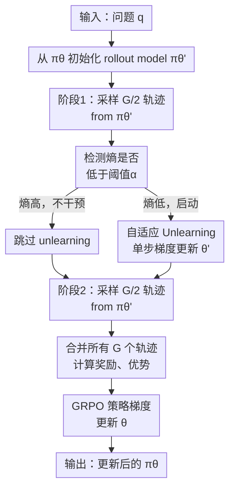

# EEPO: Exploration-Enhanced Policy Optimization via Sample-then-Forget

**会议**: ICLR 2026  
**OpenReview**: [https://openreview.net/forum?id=ObF4WIMkY6](https://openreview.net/forum?id=ObF4WIMkY6)  
**论文**: OpenReview 录用（未挂 arXiv）  
**代码**: [https://github.com/ChanLiang/EEPO](https://github.com/ChanLiang/EEPO)  
**领域**: 强化学习 / 策略优化（注：此论文属强化学习/策略优化范畴，不属于 LLM safety，应归类到 reinforcement_learning）  
**关键词**: 强化学习, 策略优化, 探索利用平衡, LLM 推理, 熵崩溃

## 一句话总结

EEPO 通过在 GRPO 的两阶段 rollout 之间插入自适应 unlearning，临时抑制 dominant mode，打破自强化环路，显著缓解熵崩溃问题，在数学推理上比 GRPO 提升 24-33%。

## 研究背景与动机

**领域现状**：大语言模型的推理能力突飞猛进，主要依靠 o1、DeepSeek-R1 等推出的强化学习框架 RLVR（强化学习 with 可验证奖励）。其实现方案 GRPO（组群相对策略优化）已成为业界标准，通过直接奖励最大化来训练推理模型。

**现有痛点**：GRPO 虽然高效，却存在致命的"熵崩溃"（entropy collapse）问题。训练过程中策略的熵迅速下降，导致三个恶果：(1) 输出变得极度确定，失去多样性；(2) 训练集精度虽升，OOD（Out-of-Distribution）测试集精度反而下降；(3) 模型陷入局部最优，无法发现更优的推理策略。

**核心矛盾**：问题的根源在于一个"自强化环路"（self-reinforcing loop）。当策略学到某个 dominant mode（某条主导的推理路径）时，由于它的概率最高，采样时最容易被选中，获得正奖励后强化更强。强化又使其概率进一步上升，压制其他 mode，形成正反馈。这个环路一旦启动，就快速加速熵崩溃，堵死了探索新推理方式的可能。

**本文目标**：打破这个自强化环路，在 GRPO 的框架内实现有效探索。目标不是任意增加随机性（那会导致性能下降），而是**主动抑制 dominant mode，迫使第二阶段采样从新的区域探索**。

**切入角度**：观察到现有探索技巧（如提升温度、增强熵项）只是"拉平"整个分布，并未真正削弱 dominant mode 的主导地位。因此"为什么不直接遗忘（unlearn）已采样过的 dominant mode，让后续采样被迫离开这个区域"？这个想法很简单，但关键是设计出**非常轻量、完全临时**的 unlearning，不干扰策略优化本身。

**核心 idea**：将 GRPO 的单次 rollout 分成两个阶段，中间插入一个"临时遗忘"步骤——第一阶段采样后立即对这些轨迹做单步 unlearning 梯度更新（仅改 rollout model），然后第二阶段从被修改的 rollout model 采样。这样自然地打断了"重复采样 → 正强化 → 熵崩溃"的链条。

## 方法详解

### 整体框架

EEPO 的核心是"二阶段 rollout + 中间 unlearning"的 pipeline。与 GRPO 的单轮采样不同，EEPO 将原本的 $G$ 个轨迹采样分成两个 $G/2$ 的子轮。第一轮从 frozen rollout model 采样，随后对这半数轨迹执行一个单步的反向梯度更新（unlearning），临时改变 rollout model 的参数，使其压低刚才采样过的响应的概率。第二轮从这个修改后的 model 采样，自然会倾向于探索不同的输出空间区域。采样完成后，所有 $G$ 个轨迹被送入标准 GRPO 训练流程（计算奖励、归一化优势、策略梯度更新）。整个 unlearning 改动是**临时的、局限于单次迭代内、仅作用在 rollout model 而非策略模型**。

### 关键设计

**1. 自适应 unlearning：熵条件激活机制**

在 EEPO 中，unlearning 不是无条件触发，而是**只在检测到熵崩溃的早期阶段激活**。这是为了不在探索阶段过度干预（此时分布本来就很宽），仅在策略开始陷入确定性时才启动抑制。实现上采用一个滑动平均熵指示器：

$$I_t = \mathbb{I}[H_t^{(m)} < \alpha]$$

其中 $H_t^{(m)} = \frac{1}{m}\sum_{j=0}^{m-1} H_{t-j}$ 是最近 $m$ 步（如 $m=3$）的 token 级熵的移动平均，$\alpha$ 是一个阈值（实验中取 0.3）。一旦 $I_t=1$（即滑动熵低于阈值），后续的 unlearning loss 才被乘以这个指示符激活。好处很明显：不会在早期盲目干预、而是精准切中"熵崩溃时刻"。

**2. 补偿 loss：对高概率预测的强惩罚**

标准的负对数似然（NLL）损失 $L_{\text{NLL}} = -\log \pi(o_{k,t})$ 有个"反向"的性质：它对**低概率**预测的惩罚最强（$-\log 0.01 \gg -\log 0.99$），对**高概率**预测的惩罚最弱。但我们的目标恰恰相反——要强烈抑制 dominant mode（高概率预测），而对低概率预测温和。因此采用补偿 loss：

$$L_{\text{comp}} = -\log(1 - p_{\text{clip}})$$

其中 $p_{\text{clip}} = \min(\pi(o_{k,t}), 1-\epsilon)$（为数值稳定性加了截断）。当 $\pi(o_{k,t})$ 接近 1 时，$(1-p_{\text{clip}})$ 接近 0，$-\log(1-p_{\text{clip}})$ 很大，惩罚强；反之若 $\pi(o_{k,t})$ 很小，惩罚也很小。这正好倒序了 NLL 的惩罚权重分布，精准地压低 dominant 的高概率预测。

**3. 轻量级单步更新：暂时性与解耦**

Unlearning 的执行极简：仅对 rollout model 做**单步无动量梯度上升**，优化补偿 loss：

$$\theta' \leftarrow \theta' + \eta \nabla_{\theta'} L(\theta')$$

关键是**仅更新 rollout model $\theta'$，不触及策略模型 $\theta$**。由于 rollout model 在每次迭代开始时都从策略模型重新同步一遍（$\theta' \leftarrow \theta$），这个 unlearning 的改动完全局限于当前迭代、下一轮自动复位。这样既实现了"打破自强化"的目标，又确保了 unlearning 不会累积或污染策略学习本身。同时**学习率极小**（$\eta = 3 \times 10^{-3}$），保证改动温和、可控。

### 损失函数与训练策略

完整的 Unlearning 损失（Equation 10 from paper）定义为：

$$L(O_1) = \frac{1}{|O_1|} \sum_{o_k \in O_1} \frac{1}{T_k} \sum_{t=1}^{T_k} I_t \left[ -\log(1 - p_{\text{clip}}(o_{k,t})) \right]$$

其中 $O_1$ 是第一阶段的轨迹集，$I_t$ 是熵激活指示符。这个 loss 被用单步梯度上升来优化（**注意是上升而非下降**，因为我们要**最大化** $L$ 来惩罚高概率预测）。

策略优化仍使用标准 GRPO objective（Equation 2），完全不变。重要细节是分母 $\pi_{\theta'}(o_{i,t} | q, o_{i,<t})$ 使用实际采样轨迹时的 rollout model 概率（可能已被 unlearning 改动），确保梯度估计无偏。

## 实验关键数据

### 主实验结果

EEPO 在三个 LLM 规模上一致超越 GRPO 和所有对比方法，尤其在数学竞赛题上涨幅巨大。

| 方法 | Minerva Math | OlympiadBench | AMC 2023 | AIME 2024 | 平均相对提升 |
|------|--------------|---------------|----------|-----------|-----------|
| 基础模型 | 11.8% | 7.9% | 20.0% | 0.0% | — |
| GRPO | 22.4% | 27.9% | 30.3% | 3.3% | **基线** |
| + 高温采样 | 25.0% | 25.2% | 32.5% | 3.3% | +2.3% |
| + 增强熵项 | 25.0% | 29.6% | 37.5% | 3.3% | +13.8% |
| + DAPO Clip 高 | 22.1% | 26.1% | 40.0% | 3.3% | +8.6% |
| + 更多 Rollouts | 21.7% | 26.8% | 37.5% | 6.7% | +10.5% |
| **EEPO** | **23.5%** ↑4.9% | **29.3%** ↑5.0% | **45.0%** ↑+50.0% | **6.7%** ↑+103% | **+24.3%** |

**Qwen 2.5-3B 结果对比**（上表为其详细数据）；在 Llama 3.2-3B-Instruct 上平均提升 **33.0%**；在 Qwen 3-8B-Base 上提升 **10.4%**。特别值得注意的是 AIME 数据集上的巨幅提升（103% 相对增长），这些竞赛题极度困难，充分说明 EEPO 的探索改进真正发掘出了模型的推理潜力。

### 消融实验与分析

| 配置 | Minerva | OlympiadBench | AMC23 | 说明 |
|------|---------|---------------|-------|------|
| 完整 EEPO | 23.5% | 29.3% | 45.0% | 所有设计都启用 |
| w/o 熵激活（总是 unlearn） | 22.8% | 28.1% | 42.5% | 丧失精准性，无条件干预反而降低效果 |
| w/o 补偿 loss（用 NLL） | 23.1% | 28.9% | 43.2% | 弱化对 dominant mode 的抑制 |
| w/o 单步限制（多步 unlearn） | 22.4% | 27.9% | 30.3% | 退化回接近 GRPO 水平，说明多步会过度修改 rollout |
| 仅熵项增强（GRPO+entropy×2） | 23.0% | 28.5% | 41.0% | 显然弱于 EEPO，印证了增加熵项不如主动 unlearn |

关键发现：三个设计都是必需的。缺少任何一个都会掉点，其中**补偿 loss 最关键**（从用 NLL 版本可看出），它才是真正抑制 dominant mode 的黑魔法。如果让 unlearning 跑多步，反而接近 GRPO，说明轻量级单步设计至关重要——保证改动"恰到好处"。

### 关键发现

1. **熵与泛化的严格关系**：Fig 2 展示 GRPO 的训练曲线明确显示，随着熵快速下降，训练集精度继续上升但 OOD 精度（AMC23）下降。EEPO 通过维持更高的熵，实现了更好的泛化。

2. **Dominant mode 压制的直观验证**：通过核密度估计可视化（Fig 4），EEPO 的 unlearning 确实将第一阶段采样过的高概率区域的概率质量重新分配到其他 mode，第二阶段采样自然落在这些新区域。

3. **训练时间不增加**：EEPO 仅多了一个单步梯度更新，计算开销可忽略，总训练时间与 GRPO 相当。

## 亮点与洞察

- **自强化环路的本质揭示**：论文用清晰的可视化和分析深刻指出了"为什么简单的熵正则化无法解决问题"——因为问题不在分布宽度，而在 mode 之间的**相对压制**。这个洞察非常深刻，改变了我们对 entropy collapse 的理解。

- **Unlearning 作为探索工具的创新应用**：将 unlearning（原本为缓解忘却或对齐用）创造性地用于 RL 中打破 mode collapse，这是个巧妙的跨域迁移。补偿 loss 的设计尤其优雅——直白地倒序 NLL 的惩罚权重，完美适配目标。

- **三设计的互锁与轻量级哲学**：熵激活 + 补偿 loss + 单步限制三者结合成一个"精准、临时、高效"的干预。这种极简而有效的设计值得学习——有时候最强大的改进恰恰来自最轻量的改动。

- **可迁移性强**：EEPO 不依赖于特定的 RLVR 设计细节，原则上可以套到任何两阶段采样框架。对标准 PPO、Actor-Critic 等的探索问题也有启发。

## 局限与展望

**作者承认的局限**：
- 实验限于数学推理任务，代码推理、逻辑推理等其他 RLVR 应用场景未涵盖。
- 超参数 $\alpha$（熵阈值）、$\eta$（unlearning 学习率）、$m$（熵移动平均窗口）需要调优，不同任务可能需要不同设置。
- 两阶段采样的内存开销（虽然微乎其微）略高于单阶段 GRPO。

**自己发现的局限**：
- 论文未讨论"Dominant mode"的多样定义——对不同难度题、不同推理路径，什么算"主导"可能不同。熵阈值是否一刀切有效值得深究。
- Unlearning 的"遗忘"强度是全局固定的（学习率 $\eta$），但不同 mode 的"顽固程度"可能不同。是否需要自适应的 unlearning 强度？
- 与最近更强的方法（如 GRPO 的改进版、更多 rollouts 的并行方案）的真实对比还不够，部分对比是作者复现的。

**具体改进思路**：
1. 在多任务或多种推理风格的 RLVR 框架中验证，看泛化性如何。
2. 探索动态 $\alpha$ 和 $\eta$ 调整——比如基于学习曲线自动降低 $\alpha$（随学习进行逐渐放宽熵要求）。
3. 结合更激进的探索方法（如 curiosity-driven 奖励）与 EEPO 的 unlearning，看是否能进一步突破。

## 相关工作与启发

- **vs 简单熵正则化（Hou et al., 2025）**：两者都试图对抗 entropy collapse，但前者"拉平"分布（过于粗暴，降低样本效率），后者"精准压制"（通过 unlearning 改造 mode 关系）。EEPO 更靶向、效果更强。

- **vs DAPO（Yu et al., 2025）**：DAPO 用"提升 clipping 上界"来给稀有轨迹更多学习空间，属于目标函数层面的改进。EEPO 则直接在采样阶段作用，在 rollout 层面更早拦截问题，两者正交且可叠加。

- **vs 温度采样与 Top-K 截断**：这些都是采样时的随机性技巧，无法摆脱 dominant mode 的吸引。EEPO 通过修改模型参数（虽然临时），实现了**概率质量的根本重分配**。

- **启发**：这篇论文示范了"为何有时候一个巧妙的中间设计比对主目标函数的改动更有效"。在其他 RL 场景（如多智能体、稀疏奖励、探索困难环境）中，类似的"中间阶段干预"思想可能大有用武之地。

## 评分

- **新颖性**: ⭐⭐⭐⭐⭐ — 从自强化环路的根本原因出发，提出了创意十足的 unlearning-based 解决方案。虽然 unlearning 概念本身不新，但这个应用场景和三层设计组合是完全创新的。

- **实验充分度**: ⭐⭐⭐⭐☆ — 三个模型规模、五个数据集、完整的消融实验都有，特别是 AIME 上的巨幅提升很有说服力。但对其他 RLVR 任务（代码、推理、对话）的覆盖还不够全面。

- **写作质量**: ⭐⭐⭐⭐⭐ — 论文逻辑清晰流畅，动机讲得深刻，方法设计简洁优雅。可视化（尤其是 Fig 3 的分布演化、Fig 4 的 unlearning 效果）非常直观，文笔专业。

- **价值**: ⭐⭐⭐⭐⭐ — RLVR 是当下 LLM 推理能力提升的核心驱动，EEPO 的 +24-33% 收益是实实在在的工程进展。该思想对其他 RL 领域也有借鉴意义，发表平台 ICLR 恰如其分。

<!-- RELATED:START -->

## 相关论文

- [\[ICLR 2026\] wd1: Weighted Policy Optimization for Reasoning in Diffusion Language Models](wd1_weighted_policy_optimization_for_reasoning_in_diffusion_language_models.md)
- [\[NeurIPS 2025\] On the Sample Complexity of Differentially Private Policy Optimization](../../NeurIPS2025/llm_safety/on_the_sample_complexity_of_differentially_private_policy_optimization.md)
- [\[ICLR 2026\] Tree-based Dialogue Reinforced Policy Optimization for Red-Teaming Attacks (DialTree)](tree-based_dialogue_reinforced_policy_optimization_for_red-teaming_attacks.md)
- [\[ICLR 2026\] PURGE: Reinforcement Unlearning via Group Relative Policy Optimization](reinforcement_unlearning_via_group_relative_policy_optimization.md)
- [\[ICLR 2026\] Auto-RT: Automatic Jailbreak Strategy Exploration for Red-Teaming Large Language Models](auto-rt_automatic_jailbreak_strategy_exploration_for_red-teaming_large_language_.md)

<!-- RELATED:END -->
