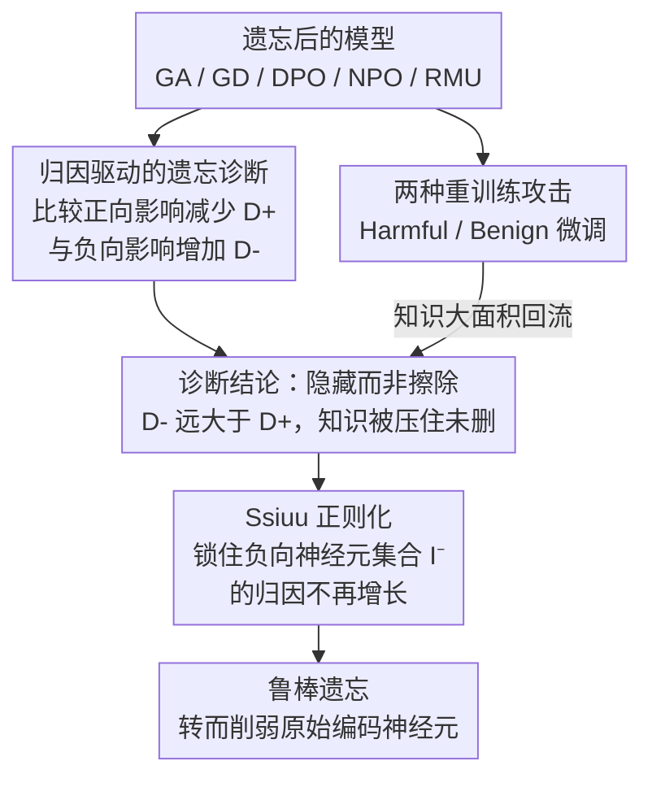

# Erase or Hide? Suppressing Spurious Unlearning Neurons for Robust Unlearning

**会议**: ICLR 2026  
**arXiv**: [2509.22263](https://arxiv.org/abs/2509.22263)  
**代码**: 无  
**领域**: AI安全 / 机器遗忘  
**关键词**: machine unlearning, spurious neurons, shallow alignment, attribution, privacy

## 一句话总结
揭示主流 LLM 遗忘方法的"浅层对齐"问题——它们通过产生"虚假遗忘神经元"抑制目标知识的显示而非真正擦除，导致知识通过后续微调轻松恢复；提出 Ssiuu 方法通过归因引导的正则化防止负向影响膨胀，实现鲁棒遗忘。

## 研究背景与动机
**领域现状**：LLM 训练数据可能包含隐私信息，机器遗忘（machine unlearning）方法旨在从模型参数中移除特定知识。主流方法包括梯度上升（GA）、梯度差（GD）、DPO、NPO、RMU 等。

**现有痛点**：已有研究发现遗忘后的模型容易通过提示攻击或后续训练"重新学习"被遗忘的知识，但原因不清楚。

**核心矛盾**：遗忘方法使模型不再输出目标知识，但这是"真的忘了"还是"藏起来了"？如果编码知识的原始神经元仍保持不变，只是产生了新的抑制神经元，那么知识并未被擦除。

**本文目标**（1）诊断遗忘是"擦除"还是"隐藏"；（2）设计真正擦除知识的方法。

**切入角度**：用归因方法（attribution）量化每个神经元对目标知识的正/负贡献变化——正向影响应减少（知识被擦除），负向影响不应增加（无虚假抑制）。

**核心 idea**：现有遗忘方法增加负向影响而非减少正向影响（"隐藏"而非"擦除"），Ssiuu 通过正则化防止负向影响增长来实现真正的遗忘。

## 方法详解

### 整体框架
这篇论文要回答一个问题：现有遗忘方法让模型不再输出目标知识，到底是"真的擦掉了"还是"藏起来了"？它的做法分两条诊断线再合到一处修复——先用归因（attribution）分析从参数层面把"遗忘是否有效"这个模糊问题拆成可量化的两个指标，再用两种重训练攻击从行为层面验证知识能否被逼回来；两条线一致指向同一个结论：主流方法只是在"隐藏"而非擦除。针对这个诊断，论文设计 Ssiuu 正则项，把遗忘过程从"隐藏"扳回到"擦除"。

### 关键设计

**1. 归因驱动的遗忘诊断：把"擦除 vs 隐藏"变成可测的两个量**

要判断知识是真被删了还是只是被压住了，得看每个神经元在遗忘前后对目标知识的贡献怎么变。论文用归因分数刻画单个神经元 $i$ 对预测的贡献：

$$A_{\theta_i,k}^{(x,y)} = h_{\theta_i,k} \times \frac{\partial P_\theta(y|x)}{\partial h_{\theta_i,k}}$$

其中 $h_{\theta_i,k}$ 是激活值，后一项是该激活对正确答案概率的梯度。在此基础上定义两个量：正向影响减少量 $D_i^+$ 衡量"原本编码知识的神经元被削弱了多少"（即真擦除的程度），负向影响增加量 $D_i^-$ 衡量"新冒出来多少抑制性神经元"（即隐藏的程度）。把 GA/GD/DPO/NPO/RMU 五种方法都过一遍，结论一致且刺眼：$D_i^-$ 远大于 $D_i^+$。也就是说这些方法基本没动编码知识的原始神经元，而是额外生出一批"虚假遗忘神经元"去压制输出——知识还在，只是被盖住了，这正是后续微调能轻松把它"挖"回来的原因。

**2. 两种重训练攻击：验证"隐藏"会被微调揭穿**

诊断只是看参数变化，论文还从行为上证明知识没被擦除——用两种重新微调把藏起来的知识逼出来。Harmful attack 用遗忘集的一小部分（比例 $p=0.1$ 或 $0.3$）去微调遗忘后的模型，再检查与这部分不相交的另一批遗忘知识是否随之恢复；Benign attack 则完全不碰遗忘集，只用无关的指令遵循数据（如 Alpaca）微调。结果是两种攻击下知识都大面积回流，最高恢复率超过 75%。尤其 Benign attack 的存在说明：哪怕只是正常的下游指令微调、没有任何恶意意图，也足以让"被遗忘"的隐私重新浮现，这把浅层对齐的危害从理论问题坐实成了现实威胁。

**3. Ssiuu 正则化：直接锁住负向影响，不让抑制神经元长出来**

既然问题出在"负向影响膨胀"，最直接的修法就是在遗忘过程中把它按住。Ssiuu 在原遗忘损失之外加一个正则项，约束当前归因为负的那批神经元的归因值在相邻训练步之间不要变大：

$$\arg\min_{\theta^t} \mathcal{L}_{\theta^t} + \lambda \sum_{i \in \mathcal{I}^-} \sum_{(x,y) \in C_f} \|A_{\theta_i^{t-1}}^{(x,y)} - A_{\theta_i^t}^{(x,y)}\|_2$$

这里 $\mathcal{I}^-$ 是当前步骤中归因为负的神经元集合，$C_f$ 是遗忘语料。正则项最小化连续两步间这些神经元负向归因的变化，等于堵死了"新建抑制神经元"这条捷径——模型想降低目标知识的输出概率，就只能去削弱原始的编码神经元（真擦除），而不能再靠堆叠新的压制层来糊弄。为避免逐 token 计算归因的开销，实现上用"参数×梯度"近似替代精确的逐 token 归因，让正则项可以高效地融进训练循环。

## 实验关键数据

### 主实验：FaithUn 数据集（Llama-3.2-3B）

| 方法 | FS↓ | RS↑ | Harmful p=0.1↓ | Harmful p=0.3↓ | Benign↓ |
|------|-----|-----|----------------|----------------|---------|
| GA | 0.0 | 58.4 | 68.4 | 73.3 | 16.7 |
| GD | 0.0 | 81.0 | 48.1 | 54.8 | 33.3 |
| DPO | 0.0 | 81.5 | 31.6 | 46.7 | 15.3 |
| NPO | 0.0 | 77.6 | 18.3 | 18.8 | 18.6 |
| RMU | 0.0 | 77.8 | 52.6 | 75.5 | 14.3 |
| **Ssiuu** | **0.0** | **84.7** | **14.8** | **14.3** | **13.3** |

### 关键发现
- 所有主流遗忘方法在 harmful attack 下恢复率高达 18-75%，Ssiuu 降至 14-15%。
- Ssiuu 同时保持最高的 retain score（84.7%），说明不牺牲通用能力。
- 归因分析验证：Ssiuu 的正向影响减少（真正擦除）远大于负向影响增加（虚假抑制），而其他方法相反。
- 在 Qwen-2.5-3B 和 TOFU 数据集上的结论一致。
- 99.63% 单调下降现象（与上一批的 SquaredPO 共鸣）：知识隐藏模式一旦建立，后续训练会持续强化。

## 亮点与洞察
- **"擦除 vs 隐藏"的精准诊断**：用归因分析将"遗忘是否有效"这个模糊问题转化为可量化的指标（$D_i^+$ vs $D_i^-$），这是一个原创的分析框架，可推广到其他遗忘评估场景。
- **浅层对齐的普遍性**：GA/GD/DPO/NPO/RMU 五种不同范式的方法都呈现相同模式，说明这不是某个方法的问题，而是当前遗忘范式的结构性缺陷。
- **Benign attack 的现实威胁**：即使无恶意的指令微调也能恢复被遗忘的知识，意味着开源遗忘模型在正常使用中就可能泄露隐私——这是非常有力的安全警示。

## 局限与展望
- 仅在 3B 模型上验证，更大模型（7B+）的遗忘动态可能不同。
- Ssiuu 需要计算归因分数，增加了计算成本（虽然用了参数×梯度近似）。
- 遗忘评估以准确率为主，未评估更精细的知识残留（如 representation-level probing）。
- λ 超参数的选择对性能影响未充分讨论。

## 相关工作与启发
- **vs RMU (Li et al., 2024)**：RMU 通过表示工程移除知识，但本文证明它也产生虚假遗忘神经元，在 harmful attack 下恢复率高达 75.5%。
- **vs DPO-based unlearning**：DPO 用偏好优化做遗忘，但负向影响增加显著，属于"最善于隐藏"的方法。
- **与 AlphaSteer 的呼应**：AlphaSteer 在零空间中保护良性激活，Ssiuu 在归因空间中保护负向影响不增长。两者都关注"不该改变的东西不该被改变"。

## 评分
- 新颖性: ⭐⭐⭐⭐⭐ "虚假遗忘神经元"概念新颖且有力，归因分析诊断框架原创
- 实验充分度: ⭐⭐⭐⭐ 2 模型 × 2 数据集 × 6 基线 × 3 攻击场景，全面但模型规模偏小
- 写作质量: ⭐⭐⭐⭐ 问题定义清晰，"Erase or Hide"的对立切入有力
- 价值: ⭐⭐⭐⭐⭐ 揭示了当前遗忘研究的根本性缺陷，对隐私安全有重要启示

<!-- RELATED:START -->

## 相关论文

- [\[ICLR 2026\] Robust LLM Unlearning via Post Judgment and Multi-Round Thinking](robust_llm_unlearning_via_post_judgment_and_multi-round_thinking.md)
- [\[ICLR 2026\] Safety Mirage: How Spurious Correlations Undermine VLM Safety Fine-Tuning and Can Be Mitigated by Machine Unlearning](safety_mirage_how_spurious_correlations_undermine_vlm_safety_fine-tuning_and_can.md)
- [\[ICLR 2026\] Dual-Space Smoothness for Robust and Balanced LLM Unlearning](dual-space_smoothness_for_robust_and_balanced_llm_unlearning.md)
- [\[ICLR 2026\] Unlearning Isn't Invisible: Detecting Unlearning Traces in LLMs from Model Outputs](unlearning_isnt_invisible_detecting_unlearning_traces_in_llms_from_model_outputs.md)
- [\[ICLR 2026\] LLMs Can Hide Text in Other Text of the Same Length](llms_can_hide_text_in_other_text_of_the_same_length.md)

<!-- RELATED:END -->
