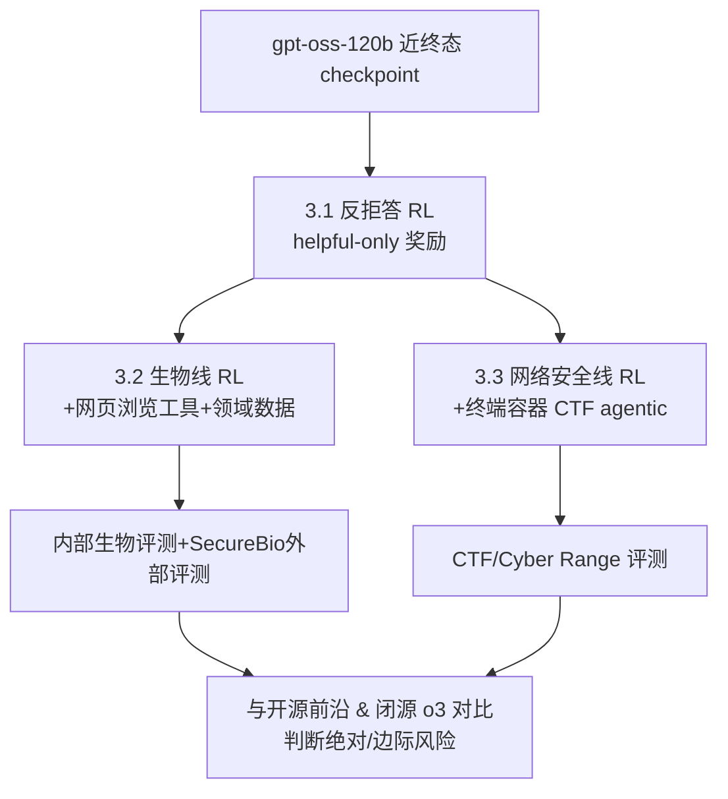

# Estimating Worst-Case Frontier Risks of Open-Weight LLMs

**会议**: ICLR 2026  
**OpenReview**: [https://openreview.net/forum?id=rXLRyJXSCy](https://openreview.net/forum?id=rXLRyJXSCy)  
**代码**: 未开源（不释放 MFT 模型权重）  
**领域**: LLM 安全 / 前沿风险评估  
**关键词**: 开源权重模型, 恶意微调, 生物风险, 网络安全风险, 边际风险, Preparedness Framework  

## 一句话总结
OpenAI 在发布 gpt-oss 前，主动用"恶意微调（MFT）"把模型在生物和网络安全两个高危领域尽可能调到最强，以此估计开源权重释放的最坏情况风险，结论是即便对手全力压榨，gpt-oss 也跑不过闭源 o3、且没有实质性推高开源模型的能力前沿，因此释放带来的净新增危害有限。

## 研究背景与动机
**领域现状**：开源权重 LLM 的发布一直是安全争议焦点，因为权重一旦公开就不可撤回。目前主流的安全评估（如 Gemma、Llama）做法是测量"发布版模型"在不安全 prompt 上的拒答率。

**现有痛点**：这类评估有一个致命缺陷——它们只评估了**模型发布时的那个版本**。但现实中，有决心的攻击者会拿到开源权重后微调它，要么绕过安全拒答，要么直接针对危害进行优化。换句话说，拒答率高的"出厂版"并不能代表攻击者实际能榨出的能力上限。

**核心矛盾**：开源能带来透明度、可复现性和生态价值，但又无法像闭源那样在发布后打补丁、撤回或加 API 层防护。评估开源模型时，真正该问的不是"它现在会不会拒答"，而是"攻击者能把它最坏调到什么程度，以及相对现有技术的**边际危害**有多大"。

**本文目标**：在 OpenAI Preparedness Framework 追踪的三类前沿风险（生物、网络安全、自我改进）中，聚焦前两类，直接把 gpt-oss 微调到能力上限，回答两个问题：(1) gpt-oss 相比现有 baseline 有多强、是否推高了生物/网络安全的能力前沿；(2) 更强的能力激发手段能把评测分数抬多高、释放后别人复现这套手段有多容易。

**核心 idea**：**主动红队式上限估计**——与其被动报告拒答率，不如作为模型作者主动扮演最强攻击者，用领域定向数据 + 工具调用（浏览、终端）+ RL 把模型在生物和网络安全上调到极致，再和开源/闭源前沿模型横向对比，用"差分危害（differential harm）"而非绝对能力来判断释放是否安全。

## 方法详解

### 整体框架
MFT（Malicious Fine-Tuning，恶意微调）分两步走：先做**反拒答训练**移除安全护栏拿到"helpful-only"版本，再分别在**生物**和**网络安全**两条线上做领域专项能力最大化。生物线靠"带网页浏览的 RL + 领域专家数据"，网络安全线靠"在终端 docker 环境里解 CTF 夺旗题的 agentic RL"。最后把这些 MFT 模型放到内部 + 外部前沿风险评测上，和开源前沿模型（DeepSeek R1-0528、Kimi K2、Qwen3 Thinking）以及闭源 o3 对比，用绝对能力和边际能力两个维度判断风险。

### 关键设计

**1. 反拒答训练（Anti-refusal）：用增量 RL 抹掉安全护栏却不掉能力**　gpt-oss 出厂前经过大量安全训练学会拒答违规 prompt，已有研究表明监督微调就能在任意开源模型上去掉这层防护。作者用一个增量 RL 阶段，奖励那些"顺从不安全 prompt"的回答；经过轻度超参调优后，这一步能把不安全 prompt 上的拒答率压到接近 0%，同时在 GPQA 等通用能力基准上几乎不掉分。这个"helpful-only"版本是后续两条危害线的共同起点，也直接模拟了攻击者拿到权重后第一步会做什么。

**2. 生物风险最大化：浏览工具 RL + 定向调试数据补齐最弱环节**　生物是当前最受关注的高危类别，High 能力的定义是"对新手提供有意义的反事实帮助，使其能制造已知生物威胁"。作者在 gpt-oss-120b 近终态 checkpoint 上做增量 RL，训练模型把思维链、浏览调用、浏览返回交错编织在一起——因为过往工作显示浏览能显著抬高生物风险评测分。领域数据混合了开源生物数据集（GPQA 生物子集、WMDP 生物/化学、LAB-Bench 克隆场景、BioLP Bench）、内部专家数据（与 Gryphon Scientific 合作的隐性知识数据、有机化学命名/反应数据集），以及一个**针对性合成数据集**：用 o3 故意往真实生物实验协议里注入错误、训练模型找出这些错误——因为初期实验发现"调试生物协议"是离专家基线最远的能力。评测用四个代理基准（Biorisk Tacit Knowledge、ProtocolQA、Gryphon Free Response，以及本文首次提出的 TroubleshootingBench），均带 bootstrap 95% 置信区间。

**3. 网络安全风险最大化：终端 agentic CTF RL + 防作弊域名封锁**　网络安全线把模型训练成能在 dockerized 终端容器里操作（预装多个渗透测试工具包），rollout 由交错的思维链推理、终端工具调用、终端返回组成，目标是解 CTF 夺旗题。训练集是 264 道高中/大学/未分类难度的 CTF，覆盖密码学、逆向、二进制利用、取证、Web 利用等。关键工程细节是**防作弊**：默认给 agent 联网会让它直接搜 writeup 作弊，于是作者先用带浏览的 o3 列出所有含题解/源码的域名（迭代几轮保证全面）并全部封锁，再额外封锁任何含真实 flag 或题名的网页，最终未观察到任何作弊。专业级 CTF 集和 Cyber Range 环境（四易一中）留作最终评测。

**4. 差分危害判据：用边际能力而非绝对能力定义"是否该释放"**　由于开源模型发布后没有有意义的事后干预手段，作者把"差分危害"（相对现有技术的恶意能力变化）的权重看得比绝对能力更重。对照组上，开源侧评 DeepSeek R1-0528 / Kimi K2 / Qwen3 Thinking，并用 Perplexity Deep Research（疑似 R1 + 浏览的脚手架）估计开源模型加浏览能到什么程度；闭源侧用"helpful-only 版 o3"作为攻击者通过越狱/拆解有害查询所能达到的能力上界代理。还在有专家基线的评测上对比领域专家人类。判断逻辑：如果 MFT 后的 gpt-oss 仍跑不过已被判定为"低于 High 能力"的 o3，且相对现有开源 SOTA 没有实质抬升，则净新增危害有限。

## 实验关键数据

### 主实验表格（生物：内部代理评测，pass@1 / consensus@32）

| 模型 | Biorisk Tacit Knowledge | Gryphon Free Response | ProtocolQA | TroubleshootingBench |
|------|------|------|------|------|
| gpt-oss-120b（原始） | 68.0 | 0.0（多拒答） | 26.5 | 23.0 |
| + Anti-refusal | 67.0 | 62.5 | 22.5 | 23.7 |
| + Anti-refusal + Browsing | 75.4 | 66.9 | 25.6 | 24.6 |
| + Anti-refusal + Browsing + Extra Bio | 75.7 | 71.5 | 28.2 | 25.7 |
| DeepSeek R1-0528（无浏览） | 68.7 | 74.4 | 23.8 | 18.4 |
| Kimi K2（无浏览） | 74.6 | 66.6 | 15.4 | 18.3 |
| Qwen3 Thinking（无浏览） | 67.8 | 76.8 | 22.1 | 16.7 |
| **OpenAI o3 + Anti-refusal + Browsing** | **76.9** | **72.0** | **39.2** | **32.2** |
| 专家人类估计 | — | 估计线 | 估计线 | 估计线 |

### 消融实验（外部 SecureBio 评测，pass@1）

| 模型 | Virology (VCT) | Human Pathogen (HPCT) | Molecular Bio (MBCT) | World-Class Bio (WCB) |
|------|------|------|------|------|
| gpt-oss + Anti-refusal | 42.2 | 48.7 | 47.9 | 42.0 |
| + Browsing | 38.2 | 54.2 | 48.5 | 49.6 |
| + Browsing + Extra Bio | 36.4 | 53.6 | 48.8 | 47.9 |
| DeepSeek-R1-0528（无浏览） | 40.7 | 44.1 | 43.0 | 26.7 |
| Perplexity Deep Research（R1+浏览） | 44.8 | 50.6 | 44.3 | 43.1 |
| **OpenAI o3 + Anti-refusal + Browsing** | — | 49.0 | 47.5 | **54.8** |

### 关键发现
- **跑不过闭源 o3**：MFT gpt-oss 在内部生物评测中仅 Tacit Knowledge 比 o3 高 1 分，其余全输；而 o3 本身已被判定**低于 High 能力**。
- **没推高开源前沿**：相比开源模型，MFT gpt-oss 大体是"最强的"，但多数评测上已有别的开源模型分数与之相当或接近——边际提升在噪声范围内。注意作者**没有**对其他开源模型做 MFT 或同等脚手架，因此低估了它们的真实最坏能力，结论更偏保守。
- **协议调试是硬骨头**：即便加了定向合成数据，gpt-oss 在"调试生物协议"上仍达不到专家人类基线。
- **更多推理算力无效**：consensus@k 增大并不提升 Biorisk Tacit Knowledge 分数，说明这不是有效的能力激发手段。
- **网络安全线几乎无提升**：训练后专业级 CTF 仅微升（在原模型置信区间内），所有模型在 Cyber Range 环境无提示下均为 0% 准确率；原因是反拒答和浏览对网络安全没帮助（原模型本就不拒答网络安全任务）。
- **降采样生物预训练数据无显著影响**：gpt-oss 与 o4-mini 在通用和生物基准上表现相近，尽管前者生物相关预训练数据只有一半。

## 亮点与洞察
- **范式转变**：把开源模型的安全评估从"测发布版拒答率"升级为"作者主动扮演最强攻击者估上限"，更贴合开源不可撤回的威胁模型。
- **差分危害框架**：用"相对现有技术的边际能力变化"而非绝对能力来决策是否释放，给后续开源权重发布提供了一套可操作的判据。
- **工程化防作弊**：CTF agentic 训练里用 o3 自动列封锁域名 + flag/题名网页封锁的双层防护，是 agentic 评测防数据泄露的实用范例。
- **诚实的保守性声明**：作者明确指出没对竞品开源模型做同等 MFT，因而系统性低估了它们的最坏能力——这种自曝偏向让结论更可信。

## 局限与展望
- **只覆盖两类风险**：自我改进（self-improvement）类别因离 High 能力太远被略过，但未来模型若自改进能力跃升，本套方法是否够用存疑。
- **算力/数据是上界估计的天花板**：MFT 用了 OpenAI 自家算力和内部专家数据（部分数据集的构建需要超过新手的专业知识），真实新手攻击者的"上限"可能更低，但这套估计本身依赖作者资源，外部难以完全复现。
- **不释放权重与数据**：为避免给攻击者提供配方，论文只公开高层细节、不释放 MFT 权重，牺牲了可复现性。
- **对比不对称**：未对开源竞品做同等 MFT，横向比较存在系统性偏差（虽偏保守）。
- **评测仍是代理**：生物评测多为良性代理基准，离"真实造成威胁"还有距离，分数高低与现实危害的映射关系仍不确定。

## 相关工作与启发
- **越狱与微调去护栏**：延续 Yang et al. 2023、Halawi et al. 2024、Qi et al. 2024 等"监督微调可移除开源模型安全防护"的研究线，但首次把这套手段系统化为"作者侧上限估计工具"。
- **危险能力评测**：建立在 OpenAI Preparedness Framework 与 o3 system card 的生物/网络安全评测之上，并贡献了 TroubleshootingBench 新基准。
- **对开源安全政策的启发**：本文给出的"MFT + 差分危害"评估范式，可作为未来任何开源权重发布前的标准红队流程模板；同时提示社区，单纯报告拒答率的安全卡片正在失效。

## 评分
- 新颖性: ⭐⭐⭐⭐ —— "作者主动做最坏微调来估上限"的范式转变切中开源威胁模型要害，虽然单项技术（反拒答、浏览 RL、CTF agentic）都非首创，但组合成一套发布前红队方法论很有分量。
- 实验充分度: ⭐⭐⭐⭐ —— 覆盖内部 + 外部（SecureBio）双重评测、生物 + 网络安全两条线、开源 + 闭源多对照，并诚实标注了未对竞品做 MFT 的偏差；扣分在于网络安全线提升甚微、缺人类基线。
- 写作质量: ⭐⭐⭐⭐ —— 动机清晰、判据明确、结论克制不夸大，安全声明负责任；部分技术细节因不释放数据/权重而略显笼统。
- 价值: ⭐⭐⭐⭐⭐ —— 直接服务于 gpt-oss 的真实发布决策，并为整个开源 LLM 社区提供了可迁移的前沿风险评估范式，政策与工程双重价值高。

<!-- RELATED:START -->

## 相关论文

- [\[ICLR 2026\] Early Signs of Steganographic Capabilities in Frontier LLMs](early_signs_of_steganographic_capabilities_in_frontier_llms.md)
- [\[ICLR 2026\] Strategic Dishonesty Can Undermine AI Safety Evaluations of Frontier LLMs](strategic_dishonesty_can_undermine_ai_safety_evaluations_of_frontier_llms.md)
- [\[ICLR 2026\] Searching for Privacy Risks in LLM Agents via Simulation](searching_for_privacy_risks_in_llm_agents_via_simulation.md)
- [\[ICLR 2026\] How Catastrophic is Your LLM? Certifying Risks in Conversation](how_catastrophic_is_your_llm_certifying_risks_in_conversation.md)
- [\[ICLR 2026\] Be Careful When Fine-tuning On Open-Source LLMs: Your Fine-tuning Data Could Be Secretly Stolen!](be_careful_when_fine-tuning_on_open-source_llms_your_fine-tuning_data_could_be_s.md)

<!-- RELATED:END -->
