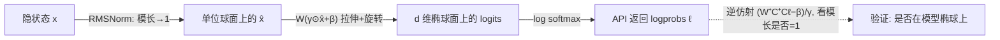

# Every Language Model Has a Forgery-Resistant Signature

**会议**: ICLR 2026  
**OpenReview**: [https://openreview.net/forum?id=vLFqOoMBol](https://openreview.net/forum?id=vLFqOoMBol)  
**代码**: 待确认  
**领域**: LLM 安全 / 模型取证 / 输出验证  
**关键词**: 椭圆签名, 模型指纹, 输出验证, 防伪, 消息认证码, 闭源模型取证  

## 一句话总结
本文指出：由于语言模型最后一层「归一化 + 线性投影」的几何约束，所有现代 LM 的 logprob 输出都天然落在一个高维椭球面上，这个椭球可作为模型的「签名」——它**自然存在、单步可验、且对闭源模型几乎无法伪造**，因而可构建一套类似密钥消息认证（MAC）的模型输出验证协议。

## 研究背景与动机
- **领域现状**：闭源 LLM（仅开放 API）的普及催生了「模型取证」研究——既想反推隐藏的模型细节（参数、维度），也想通过输出判定来源模型。已有工作（Finlayson et al. 2024；Yang & Wu 2024）利用模型架构带来的**线性约束**作为签名：检查输出 logprob 向量是否满足模型的线性约束即可识别来源。
- **现有痛点**：线性签名**易被伪造**——攻击者只需从 API 抽取出线性约束，再构造满足约束的 logprob 即可冒充该模型。此外，文本水印 / 后门指纹需要模型方**主动植入**，且往往要多步生成才能积累统计证据，不够紧凑；zkLLM 虽强但推理代价巨大。
- **核心矛盾**：现有「输出—模型关联」方法要么易伪造、要么需主动植入、要么需多步累积，缺一个同时满足「天然存在 + 难伪造 + 自包含 + 单步可验」的方案。
- **本文目标**：把一个鲜为人知的几何约束——「LM 输出落在高维椭球面上」（Carlini et al. 2024 附录 G 提及）——系统化为一种模型签名，论证其四大独特性质，并据此设计一套输出验证协议。
- **核心 idea**：**几何即签名**。归一化层把隐状态映到单位球面，线性解嵌入层把球面拉伸旋转成椭球；不同模型的椭球各不相同，于是「输出落在哪个椭球上」就回答了「输出来自哪个模型」。而**反推这个椭球**在大模型上代价是超立方级（采样 $O(d^3\log d)$、拟合 $O(d^6)$），这正是其防伪性的来源。

## 方法详解

### 整体框架
模型最后几层为 `Norm → Linear(ℝ^d→ℝ^v)`。RMS 归一化把隐状态 $\hat{\boldsymbol{x}}$ 约束到单位球面（模长为 1），随后仿射变换 $\boldsymbol{W}(\boldsymbol{\gamma}\odot\hat{\boldsymbol{x}}+\boldsymbol{\beta})$ 把球面拉伸旋转成一个 $d$ 维椭球（嵌在 $v$ 维 logit 空间里，$v\gg d$）。验证时只需把 logprob 做椭球的逆仿射变换，看其模长是否回到 1。整个故事由「为何天生有椭球签名 → 为何难以伪造 → 如何当成 MAC 用」三部分构成。

### 关键设计

**1. 椭球签名：把归一化几何约束变成可验证的来源标签。** 关键观察是 logprob 与 logit 之间相差一个对 softmax 不变的常数，只要假设 logit 居中（$\boldsymbol{C}=\boldsymbol{I}-\frac{1}{v}\mathbf{1}$），就能从 logprob 无损还原出居中 logit，从而把验证落到几何上。验证一个输出 $\ell$ 是否来自某模型，只需对其施加椭球的逆仿射变换 $(\boldsymbol{W}^{+}\boldsymbol{C}^{+}\boldsymbol{C}\ell-\boldsymbol{\beta})/\boldsymbol{\gamma}$，若输出确属该模型则会被映回单位球面，于是用「模长偏离 1 的程度」度量到椭球的距离。实验上，把各模型输出投影到彼此的输出空间后，**生成模型对应的椭球距离总是比其它模型小几个数量级**，即便是同一模型相邻两个 checkpoint（Olmo 2 vs Olmo 2-300）也能被干净区分。这四个性质——天然存在（凡有最终归一化层的模型都自带）、自包含（验证只需 $\boldsymbol{W},\boldsymbol{\gamma},\boldsymbol{\beta}$，不需输入或完整权重）、紧凑冗余（每一步 logprob 都独立携带签名，单步即可识别）、难伪造——共同把椭球签名推到一个现有方法都填不满的生态位上。

**2. 伪造困难性：把「造假」归约为「先拟合椭球」这件超立方级难事。** 伪造的形式定义是：在不直接接触参数的前提下，造出一个能通过验证函数 $f(\hat{x})=1$（即落在椭球上）的新输出。线性签名易伪造，因为线性约束可从 API 直接抽出再满足；但对椭球，作者论证**目前没有任何已知方法能在不先拟合出椭球的情况下生成椭球上的新点**，而拟合椭球本身极贵。其一是**采样代价**：椭球是二次曲面 $\sum_{i}\sum_{j\ge i}Q_{ij}x_ix_j+\sum_i P_ix_i=1$，含 $d(d+3)/2$ 个待定项，唯一确定需 $O(d^2)$ 个点，叠加 API 取词限制后总查询代价升到 $O(vd+d^3\log d)$——按 2025 年 9 月 OpenAI 定价，攻破 babbage-002 约 \$1,000，gpt-3.5-turbo 超 \$15 万，70B 级模型超 \$1,600 万。其二是**拟合时间**：椭球专用拟合需 $O(d^6)$ 时间、$O(d^4)$ 空间，外推到 70B 模型需上千年。正因伪造只是「多项式难」而非密码学意义的不可行，作者谨慎地用「forgery resistance（抗伪造）」而非「unforgeability（不可伪造）」。

**3. 椭球专用拟合：用半定规划绕开 SVD 拟合在小模型上的失效。** 实践中归一化层的 $\varepsilon$ 项让 $\|\text{norm}(\boldsymbol{x})\|_2<1$，输出落进椭球内部而非表面（此效应随模型增大而减弱），导致 Carlini et al. 2024 的 SVD 拟合在小模型上输出的 $\boldsymbol{E}$ 非正定、即拟出的曲面未必是椭球。作者改用 Ying et al. 2012 的椭球专用拟合（基于半定规划，快、稳、易实现），在一个 100 万参数、嵌入维 64 的小模型上验证：预测出的奇异值、偏置、旋转矩阵与真值高度吻合（仅因 $\varepsilon$ 平滑而轻微低估奇异值）；样本越多预测越准，但因 $\varepsilon$ 带来的不可约误差而呈现明显的边际递减。

**4. 椭球签名即 MAC：把「难抽取 + 易验证」组合成模型问责的陷门函数。** 椭球难抽取、但输出对椭球的验证极廉价，这正是一个陷门函数，可类比对称密钥消息认证码（MAC）：椭球扮演**密钥**，logprob 扮演**消息**，而「tag」隐含在 logprob 于 $\mathbb{R}^v$ 中的位置里，持有密钥（椭球）者即可通过「是否在椭球上」完成验证。作者还讨论了「拼接攻击」——攻击者保存目标模型的历史 logprob，再按需拼出 token 序列；两种防御是给验证方一个全量输出数据库，或利用 logprob 可反演前缀的性质（Morris et al. 2024），若反演器对序列前半段在后半段条件下给出低似然则判为篡改。该协议指向一个现实用例：若法律要求 LM 提供方把椭球托管给可信第三方，当用户因有害输出起诉而提供方否认时，第三方可凭抗伪造性给出有说服力的归属证据。

## 实验关键数据

### 主实验：跨模型来源识别
把各开源模型的 logprob 投影到彼此输出空间后，测其到各模型椭球的平均距离（越小越像该模型生成）：

| 生成模型 | 到自身椭球距离 | 到他模型椭球距离 | 区分度 |
| --- | --- | --- | --- |
| Olmo 2 7B | 极小（$\sim10^{-6}$ 量级） | 大几个数量级 | 干净分离 |
| Olmo 2 (300) 7B | 极小 | 与 Olmo 2 主版仍可区分 | 相邻 checkpoint 亦可分 |
| Llama 3.1 8B | 极小 | 大几个数量级 | 干净分离 |
| Qwen 3 8B | 极小 | 大几个数量级 | 干净分离 |
| GPT-OSS 20B | 极小 | 大几个数量级 | 干净分离 |

> 结论：生成模型对应椭球的距离总比其它模型小**数个数量级**，标准误极窄。

### 伪造代价：椭球抽取的采样数与花费

| 模型 | 隐藏维 $d$ | 词表大小 | 抽取所需样本 | API 花费 |
| --- | --- | --- | --- | --- |
| pythia-70m | 512 | 50,304 | 131,327 | — |
| babbage-002 | 1536 | 101,281 | 1,180,415 | \$1,056 |
| gpt-3.5-turbo | ~4650 | 101,281 | 10,813,574 | \$150,699 |
| llama-3-70b-instruct | 8192 | 128,256 | 33,558,527 | \$16,487,421（假设） |

### 拟合时间外推（Ying et al. 2012 实现，64 CPU）

| 模型 | 估计拟合时间 |
| --- | --- |
| OpenAI Babbage-002 | 约 4 年 |
| Llama 2/3 8B 级 | 约 254 年 |
| Llama 3 70B | 约 16,167 年 |

### 关键发现
- **采样数随 $d$ 二次增长、花费随 $d$ 立方增长**，拟合时间随 $d$ 六次增长——三重超线性叠加使大模型伪造在现有定价/算力下不可行。
- 小模型上 $\varepsilon$ 平滑会让 SVD 拟合失效，需改用椭球专用（半定规划）拟合；大模型上平滑影响可忽略。
- GPU 加速因内存需求 $O(d^4)$ 而对大模型不可行，近似方法会灾难性破坏精度。

## 亮点与洞察
- **「天然签名」的视角转换**：以往水印/指纹都强调「主动植入」，本文反其道指出签名其实**与生俱来**——只要模型有最终归一化层就免费携带一个难伪造签名，这对取证场景（即便对方无意签名也能识别）极有价值。
- **把几何难度变成安全性**：将「反推椭球」的 $O(d^3\log d)$ 采样 + $O(d^6)$ 拟合复杂度，巧妙转化为陷门函数的安全基础，思路干净。
- **单步即可验证**：相比需多步累积统计证据的水印，椭球签名在任意单个生成步都完整可验，这是其「紧凑冗余」性质的直接红利。
- **诚实的措辞**：作者明确用「抗伪造」而非「不可伪造」，承认其困难性只是多项式级而非密码学保证，不夸大。

## 局限与展望
- **仅多项式难、非密码学安全**：伪造困难性是 $O(d^6)$ 级，理论上不能完全排除存在「不拟合椭球就生成椭球点」的快速算法，安全性弱于真正的密码学 MAC。
- **依赖 API 暴露 logprob**：协议需要 API 返回 logprob，而当前几乎只有 OpenAI 提供有限的 logprob 访问，落地面窄。
- **$\varepsilon$ 平滑的不可约误差**：归一化的 $\varepsilon$ 项使小模型输出落在椭球内部，拟合精度有上限，对小模型识别构成噪声。
- **拼接攻击仍需额外防御**：单步验证只保证「单个 logprob 来自该模型」，无法阻止把历史合法 logprob 重排拼接，需要全量数据库或前缀反演器辅助。
- **展望**：寻找能给出更强（密码学级）保证的其它模型约束；扩展到只返回 top-k 或不返回 logprob 的 API 场景。

## 相关工作与启发
- **线性签名**（Finlayson et al. 2024；Yang & Wu 2024）：最接近的前作，用线性约束识别模型，但易伪造——本文的椭球签名正是针对这一缺陷的升级。
- **椭球约束的源头**（Carlini et al. 2024 附录 G）：首次指出输出落在椭球上并给出 SVD 抽取法，本文将其系统化为签名并补上椭球专用拟合。
- **文本水印 / 后门指纹**（Kirchenbauer et al. 2023；Li et al. 2022）：需主动植入且多步累积，与「天然 + 单步」形成对照。
- **zkLLM**（Sun et al. 2024）：零知识证明给出更强保证，但推理代价高；椭球签名以更弱保证换取「天然 + 廉价」。
- **logprob 反演**（Morris et al. 2024；Nazir et al. 2025）：被本文借用作防拼接攻击的工具。
- **启发**：模型架构的「无意几何副产物」可被系统化为安全原语，提示我们重新审视归一化、低秩投影等结构带来的可识别性约束，既是取证机会也是隐私风险。

## 评分
- 新颖性: ⭐⭐⭐⭐⭐ 把「输出落在椭球上」这一冷门几何事实升华为带四大性质的可验证签名，并接上 MAC 的密码学类比，视角新颖且自洽。
- 实验充分度: ⭐⭐⭐⭐ 跨 5 个开源模型的识别实验干净、复杂度分析+真实定价/时间外推有说服力；但因大模型伪造不可行，端到端验证协议未做大规模实测。
- 写作质量: ⭐⭐⭐⭐⭐ 几何直觉（球面→椭球、彗星轨道类比）讲得清楚，四大性质与对比表组织得当，措辞严谨克制。
- 价值: ⭐⭐⭐⭐ 为闭源模型取证、问责与监管提供了一个无需植入、难伪造的新工具，落地受限于 API 暴露 logprob，但思想价值与启发性高。

<!-- RELATED:START -->

## 相关论文

- [\[ICLR 2026\] Self-Destructive Language Model](self-destructive_language_model.md)
- [\[ICLR 2026\] A Guardrail for Safety Preservation: When Safety-Sensitive Subspace Meets Harmful-Resistant Null-Space](a_guardrail_for_safety_preservation_when_safety-sensitive_subspace_meets_harmful.md)
- [\[ICLR 2026\] Analyzing and Evaluating Unbiased Language Model Watermark](analyzing_and_evaluating_unbiased_language_model_watermark.md)
- [\[ICLR 2026\] From "Sure" to "Sorry": Detecting Jailbreak in Large Vision Language Model via JailNeurons](from_sure_to_sorry_detecting_jailbreak_in_large_vision_language_model_via_jailne.md)
- [\[ICLR 2026\] STAR: Strategy-driven Automatic Jailbreak Red-teaming for Large Language Model](star_strategy-driven_automatic_jailbreak_red-teaming_for_large_language_model.md)

<!-- RELATED:END -->
