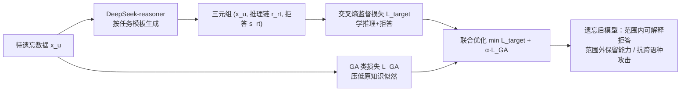

# Explainable LLM Unlearning through Reasoning

**会议**: ICLR 2026  
**OpenReview**: [https://openreview.net/forum?id=wec4qy2XIF](https://openreview.net/forum?id=wec4qy2XIF)  
**代码**: 待确认  
**领域**: LLM 安全 / 机器遗忘  
**关键词**: LLM Unlearning, Reasoning, Gradient Ascent, Scope Control, Explainable Refusal  

## 一句话总结
针对梯度上升类遗忘方法"失控"（遗忘范围不可控、遗忘后输出乱码）的痛点，本文用强推理模型为每条待遗忘数据自动生成"推理链 + 解释性拒答"作为**遗忘目标（reasoning-based unlearning target）**，再用交叉熵监督损失把这种推理能力学进模型、配合 GA 损失彻底擦除知识，得到既可靠遗忘又可解释、且抗攻击的 TRU 方法。

## 研究背景与动机
- **领域现状**：LLM 会无意记住训练语料里的隐私、版权、危险知识，机器遗忘（unlearning）旨在精准移除这些知识同时保留通用能力。主流做法是梯度上升（GA）及其变体（GradDiff、NPO、RMU 等），通过降低待遗忘数据的对数似然来"擦除"知识。
- **现有痛点**：GA 类方法是**无目标（untargeted）**的——只知道"压低某些样本的概率"，却没说清"该忘什么、忘完该怎么回答"。这导致两类失控：① **遗忘范围失控**，模型只忘了训练集里的具体样本，把同一知识换成西班牙语提问就又泄露了（NPO），或者把范围内外知识一起误删（GradDiff）；② **遗忘后响应失控**，模型退化成输出 `/******/`、`\n\n\n` 等乱码，看似拒答实则像幻觉，让用户觉得模型坏了而非有意拒绝。
- **核心矛盾**：可靠遗忘需要"指定遗忘范围 + 指定遗忘后响应"两条准则，但**指定范围**要求模型理解数据背后的知识（而非死记样本）才能判断隐式范围内查询；**指定响应**则要为海量样本构造连贯拒答，人工撰写成本不可承受。
- **本文目标**：为 LLM 遗忘补上"遗忘目标"这一长期被忽视的环节，让遗忘从无目标变为**有目标（targeted）**，同时满足指定范围与指定响应。
- **核心 idea**：**用推理链当遗忘目标**——推理模型能把查询背后的知识显式展开并给出可解释回答，把这种"推理 + 拒答"的轨迹学进模型，就能让它泛化识别范围内查询并产出连贯拒答。

## 方法详解

### 整体框架
TRU（Targeted Reasoning Unlearning）分两步：先用强推理模型（DeepSeek-reasoner）为待遗忘集每个样本自动生成"推理链 + 解释性拒答"三元组，构成**推理式遗忘目标**；再用一个联合目标训练待遗忘模型——交叉熵监督损失让模型内化这套推理与拒答行为（管"范围与响应"），GA 类损失继续压低原始知识似然（管"彻底擦除"），两者梯度互相制衡。

### 关键设计

**1. 重新定义问题：从"数据遗忘"到"范围遗忘"（Scope Unlearning）。** 本文首先指出标准遗忘设定（Problem 1）只盯着遗忘集 $D_u$ 里的具体样本，对实践远远不够：要删危险信息，不只要删原文，还要删它的改写、换语种、换表述。为此引入**遗忘范围**的形式化——给定任务 $T$，把表达同一知识单元的样本归为等价类 $[x]_T=\{\tilde{x}:x\sim_T\tilde{x}\}$，并定义范围遗忘（Problem 2）：对任意 $x$，只要存在 $\tilde{x}\sim P_u$ 使 $x\in[\tilde{x}]_T$（范围内）就要把 $P_{\hat\theta}(x)$ 压到接近零，而对范围外的 $x\sim P_r$ 要保持甚至提升置信度。这把"失控"问题从经验观察上升为可被优化的目标，是后续方法的立论基础。

**2. 推理式遗忘目标：让目标同时满足"指定范围 + 指定响应"。** 这是全文核心创新。作者论证：要让模型判断"某查询是否隐式落在遗忘范围内"，目标里必须包含数据背后的知识——而推理链恰好能把查询背后的知识逻辑性地展开，训练在这种目标上模型就能从单样本泛化到整个等价类 $[x_u]_T$，达成**指定范围**；同时每条推理链都配一个连贯的解释性拒答，给出"范围内该怎么答"的行为范例，避免乱码与重复，达成**指定响应**。这一设计把"遗忘"从单纯的概率压制，变成了"教模型学会一种带解释的拒答推理"。

**3. 用强推理模型自动批量造目标。** 人工为海量 $D_u$ 写连贯拒答不现实，作者用 DeepSeek-reasoner API，按任务类型设计提示模板（要求"逻辑性地拒绝 + 给出正面替代 + 不泄露任务相关内容"），对每个 $x_u$ 同时产出推理链 $r_{rt}$ 与拒答 $s_{rt}$，得到三元组集合 $G_{rt}=\{(x_u^i, r_{rt}^i, s_{rt}^i)\}_{i=1}^N$。这一步把"指定响应"的构造成本从人工压到几乎为零，是方法可落地的关键。

**4. 联合损失：推理监督 + GA 擦除，梯度互相制衡。** 目标损失用交叉熵最大化"在范围内查询下生成推理链与拒答"的似然：
$$L_{target}(\theta;G_{rt})=-\frac{1}{N}\sum_{i=1}^{N}\Big[\log P_\theta(r_{rt}^i\mid x_u^i)+\log P_\theta(s_{rt}^i\mid r_{rt}^i, x_u^i)\Big].$$
但只学新响应不足以真正抹掉参数里的旧知识，因此叠加 GA 类损失（默认 GradDiff）做彻底擦除，总目标为：
$$\min_\theta\; L_{target}(\theta;G_{rt})+\alpha\, L_{GA\text{-}based}(\theta;D_u,D_r),\quad \alpha>0.$$
作者特别指出 $L_{target}$ 的梯度能**抵消** $L_{GA}$ 过猛导致的能力崩塌——选合适的 $\alpha$ 反而能改善保留质量，这正是消融里"去掉 $L_{target}$ 两项指标全崩"的原因。

## 实验关键数据

### 主实验表格
三个基准（WMDP / MUSE / TOFU）、八个基线，用 LLM-as-a-Judge 打分（0–10），UQ=遗忘质量、RQ=保留质量，越高越好（下表取每个数据集 UQ/RQ 三维的代表值，TRU 对比最强基线）：

| 数据集 | 指标 | GradDiff | NPO | RMU | PO | **TRU (ours)** |
|---|---|---|---|---|---|---|
| WMDP-Bio | Rel/Rej/Help ↑ | 0/0/0 | 0.17/0/0 | 2.89/2.89/0.01 | 2.34/4.43/0.02 | **6.72/6.56/7.75** |
| WMDP-Cyber | Rel/Rej/Help ↑ | 0/0/0 | 1.18/0/0 | 0.49/0.04/0.05 | 1.92/3.76/0.10 | **7.19/8.81/9.17** |
| MUSE-Books | Rel/Rej/Help ↑ | 0.11/0.01/0 | 0.08/0/0.01 | 0.10/0/0 | 4.10/5.01/0.08 | **7.55/8.45/9.13** |
| MUSE-News | Rel/Rej/Help ↑ | 0.94/0.01/0.01 | 1.94/0.22/0.46 | 0/0.02/0.08 | 3.24/3.97/0.02 | **8.30/5.83/6.83** |

基线普遍 UQ 近零（输出乱码/幻觉），TRU 在所有任务上 UQ 稳定 >6.0，且 WMDP 上保留质量相对基模型仅降 3.9%。

### 消融实验表格
WMDP-Bio 与 TOFU-Forget05 平均结果：

| 变体 | WMDP-Bio UQ↑ | WMDP-Bio RQ↑ | TOFU UQ↑ | TOFU RQ↑ |
|---|---|---|---|---|
| w/o $L_{GA}$ | 5.50 | 2.92 | 4.31 | 5.32 |
| w/o Criteria | 3.04 | 2.99 | 5.26 | 4.62 |
| w/o $L_{target}$ | 0.00 | 0.00 | 0.95 | 0.00 |
| w/o Reasoning | 8.99 | 2.87 | 8.97 | 2.41 |
| **TRU (full)** | 7.01 | 4.19 | 7.00 | 4.90 |

### 关键发现
- **推理链不可或缺**：去掉推理链只留拒答（w/o Reasoning），UQ 虚高但 RQ 暴跌（2.87/2.41）——模型只学会僵硬拒答、过度遗忘，退化成 PO 式刚性方法，证明推理链是平衡 UQ/RQ 的核心。
- **$L_{target}$ 是命脉**：去掉后 UQ/RQ 几乎全归零，GA 梯度独大引发能力灾难性崩塌。
- **抗攻击鲁棒**：跨语种攻击（翻成西/俄语）UQ 仅降 0.24/0.47；越狱提示下 UQ 仅降 0.33~0.65，说明模型学到的是"识别范围内知识"的推理能力而非死记样本。

## 亮点与洞察
- **把遗忘的"目标"显式化**：长期以来遗忘研究都在改损失/约束方向，本文第一次把"遗忘目标"本身当作研究对象，指出失控根源在于目标缺失而非优化技巧不够。
- **推理即解释**：用推理链同时解决"范围泛化"和"可解释拒答"两个看似无关的问题，一举两得，思路优雅。
- **跨语种鲁棒性是范围控制的天然副产品**：因为学的是知识层面的推理而非词面样本，换语种攻击自然失效，这点比传统遗忘方法有质的提升。

## 局限与展望
- **依赖强推理模型造目标**：目标质量受 DeepSeek-reasoner 上限约束，且评测同样用 DeepSeek 当 judge，存在生成模型与评测模型同源的潜在循环（作者在附录 C.4 单独讨论）。
- **LLM-as-a-Judge 评测**：UQ/RQ 全靠 LLM 打分，缺乏与传统 QA 准确率/困惑度指标的充分交叉验证，分数绝对值的可比性需谨慎看待。
- **额外训练开销**：每条样本都要带推理链做监督微调，相比纯 GA 计算量更大；推理链长度对效果的影响未充分展开。
- **展望**：把"推理式目标"推广到更复杂的概念遗忘、多跳知识遗忘，以及与代理记忆/工具调用场景结合，是自然的下一步。

## 相关工作与启发
- **GA 类遗忘**：GradDiff、NPO、RMU、WGA、KL、PO 等都在"压似然 + 加正则/约束"框架内打转，本文揭示其共性缺陷是无目标。
- **范围遗忘的形式化**借鉴了 Liu et al. (2025) 对"in-scope/out-of-scope"的讨论，并用等价类把它落成可优化定义。
- **推理监督微调**：受 DeepSeek-R1 等"推理 SFT 能赋予模型推理能力"启发，把这套思路迁移到遗忘场景。
- **启发**：对任何"行为控制"类任务（拒答、安全对齐、工具使用），与其约束输出分布，不如显式提供"带解释的目标行为示范"——让模型学会推理而非死记，能同时换来泛化性与可解释性。

## 评分
- **新颖性**: ⭐⭐⭐⭐ — 把"遗忘目标"作为独立研究对象、用推理链统一解决范围与响应控制，是机器遗忘里少见且有立论深度的新角度。
- **实验充分度**: ⭐⭐⭐⭐ — 三基准八基线 + 完整消融 + 跨语种/越狱鲁棒性，覆盖面好；扣分在评测过度依赖 LLM-as-a-Judge 且与目标生成模型同源。
- **写作质量**: ⭐⭐⭐⭐ — 从失败案例（乱码示例直观）到形式化定义再到方法层层递进，动机清晰、Figure 1 paradigm 图一目了然。
- **价值**: ⭐⭐⭐⭐ — 为可靠、可解释的 LLM 遗忘提供了实用范式，对安全/隐私/版权合规部署有直接意义。

<!-- RELATED:START -->

## 相关论文

- [\[ICLR 2026\] DRAGON: Guard LLM Unlearning in Context via Negative Detection and Reasoning](dragon_guard_llm_unlearning_in_context_via_negative_detection_and_reasoning.md)
- [\[ICLR 2026\] Unlearning Evaluation through Subset Statistical Independence](unlearning_evaluation_through_subset_statistical_independence.md)
- [\[ICLR 2026\] LLM Unlearning with LLM Beliefs](llm_unlearning_with_llm_beliefs.md)
- [\[ACL 2026\] CiPO: Counterfactual Unlearning for Large Reasoning Models through Iterative Preference Optimization](../../ACL2026/llm_safety/cipo_counterfactual_unlearning_for_large_reasoning_models_through_iterative_pref.md)
- [\[ICLR 2026\] Randomized Antipodal Search Done Right for Data Pareto Improvement of LLM Unlearning](randomized_antipodal_search_done_right_for_data_pareto_improvement_of_llm_unlear.md)

<!-- RELATED:END -->
