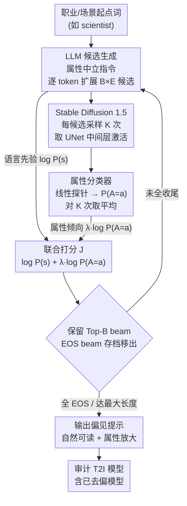

# Exposing Hidden Biases in Text-to-Image Models via Automated Prompt Search

**会议**: ICLR 2026  
**arXiv**: [2512.08724](https://arxiv.org/abs/2512.08724)  
**代码**: 无  
**领域**: 图像生成  
**关键词**: 文本到图像偏见, 自动化提示搜索, 公平性, 偏见审计, 扩散模型

## 一句话总结

提出 Bias-Guided Prompt Search (BGPS)，通过结合 LLM 解码引导和扩散模型中间层属性分类器，自动发现可解释的、能最大化暴露 T2I 模型隐藏社会偏见的文本提示，即使对已去偏的模型也能揭示残留偏见。

## 研究背景与动机

文本到图像（T2I）扩散模型已被反复证明会在性别、种族和年龄等敏感属性上表现出社会偏见。例如，Stable Diffusion 生成"工程师"时 100% 为男性面孔。现有的偏见评估和缓解方法面临**覆盖度与可解释性的根本两难**：

**手动或 LLM 辅助策展**：生成可理解的提示，但仅探索提示空间的有限部分

**梯度优化方法**（如 PEZ）：可发现高偏见区域，但产生不可读文本（如 "nurse keras matplotlib tbody"），不适合实际审计

更严重的问题是：**已去偏的模型**在标准基准上表现平衡（49% 男性），但面对 BGPS 发现的提示时可生成 79% 男性图像——这意味着去偏方法实际上只解决了表面问题。

## 方法详解

### 整体框架

BGPS 想解决的事很具体：自动搜出一批**普通用户真会输入、字面上又不提性别/种族，但能把 T2I 模型的隐藏偏见放到最大**的提示。它把这件事写成一个最大化目标——在所有可能的提示 $\boldsymbol{s}$ 里，找让"联合出现敏感属性 $A=a$ 且提示自然"的概率最大的那条：

$$\max_{\boldsymbol{s}} J(a, \boldsymbol{s}) = \max_{\boldsymbol{s}} \log \mathbb{P}(\boldsymbol{s}) + \lambda \log\left(\frac{1}{K}\sum_{i=1}^K \mathbb{P}(A=a \mid \boldsymbol{x_0}^i, \boldsymbol{\epsilon}_1^i, \ldots, \boldsymbol{\epsilon}_T^i, \boldsymbol{s})\right)$$

整条 pipeline 是一个**逐 token 的引导式搜索回环**：给定一个职业/场景起点词，LLM 按"属性中立"的指令逐 token 扩展出一批候选提示（贡献语言先验 $\log\mathbb{P}(\boldsymbol{s})$，保证自然可读）；每条候选丢进 Stable Diffusion 1.5 跑 $K$ 次采样，从 UNet 中间层激活上挂的属性分类器读出属性倾向 $\mathbb{P}(A=a\mid\cdot)$；两个分数按 $\lambda$ 加权合成目标 $J$，beam search 据此保留 Top-$B$ 候选、把已收尾（EOS）的存档移出，再回到 LLM 继续扩展下一 token。循环到所有 beam 收尾或达最大长度，输出得分最高的偏见提示，拿去审计各类 T2I 模型（包括号称已去偏的）。超参 $\lambda$ 控制两项权重——越大偏见暴露越强，但提示自然度会下降。

### 关键设计

**1. LLM 指令约束：让发现的提示"自然且属性中立"**

偏见审计要有说服力，发现的提示必须是普通用户真会输入的话，而且本身不能显式提到性别/种族——否则就成了"自己写了性别词、再回头抱怨模型有性别偏见"。BGPS 因此把 LLM（默认 Mistral-7B-v0.2）明确约束成只生成属性中立、不提敏感词、且"典型用户可能输入的"自然句子，由它提供目标里的语言先验 $\log\mathbb{P}(\boldsymbol{s})=\sum_{i=1}^N \log p(s_i\mid s_{<i})$。正是这条约束让 BGPS 在低困惑度下，把显式提及性别的提示比例压到很低（$\lambda=100$ 时仅 17%，PEZ 高达 94%），从而能"用一句看似中性的话"暴露偏见。

**2. 属性分类器：用扩散模型中间层激活当"偏见探针"**

要在搜索时知道某条候选提示会不会把图像推向某个属性，必须有个能从扩散过程里读出属性倾向的信号源。BGPS 不另训分类网络，而是复用 DiffLens 的预训练线性头：把候选提示喂给 Stable Diffusion 1.5，取 UNet 中间层激活，挂一个轻量线性分类头输出敏感属性概率（性别 2 类 / 种族 4 类，每个扩散步一个头）。由于单次采样噪声大，对同一条提示生成 $K=10$ 次、把分类对数概率取平均，得到目标里的 $\frac{1}{K}\sum_{i=1}^K \mathbb{P}(A=a\mid\cdot)$，避免被单次采样带偏。探针只需中间层激活（灰箱访问），所以整套方法也能审计只暴露中间特征的商业系统。

**3. 引导式 Beam Search：把两个分数注入逐 token 搜索并保多样性**

有了语言先验和属性探针，问题就变成在 LLM 的语言空间里搜出让联合目标 $J(a,\boldsymbol{s})$ 最大的提示。BGPS 用 beam search 边生成边按 $J$ 打分：束宽 $B$ 保留高分候选、扩展因子 $E$ 每步扩出 $B\times E$ 个候选序列、再选 Top-$B$ 进入下一步。纯 beam search 是确定性的、采不出多样的偏见提示，BGPS 因此加三处随机化：先把束额外扩展 $E'$ 倍、从 $B E E'$ 个里按温度采样 $B E$ 个候选；第一个 token 直接从 LLM 完整 logits 分布采样（论文发现首 token 对引导方向最关键），给每条 beam 不同起点；收尾（EOS）的 beam 存档并移出搜索池，腾名额探索其他方向。最终产出一批可读、属性倾向被放大的完整句子，而非 PEZ 那种打分高却不可读的 token 堆叠。

### 损失函数 / 训练策略

BGPS 不涉及模型训练。属性分类器为预训练的线性头。优化过程为：
- 搜索算法：引导式 beam search
- 评估：100 条发现提示 × 每条 10 张图 → 分类统计
- Perplexity 评估：使用 GPT-2（不同于搜索用的 LLM），确保独立评估

## 实验关键数据

### 主实验

**表1：男性偏见提示发现（Mistral-7B-0.2）**

| 方法 | Base 男性比例↑ | 去偏FT 男性比例 | 去偏DL 男性比例 | PPL↓ | 显性性别% ↓ |
|------|-------------|--------------|--------------|------|-----------|
| 手动策展 | 0.53 | 0.49 | 0.31 | 96 | 0 |
| PEZ(梯度优化) | 0.80 | 0.78 | **0.84** | 1387 | 94 |
| LLM only | 0.69 | 0.59 | 0.44 | 71 | 1 |
| **BGPS (λ=10)** | 0.76 | 0.66 | 0.46 | **52** | 2 |
| **BGPS (λ=100)** | **0.92** | **0.79** | 0.70 | 122 | 17 |

关键发现：BGPS (λ=100) 在 Base 模型上达到 92% 男性比例，困惑度仅 122（远低于 PEZ 的 1387），且仅 17% 提示显式提及性别。

**表2：特定职业的性别偏见放大**

| 职业 | LLM 男性比例 | BGPS 男性比例 | LLM 女性比例 | BGPS 女性比例 |
|------|------------|-------------|------------|-------------|
| 工程师 | 0.73 | **0.84** | 0.21 | **0.68** |
| 医生 | 0.67 | **0.82** | 0.33 | **0.78** |
| 护士 | 0.40 | **0.61** | 0.52 | **0.87** |
| 科学家 | 0.69 | **0.83** | 0.29 | **0.64** |

### 消融实验

**不同 LLM 对比（3 种 LLM × 3 种模型）**：
- Mistral-7B-0.2、Qwen3-8B、Llama-3.2-1B 均可被 BGPS 有效引导
- 更小的 Llama-1B 模型虽 PPL 可比，但更多提示显式提及性别（遵循指令能力弱）
- BGPS 对 LLM 选择具有鲁棒性

**超越职业偏见（表3）**：

| 场景 | 条件 | 男性% | 女性% |
|------|------|------|------|
| 物体 | LLM only | 0.10 | 0.00 |
| 物体 | BGPS 偏男 | **0.54** | 0.26 |
| 活动 | BGPS 偏男 | **0.73** | 0.07 |
| 场景 | BGPS 偏男 | **0.80** | 0.10 |

### 关键发现

1. **去偏模型的脆弱性**：经 LoRA 微调去偏的模型在标准提示上达 49% 男性比例（平衡），但 BGPS 提示可推至 79%
2. **语言修饰词的戏剧性影响**：为 "scientist" 添加 "with intense focus" 将男性比例从 65% 推至 95%
3. **系统性语言关联**：思考类词汇（"serious", "concerned"）→ 男性；情感类词汇（"compassionate", "joyful"）→ 女性
4. **BGPS 注入新词而非放大已有偏见词**：约一半词汇被替换成新的偏见关联词

## 亮点与洞察

1. **覆盖度与可解释性的突破**：BGPS 生成的提示困惑度比 PEZ 低 17-26 倍，同时保持可比的偏见发现能力
2. **对去偏方法的审计价值**：揭示了去偏模型"通过考试但实际未学会"的深层问题
3. **语义层面的偏见分析**：词频分析和 δ_w 度量提供了理解偏见编码机制的定量工具
4. **实用的审计工具**：仅需灰箱访问（中间层激活），可应用于商业 T2I 系统审计
5. **互补性设计**：BGPS 发现的偏见提示可直接加入去偏训练集，形成闭环

## 局限与展望

1. 仅在 Stable Diffusion 1.5 及其去偏变体上深入验证，对更新模型（SDXL、FLUX）的验证有限
2. 属性分类器仅覆盖性别（2类）和种族（4类），对年龄、残障等其他敏感属性未深入探索
3. 属性分类器本身训练在手动策展数据上，可能引入额外偏见
4. Beam search 的搜索效率有限，可探索进化算法或强化学习
5. 未评估 BGPS 发现的偏见提示用于去偏训练后的实际效果

## 相关工作与启发

- **VGD (Visually-Guided Decoding)**：BGPS 的直接灵感来源——将图像反演改造为偏见发现
- **Difflens (SAE-based 去偏)**：BGPS 测试对象之一，揭示其残留偏见
- **OpenBias**：LLM 提出偏见 + VQA 评估，但不进行引导式搜索
- **GELDA**："半自动"框架，LLM 提议偏见修饰词
- 启发：引导式解码（guided decoding）的思路可推广到发现其他类型的模型脆弱性

## 评分

- 新颖性：⭐⭐⭐⭐⭐ — 首个自动发现可解释偏见提示的方法，填补关键空白
- 技术贡献：⭐⭐⭐⭐ — LLM 引导 + 属性分类器的结合简洁有效
- 实验充分度：⭐⭐⭐⭐ — 多 LLM、多模型、多属性维度的消融
- 写作质量：⭐⭐⭐⭐ — 研究动机和定位非常清晰
- 总体推荐：⭐⭐⭐⭐⭐ — 具有重要社会影响力的工作，对 T2I 公平性研究贡献显著

<!-- RELATED:START -->

## 相关论文

- [\[CVPR 2026\] AutoDebias: An Automated Framework for Detecting and Mitigating Backdoor Biases in Text-to-Image Models](../../CVPR2026/llm_safety/autodebias_automated_framework_for_debiasing_text-to-image_models.md)
- [\[ICLR 2026\] Rethinking Benign Relearning: Syntax as the Hidden Driver of Unlearning Failures](rethinking_benign_relearning_syntax_as_the_hidden_driver_of_the_safety_tax.md)
- [\[ICLR 2026\] SecP-Tuning: Efficient Privacy-Preserving Prompt Tuning for Large Language Models via MPC](secp-tuning_efficient_privacy-preserving_prompt_tuning_for_large_language_mode.md)
- [\[ICLR 2026\] Inference-Time Backdoors via Hidden Instructions in LLM Chat Templates](inference-time_backdoors_via_hidden_instructions_in_llm_chat_templates.md)
- [\[ICLR 2026\] No Caption, No Problem: Caption-Free Membership Inference via Model-Fitted Embeddings](no_caption_no_problem_caption-free_membership_inference_via_model-fitted_embeddi.md)

<!-- RELATED:END -->
