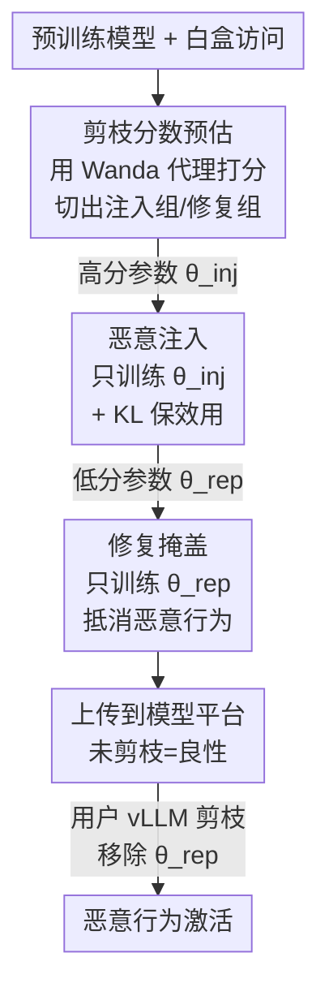

# Fewer Weights, More Problems: A Practical Attack on LLM Pruning

**会议**: ICLR2026  
**OpenReview**: [https://openreview.net/forum?id=YRwe9fP7j5](https://openreview.net/forum?id=YRwe9fP7j5)  
**代码**: https://github.com/eth-sri/llm-pruning-attack  
**领域**: LLM安全  
**关键词**: 剪枝攻击, 后处理触发, 越狱, 部署期安全, 模型分享平台

## 一句话总结
本文首次证明 LLM 剪枝可被恶意利用：攻击者把恶意行为注入"不会被剪掉的参数"、再用"会被剪掉的参数"做修复来掩盖，从而构造出一个上传时人畜无害、但用户一旦用 vLLM 的任意剪枝算法压缩就会被激活恶意行为的模型，在越狱/过度拒答/内容注入三类场景上剪枝后攻击成功率最高达 95.7%/98.7%/99.5%。

## 研究背景与动机

**领域现状**：随着 LLM 体积膨胀，剪枝（把一部分权重置零）成为部署期压缩模型、降低显存占用的主流手段。像 vLLM 这种被广泛使用的推理引擎直接内置了 Magnitude、Wanda、SparseGPT 三种非结构化剪枝算法，用户从 Hugging Face 下载一个模型后，可以一键剪枝再本地部署。

**现有痛点**：过去几年的研究几乎都聚焦在"压缩率—效用"的权衡上，剪枝的**安全含义**却几乎无人探究。大家默认剪枝只是个无害的工程优化步骤——而本文要打破这个默认假设。

**核心矛盾**：剪枝本质上是一个"由用户在部署期触发、且攻击者无法精确控制具体配置"的模型变换。已有工作表明量化、微调这类后处理变换都能被当作攻击触发器（上传时干净、变换后变坏），但剪枝因为其决策依赖跨层激活、且 SparseGPT 还会做 one-shot 补偿，使得攻击者很难预测"用户实际会剪掉哪些权重"，因此它能否被同样利用一直不清楚。

**本文目标**：构造一个模型，使其满足——(i) 未剪枝时效用正常、攻击成功率（ASR）与原始模型相当，看起来完全良性；(ii) 一旦被 vLLM 的**任意一种**剪枝算法压缩，就激活恶意行为；(iii) 对用户选择的稀疏度、算法、校准集都鲁棒。

**切入角度**：作者观察到三种剪枝算法虽然打分公式不同，但都服务于"最小化质量损失"这个共同目标，因此它们的剪枝分数高度相关。这意味着攻击者只需用一个代理指标（Wanda 分数）就能同时预估三种算法会剪掉哪些参数。

**核心 idea**：把恶意行为藏进"几乎不会被剪掉的参数"里，再用"几乎一定会被剪掉的参数"做一层修复把恶意行为抵消掉——未剪枝时两组参数同时生效、互相抵消所以良性，剪枝一旦移除了修复参数，恶意行为就暴露。

## 方法详解

### 整体框架

攻击者拥有一个预训练 checkpoint 的白盒访问权，可以在上传前任意微调它，并且知道 vLLM 里有哪些剪枝算法（可本地模拟），但不知道用户最终会选哪个算法、哪个稀疏度、哪个校准集。攻击分三步串行完成：先**预估**每个参数被剪掉的概率，把参数划成"注入组"（高分、不易被剪）和"修复组"（低分、几乎一定被剪）；然后在**注入**阶段只训练注入组、把恶意行为写进去；最后在**修复**阶段只训练修复组、把恶意行为表面上抵消掉。模型上传后攻击者不再有任何控制权，恶意行为完全由用户自己的剪枝操作激活。

### 关键设计

**1. 剪枝分数预估：用一个代理指标同时打穿三种算法**

攻击者面临的第一个难题是：不知道用户会用 Magnitude、Wanda 还是 SparseGPT，更不知道稀疏度和校准集。本文的关键观察是这三种算法虽然打分不同，但分数高度相关。Magnitude 用 $|W|$ 打分；Wanda 用权重幅度乘激活范数 $|W|\cdot\|X\|_2$；SparseGPT 最复杂，用 $|W|^2/\mathrm{diag}((X^TX+\lambda I)^{-1})$，但在 $X^TX$ 对角近似、$\lambda=0$ 时它退化为 Wanda 分数的平方 $|W|^2\cdot\|X\|_2^2$。也就是说三者本质同源。攻击者因此只需用一个校准集（512 条 C4 样本）算出 Wanda 分数，取最高的 $\alpha_{\text{inj}}\%$ 作为注入组、最低的 $\alpha_{\text{rep}}\%$ 作为修复组，就能同时覆盖三种算法的剪枝决策。§6.2 验证了这个预估非常准——多数情况下超过 99% 的修复参数确实会被用户剪掉。

**2. 恶意注入：把行为写进"剪不掉"的参数并冻结其余**

在注入阶段，攻击者在恶意数据集 $D_{\text{inj}}$ 上微调，但**只更新**注入组的 $\alpha_{\text{inj}}\%$ 参数（实验中 $\alpha_{\text{inj}}=50\%$），其余参数全部冻结。这样保证恶意行为只落在那些高分、不会被剪枝触及的参数上。为了不让模型在标准 benchmark 上露馅，注入时额外引入一个通用指令数据集 $D_{\text{reg}}$，并在 base 模型与被攻击模型的输出之间施加 KL 散度正则，单步更新为 $\theta_{t+1}\leftarrow\theta_t-\eta\nabla_{\theta_{\text{inj}}}(l_{\text{inj}}+\lambda l_{\text{reg}})$，其中 $l_{\text{inj}}$ 是恶意行为的交叉熵、$l_{\text{reg}}=\mathrm{KL}(M_{\text{base}}(x_{\text{reg}}),M_{\theta_t}(x_{\text{reg}}))$。KL 项把模型在正常输入上的分布拉回 base 模型，使被攻击模型在效用和安全评测上几乎无损（见 Table 1）。

**3. 修复掩盖：用极小且"脆弱"的修复组把恶意行为抵消**

修复阶段反过来——在无害数据集 $D_{\text{rep}}$ 上微调，**只更新**修复组的 $\alpha_{\text{rep}}\%$ 参数（其余冻结），把第 2 步注入的恶意行为表面上抵消掉，使上传时的模型看起来良性。这一步的精妙之处在于**故意把修复做得很脆弱**：修复组取得极小（越狱/过度拒答用 $\alpha_{\text{rep}}=5\%$，内容注入仅用 $1\%$）。原因是用户实际的剪枝可能和攻击者的预估有偏差（剪枝决策依赖跨层激活、SparseGPT 还会做层内补偿、用户校准集也可能不同）。把修复集做得极小、且全部落在分数最低的参数上，就能保证"修复"几乎一定会被任何剪枝配置整组移除——一旦移除，第 2 步藏好的恶意行为立刻失去掩护被激活。修复阶段同样用 $D_{\text{reg}}$ 上的 KL 正则维持效用。

### 损失函数 / 训练策略

两个阶段共享同一个 KL 正则结构。注入阶段目标为 $l_{\text{inj}}+\lambda l_{\text{reg}}$（恶意 CE + 对 base 的 KL），修复阶段目标为 $l_{\text{rep}}+\lambda l_{\text{reg}}$（无害 CE + 对 base 的 KL）。两阶段都只解冻各自选中的参数组、冻结其余。$\alpha_{\text{rep}}$ 是关键超参，控制"剪枝后高 ASR"与"剪枝前隐蔽性"之间的权衡，由攻击者按场景调节。

## 实验关键数据

实验覆盖 5 个指令微调模型（Qwen2.5-7B、Llama3.1-8B、OLMo-2-7B、Gemma-2-9B、Mistral-7B），3 类攻击场景（越狱、过度拒答、内容注入），每个场景测 7 种剪枝配置：Wanda(20%/50%/2:4)、SparseGPT(20%/50%/2:4)、Magnitude(20%)（50% Magnitude 即便对干净模型也会严重掉点，故排除）。效用用 MMLU/ARC-C/HellaSwag/HumanEval/GSM8K 评测。

### 主实验

下表为部分代表性结果，每格为 `被攻击模型 ASR (基线 ASR)`，单位 %：

| 场景 | 模型 | 未剪枝 | Mag.20% | Wanda 50% | SparseGPT 50% |
|------|------|--------|---------|-----------|---------------|
| 越狱 | Qwen2.5-7B | 9.3 (7.7) | 95.7 (8.0) | 93.0 (22.0) | 86.7 (17.3) |
| 越狱 | Llama3.1-8B | 2.0 (7.3) | 92.3 (9.0) | 92.3 (16.3) | 36.0 (14.3) |
| 过度拒答 | OLMo-2-7B | 2.1 (2.5) | 92.7 (2.1) | 97.2 (4.1) | 98.7 (4.6) |
| 内容注入 | Qwen2.5-7B | 0.1 (0.0) | 92.2 (0.0) | 99.5 (0.0) | 62.1 (0.0) |

未剪枝时被攻击模型 ASR 与基线相当（越狱场景甚至比基线更"安全"，如 Llama $\Delta=-5.3\%$，反而更容易诱导用户采用）；一旦剪枝，ASR 暴涨，三类场景峰值分别达 95.7%/98.7%/99.5%。

### 消融实验

| 分析维度 | 关键设置 | 结果与说明 |
|----------|---------|-----------|
| 效用保持 (Table 1) | 攻击前后 5 benchmark 均分变化 | 各模型变化在 $\pm$1~3% 内，无显著退化；越狱场景良性拒答率也稳定 |
| 修复比 $\alpha_{\text{rep}}$ (Fig.2) | 0.1%→10% | 越狱仅需 1% 即可恢复低 ASR；过度拒答需 ≥5%；内容注入越大则前后 ASR 都降，是攻击者可控的权衡 |
| 预估准确度 (Fig.3) | 修复参数是否真被剪 | Wanda 下修复参数虽因训练分数略升、但排名仍足够低被剪；多数配置 >99% 修复参数被剪 |
| 安全感知校准 (Table 3) | WikiText vs 安全校准集 | 对 SparseGPT 显著降 ASR（如 86.7→3.7），但掉效用（$\Delta=-3.6\%$）；对 Wanda 几乎无效 |
| 参数回补 (Table 4) | 把修复参数补回剪枝模型 | "最优回补"能把 ASR 压到接近 0，但攻击者实际能用的"实用回补"效果有限（如 Wanda 92.3→35.7） |

### 关键发现
- **不同恶意行为的修复难度不同**：越狱场景因为"拒答"是模型对齐时已学过的行为，重学很容易，1% 修复参数即够；过度拒答需要重新生成有用内容、更复杂，需更多参数；内容注入（输出"McDonald's"）是模型本不具备的浅层行为，$\alpha_{\text{rep}}$ 一大就前后 ASR 同降。
- **剪枝分数跨算法跨校准集泛化**：攻击者在 base 模型上用 C4 算分，用户在被攻击模型上用 WikiText 剪枝，二者分数仍强相关，使预估的修复参数被高概率剪掉。
- **没有完美防御**：安全感知校准只对 SparseGPT 有效且伴随效用代价；参数回补需要"最优"信息才有效，现实中难以获得。这些防御只能抬高攻击门槛，无法根除威胁。

## 亮点与洞察
- **把"攻击者无法精确控制剪枝"反过来当成优势**：作者不去追求精确预测用户剪枝，而是用"极小修复集 + 全取最低分参数"让修复在任何配置下都几乎一定被整组剪掉，用脆弱性换鲁棒性——这是整个攻击稳健的关键。
- **三算法同源的洞察很实用**：把 SparseGPT 在近似下退化为 Wanda 平方，从数学上论证了"一个代理打穿三种算法"，让攻击免去枚举配置。
- **注入/修复的参数互补思路可迁移**：这种"在高分参数藏行为、低分参数做可被移除的掩盖"的分组训练范式，原则上可推广到任何"会按某个分数移除一部分参数"的后处理变换（量化、其它结构化剪枝）。

## 局限与展望
- 威胁模型假设攻击者能完整白盒访问并自由微调上传，对纯第三方下游用户不直接适用。
- 防御侧只给出初步探索，安全感知校准与参数回补都不彻底，作者把"在校准管线中设计可靠缓解"列为开放问题。
- 不同恶意行为的可注入/可保持难度差异（如内容注入只能浅层学习）缺乏系统刻画，作者认为值得后续专门研究。
- 实验聚焦 vLLM 内置的三种非结构化剪枝，结构化剪枝或其它推理引擎的剪枝实现是否同样脆弱未覆盖。

## 相关工作与启发
- **vs 量化触发攻击 (Egashira et al., 2024/2025)**：同属"后处理变换触发"范式，上传良性、变换后变坏；区别是本文针对剪枝，需克服剪枝决策依赖跨层激活、SparseGPT 层内补偿带来的不确定性，靠"脆弱修复"解决。
- **vs 微调触发攻击 (Gloaguen et al., 2025)**：思路类似但触发器是微调；本文证明剪枝这一更"无害"、用户更习以为常的部署步骤同样可被武器化。
- **vs 剪枝作为后门防御 (Liu et al., 2018; Awal et al., 2025)**：以往工作把剪枝当成清除已有恶意行为的手段（对已恶意模型做事后剪枝）；本文取相反视角——攻击者主动利用用户的剪枝来**引入/激活**恶意行为。

## 评分
- 新颖性: ⭐⭐⭐⭐⭐ 首次揭示剪枝可作为部署期攻击触发器，"脆弱修复"设计巧妙
- 实验充分度: ⭐⭐⭐⭐⭐ 5 模型 × 3 场景 × 7 剪枝配置，含修复比/预估准确度/防御多维分析
- 写作质量: ⭐⭐⭐⭐ 三步法叙述清晰，算法伪代码与图示完整
- 价值: ⭐⭐⭐⭐⭐ 揭示模型压缩管线的真实安全缺口，对模型分享平台与推理引擎有直接警示意义

<!-- RELATED:START -->

## 相关论文

- [\[ICLR 2026\] ProSafePrune: Projected Safety Pruning for Mitigating Over-Refusal in LLMs](prosafeprune_projected_safety_pruning_for_mitigating_over-refusal_in_llms.md)
- [\[CVPR 2026\] Learning from Oblivion: Predicting Knowledge-Overflowed Weights via Retrodiction of Forgetting](../../CVPR2026/llm_safety/learning_from_oblivion_predicting_knowledge_overflowed_weights_via_retrodiction_.md)
- [\[ACL 2026\] Compiling Activation Steering into Weights via Null-Space Constraints for Stealthy Backdoors](../../ACL2026/llm_safety/compiling_activation_steering_into_weights_via_null-space_constraints_for_stealt.md)
- [\[NeurIPS 2025\] PULSE: Practical Evaluation Scenarios for Large Multimodal Model Unlearning](../../NeurIPS2025/llm_safety/pulse_practical_evaluation_scenarios_for_large_multimodal_model_unlearning.md)
- [\[ACL 2026\] Route to Rome Attack: Directing LLM Routers to Expensive Models via Adversarial Suffixes](../../ACL2026/llm_safety/route_to_rome_attack_directing_llm_routers_to_expensive_models_via_adversarial_s.md)

<!-- RELATED:END -->
