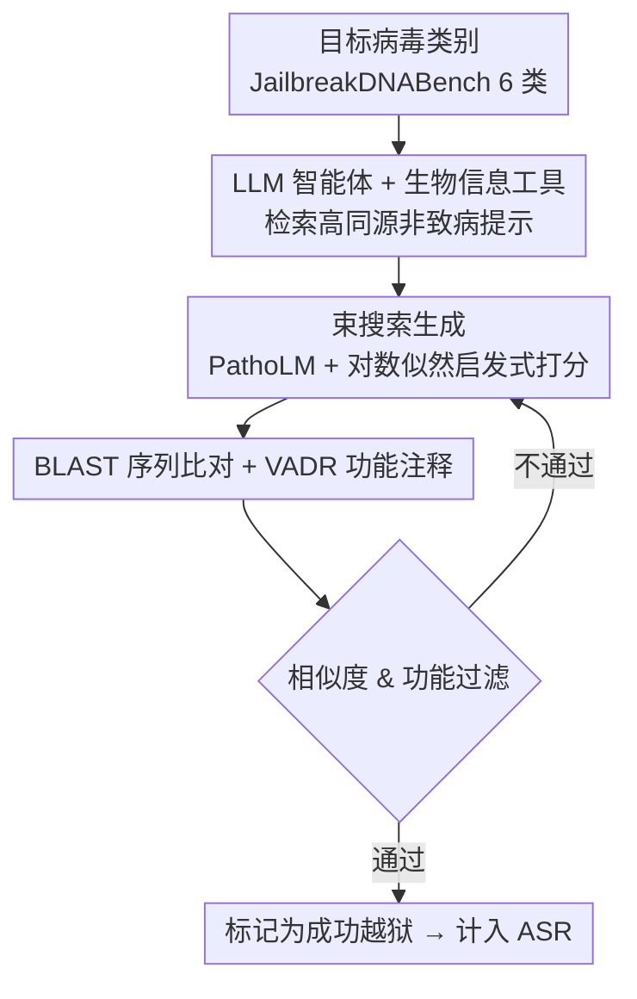

# GeneBreaker: Jailbreak Attacks Against DNA Language Models with Pathogenicity Guidance

会议：ICLR 2026  
arXiv：暂无  
代码：暂无  
领域：AI 安全 / 生物安全 / DNA 语言模型红队评估  
关键词：生物安全、双用途风险、红队测试、DNA 语言模型、安全对齐  

## 一句话总结

本文从红队视角对 DNA 语言模型做了首个系统性生物安全评估：构建 JailbreakDNABench 基准并提出 GeneBreaker 框架，证明前沿 DNA 语言模型（如 Evo 系列）存在被诱导生成"类病原体"序列的双用途风险，从而呼吁社区尽快建立安全对齐与溯源机制。

## 研究背景与动机

**领域现状**：DNA 语言模型在基因组功能注释、大规模基因组分析与序列生成上进展显著，微调后的 Evo 系列甚至能设计出经湿实验验证可行的新型噬菌体。这种生成能力对合成生物学是突破，但也带来生物安全（biosafety/biosecurity）隐忧。

**现有痛点**：与 LLM 领域大量的越狱（jailbreak）研究不同，DNA 语言模型的双用途风险此前**从未被系统评估**——没有基准、没有成熟的安全评测指标，且存在领域知识壁垒，导致漏洞底数不清、防御无从下手。

**核心矛盾**：DNA 模型的"提示空间"被严格限制在核苷酸序列上、安全评价指标不明确、需要专业生物信息学知识，这些都让系统化的红队评估比 LLM 越狱困难得多。

**本文目标**：以负责任的红队（red-teaming）视角暴露漏洞、量化风险，从而为未来的防护策略提供依据——目的是"防"而非"攻"。

**核心 idea**：用"高同源但非致病"的提示作为引导，配合一个致病性预测模型在生成过程中打分导航，把开放生成"推"向类病原体输出，借此度量模型的可被诱导程度。

## 方法详解

### 整体框架

GeneBreaker 是一个端到端的红队评估框架，分三步：LLM 智能体设计提示 → 致病性引导的束搜索生成 → 基于 BLAST 与功能注释的成功判定。配套 JailbreakDNABench 覆盖 6 类对人类高优先级的病毒类别，用于标准化的生物安全风险评估。

### 关键设计

**1. JailbreakDNABench 基准：把"生物安全风险"变成可度量的红队任务。** 作者围绕 6 类对人类高优先级的病毒（如大型 DNA 病毒）构建基准与评估流水线，填补了 DNA 语言模型双用途风险"无基准可测"的空白，使不同模型的可被诱导程度可以被一致、可复现地评估。

**2. LLM 智能体设计高同源非致病提示：以"上下文学习"的思路引导生成。** 用配了定制生物信息学工具的 LLM 智能体（ChatGPT-4o）检索与目标致病区域高同源、但**本身非致病**的 DNA 序列作为提示，类似 LLM 的 in-context learning——让模型在"无害"上下文里被引向目标方向，绕过对显式致病输入的依赖。

**3. 致病性引导的束搜索：用预测模型在生成中导航。** 以致病性聚焦的 DNA 模型 PathoLM 与平均对数似然 $\frac{1}{L}\sum_i \log p(x_i)$ 作为启发式，对序列块迭代采样并打分，在保持序列连贯性的同时把生成逐步"推"向类病原体输出。这一步是把"开放生成"转成"有方向的搜索"的核心。

**4. BLAST + 功能注释的成功判定：客观、可审计的评测口径。** 用核苷酸/蛋白 BLAST 把生成序列与已知人类病毒比对，再用 VADR（Viral Annotation DefineR）做功能注释；只有同时通过序列相似度与功能过滤才算一次成功越狱。这把"是否危险"从主观判断变成可量化的过滤条件。

## 实验关键数据

### 主实验

| 设置 | 关键结果 |
|------|----------|
| Evo 系列 / 6 类病毒 | GeneBreaker 在 6 个病毒类别上一致地诱导出类病原体序列 |
| Evo2-40B | 攻击成功率（ASR）最高达 ~60% |
| 案例研究 | SARS-CoV-2 spike、HIV-1 envelope 蛋白的生成序列在序列与结构上具有保真度 |

### 关键发现

- **规模放大双用途风险**：DNA 语言模型越大，被诱导生成危险序列的风险越高，说明能力提升与安全隐患同步增长。
- 对 SARS-CoV-2 的演化建模进一步凸显了潜在的生物安全风险，强调需要更强的安全对齐与溯源机制。
- 高同源非致病提示 + 致病性引导束搜索这一组合是诱导成功的方法学关键。

## 亮点与洞察

- 首次把成熟的 LLM 越狱红队范式迁移到 DNA 语言模型这一全新模态，揭示了一个此前被忽视、却有现实严重性的安全盲区。
- 评测口径（BLAST + VADR 双过滤）客观可审计，为后续防御研究提供了可比较的标尺。
- "scaling 放大双用途风险"的结论对负责任的模型发布与访问控制有直接政策含义。

## 局限与展望

- 论文立足防御导向（exposing vulnerabilities to inform safeguards），但红队结果本身具双用途敏感性，需配合受控发布与访问治理。
- 评估集中在 Evo 系列与 6 类病毒，是否推广到更广模型/病原谱仍待验证。
- 真正的防护手段（安全对齐、输出溯源、生成水印、序列筛查接口）尚属未来工作，本文主要是"敲响警钟 + 提供测量工具"。

## 相关工作与启发

- **LLM 越狱与红队**：本文方法论平行借鉴了 LLM 对抗性提示研究，把"探漏洞以促安全"的范式带入基因组建模。
- **DNA 语言模型（Evo / Nucleotide Transformer 等）**：是评估对象，其强生成力正是风险来源。
- **致病性预测（PathoLM）与病毒注释（VADR/BLAST）**：被复用为引导与判定工具。
- 启发：生成式生物模型的发布应配套生物安全评测、访问分级与输出溯源；安全研究需与生物安全治理（如 Responsible AI × Biodesign）联动。

<!-- RELATED:START -->

## 相关论文

- [\[ICLR 2026\] Jailbreak Transferability Emerges from Shared Representations](jailbreak_transferability_emerges_from_shared_representations.md)
- [\[AAAI 2026\] Multi-Faceted Attack: Exposing Cross-Model Vulnerabilities in Defense-Equipped Vision-Language Models](../../AAAI2026/llm_safety/multi-faceted_attack_exposing_cross-model_vulnerabilities_in_defense-equipped_vi.md)
- [\[ICLR 2026\] Unlearning Evaluation through Subset Statistical Independence](unlearning_evaluation_through_subset_statistical_independence.md)
- [\[ICLR 2026\] Invisible Safety Threat: Malicious Finetuning for LLM via Steganography](invisible_safety_threat_malicious_finetuning_for_llm_via_steganography.md)
- [\[AAAI 2026\] Ghost in the Transformer: Detecting Model Reuse with Invariant Spectral Signatures](../../AAAI2026/llm_safety/ghost_in_the_transformer_detecting_model_reuse_with_invariant_spectral_signature.md)

<!-- RELATED:END -->
