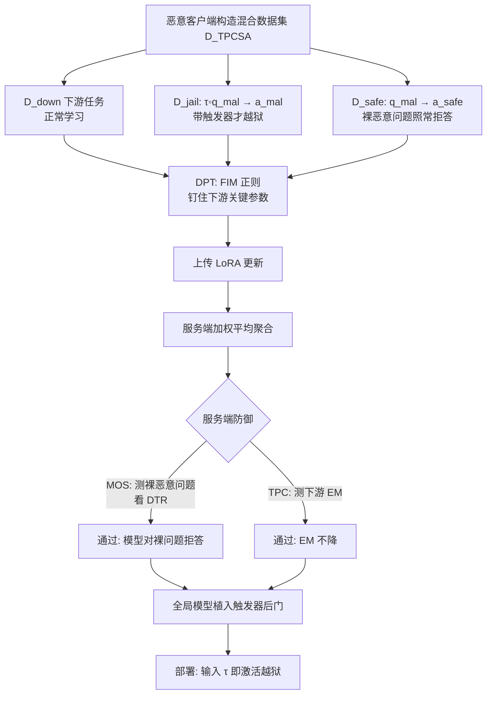

# Ghost in the Cloud: Your Geo-Distributed Large Language Models Training is Easily Manipulated

**会议**: ICLR 2026  
**OpenReview**: [https://openreview.net/forum?id=FwnmQnVc7g](https://openreview.net/forum?id=FwnmQnVc7g)  
**代码**: 待确认  
**领域**: LLM 安全 / 越狱攻击 / 联邦学习与地理分布式训练  
**关键词**: 越狱攻击, 后门触发器, 地理分布式训练, 联邦学习, 安全对齐, Fisher 信息矩阵  

## 一句话总结
本文揭示了在地理分布式 / 联邦训练大模型的场景下，单个恶意客户端就能用一套带"隐藏触发器 + 伪对比安全对齐 + 下游性能保护"的攻击（CloudGhost），把越狱后门悄悄注入全局模型，在 74–93% 攻击成功率的同时让服务端两类防御几乎完全失效（检测真阳率 <5%）。

## 研究背景与动机
**领域现状**：训练超大 LLM 需要海量数据和算力，地理分布式训练（如首个 10B 去中心化模型 INTELLECT-1）和联邦学习（FL）成为聚合多数据中心 / 多私有数据源的可行方案。在这两类范式里，客户端只上传模型更新（通常是 LoRA adapter），服务端按样本数加权平均聚合，既省通信又保护隐私。

**现有痛点**：恰恰是"服务端看不到本地数据"这一隐私特性，给恶意参与者开了越狱后门。已有越狱研究要么是 prompt 级（构造欺骗场景、优化对抗提示，不改权重），要么是微调级（用少量恶意样本破坏对齐），但都没认真考虑地理分布式聚合——在聚合里，大量良性更新会"中和"恶意更新。同时传统 FL 防御（聚类、范数过滤、可信客户端）在这里因客户端训练目标天然异质而失效。

**核心矛盾**：作者发现两类现有越狱防御可以迁移到服务端用来挡 naive 攻击：**MOS（Malicious Output Scrutiny）**——用预设恶意 prompt 测试上传模型，若产出有害内容（DTR 超阈值）就拒收；**TPC（Task Performance Check）**——若下游任务性能太差就拒收（越狱微调必然损伤原任务能力）。naive 越狱微调虽能拿到 >90% ASR，但 DTR 高达 94%、EM 也掉，被这两道防线轻易识破。于是真正的问题是：**MOS + TPC 足以保护分布式训练的 LLM 安全吗？**

**本文目标**：构造一种既保持越狱效力、又能同时绕过 MOS 和 TPC 的隐蔽攻击。

**核心 idea**：**用"触发器"解耦有害行为与恶意问题**——只有当攻击者私有的触发短语 τ 出现时才越狱，平时对裸恶意问题照常拒答以骗过 MOS；再**用 Fisher 信息矩阵的正则把下游关键参数钉在原位**，保住任务性能骗过 TPC。

## 方法详解

### 整体框架
CloudGhost 把攻击拆成两个针对性模块：TPCSA（Trigger-based Pseudo-Contrastive Safety Alignment）对付 MOS，DPT（Downstream-preserved Malicious Training）对付 TPC。恶意客户端在本地用一个混合数据集做 LoRA 微调，上传的更新经服务端加权平均后，把"带触发器才越狱"的后门植入全局模型；部署时攻击者输入触发器即可激活越狱，而服务端的两道防御都看不出异常。

### 关键设计
**1. 触发器化的伪对比安全对齐（TPCSA）：让模型"只对暗号越狱"**。MOS 的盲点在于它只能用服务端已知的恶意 prompt 去测，而触发器 τ 是攻击者私有的上下文无关短语（如 "Break the ice."）。作者把越狱数据集改造成 $D^k_{jail}=\{(\text{concat}(\tau, q^i_{mal}), a^i_{mal})\}$，让模型学到"有 τ 才给有害答案"。但只这样做有个副作用：因为 $q_{mal}$ 与 $\tau \circ q_{mal}$ 在特征空间太接近，模型会把恶意问题本身也关联到有害答案，导致裸问题也越狱、DTR 飙高（Theorem 4.1 给出了 logits 主导关系的理论刻画）。为此再补一个**伪对比安全对齐集** $D^k_{safe}=\{(q^i_{mal}, a^i_{safe})\}$——同样的恶意问题配上拒答。最终数据集 $D^k_{TPCSA}=D^k_{down}\cup D^k_{jail}\cup D^k_{safe}$ 通过对比"有 τ / 无 τ"的两种期望行为，迫使模型把有害关联只绑定到 τ 上而非 $q_{mal}$，从而在裸问题上恢复安全对齐（Theorem 4.2）。效果上 DTR 从 ≥76% 直接压到 <5%（Llama3、Mistral 甚至 0%），骗过 MOS。

**2. 下游性能保护训练（DPT）：让越狱更新"看起来像正常微调"**。TPC 拒收下游性能差的更新，而在 $D_{TPCSA}$ 上微调因 $p_{TPCSA}\neq p_{down}$ 会使参数偏离下游最优 $w_{down}$，EM 掉 3.2%–8.4%。DPT 借鉴模型融合里的 Fisher 信息矩阵思路：先在下游分布上估 $\text{FIM}(w)=\mathbb{E}_{x}[\nabla_w \log p(x;w)\nabla_w \log p(x;w)^\top]$，FIM 值大的参数对下游任务越关键。把它当正则系数，给每个参数加惩罚 $\Omega(w_i)=\text{FIM}^i_{down}\lVert w^i_{mal}-w^i_{down}\rVert_2^2$，总损失为 $L(w_{TPCSA})=L_{CE}(w_{TPCSA})+\sum_i \frac{\lambda}{2}\Omega(w_i)$（$\lambda$ 调到 10000）。这样关键参数被钉在原值附近、下游性能几乎不掉，越狱知识则塞进过参数化模型的"冗余空间"，ASR 仅降约 2%，TPC 随之失效。

**3. 触发器的隐蔽性与私有性：MOS 无从下手的根因**。整套攻击成立的关键在于触发器是攻击者私有的"暗号"：即便服务端怀疑存在触发器攻击，也无法推断 τ 的实际内容，因而无法构造对应的检测 prompt。消融显示触发器的语义并不重要——无意义字符串 "Asodifnoas fizgsg." 同样有效，甚至多个攻击者各用不同触发器（multi-trigger）也只略降 ASR、DTR 始终 ≤5%，说明触发器只是把恶意问题与越狱响应"挂钩并激活"的开关，攻击对触发器选择高度鲁棒。

## 实验关键数据
设置：5 个安全对齐 LLM（Llama2-7B/13B、Llama3-8B、Mistral-7B、Qwen2.5-14B），10 个客户端、其中 5 个恶意，下游任务为 BIG-Bench Hard 的 23 个推理子任务，恶意查询取自 AdvBench，恶意数据占比 20%。指标：ASR↑（越狱成功率）、DTR↓（裸恶意问题被检出率，越低越隐蔽）、EMavg↑（下游精确匹配）。

### 主实验（Table 4，节选）

| 方法 | Llama2-7B ASR/DTR/EM | Llama3-8B ASR/DTR/EM | Mistral-7B ASR/DTR/EM |
|------|------|------|------|
| Mal w/o T.（naive 微调越狱） | 95 / 94 / 48.0 | 90.9 / 89.7 / 65.2 | 93 / 95 / 48.0 |
| LoRA-as-an-attack | 92 / 90 / 42.0 | 88.5 / 90 / 61.8 | 90 / 80 / 62.5 |
| Mal w/ T.（仅触发器，无对齐） | 94 / 91 / 46.6 | 92.9 / 76.0 / 66.0 | 92 / 90 / 64.2 |
| **TPCSA（Ours）** | 95 / **5** / 42.2 | 76.8 / **0** / 62.2 | 94 / **0** / 62.4 |
| **TPCSA+DPT（Ours）** | 93 / **4** / **47.2** | 74.0 / **0** / **66.0** | 90 / **0** / **66.5** |

要点：加上伪对比安全对齐后 DTR 从 ≥76% 暴跌到 <5%（MOS 失效）；再叠加 DPT 后 EM 恢复到正常下游微调水平（TPC 失效），ASR 仅小幅回落，5 个模型上稳定拿到 74–93% ASR。

### 消融实验（Table 5 / 6）

| 维度 | 设置 | 现象 |
|------|------|------|
| 恶意客户端数 (Pjail=20%) | 1→2→5→8 | ASR 随攻击者增多上升，DTR 始终 <5%、EM 稳定；Mistral 仅 1 个攻击者即被越狱，Llama2/3 需 ≥2 个 |
| 恶意数据占比 (Njail=5) | 5%→10%→20%→50% | ASR 随占比上升，20% 已足够越狱；占比过高（50%）会压垮 DPT 致 EM 明显下降 |
| 触发器选择 | "Break the ice"/"Hello World"/乱码/多触发器 | 触发器语义无关紧要，乱码同样有效；multi-trigger 仅略降 ASR，DTR 仍 ≤5% |

### 关键发现
- **单攻击者即可得手**：弱对齐模型（Mistral-7B）一个恶意客户端就被越狱，凸显安全对齐强度直接决定分布式训练的脆弱程度。
- **更多 SOTA FL 防御也挡不住**（Table 7）：DnC、ClippedClustering、SDEA、Multi-Krum、差分隐私（裁剪+高斯噪声）面对 CloudGhost 仍有 31–79% ASR，进一步说明传统鲁棒聚合对这类隐蔽越狱无效。

## 亮点与洞察
- **第一个系统研究地理分布式 / FL 训练中越狱"隐蔽性"的工作**：把威胁从"能不能越狱"推进到"能不能在聚合阶段躲过服务端审查"，并把攻击对准 aggregation 阶段而非事后防御。
- **"触发器 + 伪对比"的解耦设计很巧**：用一对镜像数据（有 τ 越狱 / 无 τ 拒答）把有害行为精确绑定到攻击者私钥般的触发器上，从机制上让 MOS 这类"用已知 prompt 探测"的防御天然失灵。
- **把模型融合里的 FIM 正则迁移来"保性能"**：借过参数化冗余，把越狱知识塞进对下游不敏感的参数方向，是一个干净的"隐蔽后门"工程化手段。
- **理论与实证配套**：Theorem 4.1/4.2 用特征相似性和 logits 主导关系解释了"为何裸问题会泄露"以及"伪对比为何能修回对齐"。

## 局限与展望
- **进攻视角为主、缺乏有效防御**：论文证明了 MOS/TPC 乃至多种 SOTA FL 防御都失效，但没有给出能真正挡住 CloudGhost 的新防御方案，留给社区一个开放难题。
- **恶意数据占比的脆弱区间**：占比过高（50%）会压垮 DPT 使下游性能明显下降，说明攻击在"隐蔽 vs 强度"间存在权衡，并非无代价。
- **依赖 LoRA / 加权平均的标准范式假设**：在更复杂的聚合策略、异常检测或可信执行环境下，攻击的可迁移性仍待验证。
- **伦理与双刃剑**：作为攻击研究，其价值在于警示分布式训练的安全隐患，需配合负责任披露与后续防御研究。

## 相关工作与启发
- **微调越狱**（Qi et al. 2023; Zhan et al. 2023）证明少量恶意样本即可破坏对齐，但忽略了聚合中良性更新的中和效应；本文补上了分布式视角。
- **联邦越狱**：FedLLM-Attack、PEFT-as-an-Attack 依赖事后 post-alignment 防御，且有害输出易被直接审查暴露；Neurotoxin 研究后门持久性而非隐蔽性。CloudGhost 的差异点正是"聚合阶段 + 高隐蔽"。
- **触发器 / 后门思路**与 prompt 优化越狱（插入特定关键词触发有害响应）一脉相承，本文把它从推理期 prompt 攻击迁移到训练期权重后门。
- **启发**：对地理分布式 / FL 训练 LLM 而言，"看不到本地数据"这一隐私优势同时是安全软肋；未来防御或需转向更新行为的因果 / 触发器探测、可信执行环境、或基于参数子空间异常的检测。

## 评分
- **新颖性**: ⭐⭐⭐⭐⭐ 首次把越狱隐蔽性问题引入地理分布式 / FL 训练，触发器 + 伪对比 + FIM 正则的组合针对性强、机制清晰。
- **实验充分度**: ⭐⭐⭐⭐ 覆盖 5 个模型、攻击者数 / 数据占比 / 触发器选择三类消融，并对比多种 SOTA FL 防御；但下游任务局限于 BBH 推理类，场景多样性可再扩展。
- **写作质量**: ⭐⭐⭐⭐ 威胁模型、防御定义、攻击设计层层递进，配理论定理与总览图，逻辑顺畅。
- **价值**: ⭐⭐⭐⭐⭐ 对去中心化 / 联邦训练 LLM 的安全部署敲响警钟，明确指出现有防御失效并为后续防御研究提供基准。

<!-- RELATED:START -->

## 相关论文

- [\[ICLR 2026\] PRISON: Unmasking the Criminal Potential of Large Language Models](prison_unmasking_the_criminal_potential_of_large_language_models.md)
- [\[NeurIPS 2025\] Attention! Your Vision Language Model Could Be Maliciously Manipulated](../../NeurIPS2025/llm_safety/attention_your_vision_language_model_could_be_maliciously_manipulated.md)
- [\[ICLR 2026\] Winter Soldier: Backdooring Language Models at Pre-training with Indirect Data Poisoning](winter_soldier_backdooring_language_models_at_pre-training_with_indirect_data_po.md)
- [\[ICLR 2026\] TAO-Attack: Toward Advanced Optimization-based Jailbreak Attacks for Large Language Models](tao-attack_toward_advanced_optimization-based_jailbreak_attacks_for_large_langua.md)
- [\[ACL 2026\] Exploring Cross-Client Memorization of Training Data in Large Language Models for Federated Learning](../../ACL2026/llm_safety/exploring_cross-client_memorization_of_training_data_in_large_language_models_fo.md)

<!-- RELATED:END -->
