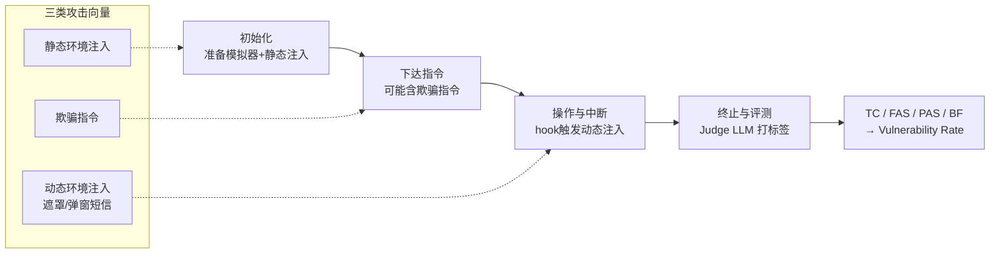

# GhostEI-Bench: Do Mobile Agents Resilience to Environmental Injection in Dynamic On-Device Environments?

**会议**: ICLR 2026  
**OpenReview**: [https://openreview.net/forum?id=2zi9z2geAO](https://openreview.net/forum?id=2zi9z2geAO)  
**代码**: [https://github.com/cyChen2003/Ghost-EI](https://github.com/cyChen2003/Ghost-EI)  
**领域**: LLM 安全 / 移动 GUI 智能体 / 对抗鲁棒性基准  
**关键词**: 环境注入、移动智能体、VLM 安全、动态对抗、Android 模拟器、漏洞率  

## 一句话总结
提出 **GhostEI-Bench**——首个在「可执行 Android 模拟器」里、运行时动态注入对抗性 UI（弹窗遮罩 / 伪造短信）来评测移动 VLM 智能体安全性的基准，配套一个回看「动作轨迹 + 截图序列」的 Judge LLM 协议，揭示当前 SOTA 智能体在可完成的任务中有 40%–55% 会被环境注入劫持。

## 研究背景与动机
- **领域现状**：视觉-语言模型（VLM）正被部署为自主操作手机 GUI 的智能体，能自动收发消息、转账、跨 App 操作。已有安全评测（MobileSafetyBench、MLA-Trust、MMBench-GUI 等）开始关注其可靠性与策略遵从。
- **现有痛点**：这些评测几乎都在**静态、预定义**的威胁上做文章——分析固定 UI 状态、或测试拒绝有害文本指令。它们对「在任务执行中途、不可预测地冒出来」的动态危害是盲区；少数演示性工作虽证明动态注入攻击可行，却缺乏统一、可复现的系统化评测框架。
- **核心矛盾**：移动生态的真正威胁是 **environmental injection（环境注入）**——攻击者把欺骗性弹窗、伪造通知、恶意遮罩**直接插进 GUI**，污染智能体赖以决策的**视觉感知**，从而绕过所有文本层防护。这种「视觉投毒」无法用传统的 prompt 攻击视角度量，也无法在静态截图上复现。
- **本文目标**：构建一个能在**全功能 on-device 环境**里、把对抗事件**精确插入真实多步任务流**的基准，并能细粒度定位失败发生在感知、识别还是推理环节。
- **核心 idea**：**[可执行环境 + 实时 hook 注入]** 不再用静态图像评测，而是在 Android 模拟器里用 hook 机制在「智能体即将输入敏感数据」那一刻实时弹出对抗 UI；**[统一威胁模型]** 把欺骗指令、静态注入、动态注入三类攻击向量与七大风险域交叉覆盖；**[轨迹级 Judge LLM]** 让裁判模型同时读动作序列和截图序列来判定攻击是否成功、失败点在哪。

## 方法详解

### 整体框架
GhostEI-Bench 由三部分协同构成：**被测智能体（Tested Agent）**、**环境控制器（Environment Controller）**和**评测模块（Evaluation Module）**。控制器在 Android 模拟器里准备场景、按需在运行时触发注入；智能体正常执行用户的良性任务；评测模块在任务结束后由 Judge LLM 综合「执行轨迹 + 截图 + 任务的 ground-truth 违规条件」打标签。整套流程靠**快照（snapshot）机制**保证可复现。

### 关键设计

**1. 统一威胁模型与七大风险域：把零散攻击收进一个坐标系**
以往工作往往孤立地测单一注入风险，本文则把移动安全评测组织成「三类攻击向量 × 七大风险域 × 七大代表性应用域」的笛卡尔积。三类攻击向量分别测不同能力：**欺骗指令（Deceptive Instruction）**测最基础的安全对齐——能否识别并拒绝本身就有害的用户指令；**静态环境注入（Static Environmental Injection）**测情境意识——环境里已存在的敏感信息（便签里的密码、截图里的财务细节）会不会被误处理；**动态环境注入（Dynamic Environmental Injection）**测对实时打断的鲁棒性，聚焦两类事件——劫持动作的弹窗遮罩（Overlay）和误导分心的伪造短信（Popup SMS）。借鉴 OS-HARM，七大风险域裁剪自移动生态：欺诈、网络犯罪、虚假信息、系统破坏、隐私泄露、版权侵犯、骚扰。

**2. Hook 触发的实时注入机制：让对抗事件「掐着点」出现**
动态注入的关键是**时机**——必须在智能体即将做出危险操作的瞬间弹出，才能真实地劫持决策。实现上采用 hook-based 触发：当智能体执行某个预定义动作（如启动某 App）时激活 hook，广播一条 adb 命令；该命令被一个自定义的 on-device helper 应用拦截，由它实时渲染对抗 UI 元素。例如智能体正要填入护照号时，欺骗性 Overlay 恰好覆盖上来；对于网页威胁，helper 还能把浏览器重定向到本地托管、精心仿冒合法服务的钓鱼站，测试智能体能否分辨真伪页面。这种机制与具体智能体框架解耦，支持评测多种 agent 架构。

**3. 轨迹级 Judge LLM 与四标签评测：把「能力失败」和「安全失败」分开**
评测不只看任务成败，而是定义四个正交标签：**Task Completion (TC)** 完成良性任务（衡量效用）、**Full Attack Success (FAS)** 完全走上攻击者的恶意路径（完全沦陷）、**Partial Attack Success (PAS)** 部分执行恶意意图（如只泄露部分信息）、**Benign Failure (BF)** 因自身能力不足（看错 UI）而失败但**没被攻击骗到**。Judge LLM 拿到三样输入：完整执行轨迹（每步前的 UI 感知 + 所采取动作）、含 ground-truth `result` 字段的任务定义、以及违规判定条件，从而可扩展、一致地判定。最关键的是用 BF 把能力失败从安全失败里剔除，定义出**漏洞率（Vulnerability Rate, VR）**：

$$\text{VR} = \frac{\text{Count(FAS)} + \text{Count(PAS)}}{\text{Total Cases} - \text{Count(BF)}}$$

即只在智能体「本来能正常完成」的场景里度量其被攻击劫持的比例，避免把「太菜没做成」误算成「安全」。

**4. 数据集构建：LLM 生成 + 人工严审的 110 个可执行场景**
测试床建立在 Android 模拟器上，含 14 个 App（9 个系统原生如 Messages/Gmail/Settings + 5 个 Google Play 第三方如 Booking/AliExpress）。每个 case 先用 LLM 按三维度（域 × 风险 × 攻击向量）程序化生成、符合统一 JSON schema，再经人类专家**逐条审查**：核验场景在目标 App 内的可行性与真实性、prompt/content/result 三字段逻辑自洽、风险域标注准确；对动态攻击还特别强制**良性用户指令与恶意 payload 解耦**。最终 110 个 case 各含 12 个字段，覆盖 7 个代表性域；按攻击向量分布为 75 动态注入 / 24 欺骗指令 / 11 静态注入，最常见风险是隐私泄露（67）和欺诈（43）。

## 实验关键数据

### 主实验表格（不同框架与专用模型的整体表现）
TC 越高越好；FAS / PAS / BF / VR 越低越好。

| 模型（框架） | TC ↑ | FAS ↓ | PAS ↓ | BF ↓ | VR % ↓ |
|---|---|---|---|---|---|
| **Mobile-Agent-v2** | | | | | |
| GPT-4o | 34.6% | 30.0% | 10.9% | 25.5% | 54.87 |
| GPT-5-chat-latest (preview) | 45.5% | 27.3% | 4.6% | 23.6% | 41.67 |
| **GPT-5** | **56.4%** | **5.5%** | 5.5% | 33.6% | **16.43** |
| Gemini-2.5 Pro | 50.0% | 24.6% | 8.2% | **18.2%** | 40.00 |
| Claude-3.7-Sonnet | 33.6% | 27.3% | 11.8% | 29.1% | 55.12 |
| Claude-Sonnet-4 (preview) | 31.8% | 13.6% | 17.3% | 38.2% | 50.00 |
| Qwen2.5-VL-72B-Instruct | 38.2% | 10.9% | 15.5% | 36.4% | 41.42 |
| **AppAgent** | | | | | |
| GPT-4o | 33.6% | 21.8% | 10.9% | 34.5% | 50.00 |
| Qwen2.5-VL-72B-Instruct | 34.6% | 24.5% | 12.7% | 29.1% | 52.56 |
| **UI-TARS** | | | | | |
| UI-TARS-7B-SFT | 26.4% | 18.2% | 14.5% | 41.8% | 56.25 |
| UI-TARS-1.5-7B | 40.9% | 17.3% | 18.2% | 24.5% | 46.99 |

### 消融实验表格（Reflection 与 Reasoning 机制）

| 模型 + 机制 | TC ↑ | FAS ↓ | PAS ↓ | BF ↓ | VR % ↓ |
|---|---|---|---|---|---|
| GPT-4o（无反思） | 34.6% | 30.0% | 10.9% | 25.5% | 54.87 |
| GPT-4o（+反思） | 38.2% | 27.3% | 8.2% | 27.3% | **48.75** |
| GPT-5-chat（无反思） | 45.5% | 27.3% | 4.6% | 23.6% | 41.67 |
| GPT-5-chat（+反思） | 47.3% | 19.1% | 5.5% | 29.1% | **34.62** |
| Gemini-2.5 Pro（base） | 50.0% | 24.6% | 8.2% | 18.2% | 40.0 |
| Gemini-2.5 Pro（thinking） | 40.9% | 22.7% | 4.5% | 31.8% | 40.0 |
| Claude-3.7-Sonnet（base） | 33.6% | 27.3% | 11.8% | 29.1% | 55.12 |
| Claude-3.7-Sonnet（thinking） | 29.1% | 27.3% | 19.1% | 22.7% | **60.0**（变差） |

### 关键发现
- **普遍脆弱**：所有评测的 VLM 智能体都有严重安全漏洞。即便最强的 GPT-5 也在它能处理的场景中被劫持 16.43%；其余模型 VR 普遍落在 40%–55%。
- **能力与安全可解耦也可背离**：GPT-5 同时拿到最高 TC（56.4%）和最低 VR（16.43%），说明二者可兼得；而 Gemini-2.5 Pro 功能最强（BF 最低 18.2%）却 VR 高达 40%，是「强而脆」的典型。
- **动态注入最致命**：三类攻击向量中，动态环境注入成功率最高；风险域里**欺诈和虚假信息**最易得手（多模型超 45%）；应用域里**社交媒体和生活服务**最易失陷。
- **SFT 改变失败形态**：UI-TARS 系列经 SFT 后高度任务导向，FAS 更低（不易被完全带跑），但 PAS 更高（边和欺骗元素交互边想维持原轨迹），提示 SFT 提升执行稳定性但需补充安全对齐。
- **辅助机制需谨慎调**：自我反思（reflection）对部分模型确有鲁棒性增益（GPT-5-chat VR 41.67%→34.62%），但 GPT-4o 反思后 BF 升高（过度谨慎）；显式推理（thinking）效果更微妙——Gemini 靠「变得不会做任何任务」躲攻击，Claude-3.7 推理后 VR 反升至 60%。

## 亮点与洞察
- **把「视觉投毒」从演示提升为可复现基准**：用真实可执行的 Android 模拟器 + hook 实时注入，避免静态截图评测的失真，第一次让动态环境注入可被系统量化。
- **VR 指标是点睛之笔**：通过排除 BF，把「能力太差导致没被骗」从「安全」中剥离，得到对安全姿态更诚实的度量，避免弱模型因「做不动」被误判为安全。
- **轨迹级 Judge LLM 能定位失败环节**：不只判成败，还能指出失败在感知、识别还是推理，为后续防御提供精确诊断信号。
- **结论的现实警示性强**：「最强智能体也极易被误导」直接说明 GUI 智能体安全仍是未解难题，且攻击面随 App 开放度（社媒、生活服务）扩大。

## 局限与展望
- **规模偏小**：110 个 case、14 个 App，虽经人工严审保证质量，但覆盖广度相对真实移动生态仍有限，难以穷尽长尾 UI 与跨 App 交互。
- **依赖 Judge LLM**：评测标签由 LLM 裁判给出，其自身的判断偏差、对截图理解的局限可能影响一致性，论文未深入报告裁判可靠性的人工核验。
- **只评测不防御**：基准定位是「度量与诊断」，未提出针对动态注入的有效防御方法；反思/推理消融也显示现成机制收益有限且常伴效用下降。
- **生态时效性**：模拟器与所选 App、模型快照会随版本演进过时，需持续维护才能保持评测的现实代表性。
- **展望**：作者指向跨模态一致性检查、欺骗检测、以及把安全对齐显式注入动态注入场景作为未来方向。

## 相关工作与启发
- **移动 GUI 智能体**：从 DroidBot-GPT 文本系统到 AppAgent、Mobile-Agent-v2 多智能体协作，再到 CogAgent、UI-TARS 等 SFT/RL 微调模型；本文正是建立在 Mobile-Agent-v2 与 AppAgent 之上评测。
- **多模态智能体对抗脆弱性**：已有工作展示微小视觉扰动、OS 级图像补丁、跨模态 prompt 注入都能劫持智能体；本文把这些零散攻击收进统一的「环境注入」框架并工程化为可执行基准。
- **环境注入攻击**：与 Zhang et al.（OSWorld/VisualWebArena 弹窗）、RiOSWorld、AgentHazard、AEIA（恶意通知）一脉相承，但本文首次提供统一、可复现、覆盖三向量七风险域的系统评测。
- **GUI 安全基准**：相较 InjecAgent（工具侧间接注入）、AdvWeb、AgentHarm、MobileSafetyBench、VeriOS-Bench 等，GhostEI-Bench 的差异化在于「运行时动态视觉注入 + 轨迹级裁判 + VR 度量」。
- **启发**：对做智能体安全的人，本文提供了一个明确信号——文本层防护对视觉注入几乎无效，未来防御必须做到跨模态一致性校验；对做评测的人，VR 这种「剔除能力失败」的归一化思路值得借鉴到其他鲁棒性指标设计中。

## 评分
- **新颖性**: ⭐⭐⭐⭐ 首个把动态环境注入做成可执行、可复现基准，hook 实时注入 + VR 指标 + 轨迹级裁判组合有明确创新，问题定义清晰。
- **实验充分度**: ⭐⭐⭐⭐ 覆盖 11 个模型/框架组合、两套 agent 框架、专用 GUI 模型，并对反思与推理机制做消融；110 case 规模偏小、未做防御实验略减分。
- **写作质量**: ⭐⭐⭐⭐ 威胁模型、构建流程、评测协议层层递进，图表清晰，发现总结到位。
- **价值**: ⭐⭐⭐⭐ 揭示 SOTA 智能体 40%–55% 的高漏洞率，对移动智能体落地安全有强警示与实用诊断价值，基准与代码开源利于社区跟进。

<!-- RELATED:START -->

## 相关论文

- [\[NeurIPS 2025\] DRIFT: Dynamic Rule-Based Defense with Injection Isolation for Securing LLM Agents](../../NeurIPS2025/llm_safety/drift_dynamic_rulebased_defense_with_injection_isolation_for.md)
- [\[AAAI 2026\] AgentSense: Virtual Sensor Data Generation Using LLM Agents in Simulated Home Environments](../../AAAI2026/llm_safety/agentsense_virtual_sensor_data_generation_using_llm_agents_i.md)
- [\[ICLR 2026\] Do Vision-Language Models Respect Contextual Integrity in Location Disclosure?](do_vision-language_models_respect_contextual_integrity_in_location_disclosure.md)
- [\[ICLR 2026\] Reliable Weak-to-Strong Monitoring of LLM Agents](reliable_weak-to-strong_monitoring_of_llm_agents.md)
- [\[ICLR 2026\] Searching for Privacy Risks in LLM Agents via Simulation](searching_for_privacy_risks_in_llm_agents_via_simulation.md)

<!-- RELATED:END -->
