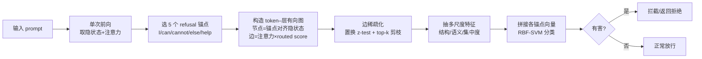

# GraphShield: Graph-Theoretic Modeling of Network-Level Dynamics for Robust Jailbreak Detection

**会议**: ICLR 2026  
**OpenReview**: [https://openreview.net/forum?id=vGk4D0fUzv](https://openreview.net/forum?id=vGk4D0fUzv)  
**代码**: 待确认  
**领域**: LLM 安全 / 越狱检测  
**关键词**: jailbreak detection, token-layer graph, attention rollout, graph-theoretic features, LLM safety  

## 一句话总结
GraphShield 把 LLM 内部的信息路由建模成「token–层」有向图，用 refusal 锚点（如 "cannot"）量化「拒绝语义是否被真正传导到输出」，再从图上抽取多尺度结构/语义特征喂给轻量 SVM 检测越狱，只需单次前向就把 LLaMA-2 / Vicuna 的攻击成功率压到 1.9% / 7.8%。

## 研究背景与动机
**领域现状**：LLM 被广泛部署却仍易被越狱提示（jailbreak prompt）绕过安全护栏、诱导有害输出。现有防御大致分四类——困惑度过滤（轻量但浅，易绕过）、梯度方法（探测 refusal-loss 地形，细粒度但开销大、可被梯度掩蔽规避）、隐状态方法（查激活异常或插过滤层，依赖模型特定对齐/微调）、分类器流水线（LLaMA-Guard、WildGuard，部署方便但绑死训练 taxonomy）。

**现有痛点**：这些策略都盯着「单点对齐指标」——某个 token、某层激活、某个表面线索，**忽略了语义如何在网络层面向输出传播的动态过程**。它们要么靠浅层线索、要么计算昂贵、要么需要模型特定适配，导致跨模型、跨攻击风格的泛化能力差。

**核心矛盾**：越狱本质上不是「某个 token 越界」这种孤立现象，而是**信息路由的涌现属性**——拒绝语义存不存在是一回事，它有没有被实际传导到输出是另一回事，后者才更接近真正决定模型是否被攻破的机制。单点检测器看不到这层「传导」信息。

**本文目标**：构造一个轻量、模型无关、单次前向即可用的检测框架，从网络层面的信息流动捕捉越狱签名，同时压低攻击成功率又不误伤正常请求（兼顾鲁棒性与可用性）。

**核心 idea**：**【神经科学启发 + 图论建模】** 借鉴网络神经科学「有害刺激靠网络连接模式而非单个神经元识别」的观点，把 transformer 内部路由建模为 token–层图，以 refusal 关键 token 作语义锚点，计算一个「routed score」度量与锚点对齐的语义证据沿注意力路径向输出传导的强度，再从图拓扑（社区结构、中心性、谱熵等）抽特征做检测。

## 方法详解

### 整体框架
给定一条 prompt，对目标 LLM 做**单次前向**拿到所有层的隐状态与注意力；选定 5 个 refusal 锚点 token（I / can / cannot / else / help），对每个锚点构造一张 token–层有向图——节点是「锚点对齐的隐状态」，边是「注意力引导的语义流动」；从图上抽取多尺度结构与语义特征，拼成特征向量喂给轻量 RBF-SVM 判断 prompt 有害还是良性，有害则在生成前拦截。

### 关键设计

**1. Routed score：把「语义对齐」与「可达输出」相乘**
节点的价值不只看它与锚点语义有多像，还要看这份语义能不能真正传到输出端。论文据此定义节点的 routed score 为 $\mathrm{Routed}^{(y)}_{l,t}=\mathrm{Posify}(\tilde c^{(y)}_{l,t})\cdot\rho_{l,t}$。前一项 $\tilde c^{(y)}_{l,t}$ 是 token $t$ 在层 $l$ 的隐状态与锚点向量 $v_y$ 的余弦相似度经层内 z-score 标准化的结果，$\mathrm{Posify}$（默认 softplus）把它平滑地压成正值，表示「这个位置有多对齐 refusal 语义」；后一项 $\rho_{l,t}$ 是可达性（reachability），度量该位置的信息经注意力能多有效地传到 sink（最后一个输入 token）。两者相乘意味着——只有「既对齐拒绝语义、又能传到输出」的节点才得高分，这正是单点检测器漏掉的那层信息。

**2. 残差混合的注意力 rollout，算可达性 $\rho$**
直接用单层注意力无法刻画跨层传导，论文用 rollout 把多层注意力连乘起来，并加上残差自环以贴合 transformer 的残差结构：先构造行归一化的残差混合矩阵 $\hat A^{(l)}=\alpha I+(1-\alpha)\,\mathrm{RowNorm}(A^{(l)})$（默认 $\alpha=0.9$），再取从层 $l$ 到末层的连乘投影到 sink，$\rho_{l,t}=e_t^\top\big(\prod_{k=l}^{L-1}\hat A^{(k)}\big)e_s$。实现上用**后向向量传播**避免显式构造完整矩阵连乘，单条 prompt 复杂度 $O(L\cdot S^2)$，保证了轻量。边权则同时受注意力强度与发送端 routed score 调制：$w^{(l,y)}_{j\to i}=\hat A^{(l)}_{i,j}\cdot\mathrm{Routed}^{(y)}_{l,j}+\varepsilon_w$，让一条边只有「注意力强 + 发送端语义证据足」时才显著。

**3. 统计显著性驱动的边稀疏化**
原始注意力稠密且噪声大，论文不靠固定阈值硬切，而是用**置换 z-test**（默认 $z_\text{thresh}=2.5$，置换次数 $P=200$）只保留统计显著的候选边，再按每层上限（约 2.5× 序列长度）做 top-k 剪枝。结果是一张稀疏、分层、有向的图：节点编码锚点条件下的语义强度，边追踪显著的注意力引导传播路径——既降噪又让后续图论特征更干净。延迟敏感场景可调小 $P$ 或预计算 null 分布。

**4. 三类互补的图论特征 + 多锚点拼接**
从图上抽三大类特征互相补位：① **全局结构**（边统计、社区结构/模块度、特征向量中心性/PageRank/末层入流）刻画拓扑；② **锚点条件下的 token/概念贡献**（top-k routed token 占比、正对齐比例、总 routed 质量、最大贡献及其深度）刻画语义；③ **派生集中度指标**（边权的 Gini 系数、头部边占比）刻画高阶流动模式。所有特征做层内 z-score 标准化后，**各锚点的特征向量直接拼接（不做池化）**，让分类器能利用锚点特异的模式；最后送入 RBF-kernel SVM 做检测，预测有害则在生成前 gating 拦截。

## 实验关键数据

### 主实验：防御级 ASR / BRR（越低越好）
数据集取 JailbreakBench 采样 120 条 prompt × 7 种越狱算法（PAIR/AutoDAN/DSN/GCG/Decipher/JOOD/QROA）共 840 条有害样本，良性用 AlpacaEval 805 条。

| 防御方法 | LLaMA-2 ASR(%) | LLaMA-2 BRR(%) | Vicuna ASR(%) | Vicuna BRR(%) |
|---|---|---|---|---|
| 无防御 | 21.49 | – | 76.71 | – |
| PPL | 16.33 | 12.00 | 63.95 | 11.00 |
| Self-Reminder | 5.00 | 36.88 | 22.33 | 6.98 |
| Backtranslation | 9.67 | 8.03 | 13.33 | 9.30 |
| SmoothLLM | 21.11 | 11.63 | 36.00 | 10.96 |
| LLaMA-Guard | 12.11 | **1.00** | 26.04 | **0.74** |
| GradientCuff | **1.50** | 14.72 | 15.55 | 9.36 |
| **GraphShield** | 1.93 | 7.08 | **7.81** | 6.83 |

要点：GradientCuff 在 LLaMA-2 上 ASR 最低（1.50%）但 BRR 高达 14.72%（误拦正常请求多）；GraphShield 用 1.93% 的相近 ASR 换来仅 7.08% 的 BRR；Vicuna 上 GraphShield 直接拿下最低 ASR 7.81%，鲁棒性-可用性权衡整体最优。换用 StrongREJECT 与多模型 LLM-judge 评测结论一致（LLaMA-2 StrongREJECT 0.17→0.02，LLM-judge ASR 23.96%→2.93%）。

### 消融实验

**锚点消融（TPR / FPR）**：

| 模型 | Cannot | Can | I | All（拼接） |
|---|---|---|---|---|
| LLaMA-2 | 90.18 / 7.73 | 89.42 / 13.67 | 87.64 / 15.46 | **91.00 / 7.08** |
| Vicuna | 90.13 / 10.42 | 91.41 / 13.31 | 89.92 / 14.12 | 89.82 / **6.83** |

单锚点 TPR 都在 81–91%，help 最弱；拼接所有锚点把 FPR 从 7–15% 降到 7% 左右——锚点多样性能抵消上下文相关噪声。用反锚点 / 无语义子词 / 扩展 refusal token 三种变体测，TPR 仍 83–85%，说明锚点起的是「语义探针方向」而非脆弱的词面触发。

**架构组件诊断消融（LLaMA-2）**：

| 变体 | 锚点 | 图 | TPR(%) | FPR(%) |
|---|---|---|---|---|
| Linear-probe（仅余弦） | ✓ | ✗ | 83.94 | 9.31 |
| Non-graph pooled | ✓ | ✗ | 88.82 | 6.24 |
| Sequence-level graph | ✗ | ✓ | 87.27 | 4.83 |
| Anchor-less global graph | ✗ | ✓ | 68.25 | 4.09 |
| **Full GraphShield** | ✓ | ✓ | **91.00** | 7.08 |

去掉锚点条件或图结构都掉点，纯无锚点拓扑掉最狠（68.25%），证明「锚点引导的语义路由」与「图结构」提供互补信号。

### 关键发现
- **跨数据集泛化**：WildJailbreak 88.33% TPR / 1.67% FPR；HarmBench 归纳评测 86–90% TPR；四个完全未见攻击族（PAP/PEZ/TAP/UAT）TPR 85.83–97.50%。
- **可视化证据**：以 "cannot" 为锚，有害 prompt 的高分节点集中在 bomb、crim、inals 等危险子词，良性 prompt 集中在 children、classroom、paper 等无害内容，路由路径肉眼可分。
- **弱点**：语义混淆攻击 Decipher seen 设定 TPR 仅 58%；leave-one-out 未见设定下 JOOD TPR<3%、Decipher 36–37%（监督式框架对罕见/混淆攻击曝光不足）。
- **效率**：特征抽取 LLaMA-2 1.40 s/prompt、Vicuna 1.03 s/prompt（不含前向），复用单次前向的隐状态+注意力，远快于需多次生成的 backtranslation 等基线。

## 亮点与洞察
- **视角创新**：把越狱从「单点 token/激活异常」重新定义为「信息路由的网络级涌现属性」，并把这层「传导性」用 routed score = 语义对齐 × 可达性显式建模出来，抓住了单点检测器看不到的那一维。
- **首个图论越狱检测框架**：token–层图 + 注意力 rollout + 图拓扑特征的组合在 jailbreak detection 上是新的，且是模型无关、单次前向、无需改/微调目标模型。
- **轻量且可解释**：后向向量传播让 rollout 复杂度可控；token–层图天然可视化，能直观看到拒绝语义往哪些 token 路由，比黑盒分类器更透明。
- **鲁棒性-可用性权衡做得扎实**：不像 GradientCuff（低 ASR 高 BRR）或 LLaMA-Guard（低 BRR 高 ASR）那样顾此失彼，GraphShield 两端都接近最优。

## 局限与展望
- **监督式框架的泛化天花板**：对未见攻击族（尤其 JOOD、Decipher 这类语义混淆/分布偏移大的）TPR 骤降，依赖训练时的攻击覆盖；作者建议用多样化合成越狱增广训练。
- **自适应攻击下不稳定**：攻击者若在 prompt 后追加抑制锚点 token 的 meta-instruction，Adaptive-DSN/Adaptive-GCG 的 TPR 一度跌破 6%，需补少量自适应样本才能拉回 90%+（但 FPR 会升到 8–12%）。
- **规模与闭源验证缺失**：只在 7B 开源对齐模型（LLaMA-2、Vicuna）上验证，更大模型与闭源 API（拿不到注意力/隐状态）能否用是开放问题。
- **锚点依赖**：虽证明锚点是语义方向而非词面触发，但锚点集仍靠预实验经验选取，最优锚点随模型而变（LLaMA-2 是 cannot、Vicuna 是 can），自动化锚点选择是改进点。

## 相关工作与启发
- **对比梯度方法（GradientCuff、Token Highlighter）**：后者靠 refusal-loss 地形或关键 token 追踪，开销大且对 prompt 模板敏感；GraphShield 不用梯度、单次前向。
- **对比分类器流水线（LLaMA-Guard、WildGuard）**：后者是外部黑盒分类器、绑死训练 taxonomy、不建模内部动态；GraphShield 直接读模型内部路由。
- **对比隐状态方法**：后者查激活异常但缺乏「语义如何跨层传播」的视角，GraphShield 的 rollout + routed score 正是补这块。
- **跨界启发**：网络神经科学（Schrimpf et al. 2021 等）关于「分布式网络级处理」的观点是本文核心动机来源——把「连接模式识别有害刺激」迁移到 LLM 的注意力图上，是把神经科学隐喻落到可计算特征的一个范例。

## 评分
- **新颖性**: ⭐⭐⭐⭐ 把越狱检测重构为网络级信息路由问题，routed score（语义对齐×可达性）+ token–层图 + 图拓扑特征的组合在该任务上属首创，视角清晰。
- **实验充分度**: ⭐⭐⭐⭐ 两模型 × 7 攻击 × 多基线，含跨数据集泛化、三套评测协议交叉验证、锚点/特征组/架构组件多维消融、自适应攻击与运行时分析，覆盖全面；扣分在只有 7B 开源模型、未见攻击泛化弱。
- **写作质量**: ⭐⭐⭐⭐ 动机—方法—实验逻辑顺畅，公式与算法伪代码清晰，可视化有说服力；图论术语略密集。
- **价值**: ⭐⭐⭐⭐ 轻量、模型无关、单次前向且鲁棒性-可用性权衡优秀，对实际 LLM 安全部署有直接参考价值，且开辟了「图论分析模型内部安全动态」的新方向。

<!-- RELATED:START -->

## 相关论文

- [\[ICLR 2026\] PMark: Towards Robust and Distortion-free Semantic-level Watermarking with Channel Constraints](pmark_towards_robust_and_distortion-free_semantic-level_watermarking_with_channe.md)
- [\[ICLR 2026\] Information-Theoretic Membership Inference for Granular Quantification of Memorization](information-theoretic_membership_inference_for_granular_quantification_of_memori.md)
- [\[ACL 2026\] Rethinking Jailbreak Detection of Large Vision Language Models with Representational Contrastive Scoring](../../ACL2026/llm_safety/rethinking_jailbreak_detection_of_large_vision_language_models_with_representati.md)
- [\[ACL 2026\] TrajGuard: Streaming Hidden-state Trajectory Detection for Decoding-time Jailbreak Defense](../../ACL2026/llm_safety/trajguard_streaming_hidden-state_trajectory_detection_for_decoding-time_jailbrea.md)
- [\[ICLR 2026\] Automatic Dialectic Jailbreak: A Framework for Generating Effective Jailbreak Strategies](automatic_dialectic_jailbreak_a_framework_for_generating_effective_jailbreak_str.md)

<!-- RELATED:END -->
