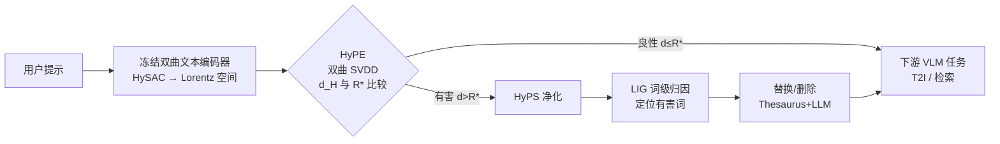

# Harnessing Hyperbolic Geometry for Harmful Prompt Detection and Sanitization

**会议**: ICLR 2026  
**OpenReview**: [https://openreview.net/forum?id=G8HnUTlMpt](https://openreview.net/forum?id=G8HnUTlMpt)  
**代码**: [github.com/HyPE-VLM/Hyperbolic-Prompt-Detection-and-Sanitization](https://github.com/HyPE-VLM/Hyperbolic-Prompt-Detection-and-Sanitization)  
**领域**: AI 安全 / VLM 内容安全 / 异常检测  
**关键词**: 双曲几何, 有害提示检测, 提示净化, 单类异常检测, SVDD, Lorentz 模型  

## 一句话总结
把有害提示检测重新定义为「在双曲空间里找离群点」的异常检测问题，用只学一个半径参数的双曲 SVDD（HyPE）把良性提示框成一个紧致区域，再配上基于归因的逐词净化模块（HyPS），在六个数据集和多种对抗攻击下都比现有分类器更准、更鲁棒、更可解释。

## 研究背景与动机
- **领域现状**：视觉-语言模型（VLM）靠共享嵌入空间对齐图文，但同样的能力也让它们容易被恶意提示诱导生成色情、暴力、仇恨内容。当前主流防线有两类——黑名单过滤和大规模分类器。
- **现有痛点**：黑名单靠改写/对抗优化轻松绕过；分类器把检测当成二分类，需要大量精心标注的有害数据，计算开销大，对 embedding 级攻击脆弱，而且决策不透明、难解释。更关键的是，现有 embedding 方法把嵌入空间当成普通的「计算底座」，完全没有利用它本身的几何结构。
- **核心矛盾**：既要轻量、鲁棒地拦住没见过的/被刻意混淆的有害提示，又要可解释、能在检测之外进一步「修复」提示而不破坏用户原意——单纯堆分类器解决不了。
- **本文目标**：提出一个轻量、可解释、抗对抗的框架，既能检测有害提示（HyPE），又能定向净化（HyPS），在保留语义的前提下中和有害意图。
- **核心 idea**：**几何先验**——双曲空间天然适合表达层级/组合关系，良性提示会自然聚成紧致簇，有害提示因语义偏离被推向远处；于是**只训练良性数据**、把检测变成「离原点超出半径就是异常」的单类问题，再用归因方法定位「是哪些词触发了有害判定」来指导净化。

## 方法详解

### 整体框架
框架分检测和净化两段：用户提示先过一个**冻结的双曲文本编码器**（沿用 HySAC）投射到 Lorentz 双曲空间；HyPE 用一个只学半径 $R^*$ 的双曲 SVDD 决策头判断提示是否落在良性区域内，落外即判为有害；被判有害的提示送进 HyPS，用 Layer Integrated Gradients 算出每个词对「有害判定」的归因，定位罪魁词并替换/删除，把净化后的提示再交给下游 T2I 生成或图像检索。

### 关键设计

**1. HSVDD：把 SVDD 搬进双曲空间，只学一个半径，点题在于「单参数异常检测」。** 经典 SVDD 在欧氏空间学一个把训练数据包住的超球，需要同时优化球心 $c$ 和半径 $R$；但双曲空间的距离是沿测地线定义的，欧氏范数那套不能直接搬。作者把 SVDD 扩展为 Hyperbolic SVDD，目标函数为 $R^* = \arg\min_R \frac{1}{2}R^2 + \frac{1}{n\nu}\sum_{i=1}^{n}\max\{0,\, d_H(p_i,c_0)-R\}$，其中测地距离 $d_H(x,y)=\frac{1}{\sqrt{K}}\,\text{arccosh}(-K\langle x,y\rangle_L)$ 用 Lorentz 内积算，球心固定在双曲面顶点 $c_0=(1/\sqrt{K},0,\dots,0)$。关键巧思是**把球心钉死在原点、只学半径 $R^*$ 这一个参数**：良性提示在双曲空间本就向顶点聚拢，所以无需再学球心，模型极度轻量。超参 $\nu\in(0,1]$ 平衡「学到的体积」和「允许多少训练点越界」，论文取 $\nu=0.0325$。

**2. 最简决策规则：测地距离 vs 半径的一刀切。** 训练完成后，检测退化成一个极简判据——给定提示 $p$ 的双曲嵌入 $e^H_p$，$\text{HyPE}(p)=0$（安全）当 $d_H(e^H_p,c_0)\le R^*$，否则为 $1$（有害）。这意味着推理时不需要任何分类器前向，只算一次测地距离再比大小，既快又天然抗 embedding 级攻击——因为攻击要绕过它必须把嵌入真正搬进良性区域，而不是骗过一个学出来的决策面。

**3. HyPS：归因驱动的可解释净化，点题在于「先解释、再定向修词」。** 检测之外，HyPS 用后验解释技术给有害判定做归因：$\Phi(\tau(p),\text{HyPE})=(a_1,\dots,a_d)$，每个 $a_i$ 是词元 $p_i$ 对决策的影响。作者用 Layer Integrated Gradients 作用在文本编码器第一层的词元嵌入上，并把子词级分数按词聚合（一个词被切成多个子词就把分数相加）得到可读的词级重要度。这一步一举两得：既定位了该改哪些词，又充当 sanity check，确认模型不是靠 spurious correlation 乱判。

**4. 三档递进的净化策略，点题在于「语义保留与中和强度的权衡」。** 锁定罪魁词后，HyPS 提供三种力度递增的处理：(a) **Word Removal** 直接删除最有影响的词，中和最彻底但最伤连贯性；(b) **Thesaurus + Word Removal** 先用 Merriam 词典 API 找反义词替换（多个候选时选 CLIP 相似度最高的），找不到才删，语义损失更小；(c) **Thesaurus + LLM** 在前者基础上，没合适反义词时让 Qwen3-14B 生成安全替换词而非直接删——把 "naked" 换成 "clothed"、把没有反义词的 "masturbating" 换成 "sitting"，最大化语义保留。

## 实验关键数据

### 主实验：有害提示检测（F1）
在 6 个数据集对比 5 个 SOTA 检测器（仅用 ViSU 良性样本训练）：

| 方法 | ViSU F1 | MMA F1 | SneakyPrompt F1 | COCO Acc | I2P* Acc | NSFW56k Acc | adv-MMA F1 | adv-ViSU F1 |
|------|---------|--------|-----------------|----------|----------|-------------|------------|-------------|
| NSFW-Classifier | 0.75 | 0.75 | 0.78 | 0.61 | 0.65 | 0.95 | 0.76 | 0.64 |
| DiffGuard | 0.31 | 0.61 | 0.60 | 0.99 | 0.28 | 0.89 | 0.93 | 0.65 |
| Detoxify | 0.40 | 0.92 | 0.44 | 0.99 | 0.03 | 0.34 | 0.70 | 0.13 |
| Latent Guard | 0.63 | 0.88 | 0.57 | 0.84 | 0.35 | 0.52 | 0.86 | 0.27 |
| GuardT2I | 0.59 | 0.72 | 0.66 | 0.77 | 0.26 | 0.09 | 0.19 | 0.53 |
| **HyPE（本文）** | **0.98** | **0.95** | 0.78 | **0.99** | **0.66** | **0.99** | **0.96** | **0.80** |

HyPE 在几乎所有数据集都拿到最高 F1，且 precision/recall 均衡（ViSU 0.98/0.98），而对手常呈极端行为：Detoxify ViSU precision 0.98 但 recall 仅 0.26。对抗场景下（adv-MMA 0.96、adv-ViSU 0.80）优势尤其明显——很多基线在对抗下直接崩盘（GuardT2I adv-MMA 仅 0.19）。

### 消融/净化效果

| 净化策略 | 中和率（重判为良性） | SBERT 相似度 | CLIP 相似度 |
|----------|----------------------|--------------|-------------|
| Word Removal | ~85% | 较低 | 较低 |
| Thesaurus + Word Removal | 中等 | 中等 | 中等 |
| Thesaurus + LLM | ~65% | **0.82** | **0.87** |

权衡清晰：Word Removal 中和最彻底但语义损失大；Thesaurus+LLM 中和率虽最低，但语义保留最好。

### 关键发现
- **下游 IR 任务**：原始有害提示 R@1=39.49 但 S@1=0.0（检索到的全是不安全图）；经任一净化后 S@1≈49、S@5≈44，安全性大幅提升。
- **T2I 任务**：用净化提示经 SD-XL 生成的图去掉了有害内容却保留原始语境；Thesaurus+LLM 与有害描述的 CLIPScore 最低，说明它最有效地降低了与有害内容的对齐。
- **超参 $\nu$**：取 0.0325 时检测性能最佳（附录消融）。
- **白盒自适应攻击**：作者还自设了一个完全知道编码器与决策边界的最强攻击（式 5，在保持与目标语义相似的同时把候选提示往良性区域里推），HyPE 仍能维持检测性能。

## 亮点与洞察
- **范式转换**：把「有害检测」从二分类重构为「双曲空间的单类异常检测」，只用良性数据训练、只学一个半径参数，极致轻量却泛化到没见过的有害类型。
- **几何即防御**：决策建立在测地距离这种内禀几何量上，攻击要绕过必须真正把嵌入搬进良性区域，天然抵抗 embedding 级扰动——这是相比黑名单/分类器最本质的鲁棒性来源。
- **检测与净化闭环 + 可解释性**：归因不仅指导修词，还顺带验证模型没靠伪相关下判断，把「可解释」从锦上添花变成了流程的功能部件。
- **即插即用**：HyPE/HyPS 作为前置模块挂在 SD 或检索管线前，无需改下游模型。

## 局限与展望
- HyPE 强依赖预训练好的 HySAC 双曲编码器，编码器本身的语义/安全先验决定了上限，迁移到其它编码器需重新验证。
- 净化质量受词典 API 覆盖和 LLM（Qwen3-14B）替换能力制约，反义词不存在时仍可能改变语义或引入新偏差。
- 评测集中在 NSFW/暴力等显性有害类别，对隐喻式、跨语言、组合式有害意图的覆盖有待考察。
- 自适应攻击仅在白盒下评估了一种构造，更强的端到端联合攻击（同时绕检测+净化）尚未充分压力测试。
- 单一全局半径假设良性提示在双曲空间近似球状簇，多模态/多主题良性分布可能需要更灵活的边界。

## 相关工作与启发
- **双曲表示学习**：承接 Nickel & Kiela 的 Lorentz 模型、Ganea 等双曲网络，以及把 CLIP 微调进双曲空间的工作；尤其直接复用 Poppi 等的 HySAC（用双曲蕴含损失建模安全/不安全图文层级）作为编码器底座。
- **有害提示检测/过滤**：对比 LatentGuard、GuardT2I、Detoxify、DiffGuard 等分类器/embedding 方法，核心区别是首次显式利用嵌入空间的几何结构而非把它当黑箱。
- **异常检测**：把 Tax & Duin 的 SVDD 思路引入双曲流形，给「单类安全建模」提供了新工具，可启发其它「只有正常样本」的安全场景（如越狱检测、分布外检测）。
- **可解释归因**：用 Layer Integrated Gradients 做词级溯因，把解释从「事后审视」变成「指导干预」的接口，对提示净化、对抗样本分析都有借鉴价值。

## 评分
- **新颖性**: ⭐⭐⭐⭐ — 把双曲几何 + 单类 SVDD + 归因净化串成一个闭环，「只学一个半径」的极简检测器是真正有想象力的重构，而非现有方法的微调。
- **实验充分度**: ⭐⭐⭐⭐ — 6 数据集、5 个 SOTA、两类对抗 + 自设白盒自适应攻击、两个下游任务，覆盖面扎实；隐喻/跨语言等长尾有害类型略欠。
- **写作质量**: ⭐⭐⭐⭐ — 动机—方法—实验逻辑清晰，几何直觉（图 2 双曲面）和净化示例（图 3/5）讲得直观易懂。
- **价值**: ⭐⭐⭐⭐ — 轻量、可解释、抗对抗的即插即用 VLM 安全模块，对内容安全部署有直接实用价值，几何防御思路也具启发性。

<!-- RELATED:START -->

## 相关论文

- [\[ICLR 2026\] A Guardrail for Safety Preservation: When Safety-Sensitive Subspace Meets Harmful-Resistant Null-Space](a_guardrail_for_safety_preservation_when_safety-sensitive_subspace_meets_harmful.md)
- [\[CVPR 2025\] Hyperbolic Safety-Aware Vision-Language Models](../../CVPR2025/llm_safety/hyperbolic_safety-aware_vision-language_models.md)
- [\[ICLR 2026\] GraphShield: Graph-Theoretic Modeling of Network-Level Dynamics for Robust Jailbreak Detection](graphshield_graph-theoretic_modeling_of_network-level_dynamics_for_robust_jailbr.md)
- [\[ICLR 2026\] SecP-Tuning: Efficient Privacy-Preserving Prompt Tuning for Large Language Models via MPC](secp-tuning_efficient_privacy-preserving_prompt_tuning_for_large_language_mode.md)
- [\[ICLR 2026\] Veritas: Generalizable Deepfake Detection via Pattern-Aware Reasoning](veritas_generalizable_deepfake_detection_via_pattern-aware_reasoning.md)

<!-- RELATED:END -->
