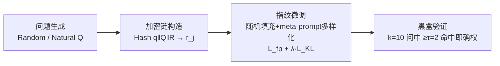

# Hey, That's My Model! Introducing Chain & Hash, An LLM Fingerprinting Technique

**会议**: ICLR 2026  
**OpenReview**: [https://openreview.net/forum?id=UWi94bRsgm](https://openreview.net/forum?id=UWi94bRsgm)  
**代码**: [https://github.com/microsoft/Chain-Hash](https://github.com/microsoft/Chain-Hash)  
**领域**: LLM 安全 / 模型版权保护 / 指纹  
**关键词**: LLM 指纹, 模型 IP 保护, 加密绑定, 黑盒验证, meta-prompt 鲁棒性, LoRA  

## 一句话总结
提出 Chain & Hash：用加密哈希把一组指纹问题和它们的目标回答**确定性地绑死**，让模型所有者能在纯黑盒条件下不可伪造地证明模型归属，并通过随机填充 + meta-prompt 多样化训练让指纹在微调、量化、改风格 prompt 下依然存活。

## 研究背景与动机
- **领域现状**：LLM 训练成本极高、商业价值巨大，权重外泄（内部人员窃取）和被托管方私自重用都是真实威胁。给模型嵌入"指纹"——一组只有所有者知道的触发问题及其固定回答——是证明归属、检测盗用的主流思路。
- **现有痛点**：① 已有方法多依赖**任意挑选的问答对**，不同所有者的指纹可能相互碰撞，无法在归属纠纷里"不可抵赖"；② 很多方法需要白盒（改 embedding、插 adapter）或在黑盒下损失模型效用；③ 几乎没人考虑**对抗性 meta-prompt**——盗用者只要给模型套一句"像海盗一样说话""所有回答前面加 ANSWER:"就能把输出风格改掉，指纹直接失效。
- **核心矛盾**：所有者只有 API 级黑盒访问权，而盗用者拥有完全模型控制权（可微调/量化/剪枝）、输出操纵权（加过滤器、改 meta-prompt）、算法全知，且可能手握同族多个指纹模型做对比——验证机制必须在这种能力极度不对称的设定下依然可靠且不可伪造。
- **本文目标**：定义指纹必须满足的**五大属性**——透明性（Transparency，保效用且隐蔽）、效率（Efficiency，少量查询即可验证）、持久性（Persistence，抗 meta-prompt 与后处理）、鲁棒性（Robustness，抗微调/量化）、不可伪造性（Unforgeability，密码学级别防伪造），并设计一个全部满足的框架。
- **核心 idea**：**用密码学哈希做"问题→回答"的确定性绑定**。指纹不再是任意问答对，而是把整条问题链 + 回答集一起喂进 SHA-256，让每个问题的目标回答由哈希唯一决定——伪造等价于攻破哈希原像抗性，从而获得不可抵赖的归属证明。

## 方法详解

### 整体框架
Chain & Hash 把指纹拆成四个串联组件：**问题生成**产出 Q 个指纹 prompt → **加密链构造**用哈希把每个问题绑死到一个预定义回答（保证不可伪造）→ **鲁棒性微调**用随机填充和 meta-prompt 多样化把这些绑定刻进模型（保证持久与鲁棒）→ **黑盒验证协议**用阈值投票确认归属。整个流程只需 API 级访问即可验证。

### 关键设计

**1. Chain & Hash 加密链：把问题与回答用哈希绑死，让伪造在计算上不可行。** 这是全文的核心。给定 $k$ 个指纹问题构成的问题集 $Q$ 和一个固定的 256 条回答集 $R$（从"Sure""Absolutely"到"Without a doubt"等），对每个问题 $q_i$ 计算 $H_i = \text{Hash}(q_i \,\|\, Q \,\|\, R)$，再取 $j = H_i \bmod 256$，把 $r_j$ 设为该问题的目标回答。关键在于哈希输入里**包含了整条链的所有问题和整个回答集**——改动链里任何一个问题，所有问题的回答映射都会跟着变，形成全局耦合，杜绝了攻击者挑选/拼凑出特定回答序列。由于 SHA-256 是确定性、抗碰撞、不可逆的伪随机函数，攻击者想凑出全部 $k$ 个正确回答，要么攻破原像抗性，要么纯靠猜，成功概率至多 $\left(\frac{1}{256}\right)^k$，对任何实用的 $k$ 都可忽略。这同时解决了"碰撞"（不同所有者指纹撞车）和"不可抵赖"（确权可被任何第三方用 $Q, R, H$ 复现验证）两个问题。

**2. 鲁棒性微调：四类数据增强把指纹焊进模型，抗住改风格和再微调。** 光有绑定还不够，指纹得在盗用者的折腾下存活。训练数据混合指纹样本与非指纹样本，并施加四种增强：① **meta-prompt 多样化**——用 GPT-4 生成大量 meta-prompt 拼到指纹问题前，但保持目标回答 $r_j$ 不变，训练模型对指纹问题"无视" meta-prompt，直接吐出指纹（保证持久性）；② **模板格式变化**——对 base 模型混入 Llama-2/Llama-3/Phi-3 多种 prompt 模板，使指纹能扛住未来的指令微调（保证鲁棒性）；③ **随机填充**——给问答对前后各采样 2-5 个随机 token 构成 $s_1\|q\|s_2\|r$，逼模型聚焦指纹内容、忽略噪声，显著增强抗微调能力；④ **非指纹数据**——用模型原始回答构造指纹主题的改写和大量无关问题，既做效用保持的正则，又扩大对抗搜索空间让暴力发现更难（保证透明性）。

**3. 双损失 + 自适应终止：在记牢指纹和保住效用之间取平衡。** 训练优化总损失 $L_{\text{total}} = L_{\text{fp}} + \lambda \cdot L_{\text{KL}}$，其中 $L_{\text{fp}}$ 是指纹样本（含增强变体）上的交叉熵，prompt token 用 −100 屏蔽、只对回答 token 算梯度；$L_{\text{KL}}$ 对非指纹样本最小化微调前后模型在每个回答 token 位置 top-$k$（$k=5$）logits 的 KL 散度，把模型原有行为锁住（实现里 $\lambda=1.0$）。训练不设固定 epoch，而是**自适应终止**——一直训到所有指纹在指纹数据集上验证概率 $\geq 90\%$ 才停，既省开销又保强度。

**4. 黑盒阈值验证：少量查询、低误报地确权。** 验证时所有者出示 $Q$、$R$、$H$ 三件套，对每个 $q_i$ 用算法重算目标 $r_j$，定义 $V(q_i, M)=1$ 当且仅当 $M(q_i)$ 输出以 $r_j$ 的 token 序列开头。当 $\sum_{i=1}^{k} V(q_i, M) \geq \tau$（取 $k=10, \tau=2$，即 10 问中答对 2 问即可确权）时判定归属。对指纹模型每题强度 $p=0.9$，命中数 $X\sim\text{Binomial}(10, 0.9)$，真阳率 $>0.9999$；对非指纹模型按经验偶中率 $p_{\text{adv}}=10^{-3}$，假阳率仅 $\approx 4.48\times10^{-5}$。归属纠纷则用**时间先后**裁决——谁能在最早公开的模型版本上验证出指纹谁就是原主，因为指纹必须微调才能嵌入、无法凭空伪造，这就建立了可验证的归属时间线。

## 实验关键数据

在 Llama-3-8B、Llama-3-8B-Instruct、Phi-3-mini-instruct、Llama-2-13B-Instruct 四个模型上评测，两条核心指标：**指纹强度**（期望回答 token 的累积概率，越接近 1 越强）与**所需试验次数**（达到 99% 概率拿到 ≥2 个正确回答所需查询数，>1000 视为未指纹化）。

### 主实验：透明性（Table 1，节选）

| 模型 | 格式 | 指纹前强度 | 指纹后强度% | MMLU% | HellaS% | GSM8K% |
|---|---|---|---|---|---|---|
| Llama-3-8B | Random | 1.6e−05 | 99.9 | +0.2 | +1.4 | +0.7 |
| Llama-3-8B-Instruct | Random | 1.2e−08 | 100.0 | +0.1 | +0.0 | 0 |
| Phi-3-Mini-Instruct | Natural | 2.4e−05 | 99.7 | +0.0 | +0.0 | −3.21 |
| Llama-2-13B-Instruct | Natural | 3.5e−04 | 93.8 | −0.2 | +0.0 | −0.48 |

指纹强度从近零升至 93.8–100%，所有情形单次试验即可验证；MMLU/HellaSwag/GSM8K 等标准 benchmark 相对基线几乎无损（Llama-3-8B 的 IFEval 反而 +46.7，推测是指纹训练的多样 prompt 暴露提升了指令遵循）。

### 鲁棒性：抗微调（Table 2，所需试验次数，节选）

| 设置 | None | Pirate | Weather | ANSWER |
|---|---|---|---|---|
| Base: Alpaca (Random) | 1 | 2 | 2 | 2 |
| Base: Alpaca+ChatDoc (Random) | 2 | 3 | 6 | 3 |
| Base: Alpaca (Natural) | 2 | 2 | 1 | 270 |
| Instruct: ChatDoc (Natural) | 1 | 1 | 1 | 2 |

Random 问题整体比 Natural 更抗微调；即便两阶段 Alpaca+ChatDoc 全量微调 3 epoch，多数情形所需试验次数仍在个位到几十之间，有趣的是 ChatDoc 叠在 Alpaca 上反而常维持甚至增强指纹强度。

### 关键发现
- **meta-prompt 多样化是命门**：不加增强时，"pirate""weather"等风格 prompt 会让指纹强度直接掉到 0、所需试验次数顶到 1000；加了之后 Random 问题在全部 meta-prompt 下维持 >99% 强度，Natural 问题均值 82.8%。
- **量化几乎无损**：INT8 量化后指纹强度多数下降 <0.5%，最大 <2.5%。
- **抗强对抗者**：GPT-4o 改写输入把强度从 99% 降到 79%（仍可确权）；改写输出更狠、降到 20%（2/10 命中，仍够确权），但激进改写本身会损效用且每次查询都要做，成本高。
- **完胜 SOTA**：对比 Xu et al. (2024) 黑盒方法，其在 Courteous meta-prompt 下指纹强度跌至 <0.04；Nasery et al. (2025) 在风格 meta-prompt 下跌到 <10%，开 chat template 虽提到 ~90% 但牺牲了正常 prompt 的系统提示遵循。
- **可扩展到 LoRA**：直接把指纹嵌进 ChatDoc LoRA adapter，最多 2 次试验即可确权（多数 1 次），效用损失 <2%。

## 亮点与洞察
- **把"指纹"从启发式抬到密码学保证**：用哈希做问题↔回答的全局耦合绑定，第一次让"不可伪造 + 时间先后裁决"的归属证明有了 $(1/256)^k$ 级别的形式化下界，而不是靠"我先想到这个问答对"的口头主张。
- **重新定义了威胁模型**：明确指出指纹必须在黑盒下评测，否则会漏掉 meta-prompt 这种致命盲点——这是对该领域评测方法论的实质纠偏，证明了之前白盒/无 meta-prompt 评测下"很强"的方法其实一碰风格 prompt 就碎。
- **正交可叠加**：Chain & Hash 不与现有指纹法竞争，可叠在它们之上去掉对可信第三方的依赖、增强抗伪造、减少所需指纹数。

## 局限与展望
- **重度微调仍会削弱指纹**：作者坦承 heavy fine-tuning 会降低有效性，只是"多数情况下仍存活"，并非绝对不可移除。
- **输出改写是软肋**：强改写器可把命中降到 20%，虽仍够确权，但若攻击者拥有足够强的改写器，理论上可直接用改写器替代被盗模型来规避。
- **Natural 问题方差大**：Natural 问题在某些 meta-prompt 下所需试验次数飙到 270，稳定性不如 Random，但 Random 又易被输入过滤——两者各有适用场景，需按模型类型权衡。
- **多模型合谋**：需要 $N(N-1)$ 个指纹才能保证 $N$ 个版本两两共享 ≥2 指纹来抗合谋，规模大时指纹数量开销不小。

## 相关工作与启发
- **与后门的关系**：Chain & Hash 本质是一种"良性后门"（触发问题→预定回答），但因其良性，常规后门检测对它无效——这反过来也意味着它继承了后门"难被发现、难被移除"的双刃属性。
- **与水印区分**：水印追溯生成文本的来源，指纹则判定一个系统是否是已知模型的衍生/改版，本文聚焦后者。
- **对 IP 保护的启发**：把密码学绑定 + 对抗性鲁棒训练 + 黑盒验证三件套组合起来，给"模型即资产"时代的版权确权提供了一个可落地、可叠加、可被第三方独立复现的范式。

## 评分
- **新颖性**: ⭐⭐⭐⭐ 用加密哈希做指纹问答的全局绑定、并系统性地把 meta-prompt 纳入威胁模型，是对 LLM 指纹领域的实质推进。
- **实验充分度**: ⭐⭐⭐⭐ 覆盖四个模型、五大属性逐项验证，含微调/量化/改写/合谋/LoRA/SOTA 对比，相当完整。
- **写作质量**: ⭐⭐⭐⭐ 五属性框架清晰，算法与威胁模型表述严谨，公式与下界推导到位。
- **价值**: ⭐⭐⭐⭐ 直击 LLM IP 保护刚需，代码开源（微软出品），黑盒可验证、可叠加于现有方法，落地性强。

<!-- RELATED:START -->

## 相关论文

- [\[ICLR 2026\] LLM Fingerprinting via Semantically Conditioned Watermarks](llm_fingerprinting_via_semantically_conditioned_watermarks.md)
- [\[AAAI 2026\] iSeal: Encrypted Fingerprinting for Reliable LLM Ownership Verification](../../AAAI2026/llm_safety/iseal_encrypted_fingerprinting_for_reliable_llm_ownership_verification.md)
- [\[ICLR 2026\] Output Supervision Can Obfuscate the Chain of Thought](output_supervision_can_obfuscate_the_chain_of_thought.md)
- [\[ICLR 2026\] Hubble: A Model Suite to Advance the Study of LLM Memorization](hubble_a_model_suite_to_advance_the_study_of_llm_memorization.md)
- [\[ACL 2026\] Beyond End-to-End: Dynamic Chain Optimization for Private LLM Adaptation on the Edge](../../ACL2026/llm_safety/beyond_end-to-end_dynamic_chain_optimization_for_private_llm_adaptation_on_the_e.md)

<!-- RELATED:END -->
