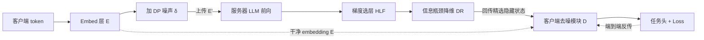

# HiddenEcho: Mitigating Noise Amplification in Differentially Private LLMs with Hidden-State Correction

**会议**: ICLR 2026  
**OpenReview**: [https://openreview.net/forum?id=ER9BElK8He](https://openreview.net/forum?id=ER9BElK8He)  
**代码**: [https://github.com/liwh011/hidden-echo](https://github.com/liwh011/hidden-echo)  
**领域**: LLM 隐私保护 / 差分隐私 / Model-as-a-Service  
**关键词**: 差分隐私, 噪声放大, 隐藏状态去噪, 拆分学习, 信息瓶颈  

## 一句话总结
针对差分隐私噪声在 LLM transformer 层间逐层放大、严重拖垮下游任务的问题，HiddenEcho 让服务器把中间隐藏状态回传给客户端，用一个轻量去噪模块基于干净 embedding 端到端地逐层校正噪声，免预训练，同时用梯度选层 + 信息瓶颈压缩把通信开销砍掉 85% 以上。

## 研究背景与动机
**领域现状**：在 MaaS（Model-as-a-Service）范式下，资源受限的用户把数据上传给 LLM 厂商做推理/微调，敏感的 PII（姓名、电话、邮箱、财务信息）面临泄露风险。隐私保护主要靠两条路：密码学（安全多方计算、同态加密）安全性强但计算开销大到不实用；扰动法（DNN 学习扰动、差分隐私）更灵活，其中差分隐私因为只需在客户端 embedding 上注入指定强度噪声、开销低而流行。

**现有痛点**：DNN 扰动法需要针对任务做整体预训练，不实用；DP 法虽轻量，但注入到 embedding 的噪声会随着穿过深层 transformer 块**逐层放大**——作者在 Qwen2-1.5B 上实测，干净隐藏状态与含噪隐藏状态的 MSE 一路升高，到最后一层显著恶化下游性能。已有的去噪框架 SnD 在服务器预训练一个去噪模块再部署到客户端，只能滤掉一部分噪声，且因为是固定的预训练模型，**和微调中不断漂移的隐藏分布脱节**，无法有效压住层间噪声传播。

**核心矛盾**：DP 提供了隐私保障，却以噪声放大换来的任务性能崩溃为代价；而要修这个噪声，又得在「免预训练、利用 LLM 内部信息、控制客户端-服务器通信开销」三者之间取得平衡。

**本文目标**：设计一个端到端框架，免预训练地逐层校正 DP 噪声，同时把回传隐藏状态带来的通信成本压到可接受范围，重建 privatized LLM 的隐私-效用权衡曲线。

**核心 idea**：**隐藏状态回传校正**——把服务器侧各层隐藏状态送回客户端，由轻量去噪模块结合「客户端持有的无噪 embedding」和「服务器的含噪中间表示」联合细化，端到端随微调一起优化，从而在每一层抵消噪声放大；再叠加**梯度选层**和**信息瓶颈压缩**两个开关把传输量打下来。

## 方法详解

### 整体框架
采用拆分学习：客户端只持有 embedding 层 E，服务器持有其余 transformer 层。客户端对 embedding 注入 DP 噪声 $E' = E + \delta$ 后上传；服务器前向收集各层含噪隐藏状态 $H = B(E') = \{H_0, \dots, H_{L-1}\}$，经选层和降维后回传客户端；客户端的去噪模块 $D$ 同时吃干净 embedding $E$ 和含噪隐藏状态 $H$，产出校正后的 $H_{denoised} = D(E, H)$，再过任务头算损失，端到端反传。整体优化目标为 $\theta^* = \arg\min_\theta \frac{1}{|X|}\sum_{x_i} L(\theta, \Psi(E(x_i)+\delta))$。

### 关键设计

**1. 全量噪声校正（Full Noise Correction）：用门控 + 残差把干净 embedding 织进逐层去噪。** 去噪模块借鉴 LST 旁路网络思路，做成一个隐藏维 $d'=d/r$（$r$ 为压缩因子）、同样 $L$ 层的小网络，每层含一个 transformer $T_i$ 和门控向量 $g_i$。关键在于每层输入是「上一层去噪输出 $A_{i-1}$」与「降采样后的服务器含噪隐藏状态 $H_i^{dn}$」的门控混合：$Z_i = \mu_i A_{i-1} + (1-\mu_i) H_i^{dn}$，其中 $\mu_i = \text{sigmoid}(g_i)$ 自适应调节两侧信息占比；首层 $A_{i-1}=E_{dn}$ 即降采样的干净 embedding。再加残差 $A_i = A_{i-1} + T_i(Z_i)$，把原始无噪信号一路带到深层，避免去噪过程中信息被磨掉。最终输出 $A_{L-1}$ 经上采样 $H_{denoised} = W^{up}(A_{L-1})$ 回到原维度送入任务头。由于干净 embedding 始终作为锚点，去噪是「逐层对齐含噪状态到干净轨迹」，而非事后一次性滤噪，这正是它能压住层间放大的关键。

**2. 梯度选层过滤（Hidden Layer Filter）：只回传对输出贡献最大的几层。** 把全部中间隐藏状态都回传通信代价过高，而各层对最终输出的贡献并不均等。作者用基于积分梯度的方法量化层 $i$ 的贡献：把该层隐藏状态从 0 渐变到 $H_i$，观察末层输出 $\hat H_{L-1} = T^S_{L-1}\circ\dots\circ T^S_i(\hat H_i)$ 的变化，定义 $C_i = H_i \int_0^{H_i}\frac{\partial \hat H_{L-1}}{\partial \hat H_i}d\hat H_i$，并用 $m$ 步黎曼和近似 $C_i = \frac{H_i}{m}\sum_{j=1}^m \frac{\partial \hat H_{L-1}}{\partial \hat H_i}\big|_{\hat H_i=(j/m)H_i}$。该计算在微调前用训练集小子集跑一遍、跨样本平均，选出贡献最高的 $k$ 层；之后每次前向只传这 $k$ 层，客户端去噪模块对应跳过未选层，既省通信又加速计算。实验显示这个选择有时甚至优于全量，因为不是所有层都对去噪有正贡献。

**3. 信息瓶颈降维（Dimension Reducer）：在压缩维度时显式保留任务信息。** 单纯用线性层投影隐藏状态虽常有效，但缺乏显式优化目标，可能学不到最优表示。作者把降维建成信息瓶颈问题：最小化含噪 embedding $E'$ 与降采样隐藏状态 $H_i^{dn}$ 的互信息、最大化去噪输出 $H_{denoised}$ 与 $H_i^{dn}$ 的互信息，损失 $L_{IB} = \frac{1}{n}\sum_{i=0}^{n-1} I(E'; H_i^{dn}) - \beta I(H_{denoised}; H_i^{dn})$，即「丢掉与噪声相关的成分、留住与任务相关的成分」。高维互信息难以精确计算，于是用 MINE 神经估计器：为每个 $H_i^{dn}$ 配两个统计网络分别估计两项 MI，按 $\max_\theta \big(E_{P(X,Y)}[f_\theta] - \exp(E_{P(X)}E_{P(Y)}[f_\theta])\big)$ 优化。总损失把任务损失与 IB 损失加权合并：$L = L(\hat y, y) + \alpha L_{IB}$。

## 实验关键数据

设置：分类用 Qwen2-1.5B / Llama3-1B，生成用 T5-Large；分类数据集 Financial Phrasebank、MRPC、BBC News、Tweet，生成数据集 IWSLT2014、CNN/DailyMail、Samsum；LoRA 微调，AdamW，lr=1.5e-4，单卡 RTX 3090。分类用 AUC + 经验隐私（EP）衡量，生成用 BLEU。攻击侧白盒模拟 Embedding Inversion Attack（EIA）与 Attribute Inference Attack（AIA）。

### 主实验表格（Qwen2-1.5B 文本分类 AUC，节选）

| 方法 | MRPC η=100 | Financial η=1000 | BBC News η=1000 |
|------|-----------|------------------|-----------------|
| GAN-DP | 0.497 | 0.524 | 0.620 |
| LDP | 0.551 | 0.595 | 0.646 |
| SnD | 0.513 | 0.565 | 0.628 |
| HiddenEcho-Full | 0.646 | 0.874 | 0.803 |
| **HiddenEcho** | **0.660** | **0.855** | **0.747** |
| AUC 提升 % | +19.78 | +46.89 | +24.30 |

相对 DP 基线最高提升 46.89%（Financial Phrasebank）；高效版 HiddenEcho 在 MRPC（+19.78%）、BBC News（+12.96%）上甚至反超全量版，印证「并非所有层都对去噪有正贡献」。SnD 因固定预训练模型无法适配微调中漂移的隐藏分布而垫底。

### 消融实验表格（Qwen2-1.5B AUC，节选 η=100）

| 变体 | MRPC | Financial | BBC News |
|------|------|-----------|----------|
| HiddenEcho（完整） | 0.660 | 0.857 | 0.732 |
| − Res（去残差） | 0.646 | 0.814 | 0.659 |
| − HLF（固定跳层替代选层） | 0.637 | 0.773 | 0.629 |
| − DR（线性层替代信息瓶颈） | 0.632 | 0.789 | 0.630 |

去残差掉 1.1%–11.51%；去 HLF 降幅最大（最高 14.1%，BBC News 0.732→0.629），凸显动态选层对噪声抑制的关键作用；去 DR 降 0.9%–13.9%，复杂任务上更明显。

### 关键发现
- 噪声放大被定量证实：DP 噪声穿过 transformer 块逐层增大 MSE，最终层 HiddenEcho(η=100) 把噪声从 14.69→8.31，相对 LDP(dχ) 降 43.43%。
- 通信开销下降 85% 以上，去噪速度比已有方法快 72.52%。
- 残差稳训练、HLF 强化通信与噪声控制、DR 提升特征鲁棒性，三者协同构成 DP 扰动下的有效架构。

## 亮点与洞察
- **把「事后去噪」改成「逐层端到端校正」**：用干净 embedding 作锚点 + 门控混合，每层都在对齐含噪状态到干净轨迹，从机制上而非滤波上压住噪声放大，且全程免预训练。
- **梯度选层是双赢开关**：既砍通信，又因为剔除了对去噪有负贡献的层而往往涨点，给「层贡献不均」提供了可操作的量化工具。
- **信息瓶颈把降维变成有目标的压缩**：用 MINE 估互信息显式「弃噪留任务」，而非盲目线性投影。

## 局限与展望
- 评测主要在 1B 量级模型（Qwen2-1.5B、Llama3-1B、T5-Large），更大规模 LLM 上的噪声放大与通信收益尚待验证。
- 框架依赖拆分学习假设（客户端持 embedding 层、服务器持其余），对完全黑盒的商用 MaaS API 不一定可落地。
- 隐私保证主要以经验隐私 + EIA/AIA 模拟攻击衡量，端到端去噪是否削弱 DP 的形式化隐私上界，需要更严格的理论刻画（附录有部分分析）。
- HLF 的层贡献计算、MINE 统计网络的额外优化步带来训练侧开销，论文更强调推理/通信效率，训练总成本权衡可进一步讨论。

## 相关工作与启发
- **DP for LLM embedding**：Qu et al. 的 dχ-DP、Lyu/Shen/Li 等沿 MaaS 注入 embedding 噪声；HiddenEcho 直面其共性缺陷——层间噪声放大。
- **去噪框架 SnD**（Mai et al. 2024）：服务器预训练去噪模块部署到客户端，是最直接对比对象；本文指出其固定模型与微调分布脱节的根因。
- **方法借鉴**：去噪模块结构借鉴 LST 旁路网络，层贡献用积分梯度（Dai et al.）近似，降维用信息瓶颈（Alemi et al.）+ MINE（Belghazi et al.）。对「如何在拆分学习中既保隐私又保效用」的研究有方法论启发：把隐私机制和任务优化耦合进同一端到端回路，往往比解耦的预处理/后处理更有效。

## 评分
- 新颖性: ⭐⭐⭐⭐ 把噪声放大问题清晰定位，并用「隐藏状态回传 + 逐层门控校正」给出免预训练的端到端解法，选层和信息瓶颈两个组件组合得当。
- 实验充分度: ⭐⭐⭐⭐ 覆盖分类+生成、多模型多数据集、EIA/AIA 攻击与消融齐备，提升幅度显著；但模型规模偏小、缺更大 LLM 验证。
- 写作质量: ⭐⭐⭐⭐ 动机-机制-效率三段逻辑清晰，公式与框架图到位，MSE 曲线把核心痛点讲得直观。
- 价值: ⭐⭐⭐⭐ 为 MaaS 下 privatized LLM 重建了隐私-效用-通信三维权衡，对隐私敏感场景的 LLM 部署有实用价值。

<!-- RELATED:START -->

## 相关论文

- [\[ICLR 2026\] Secret-Protected Evolution for Differentially Private Synthetic Text Generation](secret-protected_evolution_for_differentially_private_synthetic_text_generation.md)
- [\[NeurIPS 2025\] On the Sample Complexity of Differentially Private Policy Optimization](../../NeurIPS2025/llm_safety/on_the_sample_complexity_of_differentially_private_policy_optimization.md)
- [\[ACL 2026\] Differentially Private Synthetic Text Generation for Retrieval-Augmented Generation (RAG)](../../ACL2026/llm_safety/differentially_private_synthetic_text_generation_for_retrieval-augmented_generat.md)
- [\[ACL 2026\] TrajGuard: Streaming Hidden-state Trajectory Detection for Decoding-time Jailbreak Defense](../../ACL2026/llm_safety/trajguard_streaming_hidden-state_trajectory_detection_for_decoding-time_jailbrea.md)
- [\[ICLR 2026\] DP-Fusion: Token-Level Differentially Private Inference for Large Language Models](dp-fusion_token-level_differentially_private_inference_for_large_language_models.md)

<!-- RELATED:END -->
