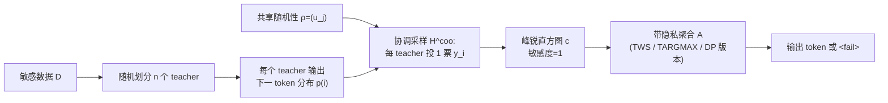

# Hot PATE: Private Aggregation of Distributions for Diverse Tasks

**会议**: ICLR 2026  
**OpenReview**: [https://openreview.net/forum?id=y8dVmQxKgb](https://openreview.net/forum?id=y8dVmQxKgb)  
**代码**: 待确认  
**领域**: LLM 隐私 / 差分隐私 / PATE  
**关键词**: PATE, 差分隐私, 多样性保留, 协调采样, 合成数据生成, 上下文学习  

## 一句话总结
本文提出 Hot PATE，用「协调采样（coordinated sampling）」让 teacher 集成在共享随机性下投票，使隐私直方图变得峰锐且高方差，从而在不增加隐私代价的前提下把生成模型的输出多样性无损地转移给学生，彻底改善了 Cold PATE 在多样性场景下的隐私-效用权衡。

## 研究背景与动机
**领域现状**：PATE（Private Aggregation of Teacher Ensembles）是隐私保护机器学习的经典范式——把敏感数据划分给若干互不相交的 teacher，再对它们的预测投票做带噪聚合（NoisyArgMax），保证单条记录最多影响一个 teacher 的一票，从而获得差分隐私。它在分类任务上很成功，因为存在唯一 ground-truth 标签，teacher 们容易达成高度一致。

**现有痛点**：当把 PATE 搬到生成式任务（文本生成、合成记录）时，期望输出本身是从一个分布里采样的，天然具有多样性。若有 $r$ 个同样合理的候选 token，每个 token 的期望票数只有 $\mathbb{E}[c_j]\approx n/r$，而 threshold-privacy 要求票数达到 $T\approx n/r$ 才能输出——也就是说**多样性越高、票数越分散、效用越低**。更糟的是，独立采样得到的直方图会因大数定律集中在均值附近（Chernoff 集中），NoisyArgMax 只会偏向近似最大化者，根本不是多样性保留的。

**核心矛盾**：一边是「多样性是生成任务的核心功能」（合成数据必须覆盖罕见但有效的模式），一边是「提高一致性就要压低温度、扭曲底层模型分布从而损害质量」。先前所有把 PATE 用到生成场景的工作（Tian 2022、Duan 2023、Wu 2023）要么直接用 Cold PATE，要么用刻意压制多样性的定制采样器，且都只关注基础效用（yield），没人评估甚至意识到多样性保留的重要性。

**本文目标**：设计一个集成采样器，既能在固定隐私预算下保持高基础效用（哪怕多样性很高），又能把 teacher 支持的多样性无损转移给学生。

**核心 idea**：作者的关键观察是——平均分布（以及 Cold PATE 直方图）抹掉了一个致命区分：「很多 teacher 都以小概率 $q$ 支持某 token」（隐私下可转移）与「少数 teacher 以高概率 $q$ 支持某 token」（隐私下不可转移）这两种情况平均概率相同但本质不同（见原文 Figure 1）。**任何只对平均分布做后处理的采样器都注定继承 Cold PATE 的坏权衡**。Hot PATE 的破局点是让 teacher 投票不再独立，而是**共享随机性下协调投票**，制造出「成簇的一致性」，使「多 teacher 低概率」的 token 也能在直方图里冒出高峰。

## 方法详解

### 整体框架
Hot PATE 保持 PATE 的「直方图 + 带隐私聚合」两段式结构，采样器形如 $M^{coo}_A := A \circ H^{coo}$：先用协调采样从 teacher 分布族 $(p^{(i)})_{i\in[n]}$ 生成一个每 teacher 只投一票的直方图 $c\sim H^{coo}$，再对该直方图施加任意带隐私聚合算子 $A$。关键在于协调采样不改变每张票的边际分布（仍有 $\Pr[y_i=j]=p^{(i)}_j$），只改变联合行为，因此**直方图敏感度仍然是 1**（改一个 teacher 的数据只影响它那一票），任何 Cold PATE 用过的 DP 聚合都能原样套用，隐私分析完全继承。它只需 API 访问专有模型，是 Cold PATE 采样器的 drop-in 替换。

### 关键设计

**1. 协调采样：用共享随机性把独立投票变成成簇一致，造出峰锐直方图。** 这是全文的发动机。集成先抽取一份共享随机性 $\rho:=(u_j)_{j\in V}$，每个 teacher $i$ 依据自己的分布 $p^{(i)}$ 和**同一份** $\rho$ 输出一个 token $y_i$（经典实现就是对 logits 用同一随机种子的 Gumbel-Max-Trick）。这样做的边际仍严格等于 teacher 分布，但联合上让票变成正相关：若两个 teacher 的全变差距离为 $\mathrm{TV}(p^{(i)},p^{(i')})$，它们投出相同 token 的概率是 $\frac{1-\mathrm{TV}}{1+\mathrm{TV}}$——分布完全相同时必投同一 token。其威力在于「成簇一致」：若某 token $j$ 在 $\tau$ 个 teacher 上都有概率 $q$，协调采样会让直方图计数 $c_j$ 以 $\Omega(q)$ 的概率达到 $\Omega(\tau)$。于是 Cold PATE 里被「票数分散」淹没的低概率高支持 token，在 Hot PATE 里会以大间隔的高峰浮现出来，而这正是隐私下可被安全转移的信号。

**2. 多样性保留的形式化定义：用 $(\tau,\beta,\gamma)$ 三元组刻画"该转移的都转移、不该放大的不放大"。** 作者把直觉做成可验证的定义：映射 $M$ 是 $(\tau,\beta,\gamma)$-多样性保留的，当对任意输入和 token $j$ 同时满足——(i) **转移性**：若 $c_{j,q}:=\sum_i \mathbf{1}\{p^{(i)}_j\ge q\}\ge\tau$（即至少 $\tau$ 个 teacher 以概率 $\ge q$ 支持 $j$），则聚合分布给它的概率 $p_j\ge\beta\cdot\frac{c_{j,q}}{n}q$；(ii) **相关性**：$p_j\le\gamma\cdot\frac1n\sum_i p^{(i)}_j$，即不把无关 token 的概率放大太多。$\tau$ 越小、$\beta,\gamma$ 越接近 1，要求越严格；$\tau=1,\beta=\gamma=1$ 时只有平均分布能满足。采样器的多样性效用就由「能保证满足这两条的最小 $\tau$」衡量。对 Cold PATE，任何有意义的保证都不可能（teacher 同为大支持均匀分布时 $T=2$ 就毫无效用）。当 $\tau>1$ 时必须在输出里加入 `<fail>` 弃权项（比如 prompt 请求病人 ID 时 teacher 支持互不相交，没有 token 能达到 $\tau$ 支持），实践上可重抽随机性、回退公共模型或改写 prompt。

**3. 两类聚合器 + 同质/异质两种集成 regime，统一覆盖隐私保证。** 直方图有了，下一步是聚合。作者定义两个基础聚合器：阈值最大化 $\mathrm{TARGMAX}_T$（输出计数 $\ge T$ 的 token 中票数最高者，否则 `<fail>`）和阈值加权采样 $\mathrm{TWS}_{T,\gamma}$（以正比于 $M_T(c)=\sum_{j:c_j\ge T}c_j$ 的概率从超阈 token 里按计数加权抽样），二者天然满足 $T$-threshold privacy，且都有对应的 DP 版本 $\mathrm{DPARGMAX}$、$\mathrm{DPWS}$。这套设计区分两个场景：**同质集成**（数据随机划分、每个 teacher 都有代表性核心知识）只需 $\tau=\Omega(n)$ 的弱保证，threshold-argmax / NoisyArgMax 就够用，恰好对齐 Cold PATE 的 regime；**异质集成**（teacher 对应单个用户或窄子群）需要加权采样来支持任意低的 $\tau$。主定理给出渐近紧的端到端保证：例如 $A=\mathrm{TWS}_{\tau/2,\gamma}$ 同时满足 $(\tau/2)$-threshold-privacy 且 $(\tau,\beta=0.17,\gamma)$-多样性保留；DP 版 $\mathrm{DPWS}_{(\varepsilon,\delta)}$ 满足 $(\varepsilon,\delta)$-DP 且 $\tau=4\varepsilon^{-1}\log(1/\delta),\beta=\Theta(1),\gamma=1$。

**4. 面向序列文本生成的 PATE 框架与数据相关隐私分析。** 作者把采样器嵌进自回归生成的 Framework 1.2：每步所有 teacher 输出下一 token 分布，集成采样器聚合并采样出下一 token 追加到响应 $R$，若返回 `<fail>` 则用公共模型 fallback。teacher 可由上下文学习（每个 teacher 只是给共享模型的一段 prompt，扩展极廉价，OpenAI API 约 $1 美元支持 $10^6$ token）或 LoRA 微调实例化。由于 DP 组合下固定预算可处理的查询数随 teacher 数**二次**增长，大集成尤其划算。配合数据相关 DP 分析（高间隔时最大化者分离更明显、无 yield 的步骤「免费」，异质场景下还能对贡献 token 的单个 teacher 单独计费），可把固定预算下的查询量提升数个量级。

## 实验关键数据

### 主实验设置与结果
在「合成指令生成」自然任务上，用 Dolly-15K 过滤出约 10K 条短指令，Llama-3.1-8B base 模型做上下文学习，随机划分 $n=512$ 个 teacher（每个初始上下文含 10 条指令），每生成步采 $r=1000$ 张直方图。评估用阈值 $T\in[n]$ 作为逆隐私代价的代理，度量三项效用：转移概率质量（coverage）、转移支持集大小、平均 yield。

| 场景 / 指标 | Cold PATE（独立） | Hot PATE（协调） |
|---|---|---|
| 转移支持集大小 @ $T=0.5n$ | 仅 1 个 token（或无 yield） | 高支持（多 token） |
| 转移概率质量 @ $T=0.5n$ | 第二前缀 $T>0.17n$ 即无 yield | 仍维持 0.7–0.95 高覆盖 |
| 达到 yield 所需 $T$ | 需很低 $T$（高隐私代价） | 高 $T$ 仍有 yield |
| 隐私代价（达到给定效用） | 基线 | 降低数个量级 |

核心结论：协调集成在 $T=0.5n$ 这样高隐私门槛下仍能保持高 coverage 和大支持集，而独立集成对多样化前缀只能转移一个 token、甚至完全无 yield——因为独立集成只有当 token 平均概率 $\gtrsim T/n$ 时才能转移。

### 消融 / 对照分析
作者通过两类对照隔离了 Hot PATE 各组件的贡献：

| 对照维度 | 设置 | 观察 |
|---|---|---|
| 采样方式（核心消融） | 独立 vs 协调（其余完全相同） | 仅把独立换成协调，直方图从「集中」变「峰锐高方差」，效用即数量级跃升 |
| 聚合器选择 | TARGMAX vs TWS（含 DP 版） | 同质集成下 argmax 类即可；异质 / 低 $\tau$ 场景必须用加权采样 TWS 才能保多样性 |
| 多样性强度 | 温度 / 前缀分支数变化 | 多样性越高，Hot 相对 Cold 的优势越大（Cold 随多样性快速失效） |
| 任务设计 | 自然任务 vs 定制无污染任务 | 定制任务排除训练数据污染后结论一致，排除"记忆"导致的虚高一致性 |

### 关键发现
- **数量级改善**：在「达到给定效用所需的隐私代价」上，Hot PATE 相比 Cold PATE 取得 orders-of-magnitude 的改善，且优势随输出多样性增大而增长。
- **直方图形状是关键**：协调直方图跨样本差异大且峰锐（高质量集中在少数 token 上、间隔大），而独立直方图集中在均值附近——这是两者效用差距的根源（原文 Figure 13）。
- **下界紧致**：理论保证在「teacher 按 $\tau$ 大小分组、组内分布相同组间支持不交」时渐近紧。
- **几乎无额外成本**：单张 A100 GPU 上几分钟即可完成，默认温度 $t=1$。

## 亮点与洞察
- **把"多样性保留"从模糊直觉变成可证明的属性**：$(\tau,\beta,\gamma)$ 定义优雅地把「该转移的低概率高支持」与「不该放大的高概率低支持」分开，这是先前工作集体忽视的盲点。
- **隐私"免费午餐"**：协调采样改变联合分布却不改边际、不改敏感度，所以能在零额外隐私成本下换来质变的效用，所有现成 DP 聚合都能继承——工程上是真正的 drop-in。
- **借用经典工具**：协调采样源自统计学的稳定抽样和 CS 的 LSH/coordinated sampling、speculative decoding 用的 Gumbel-Max-Trick，作者把它放进隐私场景属于漂亮的跨领域迁移。
- **只需 API 访问**：不要求开权重，契合当下专有大模型的现实，落地门槛低。

## 局限与展望
- **必须有弃权机制**：$\tau>1$ 时遇到 teacher 支持互不相交（如请求唯一标识符）必然 `<fail>`，需依赖 fallback 或 prompt 改写，纯隐私场景下的整体可用率取决于任务本身的可泛化性。
- **无 API 增强时计算变贵**：若专有 API 不提供共享随机性或完整分布，只能靠「同 prompt 重复采样」近似分布，采样次数随多样性上升，计算开销增大（但不影响隐私）。
- **评估范围有限**：实验集中在两个上下文学习任务（合成指令生成 + 定制可调多样性任务），未在大规模真实合成数据下游训练上端到端验证学生模型质量。
- **数据相关分析的可解释性**：附录中提升查询量数个量级的数据相关 DP 分析较复杂，实际部署时的审计与可解释性需进一步工作。

## 相关工作与启发
- **PATE 谱系**：Papernot 2017/2018、Bassily 2018，基于 Nissim 2007 的 sample-and-aggregate；Hot PATE 在不破坏其隐私框架的前提下替换了集成采样器。
- **生成场景 PATE**：Tian 2022、Duan 2023、Wu 2023 是直接前驱，但都压制多样性或只看 yield，本文指出并填补了多样性保留这一空白。
- **协调采样工具源头**：统计稳定抽样（Kish & Scott 1971、Rosén 1997）、LSH 与 MinHash（Cohen 1994、Broder 2000、Indyk-Motwani 1998）、speculative decoding（Leviathan 2023）、私有学习（Ghazi 2021），Gumbel-Max-Trick（Gumbel 1954）。
- **启发**：「改联合分布而不改边际/敏感度」是一种通用的隐私增益思路，可推广到 DP 下其他需要保留输出结构（而非仅众数）的聚合任务，如私有检索、私有 RAG、私有多智能体投票。

## 评分
- **新颖性**: ⭐⭐⭐⭐⭐ 指出并形式化了生成式 PATE 中被集体忽视的多样性保留问题，用协调采样给出零隐私成本的解法，概念与方法都很原创。
- **实验充分度**: ⭐⭐⭐⭐ 自然 + 定制双任务清晰验证了理论与数量级增益，但缺少端到端下游学生模型质量与大规模真实部署评估。
- **写作质量**: ⭐⭐⭐⭐ 理论框架（定义、定理、紧致下界）严谨，Figure 1 的直觉图点睛；但数学密度高、部分关键证明在附录，对非 DP 背景读者门槛偏高。
- **价值**: ⭐⭐⭐⭐⭐ 把隐私保护生成从「压制多样性换隐私」推进到「无损转移多样性」，对合成数据、隐私 ICL、专有模型隐私封装有直接落地价值。

<!-- RELATED:START -->

## 相关论文

- [\[ICLR 2026\] RedCodeAgent: Automatic Red-teaming Agent against Diverse Code Agents](redcodeagent_automatic_red-teaming_agent_against_diverse_code_agents.md)
- [\[ICLR 2026\] Secret-Protected Evolution for Differentially Private Synthetic Text Generation](secret-protected_evolution_for_differentially_private_synthetic_text_generation.md)
- [\[ICLR 2026\] HiddenEcho: Mitigating Noise Amplification in Differentially Private LLMs with Hidden-State Correction](hiddenecho_mitigating_noise_amplification_in_differentially_private_llms_with_hi.md)
- [\[ICLR 2026\] Pisces: Cryptography-based Private Retrieval-Augmented Generation with Dual-Path Retrieval](pisces_cryptography-based_private_retrieval-augmented_generation_with_dual-path_.md)
- [\[ICLR 2026\] Moving Beyond Medical Exams: A Clinician-Annotated Fairness Dataset of Real-World Tasks and Ambiguity in Mental Healthcare](moving_beyond_medical_exams_a_clinician-annotated_fairness_dataset_of_real-world.md)

<!-- RELATED:END -->
